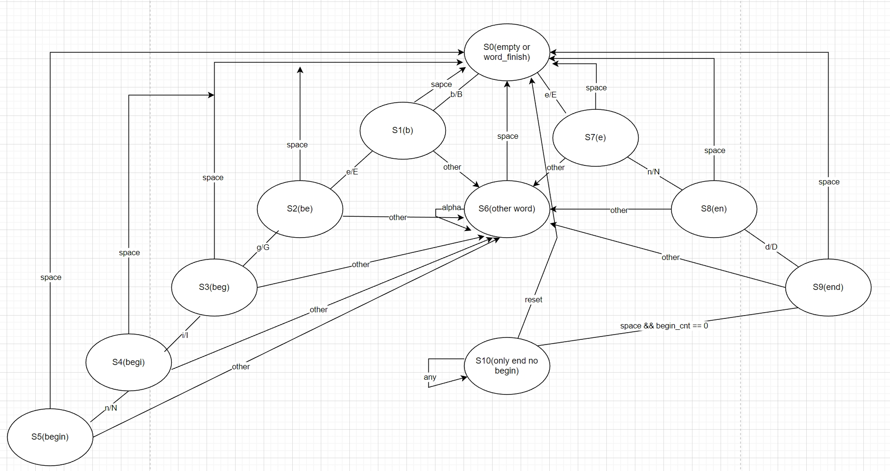

### 语句块模拟检查 P1_L1_BlockChecker

#### 一.题目要求

##### 1.题目描述

​	**输入ASCII字母和空格**，一个或多个连续出现的字母构成单词，单词不区分大小写，单词之间由一个或多个空格分隔开。检查工具检查自复位之后的输入中，begin和end是否能匹配。

注：

* 匹配的begin必须出现在end之前
* 一个begin只能匹配一个end
* 允许出现嵌套
* 出现不能按照规则匹配的begin或end,则匹配失败
* 保证在模块使用前进行复位

##### 2.IO定义

| 信号名  | 方向 | 描述                           |
| ------- | ---- | ------------------------------ |
| clk     | I    | 时钟信号                       |
| reset   | I    | 异步复位信号                   |
| in[7:0] | I    | 当前输入的ASCII码              |
| result  | O    | 当前输入能否完成begin和end匹配 |

**注意：输出result为“当前”的判断结果，即随着状态更新**

#### 2.状态转移图



**解释**：

1. 所有的单词都以空格表示结束对应回到S0状态
2. 如果之前没有出现过begin就出现end,之后无论输入什么都会输出0，设置为单独的状态S10，这个状态是自环的，无论输入什么都会回到S10，并输出0.

#### 3.verilog代码实现

```verilog
module BlockChecker (
    input wire clk,
    input wire reset,
    input wire [7:0] in,
    output reg result
);

reg [31:0] begin_cnt;
reg [15:0] status;

`define S0 16'b0000_0000_0000_0001
`define S1 16'b0000_0000_0000_0010
`define S2 16'b0000_0000_0000_0100
`define S3 16'b0000_0000_0000_1000
`define S4 16'b0000_0000_0001_0000
`define S5 16'b0000_0000_0010_0000
`define S6 16'b0000_0000_0100_0000
`define S7 16'b0000_0000_1000_0000
`define S8 16'b0000_0001_0000_0000
`define S9 16'b0000_0010_0000_0000
`define S10 16'b0000_0100_0000_0000

always @(posedge clk or posedge reset) begin
    if(reset)
    begin 
        begin_cnt <= 32'b0;
        status <= `S0;
        result <= 1'b1;
    end
    else 
    begin
        case (status)
            `S0:  //empty
            begin
                if(in == " ")
                begin
                    status <= `S0;
                end
                else if (in == "e"||in == "E")
                begin
                    status = `S7;
                end
                else if (in == "b"||in == "B")
                begin
                    status = `S1;
                end
                else
                begin
                    status = `S6;
                end
            end
            `S1:   //b
            begin
                if(in == "e"||in == "E")
                begin
                    status = `S2;
                end
                else if (in == " ")
                begin
                    status <= `S0;
                end
                else
                begin
                    status <= `S6;
                end
            end
            `S2:     //be
            begin
                if(in == "g"||in == "G")
                begin
                    status <= `S3;
                end
                else if (in == " ")
                begin
                    status <= `S0;
                end
                else
                begin
                    status <= `S6;
                end
            end
            `S3:   //beg
            begin
                if(in == "i"||in == "I")
                begin
                    status <= `S4;
                end
                 else if (in == " ")
                begin
                    status <= `S0;
                end
                else
                begin
                    status <= `S6;
                end
            end
            `S4: //begi
            begin
                if(in == "n"||in == "N")
                begin
                    status <= `S5;
                    result <= 1'b0;
                end
                 else if (in == " ")
                begin
                    status <= `S0;
                end
                else
                begin
                    status <= `S6;
                end
            end
            `S5:
            begin
                if(in == " ")
                begin
                    status <= `S0;
                    begin_cnt <= begin_cnt + 1;
                end
                else
                begin
                    status <= `S6;
                    if(begin_cnt == 32'b0000)
                    begin
                    result <= 1'b1;
                    end
                    else
                    begin
                    result <= result;
                    end
                end
            end
            `S6:
            begin
                if(in == " ")
                begin
                    status <= `S0;
                end
                else
                begin
                    status <= `S6;
                end
            end
            `S7:
            begin
                if(in == "n"||in =="N")
                begin
                    status = `S8;
                end
                else if (in == " ")
                begin
                    status <= `S0;
                end
                else 
                begin
                    status <= `S6;
                end
            end
            `S8:
            begin
                if(in == "d"||in == "D")
                begin
                    if(begin_cnt == 32'b0001)  //只剩余一个begin 可以完成配对
                    begin
                        status <= `S9;
                        result <= 1'b1;
                    end
                    else
                    begin
                        status <= `S9;
                        result <= 1'b0;
                    end
                end
                 else if (in == " ")
                begin
                    status <= `S0;
                end
                else 
                begin
                    status <= `S6;
                end
            end
            `S9:
            begin
                if(in == " ")  //确定匹配到的一定是end
                begin
					if(begin_cnt == 32'b0)  //还没有出现过begin 这种情况无论后便出现什么都是0
                    begin
                        status <= `S10;
                        result <= 1'b0;
                    end
                    else if(begin_cnt == 32'b1)
                    begin
                        status <= `S0;
                        result <= 1'b1;
                        begin_cnt = 32'b0000;
                    end
                    else if(begin_cnt > 32'b1)
                    begin
                        status <= `S0;
                        result <= 1'b0;
                        begin_cnt = begin_cnt - 32'b0001;
                    end
                end
                else  //匹配到的不是end
                begin
                    status <= `S6;
                    if(begin_cnt==32'b0)
                    begin
                        result <= 1'b1;
                    end
                    else
                    begin
                        result <= 1'b0;
                    end
                end
            end
            `S10:
            begin
                status <= `S10;
                result <=  1'b0;
            end
            default: 
            begin
                status <= status;
                result <= result;
            end
        endcase
    end
end
endmodule
```

#### 4.一个坑点

```veri
  `S5:
            begin
                if(in == " ")
                begin
                    status <= `S0;
                    begin_cnt <= begin_cnt + 1;
                end
                else
                begin
                    status <= `S6;
                    if(begin_cnt == 32'b0000)
                    begin
                    result <= 1'b1;
                    end
                    else
                    begin
                    result <= result;
                    end
                end
            end
```

​	**在进行单词begin的匹配时，需要对是否成功的匹配到begin做判断，一开始在两种之间来回改，后来才想到这是两种情况应该使用分支结构**：

* 如果之前没有成功匹配过begin:现在也没有匹配到begin,则下一周期输出应该是1，在这种情况下应当将匹配```N```时改动的result复位回1

* 如果之前成功匹配过begin:当前的匹配结果不应当影响之前的结果

  ```verilog
  result <= result 
  ```

  而不应当进行复位，如例子

  ```c
  begin begina
  ```

  这时即使第二次匹配begin失败，输出result也应当为1

​	

#### 5.特别致谢hugo && xmgg 帮忙看我的bug ```QAQ```
