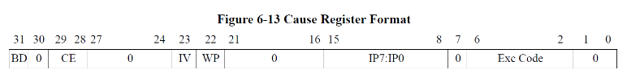
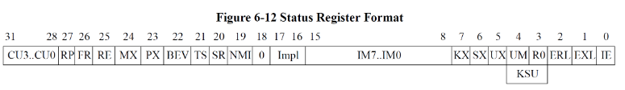
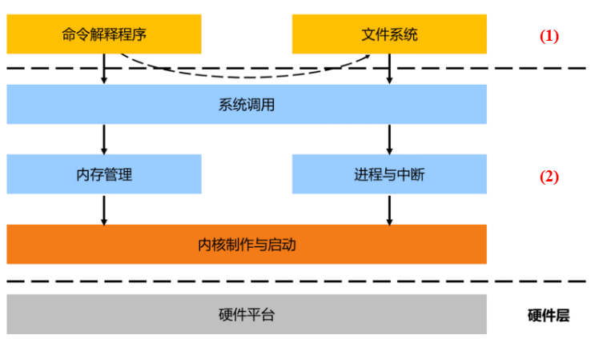
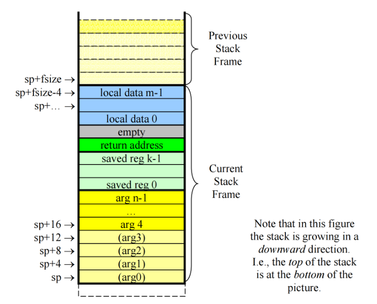

# <center>OSpre——从CO到OS：MIPS补充</center>

## 1.OS中对CO中CPU的补充

### 1.访存

* 在上学期的实验中我们实现了基于MIPS-C指令集的CPU，OS课程中使用基于MIPS32指令集的CPU

* 在CO中，我们的CPU**没有虚拟地址机制**，访存指令中的地址均为物理地址，物理地址直接到IM和DM中获取数据
* 在MIPS32中，汇编指令中的地址为**虚拟地址**，执行访存操作时，**虚拟地址**先被送入**MMU**进行**地址翻译、权限检查**，检查合法的访存操作，通过**MMU**得到物理地址
* 所有的软件（MIPS汇编，C语言编写软件等）均访问**虚拟地址**
* MIPS32的**MMU**支持基于**TLB**的**页式地址翻译**

### 2.CP0

* MIPS32中CP0功能
  * 记录中断及异常信息
  * 特权管理
  * 地址翻译控制

#### 1.中断异常相关

* cause寄存器

  

  * 15-8位：哪些中断等待处理，15-10位来自硬件，9-8位可以由软件写入。中断请求发生，对应位置置为1
  * 6-2位：异常编码
  * 31位：异常指令是否位于延迟槽

* EPC寄存器：保存异常发生的指令对应的PC地址，异常处理后返回

* BadVAddr寄存器：不合法的访存操作触发异常，该寄存器记录触发异常的访存地址

#### 2.特权管理相关

* 用户态，内核态

* status寄存器

  

  * 0位(`interrupt enable`)：全局中断使能位
  * 15-8位：中断使能位，八个中断输入的使能
  * 第4位和第1位：控制处理器的特权模式
    * UM = 1(`usermode`),EXL = 0(`exception level`)运行在用户态
    * 其他均为内核态

* (1)代表用户态，(2)代表内核态

  

## 2.MIPS调用规范

* 32个通用寄存器

  | 寄存器编号 | 助记符     | 用途                                                         |
  | :--------- | :--------- | :----------------------------------------------------------- |
  | 0          | zero       | 值总是为 0                                                   |
  | 1          | at         | （汇编暂存寄存器）一般由汇编器作为临时寄存器使用。           |
  | 2-3        | v0-v1      | 用于存放表达式的值或函数的整形、指针类型返回值。             |
  | 4-7        | a0-a3      | 用于函数传参。其值在函数调用的过程中不会被保存。若函数参数较多，多出来的参数会采用栈进行传递。 |
  | 8-15       | t0-t7      | 用于存放表达式的值的临时寄存器; 其值在函数调用的过程中不会被保存。 |
  | **16-23**  | **s0-s7**  | **保存寄存器; 这些寄存器中的值在经过函数调用后不会被改变。** |
  | 24-25      | t8-t9      | 用于存放表达式的值的临时寄存器; 其值在函数调用的过程中不会被保存。 |
  | 26-27      | k0-k1      | 仅在内核态下使用。                                           |
  | **28**     | **gp**     | **全局指针和内容指针。**                                     |
  | **29**     | **sp**     | **栈指针。**                                                 |
  | **30**     | **fp或s8** | **保存寄存器（同 s0-s7）。也可用作帧指针。**                 |
  | **31**     | **ra**     | **函数返回地址。**                                           |

  其中加粗的部分，是我们在函数调用中需要保留其值的寄存器。

* 栈帧

  每次调用函数时，都会对函数创建一个唯一的栈帧
  
  * 用于存储传递给此调用的函数参数的空间、
  * 存储已保存寄存器值的位置
  * 存储子程序返回地址的地方(ra)
  * 用于本地数据存储
  
  

​	**对调用的函数创造一个栈帧实际上就是为他分配一块他能支配的内存空间**

**注：我们对于计算机体系结构的理解是基于上学期MIPS-C架构的**

* **关于传递参数空间**：若是调用者向被调用者传递的参数不超过4，则完全可以通过```$a0-$a3```寄存器传递参数，即子程序只需要访问```$a0-$a3```寄存器即可访问到他需要的参数的值。**但是需要注意：我们在为子函数开辟栈空间时需要开辟保存在a0-a3寄存器中的参数的空间，只不过这部分空间不需要sw参数的值**，举个例子，例如调用者只向被调用者传递了一个参数，我们只需要开辟一个参数的空间，但不需要在空间中保存参数值。

  （**注：栈是向下生长的，我们为子函数开辟栈空间需要将sp向下移动，子函数调用结束后restore返回到上面**）

  ```
  addiu sp,sp,-4
  ```

  又例如我们向被调用者传递了6个参数，那么我们需要```4*6=24```个字节。其中前四个参数保存在```a0-a3```，这部分参数不需要在栈空间中保存，即```arg0-arg3```或```sp-sp+16```并不需要赋值，我们只需要在栈空间中保存多出来的参数

  ```
  sw $s0,20(sp)
  sw $s1,24(sp)
  ```

* **关于保留寄存器部分**：即```$s0-$s7```，在子函数运行过程中随意使用，结束后改回父函数中原来保存的值。
* **关于返回地址部分**：在MIPS架构中，子程序执行后跳转需要```jr $ra```指令完成，我们需要在栈空间中开辟空间保存```ra```地址。**举个例子，比如我们在编写MIPS代码时，涉及到递归调用，这时候就需要在每一层保存好ra值用来返回**

## 3.叶子子进程 & 非叶子子进程

* **simple leaf**

  不调用任何其他子例程，不使用栈上的任何内存空间（因为其不需要内存来保存局部变量或寄存器的值）。这样的函数不需要栈帧，也不需要更改 sp。

* **leaf with data**

  需要栈空间的叶函数（但不需要、不调用任何其他子例程），其栈帧可用于本地变量或寄存器的值的保存。这样的函数被调用后应当压栈（栈帧大小应该是 8 的倍数）。但是，ra 并不用保存在栈帧中。

* **nonleaf**

  函数内调用了其他函数。一个非叶函数的栈帧包含了上一节所述的大部分结构。

​	

