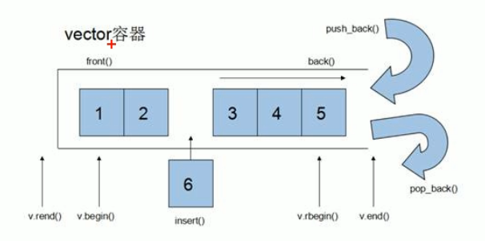
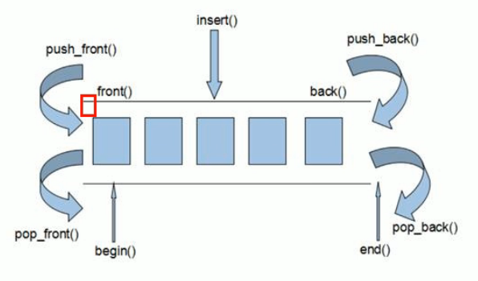
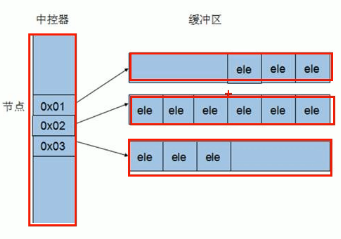
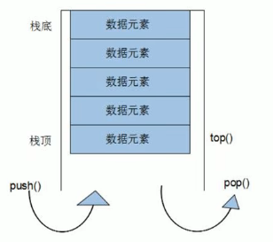
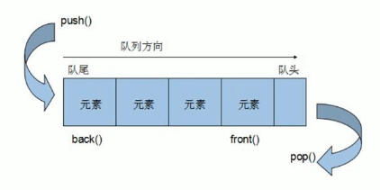
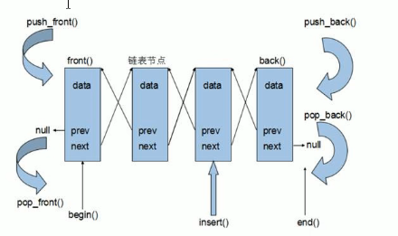

# CPP:STL库

> C++泛型编程和STL技术

## 1.模版

> 学习模版并不是为了写模版，而是在STL中能够运用系统提供的模版

### 1.1 函数模版

* 模版就是建立通用的模具，大大提高复用性
* **C++中另一种编程思想称为泛型编程，主要利用的技术就是模版**
* C++中提供两种模版机制：函数模版和类模版

#### 1.1.1 函数模版语法

* **建立一个通用函数，其函数的返回值类型和形参类型可以不具体指定，用一个虚拟的类型来代表**

* 语法：**``template``关键字声明一个通用数据类型T**

  ```c++
  template<typename T>
  函数声明或定义
  ```

  * ``template``声明创建模版
  * ``typename``表明其后面的符号是一种数据类型，可以用``class``代替
  * ``T``：通用的数据类型，名称可以替换

  ```c++
  template <typename T>
  void swap(T &a, T &b) {
      T temp = a;
      a = b;
      b = temp;
  }
  ```

* **自动类型推导**：我们在模版中使用通用类型``T``，当传入具体的数据类型时，根据该数据类型推导出``T``的类型

  ```c++
  swap(a,b);
  ```

* **显示指定类型**：在调用时指定数据类型

  ```c++
  swap<int>(a,b);
  ```

* **将类型参数化，提高复用性**

#### 1.1.2 函数模版注意事项

* **自动类型推导**：必须推导出一致的数据类型``T``才可以使用(传入一致的数据类型)
* 模版必须要确定出``T``的数据类型才可以使用

#### 1.1.3 普通函数和函数模版的区别

* 普通函数调用时可以发生自动类型转换（隐式类型转换）

* 函数模版调用时，用**自动类型推导不可以发生隐式类型转换**，因为不知道往哪里转

* 函数模版用**显示指定类型，可以发生隐式类型转换**，指定了转换到一个数据类型

  ```c++
  myAdd<int>(a, 'c');
  ```

* **隐式类型转换**：例如char和Int，Int与double之间的转换

* 建议使用指定显示类型的方式

#### 1.1.4 普通函数和函数模版的调用规则

> 普通函数与函数模版发生重载时

* 如果普通函数和函数模版都可以实现，**优先调用普通函数**

* 可以通过空模版参数列表来强制调用函数模版

  ```c++
  myPrint(a,b); // 调用普通函数
  myPrint<>(a,b); // 调用模板函数
  ```

* **函数模版可以发生函数重载**

* 函数模版可以产生更好地匹配，优先调用函数模版，**例如使用普通函数需要隐式类型转换时**

  ```c++
  char c = 'c';
  char d = 'd';
  myPrint(c,d); // 调用函数模版
  ```

* ~~一般来说实际开发中不会出现同时有普通函数和函数模版~~

#### 1.1.5 模版的局限性

* 例如

  ```c++
  template <class T>
  void f(T a, T b)
  {
      a = b;
  }
  ```

  * 如果传入的是数组，则无法实现

* **可以为特定的类型指定具体的模版**

* 例如以下函数模版
  ```c++
  class Person {
      public:
          string name;
          int age;
          Person (string name, int age) {
              this->name = name;
              this->age = age;
          }
  };
  
  template <class T>
  bool myCompare(T &a, T &b) {
      if (a == b) {
          return true;
      } else {
          return false;
      }
  }
  ```

  * 解决方案一：运算符重载``operator==``

    ```c++
    bool operator == (Person &a, Person &b) {
        if (a.name == b.name && a.age == b.age) {
            return true;
        } else {
            return false;
        }
    }
    ```

  * 解决方法二：若是多种运算符，则多次运算符重载，**麻烦！**

    * 可以针对特殊数据类型进行模版重载，具体化Person的模版实现

    ```c++
    template <> bool myCompare(Person &a, Person &b) {
        if (a.name == b.name && a.age == b.age) {
            return true;
        } else {
            return false;
        }
    }
    ```

### 1.2 类模版

#### 1.2.1 类模版语法

* 建立一个通用类，类中的成员数据类型可以不具体指定，**用一个虚拟的类型来代表**

* 语法

  ```c++
  template <class NameType, class AgeType> // 指定多通用数据类型的方式在函数模版中同样适用
  class Person{
      public :
      	NameType name;
      	AgeType age;
  }
  ```

* 说明

  * ``template``声明创建模版
  * ``class``后跟通用数据类型（多个）

* 指定模版参数列表

  ```c++
  Person<string, int>p1("孙悟空",999);
  ```

#### 1.2.2 类模版与函数模版区别

* **类模版没有自动类型推导的使用方式**，必须显示指定数据类型

* 类模版在模版参数列表中可以有默认参数，**即可以指定通用数据类型的默认类型**

  ```c++
  template <class NameType = string, class AgeType = int> // 给默认的数据类型
  Person p("dqr",20);    
  ```

  * 此时可以缺省已经给定的数据类型，不必指定数据类型

#### 1.2.3 类模版中成员函数创建时机

* **普通类中的成员函数一开始就可以创建**
* **类模版中的成员函数在调用时才创建**

#### 1.2.4 类模版对象做函数参数

* 类模版实例化出的对象，向函数传参

  * 指定传入的类型：直接显示对象的数据类型

    ```c++
    void printPerson1(Person<string, int>& p) {
        p.showPerson();
    }
    ```

  * 参数模版化：将对象中的参数变为模版进行传递

    ```c++
    template<class T1, class T2>
    void printPerson2(Person <T1, T2>& p) {
        cout << "T1 " << typeid(T1).name() << endl;
        cout << "T2 " << typeid(T2).name() << endl;
        p.showPerson();
    }
    ```

  * 整个类模版化：将这个对象类型模版化进行传递，我认为最方便

    ```c++
    template<class T>
    void printPerson3(T& p) {
        cout << "T " << typeid(T).name() << endl;
        p.showPerson();
    }
    ```

* **查看自动类型推导中转换的数据类型**

  ```c++
  typeid(T1).name
  ```

#### 1.2.5 类模版与继承

* 当子类继承的父类是一个类模版时，子类在声明时，**需要指定出父类中的数据类型**

  ```c++
  template <class T>
  class Base {
      T m;
  };
  class Son : public Base<int> {
  
  };
  ```

* 如果想要灵活的指定父类中的通用数据类型，**子类也需要变为类模版**

  ```c++
  template <class T>
  class Base {
      T m;
  };
  template <class T1, class T2>
  class Son : public Base<T1> { // 指定父类中通用数据类型用T1表示
      T2 obj;
  };
  ```

  * 子类指定父类中通用数据类型为通用数据类型``T1``，子类中通用数据类型为``T2``

#### 1.2.6 类模版成员函数类外实现

> 函数类内实现与类外实现

* 类外实现：

  * 类内声明
  * 类外实现，指定作用域为类模版(参数列表)

* 例子

  ```c++
  template <class T1, class T2>
  class Person {
  public:
      T1 name;
      T2 age;
      Person(T1 name, T2 age);
  };
  
  template <class T1, class T2>
  Person<T1, T2>::Person(T1 name, T2 age) {
      this->name = name;
      this->age = age;
  }
  ```

#### 1.2.7 类模版分文件编写

> **问题：类模版中成员函数创建时机是在调用阶段，导致分文件编写时链接不到**
>
> * 回顾：普通类的分文件编写
>   * ``.h``中编写类的声明(成员函数声明)
>   * ``.cpp``中编写类中成员函数的定义
> * 普通类成员函数一开始就创建，类模版中成员函数在调用时创建
> * 即调用时候才创建这个函数，编译时候找不到会发生错误

* 解决方式1：直接包含```.cpp```文件，包含什么相当于让编译器看什么

  ```c++
  #include "Person.h" // error
  #include "Person.cpp" // success
  ```

* 解决方式2：将声明和实现写到同一个文件中，并将后缀名更改为``.hpp``，表明这是类模版

  * ``.hpp``是约定的名称

> 小tips：vscode快捷键
>
> * 一段代码改为注释：``ctrl + K + C ``
> * 取消注释：``ctrl + K +U``

#### 1.2.8 类模版与友元

* 全局函数类内实现

  * 直接在类内声明友元即可

    ```c++
    template <class T1, class T2>
    class Person {
        friend void printPerson(Person<T1, T2> p) {
            cout << "Name: " << p.name << " Age: " << p.age << endl;
        }
    public:
        Person(T1 name, T2 age) {
            this->name = name;
            this->age = age;
        }
    
    private:
        T1 name;
        T2 age;
    };
    ```

* 全局函数类外实现：较麻烦，需要让编译器知道全局函数的存在

  * 此时全局函数需要模版化

  * 编译器需要提前知道有这个全局函数

    ```c++
    template <class T1, class T2> // 函数中用到这个类，让这个函数知道这个类
    class Person;
    
    template <class T1, class T2> // 让类知道这个函数
    void printPerson(Person<T1, T2> p) {
        cout << "name: " << p.name << " age: " << p.age << endl;
    }
    
    template <class T1, class T2>
    class Person {
        friend void printPerson<>(Person<T1, T2> p); // 函数模版声明
    public:
        Person(T1 name, T2 age) {
            this->name = name;
            this->age = age;
        }
    
    private:
        T1 name;
        T2 age;
    };
    ```

## 2. STL初识

### 2.1 STL基本概念

* 为了建立数据结构和算法的一套标准，诞生了STL
* ``STL:Standard Template Library``
* STL从广义上分为：**容器(``container``) 算法(``algorithm``) 迭代器(``iterator``)**
* 容器和算法之间通过迭代器进行无缝连接
* STL几乎所有代码都采用了模版类或模版函数

* STL六大组件
  * 容器：各种数据结构
    * 序列式容器：强调值的排序，元素有固定的位置
    * 关联式容器：二叉树结构，元素之间没有严格的物理顺序关系
  * 算法：各种常用算法
    * 质变算法：运算过程中改变区间内的元素内容，拷贝、删除、替换等
    * 非质变算法：运算过程中不会改变区间内的元素内容，查找、计数、遍历、寻找极值
  * 迭代器：容器和算法之间的胶合剂
    * 算法通过迭代器访问容器中的元素
    * 每个容器都有专属的迭代器
    * 迭代器种类：常用的为双向迭代器和随机访问迭代器
      * 输入迭代器：只读
      * 输出迭代器：只写
      * 前向迭代器：读写、向前推进
      * 双向迭代器：读写，向前和向后推进
      * 随机访问迭代器：读写、跳跃方式访问任意数据，**功能最强**
  * 仿函数：类似函数，可作为函数的某种策略
  * 适配器：用来修饰容器或仿函数或迭代器接口的东西
  * 空间配置器：负责空间的配置与管理

### 2.2 容器算法迭代器初识

> 使用某种容器需要包含对应的头文件
>
> ```c++
> #include <vector>
> ```
>
> 使用STL中提供的某种算法需要包含算法库
>
> ```c++
> #include <algorithm>
> ```

#### 2.2.1 ``vector``存放内置数据类型

* 容器：``vector``

* 算法：``for_each``

* 迭代器：``vector<int> :: iterator``，**可以按照指针理解**

* 三种迭代方式

  ```c++
  // 1
  vector<int>::iterator itBegin = v.begin(); 
  vector<int>::iterator itEnd = v.end(); // end是容器中最后一个元素的下一个位置
  while (itBegin != itEnd) {
      cout << *itBegin << " ";
      itBegin++;
  }
  // 2
  for (vector<int>::iterator it = v.begin(); it != v.end(); it++) {
      cout << *it << " ";
  }
  // 3
  for_each(v.begin(), v.end(), [](int val) {cout << val << " ";});
  ```

#### 2.2.2 ``vector``存放自定义数据类型

* 例如自定义Person类

  ```c++
      for (vector<Person> :: iterator it = v.begin(); it != v.end(); it++) {
          cout << "Name: " << it->name << " Age: " << it->age << endl;
      }
  ```

* 可以把迭代器变量当做一个指针理解，指针解引用的类型即为``<>``中的类型

#### 2.2.3 ``vector``容器嵌套容器

* 容器中嵌套容器，类似于二维数组

  ```c++
  for (vector<vector<int>>::iterator it = v.begin(); it != v.end(); it++) {
      for (vector<int>::iterator vit = (*it).begin(); vit != (*it).end(); vit++) {
          cout << *vit << " ";
      }
      cout << endl;
  }
  ```

## 3. STL常用容器

### 3.1 string容器

### 3.1.1 string基本概念

* ``string``是C++风格的字符串，本质上是一个类
* ``string``和``char *``的区别
  * ``char *``是一个指针
  * ``string``是一个类，类内部封装了``char *``
* ``string``类中封装了很多成员方法
  * find,copy,delete,replace,insert

#### 3.1.2 string构造函数

* 构造函数原形

  ```c++
  string(); // 创建一个空的字符串，例如 string str;
  string(const char *s); // 使用字符串s初始化
  string(const char &s); // 使用一个string对象初始化另一个string对象
  string(int n, char c); // 使用n个字符c初始化    
  ```

#### 3.1.3 string赋值操作

* 给string字符串赋值
  * 重载=运算符，使用``operator=``
  * 使用``assign``

#### 3.1.4 string字符串拼接

* 在字符串末尾拼接字符串

  * 重载+=运算符，使用``operator+=``

    ```c++
    string str1;
    str1 = "hello";
    str1 += "world";
    cout << str1 << endl;
    ```

  * 使用``append``

#### 3.1.5 string查找和替换

* 查找：查找指定字符串是否存在

  * ``find``

    ```c++
    int pos = find("dqr", 0);
    ```

    * 从指定的位置从左往右查找字符串
    * 如果有该子字符串，返回位置，**没有则返回-1**

  * ``rfind``

    ```c++
    int pos = rfind("dqr", 10);
    ```

    * 从指定位置从右往左查找字符串

* 替换：在指定的位置替换字符串

  * ``replace``

    ```c++
    string str1 = "abcdefg";
    str1.replace(1, 3, "1111");
    ```

  * 从起始位置pos后n个字符替换为字符串

#### 3.1.6 string字符串比较

* 使用``compare``进行比较：按照ASCII码值的大小逐个字符对比

* `` =``返回0
* ``>``返回1
* ``<``返回-1

```c++
if (str1.compare(str2) == 0) {
    cout << "str1 == str2" << endl;
} else if (str1.compare(str2) > 0) {
    cout << "str1 > str2" << endl;
} else {
    cout << "str1 < str2" << endl;
}
```

#### 3.1.7 string字符存取

* 通过``[]``方式存取，即重载``operator[]``
* 通过``at(int n)``方式

#### 3.1.8 string插入和删除

* 插入字符串``insert``

  ```c++
  insert(int pos, const char * s);
  ```

  * 从某位置插入字符串

* 删除字符串``erase``

  ```c++
  erase(int pos, int n);
  ```

  * 删除从``Pos``开始的``n``个字符

#### 3.1.9 string子串

* 从字符串中获取需要的子串``substr``

  ```c++
  substr(int pos, int n)
  ```

  * 从pos开始的n个字符组成的字符串

### 3.2 vector容器

#### 3.2.1 vector基本概念

* ``vector``数据结构和数组非常相似，也称为单端数组

* **不同之处在于数组为静态空间，vector可以动态扩展**

* **动态扩展**：并不是在原空间之后续接新空间，**而是找到更大的内存空间，然后将原数据拷贝到新空间，释放原空间**

* ``vector``是单端数组，只能在尾部操作，而不能在头部操作

  

* ``vector``容器的迭代器是**支持随机访问**的迭代器：常用的几个迭代器

  * ```v.begin()```指向第一个元素
  * ``v.end()``指向最后一个元素后一个位置

#### 3.2.2 vector构造函数

* 创建``vector``容器，构造函数原形

  ```c++
  vector <T> v; // 默认构造函数
  vector (v.begin(), v.end());// 将区间中的元素拷贝给自身
  vector (n,elem); // 将n个elem拷贝给自身
  vector (const vector& vec); //拷贝构造函数
  ```

* 例如

  ``` c++
  vector<int> v1;
  for (int i = 0; i < 10; i++) {
      v1.push_back(i);
  }
  vector<int> v2(v1.begin(), v1.end());
  vector<int> v3(10, 100);
  vector<int> v4(v3);
  ```

#### 3.2.3 vector赋值操作

* 使用``=``，即重载等号运算符``operator=``
* ``assign(begin, end)``
* ``assign(n, elem)``

#### 3.2.4 vector容量和大小

* 对``vector``容器的容量和大小进行操作
* ```empty()```：判断容器是否为空
* ```capacity()```：容器的容量
* ```size()```：返回容器中元素的个数
* ``resize(int num)``：重新指定容器的长度为```num```
  * 如果容器变长，则以默认值填充新位置
  * 如果容器变短，则超出容器长度部分被删除
* ```resize(int num, elem)```
  * 如果容器变长，则以elem填充新位置
  * 如果容器变短，则超出容器长度部分被删除

#### 3.2.5 vector插入和删除

* ``push_back(ele)``：尾部插入元素``ele``
* ``pop_back()``：删除最后一个元素
* ```insert(const_iterator pos, ele)```:向指定位置pos插入元素ele
* ```insert(const_iterator pos, int count, ele)```：向指定位置pos插入count个ele
* ```erase(const_iterator pos);```：删除迭代器指向的元素
* ``erase(const_iterator start, const_iterator end)``：删除迭代器从start到end之间的元素
* ```clear()```：删除容器中所有元素

#### 3.2.6 vector数据存取

* ```at(int idx)```：返回idx所指的数据
* ``operator[]``：返回索引idx所指的数据
* ```front()```：返回容器中第一个元素
* ``back()``：返回容器中最后一个元素

#### 3.2.7 vector互换容器

* ```swap```函数进行交换，相当于两个指向```vector```的指针交换

* 巧用``swap``可以收缩内存空间

  ```c++
  vector<int>(v).swap(v);
  ```

  * vector是一种动态数组，```capacity >= size```，一般来说```capacity > size```，这里的富裕空间大小随``size``增大，为了减少多出来的空间，需要内存收缩
  * ```vector<int>(v)```：用v初始化一个匿名对象，大小即为``v.size()``
  * ```swap```进行指针交换，匿名对象被回收

#### 3.2.8 vector预留空间

* 减少``vector``在动态扩展容量时的扩展次数
* ```reserve(int len)```：预留len个元素长度，预留位置不初始化，元素不可访问
* 如果能提前知道大概的元素个数，可以提前预留大致大小的空间，减少vector的动态扩展次数

### 3.3 deque容器

#### 3.3.1 deque容器基本概念

* 双端数组：可以对头端和尾端进行插入删除操作

* ``deque``与``vector``区别

  * ``vector``对头部插入删除效率低，数据量越大效率越低
  * ``deque``相对而言对头部插入删除速度更快
  * ``vector``访问元素速度更快，与两者内部实现有关

* 结构图

  

* ``deque``内部工作原理：``deque``内部有一个中控器，维护每段缓冲区中的内容，缓冲区中存放真实数据，中控器维护的是每个缓冲区的地址，使得使用``deque``像一片连续的内存空间

  

* ``deque``容器的迭代器支持随机访问

#### 3.3.2 deque构造函数

* 函数原型

  ```c++
  #include <deque>
  deque<T> deqT;
  deque(begin, end); // 构造函数将(begin, end)区间中的元素拷贝给本身
  deque(n, elem); // 构造函数将n个elem拷贝给本身
  deque(const deque &deq); // 拷贝构造函数
  ```

* 常量(只读)迭代器``const_iterator``

  ```c++
  void printDeque(const deque<int> &d) {
      for (deque<int> :: const_iterator it = d.begin(); it != d.end(); it++) {
          cout << *it << " ";
      }
      cout << endl;
  }
  ```

#### 3.3.3 deque赋值操作

* 函数原型
  * ``=``运算符重载，``operator=``
  * assign(begin, end)
  * assign(n, elem)

#### 3.3.4 deque大小操作

* ``deque.empty()``：判断容器是否为空
* ``deque.size()``：返回容器中元素的个数
* ``deque.resize(num)``：重新指定容器的长度
* ``deque.resize(num, elem)``

* **没有容量概念**

#### 3.3.5 deque插入和删除

* 两端插入操作

  * ``push_back(elem)``：尾插
  * ``push_front(elem)``：头插

  * ``pop_back()``：尾删
  * ``pop_front()``：头删

* 指定位置操作：**提供的位置是迭代器，而不是索引值1,2,3**

  * ``insert(pos, elem)``：在pos位置插入一个elem元素的拷贝，返回新数据位置
  * ``insert(pos,n,elem)``：在pos位置插入n个elem，无返回值
  * ``insert(pos,begin,end)``：在pos位置插入``[begin, end)``区间的数据，无返回值
  * ``clear()``：清空所有数据
  * ``erase(begin,end)``：删除区间内的所有数据，返回下一个数据位置
  * ``erase(pos)``：删除pos位置元素，返回下一个数据的位置

#### 3.3.6 deque数据存取

* ``at(int idx)``
* ``operator[]``
* ``front()``
* ``back()``

#### 3.3.7 deque排序

* 算法：``sort(iterator begin, iterator end)``，对begin和end之间的元素进行排序
* STL中提供的``sort``算法

* **默认是升序**

### 3.4 stack容器

#### 3.4.1 stack基本概念

* stack是一种先进后出的数据结构，只有一个出口

  

* 栈不允许有遍历的行为，只能访问栈顶的元素

* 入栈``push``

* 出栈``pop``

#### 3.4.2 stack常用接口

* 构造
  * ``stack<T> stk;``
  * ``stack(const stakc &s)``
* 赋值
  * 重载等号运算符``operator=``
* 数据存取
  * ``push(elem)``：栈顶添加元素
  * ``pop()``：栈顶移除元素
  * ``top()``：返回栈顶元素
* 大小操作
  * ```empty()```是否为空
  * ```size()```返回大小

### 3.5 queue容器

#### 3.5.1 queue基本概念

* 队列是一种先进先出的数据结构，有一个入口和一个出口

  

* 从队尾入队(``push``)，从队头出队(``pop``)

* 只有队头和队尾元素可见，不可以被遍历

#### 3.5.2 queue常用接口

* 构造函数

  * ```queue<T> que```
  * ```queue(const queue &q)```

* 赋值操作：重载等号运算符``opearator=``

* 数据存取

  * ``push(elem)``：在**队尾添加**元素
  * ``pop()``：从**队头移出**第一个元素
  * ``back()``：返回最后一个元素
  * ``front()``：返回第一个元素

* 大小操作

  * ``empty()``
  * ``size()``


### 3.6 list容器

#### 3.6.1 list基本概念

* 即链表，非连续存储结构

* 链表的组成：节点(数据域+指针域)

* 便于插入/删除，但遍历速度慢

  

* 链表中的迭代器只支持前移和后移，是**双向迭代器**

#### 3.6.2 list构造函数

* ```list<T> list```
* ```list(l.begin(), l.end())```
* ``list(const list & l)``
* ``list(n ,elem)``

#### 3.6.3 list赋值和交换

* 赋值
  * ``operator=``
  * ``assign``
* 交换：``swap``函数

#### 3.6.4 list大小操作

* ``empty()``
* ``size()``
* ``resize(num)``
* ``resize(num, elem)``

#### 3.6.5 list插入和删除

​	**注意提供的位置为迭代器，而不是数字索引**

* push_back(elem)
* pop_back()
* push_front(elem)
* pop_front()
* insert(pos,elem)
* insert(pos,n,elem)
* insert(pos,begin,end)
* clear()
* erase(begin,end)
* erase(pos)
* **remove(elem):删除所有与elem值匹配的元素**

#### 3.6.6 list 数据存取

* front()：第一个元素
* back()：最后一个元素
* 因为不支持随机访问迭代器，没有``at()``和``[]``

* list为双向迭代器

  ```c++
  list<int>:: iterator it = l1.begin();
  it++; // ok
  it = it + 1; // error
  ```

  * 双向迭代器：支持``++/--``，不支持+1等

* 小tips：用迭代器操作检验迭代器类型

#### 3.6.7 list 反转和排序

* 反转链表：``reverse()``
* 链表排序：``sort()``，默认为升序

* 以上两个函数均为list类内部的成员函数
* **对于不支持随机访问迭代器的数据结构，类内部提供相应的成员函数**
* **支持随机访问迭代器的数据结构则实现为全局函数**
* **对于需要自定义数据类型(多关键字排序)，需要指定排序规则**

### 3.7 set/multiset 容器

#### 3.7.1 set 基本概念

* 集合容器：所有元素在插入时自动被排序
* set/multiset属于关联式容器，底层结构使用二叉树实现
* set：不允许重复 multiset：多重集

#### 3.7.2 set 构造和赋值

* 构造``set<T> set``,``set(const set & s)``
* 赋值：``operator=``

* 插入``insert()``时，重复元素保留一个

#### 3.7.3 set 大小和交换

* size()
* empty()
* swap(s)

* 不允许resize

#### 3.7.4 set 插入和删除

* insert(elem)
* clear()
* erase(pos)
* erase(begin, end)
* erase(elem)

#### 3.7.5 set 查找和统计

* 查找：``find(key)``查找key是否存在，若存在返回该键元素的迭代器，若不存在返回``set.end()``
* 统计：``count(key)``统计key的元素个数

#### 3.7.6 set和multiset区别

* 单重集和多重集的区别

#### 3.7.7 pair 对组创建

* 成对出现的数据，可以利用对组返回两个数据
* ``pair <type, type> p (value1, value2)``
* ``pair <type, type> p = make_pair(value1, value2)``

```c++
pair<string, int> p = make_pair("Tom", 20);
cout << "first: " << p.first << " second: " << p.second << endl;
```

* 使用```.first/.second```访问对组中第一个元素/第二个元素

#### 3.7.8 set 容器排序

> 仿函数：使一个类的使用看上去像一个函数，其实现就是在类中实现一个operator()

* set容器默认排序从小到大，利用**仿函数**可以改变排序规则

* set容器中存放内置数据类型：**在创建容器时指定排序规则，在排序之前**

  ```c++
  class MyCompare {
  public:
      bool operator()(int v1, int v2) { // 降序
          return v1 > v2;
      }
  };
  
  void test01() {
      set<int, MyCompare> s;
      s.insert(10);
      s.insert(20);
      s.insert(30);
      s.insert(40);
      s.insert(50);
      for (set<int, MyCompare>::iterator it = s.begin(); it != s.end(); it++) {
          cout << *it << " ";
      }
  }
  ```

* set容器中存放自定义数据类型

  ```c++
  class MyCompare {
  public:
      bool operator()(const Person &p1, const Person &p2) {
          return p1.m_Age < p2.m_Age;
      }
  };
  
  void test01() {
      set<Person, MyCompare> s;
      s.insert(Person("刘", 24));
      s.insert(Person("关", 28));
      s.insert(Person("张", 25));
      s.insert(Person("赵", 31));
      for (set<Person>::iterator it = s.begin(); it != s.end(); it++) {
          cout << "姓名: " << it->m_Name << " 年龄: " << it->m_Age << endl;
      }
  }
  ```

### 3.8 map/multimap 容器

#### 3.8.1 map基本概念

* map中所有元素都是pair
* pair中第一个元素为key(``.first``)，第二个元素为value(``.second``)
* **所有元素都会根据元素的键值自动排序**

#### 3.8.2 map构造和赋值

* 默认构造函数``map<T1,T2> map``
* 拷贝构造函数``map(const map &m)``

* 赋值``operator=``

### 3.8.3 map 大小和交换

* size()
* empty()
* swap()

#### 3.8.4 map 插入和删除

* insert(pair)：插入对组

  ```c++
  m.insert(pair<int, int>(4, 40));
  m.insert(make_pair(5, 50));
  m[6] = 60; // 不建议 当访问该key不存在时会创建 主要用来访问 
  ```

* clear()

* erase(pos)：迭代器位置

* erase(begin, end)

* **erase(key)：按照键值删除**

#### 3.8.5 map 查找和统计

* ``find(key)``：返回迭代器，没找到则``map.end()``
* ``count(key)``

#### 3.8.6 map 容器排序

* 默认为从小到大排序
* **利用仿函数**

```c++
class MyCompare {
public:
    bool operator() (int v1, int v2) {
        return v1 > v2;
    }
};

void printMap(const map<int, int, MyCompare> &m) {
    for (map<int, int>::const_iterator it = m.begin(); it != m.end(); it++) {
        cout << "key: " << it->first << " value: " << it->second << endl;
    }
    cout << endl;
}

void test01() {
    map<int, int, MyCompare> m;
    m.insert(pair<int, int>(1, 10));
    m.insert(pair<int, int>(2, 20));
    m.insert(pair<int, int>(3, 30));
    m.insert(pair<int, int>(4, 40));
    m.insert(make_pair(5, 50));
    printMap(m);
}
```

## 4. STL-函数对象

### 4.1 函数对象

* **重载函数调用操作符operator()**的类，其对象通常称为函数对象

* 函数对象使用重载的()时，行为类似函数调用，也叫仿函数

* 函数对象使用时类似普通函数

  ```c++
  class Myadd {
  public:
      int operator()(int a, int b) {
          return a + b;
      }
  };
  
  void test01() {
      Myadd myadd;
      cout << myadd(10, 10) << endl;
  }
  ```

* 函数对象可以有自己的状态
  ```c++
  class Myprint {
  public:
      int count;
      Myprint() {
          count = 0;
      }
      void operator()(string s) {
          count++;
          cout << s << endl;
      }
  };
  
  void test02() {
      Myprint myprint;
      myprint("hello world");
      myprint("hello world");
      myprint("hello world");
      cout << "myprint count: " << myprint.count << endl;
  }
  ```

* **函数对象可以作为参数传递**

  ```c++
  class Myprint {
  public:
      int count;
      Myprint() {
          count = 0;
      }
      void operator()(string s) {
          count++;
          cout << s << endl;
      }
  };
  
  
  void doPrint(Myprint & mp, string s) {
      mp(s);
  }
  ```

### 4.2 谓词

#### 4.2.1 谓词概念

* 返回``bool``类型的仿函数称为谓词

* 如果``operator()``接受一个参数，则称为一元谓词

  ```c++
  class GreaterFive {
  public:
      bool operator()(int val) {
          return val > 5;
      }
  };
  
  void test01() {
      vector<int> v;
      for (int i = 0; i < 10; i++) {
          v.push_back(i);
      }
      vector<int>::iterator it = find_if(v.begin(), v.end(), GreaterFive()); //匿名函数对象
      if (it == v.end()) {
          cout << "未找到" << endl;
      } else {
          cout << "找到大于5的元素为: " << *it << endl;
      }
  }
  ```

* 如果``operator()``接受两个参数，则称为二元谓词，例如定义排序规则

  ```c++
  class MyCompare {
  public:
      bool operator()(int v1, int v2) {
          return v1 > v2;
      }
  };
  
  void test01() {
      vector<int> v;
      v.push_back(10);
      v.push_back(20);
      v.push_back(30);
      v.push_back(40);
      v.push_back(50);
      sort(v.begin(), v.end(), MyCompare());
  }
  ```

### 4.3 内建函数对象

> STL内建了一些函数对象
>
> * 算数仿函数
> * 关系仿函数
> * 逻辑仿函数
>
> ```c++
> #include <functional>
> ```

#### 4.3.1 算数仿函数

* 实现四则运算
* 其中``negate(取反)``是一元运算，其他都是二元运算

* 例子

  ```c++
  negate<int> n;
  cout << n(50) << endl;
  
  plus<int> p;
  cout << p(10, 20) << endl;
  ```

* 仿函数原型

  ```c++
  template <class T> T plus<T>;
  template <class T> T minus<T>;
  template <class T> T multiplies<T>;
  template <class T> T divides<T>;
  template <class T> T modules<T>;
  template <class T> T negate<T>;
  ```

#### 4.3.2 关系仿函数

* 仿函数原型

  ```c++
  template <class T> bool equal_to<T>;
  template <class T> bool not_equal_to<T>;
  template <class T> bool greater<T>;
  template <class T> bool greater_equal<T>;
  template <class T> bool less<T>;
  template <class T> bool less_equal<T>;
  ```

* 知道关系仿函数之后就不再需要在排序中定义降序仿函数

  ```c++
  sort(v.begin(), v.end(), greater<int>());
  ```

#### 4.3.3 逻辑仿函数

* 仿函数原型

  ```c++
  template <class T> bool logical_and<T>;
  template <class T> bool logical_or<T>;
  template <class T> bool logical_not<T>;
  ```

* 例子

  ```c++
  vector<bool> v;
  v.push_back(true);
  v.push_back(false);
  v.push_back(true);
  v.push_back(false);
  for (vector<bool>::iterator it = v.begin(); it != v.end(); it++) {
      cout << *it << " ";
  }
  cout << endl;
  vector<bool> v2;
  v2.resize(v.size());
  transform(v.begin(), v.end(), v2.begin(), logical_not<bool>());
  for (vector<bool>::iterator it = v2.begin(); it != v2.end(); it++) {
      cout << *it << " ";
  }
  ```

## 5. STL常用算法

* 算法主要是由头文件``<algorithm><functional><numeric>``组成
* ``<algorithm>``是所有STL头文件中最大的一个，设计到比较、交换、查找、遍历、复制、修改等
* ``<numeric>``体积很小，包含几个在序列上进行简单数学运算的模版函数
* ``<functional>``定义了一些模版类，用以声明函数对象

### 5.1 常用遍历算法

#### 5.1.1 for_each

* 遍历容器

* 函数原型：需要传入一个回调函数(函数对象、仿函数)用来实现功能

  ```c++
  for_each(iterator begin, iterator end, _func);
  ```

#### 5.1.2 transform

* 搬运一个容器到另一个容器中

* 函数原型：需要传入一个回调函数，用来实现在搬运过程中的功能，例如上面的搬运过程中取反

  ```c++
  transform(iterator begin1, iterator end1, iterator begin2, _func)
  ```

* **需要注意的是创建目标容器后，需要为目标容器提前开辟空间**

  ```c++
  vector <int> target;
  target.resize(v.size());
  transform(v.begin(), v.end(), target.begin(), MyTransform());
  ```

### 5.2 常用查找算法

#### 5.2.1 find

* 查找指定元素，找到返回指定元素的迭代器，找不到返回结束迭代器``end()``

* 函数原型

  ```c++
  find(iterator begin,iterator end, value);
  ```

* **对于自定义数据类型需要进行重载operator==**

  ```c++
  class Person {
  public:
      Person(string name, int age) {
          this->m_Name = name;
          this->m_Age = age;
      }
      string m_Name;
      int m_Age;
      bool operator==(const Person &p) { // !!!
          if(this->m_Name == p.m_Name && this->m_Age == p.m_Age) {
              return true;
          } else {
              return false;
          }
      }
  };
  
  void test02() {
      vector<Person> v;
      Person p1("aaa", 10);
      Person p2("bbb", 20);
      Person p3("ccc", 30);
      Person p4("ddd", 40);
      v.push_back(p1);
      v.push_back(p2);
      v.push_back(p3);
      v.push_back(p4);
      vector<Person>::iterator it = find(v.begin(), v.end(), p2);
      if(it == v.end()) {
          cout << "Not found" << endl;
      } else {
          cout << "Found" << endl;
      }
  }
  ```

#### 5.2.2 find_if

* 按条件查找元素

* 函数原型：``_Pred``函数或者谓词

  ```c++
  find_if(iterator begin, iterator end, _Pred);
  ```

* 查找自定义数据类型时需要定义谓词或比较函数

  ```c++
  class Person {
  public:
      Person(string name, int age) {
          this->m_Name = name;
          this->m_Age = age;
      }
      string m_Name;
      int m_Age;
  };
  
  bool myCompare(const Person &p) {
      if(p.m_Age > 20) {
          return true;
      } else {
          return false;
      }
  }
  
  void test02() {
      vector<Person> v;
      Person p1("aaa", 10);
      Person p2("bbb", 20);
      Person p3("ccc", 30);
      Person p4("ddd", 40);
      v.push_back(p1);
      v.push_back(p2);
      v.push_back(p3);
      v.push_back(p4);
      vector<Person>::iterator it = find_if(v.begin(), v.end(), myCompare);
      if(it == v.end()) {
          cout << "Not found" << endl;
      } else {
          cout << "Found" << endl;
      }
  }
  ```

#### 5.2.3 adjacent_find

* 查找相邻重复元素，**返回相邻重复元素的第一个位置的迭代器**

* 函数原型

  ```c++
  adjacent_find(iterator begin, iterator end);
  ```

#### 5.2.4 binary_search

* 二分查找指定元素是否存在

* 函数原型

  ```c++
  bool binary_search(iterator begin, iterator end, value);
  ```

* **速度快，但只能在有序序列中使用**

#### 5.2.5 count

* 统计区间中元素个数

* 函数原型

  ```c++
  int count(iterator begin, iterator end, value)
  ```

* 统计自定义数据类型个数需要进行==重载``operator==``

#### 5.2.6 count_if

* 按条件统计元素个数

* 函数原型

  ```c++
  count_if(iterator begin, iterator end, _Pred)
  ```

* 提供谓词来表示条件``_Pred``

### 5.3 常用排序算法

#### 5.3.1 sort

* 对容器内元素进行排序，默认是升序

* 函数原型

  ```c++
  sort(iterator begin, iterator end, _Pred);
  ```

* 其中谓词部分指定排序规则，例如使用内置关系仿函数``greater<T>()``

  ```c++
  sort(v.begin(), v.end(), greater<int>());
  ```

#### 5.3.2 random_shuffle

* 洗牌，将指定范围内的元素打乱顺序，随机调整

* 函数原型

  ```c++
  random_shuffle(v.begin(),v.end());
  ```

* 可以加入系统时间戳实现真正随机

  ```c++
  #include <ctime>
  srand((unsigned int)time(NULL));
  ```

#### 5.3.3 merge

* 将两个有序容器元素合并为一个有序序列

* 函数原型

  ```c++
  merge(iterator begin1, iterator end1, iterator begin2, iterator end2, iterator dest);
  ```

* **注意：两个序列必须是有序的，且都是升序的或者都是降序的**

* **对于目标容器要提前分配大小**

  ```c++
  v3.resize(v1.size() + v2.size());
  merge(v1.begin(), v1.end(), v2.begin(), v2.end(), v3.begin());
  ```

#### 5.3.4 reverse

* 将容器中元素进行翻转

* 函数原型

  ```c++
  reverse(iterator begin, iterator end);
  ```

### 5.4 常用拷贝和替换算法

#### 5.4.1 copy

* 容器内指定范围内的元素拷贝到另一个容器中

* 函数原型

  ```c++
  copy(iterator begin, iterator end, iterator dest);
  ```

* 同样需要为目标容器提前分配空间

#### 5.4.2 replace

* 将容器内指定范围内的旧元素修改为新元素

* 函数原型

  ```c++
  replace(iterator begin, iterator end, oldvalue, newvalue);
  ```

#### 5.4.3 replace_if

* 区间内满足条件的元素替换为新元素

* 函数原型

  ```c++
  replace_if(iterator begin, iterator end, _Pred, newvalue);
  ```

* 用谓词表达条件

#### 5.4.4 swap

* 交换两个容器中的元素

* 函数原型
  ```c++
  swap()
  ```

### 5.5 常用算术生成算法

> ```c++
> #include<numeric>
> ```

#### 5.5.1 accumulate

* 计算容器元素累计总和

* 函数原型

  ```c++
  accumulate(iterator begin, iterator end, initvalue);
  ```

* 第三个参数为容器内元素累加之前的起始值

#### 5.5.2 fill

* 向容器中填充指定的元素

* 函数原型：``value``是填充的值

  ```c++
  fill(iterator begin, iterator end, value);
  ```

### 5.6 常用集合算法

#### 5.6.1 set_intersection

* 求两个容器的交集
* **两个原容器必须为有序序列**

* 函数原型：
  ```c++
  set_intersection(iterator beg1, iterator end1, iterator beg2, iterator end2, iterator dest);
  ```

* **需要为交集集合提前开辟空间，取两个容器大小的最小值就够用**

  ```c++
  target.resize(min(v1.size(), v2.size()));
  ```

* 返回的迭代器为容器结束位置

  ```c++
  vector<int>::iterator end = set_intersection(v1.begin(), v1.end(), v2.begin(), v2.end(), target);
  ```

#### 5.6.2 set_union

* 求两个容器的并集

* **两个原容器必须为有序序列**

* 函数原型

  ```c++
  set_union(iterator beg1, iterator end1, iterator beg2, iterator end2, iterator dest);
  ```

* **需要为并集集合提前开辟空间，取两个容器大小之和**

  ```
  target.resize(v1.size() + v2.size());
  ```

* 返回的迭代器为容器结束位置

  ```c++
  vector<int>::iterator end = set_union(v1.begin(), v1.end(), v2.begin(), v2.end(), target);
  ```

#### 5.6.3 set_difference

* 求两个集合的差集：**必须为有序序列**

* V1和V2差集/V2和V1差集

* 函数原型

  ```
  set_difference(iterator beg1, iterator end1, iterator beg2, iterator end2, iterator dest);
  ```

* 差集集合提前开辟空间，取最大大小

  ```c++
  target.resize(max(v1.size(), v2.size()));
  ```

* 返回的迭代器为容器结束位置

  ```c++
  vector<int>::iterator end = set_difference(v1.begin(), v1.end(), v2.begin(), v2.end(), target);
  ```


