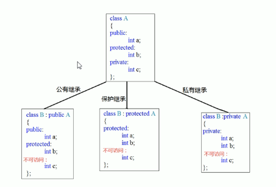
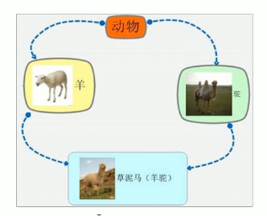

# CPP面向对象

## 1. 内存分区模型

* 代码区：二进制代码
* 全局区：全局变量和静态变量以及常量
* 栈区：编译器自动分配释放，存放局部变量
* 堆区：程序员分配和释放

### 1.1 程序运行前

​	程序编译后，生成了exe可执行程序，**未执行该程序前分为两个区域**

* **代码区**
  * 存放CPU执行的机器指令
  * 代码区是共享的
  * 代码区是只读的

* **全局区**
  * 全局变量、静态变量(``static``)
  * 常量区：字符串常量和``const``修饰的全局变量
  * **该区域的数据在程序结束后由操作系统回收**

### 1.2 程序运行后

* 栈区：由编译器自动分配释放，存放函数的参数值和局部变量

  * **不要返回局部变量的地址**

    ```c++
    int * func() {
        int a = 10; // 函数中的局部变量，存放在栈区，栈区的数据在函数执行完后自动释放
        return &a;
    }
    ```

  * **局部变量：在函数中定义；全局变量：在函数外定义**

  * **在函数中定义的局部变量存放在内存中的栈区，在函数运行结束后编译器自动释放**

  * 回想MIPS函数调用规范中的分配栈

* 堆区：由程序员分配释放

  * 在c++中由``new``关键字在堆区中申请内存

    ```c++
    int * p = new int(10);
    ```

  * 该局部变量不会随函数结束被回收，**即堆区的变量与栈区的变量有不同的生命周期**

### 1.3 new操作符

* 用``new``操作符在堆区开辟数据

* 基本语法：``new 数据类型 (初始值)|[元素个数]``，返回该数据类型的指针

  ```c++
  int *p = new int(10); // 创建int型变量
  int *arr = new int[10]; // 创建一个数组 []
  delete p;
  delete[] arr;
  ```

* 用```delete```操作释放内存，**释放数组加``[]``**

## 2. 引用

### 2.1 引用语法

* 引用：给变量起别名

* 语法：``数据类型 &别名 = 原名``

  ```c++
  int &b = a;
  ```

* **引用必须要进行初始化，且初始化后不可修改**

  ```c++
  int &b;// 未初始化错误
  int &b = a;
  int &b = c;//修改别名错误
  ```

* **对于c++中的引用理解可以参考java中的理解，即这两个名字都是指向同一片内存的指针，或者说是浅克隆**

### 2.2 引用做函数参数

* 函数参数：值传递/地址(指针)传递

* **利用引用让形参修改实参，避免使用指针**

  ```c++
  void swap(int &a, int &b) {
      int temp = a;
      a = b;
      b = temp;
  }
  ```

### 2.3 引用做函数返回值

* 不要返回局部变量的引用(函数运行结束，局部变量回收)

  ```c++
  int& test() {
      int a = 10;
      return a;
  }
  ```

* 函数的调用可以作为左值，给返回的引用赋值

  ```c++
  int& test() {
      static int a = 10;
      return a;
  }
  
  test() = 1000;
  ```

### 2.4 引用的本质

> 引用的本质在c++内部实现是一个指针常量(指针指向不变，指针指向的值可以修改)

### 2.5 常量引用

* 用来修饰形参，防止误操作

  ```c++
  const int & b = a;
  ```

* 常量引用的值不可被修改

  ```c++
  void print(const int &val) {
      cout << val << endl;
  }
  ```

## 3. 函数提高

### 3.1 函数默认参数

* 在C++中，函数的形参列表中的形参是可以有默认值的

* 语法``返回值类型 函数名 (参数 = 默认值){}``

* 例如

  ```c++
  int sum (int a = 10, int b = 20) {
      return a + b;
  }
  
  int main() {
      cout << sum() << endl;
      cout << sum(5) << endl;
      cout << sum(5, 15) << endl;
      return 0;
  }
  ```

* **不传参使用默认值，传参则使用传入的值**

* **注意：如果某个位置已经有了默认值，则从这个位置往后都必须要默认值**

* **函数声明和实现只能有一个有默认参数**

### 3.2 函数占位参数

* 在参数列表中只写数据类型

* ``返回值类型 函数名 (数据类型){}``

  ```c++
  void test(int) {
  	cout << "hello";
  }
  ```

* 现阶段没用

### 3.3 函数重载

* 函数名可以相同，提高复用性(``overloaded``)

* **同一个作用域下，函数名称相同，参数不同，根据传入的参数选择重载的函数**

* 例子

  ```c++
  int sum (int a = 10, int b = 20) {
      return a + b;
  }
  
  int sum (int a, int b, int c) {
      return a + b + c;
  }
  ```

* **函数的返回值不可以作为重载的条件**

* **注意：引用作为重载的条件**

  ```c++
  #include <iostream>
  using namespace std;
  
  void func(int &a) {
      cout << "func(int &)" << endl;
  }
  
  void func(const int &a) {
      cout << "func(const int &)" << endl;
  }
  
  int main() {
      int a = 10;
      const int b = 20;
      func(a); // "func(int &)"
      func(b); // "func(const int &)"
      return 0;
  }
  ```

  * 两个重载中的参数仅在``const``修饰上有区别
  * 在两个函数都可以运行时，变量选择变量重载，常量选择常量重载

* **重载碰到默认参数**

  ```c++
  void func(int a, int b = 10) {
      cout << "func(int a, int b = 10)" << endl;
  }
  
  void func(int a) {
      cout << "func(int a)" << endl;
  }
  
  
  int main() {
      func(10);
      return 0;
  }
  ```

  * 出现二义性

## 4. 类和对象

> 面向对象三大特性：封装、继承、多态

### 4.1 封装

* 将属性和行为作为一个整体表现生活中的事物

* **将属性和行为加以权限控制**

* **可见性通过public/private/protected定义**

  ```c++
  #include <iostream>
  using namespace std;
  
  class Circle {
      public :
          double radius;
          double compute_area() {
              return 3.14 * radius * radius;
          }  
      private :
          /*code */ 
      
      protected :
      	/*code */
  };
  
  
  int main() {
      Circle obj;
      obj.radius = 5.0;
      cout << "Area is: " << obj.compute_area() << endl;
      return 0;
  }
  ```

* 公共权限```public```：类内可以访问，类外可以访问
* 保护权限``protected``：类内可以访问，类外不可以访问，**子类可以访问父类中的protected**
* 私有属性``private``：类内可以访问，类外不可以访问

* **默认权限为private**

### 4.2 对象的初始化和清理

#### 4.2.1 构造函数和析构函数

* 构造函数：创建对象时为对象的成员属性赋值，被**自动调用**
* 析构函数：对象销毁前系统**自动调用**，执行清理操作
* **如果不自行实现，编译器提供空实现**

* **构造函数语法**：``类名(参数列表){}``

  ```c++
      public :    
          Circle(double r) {
              radius = r;
          }
  ```

* **析构函数语法**：``~类名(){}``，**不能有参数**

  ```c++
          ~Circle() {
              cout << "Circle object is destroyed" << endl;
          }
  ```

#### 4.2.2 构造函数的分类和使用

* 按照参数分类：无参构造/有参构造

* 按照类型分类：普通构造/拷贝构造

* **拷贝构造函数**

  ```c++
          Circle(const Circle& circle) {
              radius = circle.radius;
          }
  ```

* 构造函数调用

  * 括号法

    ```c++
    Circle circle(5.0);
    ```

  * 显示法

    ```c++
    Circle circle = Circle(5.0);
    ```

  * 隐式转换法

    ```c++
    Circle circle = 5.0;
    ```

* **拷贝构造函数调用时机**

  * 使用一个已经创建完毕的对象来初始化一个新对象
  * 值传递的方式给函数参数传值
  * 以值方式返回局部对象

* **构造函数调用规则**：c++编译器至少给一个类添加三个函数

  * 默认构造函数(无参、函数体为空)
  * 默认析构函数(无参、函数体为空)
  * 默认拷贝构造函数，值拷贝

  如果用户有定义，则不使用默认构造

#### 4.2.3 深拷贝和浅拷贝

* 浅拷贝：简单的赋值操作，例如**编译器提供的拷贝构造函数**

  ```c++
          Person (const Person &p) {
              this->age = p.age;
              this->height = p.height;
              cout << "拷贝" << endl;
          }
  ```

* 深拷贝：在堆区重新申请空间，**自己写拷贝构造函数，在堆区申请空间**

  ```c++
          Person (const Person &p) {
              this->age = p.age;
              this->height = new int(*p.height);
              cout << "拷贝" << endl;
          }
  ```

* 当我们的构造函数使用``new``关键字在堆区申请空间时，需要在析构函数中用``delete``关键字进行释放

  ```c++
          ~Person () {
              delete this->height;
              this->height = NULL;
              cout << "析构" << endl;
          }
  ```

#### 4.2.4 初始化列表

> 一种构造函数的新写法，没大用

* 语法：``构造函数():属性1(值1)，属性2(值2)...{}``

  ```c++
  Person(int a, int b, int c) : m_A(a), m_B(b), m_C(c) {}
  ```

#### 4.2.5 类对象作为类成员

* 一个类中的成员可以为另一个类的对象

* 先构造成员类的对象再构造自身
* 先析构自身再析构成员类的对象

#### 4.2.6 静态成员

* 静态成员变量，不属于类的对象上

  * **类的所有对象共享同一份数据**

  * 在编译阶段分配内存

  * 类内声明，**类外初始化：这是必须的，需要使用解析符指定命名空间(该类)**

    ```c++
    class Person{
        public:
            static int num;
    };
    
    int Person::num = 100;
    ```

  * **访问方式：通过类/对象进行访问**

    ```c++
    Person :: num
    person.num    
    ```

* 静态成员函数

  * **类的所有对象共享同一个函数**
  * **静态成员函数只能访问静态成员变量**
  * **通过对象访问/通过类名访问**

### 4.3 C++对象模型和this指针

#### 4.3.1 成员变量和成员函数分开存储

> 空对象占用内存空间：1字节
>
> C++编译器会给每个空对象分配一个字节空间，用来区别空对象占用的位置

```c++
class Person{
    int m_A; // 非静态成员变量 属于类的对象上
    static int m_B; // 静态成员变量 不属于类的对象上
    void func() {} // 非静态成员函数 不属于类的对象上 即代码只有一份
    static void func2() {} // 静态成员函数 不属于类的对象上
}
```

* 只有非静态成员变量属于类的对象

#### 4.3.2 this指针

> 由于成员函数不属于类的对象，多个同类型的对象共用同一块代码
>
> 这个代码块如何区分是哪个对象调用自己？

* 通过``this``指针可以解决这个问题，指向调用对象，对象本身即``*this``

* ``this``指针的作用

  * 当形参和成员变量重名时，可以通过``this``指针进行区分
  * 在类的非静态成员函数中返回对象本身，可以使用``return *this``

* **注意当想要返回自身时，要返回自身的引用，不要返回相应的数据类型**

  ```c++
  Person & func() {
      return *this;
  }
  ```

  我们知道函数中的变量位于栈区，运行结束后会被回收，如果返回相应的数据类型，会创建一个新的对象返回,原来的对象被销毁.

#### 4.3.3 空指针访问成员函数

* C++中**允许空指针调用成员函数**，但要注意有没有用到``this``指针（因为此时``this``为空）

* 例如

  ```c++
  void showClass() {
      cout << "220617" << endl;
  }
  
  void showName() {
      cout << name << endl;
  }
  
  void showAge() {
      if (this == NULL) {
          return;
  	}
      cout << age << endl;
  }
  
  Person p = NULL;
  p.showClass(); // success
  p.showName(); // failed
  p.showAge(); // success
  ```

#### 4.3.4 ``const``修饰成员函数

* **常函数**

  * 成员函数后加``const``即为**常函数**，这个``const``实际是加在``this``指针上，不允许修改``this``指向的值

  * 常函数内不可以修改成员属性

  * 成员属性声明时加关键字``mutable``后在常函数中依然可以修改

    ```c++
    class Person {
        public :
            void showPerson() const {
                m_A = 100; // failed
                m_B = 200; // success
            }
    
            int m_A;
            mutable int m_B; // mutable关键字
    };
    ```

* **常对象**

  * 声明对象前加``const``该对象即为常对象

  * 常对象只能调用常函数

  * **常对象中不允许修改普通变量，允许修改``mutable``修饰的变量**

    ```c++
    const Person p;
    p.m_A = 100; // failed
    p.m_B = 100; // success
    ```

### 4.4 友元

> 生活中你的家有客厅(public)，你的卧室(private)
>
> 客厅所有的客人都可以进去，但是你的卧室是私有的，也就是说只有你自己能进去
>
> 但是，你可以允许你的朋友进入卧室

* 在程序里，有些私有属性也想要类外特殊的一些函数或类进行访问，就需要用到**友元**的技术
* **友元：让一个函数或类访问另一个类中的私有成员**
* **友元的关键字为``friend``**

* 友元的三种实现

  * 全局函数做友元：在类中加入``friend 全局函数定义``

    ```c++
    class Building {
        friend void goodGay(Building &building); // 声明全局函数做友元 friend
        
        public : 
            string sittingRoom;
        private :
            string bedRoom;
        public :
            Building () {
                sittingRoom = "客厅";
                bedRoom = "卧室";
            }        
    };
    
    void goodGay(Building &building) {
        cout << "好基友正在访问：" << building.sittingRoom << endl;
        cout << "好基友正在访问：" << building.bedRoom << endl;
    }
    ```

  * 类做友元：在类中加入``friend class 类名``

    ```c++
    class Building {
        friend class GoodGay; // 声明类做友元
        
        public : 
            string sittingRoom;
        private :
            string bedRoom;
        public :
            Building () {
                sittingRoom = "客厅";
                bedRoom = "卧室";
            }        
    };
    
    class GoodGay{
        Building *building;
        public :
            GoodGay() {
                building = new Building;
            }
            void visit() {
                cout << "好基友正在访问：" << building->sittingRoom << endl;
                cout << "好基友正在访问：" << building->bedRoom << endl;
            }
    };
    ```

  * 成员函数做友元

    ```c++
    class Building;
    
    class GoodGay{
        Building *building;
        public :
            GoodGay();
            void visit();
    };
    
    class Building {
        friend void GoodGay::visit(); // friend声明该类下成员函数为友元
        
        public : 
            string sittingRoom;
        private :
            string bedRoom;
        public :
            Building () {
                sittingRoom = "客厅";
                bedRoom = "卧室";
            }        
    };
    
    GoodGay::GoodGay() { // 方法在类外实现，需要指明作用域
        building = new Building;
    }
    
    void GoodGay::visit() {
        cout << "好基友正在访问：" << building->sittingRoom << endl;
        cout << "好基友正在访问：" << building->bedRoom << endl;
    }
    ```

### 4.5 运算符重载(``overloaded``)

> 运算符重载：对已有的运算符进行重新定义，赋予其另一种功能，适应不同的数据类型
>
> 类似于java中override

#### 4.5.1 加号运算符重载 ``operator+``

* 实现两个自定义数据类型相加的运算

  ```c++
  person1 + person2 ?
  ```

* **编译器给了一个通用名称``operator+``**

  ```c++
  Person p3 = p1.operator+(p2);
  Person p3 = p1 + p2;
  ```

* 通过成员函数重载+号

  ```c++
  class Person {
      public :
          int a;
          int b;
  
          // 1.成员函数重载
          Person operator+(Person &p) {
              Person temp;
              temp.a = this->a + p.a;
              temp.b = this->b + p.b;
              return temp;
          }
  
  };
  ```

* 通过全局函数重载+号

  ```c++
  Person operator+(Person &p1, Person &p2) {
      Person temp;
      temp.a = p1.a + p2.a;
      temp.b = p1.b + p2.b;
      return temp;
  }
  ```

* 运算符重载也可以进行函数重载

* **对于内置的数据类型的表达式的运算符不可以进行重载**

#### 4.5.2 左移运算符重载``operator<<``

> cout << person << endl; 输出自定义数据类型

* 全局函数重载左移运算符

  ```c++
  ostream & operator<<(ostream &cout, Person &p) {
      cout << "a = " << p.a << " b = " << p.b;
      return cout;
  }
  ```

* ```ostream```标注输出流

* 链式编程：返回自身

#### 4.5.3 递增运算符重载``operator++``

* 前置递增，成员函数重载，**返回引用，保证操作的是同一个值**

  ```c++
          MyInteger& operator++() {
              num++;
              return *this;
          }
  ```

* 后置递增，**利用占位参数``int``进行函数重载，区分前置和后置**，**返回值**

  ```c++
          MyInteger operator++(int) {
              MyInteger temp = *this;
              num++;
              return temp;
          }
  ```

* **前置递增返回引用，后置递增返回值**

#### 4.5.4 赋值运算符重载``operator=``

> **c++默认给类添加operator=，对值进行拷贝，这个拷贝是浅拷贝，注意指针问题**

* 将默认的浅拷贝重载为深拷贝

  ```c++
  class Person{
      public :
          int * age;
          Person(int age){
              this->age = new int(age);
          }
          ~Person(){
              delete this->age;
              this->age = NULL;
          }
          Person & operator=(Person &p){
              if(this->age != NULL){
                  delete this->age;
                  this->age = NULL;
              }
              this->age = new int(*p.age);
              return *this;
          }
  };
  ```

#### 4.5.5 关系运算符重载

> == > >= < <= != 等等

* 成员函数重载

  ```c++
  bool operator==(Person &p) {
      if (this->name == p.name && this->age == p.age) {
          return true;
      }
      return false;
  }
  ```

#### 4.5.6 函数调用运算符重载``operator()``

* 函数调用运算符``()``可以进行重载

* 重载后使用的方式非常像函数的调用，又称为仿函数

  ```c++
  class MyPrint {
      public :
          void operator()(string str) {
              cout << str << endl;
          }
          void operator()(string str, int num) {
              cout << str << " " << num << endl;
          }
  };
  
  void test01() {
      MyPrint myPrint;
      myPrint("Hello World");
      myPrint("Hello World", 100);
  }
  ```

* 仿函数没有固定的写法，非常灵活，可以通过函数的重载定义不同的函数

* **匿名函数对象：当前行执行完后直接释放，避免创建对象**

  ```c++
  void test02() {
      MyPrint()("hello world");
  }
  ```

### 4.6 继承

#### 4.6.1 继承的基本语法

* 减少重复的代码

* 语法：``class 子类 : 继承方式 父类``

  ```c++
  class Java : public Basepage {
      /*code*/
  }
  ```

* 子类中包含从父类中继承的内容和自己增加的成员

#### 4.6.2 继承方式

* 公共继承：子类继承属性不改变
* 保护继承：子类继承父类中``public``和``protected``均为``protected``，``private``不变
* 私有继承：子类继承父类中全部属性转换为``private``

​	可以用一张图来概括：不同的继承方式会改变子类中的成员属性



#### 4.6.3 继承中的对象模型

* 子类中包含父类中继承的属性和自身新增的属性

#### 4.6.4 继承中的构造和析构顺序

* 子类继承父类后，当创建子类对象，也会调用父类的构造函数
* 构造：先构造父类后构造子类
* 析构：先析构子类后析构父类

#### 4.6.5 继承中同名成员处理方式

* 例如同名成员属性
  ```c++
  class Base1 {
      public :
          int a;
          Base1() {
              a = 10;
          }    
  };
  
  
  class Son : public Base1 {
      public :
          int a;
          Son() {
              a = 20;
          }
  };
  
  ```

* 如果通过子类对象，访问父类中同名成员，**需要增加作用域**

  ```c++
  son.Base::a;
  ```

* 如果通过子类对象，访问子类中同名成员，直接访问即可

* 同名成员函数同理

#### 4.6.6 继承中同名静态成员处理

* 访问子类中同名成员，直接访问即可
* 访问父类同名成员，**需要增加作用域**

* **静态：通过对象/类进行访问**

#### 4.6.7 多继承语法

> 不同于java，C++中允许多继承

* 语法：``class 子类 ： 继承方式 父类1 ，继承方式 父类2 ...``
* 加作用域区分同名变量

#### 4.6.8 菱形继承问题

* 两个类继承同一个父类
* 又有某个类继承两个子类



* 问题描述：动物类中有一个属性```age```，羊和驼继承动物类，羊驼继承羊和驼后就会有两个```age```属性

  ```c++
  class Animal {
  public:
      int m_age;
  };
  
  class Sheep : public Animal {};
  
  class Tuo : public Animal {};
  
  
  class SheepTuo : public Sheep, public Tuo {};
  ```

* **利用虚继承解决菱形继承问题：加``virtual``关键字**，此时``Animal``称为虚基类

  ```c++
  class Sheep : virtual public Animal {};
  class Tuo : virtual public Animal {};
  ```

* 虚继承中继承了虚基类指针，两个继承的子类指向同一个虚基类表

### 4.7 多态

#### 4.7.1 基本概念

* 静态多态：函数重载和运算符重载

  * 地址早绑定：编译阶段确定函数地址

* 动态多态：**派生类和虚函数实现运行时多态**

  * 地址晚绑定：运行阶段确定函数地址

  * **有继承关系**

  * **子类要重写(``override``)父类中的虚函数**

    ```c++
    class Animal {
    public:
        virtual void speak() {
            cout << "动物在说话" << endl;
        }
    };
    
    class Cat : public Animal {
    public:
        void speak() {
            cout << "小猫在说话" << endl;
        }
    };
    ```

  * 使用：父类的引用或指针指向子类

* **当在有子类的父类中声明虚函数时，父类对象的存储空间中会增加一个``vfptr``：虚函数表指针**

  * 该指针指向一个虚函数表
  * 虚函数表内部记录虚函数地址
  * 当子类**重写**父类的虚函数，子类中的虚函数表内部会替换为子类的虚函数地址

* **当父类的指针或引用指向之类对象时，发生运行时多态**

#### 4.7.2 纯虚函数和抽象类

* 在多态中，通常父类中虚函数的实现是毫无意义的，**主要都是调用子类重写的内容**
* **因此可以将虚函数改为纯虚函数**
* **纯虚函数语法**
  * ``virtual 返回值类型 函数名 (参数列表) = 0；``
* **当类中有了纯虚函数，这个类也称为抽象类**
* **抽象类特点**
  * 无法实例化对象
  * **抽象类的子类必须要重写父类中的纯虚函数**

#### 4.7.3 虚析构和纯虚析构

* 父类指针在析构时，不会调用子类中的析构函数，如果子类中有属性开辟到堆区，会造成内存泄漏

* **将父类中的析构函数改为虚析构或纯虚析构**，从而调用子类的析构函数

  ```c++
  virtual ~Animal() {
      /*code*/
  }
  ```

* **与纯虚函数不同的是，纯虚析构同样需要代码实现**

  ```c++
  virtual ~Animal() = 0; // 在类中声明纯虚析构
  
  Animal::~Animal() { // 在类外进行纯虚析构定义
      /*code*/
  }
  ```

## 5. C++文件操作

> 对文件进行操作需要包含头文件 ``<fstream>``

* 文件
  * 文本文件：以ASCII码形式存储
  * 二进制文件：以二进制形式存储
* 操作文件
  * ```ofstream```写操作
  * ```ifstream```读操作
  * ```fstream```读写操作

### 5.1 文本文件

​	写文件步骤如下

* 包含头文件

  ```c++
  #include<fstream>
  ```

* 创建流对象

  ```c++
  ofstream ofs; // 输出流对象
  ```

* 打开文件

  ```c++
  ofs.open("文件路径"，打开方式);
  ```

  | 文件打开方式      | 解释                       |
  | ----------------- | -------------------------- |
  | ```ios::in```     | 为读文件而打开文件         |
  | ```ios::out```    | 为写文件而打开文件         |
  | ```ios::ate```    | 初始位置：文件尾           |
  | ```ios:app```     | 追加方式写文件             |
  | ```ios::trunc```  | 如果文件存在则先删除后创建 |
  | ```ios::binary``` | 二进制方式                 |

  **可以利用``|``操作符配合使用文件打开方式**

* 写数据

  ```c++
  ofs << "写入的数据";
  ```

* 关闭文件

  ```c++
  ofs.close();
  ```

​	读文件步骤

* 创建流对象

  ```c++
  ifstream ifs;
  ```

* 打开文件

* 读数据

  * 第一种

    ```c++
        char buffer[1024] = {0};
        while (ifs >> buffer) {
            cout << buffer << endl;
        }
    ```

  * 第二种

    ```c++
        char buffer2[1024] = {0};
        while (ifs.getline(buffer2, 1024)) {
            cout << buffer2 << endl;
        }
    ```

  * 第三种

    ```c++
        string buffer3;
        while (getline(ifs, buffer3)) {
            cout << buffer3 << endl;
        }
    ```

  * 第四种

    ```c++
        char ch;
        while ((ch = ifs.get()) != EOF) {
            cout << ch;
        }
    ```

### 5.2 二进制文件

* 二进制方式进行读写操作
* 打开方式指定为``ios::binary | ios::out[ios::in]``

* 写文件：``ostream & write(const char *buffer, int len);``

  ```c++
  ofs.write(buffer, sizeof(buffer));
  ```

* 读文件：```isteam & read(char * buffer, int len)```


