# <center>GDB终端调试</center>

## 1. 编译产生Debug版本	

​	我们在操作系统实验中使用```gdb```在终端中进行代码调试。在之前的章节中，我们已经学到可以使用

```
gcc add.c -o adds
```

​	指令来对源代码进行编译。但是采用这种方法编译产生的目标程序是**Release**版本，并不支持我们使用```gdb```进行调试，要想产生支持```gdb```调试的**Debug**版本，我们需要在原编译指令的基础上加入```-g```参数，具体指令为

```
gcc -g add.c -o adds
```

## 2. GDB操作

### 1.进入GDB进行调试

​	对编译好的程序运行```gdb```有两种方式，

* 一种是直接指定文件进入```gdb```模式

  ```
  gdb adds
  ```

* 或者先进入```gdb```模式，再加载可执行文件

  ```
  $ gdb
  (gdb) file <filename>
  ```

### 2.运行程序

* ```
  (gdb) run
  ```

### 3.退出gdb模式

* ```
  quit
  ```

### 4. 传入额外参数

```
// echo.c
#include <stdio.h>
#include <stdlib.h>

void usage() {
    printf("usage: echo <string>\n");
    exit(-1);
}

int main(int argc, char *argv[]) {
    if (argc != 2) {
        usage();
    }

    printf("%s\n", argv[1]);
    return 0;
}
```

​	在C语言中，```argc```和```argv```是预留的为```main```函数传参的参数，其中
$$
argc\space is \space short \space for \space argument \space count 
$$

$$
argv \space is \space short \space for \space argument \space vector
$$

​	**其中argc,argv均包含运行的程序本身，即程序默认有一个参数，是他自己的名字**

或者说在不特殊向程序传参情况下
$$
argc=1 \space | \space argv[0] = filename
$$
​	那么以上代码中的逻辑就显而易见。对于```argc != 2```的判断事实上就是在判断是不是传入了一个字符串参数，如果没有，提示用户程序用法，强制退出。

​	那我们应该如何通过命令行传入参数呢？

```
$ gcc -g echo.c -o echo ##编译
$ ./echo "hello,world"!
##或者采用输入重定向的方式
$ ./echo < input.txt ##在这个文件中保存好字符串参数
```

​	如果我们想要为gdb传入参数，同样有两种方法

* ```
  $ gdb --args ./echo "hello,world"
  ```

  **需要注意args选项中包含程序名**

* 或在gdb页面中（个人更加偏向）

  ```
  $ gdb
  (gdb)file ./echo
  (gdb)set args "hello,world"
  ```

* 更加简洁的，也可以在```run```时指定参数

  ```
  run args
  ```

### 5.追踪程序运行

#### 5.1 调试

* ```
  (gdb) start
  ```

  * ```start```指令会使程序调试进入```main```函数的第一行代码/重新运行程序

* ```
  (gdb) step  
  ```

  * ```step```指令使我们一步一步执行程序（注：当我们输入一次```step```后，继续回车即相当于后续输入```step```）
  * 同时，```step```指令也会进入函数内部，即如果遇到函数调用，```step```指令会进入函数调用内部细节（ 相当于```jetbrains```系列的```F7```）

* ```
  (gdb) finish
  ```

  * ```finish```用于从当前调试函数内部退出
  * 这样就形成一个组合，我们要进入某个函数内部调试——```step```，从中退出来```finish```

* ```
  (gdb) next  ##相当于jetbrains系列的F8
  ```

  * ```next```指令用于**执行当前行并且跳过当前行中任何函数调用**（相当于```jetbrains```系列的```F8```）

* ```
  (gdb) continue
  ```

  * ```continue```指令，停止调试，让程序正常跑完

* ```
  (gdb) kill
  ```

  * ```kill```指令，杀死进程

#### 5.2 设置断点

##### 5.2.1 查看文件内容

* 设置断点首先要知道断点应该设置在的位置，我们可以通过```list```指令查看文件内容从而确定我们要设置断点的行号
  **关于list指令的用法**

  * ```
    list ##查看当前运行源代码
    ```

  * ```
    list <linenumber> 
    ```

  * ```
    list <file>:<linenumber>
    ```

  * ```
    list <function name>
    ```

  * ```
    list <file>:<function name>
    ```

  * **通过回车继续查看代码内容**

##### 5.2.2 设置断点

* ```
  break <linenumber>
  ```

   程序运行会在我们设置的断点处停下，此时可以使用```step```,```next```,```finish```等指令进行调试

* 对于我们已经设置好的断点，我们可以使用

  ```
  info breakpoints
  ```

  来查看断点信息。

  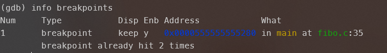

* 在上图中我们可以看到断点的各种信息

  * Num:断点编号
  * Type:断点类型
  * Disp:永久断点/临时断点
  * Enb:是否启用
  * 以及短点的地址，位置，命中次数等

* 如果想要暂时禁用某个断点
  ```
  (gdb) disable breakpoints <breakpoint_number>
  ```

  执行后再次查看断点信息可以看到```Enb=n```

  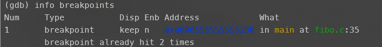

* 若果想要直接删除某个断点

  ```
  (gdb) delete breakpoints <breakpoint_number>
  ```

* 若想要删除某个位置的所有断点

  ```
  clear <position>
  ```

##### 5.2.3 临时断点

​	**事实上start指令本质上是在main函数处添加一个断点并运行程序**，**这个断点的类型为临时断点**，```temporary breakpoint```,程序只在该断点处暂停一次，之后断点就会自动删除。（运行到该临时断点时临时断点就会被删除）

* 通过```tbreak```指令设置临时断点

  ```
  (gdb)tbreak <breakpoint_number>
  ```

  再次查看断点信息

  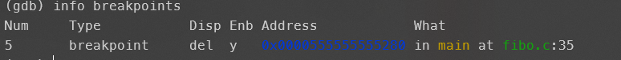

##### 5.2.4 条件断点

​	**条件断点即满足一定条件才中断程序运行的断点**

* 创建条件断点的方法即为在原指令后加入条件

  ```
  break <linenumber> if <condition>
  ```

  ```condition```是符合语义的表达式，例如

  ```
  break 18 if i == 9
  ```

  ```
  break 19 if a > b + 1
  ```

* 若需要修改条件断点中的条件，使用```condition```指令

  ```
  conditon <breakpoint_number> <new_condition>
  ```

##### 5.2.5 循环中的断点

* 若是使用了显式的循环（可以看到循环变量），我们就可以通过循环变量构造条件断点，例如```for```循环中的```i```

  ```
  break 23 if i == 8
  ```

* 若是循环中没有显式的计数，例如遍历链表或使用迭代器等。我们可以使用```ignore```指令，**该指令表示忽略这个断点前times次的访问**

  ```
  ignore <breakpoint_number> <times>
  ```

#### 5.3 设置观察点

##### 5.3.1 变值观察点

​	对于代码量较小的工程，我们容易定位出其中的bug位置，从而通过设置条件断点等方法进行调试。而对于较大的工程，我们难以判断bug位置，这时可以设置**观察点**
```
watch <expression>
```

​	观察点指定了一个表达式而不指定位置，**程序运行时GDB会监视该表达式的取值，当表达式的取值发生变化时程序停止**

​	举个例子，对于想要在循环中设置断点的情况，例如想要在```i==9```时停下来调试

```
watch i>=9
```

​	其中```i>=9```在```i<9```时取值为0，```i==9```时取值变为1

##### 5.3.2 读观察点

​	当程序中出现读取目标表达式的操作时停止

```
rwatch <expression>
```

##### 5.3.3 访问观察点

​	当程序中出现读取目标表达式或写入目标表达式的值的操作停止

```
awatch <expression>
```

### 6.查看程序运行时数据

#### 6.1 查看函数调用栈

​	查看函数调用栈通过```backtrace```指令完成，例如我们在fibo程序中```n==1```时设置断点，并在此时查看调用栈信息

```
(gdb) backtrace
```

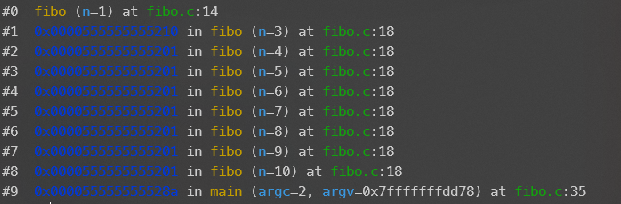

#### 6.2 获取变量取值

​	我们可以通过```print```来获取变量的取值，在这个例子中，

```
(gdb) print n
```

​	即可输出n的值。但是若我们想要获得此时```main```循环变量中```i```的值呢？若我们直接```print i ```则会遇到报错

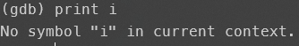

​	这是因为在程序运行过程中系统会为每一个函数调用创建一个栈帧，保存在函数调用栈中，例如上面```backtrace```输出图。若我们想要打印主函数中变量的值，我们就需要返回到主函数所在栈帧。

#### 6.3 在函数调用栈帧间移动

​	在上面的讲解中，我们位于函数调用的最底层，此时n==1，我们要想打印主函数中i的值，需要先切换到主函数所在的栈帧。

* ```
  up [steps]
  ```

  ​	向调用者的方向移动steps次，即向函数调用顶层移动steps，若我们想要返回顶层

  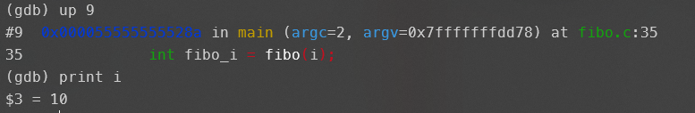

* ```
  down [steps]
  ```

  ​	向被调用者移动。**程序的栈空间向低地址增长，被调用者的栈帧在调用者的栈帧之下！！！**

  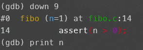

* ```
  frame [level]
  ```

  ​	直接移动到指定的栈帧

  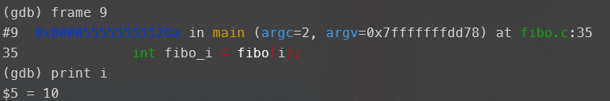

#### 6.4 输出数组

​	我们可以打印输出数组变量的值，

* 指定元素输出，例如

  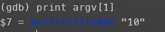

* 输出一定范围内的数组元素

  ```
  print <array_name>[start_index]@<element_number>
  ```

  即输出数组从```start_index```开始的```element_number```个元素

  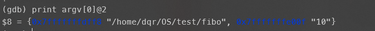

#### 6.5 反汇编

​	将GDB中的机器码转换为汇编代码

* ```disassemble [position]```
* ```disassemble  <function>```
* ```disassemble <start>,<end>```

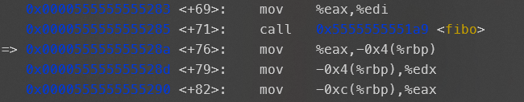

* 图中箭头表示PC寄存器位置

### 7.修改运行时程序

* 调试时动态修改程序的数据或运行，验证bug修复的可行性

* 修改指定变量的值

  ```
  set variable <variable_name> = <expression>
  ```

* 修改函数的返回值

  ```
  return <expression>
  ```

* 跳转到指定位置运行

  ```
  jump <position>
  ```

### 8.使用tui界面进行调试

​	使用tui界面进行调试会比纯cli界面查看代码更加友好一些

```
gdb -tui
```

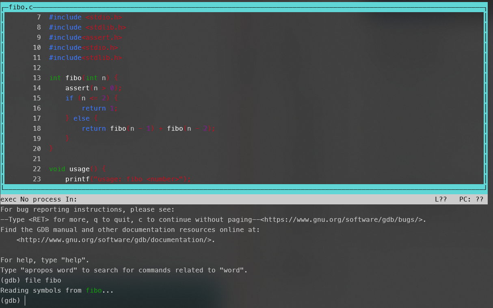


