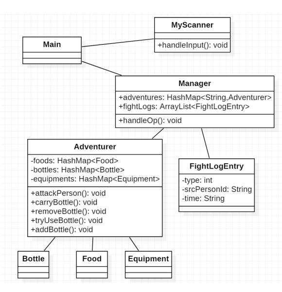
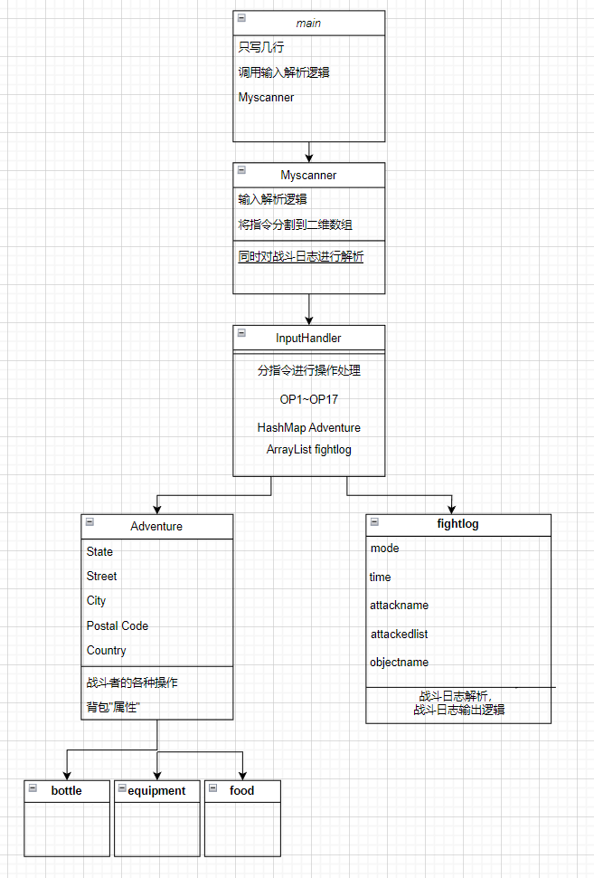

## HW_4强测修复&&代码重构

​	**OOpre_HW_4是我打的最快的一次！**然而在代码风格上却不够面向对象，而且代码业务逻辑上有问题，没有成功通过强测(只得了33分)，在挂掉强测之后，我痛定思痛，决定先重构代码架构再进行逻辑修复。

### 一.代码架构



​	上图是课程组推荐的代码架构，回顾我的第一版代码，主要有以下两个问题:

1. 输入解析逻辑放在main类中，导致main代码冗长
2. 没有对```fightlog```进行建类，而是将```fightlog```作为附属于adventure的数据处理，导致代码结构耦合复杂

​	经过一晚上的代码构想和助教的交流，我将代码架构修改为下图：



​	在这次的代码逻辑中，我将```fightlog```视作一个个与```adventure```同级的个体建类（**这个是最重要的思想，想了好久**），```fightlog```中存储战斗日志的模式，攻击时间、攻击者的名字，被攻击者的名字```ArrayList```,这里需要注意，对于```ArrayList<String> attackedname```，应当分情况存储

1. mode == 1,此时```attackedname == null```

2. mode == 2,此时```attackedname```中只有一个元素
3. mode == 3,此时```attackedname```中包含所有被攻击者的元素

### 二.bug修复 

#### 1.正则表达式修复

​	**正则表达式出错使得战斗日志输入解析错误，导致后续从二维数组中读取时出现```NullPointerException```，这就是强测第一次的报错**,只能说第一篇博客发早了，传播了错误的正则表达式。下面附上通过强测的正则表达式

```Java
Pattern p = Pattern.compile("(\\d{4}/\\d{2})-([^@#-]+)-([^@#-]+)");
Pattern p1 = Pattern.compile("(\\d{4}/\\d{2})-([^@#-]+)@([^@#-]+)-([^@#-]+)");
Pattern p2 = Pattern.compile("(\\d{4}/\\d{2})-([^@#-]+)@#-([^@#-]+)");
```

#### 2.对于携带概念的再纠正

​	我们知道，在第三次作业中，我对于携带的处理是为每个物品设置一个```becarreid```属性，在后续的处理中，如“使用”等操作，都需要进行是否“携带”概念的判断，在这次作业中，我发现了上次强测没有测出来的bug，OP9（）中对于同名装备进行替换时，没有判断是否携带，下面附上改正后代码:

```java
public void OP9(int i)
    {
        int advId = Integer.parseInt(inputInfo.get(i).get(1));
        int equId = Integer.parseInt(inputInfo.get(i).get(2));
        Adventure man = adventures.get(advId);
        Equipment equipment = null;
        ArrayList<Equipment> equipments = man.returnequ(man);
        for (Equipment item : equipments) {
            if (item.getID(item) == equId) {
                equipment = item;
                break;
            }
        }
        String name = equipment.getName(equipment);
        //检查当前想要携带的装备是否存在同名 如果有则进行替换
        Equipment equipment1 = null;
        for (Equipment item : equipments) {
            if (item.getName(item).equals(name) && item.getBecarried(item)) { //已经被携带的同名装备
                equipment1 = item;
                break;
            }
        }
        if (equipment1 != null) {
            equipment1.reset(equipment1);
        }
        equipment.set(equipment);
    }
```

​	需要注意的是```&&item.getBecarried(item)```,这种错误我出现了两次了，下次一定要注意，名字符合的同时要判断是否携带。

### 后记

​	这是第一次挂了强测进行bug修复，总的来说非常惊险刺激，但是同样收获很大。

1. 对于代码架构的改善，更加面向对象
2. 学会了利用vscode进行文件比对，通过比对输出debug好方便

#### 利用vscode进行文件比对

​	1.在文件内右键——>2.command palette——>2.compare  active file with...

​	就可以获得直观的文件比较体验，整个人都开朗了起来！
