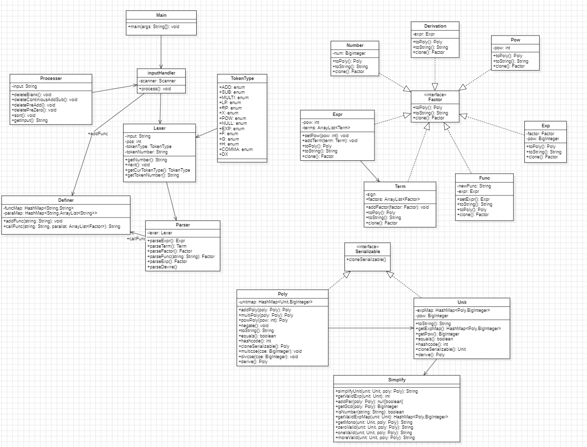
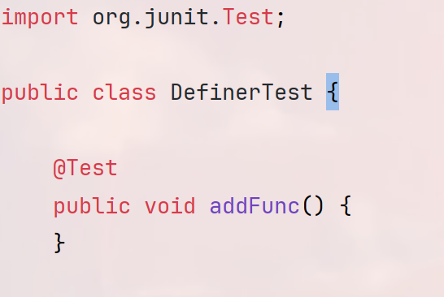

# OO第一单元第三次作业

## 0. 题目需求

​	本次作业在上次作业的基础上主要增加了求导因子，同时自定义函数表达式中允许**调用**已经定义过的表达式。

* **求导因子(归结在因子中)**，求导因子形式为```dx(表达式)```，含义为对表达式中的x求导，**其中可以出现多次求导的情况，但是自定义函数表达式中不会出现求导算子**

  * ==关于求导的形式化表述==

    * **求导算子** -> **'dx'**

    * **求导因子** -> 求导算子 空白项 ‘(' 空白项 求导因子 空白项 ')' | 求导算子 空白项 '(' 空白项 表达式 空白项 ')'

      * 注意：求导算子内部可能有表达式，应该调用```parseExpr```

    * 注：形式化表述中允许了多层求导的情况，例如，

      ``` 
      dx(dx(x))
      ```

  * ==可能用到的求导公式==
    $$
    I.f(x)\space =\space c\space ,f'(x)\space = \space 0
    $$

    $$
    II.f(x)\space = \space x^n,f'(x) = nx^{n-1}
    $$

    $$
    III. f(x)\space = \space exp(x),f'(x) \space = \space exp(x)
    $$

    $$
    IV.[f(g(x))]'\space = \space f'(g(x))g'(x)
    $$

    $$
    V.[f(x)g(x)]' \space = \space f'(x)g(x) + f(x)g'(x)
    $$

  * ==因子->变量因子|常数因子|表达式因子|求导因子==

* **自定义函数定义**，自定义函数中允许**调用**出现已经定义的函数，但不允许出现求导因子。需要注意的是**调用**，即实参一定是因子

* **必要的括号**

  * exp()调用时的一层括号
  * ```exp(<factor>)```内的因子为不带指数的表达式因子，两侧必要一层括号
  * **这意味着求导是需要进行计算展开的...**

## 1. 思路分析

### 1.1 函数定义式解析

​	在上一次的作业中我们使用了字符串替换的方法用来解析函数定义式和调用，这种架构在这一次作业中自动满足了函数中可以调用先前已经定义函数的要求。

### 1.2 求导因子解析

​	对于求导因子的处理是新建一个求导因子类，其中设置属性保存需要求导的多项式。求导的过程在建立多项式过程中进行，即在表达式转化为poly的过程中调用derive进行求导，递归地转化为对每一个unit求导，只需要对unit写一个求导方法即可。或者说求导因子类的toPoly返回的poly是求导之后的poly，toString方法返回的是求导之后的多项式字符串(~~两边一定记得加括号~~)

## 2. 代码分析

### 2.1 UML图



### 2.2 代码分析

​	这次作业的代码在上次代码的基础上实际上只增加了求导环节，代码复杂度上变化不是很大，主要是输入预处理以及输出化简环节复杂度较高。

## 3. bug修复

* 这次的bug是在求导因子类中toString方法中忘记对求导返回的表达式字符串两侧加括号

## ps: 建立src test目录的方式

​	经过第二次作业的bug洗礼，突然回想起上学期```JUnit```的好，这就需要建立起```src```和```test```文件夹。最简单的方式是克隆上一次作业代码时在目录下再新建一层```src```，直接克隆进```src```，之后设置它为```Resources Root```，再建立```test```文件夹，设置为```Test Resources Root```。

​	之后使用```Go to```新建```Test```（**```JUnit4```标准**）即可

* 在test文件代码前输入 ```import org.junit.Test```
* 保证每一个注解的内容是```@Test```

