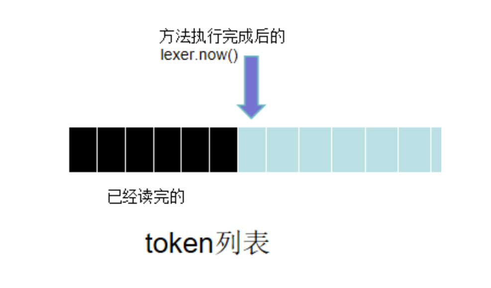
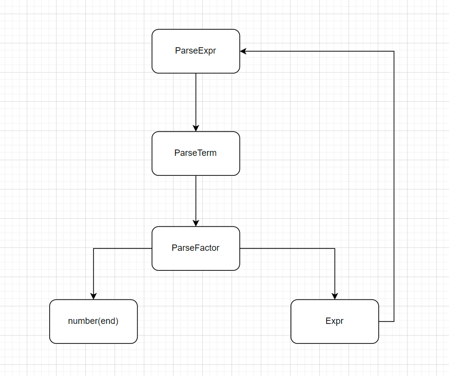
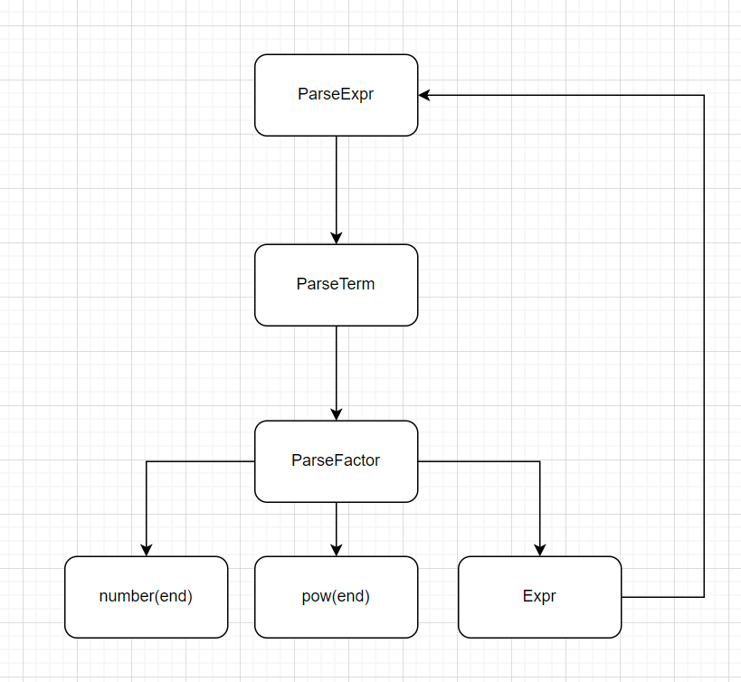
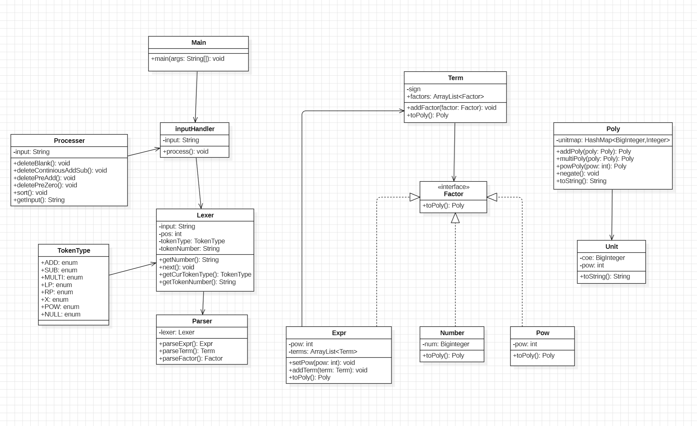
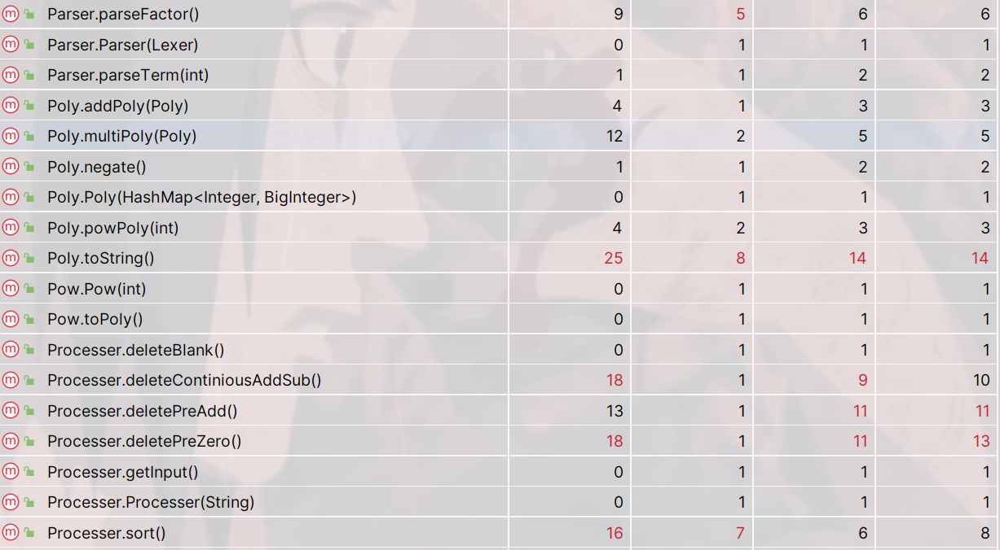

# <center>OO第一单元第一次作业</center>

## 0.training

* 想要通过课程组提供的```training```获取一点点思路```QWQ```

### 0.1 training-1

* 第一部分通过正则表达式的方法将一个只包含数字和“+”“*”符号的表达式转化为后缀表达式

* 思路梳理（已经提供好的代码）：

  * ```Mainclass```：对于该类，分析得到其处理的思路为构建出可以描述每一项的正则表达式，而后在表达式中进行匹配，再分别对获得的每一项进行后缀化(```toString```)，最后整体后缀化(```toString```)并输出

    补充正则表达式如下

    ```
    private static final String patternTerm = "\\d+(\\*\\d+)*";
    ```

    (该表达式描述了，一项中至少有一个数字以及```>=0```个形如```*number```的部分)

    **上机tips：关于正则表达式，可以右键之后选择第一项进行检查**

  * ```Expr```：该类的重点为实现```toString```方法，由后缀化的项得到后缀化的表达式

    * 若表达式中只有一项，则该项即为转换后的表达式

      （例如 1 * 2 * 3）

    * 若表达式中大于等于两项，对于前两项需要特殊处理，后面的项补充为```项*```的后缀化形式

      ```
      StringBuilder sb = new StringBuilder();
                  sb.append(terms.get(0));
                  sb.append(" ");
                  /* TODO */
                  sb.append(terms.get(1));
                  sb.append(" ");
                  sb.append("+");
                  for (int i = 2; i < terms.size(); i++) {
                      sb.append(" ");
                      sb.append(terms.get(i));
                      sb.append(" ");
                      sb.append("+");
                  }
      ```

  * ```Term```：该类的重点为实现```toString```方法，将项转化为后缀表达形式

    * 在项的构造方法中对因子```factors```进行了划分，由于项只可能由数字或数字的乘积构成，使用```*```划分即可

      ```
      String[] factorStrs = s.split("\\*");
      ```

    * 同```Expr```中```toString```方法，将第0个和第1个因子特判后缀化

### 0.2 training-2

* 第二部分通过**递归下降**的方法对**一层括号，只包含“+”“*”运算符**的表达式进行处理，输出其后缀表达式

* 思路梳理

  对表达式进行层次化建模（语法树）

  * ```Expr```
  * ```Term```
  * ```Factor```
    * ```number```
    * ```Expr```（括号的来源）

* 分析

  * **Expr**的抽象结构

    **term+term+term...**

  * **term**的抽象结构

    **factor * factor * factor**

  * **factor**

    * ```number factor```最底层的结构
    * ```Expr```从顶层向下调用

​	我们做打开括号并转化为后缀表达式的行为主要通过语法分析```parser```，词法分析```lexer```相当于```parser```的辅助类，本质上```lexer```可以选择在```parser```中完成，但是分成两个类可以显著降低耦合度。故我们分析的视角以```parser```展开。

​	```parser```英文即意为语法分析，我们做语法分析的过程显然为从左到右。在这个从左到右扫描的过程中，我们的读取不是以字符为单位，而是以```token```为单位，即文中的最小单位。这个```token```就由```lexer```类完成获取并传递给```parser```，帮助其理解当前句子的结构。(**图片来自公众号oolens**)



​	这里以列表的形式呈现，实际上在代码的实现中我们的思路是，```parser```需要知道后面的句子结构，```lexer```接着向右边扫描，得到的```token```传递给```parser```用来分析。即```parser```相当于“奴役”着```lexer```。

​	当我们理解了```parser```和```lexer```的协作关系，就可以尝试理解整体的工作思路。去掉括号后，我们的句子成分包括数字、```+```、```*```。我们最底层的“原子”即为数字，```+```以及```*```的位置可以通过输出时构建后缀表达式。我们可以得到数据结构上的关系

* ```Expr```掌管```terms```，在代码实现中使用了```HashSet```进行管理(个人不是很理解，更加偏向使用```ArrayList```，使用```HashSet```会导致输出无序，但结果正确)

* ```terms```掌管```factors```，```HashSet```(这里的factors为```Number```，若为```Expr```则进行递归调用)

  对于递归调用关系可以如下图所示，这也被称为**自顶向下树**。

  

**注：实际上，若将底层因子中的```Expr```递归调用关系补全，得到的会是一颗更深的树**

​	在语法解析的过程中，遵循```Expr```->```Term```->```Factor``` ，下面以一个具体的问题为例进行分析

* 例如题目中提供的例子(1+2)*(3+4)

​	这个例子其实是“一项”，**我们要想构建起完整的表达式，应当从底到顶进行，先获取因子，再获取项，再获取表达式**，故我们在主函数中调用```parseExpr```，```parseExpr```中递归调用```parseTerm```...

​	我们分析示例```parseExpr```代码

```
    public Expr parseExpr() {
        Expr expr = new Expr();
        //添加表达式中的第一项项，递归调用
        expr.addTerm(parseTerm());
		//这里需要理解的是，上一行代码在递归调用过程中，分析完成一项，此时lexer也对应移动了一项，这时看拿到的token是不是+
		// 即term + term + term ...
        while (lexer.peek().equals("+")) {
            lexer.next();
            expr.addTerm(parseTerm());
        }
        return expr;
    }
```

​	在示例中，只有一项，递归分析两个表达式因子。

​	**需要注意的是，```JAVA```中的输出语句```System.out.println```在输出类对象时，会调用对应的```toString```方法，故我们需要在Expr,Term,Number层构建toString方法**

​	我们只需要对每一个层次都建立起```toString```方法，在每一层中建立该层的后缀表达式，同样向下递归调用即可得到输出，例如在```Expr```层的```toString```

```
term term + (term +)* //需要注意的是第一项和第二项的特殊处理
```

* **总结来说：所谓递归下降算法，其实就是递归的思想**

## 1.题目需求分析

​	读入一个包含加、减、乘、乘方以及括号（**括号深度至多一层**）的单变量表达式，**输出恒等变形展开所有括号后的表达式**

**对表达式进行层次化建模**：```Expr->Term->Factor```

* **表达式(Expr)**：由**加法**和**减法**运算符连接若干**项**组成

  注：在第一项之前可以带一个正号或负号，表示第一项的正负

* **项(Term)**：由**乘法**运算符连接若干因子组成

  注：在第一个因子之前可以带一个正号或负号，表示第一个因子的正负

* **因子(Factor)**：**设置为接口Interface**

  * **变量因子（幂函数）**

    * 一般形式：```x ^ n```，n为非负带符号整数**(输入已经保证该带符号整数中不会出现```-```**)
    * 省略形式：当```n==1```时简写为```x```

  * **常数因子**

    支持前导0的十进制带符号整数（+可以省略）

  * **表达式因子**

    用一对小括号包裹起来的表达式，可以有指数形式（指数为非负带符号整数）



## 2.问题处理流程分析

### 2.1 预处理

​	由于生成法中可能造成的输入字符串中包含连续冗余的```+-```，空格，前导0等，采用建立```processer```类的方法对表达式进行预处理，方便后面的语义分析。考虑到后面性能要求中的长度问题，预处理阶段尽量的将字符串长度缩短是好事，我在处理时采用以下的顺序

* 删除字符串中的空白字符（空格、```\t```）
* 删除连续的```+-```(其实就是为这个项确定出符号，或者说统计出负号的个数)
* 删除不必要的前导```+```
* 删除前导0

​	这样的顺序要优于2,3颠倒

### 2.2 语法分析

#### 2.2.1 Lexer

​	```Lexer```主要进行词法分析，他负责从字符串中读到```token```并传递给```Parser```，这里我们的```token```可以用一个枚举类保存。

```
public enum TokenType {
    NUM,X,MULTI,EXP,ADD,SUB,LP,RP,NULL
}
```

​	同样沿用```training```代码中的逻辑，可以用```switch```语句等保存```token```。

#### 2.2.2 Parser

​	对于```parser```部分的设计同样沿用了```training```中的三个方法，根据当前```lexer```扫描到的```token```进行语义分析，在我的设计中参考了学长博客中的设计，为项设置出符号属性，在解析表达式时将项的符号传入。~~这里同样需要注意的是```number^pow```的形式并不符合形式化表述，我的第一版代码中对这种形式进行了解析~~

​	该类中借鉴了```training```中代码的三个方法进行解析

* ```parseExpr```
* ```parseTerm```
* ```parseFactor```

​	**parseFactor中需要注意的是，读到(，即读到表达式或读到x即读到幂函数，还要再向后读一个看是不是^，如果是则说明该因子有指数(要为表达式设置指数属性)**

```
    public Expr parseExpr() {
        Expr expr = new Expr();
        int sign = 1;//标记项的符号
        if (lexer.getCurTokenType() == TokenType.SUB) {
          //该项是负项
        } else if (lexer.getCurTokenType() == TokenType.ADD) {
           //该项为正项
        }
        expr.addTerm(parseTerm(sign));
        while (//有下一项)
        {
           //正负项讨论
        }
        return expr;
    }

    // parseExpr将项的符号传入
    public Term parseTerm(int sign) {
       //...
        while (//有下一个因子) {
           //...
        }
        return term;
    }

    public Factor parseFactor() {  
        if (//如果是左括号，说明是表达式) { 
            //跳过LP
            lexer.next();
            Expr expr = parseExpr();
            //跳过RP
            lexer.next();
            if (//如果是^) {
              //
            }
            return expr;
        } else if (//如果是数字) { 
            //...
        } else if (//如果是减号，说明这是个负数) {
           //...
        } else { //如果读到x
            //如果读到x则还需要判断他的下一个token是不是^
        }
    }
```

### 2.3 计算输出

#### 2.3.1计算思路

​	在经过语法分析之后，我们已经对表达式自顶向下建立起表达式树，而我们的输出结果，可以表示为多项式的形式
$$
Expr = \Sigma a_i x^{n_i}
$$
​	因此我们可以考虑在每一个语法层级都将其转化为多项式形式(构造```toPoly```方法)，最终递归地得到计算结果。

​	为了实现计算，我们定义出单项式类```Unit```，多项式类```Poly```。每个单项式以数组的形式管理各个单项式。我们先不考虑各个类中具体的方法实现，先去大体认知这个与表达式树映射架构的多项式树。

​	我们的思路是将每一个层级都表现为多项式形式

* ```numberFactor```：对于数字因子，是树中的叶节点，我们可以简单的表示为只有一项的多项式：
  $$
  numberfactor = numberfactor*x^{0}
  $$
  这一项即为一个单项式，我们的多项式类中的数组中只保管这一个单项式即可

* ```powFactor```：对于幂函数因子，同样为树中的叶节点，我们可以简单的表示为只有一项的多项式：
  $$
  powfactor = 1*x^{powfactor}
  $$
  这一项即为一个单项式，我们的多项式类中的数组中只保管这一个单项式即可

* ```Term```：将```term```类转换为多项式形式，我们知道，多项式的表达形式为```factor*factor*factor```，我们只需要将他的各个因子的多项式相乘即可
  $$
  TermPoly = \Pi FactorPoly
  $$

* ```Expr```：将```expr```类转换为多项式形式，表达式的形式为```term + term + term ```（其中```term```中包含该项正负号），只需要将构成表达式的各个项的多项式相加即可
  $$
  ExprPoly = \Sigma TermPoly
  $$

​	这样又构建起一个**递归**的过程，**自底向上**地构建起多项式树。

​	经过以上分析，我们知道需要新增的类有

* ```Unit```

* ```Poly```

  需要新增的方法有

* 每一个层次的```toPoly```，包括```Expr```,```Term```,```Factor```

* ```Poly```中的计算方法：

  * ```addPoly```
  * ```multiPoly```
  * ```powPoly```

* 用于最终输出的```Unit```类和```Poly```类中的```toString```

#### 2.3.2 计算方法实现思路

##### 2.3.2.1 各层级toPoly方法的实现

* 首先定义出```Unit```单项式类，其中包含两个属性```ceo```（系数），```pow```（指数），```Poly```类中包含```ArrayList <Unit> unitlist```

​	先从比较简单的底层实现，即```numberFactor```和```powFactor```

* ```number toPoly```

  $$
  number*x^0
  $$

  * 只有一项的多项式

* ```pow toPoly```

  $$
  1*x^{pow}
  $$

  * 只有一项的多项式

* ```Term toPoly```

  ```
      public Poly toPoly() {
         //...
          for (Factor factor : factors) {
              //各个因子多项式相乘
          }
          if (this.sign == -1) {
              //多项式中单项式变号
          }
          return poly;
      }
  ```

  * **需要注意的是，若项的符号为负号，则需要将项中的每一个单项式符号取反，在Poly类中构建方法negate()用于符号取反**

* ```Expr toPoly```

  ```
      public Poly toPoly() {
         //...
          for (Term term : terms) {
             //各个项多项式相加
          }
          return poly;
      }
  ```

  **高层级调用低层级的toPoly，自底向上**

##### 2.3.2.2 Poly中计算方法的实现

###### 2.3.2.2.1 addPoly

​	**计算思路：**我们对两个多项式进行加法，关键的步骤在于合并同类项，我们已知多项式中以数组的数据结构保存着，**我们先将两个数组合并为一个数组，之后在一个数组中进行合并同类项。**

```
    public Poly addPoly(Poly another) {
        //将两个数组中的单项式合并到一个数组中
        for(int i = 0; i < units.size(); i++) {
            for(int j = i+1; j < units.size(); j++) {
                //判断标准：指数相同，合并同类项
            }
        }
        return new Poly(units);
    }
```

​	在数组中进行遍历，若找到和```i```元素指数相同的```j```元素，则系数相加到```i```元素上，删除```j```元素，并将```j```回退一位，实际上是保证下次遍历从```i+1```开始。

###### 2.3.2.2.2 multiPoly

​	**计算思路：**我们对两个多项式中各项相乘的结果加入新的多项式变量。**这里注意：在我的实现方法中，是从底向上构建表达式，这样在相乘之前，项表达式是空的，需要进行判断，如果是空的，就返回当前因子表达式加入项表达式中，再继续与其他因子表达式相乘，当然还有另一种方法，就是在乘之前就先加进去一个因子表达式**

```
    public Poly multiPoly(Poly another) {
        //...这里需要判断是不是空
        if(如果为空){
        	//...
        } else {
        	for(Unit unit1 : this.unitlist) {
            	for(Unit unit2 : another.unitlist) {
                	//因子多项式相乘
            	}
        	}
        	return new Poly(units);
        }
    }
```

###### 2.3.2.2.3 negate

​	对多项式中的每一个单项式的符号进行取反，我采用两步实现，在```Poly```中进行```Unit```遍历，在```Unit```类中利用```BigInteger```的方法```.negate()```取反。

#### 2.3.3 输出思路及方法

​	我们在```Unit```类和```Poly```类中都要实现```toString```方法进行递归调用。

##### 2.3.3.1 unit toString

​	将每个```unit```转化为
$$
coe*x^{pow}
$$

##### 2.3.3.2 poly toString

​	将各个项多项式连接起来，并进行优化输出，常见的优化输出有：

* 系数为0：不输出
* 系数为1：省略系数，```x```
* 系数为-1：省略系数，```-x```
* 指数为0：输出1
* 指数为1：省略指数，```x```

* 之后可以调用之前字符串预处理过程中的几个方法

  * 去掉连续的+-号

  * 若第一项为负，则从后面找一个正项放在前面，大概给出这个方法的伪代码，这个方法的思路是：**先判断第一项是否为负项（第一个符号是否为负号），之后看是否能找到正项，如果能就把他俩换一下位置，字符串层级的操作要注意substring方法包含左字符不包含右字符**

    ```
     if (this.input.charAt(0) == '-') {
                int addpos = -1;
                int i = 0;
                for (i = 0;i < this.input.length();i++) {
                    //找到+号，记录位置
                }
                if (addpos != -1) { //如果找到了+，就找这一项后的符号，将这一项分割出来
                    for (i = addpos + 1;i < this.input.length();i++) {
                        //...
                    }
                   //处理字符串，将正项一道前面，之后会调用删除前导+的方法，使得表达式缩短一个字符，这么麻烦其实只缩短了一个字符hhhhhh
                }
            }
    ```

  * 去掉不必要的前导+

  * **同时要注意如果输出长度为0，要补充输出“0”**

## 3.后续对于时间复杂度的优化

### 3.1 对于时间复杂度的分析

​	在第一版代码中，构建多项式过程中我们使用```arraylist```来存储单项式，之后在后续计算过程中的时间复杂度:

* **addPoly:O(n^2)**
* **multiPoly:O(n^2)**
* **powPoly:调用multiPoly,约等于O(n^3)**

​	这样的时间复杂度在面对一些指数比较大的表达式时会出现```TLE```的情况，后来经过同学的提示，**可以使用HashMap来存储单项式，key为指数，value为系数**，这样的确可以大大简化时间复杂度，同时也可以省去一个类```Unit```(~~但是我没舍得删)。**另外一个点：可以在每次乘法结束之后都进行一次合并同类项addPoly，这样可以更加减少时间复杂度**

* **addPoly:O(n)**
* **multiPoly:O(n^2)**

### 3.2 具体方法的实现

#### 3.2.1 addPoly

```
public Poly addPoly(Poly another) {
        Iterator<Map.Entry<Integer, BigInteger>> iterator = this.unitmap.entrySet().iterator();
        while (((Iterator<?>) iterator).hasNext()) {
            Map.Entry<Integer,BigInteger> entry = iterator.next();
            int pow = entry.getKey();
            BigInteger coe = entry.getValue();
            if (another.unitmap.containsKey(pow)) {
                BigInteger coe1 = another.unitmap.get(pow).add(coe);
                another.unitmap.put(pow,coe1);
            } else {
                another.unitmap.put(pow,coe);
            }
            iterator.remove();
        }
        return another;
   }
```

​	**主要思路是数学上的多项式合并思路，遍历一个多项式，在另一个多项式中检查是否有这个项的指数，如果有就合并，如果没有就加入到另一个多项式，最终返回另一个多项式**

* 这里需要注意的是，关于```HashMap```边遍历边删除的需求，如果使用增强for循环，会报错。需要使用迭代器进行。

  ```
   Iterator<...> iterator = ...iterator();
   while (iterator.hasNext()) {
          //...
           iterator.remove();
   }
  ```

#### 3.2.2 multiPoly

```
 public Poly multiPoly(Poly another) {
        if (this.unitmap.isEmpty()) {
            return new Poly(another.unitmap);
        } else {
            HashMap<Integer, BigInteger> emptyMap = new HashMap<>();
            Poly emptypoly = new Poly(emptyMap);
            HashMap<Integer, BigInteger> hashMap = new HashMap<>();
            for (int pow1 : this.unitmap.keySet()) {
                for (int pow2 : another.unitmap.keySet()) {
                    int pow = pow1 + pow2;
                    BigInteger coe = this.unitmap.get(pow1).multiply(another.unitmap.get(pow2));
                    if (hashMap.containsKey(pow)) {
                        BigInteger coe1 = hashMap.get(pow).add(coe);
                        hashMap.put(pow,coe1);
                    } else {
                        hashMap.put(pow,coe);
                    }
                }
            }
            return new Poly(hashMap);
        }
    }
```

* 这里不涉及到对于元素的删除等操作，可以使用增强for循环

* 这里需要明确```java```中```HashMap```的一个特性：当我们向```HashMap```中加入已经存在的```key```时，会覆盖掉原来的```value```，我利用这一点进行了```value```的更新

  ```
  there is a new <newkey,newvalue>
  if (newkey exists) {
  	find(key,value)
  	value -> newvalue
  } else {
  	put<newkey,newvalue>
  }
  ```

#### 3.2.3 negate

* 同样要注意对于存在的```key```的```value```的值的更新

  ```
  public void negate() {
      for (Integer pow : this.unitmap.keySet()) {
          BigInteger coe = this.unitmap.get(pow);
          this.unitmap.put(pow,coe.negate());
      }
  }
  ```


## 4. 代码分析

### 4.1 UML类图分析



* 从左到右大致可以分为三个部分，输入，解析，计算输出

### 4.2 代码复杂度分析

​	我使用Metricsreloaded进行分析，先对几个标准进行解释

* ``Cogc``：圈复杂度，程序中独立路径的数目
* ```ev(G)```：本质复杂度，程序中必须要有的控制流程数目
* ```iv(G)```：内在复杂度，程序本质上的复杂度
* ```v(G)```：程序体积，程序中独立语句数目

​	**以下为程序中复杂度超标的方法**



​	可以看到复杂度主要集中在进行化简输出的部分或对输入字符串进行预处理的方法，字符串预处理方法需要对字符串进行循环遍历并在过程中条件判断，化简输出部分有对每一项指数、系数的讨论，复杂度均较高，其中语义解析部分parseFactor由于有多种因子，复杂度较高。

## 5. bug修复

​	在第一次作业中强测以及互测均未出现bug，在互测环节中房友的优化输出出现bug，hack数据为```1+(x^8)^8```


