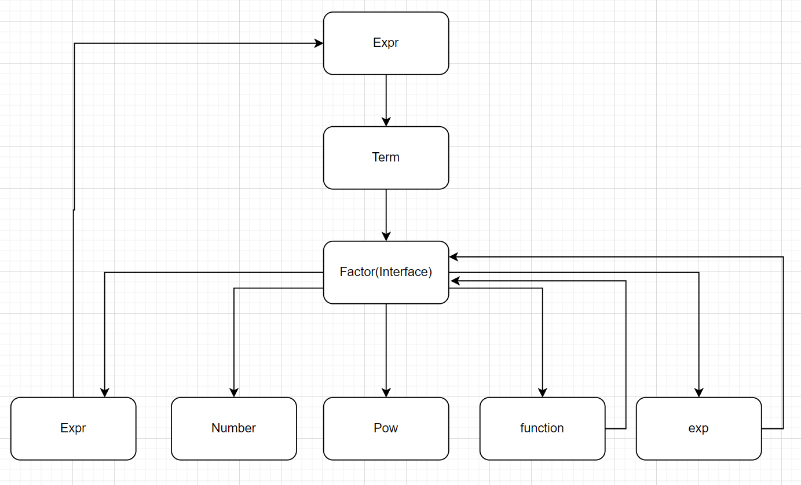
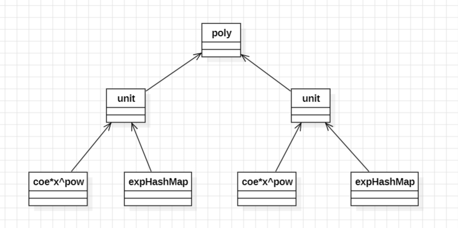
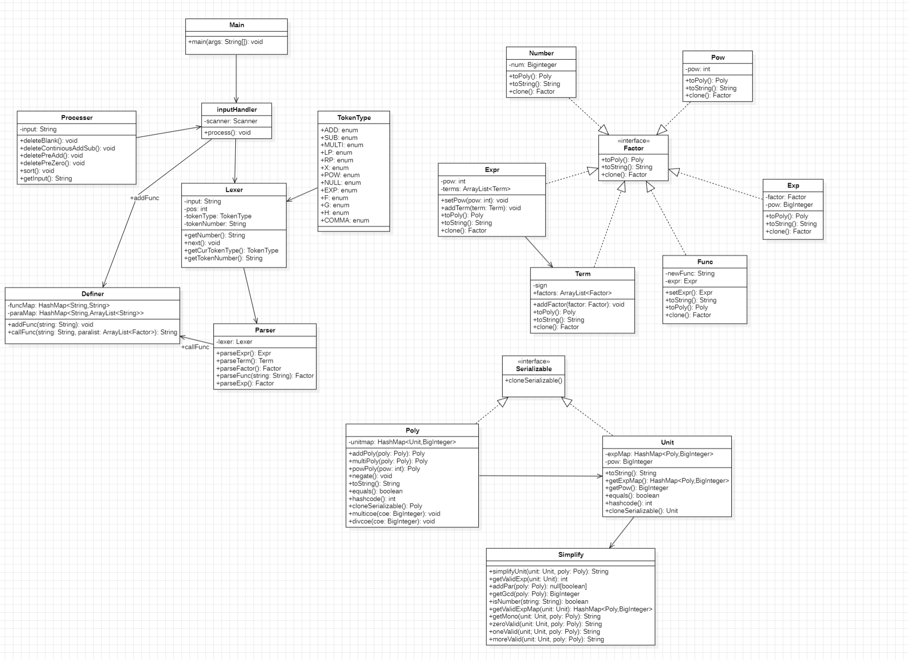
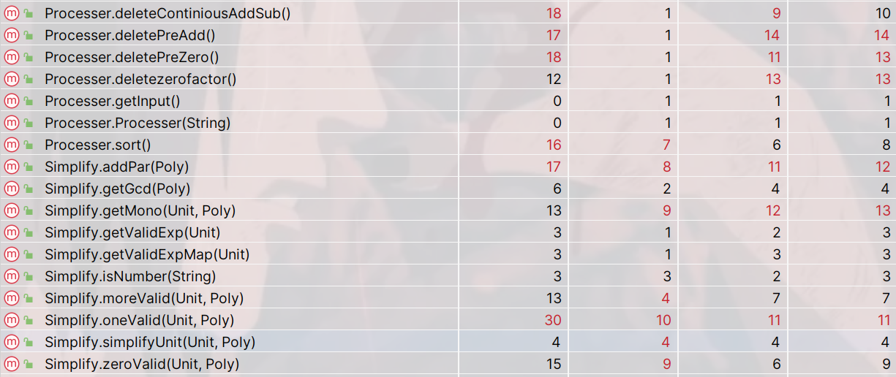

# <center>OO第一单元第二次作业</center>

## 0.题目需求分析

### 0.1 概念分析

> 本次作业在第一次作业的基础上添加了指数函数和自定义函数，其中

* 需要支持嵌套多层括号
* 新增指数因子，指数函数括号内部包含任意因子
* 新增自定义函数因子，自定义函数的表达式会给出且其中不会调用其他自定义函数

本次迭代表达式架构上的改变

* **支持前导0的十进制带符号整数**

* **因子**

  * **变量因子**，```x```

  * **幂函数**

    * **一般形式**：```x^非负整数```
    * **省略形式**：指数为1，```x```

  * **指数函数：特指以e为底数的指数函数，表示为exp(<因子>)等**

    * **一般形式：**```exp(<因子>)^指数```，注：该指数为```exp()```整体的指数
    * ```exp()```的指数为非负整数
    * **省略形式：**指数为1时，写为```exp(<因子>)```

  * **自定义函数**

    * 自定义函数中不会调用其他自定义函数，定义类似于

      f(x,y,z) = 表达式（可能不全部包含x,y,z这三个变量）

    * **```f```,```g```,```h```是函数的函数名，本次作业中的自定义函数名只包括```f```,```g```,```h```即最多只有三个自定义函数**

    * **```x```,```y```,```z```是函数的形参，形参个数为1~3个，且同一函数定义中不会出现重复使用的形参**

    * 函数表达式为关于形参的表达式

    * **函数调用的形式为f(因子，因子，因子)，例如f(x^2),g(exp(x^2),exp(x)),h(1,0,-0)，因子为函数调用中的实参，包含任意一种因子**

    * **注意：函数定义中不允许出现自定义函数，但是函数调用中的实参可以是自定义函数**

  * **常数因子**

  * **表达式因子**

* **项**

* **表达式**

​	关于去括号要求中的**“必要的括号”**

* 指数函数调用时必要的一层括号```exp()```

* 指数函数对应的嵌套因子为**不带指数的表达式因子**时，该因子两侧必要的一层括号，例如

  ```exp((x+1)^2)```中```(x+1)```中的括号是不合法的，需要展开为不带指数的形式```exp((x^2+2*x+1))```

### 0.2 表达式架构图

* 大致保留之前的架构，新增指数函数因子类和自定义函数因子类



## 1.处理流程分析

### 1.1 字符串预处理

* 由于自定义函数的引入，可以新增去除```,```后不必要的```+```

### 1.2 语义分析

#### 1.2.1 Lexer

​	本次作业中，新增了```EXP```,```F```,```G```,```H```,```COMMA```(逗号)等token，需要增加识别功能。

#### 1.2.2 Parser

##### 1.2.2.1 parseExp

​	在```Parser```类中新建一个方法```parseExp```，当我们读到的```token```为```EXP```时调用该方法进行解析。**首先对括号内的因子进行解析，再对括号外的指数进行解析。**
$$
exp(<factor>)^n \space | \space exp(<factor>)
$$

```
    public Factor parseExp() { // exp(<factor>)^<num> | exp(<factor>)
        // lexer : exp -> pos = pos + 4 already into the (
        // 读到RP时接着往后读看有没有指数
        int pow = 1;//默认指数为1
        Factor innerFactor = parseFactor();
        if (lexer.getCurTokenType() == TokenType.POW) {
            // 后面有指数
        }
        return new Exp(innerFactor, pow);
    }
```

##### 1.2.2.2 parseFunc

###### 1.2.2.2.1 Definer

​	为了成功地解析自定义函数，我们首先定义出```Definer```类，**他的主要作用是处理自定义函数的定义以及调用**。（相当于```parseFunc```的```slave```）其中定义出两个```HashMap```

```
private static HashMap<String, String> funcMap = new HashMap<>();
private static HashMap<String, ArrayList<String>> paraMap = new HashMap<>();
```

* ```funcMap```构建了以函数名```[f|g|h]```为```key```，函数定义式为```value```的```HashMap```
* ```paraMap```构建了以函数名```[f|g|h]```为```key```，函数形参```formalParas```为```value```的```HashMap```

* **注意：这里由于存在定义式中形参x与指数符号exp重复的问题，可以考虑在addFunc过程中对x,y,z替换为w,q,r，但是这里处理也同样需要注意不要替换掉exp中的x，在callFunc中直接对w,q,r进行替换，在周三早上的研讨课听到，感觉比较优雅**，原来的实现是在callFunc时判断逻辑不要让exp中x被替换。复杂度上相同，但更倾向换参版本。

​	其中定义出两个方法，一个是```addFunc```用于处理输入，在输入时将字符串传入```addFunc```方法，构建函数的定义式到```funcMap```和```paraMap```中，另一个是```callFunc```用于输入解析```parser```，将函数名和实参列表传入，依据之前构建好的```funcMap```和```paraMap```得到用实参替换形参之后的表达式字符串。

```
public static void addFunc(String input){ // 输入的函数定义式
	//首先进行形参替换 
	//主要调用 String.split("...")方法对函数的定义式进行分割，并分别put到funcMap,paraMap       
}
public static String callFunc(String funcName, ArrayList<Factor> actualParas) {
    // 自定义函数解析时使用 获得替换后的函数表达式
    // 获得这个函数名对应的定义式以及形参列表
    for (//遍历形参列表) {
        //将函数定义式中的形参用实参替换 替换时一定要注意在两边加括号！！！！！
    }
    return funcDef;
}
```

* **注：这里传入的是Factor，可以调用toString方法进行转化**，在接口中定义方法```toString```，在各个```implement class```中```Override```，在这里我们实现的确确实实就是把形参替换成实参，**只需要考虑字符串层面的操作,怎么把这一项用字符串描述出来.**

  * ```number```：直接将数字转化为字符串 

    ```
    return number.toString();
    ```

  * ```pow```：较为简单的拼接字符串

    ```
    return "x^" + pow;
    ```

  * ```Func```类：自然而然的返回属性```newFunc```.

    ```
    return this.newFunc
    ```

  * ```Exp```类：由于指数```exp(<factor>)^n```的形式，递归调用```Factor.toString```方法。

    ```
    public String toString() { // exp(factor)^n toString
            if (pow == 1) {
                return "exp(" + factor.toString() + ")";
            } else {
                return "exp(" + factor.toString() + ")^" + pow;
            }
        }
    ```

  * ```Expr```类：表达式类转换为字符串，递归调用```Term.toString```，记得后面判断加上指数，而且左右一定要有括号

    ```
     public String toString() {
            StringBuilder sb = new StringBuilder();
            for (Term term : terms) {
                //递归 Term.toString
            }
            //加上指数
            return sb.toString();
        }
    ```
    
  * ```Term```类：需要注意的是项可能有符号
  
    ````
        public String toString() {
            StringBuilder sb = new StringBuilder();
            if (this.sign == -1) {
                sb.append('-');
            }
            for (Factor factor : factors) {
                //递归调用 factor.toString
            }
            return sb.toString();
        }
    ````
    
  
* 需要注意的是，这个类中的属性和方法都被定义为了```static```属性，即这些属性和方法都是类所有的，而不是对象所有的，对于方法而言可以直接通过类进行调用。

###### 1.2.2.2.2 parseFunc

​	接下来使用```Definer```帮助解析```parseFunc```.其中函数调用的形式为
$$
f(<factor>,<factor>,<factor>)
$$
​	解析逻辑为先解析函数名，然后解析所有的实参。

* 关于```Func```类

  在```Func```类中设置两个属性

  ```
  private String newFunc; //实参带入形参之后的结果
  private Expr expr; //newFunc解析成表达式后的结果
  ```

  在```Func```类的构造方法中，我们传入函数名```[f|g|h]```和实参列表```actualParams```，通过调用```Definer```类中的静态方法```callFunc```得到替换为实参之后的表达式，然后对表达式进行解析。

  ```
      public Func(String name, ArrayList<Factor> actualParams) {
          this.newFunc = Definer.callFunc(name,actualParams);  //形参替换为实参->字符串
          this.expr = this.setExpr(); // 解析成表达式
      }
      private Expr setExpr() {
         //newFunc字符串预处理
         //new lexer
         //new parser
          return parser.parseExpr(); //字符串解析为表达式
      }
  ```

* 关于```parseFunc```

  负责对自定义函数中的实参部分进行解析，和函数名一同传给```Func```再```newFunc->setExpr```得到解析好的表达式。

  ```
   public Factor parseFunc(String name) {
      //函数调用的形式为 f(<factor>,<factor>,<factor>) 进来时正读到f
      //读f-LP
      //跳过f-LP
      ArrayList<Factor> actualParams = new ArrayList<>();
      //将第一个实参parseFactor并加入list
      while (//后边还有因子) {
          //继续加入
      }
      //跳过f-RP
      return new Func(name, actualParams);
  }
  ```

### 1.3 表达式计算输出

#### 1.3.1 更改HashMap类型

​	继续沿用第一次作业中```Unit```和```Poly```的思路，这次化简结束之后的表达式形式应当为
$$
Expr \space = \space \Sigma (ax^n * \Pi exp(<factor_i>)^{n_i})
$$


​	即每一个```Unit```中的内容应当为
$$
Unit \space = \space ax^n * \Pi exp(<factor_i>)^{n_i}
$$
​	考虑到```exp```的形式可以进行化简，但我们先不化简，在```Unit```类中新增一个用于表示指数函数的```HashMap```。

```
HashMap<Poly,Integer> expMap;
```

* ```key```为```factor```的多项式
* ```value```为exp的指数

(```expMap```这里不同键值对之间实际上表示的是乘法关系，这样两个```Unit```相乘时，只需要将两个```expMap```合并在一起就模拟了相乘的效果）

​	在```Poly```类中新增一个存储```Unit```的```HashMap```

```
HashMap<Unit,BigInteger> unitMap
```

​	**这里需要注意的是因为key为自定义类，需要对hashCode(),equals()方法进行重写**

* **equals()**

  **equals方法用来比较两个引用对象是否为同一个对象**，在超类```Objects```类中的定义为比较两个引用指向的对象是否相等。

  ```
      public boolean equals(Object obj) {
          return (this == obj);
      }
  ```

  而在我们的自定义类中，我们定义出来很多属性，在我们的作业内容中，以```Poly```中定义的单项式哈希表为例，

  ```
  HashMap<Unit,BigInteger> unitMap
  ```

  ​	Unit的属性有coe,pow,expMap。那么两个Unit之间着三个属性相同，我们就认为他们符合equals方法，判断得到应当为相同对象。因此我们应当在Unit类中覆写equals方法，加入判断这几个属性如果都相等就是相同对象的判断。为了避免空指针，使用```Objects.equals```进行判断。

  ```
      public boolean equals(Object obj) {
         if (obj instanceof Unit) {
             Unit unit = (Unit) obj;
             return Objects.equals(coe,unit.coe) && Objects.equals(pow,unit.pow) && Objects.equals(expMap,unit.expMap);
         } else {
             return false;
         }
      }
  ```

* **hashCode()**

  正如方法的名称，```hashCode()```返回值为对象的哈希编码，即在table中的索引，用来确定对象的存储地址。在自定义类的超类	```Objects```宏对于```hashCode()```的描述主要可以概括为以下几点

  * 同一对象多次调用```hashCode()```，要求返回值相等
  * 如果两个对象相同，即适用于```equals```方法，两个对象的hashCode相同
  
  对于我们的自定义类，我们可以通过类中的属性来计算hashCode，这样可以达到满足equals即返回相同hashCode的效果。（对于equals判断中使用的属性，计算hashCode时一定要用到，没使用的属性计算时一定不要用）。为了避免空指针，我们常调用```Objects.hash(para1,para2,...)```的方法进行计算。
  
  ```
   public int hashCode() {
          return Objects.hash(coe,pow,expMap);
   }
  ```
  

#### 1.3.2 关于去除不必要的括号

​	题目要求中对于必要的括号定义如下

* ```exp```调用的括号```exp()```
* 指数函数**对应的嵌套因子**为**不带指数的表达式因子**时，该表达式因子两侧必要的一层括号

​	当前我的实现中，判断是否加括号的逻辑在```exp(<poly>)```中对poly调用toString方法时进行。此时构建的多项式结构为



​	exp()内一定为因子，不需要加括号的因子有常数因子，幂函数，指数函数，需要加括号的因子为表达式因子。我写了返回boolean类型的addPar方法，分别对exp内的poly分情况进行判断，这里加不加括号与Unit中toString方法的优化有关，也就是说若这个Unit是常数时，返回的字符串一定是常数，而不是3*x^0之类，只要我们对每个Unit的化简足够可靠(最简)，就可以保证这里的逻辑只需要对coe,pow,expMap中有效项个数等量进行简单判断。这里主要给出判断伪代码。

```
    public static boolean addPar(Poly poly) {
        if (//若多项式中有两项及以上) {
            return true;
        } else if (//若多项式中只有一项) {
            if (//系数为0) {
                return false;
            } else {
                if (//是数字) { 
                    return false;
                } else if (//是幂函数) { 
                    return false;
                } else if (//是指数函数) {
                    return false;
                }
            }
        }
        return true;
    }
```

**注：Simplify为定义出的用于化简的静态类，其中getValidExp用于查找exp哈希表中“有效项”，存储时形式为HashMap<Poly,Biginteger>,所谓有效项就是指数大于0**

#### 1.3.3 对于底层项进行优化输出

​	对于优化输出，我的思路是在构建字符串时进行化简，而不是对字符串进行化简，在这次作业中我进行的优化有

* ```exp(0)=1```
* 合并同类项
* 对exp()中的多项式提取公因数
* 以及上一次作业中的对于指数为0/1，系数为0/1/-1的情况进行判断输出

​	**一定要慎重优化，避免出现bug!**

​	对于优化，我单独建立了```Simplify```类，其中定义出多个静态方法用于表达式化简，这里一定要与addPar中的逻辑对应，即相应的数字，幂函数，指数函数都要化简为最简的形式。

### 1.4 序列化深克隆方法

​	在进行优化输出的过程中，涉及到对```Unit```，```Poly```等类的深克隆，为了避免对这些类中的对象进行递归克隆，我采用了序列化克隆的方法（~~有模版比较省事~~），只需要把```Unit```以及```Poly```接到```Serializable```接口上并重写```cloneSerializable```方法即可。给出克隆模版

```
 public Unit cloneSerializable() {
        Unit unit = null;
        try {
            //序列化对象
            ByteArrayOutputStream bos = new ByteArrayOutputStream();
            ObjectOutputStream oos = new ObjectOutputStream(bos);
            oos.writeObject(this);
            //反序列化对象
            ByteArrayInputStream bis = new ByteArrayInputStream(bos.toByteArray());
            ObjectInputStream ois = new ObjectInputStream(bis);
            unit = (Unit) ois.readObject();
        } catch (Exception e) {
            e.printStackTrace();
        }
        return unit;
    }
```

​	我认为这个方法是极为方便的，唯一的缺点就是会导入一堆java.io包，IDEA可能会自动帮你合并为```java.io.*```，但这是不符合代码规范的，需要手动调整。

## 2. 代码分析

### 2.1 UML类图分析



### 2.2 代码复杂度分析



​	爆复杂度部分和上次作业一样集中在输入预处理以及输出化简部分。

## 3. bug分析

* 第二次作业中出现了优化bug，提出exp中gcd时忘记不能提出负数，导致强测和互测被刀
* 数据范围问题 ```Integer.parseInteger()```被爆范围


