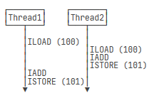

# OO第二单元第一次作业

[toc]

## 0. 前置知识

### 0.1 进程与线程

* 计算机中，我们把一个任务称作一个进程(Process)
* 在一个进程中，还包含一个至多个子任务，称为线程(Thread)

* 进程与线程是包含关系，一个进程中可以包含多个线程
* 线程内执行顺序确定，线程间执行顺序由操作系统调度，无法确定
* **tips:此单元作业中不要使用调试，会影响线程，转为使用打印调试法**


#### 0.1.1 创建新线程

* Java语言中内置了多线程支持，当Java程序启动的时候，实际上是启动了一个**JVM进程**，然后JVM启动**主线程**来执行```main```方法，在```main```方法中我们可以**启动其他线程**

* **继承Thread类**

  **从Thread类派生一个自定义类，覆写run方法**

  ```
  public class myThread extends Thread {
  	@Override
  	public void run() {
  		// ...
  	}
  }
  ```

* **实现Runnable接口**

  **实现Runnable接口，重写run方法**

  ```
  public class myRunnable implements Runnable {
  	@Override 
  	public void run() {
  		//...
  	}
  }
  ```

* **创建一个新线程**

  ```
  Thread t = new myThread();
  Thread t = new Thread(new myRunnable)
  ```

* **启动新线程**

  ```
  t.start()
  ```

  * **注：start()方法会在内部自动调用实例的run方法，直接调用run()方法不会创建新线程**

* 线程入口```run()```方法的模版

  ```
  public void run(){
  	try{
  		while(true){
  			if(has new task) {
  				//...
  			} else {
  				break;
  			}
  		}
  		//do something to finish
  	}
  	catch(InterruptedException e){  //该线程被调用interrupt
  		//...
  	}
  	//do something to finish
  }
  ```


#### 0.1.2 线程的状态

> 在Java程序中，一个线程对象只能调用一次start()方法启动新线程，并在新线程中执行run()方法，一旦run()方法执行结束，线程就结束了

* **New**:新创建的线程，尚未执行
* **Runnable**：**需要注意的是Runnable对应着两种状态**
  * **Ready**：准备被调度（尚未运行）
  * **Running**：正运行

* **Blocked**：运行中的线程，因为某些操作被阻塞而挂起
* **Waiting**：运行中的线程，不定长时间的等待状态
  * **Timed Waiting**：运行中的线程，定长时间的等待状态（```Thread.sleep()```,其中sleep传入的参数为毫秒）

* **Terminated**：线程终止：run()执行结束或stop()被调用


* **join**
  * 当线程对象调用```.join```方法时，主线程(main)会等待该线程执行结束后才继续往下执行自身线程	

#### 0.1.3 中断线程

* 中断线程就是其他线程给该线程发一个信号，该线程收到信号后结束执行```run()```方法，自身线程立刻结束运行

  ```
  t.interrupt()
  ```

* **interrupt()为发送中断请求，不一定能够及时响应**

* 代码模版如下

  ```
  class myThread extends Thread {
      public void run() {
          while (!isInterrupted()) {
              try {
                  //...
              } catch (InterruptedException e) {
                  break;
              }
          }
      }
  }
  ```

* **或者通过设置running标志位来标识线程是否应该继续运行**

  ```
  class myThread extends Thread {
      public volatile boolean running = true;
      public void run() {
          while (running) {
              //...
          }
      }
  }
  ```

  * 外部中断线程运行
    ```
    t.running = false
    ```

  * ```volatile```用于修饰线程间共享的变量，确保每个线程都能读到更新后的变量

    **在JAVA虚拟机中，变量的值保存在主内存中，当线程访问变量时，会先获取一个副本，并保存在自己的工作内存中，若线程修改了变量的值，虚拟机会在某个时刻将修改后的值写回到主内存，但是时间不确定！**

    

    **这导致了某个线程更新了变量，另一个线程读取的值可能还是更新前的**

    volatile:

    * 每次访问线程间共享的变量时，总是获取主存内的最新值
    * 每次修改变量后，立即写回到主存 

#### 0.1.4 线程同步

* 多进程之间的共享数据在多进程同时进行读写时，会出现数据不一致的问题

  

* **在多线程模型下，要保证逻辑正确，对共享变量进行读写时，必须保证一组指令以原子方式执行：即某一个线程执行时，其余线程必须等待**

  

* 通过**加锁和解锁**的操作，就能保证这些指令总是在一个线程执行期间，不会有其他线程进入此指令区间，即使在执行期间线程被操作系统中断，其他线程也会因为无法获得锁导致无法进入指令区间。

* **加锁和解锁之间的代码块称为临界区，任何时候临界区最多只有一个线程可以执行**

* 加锁关键字```synchronized```

* **对某一个对象加锁**

  ```
  synchronized(obj) {
  	...
  }
  ```

* **对某一个方法加锁**

  ```
  synchronized method (...) {
  	...
  }
  ```

  * 对于静态方法: monitor实际是***.class
    * one thread per class
  * **对于动态方法:monitor实际上是this**
    * one thread per object/instance

* 完成工作后就会交出锁，下一个线程拿到锁继续工作

* Java中的```synchronized```锁是可重入锁

  ```
  public class Counter {
      private int count = 0;
      public synchronized void add(int n) {     
         dec(-n);
      }
  
      public synchronized void dec(int n) {
          count += n;
      }
  }
  ```

  **java允许线程反复获取同一个锁，例如上例中add和dec方法都需要获取当前实例的this锁，add方法中已经获取了this锁，可以再次获取this锁调用dec**

* 关于可重入锁：获取锁的时候，不但要判断是否为第一次获取，还要记录这是第几次获取，获取一次锁，记录+1，退出synchronized块，记录-1，减到0的时候会释放锁

* 死锁：多个线程各自持有不同的锁，然后各自试图获取对方手中的锁，双方无限等待下去，造成死锁
  * **解决方法是线程之间获取锁的顺序要一致**

####  0.1.5 wait && notify

* 在```synchronized```内部可以调用```wait()```使线程进入等待状态

* 必须在已获得的锁对象上调用```wait()```方法，例如

  ```
  this.wait()
  ```

* 线程进入等待状态后会释放锁，交给其他进程

* 在```synchronized```内部可以调用```notify()```或```notifyAll()```唤醒其他等待进程

  * 通常使用```notifyAll```更加安全，确保所有访问者的公平性

* 必须在已获得的锁对象上调用```notify()```方法

  ```
  this.notify()
  ```

* 被唤醒的线程还需要重新获得锁后才能继续执行

* wait-notify实际上是生产者-消费者模型

### 0.2 生产者-消费者模型

* 生产者向**托盘对象**中存入生产的货物(```synchronized method```)
* 消费者从**托盘**中取走相应的货物(```synchronizedd method```)
* 货物放置控制
* 货物提取控制
* 托盘既可以是单一对象，**也可以是容器对象**

### 0.3 电梯调度算法

* 选用LOOK算法，后续详细介绍

## 1.题目需求分析

* 完成乘客请求：

  * 电梯上下行
  * 开关门动作
  * 控制乘客进出电梯

* 电梯运行基本约束

  * 可到达楼层1-11
  * 初始位置1层
  * 数量6部(编号为1-6)
  * 移动一层花费的的时间:0.4s
  * 开/关门花费的时间:0.2s
  * 乘客进出电梯不花费时间
  * 限乘人数:6人

* **乘客只能进入和离开输入时指定的电梯，不可以进入其他电梯**(后续作业有变动)

  ```
  时间戳]乘客ID-FROM-起点层-TO-终点层-BY-电梯ID
  ```

* 关于性能：
  * 运行时间尽量短
  * 尽量不让请求等待过长时间
  * 减少系统的无效运行

## 2.处理流程分析

### 2.1 多线程协作分析

​	在第五次作业中，提供的乘客请求均已指定了接收的电梯，所以我在这一次作业中**并没有设计调度器**(~~偷懒~~)，这导致在第六次作业中需要小小地重构一下构建调度器。第一次接触多线程编程，正所谓谋定而后动，第一重要的是梳理好各个线程之间的协作关系。在第五次作业中，主要涉及到的线程为输入线程和六个电梯线程，为每个电梯设计一个等待队列，**每部电梯的等待队列即为该电梯线程与输入线程的共享变量，输入线程将拿到的请求放到队列中，电梯线程从队列中拿出请求，即输入线程为生产者，电梯线程为消费者**，这里选择将等待队列类实现为一个**线程安全类**，即为外部提供好对等待队列的操作接口，外部调用时不必考虑线程安全问题，在类内部保证线程安全问题。这里对线程之间协作的分析如下图：

#### UML协作图


* 主类负责启动各个线程，线程之间的共享变量写到构造方法中

* 电梯类向策略类询问接乘客的策略

* 这里需要注意的一点是：**什么时候设置电梯线程结束？**

  * 当读入的请求为空时，就能说明已经没有后续请求

  * 在请求队列中设置了标记位```endFlag```，当读入空请求时将每个电梯中请求队列的标记位置```true```
  * 策略类返回OVER建议结束电梯线程：当前电梯中没有人并且请求队列标记位为``true``

### 2.2 电梯调度算法

#### 2.2.1 LOOK算法

> 这里采用了hyggge学长博客中推荐的LOOK算法，该算法可表述如下(转载)

- 首先为电梯规定一个初始方向，然后电梯开始沿着该方向运动。

- 到达某楼层时，

  首先判断是否需要开门

  - 如果发现电梯里有人可以出电梯（到达目的地），则开门让乘客出去；
  - 如果发现该楼层中有人想上电梯，并且目的地方向和电梯方向相同，则开门让这个乘客进入。

- 接下来，进一步判断电梯里是否有人

  。如果电梯里还有人，则沿着当前方向移动到下一层。否则，检查请求队列中是否还有请求（目前其他楼层是否有乘客想要进电梯）

  - 如果请求队列不为空，且某请求的发出地是电梯"前方"的某楼层，则电梯继续沿着原来的方向运动。

  - 如果请求队列不为空，且所有请求的发出地都在电梯"后方"的楼层上，或者是在该楼层有请求但是这个请求的目的地在电梯后方（因为电梯不会开门接反方向的请求），则电梯掉头并进入"判断是否需要开门"的步骤（循环实现）。

  - 如果请求队列为空，且输入线程没有结束（即没有输入文件结束符），则电梯停在该楼层等待请求输入（wait）。

    > 注意：电梯等待时运行方向不变。在我的设计中，运行方向是电梯的一个状态量而不是过程量，用来表示**下一次move时的方向**。当有新请求进入请求队列时，电梯被唤醒，此时电梯的运行方向仍然是电梯wait前的方向。

  - 如果请求队列为空，且输入线程已经结束，则电梯线程结束。

#### 2.2.2 电梯类以及策略类的设置

##### 2.2.2.1 Elevator extends Thread

* 记录电梯运行的基本信息，内聚属于每一部电梯的strategy

  ```java
  private final int elevatorId; // 电梯序号 1-6
      private int curNum = 0; // 乘客人数 <=6
      private int curFloor = 1; //当前楼层 1-11
      private boolean direction = true; // 当前运行方向
      private HashMap<Integer, HashSet<Person>> destMap;
      private RequestTable requestTable;
      private Strategy strategy; // 每部电梯的策略
  ```

  * 关于deskmap：**是<到达楼层(目的地),乘客>的哈希表**，在进入乘客时，从请求队列requestTable中删除乘客并加入destmap，出电梯时从destmap中判断(或者说destmap中的人数等于curNum)，这里为了避免后续加入乘客时调用```destMap.get(toFloor)```可能为空的情况，可以考虑对这个比较复杂的数据结构进行初始化，私有方法```destMapInit```

    ```java
    public void destMapinit() {
            this.destMap = new HashMap<>();
            for (int i = 1;i <= 11;i++) {
                this.destMap.put(i,new HashSet<>());
            }
    }
    ```

* 电梯在每次运行时询问策略类建议，依据对应的策略运行

  ```
      @Override
      public void run() {
          while (true) {
              Advice advice = strategy.getAdvice(this.elevatorId,this.curFloor,
                      this.curNum,this.direction,this.destMap);
              if (advice == Advice.OVER) {
                  break;
              } else if (advice == Advice.MOVE) {
                  move();
              } else if (advice == Advice.REVERSE) {
                  this.direction = !this.direction;
              } else if (advice == Advice.WAIT) {
                  requestTable.waitRequest();
              } else if (advice == Advice.OPEN) {
                  openAndClose();
              }
          }
      }
  ```

  * 返回OVER建议时break，跳出while循环，结束进程

* **关于电梯等待**

  * 当电梯中请求队列为空且并没有结束请求时等待
  * 当**电梯等待列表中新增乘客或设置结束位时通知电梯**，不用再等了(由于这里只有两个线程共享requestTable变量，或者说线程池中等待的只有一个线程，调用```notify()```或```notifyAll()```效果是相同的)

* 其他电梯运行方法：运行时间通过```Thread.sleep(time)```进行模拟实现

  * 移动

    ```java
    private void move() { // 移动一层时间为0.4s
            try {
                Thread.sleep(400);
            } catch (InterruptedException e) {
                e.printStackTrace();
            }
            this.curFloor += this.direction ? 1 : -1;
            TimableOutput.println(String.format("ARRIVE-%d-%d",this.curFloor,this.elevatorId));
        }
    ```

  * 进入乘客

    ```java
        private void in() {
            if (this.curNum == 6) {
                return;
            }
            ArrayList<Person> people = this.requestTable.getRequestMap().get(this.curFloor);
            for (int i = 0; i < people.size();i++) {
                Person person = people.get(i);
                int toFloor = person.getToFloor();
                if (this.curNum == 6) {
                    break;
                }
                if ((toFloor > this.curFloor && this.direction)
                        || (toFloor < this.curFloor && !this.direction)) {
                    //乘客从requestTable中转移到destMap
                }
            }
        }
    ```

    * 进入乘客时要每一次都判断**是否超载**
    * 对于等待队列中ArrayList遍历删除的细节：如果采用正序遍历，则每次删除需要将i回退一位，否则可能有遗漏，**更优雅的方式是逆序删除**

  * 出乘客

    ```java
        private void out() {
            HashSet<Person> people = this.destMap.get(this.curFloor);
          	// 用迭代器在目的地在当前楼层的乘客进行遍历删除
        }
    ```

##### 2.2.2.2 Strategy

> 对于策略类的实现只需要描述出LOOK算法的内容即可
>
> 对于策略类中返回的建议使用枚举类Advice封装

```java
  public Advice getAdvice(int elevatorId,int curFloor, int curNum, boolean direction,
                            HashMap<Integer, HashSet<Person>> destMap) {
        if (canOpenForout(curFloor, destMap) || canOpenForIn(curFloor, curNum, direction)) {
            return Advice.OPEN;
        }
        if (curNum != 0) {
            return Advice.MOVE;
        }
        else {
            if (requestTable.isEmpty()) { // 队列为空
                if (requestTable.isOver()) { // 输入结束
                    return Advice.OVER;
                } else {
                    return Advice.WAIT;
                }
            } else {
                if (hasReqInOriginDirection(curFloor, direction)) {
                    return Advice.MOVE;
                } else {
                    return Advice.REVERSE;
                }
            }
        }
    }
```

* hasReqInOriginDirection：在电梯当前运行同方向上还有乘客请求

##### 2.2.2.3 RequestTable线程安全类的实现

* 类中主要共享变量

  ```
  // <楼层序号,每个楼层发出请求的人>
  private HashMap<Integer, ArrayList<Person>> requestMap;
  // 请求数量
  private int requestNum;
  // 请求结束标记
  private boolean endFlag;
  ```

* 对以上变量的读写要保证线程安全，这里我的实现是对以上变量的读写均设置为```synchronized```方法，值得一提的是增加请求方法和设置结束标志方法，这两个方法需要对睡着的电梯线程进行唤醒，**电梯等待的原因是此时没有请求且没有结束，这两个方法会对电梯等待的条件判断造成破坏（增加请求/已经结束），这样似乎更好理解需要唤醒电梯的原因**

  * addRequest()

    ```java
        public synchronized void addRequest(Person person) {
            int fromFloor = person.getFromFloor();
            requestMap.get(fromFloor).add(person);
            requestNum++;
            this.notify();
        }
    ```

  * setOver()

    ```java
        public synchronized void setOver() {
            this.notify();
            this.endFlag = true;
        }
    ```

* 其他方法：判断电梯是否为空，是否结束，电梯等待，删除请求等，不一一赘述了

## 3. UML类图以及代码复杂度分析

#### 3.1 UML类图


#### 3.2 代码复杂度分析


* 主要复杂度集中在电梯类中进入乘客和策略类中判断策略的部分，可以理解

## 4. Bug修复与策略

* 主要的调试方法：输出
* 在此次作业中强测和互测均无bug
* 互测中房友的bug：本摆烂人交了一发样例刀中了人，没有细究原因(~~摆烂摊手~~)

