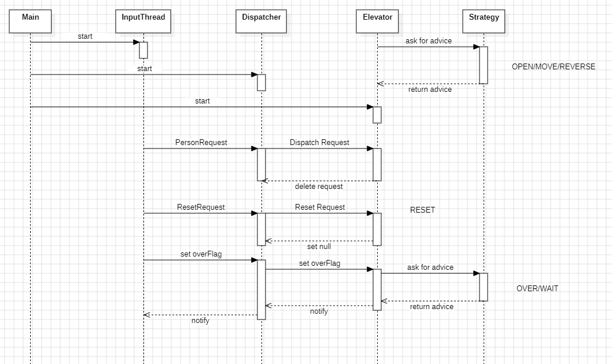
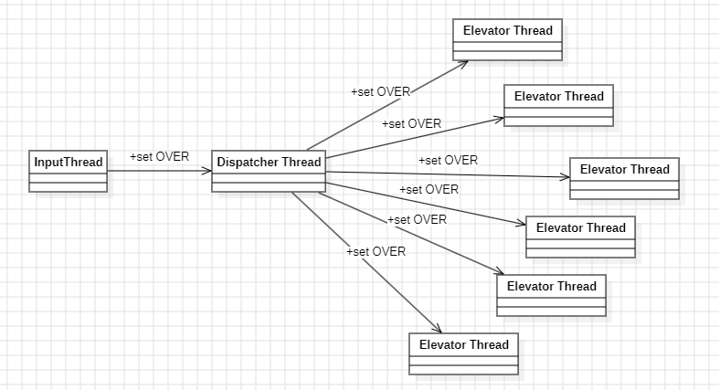
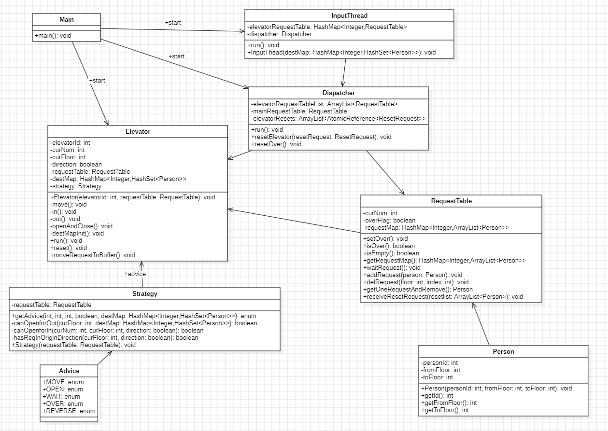
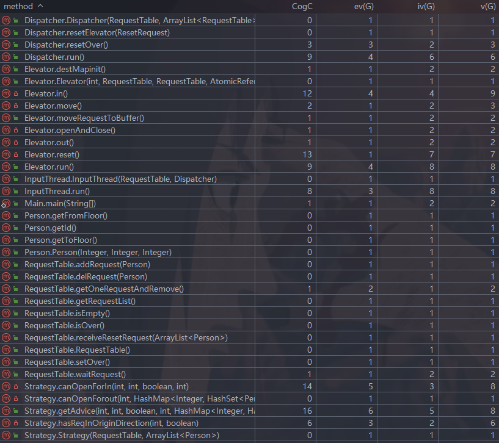

# OO第二单元第二次作业

[toc]

## 0.题目新增需求

* 乘客不再固定电梯接送，设计电梯调度策略
* 增加RECEIVE输出，避免自由竞争策略
* 增加RESET请求，时长1.2s，在RESET期间电梯处于静默状态(不可以开关门、移动、RECEIVE等)，重置电梯

## 1.处理流程分析

### 1.1 电梯调度策略

​	在本次作业中，需要设计将乘客分配给合适的电梯的调度器(~~补第五次作业偷的懒~~)，我的设计中选择将调度器作为一个线程实现，输入线程与调度器线程交互，调度器线程与六个电梯线程交互。对于单个电梯运行的策略我保留了第五次作业的LOOK算法，对于多部电梯的分配策略，我选择了**性价比较高**的调参方法，性价比体现在代码量较少的同时能够拿到比较好的性能分数。UML时序图如下

#### 1.1.1 UML时序图



#### 1.1.2 调参算法

​	所谓调参算法其实就是选取几个有关电梯的指标，给这些指标赋予合适的参数，为每部电梯计算出得分，选择得分最高的电梯进行分配。我选取的指标有**电梯接到该乘客需要走的距离，电梯中人数，电梯等待队列中人数，电梯容量，电梯速度**。

* 距离：这里距离的计算是不准确的，没有找出电梯运行的**上确界或下确界**，即没有找出电梯运行到哪里就可以转向，而是同一按照1/11处理

  ```java
  private int getDistance(int fromFloor,int toFloor,int curFloor,boolean direction) {
          int distance = 0;
          int flow = (direction) ? 1 : -1;
          if ((toFloor - fromFloor) * flow > 0) { // 乘客移动方向与电梯当前移动方向相同
              if ((fromFloor - curFloor) * flow >= 0) { // 电梯沿当前方向能接到乘客
                  distance = abs(fromFloor - curFloor);
              } else {
                  if (flow == 1) {
                      distance = 20 - curFloor + fromFloor;
                  } else {
                      distance = 20 + curFloor - fromFloor;
                  }
              }
          } else {
              if (flow == 1) {
                  distance = 22 - curFloor - fromFloor;
              } else {
                  distance = curFloor + fromFloor - 2;
              }
          }
          return distance;
      }
  ```

* 电梯状态：电梯状态这个参数实际上是**电梯容量、电梯中人数、电梯等待队列中人数**三个量经过调参得来的，可以**适当增加电梯等待队列中人数的权重**，避免给一部性能好的电梯分配太多乘客，这样的性能可能还不如大家都运行

  ```java
      private double getState(int capacity,int curNum,int waitNum) {
          return 1.3 * capacity - 1.1 * curNum - 1.0 * waitNum;
      }
  ```

* 计算得分：这里借鉴了肖灿学长的博客中的公式(~~千万别用线性公式~~)

  ```java
      private double getScore(int distance,double state,double speed) {
          return (25 - distance + state - 5 * speed) / sqrt(speed);
      }
  ```

​	**关于后续被卡RTLE的处理**：在电梯同时reset时，这样各部电梯得分都是相同的，我的实现中会把乘客都分给第一部电梯(**擂台法记录最高得分的方式**)，只需要在计算得分相同时，再次判断两个电梯中哪一部的等待队列中人数少并加入其中就可以解决这个问题，或者说多部电梯同时reset且得分相同的情况约等于模6实现。

```java
 double score = calculateScore(elevator,person);
 if (score > bestScore) {
 	bestScore = score;
 	bestElevatorId = i;
 	bestWaitNum = elevator.getWaitNum();
 } else if (score == bestScore) {
 	if (elevator.getWaitNum() < bestWaitNum) {
 		bestScore = score;
 		bestElevatorId = i;
 		bestWaitNum = elevator.getWaitNum();
 	}
 }
```

### 1.2 RESET请求的实现方式

#### 1.2.1 RESET实现

​	对于RESET请求的实现方式我最初使用了调度器线程和电梯线程直接交互的方式，这样的实现涉及到两个线程的交互。后来从```Kai_Ker```大佬那里学习到一种在电梯内部让电梯自行实现RESET的方式，并在重构中实现(~~膜拜~~)。

>  原子类型类 AtomicReference<>

​	使用原子类型类```AtomicReference<ResetRequest>```，可以保证对于该类访问的线程安全性。这里设计ResetRequest为调度器线程和电梯线程的共享对象，在调度器中以数组形式管理六部电梯的六个ResetRequest变量。下面梳理一下处理流程：

​	在输入线程```InputThread```中，构建乘客总请求表```mainRequestTable```，负责保管所有的乘客请求，如果拿到重置请求直接调用调度器进行处理

```java
			 while (true) {
                Request request = elevatorInput.nextRequest();
                if (request == null && dispatcher.resetOver()) {
                    mainRequestTable.setOver();
                    break;
                } else if (request == null) {
                    mainRequestTable.waitRequest();
                } else if (request instanceof PersonRequest) {
                    // 构建乘客实例
                    mainRequestTable.addRequest(person);
                } else if (request instanceof ResetRequest) {
                    this.dispatcher.resetElevator((ResetRequest) request);
                }
            }
```

​	在调度器线程```Dispatcher```中，有管理六部电梯的Reset请求的数组```ArrayList<AtomicReference<ResetRequest>> elevatorResets```，当调度器拿到重置请求，**就把重置请求放进数组中对应的位置，并且要唤醒对应的电梯线程，因为电梯线程此时可能处于WAIT**。而电梯线程中保管着一个ResetRequest(对应着调度器线程数组中的一个元素)，电梯每次运行时检查一下自己的ResetRequest是否不为空，即调度器线程是否在数组对应位置放了充值请求，如果有就先处理重置请求。

* 调度器线程

  ```java
      public void resetElevator(ResetRequest request) {
          this.elevatorResets.get(elevatorId - 1).set((ResetRequest)request);
          synchronized (this.elevatorRequestTableList.get(elevatorId - 1)) {
              this.elevatorRequestTableList.get(elevatorId - 1).notify();
          }
      }
  ```

* 电梯线程

  ```java
      public void run() {
          while (true) {
              if (this.resetRequest.get() != null) {
                  this.reset();
                  continue;
              }
              //获得建议并运行...
          }
      }
  
  ```

​	在电梯拿到reset请求后，重置自己的速度和容量属性。题目中要求在输出RESET-ACCEPT之后移动楼层不超过两层(不输出超过两次ARRIVE)，似乎这里还有优化空间，例如让电梯尽力走两层多送些人，但是我并没有针对这一点作出设计，而是拿到RESET请求就执行。当拿到RESET请求后，先判断电梯中此时是否有人(```curNum```)，如果有人就要把人清空，和等待队列中的人一起扔回总请求表重新调度(这里扔回总请求表重新调度的性能应当优于放回电梯自身的等待队列，因为重置之后该电梯不一定就是得分最高，**同时应当注意扔回去的请求要改变起始楼层fromFloor**)。**这里唯一算作优化的一点是，在重置时，可以判断一下电梯中是否有人在重置时的楼层下电梯，避免已经完成了运送又重新调度。**

```java
private void reset() {
        speed = resetRequest.get().getSpeed();
        capacity = resetRequest.get().getCapacity();
        // 如果电梯中有人
        if (curNum != 0) {
            // OPEN-CLOSE 如果目的地不是当前楼层扔回buffer
        }
        TimableOutput.println(String.format("RESET_BEGIN-%d",elevatorId));
        try {
            Thread.sleep(1200);
        } catch (InterruptedException e) {
            e.printStackTrace();
        }
        TimableOutput.println(String.format("RESET_END-%d",elevatorId));
        // 需要注意的是在输出之后扔回 避免提前receive
        requestTable.receiveResetRequest(buffer);
    	mainRequestTable.receiveResetRequest(requestTable.getRequestList());
   		// 需要注意的是最后才能set null 防止主请求表提前结束
        resetRequest.set(null);
    }
```

* 这里同样需要注意的一点是，**输出RESET，扔回总表，set(null)的顺序**
* 关于buffer的设计后面介绍

​	**在```receiveResetRequest```方法中，要注意唤醒对应的线程。**我们知道，当输入线程拿到的请求为空但但电梯线程不能结束时输入线程和调度器线程会陷入WAIT状态，当电梯等待队列中没有请求且没有被设置结束时陷入WAIT状态。**当我们扔回请求时，破坏了等待条件中的没有请求，需要唤醒线程再次进行确认**

```java
    public synchronized void receiveResetRequest(ArrayList<Person> resetRequest) {
        this.requestList.addAll(resetRequest);
        resetRequest.clear(); // 每次扔回之后需要清空
        this.notify();
    }
```

#### 1.2.2 buffer设计

​	题目中要求，在RESET过程中，电梯处于静默状态，不能输出RECEIVE等。一种比较简单的想法是，在分配乘客时，如果电梯处于RESET中，就不给他分配乘客。但是一种典型的情况是，六部电梯同时RESET，并在RESET期间输入大量乘客请求，以上做法很容易发生分配策略不佳导致超时RTLE或不断查询电梯状态的CTLE问题。**一种较好的的解决办法是：即使电梯处于reset过程中，照样给电梯分配请求，具体的实现需要为电梯中请求队列之外新增一个缓冲队列buffer，调度器将乘客分配到电梯的请求队列中，每次电梯运行时，再从请求队列中将请求移动到缓冲队列中，这时统一输出RECEIVE**

```java
// Elevator.java
public void run() {
    while (true) {
        if (this.resetRequest.get() != null) {
            this.reset();
            continue;
        }
        // 将调度器与电梯的共享队列中的请求移动到buffer中并输出 每一次调用后requestTable一定为空
        moveRequestToBuffer();
        // 获得建议并运行
    }
}

public void moveRequestToBuffer() {
    while (!requestTable.isEmpty()) {
        Person person = requestTable.getOneRequestAndRemove();
        buffer.add(person);
        TimableOutput.println(String.format("RECEIVE-%d-%d",
                person.getId(),elevatorId));
    }
}
```

### 1.3 电梯线程结束条件

​	这次的作业中，设置线程的结束实际上是一个**链式**的过程，可如下图描述



​	所以重要的是考虑好**起爆点**的设计，即在输入线程中主请求表mainRequestTable的结束会导致调度线程和电梯线程的结束。我们知道，电梯的RESET请求会将乘客请求扔回mainRequestTable，即**电梯相当于mainRequestTable的生产者**，故mainRequestTable**结束条件为拿到的请求为空并且所有的RESET请求都处理完(reset数组中每个元素都为空)**。

```java
// InputThread
public void run() {
        try {
            ElevatorInput elevatorInput = new ElevatorInput(System.in);
            while (true) {
                Request request = elevatorInput.nextRequest();
                if (request == null && dispatcher.resetOver()) {
                    mainRequestTable.setOver();
                    break;
                } else if (request == null) {
                    mainRequestTable.waitRequest();
                } else if (request instanceof PersonRequest) {
                   //...
                } else if (request instanceof ResetRequest) {
                    this.dispatcher.resetElevator((ResetRequest) request);
                }
            }
            elevatorInput.close();
        } catch (IOException e) {
            e.printStackTrace();
        }
    }
```

```java
//Dispatcher
    public void run() {
        while (true) {
            if (mainRequestTable.isEmpty() && mainRequestTable.isOver()) { 
                for (RequestTable requestTable : this.elevatorRequestTableList) {
                    requestTable.setOver();
                }
                break;
            }
            Person person = mainRequestTable.getOneRequestAndRemove();
            if (person == null) {
                mainRequestTable.waitRequest(); //需要wait 不然会CTLE
            }
        	// 分配...
        }
    }

    public boolean resetOver() {
        for (AtomicReference<ResetRequest> resetRequest : this.elevatorResets) {
            if (resetRequest.get() != null) {
                return false;
            }
        }
        return true;
    }

```

* 这里```mainRequestTable.isEmpty() && mainRequestTable.isOver()```即为电梯处理RESET中先扔回请求再对ResetRequest置空的原因，防止置空之后请求还没扔回来的时候就错判结束了电梯线程

## 2. UML类图及代码复杂度分析

### 2.1 UML类图



### 2.2 代码复杂度分析



* 代码复杂度主要聚集在策略类中判断策略的部分和电梯的动作```in```以及```reset```等，和上次作业一样

## 3. Bug修复与策略

* 强测中未出现bug，互测中被卡了RTLE，通过小规模重构改正，重构后架构如前文所述
* 关于CTLE：代码中出现轮询的问题大概是线程的run方法中while循环的问题，可以通过打印输出发现，只需要设置适当的条件使得线程阻塞而非始终循环

