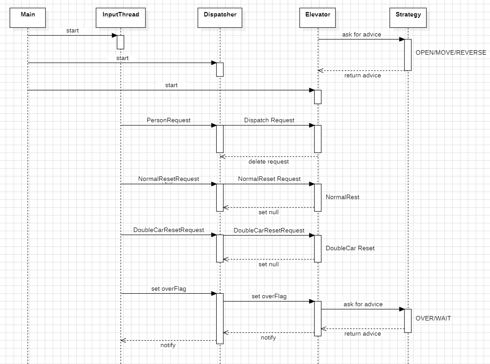
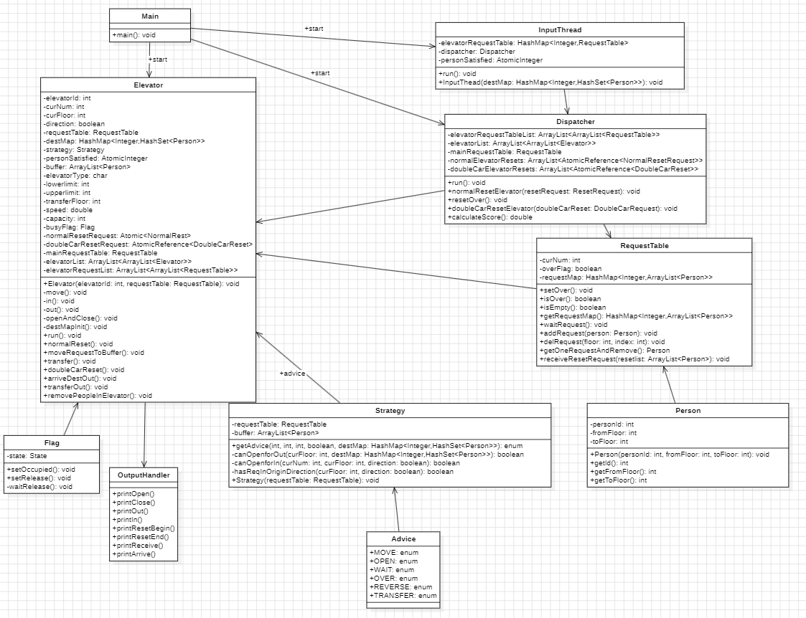

# OO第二单元第三次作业

[toc]

## 0.本次作业新增需求

* 新增一种```RESET```请求，可以将单部电梯重置为双轿电梯
* ```[时间戳]RESET_ACCEPT-电梯ID-换乘楼层-每个轿厢的满载人数-每个轿厢移动一层的时间(单位s)```
* 重置电梯两个轿厢的参数相同（满载人数、移动一层的时间）
* 重置完成后轿厢A默认在换乘楼层的下一层，轿厢B默认在换乘楼层的上一层
* 轿厢A只能在换乘楼层及以下运行，轿厢B只能在换乘楼层及以上运行
* **两个轿厢不能同时处于换乘楼层**
* **特别地，双轿厢电梯可以不受RECEIVE约束地从换乘楼层移动一层以离开换乘楼层**
* **保证双轿厢电梯不会接收到第一类重置请求和第二类重置请求**。
* 换乘楼层在3层和9层之间
* 双轿厢电梯耗电量为$\frac 1 4$

## 1.处理流程分析

​	本次作业中主要的任务即为处理新增的RESET请求，对于上次作业已有的调度策略没有进行改变，目标比较明确。下面是时序图

### 1.1 UML时序图



### 1.2 新增RESET请求的处理

#### 1.2.1 Elevator

​	本次作业中对于双轿厢RESET请求的类协作与第二次作业中普通重置请求相同。这里我对于RESET请求的处理方式是接收到双轿厢RESET请求时新建一个线程，将原来的线程作为A轿厢，新建的电梯线程作为B轿厢。这里首先给出电梯新增的几个属性

```java
//Elevator
private char elevatorType = 'C'; // 轿厢类型 A B
private int transferFloor = -1;
private int lowerLimit = 1;
private int upperLimit = 11;
private Flag busyFlag = null; // 一组电梯共享一个flag进行通信
private AtomicInteger personSatisfied;
```

* ```elevatorType```：电梯的类型，初始时电梯的类型为C类型，双轿厢重置后修改为A/B类型
* ```lowerlimit/upperlimit```：电梯的运行楼层限制，用于Dispatcher中对于符合运行范围电梯的筛选
* ```transferFloor```：换乘楼层(似乎没用，不是lowerlimit就是upperlimit)
* ```busyFlag```：用于控制双轿厢电梯在换乘楼层互斥的需求，这里借鉴了讨论区中实现线程安全类的思路
* ```personSatisfied```：计数器，所有电梯线程和输入线程的共享变量，当一个乘客需求被满足(送到指定楼层)，该原子类型+1

​	参考NormalReset在第二次作业中的实现方式，DoubleCarReset我选择相同的实现方法，当电梯拿到DoubleCarReset请求之后立即进行重置

```java
// Elevator
    private void doubleCarReset() {
        if (curNum != 0) {
            removePeopleInElevator();
        }
        OutputHandler.printResetBegin(elevatorId);
        try {
            Thread.sleep(1200);
        } catch (InterruptedException e) {
            e.printStackTrace();
        }
        OutputHandler.printResetEnd(elevatorId);
        // 创建新电梯线程
        //...
        newelevator.start();
        // 加入与Dispatcher共享变量中
        this.elevatorList.get(elevatorId - 1).add(newelevator);
        this.elevatorRequestTableList.get(elevatorId - 1).add(newRequestTable);
        // reset后全部扔回，防止在reset期间分配到不符合reset后电梯运行范围的乘客请求
        this.requestTable.receiveResetRequest(buffer);
        this.mainRequestTable.receiveResetRequest(this.requestTable.getRequestList());
        doubleCarResetRequest.set(null);
    }
```

* **注意输出，启动新电梯线程，扔回乘客请求，set(null)的顺序，这里不再赘述**。
* 这里建立新线程之后将新线程的Elevator和RequestTable加入到与Dispatcher共享的电梯表和电梯请求表中，便于获取电梯状态计算得分以及分配乘客请求。
* **需要注意的是在电梯重置过程中调度器还在进行分配，可能会出现分配的乘客不满足RESET后电梯运行范围的问题**，在我的实现中，将原电梯的等待队列变为A轿厢的等待队列，这样如果分配了位于transferFloor之上的请求就会出现错误，所以我的实现是在第二类RESET之后将给他分配的所有请求扔回去重新调度(更加精确的做法似乎是判断一下范围，将不符合范围的请求扔回去，但是感觉不如直接扔回去简洁且没有bug)

​	在电梯移动过程中，需要注意利用busyFlag占领和释放换乘楼层，或者说，当移动到换乘楼层时进行占领(occupy)，离开换乘楼层时进行释放(release)

```java
    private void move() {
        try {
            Thread.sleep((long) (1000 * speed));
        } catch (InterruptedException e) {
            e.printStackTrace();
        }
        int pace = (direction) ? 1 : -1;
        curFloor += pace;
        if (elevatorType != 'C' && curFloor == transferFloor) {
            busyFlag.setOccupied();
        }
        OutputHandler.printArrive(elevatorType,curFloor,elevatorId);
        if (elevatorType != 'C' & curFloor - pace == transferFloor) {
            busyFlag.setRelease();
        }
    }
```

​	需要修改电梯中出乘客的out方法，我们可以将需要出电梯的乘客分为两类

* 到达目的地
* 还没到达目的地但已经到达换乘楼层：扔回总请求队列重新调度

```java
    private void out() {
        // 到达目的地的人出电梯
        if (!destMap.get(curFloor).isEmpty()) {
            arriveDestOut();
        }
        // 需要换乘的人出电梯
        if (elevatorType != 'C' && curFloor == transferFloor) {
            transferOut();
        }
    }
```

#### 1.2.2 Flag

​	这里借鉴了讨论区同学的思路(~~膜拜~~),我的理解是，实际上是相当于对换乘楼层上了锁，一个轿厢到达换乘楼层时上锁，若锁被另一个轿厢占用则等待不输出，直到另一个轿厢释放锁，该轿厢占有锁，输出ARRIVE，这样在保证正确性的同时又保证了性能(~~再次膜拜~~)

```java
public class Flag {
    enum State { BUSY, IDLE }

    private State state;

    public Flag() {
        this.state = State.IDLE;
    }

    public synchronized void setOccupied() {
        waitRelease(); // 两个轿厢共享一个flag 相当于对这=换乘楼层的访问进行了上锁 一个走另一个才能访问
        this.state = State.BUSY;
        notifyAll();
    }

    private synchronized void waitRelease() {
        notifyAll();
        while (this.state == State.BUSY) {
            try {
                wait();
            } catch (InterruptedException e) {
                e.printStackTrace();
            }
        }
    }

    public synchronized void setRelease() {
        this.state = State.IDLE;
        notifyAll();
    }
}
```

#### 1.2.3 Strategy

* 在策略类中需要新增一种建议TRANSFER，当一个轿厢要在换乘楼层WAIT或OVER时先进行TRANSER，即转向离开换乘楼层，防止另一个轿厢不能到达换乘楼层导致死锁

```java
if (buffer.isEmpty()) { // 当前的缓冲队列为空
	if (requestTable.isOver() && requestTable.isEmpty()) {
		if (curFloor == transferFloor) {
			return Advice.TRANSFER;
		} else {
			return Advice.OVER;
		}
	} else {
		if (curFloor == transferFloor) {
			return Advice.TRANSFER;
		} else {
			return Advice.WAIT;
		}
	}
}
```

#### 1.2.4 Dispatcher

​	在调度器中，并没有对调参算法进行改进，只需要对**电梯进行筛选，不能分配给运行范围不符合乘客需求的电梯**。筛选的标准即为**电梯能接到乘客**：

* 若乘客上行，则电梯的lowerlimit应当小于等于乘客起始楼层fromFloor，电梯的upperlimit应当大于fromFloor
* 若乘客下行，则电梯的upperlimit应当大于等于乘客起始楼层fromFloor，电梯的lowerlimit应该小于fromFloor

```java
 for (Elevator elevator : doubleElevator) {
                if (direction && elevator.getLowerLimit() > fromFloor
                        || direction && elevator.getUpperLimit() <= fromFloor) {
                    continue;
                } else if (!direction && elevator.getUpperLimit() < fromFloor
                        || !direction && elevator.getLowerLimit() >= fromFloor) {
                    continue;
                }
                double score = calculateScore(elevator,person);
                //...
            }
```

#### 1.2.5 OutputHandler

​	由于本次作业中输出时需要判断电梯的类型，如果在每次输出时进行判断，则显得过于臃肿，故考虑到构建一个输出类，利用类中的静态输出方法区分电梯类别输出，例如：

```java
    public static void printOpen(char elevatorType,int curFloor,int elevatorId) {
        switch (elevatorType) {
            case 'A':
                TimableOutput.println(String.format("OPEN-%d-%d-A",curFloor,elevatorId));
                break;
            case 'B':
                TimableOutput.println(String.format("OPEN-%d-%d-B",curFloor,elevatorId));
                break;
            case 'C':
                TimableOutput.println(String.format("OPEN-%d-%d",curFloor,elevatorId));
                break;
            default:
                break;
        }
    }
```

### 1.3 电梯线程结束的条件

​	在这次作业中，由于换乘乘客也需要扔回去重新调度，加上两种RESET请求，设置结束的条件更加复杂。最初我写了各种“旁敲侧击”的条件，例如各种队列是否为空，但是效果并不好，总是出现电梯线程提前结束的情况。其实关于**电梯线程结束最直接的条件**就是**一定要满足人民对于美好生活的需求**，**即判断是不是所有的乘客都已经到达了目的地，是不是所有的两类reset请求都已经完成。**

* 是不是所有乘客都已经到达了目的地
  * 设置一个全局共享计数器，```personSatisfied```，每当一个乘客到达目的地，+1
  * 在输入线程中设置一个乘客计数器，```personCnt```，每拿到一个乘客请求，+1
* 是不是两类reset请求都已经完成
  * 遍历两个数组中是不是每个元素都是空

```java
//InputThread
    public void run() {
        try {
            ElevatorInput elevatorInput = new ElevatorInput(System.in);
            int personCnt = 0; // 计算乘客数量
            while (true) {
                Request request = elevatorInput.nextRequest();
                if (request == null &&
                        (personCnt == personSatisfied.get()) && (dispatcher.ResetOver())) {
                    mainRequestTable.setOver();
                    break;
                } else if (request == null) {
                    mainRequestTable.waitRequest();
                } else if (request instanceof PersonRequest) {
                    //...
                    personCnt++;
                } else if (request instanceof NormalResetRequest) {
                    this.dispatcher.normalResetElevator((NormalResetRequest) request);
                } else if (request instanceof DoubleCarResetRequest) {
                    this.dispatcher.doubleCarResetElevator((DoubleCarResetRequest) request);
                }
            }
            elevatorInput.close();
        } catch (IOException e) {
            e.printStackTrace();
        }
    }
```

```java
//Dispatcher
    public boolean ResetOver() {
        for (AtomicReference<DoubleCarResetRequest> doubleCarResetRequest :
                this.doubleCarElevatorResets) {
            if (doubleCarResetRequest.get() != null) {
                return false;
            }
        }
        for (AtomicReference<NormalResetRequest> normalResetRequest :
                this.normalCarElevatorResets) {
            if (normalResetRequest.get() != null) {
                return false;
            }
        }
        return true;
    }
```

## 2. UML图以及代码复杂度分析

### 2.1 UML图



### 2.2 代码复杂度分析

| Dispatcher.calculateScore(Elevator, Person)                  | 0.0  | 1.0  | 1.0  | 1.0  |
| ------------------------------------------------------------ | ---- | ---- | ---- | ---- |
| Dispatcher.Dispatcher(RequestTable, ArrayList>, ArrayList>, ArrayList>, ArrayList>) | 0.0  | 1.0  | 1.0  | 1.0  |
| Dispatcher.dispatchRequest(Person)                           | 23.0 | 5.0  | 14.0 | 15.0 |
| Dispatcher.doubleCarResetElevator(DoubleCarResetRequest)     | 0.0  | 1.0  | 1.0  | 1.0  |
| Dispatcher.doubleCarResetOver()                              | 3.0  | 3.0  | 2.0  | 3.0  |
| Dispatcher.getDistance(int, int, int, boolean)               | 13.0 | 1.0  | 3.0  | 6.0  |
| Dispatcher.getScore(int, double, double)                     | 0.0  | 1.0  | 1.0  | 1.0  |
| Dispatcher.getState(int, int, int)                           | 0.0  | 1.0  | 1.0  | 1.0  |
| Dispatcher.normalResetElevator(NormalResetRequest)           | 0.0  | 1.0  | 1.0  | 1.0  |
| Dispatcher.run()                                             | 13.0 | 4.0  | 7.0  | 7.0  |
| Elevator.arriveDestOut()                                     | 1.0  | 1.0  | 2.0  | 2.0  |
| Elevator.destMapinit()                                       | 1.0  | 1.0  | 2.0  | 2.0  |
| Elevator.doubleCarReset()                                    | 2.0  | 1.0  | 3.0  | 3.0  |
| Elevator.Elevator(int, RequestTable, RequestTable, AtomicReference, AtomicReference, ArrayList>, ArrayList>, ...) | 0.0  | 1.0  | 1.0  | 1.0  |
| Elevator.elevatorAinit(int, Flag, double, int)               | 0.0  | 1.0  | 1.0  | 1.0  |
| Elevator.elevatorBinit(int, Flag, double, int)               | 0.0  | 1.0  | 1.0  | 1.0  |
| Elevator.getCapacity()                                       | 0.0  | 1.0  | 1.0  | 1.0  |
| Elevator.getCurFloor()                                       | 0.0  | 1.0  | 1.0  | 1.0  |
| Elevator.getCurNum()                                         | 0.0  | 1.0  | 1.0  | 1.0  |
| Elevator.getDirection()                                      | 0.0  | 1.0  | 1.0  | 1.0  |
| Elevator.getElevatorType()                                   | 0.0  | 1.0  | 1.0  | 1.0  |
| Elevator.getLowerLimit()                                     | 0.0  | 1.0  | 1.0  | 1.0  |
| Elevator.getSpeed()                                          | 0.0  | 1.0  | 1.0  | 1.0  |
| Elevator.getUpperLimit()                                     | 0.0  | 1.0  | 1.0  | 1.0  |
| Elevator.getWaitNum()                                        | 0.0  | 1.0  | 1.0  | 1.0  |
| Elevator.in()                                                | 12.0 | 4.0  | 4.0  | 9.0  |
| Elevator.move()                                              | 5.0  | 1.0  | 4.0  | 6.0  |
| Elevator.moveRequestToBuffer()                               | 3.0  | 3.0  | 2.0  | 3.0  |
| Elevator.normalReset()                                       | 2.0  | 1.0  | 3.0  | 3.0  |
| Elevator.openAndClose()                                      | 1.0  | 1.0  | 2.0  | 2.0  |
| Elevator.out()                                               | 3.0  | 1.0  | 3.0  | 4.0  |
| Elevator.removePeopleInElevator()                            | 8.0  | 1.0  | 5.0  | 5.0  |
| Elevator.run()                                               | 12.0 | 5.0  | 10.0 | 10.0 |
| Elevator.transfer()                                          | 4.0  | 1.0  | 1.0  | 5.0  |
| Elevator.transferOut()                                       | 12.0 | 1.0  | 6.0  | 6.0  |
| Flag.Flag()                                                  | 0.0  | 1.0  | 1.0  | 1.0  |
| Flag.setOccupied()                                           | 0.0  | 1.0  | 1.0  | 1.0  |
| Flag.setRelease()                                            | 0.0  | 1.0  | 1.0  | 1.0  |
| Flag.waitRelease()                                           | 3.0  | 1.0  | 3.0  | 3.0  |
| InputThread.InputThread(RequestTable, Dispatcher, AtomicInteger) | 0.0  | 1.0  | 1.0  | 1.0  |
| InputThread.run()                                            | 9.0  | 3.0  | 10.0 | 10.0 |
| Main.main(String[])                                          | 1.0  | 1.0  | 2.0  | 2.0  |
| OutputHandler.printArrive(char, int, int)                    | 1.0  | 1.0  | 1.0  | 4.0  |
| OutputHandler.printClose(char, int, int)                     | 1.0  | 1.0  | 1.0  | 4.0  |
| OutputHandler.printIn(char, int, int, int)                   | 1.0  | 1.0  | 1.0  | 4.0  |
| OutputHandler.printOpen(char, int, int)                      | 1.0  | 1.0  | 1.0  | 4.0  |
| OutputHandler.printOut(char, int, int, int)                  | 1.0  | 1.0  | 1.0  | 4.0  |
| OutputHandler.printReceive(char, int, int)                   | 1.0  | 1.0  | 1.0  | 4.0  |
| OutputHandler.printResetBegin(int)                           | 0.0  | 1.0  | 1.0  | 1.0  |
| OutputHandler.printResetEnd(int)                             | 0.0  | 1.0  | 1.0  | 1.0  |
| Person.getFromFloor()                                        | 0.0  | 1.0  | 1.0  | 1.0  |
| Person.getId()                                               | 0.0  | 1.0  | 1.0  | 1.0  |
| Person.getToFloor()                                          | 0.0  | 1.0  | 1.0  | 1.0  |
| Person.Person(Integer, Integer, Integer)                     | 0.0  | 1.0  | 1.0  | 1.0  |
| RequestTable.addRequest(Person)                              | 0.0  | 1.0  | 1.0  | 1.0  |
| RequestTable.delRequest(Person)                              | 0.0  | 1.0  | 1.0  | 1.0  |
| RequestTable.getOneRequestAndRemove()                        | 1.0  | 2.0  | 1.0  | 2.0  |
| RequestTable.getRequestList()                                | 0.0  | 1.0  | 1.0  | 1.0  |
| RequestTable.isEmpty()                                       | 0.0  | 1.0  | 1.0  | 1.0  |
| RequestTable.isOver()                                        | 0.0  | 1.0  | 1.0  | 1.0  |
| RequestTable.receiveResetRequest(ArrayList)                  | 0.0  | 1.0  | 1.0  | 1.0  |
| RequestTable.RequestTable()                                  | 0.0  | 1.0  | 1.0  | 1.0  |
| RequestTable.setOver()                                       | 0.0  | 1.0  | 1.0  | 1.0  |
| RequestTable.waitRequest()                                   | 1.0  | 1.0  | 2.0  | 2.0  |
| Strategy.canOpenForIn(int, int, boolean, int)                | 14.0 | 5.0  | 3.0  | 8.0  |
| Strategy.canOpenForout(int, int, char, HashMap>)             | 19.0 | 9.0  | 7.0  | 9.0  |
| Strategy.getAdvice(int, int, char, int, boolean, int, HashMap>) | 26.0 | 8.0  | 5.0  | 10.0 |
| Strategy.hasReqInOriginDirection(int, boolean)               | 6.0  | 3.0  | 2.0  | 6.0  |
| Strategy.Strategy(RequestTable, ArrayList)                   | 0.0  | 1.0  | 1.0  | 1.0  |

* 代码复杂度主要集中在调参算法分配策略、电梯的动作、策略类中

## 3.Bug修复与策略

* 本次作业中强测和互测均未出现bug
* 房友出现RTLE问题

