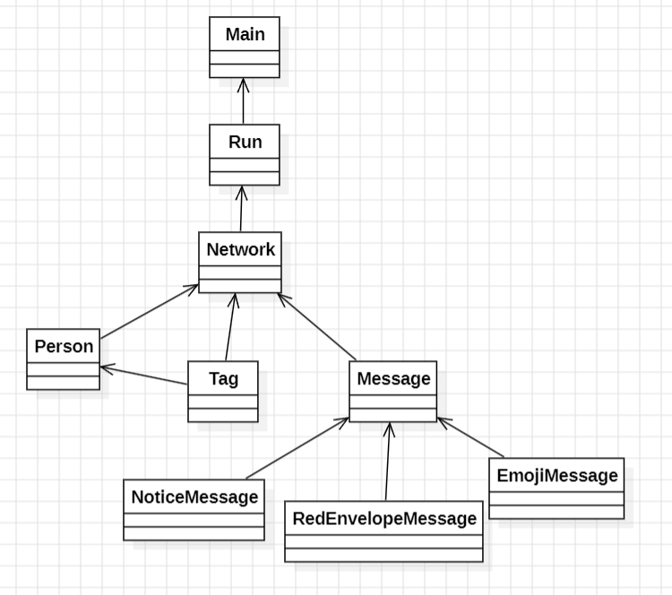
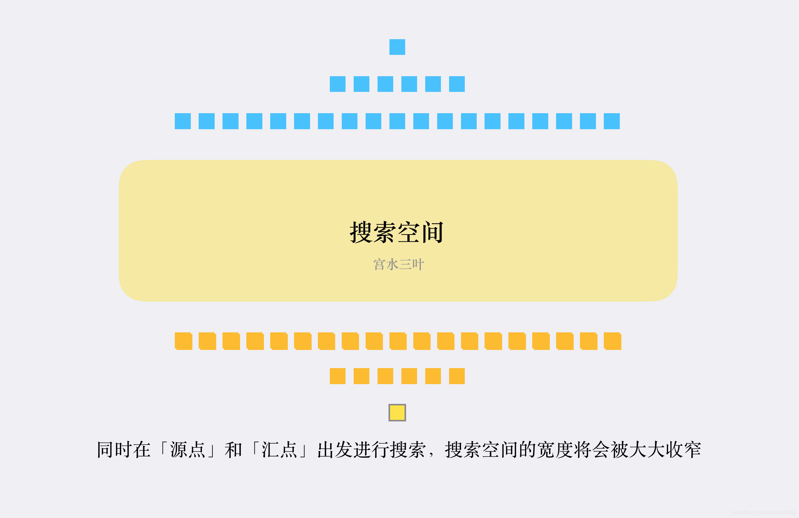

# OO第三单元——JML

## 一. 单元架构设计

​	相比于前两单元需要自行设计架构，充当架构设计师的角色，U3不需要设计架构，需要完成的任务是依据课程组给出的架构设计合理的类协作关系以及依据JML写对应的代码(~~码农日常~~)。

​	关于课程组给出的架构可以简单概括如下图



## 二. 算法实现与性能

​	本单元更加关注的是对于既定的JML或者说给定的功能要求，具体的算法实现和效率。强测中对于性能有一定要求，性能不佳会爆CTLE。我的理解中，CTLE字面意思上是CPU时间超时，换句话说其实就是**“算的次数太多“**，在本单元作业中，可以采用缓存一些计算复杂度较高的结果进行优化等，下面基于每一次作业进行分析。

### 1. hw9

​	这一次作业中主要的性能考察点是关于```query_block_sum```中查询两个点是否联通的功能。在本次作业中，通过```addRelation```和```modifyRelation```可以建立起一个社交图，**这其中需要注意的是modifyRelation操作可能删边**。很多大佬同学实现了可以删边的并查集，我选择了实现较为简单(~~懒~~)的BFS。使用BFS进行联通查询面对大量查询指令有CTLE风险，故可以考虑对BFS进行一点简单优化，例如使用双向BFS。**关于双向BFS，其实就是从起点和终点同时开始搜索，面对图中点非常多的情况可以大幅减少开销。**

​	下面是一张摘自[广度优先搜索之双向bfs（实操篇）-CSDN博客](https://blog.csdn.net/asd0356/article/details/118311064)的一张很形象的图片。



​	双向BFS的优势其实就是大幅减少搜索宽度，减少遍历一些点，让它看上去没有那么暴力。由此还有一种优化的思路就是**均衡取节点**。当我们从给起点和终点分别设置的队列中取节点时，可以选择从size较小的那一个队列中取出(size较大的那一方说明他每一层中的宽度较大，遍历开销大)。下面给出我的具体实现（主要想法是起点终点两个队列两个visited数组，当前遍历如果另一边如果遍历过，结束）：

```java
import java.util.HashMap;
import java.util.LinkedList;
import java.util.Queue;

public class BreadthFirstSearch {
    public static boolean isConnected(MyPerson person1,MyPerson person2) {
        if (person1.getId() == person2.getId()) {
            return true;
        }
        HashMap<Integer, Boolean> visited1 = new HashMap<>();
        HashMap<Integer, Boolean> visited2 = new HashMap<>();
        visited1.put(person1.getId(),true);
        visited2.put(person2.getId(),true);
        Queue<MyPerson> queue1 = new LinkedList<>();
        Queue<MyPerson> queue2 = new LinkedList<>();
        queue1.add(person1);
        queue2.add(person2);
        while (!queue1.isEmpty() && !queue2.isEmpty()) {
            if (queue1.size() < queue2.size()) {
                MyPerson now = queue1.poll();
                if (next(now,visited1,visited2,queue1)) {
                    return true;
                }
            } else {
                MyPerson now = queue2.poll();
                if (next(now,visited2,visited1,queue2)) {
                    return true;
                }
            }
        }
        return false;
    }

    private static boolean next(MyPerson now,HashMap<Integer,Boolean> visited,
                                HashMap<Integer,Boolean> visited2,Queue<MyPerson> queue) {
        for (Person next : now.getAcquaintance().values()) {
            if (visited.containsKey(next.getId())) {
                continue;
            }
            if (visited2.containsKey(next.getId())) {
                return true;
            }
            queue.add((MyPerson) next);
            visited.put(next.getId(),true);
        }
        return false;
    }
}
```

​	对于另一个查询指令```query_triple_sum```也需要进行动态维护，在```addRelation```加边和```modifyRelation```删边时进行判断，并更新```qts```的值。

```java
    private void addTripleRelation(MyPerson person1,MyPerson person2) {
        for (Person person : person1.getAcquaintance().values()) {
            if (person2.isLinked(person)) {
                this.triple++;
            }
        }
    }

    private void deleteTripleRelation(MyPerson person1,MyPerson person2) {
        for (Person person : person1.getAcquaintance().values()) {
            if (person2.isLinked(person)) {
                this.triple--;
            }
        }
    }
```

### 2. hw10

​	在本次作业中主要的性能优化点主要是最短路径查询(懒人BFS)，以及一些计算结果的动态维护，最后是对于查询每个人的最好的朋友的优先队列实现。

​	首先是最短路径查询，无权图的最短路径查询可以用BFS算法，基于BFS的优化例如双向BFS上面已经介绍过，**但是需要注意的是，如果采用双向BFS进行最短路径查询，已经要保证起点和终点查询到的层数是一致的，即不要进行均衡取节点的优化，如果出现了查询速度不一致(起点和终点查询到的层数不一致)的问题，找到的路径不一定是最短路径。**所以本懒人果断选择写一个简单的BFS......

```java
public static int shortestPath(MyPerson person1, MyPerson person2) {
        if (person1.getId() == person2.getId()) {
            return 0;
        }
        HashMap<Integer, Integer> visited = new HashMap<>();
        visited.put(person1.getId(),0);
        Queue<MyPerson> queue = new LinkedList<>();
        queue.add(person1);
        while (!queue.isEmpty()) {
            MyPerson now = queue.poll();
            int step = visited.get(now.getId());
            for (Person next : now.getAcquaintance().values()) {
                if (visited.containsKey(next.getId())) {
                    continue;
                }
                if (next.getId() == person2.getId()) {
                    return step + 1;
                }
                queue.add((MyPerson) next);
                visited.put(next.getId(),step + 1);
            }
        }
        return -1;
    }
```

​	关于计算结果的动态维护，包括```tag```中人的年龄的均值，年龄的方差，socialValue之和，通过在```MyTag```类中维护年龄之和，年龄的平方和以及```socialValue```实现。

​	关于方差的计算，可以改写公式便于计算

```java
(agePowSum - 2 * ageSum * getAgeMean() +persons.size() * getAgeMean() * getAgeMean()) / persons.size();
```

​	给出一个比较典型的在向tag中加人时对于这些属性的动态维护为例子

```java
    public void addPerson(Person person) {
        ageSum += person.getAge();
        agePowSum += person.getAge() * person.getAge();
        persons.put(person.getId(), person);
        for (int id : persons.keySet()) {
            if (person.isLinked(persons.get(id))) {
                valueSum += 2 * person.queryValue(persons.get(id));
            }
        }
    }

```

​	关于查询每个人value最高的好友，java中有很好的支持，**只需要对TreeSet类重写一个compare方法实现双关键字比较**。

```java
 private final TreeSet<Person> sortedAquaintance = new TreeSet<>(new Comparator<Person>() {
        @Override
        public int compare(Person o1, Person o2) { //按照value从高到低排序 id从小到大
            int r = value.get(o2.getId()).compareTo(value.get(o1.getId()));
            if (r == 0) {
                return Integer.compare(o1.getId(),o2.getId());
            } else {
                return r;
            }
        }
    });

public Person getBestAcquaintance() {
    return sortedAquaintance.first();
}
```

​	**比较时需要注意的是要用Integer内置的compareTo方法，有同学用减法进行比较，产生了溢出的bug(~~不得不说数据挺强的~~)**

### 3. hw11

​	这一次作业新增的功能只要老老实实实现JML，没有特殊的性能优化点（~~或者有我没发现~~），或者更笼统的说，本单元的作业中，凡是id唯一的对象(例如Person，Message等)都可以用```HashMap```等类进行存储，优化查询效率，算是一点补充。

## 三.JUnit与测试

​	JUnit很好的符合了JML语言，在三次作业中编写参数化JUnit测试时，我都采用了**对照JML进行翻译**的方式。JUnit的编写过程主要是生成数据和进行检查两步，在进行检查时，我选择**不考虑效率地按照JML描述写出对应的功能代码**，将改代码的运行结果与我编写的代码的运行结果进行比较，并对调用自己编写方法后的元素进行```ensures```检查。

​	在以往的测试中，我们大都是采用**黑盒测试**的方法，即我们不关心代码的内部实现，给代码提供输入，检查输出的正确性，这也是我在进行自测或互测时大部分时间采用的方法。黑盒测试的弊端是，生成数据对于代码的覆盖率可能不够高，对于一些分支情况或边角细节无法覆盖，这样的缺点可以通过**白盒测试**解决，即我们去梳理代码内部的逻辑进行检查，并编写相应的数据进行测试，这样的测试开销是比较大的，但是可以更大程度上保证软件的安全性。

​	**单元测试**：单元测试是完成最小的软件设计单元（模块）的验证工作目标是确保模块被正确的编码，通常情况下是白盒的。

​	**功能测试**：测试代码的功能是否满足要求，即我们常说的代码正确性部分

​	**集成测试**：测试对于**不同模块之间的接口**，测试他们之间的协同配合工作是否正常，一般是由**黑盒测试**与静态**白盒测试**相结合。

​	**压力测试**：压力测试即面对大量数据、边界数据，软件是否能以正常的效率以及正确性完成任务，类似于我们的强测。

​	**回归测试**：回归测试是指在完成新的代码编写后对原能够通过的数据点进行检查，类似于我们的bug修复环节对于已通过测试点的检查。

## 四. JML学习体会

​	在本单元中，对于JML语言的学习让我收获颇丰。契约式编程可以在很大程度上减少bug的产生，JML类数学化的表述避免了自然语言描述中可能产生的**一千个人心中有一千个哈姆雷特**的歧义问题。JML对于前置条件、副作用、后置条件的明确规定也让编程者更加清楚的知道该方法的功能实现，并利于测试工程师编写测试代码。

​	在本单元中另一个主题就是设计与规格分离。JML只是为我们规定该方法的规格，具体的实现、选择算法以及数据结构由我们自行设计，而这也正是相同的规格不同的执行效率差异所在。在这一单元中，我采用了一以贯之的BFS算法，一点小优化是双向BFS，说我懒的话我没有辩解的理由。我的一贯指导思想是“够用就行”，我认为在软件开发中也有借鉴意义。登峰造极的优化固然让人钦佩，但是在满足甲方的要求条件下偷懒也未尝不算英雄。

