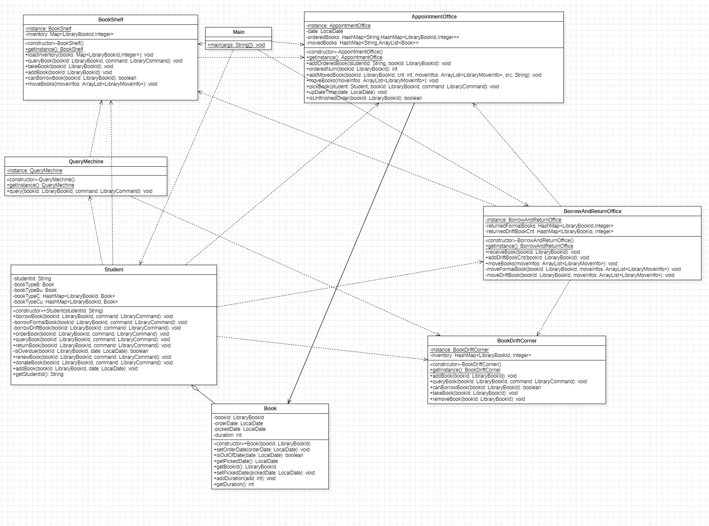

# OO第四单元总结——UML

## 一.正向建模与开发

​	在本单元中，主要的训练目的是通过画UML图进行正向建模与开发，即首先通过画UML图(类图/状态图/顺序图)等设计程序的架构，然后进行代码实现。

​	在本单元作业中，我主要通过类图进行正向建模与开发。在进行代码实现之前，首先画类图来确定出大致的属性、方法、交互关系等，关于一些比较具体的实现例如参数等先略去，在完成代码过程中进行补充。

## 二.架构设计

​	本单元的架构设计在三次迭代中保持的相对稳定，除了类中的方法等细节变动，在类的层面上遵循着面向对象的奥义，对于出现的每一个事物都建一个类，在第二次作业中新增漂流角类。

* 第一次作业

  

* 第二次作业

  

* 第三次作业

  

​	在三次作业中，我首先进行大略的UML类图的绘制，然后根据第一版类图进行代码构建，在编写代码的过程中不断完善细节和类之间的交互关系，反过来对UML图中的关系进行修改，达到了代码设计和UML模型之间的追踪关系。

## 三.架构设计思维演进

​	第一单元聚焦于层次化设计，通过表达式计算这一实际问题来引导同学们进行**表达式->项->因子**的递归下降建模。在第一单元中，我对于递归下降的理解是不断深入的，在架构设计上，针对递归下降的结构进行设计，**即对表达式、项、因子三个层次进行建模**，其中因子设计为一个接口，不同种因子设置为接口的实现。

​	第二单元聚焦于多线程设计，通过新主楼电梯运行这一实际问题来引导同学们进行多部电梯之间的多线程协作编程实践(~~个人体感上第二单元是最难的，难以复现的bug让人恼火~~)。在第二单元中，我的架构设计主要在于多线程之间的交互关系上：输入线程、调度器线程、电梯线程之间使用怎样的数据结构，怎样降低耦合度，提高内聚度。

​	第三单元聚焦于JML规格化设计，通过迷你社交网络这一实际问题来引导同学们根据JML代码来编写实际的JAVA代码。这一单元实际上对于架构设计没有要求，同学们要完成的任务在于根据已经给出的架构进行规格化代码编写，主要的问题是**规格与实现分离**：给定了JML规格，但不指定具体实现，这其中的算法效率需要同学们进行设计。我感触比较深的点除了**使用复杂度较优的算法**之外还有**进行复杂度分摊**：对于一个常使用的复杂度较高的算法可以将他的复杂度分摊在其他较少使用的方法中，达到全局优化的效果。

​	第四单元聚焦于UML正向建模与设计，在这单元中我尝试首先通过UML类图进行代码架构的建模与设计，然后在代码编写的过程中优化类之间的协作关系以及数据结构，最后反过头来完善UML图中的细节以及修改与代码不符的设计。在第四单元中，我更加深刻地感受到架构设计的重要性，一个好的架构设计可以为代码实现减小实现难度同时维持较好的扩展性，而架构设计的奥义在于**高内聚低耦合**，在```OOpre```以及```OO```课程中我的感受就是“对每一种事物都建一个类来完成对应的职责”。

## 四.测试思维演进

​	在四个单元中，我都是采用**边缘数据测试+大量随机数据压力测试**的方法，在第三单元中，采用了参数化```JUnit```测试。

​	在代码编写过程中，我会编写一些简单的样例对已经编写好的代码进行测试，相当于对每一个方法都进行一个小测试，在过程中不断```debug```，防止最后```bug```堆积增加```debug```难度。

​	完成代码编写后(~~首先跑样例~~)，手动构造一些从简单到极端数据测试数据范围、运行时间、算法效率等(当然本机运行时间和评测机完全不同，只是进行不同实现间的比较)。然后进行大量随机数据压力测试，这里要感谢```DPO```的评测机以及``Kai_ker``的评测机支持。

​	以上都是进行黑盒测试，在时间充裕的情况下，我还会进行白盒测试，即从头到尾读几遍自己的代码，再推敲一遍实现细节，往往白盒测试能够触碰到一些黑盒测试碰不到的角落```bug```。

## 五.课程收获

​	从```OOpre```初次接触JAVA编程，到```OO```课程结束已经可以独立编写千行级别有一定质量的代码，我在一次次代码作业中提高编程能力，在一次次博客作业中总结编程经验。从赤手空拳到满载而归，这是一个充满艰辛的过程。

​	面向对象思想是一种好用且高效的思想，理解面向对象思想并不难，通俗的说就是对每一种事物都理解为一个类，有属于自己的职责；但是要想真正写好面向对象代码则需要在不断实践中掌握各种设计模式、不断提高架构设计能力、不断体会高内聚低耦合的设计思路，这也正是课程组在作业中要求我们掌握的。

​	彼时的少年，站在成长的巅峰，回首来时，满路崎岖。诚实地说学习OO的过程于我而言是痛苦的，难忘深夜新主楼debug的种种艰辛，但是带给我的代码能力的成长也是非常之大的。

​	在写OO的过程中，我喜欢用```Pomodoro Logger```记录自己努力的时间，hhhhh真是花了很多时间(只展示时间最长的两次作业)。


​	如今在OO课程结束的节点，我很赞同OO是一门绝世好课，无论从课程制度还是难度设置上都越来越合理(~~可以实实在在地给予同学们一个完整的青春~~)。感谢老师、助教、研讨课上高谈阔论的同学、```Kai_ker```哥在我的OO课程中赠予的帮助。写完了这篇博客，我就要和2024春季的OO课程说再见了，心头感慨万分，甚至有些舍不得，我深知对我能力提高这样大的课程恐怕再难遇到，诚惶诚恐，用每一行代码，每一篇博客小心翼翼地记录下属于我的OO时光。


