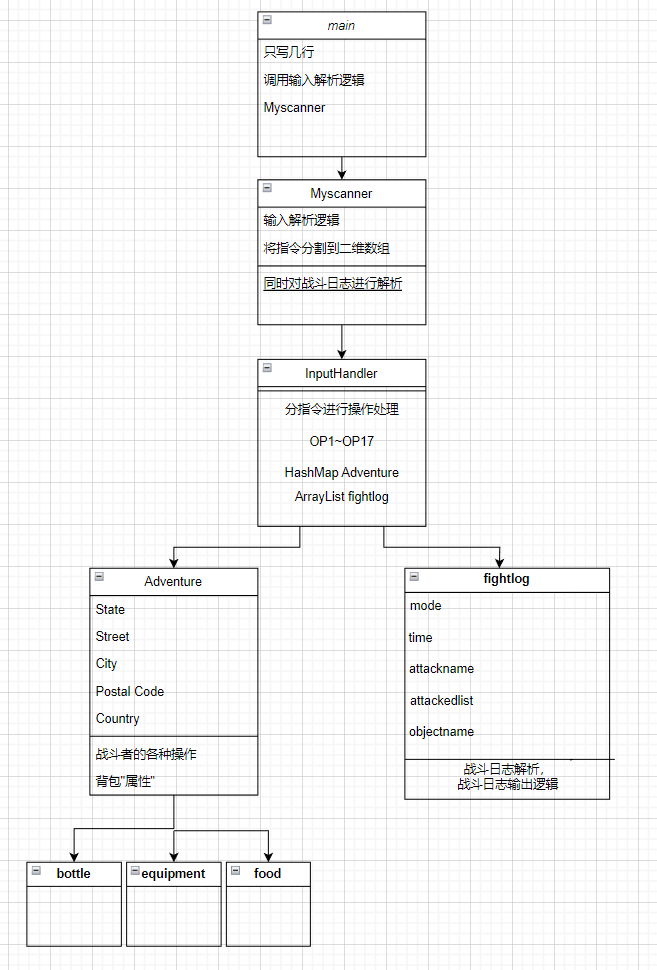

## <center>```OOpre```课程结课总结</center>

<div style = "text-align:right">——22373362杜启嵘</div>

​	经历九周的```OOpre```课程的学习，我对面向对象编程有了基本的认识。从类、对象、方法等的基本概念，到最后一次迭代作业涉及到的设计模式，我循序渐进地学习到基本的面向对象编程思想(虽然我的代码仍然不够面向对象```QAQ```)。

### 一.代码的最终架构和过程中的重构

​	在五次作业的迭代中，我进行了多次代码的重构，前几次作业中的重构我认为是合理的，最后一次作业中的重构是把超过500行的类中的部分方法强行抽离出来放进静态方法类，并把参数分成几行避免行字数超过100字(面向```OO-checkstyle```的重构)。

#### 1.第一次重构

​	在第三次作业中进行了实际上是两次重构，第一次在面临主类中的主方法行数超过60行，对方法中分指令执行的代码抽离出来声明为单独的方法，在编写JUnit时进行了第二次重构，由于第一版代码中解析输入逻辑与代码执行逻辑杂糅，而在编写JUnit时无法对输入进行操作，改为使用课程组提供的利用“二维数组”在统一存储输入内容，在```inputhandler```类中读取二维数组进行指令解析，这样的架构就能编写满足覆盖率的JUnit，下图为简单的架构图。


#### 二.第二次重构

​	第四次作业中新增了战斗日志的概念，我一开始的处理中并没有对fightlog建类，只是在Adventure中建立容器来存储代表战斗日志的字符串，导致处理逻辑比较复杂，结果因为一个方法中的错误逻辑挂了强测，在修改强测的过程中完成了对代码的重构，新增fightlog类，架构图如下



#### 三.第三次重构

​	在最后一次迭代开发中，由于类的行数限制，我不得不将一个类拆成两个类，在静态方法类中进行传参，属于是一次很丑陋的重构。


### 2.使用JUnit的心得体会

​	使用JUnit可以在提交测评机之前进行本地测试，可以通过构造数据计算预期结果比对程序输出结果判断程序的正确性，在第六次作业完成过程中涉及到很多计算还有精度的问题，使用JUnit在本地进行测试可以找出一些问题。编写JUnit过程中达到分支覆盖对于验证正确性也有很大帮助，第六次作业中继承关系中覆盖不同子类进行测试帮助我找到了一些bug。在当下阶段使用JUnit的不足在于构造数据过于简单，没有对边界条件进行测试(毕竟手搓复杂数据真的很难绷```QWQ```)，总体来说在几次作业的迭代中，我通过使用JUnit实现了对于程序的本地测试，并且能够发现一些bug，使第一次提交至少通过数据点多了一些。

### 3.学习OOpre的心得体会

​	从面向过程到面向对象的编程思维的转变对于我来说还是有一些难度，我的代码中的很多编写也不够面向对象，导致方法行数爆炸，类行数爆炸，处理逻辑复杂。但是在几次迭代中，我也对面向对象有了基本的认识

1. 理解面向对象的核心概念：面向对象编程是一种基于对象的思维方式。它的核心概念包括类、对象、封装、继承和多态。要想掌握面向对象编程，首先要理解这些概念的含义和关系
2. 不断练习和总结经验：面向对象编程是一种需要不断实践和经验积累的编程方式。通过不断地练习和实践，才能更好地理解和应用面向对象编程的技巧。同时，还要及时总结经验教训，找到自己的不足之处并加以改进
3. 阅读和理解优秀的面向对象代码：课程结束后学习优秀代码

#### 4.对OOpre课程的简单建议

1. 提高中测强度，尽量中测程度的数据过了就不要挂强测(强测挂了真的好压力)
2. 指导书中部分内容可以进行细化，尤其是第七次作业的指导书，对于不同设计模式的解释可以再细致一点(?)
