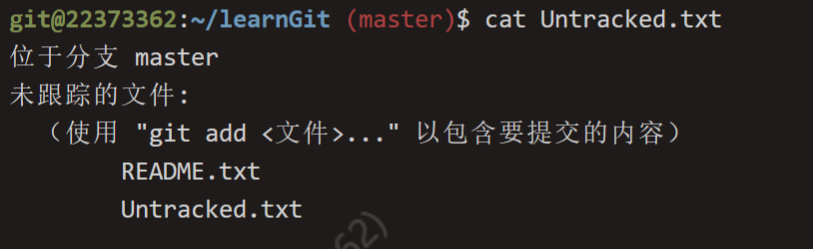
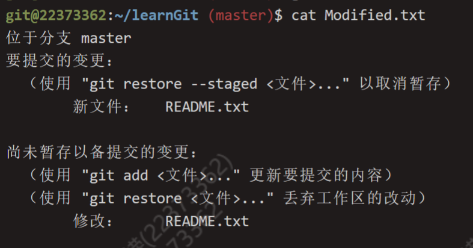
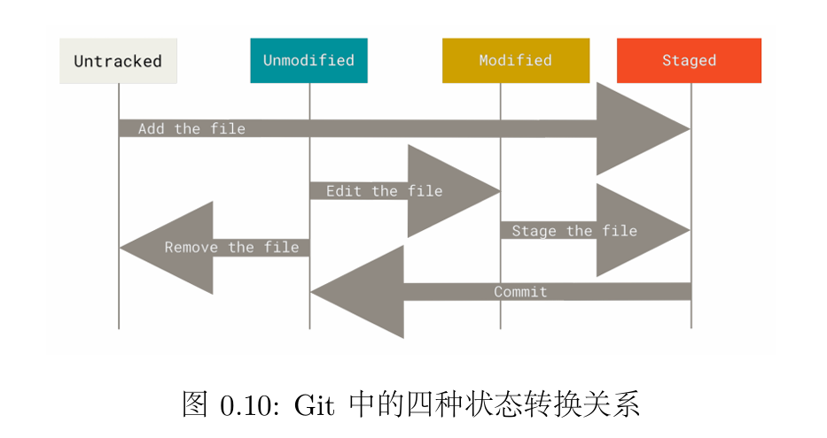
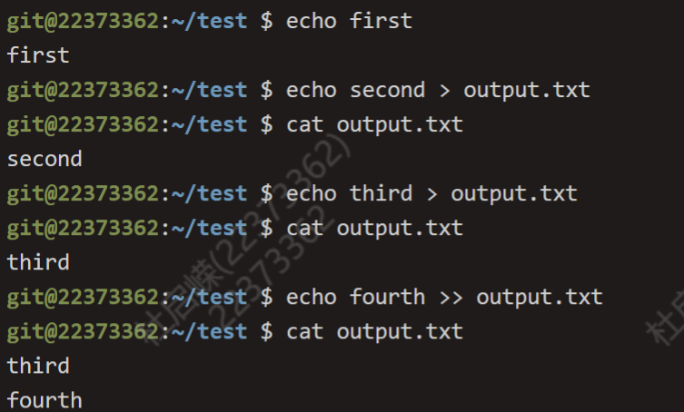
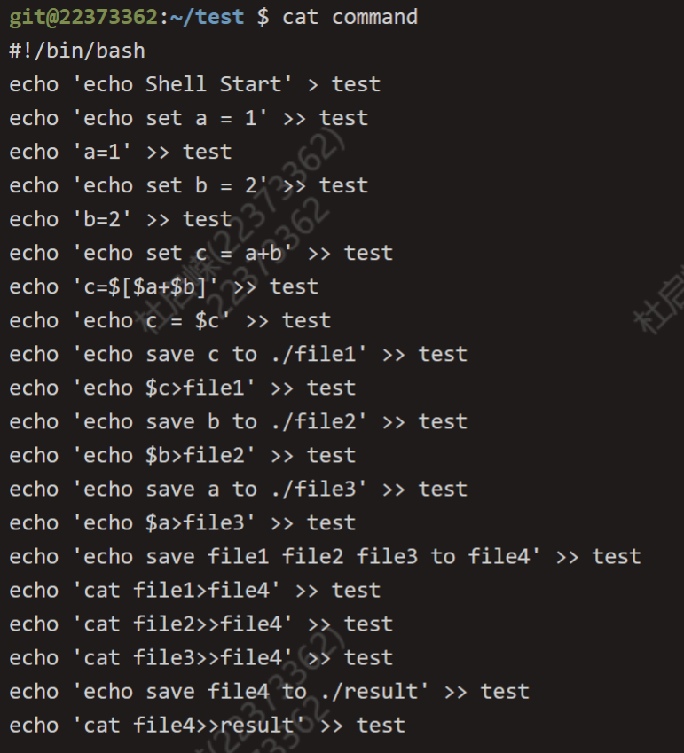
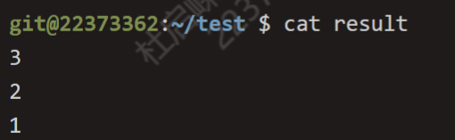
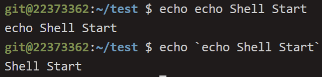
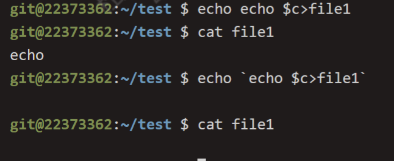

# OS-lab0 实验报告

## Thinking 0.1

* **执行命令cat Modified.txt，观察其结果和第一次执行 add 命令之前的 status 是 否一样，并思考原因。**

​	不一样。第一次执行add命令之前的status是未跟踪文件。第二次执行``cat``命令的status为尚未暂存以备提交的变更，并提示修改：README.txt。原因是第一次时，文件未被```add```过，即为未跟踪文件(```Untracked file```)，第二次查看status时，README.txt已经被add过，即已经放入暂存区，故只提示修改。





## Thinking 0.2

* **思考一下箭头中的add thefile、stage thefile和 commit分别对应的是Git里的哪些命令呢？**



* **add the file : git add && git commit **
* **stage the file : git add **
* **commit : git commit **

## Thinking 0.3

* **代码文件print.c 被错误删除时，应当使用什么命令将其恢复？**

  可以使用```git checkout -- print.c```

  * **关于```git checkout -- <file>```**:在工作区中对多个文件进行多次修改后，**若还未执行git add，可以使用本命令将工作区恢复成原样**

* **代码文件 print.c 被错误删除后，执行了 git rm print.c 命令，此时应当 使用什么命令将其恢复**

  * ```git reset HEAD print.c```
  * ```git checkout -- print.c```

  * **关于```git reset HEAD <file>```**:在工作区中对多个文件进行多次修改并**执行过git add**后，则需要先使用本命令，再git checkout

* **无关文件 hello.txt 已经被添加到暂存区时，如何在不删除此文件的前提下将其移出暂存区？**

  * ``` git rm --cached hello.txt```

## Thinking 0.4

> git reset --hard

​	```git reset```可以进行版本的回退或者切换到任何一个版本，```--hard```选项会强制覆盖工作区中的文件。回退到前n个版本，可以使用

```
git reset --hard HEAD~n
```

或者记录下每次提交的hash值。使用hash值进行任意版本之间的切换。

```
git reset --hard <hash-value>
```

## Thinking 0.5

* echo first
* echo second > output.txt
* echo third > output.txt
* echo fourth >> output.txt

​	输出如下图



​	**可以发现的区别为：关于重定向 > 将标准输出重定向到文件，但会覆盖文件原来的内容，>> 为将标准输出追加到文件之后**

## Thinking 0.6

* **command文件内容如下：主要利用输出重定向以及追加(>>)将命令输出到test文件中**

  

* **result文件内容如下：将test脚本运行产生结果输出到result文件中**

  

* **分析**

  * 使用单引号将字符串括起来会使单引号内字符串字节作为字符串输出，不解释其中的变量或命令

  * 使用双引号将字符串括起来会解析变量以及特殊字符等

  * 使用反引号：反引号用来包含一个命令字符串，其中的命令先执行，得到的结果返回到层命令再执行

    例如例子 

    ```
    echo echo Shell Start 
    echo `echo Shell Start` 
    ```

    

    ```
    echo echo $c>file1
    echo `echo $c>file1`
    ```

    

    * 注：当echo命令向文件中写入参数值时，若参数已有一个确定值，则将该值写入，否则会写入空值或不写入

## 难点分析

​	在lab0实验中，我们学习了linux系统的基本指令以及```Makefile```，```shell```脚本的编写等。其中对于指令的掌握是有难度的，对于指令的不同选项和用法的记忆是需要循序渐进的，尤其是文本处理三剑客```grep,sed,awk```，这三个命令在处理文本时带来极高的效率。

## 实验体会

​	lab0实验是linux系统的入门实验，是MOS操作系统开发的第一个台阶。在实验构成上内容比较基础，以训练掌握linux的基本工具为主。对于较为灵活的```grep,sed,awk```指令还需要进一步在学习中训练。对于```Makefile```，```shell```脚本的编写让我感受到命令行的便捷性。
