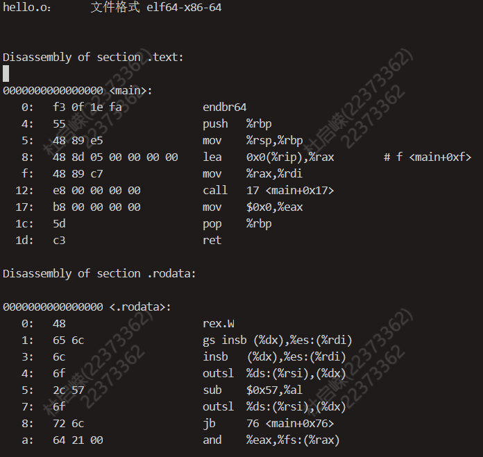

# OS : lab1 实验报告

## Thinking 1.1 

* **尝试分别使用实验环境中的原生x86工具链(gcc、ld、readelf、objdump 等)和 MIPS 交叉编译工具链（带有 mips-linux-gnu 前缀），重复其中的编译和解析过程，观察相应的结果，并解释其中向objdump传入的参数 的含义。 **

* **objdump传入参数的含义**

  | 参数 |                             含义                             |
  | :--: | :----------------------------------------------------------: |
  |  -d  |     将代码段反汇编 反汇编那些应该还有指令机器码的section     |
  |  -D  |               与 -d 类似，但反汇编所有section                |
  |  -S  | 将代码段反汇编的同时，将反汇编代码和源代码交替显示，源码编译时需要加-g参数，即需要调试信息 |
  |  -C  |                     将C++符号名逆向解析                      |
  |  -l  |             反汇编代码中插入源代码的文件名和行号             |
  |  -j  | section: 仅反编译所指定的section，可以有多个-j参数来选择多个section |

*  ```objdump-DS 要反汇编的目标文件名 > 导出文本文件名```
   
   -DS表示反汇编并将反汇编代码和源代码交替显示

* 使用原生x86工具链进行编译并查看反汇编

  ```
  git@22373362:~/compile $ gcc -c hello.c -o hello.o
  git@22373362:~/compile $ objdump -DS hello.o > x86_log
  ```

  如下图（部分）

  

* **使用MIPS交叉编译工具链进行编译**

  ```
  git@22373362:~/compile $ mips-linux-gnu-gcc -c hello.c -o mips_hello.o
  git@22373362:~/compile $ mips-linux-gnu-objdump -DS mips_hello.o > mips_log
  ```

  

## Thinking1.2

* **尝试使用我们编写的readelf程序，解析之前在target目录下生成的内核ELF文件。 **

  解析结果如下图

  

* **也许你会发现我们编写的readelf程序是不能解析readelf文件本身的，而我们刚才介绍的系统工具readelf则可以解析，这是为什么呢？(提示：尝试使用readelf-h，并阅读tools/readelf目录下的Makefile，观察readelf与hello的不同）**

  * hello

    

  * readelf

    

  * **通过观察两个可执行文件的ELF头可以发现，hello可执行文件为ELF32类型，而readelf为ELF64类型，而我们编写的readelf.c文件只支持解析ELF32格式的文件，只使用了ELF32类型的结构体**

    

  * Makefile

    ```
    %.o: %.c
             $(CC) -c $<
     
     .PHONY: clean
     
     readelf: main.o readelf.o
             $(CC) $^ -o $@
     
     hello: hello.c
             $(CC) $^ -o $@ -m32 -static -g
     
     clean:
             rm -f *.o readelf hello
    ```

    * 可以观察到hello在编译过程中传入了``-m32``参数，编译出32位的可执行文件
    * readelf默认编译为64位的可执行文件

## Thinking 1.3

* **在理论课上我们了解到，MIPS体系结构上电时，启动入口地址为0xBFC00000 （其实启动入口地址是根据具体型号而定的，由硬件逻辑确定，也有可能不是这个地址，但 一定是一个确定的地址），但实验操作系统的内核入口并没有放在上电启动地址，而是按照 内存布局图放置。思考为什么这样放置内核还能保证内核入口被正确跳转到？ （提示：思考实验中启动过程的两阶段分别由谁执行）。**

* 因为我们在`kernel.lds`中设置好了各个节被加载的位置，即最终的`segment`地址，同时使用了`ENTRY(_start)`指定了程序入口（即内核入口），最终保证了内核入口能够被正确跳转

## 实验难点分析

​	本次实验的主要难点在于实现readelf.c来解析ELF文件中的段信息以及printk函数的实现

### readelf

​	Exercise1.1中，要求我们完成一个解析ELF文件的C代码文件readelf.c，更准确的说是要求我们完成对节头表的遍历，思路上不困难，即先根据首地址和节头表的偏移量计算出节头表中第一项的位置，之后遍历后边表项即可，真正让人头疼的是一些C语言指针问题，先给出源代码。

```
int readelf(const void *binary, size_t size) {
	Elf32_Ehdr *ehdr = (Elf32_Ehdr *)binary;
	if (!is_elf_format(binary, size)) {
		fputs("not an elf file\n", stderr);
		return -1;
	}
	const void *sh_table;
	Elf32_Half sh_entry_count;
	Elf32_Half sh_entry_size;
	sh_table = (const void*)ehdr + ehdr->e_shoff;
	sh_entry_count = ehdr->e_shnum;
	sh_entry_size = ehdr->e_shentsize;
	for (int i = 0; i < sh_entry_count; i++) {
		const Elf32_Shdr *shdr;
		unsigned int addr;
		/* Exercise 1.1: Your code here. (2/2) */
		shdr = (const Elf32_Shdr*)sh_table + i;
		addr = shdr->sh_addr;
		printf("%d:0x%x\n", i, addr);
	}
	return 0;
}
```

* 关于结构体指针：结构体指针引用其中变量使用箭头表示

  ```
  sh_entry_count = ehdr->e_shnum
  ```

* 关于指针的加减运算：指针加减运算移动的字节数为指针所指向的元素类型的字节数乘上偏移量，即
  $$
  Type * p\space + \space off \space : \space sizeof(Type)*off \space bytes 
  $$

* 关于指针的类型转换，在此题中出现的是有类型和无类型之间的转换，都用到了强制类型转换

  ```
  sh_table = (const void*)ehdr + ehdr->e_shoff;
  shdr = (const Elf32_Shdr*)sh_table + i;
  ```

  我们注意到这两处都涉及到指针的运算，若不对指针类型进行转换则移动字节会以原来类型进行移动

* 关于GNU中对于void*元素类型的规定，我们注意到

  ```
  sh_table = (const void*)ehdr + ehdr->e_shoff;
  ```

  **那么void*所指代的元素类型占多大字节？在GNU中规定占一个字节**

  

### printk

**printk是内核用于输出调试信息的接口**，这些调试信息可以帮助我们获取系统或程序中的一些关键信息，在系统出现问题后也能第一时间将错误信息记录下来，以帮助开发人员定位问题原因。例如我们的MOS系统中init.c文件中输出

```
printk("init.c:\tmips_init() is called\n");
```

​	用来表示内核初始化已经启动。

​	在```kern/printk.c```中，我们可以看到printk.c的定义为

```
void printk(const char *fmt, ...) {
 va_list ap;
 va_start(ap, fmt);
 vprintfmt(outputk, NULL, fmt, ap);
 va_end(ap);
 }
```

​	注意到在参数列表中用省略号省略掉一些参数，这就是不定长参数。（注：可以参考printf的理解，前面是格式化字符串，后面跟随变量，当然后边变量的种类以及个数是根据格式化字符串确定的，后面的参数列表也就是不定长参数）我们首先介绍不定长参数。

####  不定长参数

​	对于不定长参数，我们使用不定长参数表存储。在```stdarg.h```中，定义了一组宏和变量如下

* va_list：变长参数表的变量类型

* va_start(va_list ap, lastarg) ：用于初始化变长参数表的宏，其中lastarg代表最后一个形参

* va_arg(va_list ap, 类型)：用于取变长参数表下一个参数的宏，例如我们要获取边长参数表下一个int类型的参数

  ```
  va_list ap;
  int num = va_arg(ap,int);
  ```

* va_end(va_list ap) : 结束使用变长参数表的宏

​	**总的来说我们对于变长参数表的处理是：可以把他看做一个不限制元素类型的数组，其中存放着各个参数，当我们需要使用时，就不断从中拿出来**

####  vprintfmt

#####  函数定义分析

​	vprintfmt是练习中要求我们主要完成的代码部分，它实现了格式化输出字符串，我们在printk.c中实际上是通过vprintfmt实现了打印功能。观察printk.c中传递给vprintfmt的参数

```
vprintfmt(outputk, NULL, fmt, ap);
```

对应vprintfmt的定义参数

```
void vprintfmt(fmt_callback_t out, void *data, const char *fmt, va_list ap)
```

其中第一个参数outputk是一个函数指针，它对应着printk.c中的函数```outputk```

```
 void outputk(void *data, const char *buf, size_t len) {
         for (int i = 0; i < len; i++) {
                 printcharc(buf[i]);
         }
 }
```

​	outputk即为一个字符串输出函数，虽然参数列表中有三个形参，但是我们实际上只用到了两个（第三个多余的void *data我们目前对他传递了NULL，是一个预留的形参），即指向字符串首地址的指针```const char *buf```以及字符串的长度```size_t len```。我们在vprintfmt中对该函数进行调用，故传入它的函数指针。

#####  解析思路分析

​	vprintfmt中主要是实现了对于格式化输出，**思路就是对于格式化字符串进行解析，再从边长参数列表中一个个拿出对应的实参进行格式化输出，更进一步的，就是对%后面的格式控制符进行解析并对应格式输出，对于其他部分调用out函数指针原样输出**

## 实验体会与感想

​	Lab1主要让我们学习**操作系统启动的基本流程**、掌握**ELF文件的结构和功能**，以及最终**完成一个`printk`函数的书写**。在完成实验的过程中，我逐步学习到有关操作系统的启动和ELF文件的有关知识，其中在printk函数的编写过程中我复习了C语言中有关指针的知识，并知道了在GNU标准中void*所指向的元素类型所占大小为一个字节。在完成实验之后，通过对```make run```中不断输出的现象进探究，我了解到在QEMU环境中，在bootloader阶段会由QEMU辅助进行```$ra```等寄存器的赋初值行为，同时学习到简单的gdb调试汇编代码方法。

