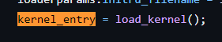

# OS ：lab1课下基础

## 1. 操作系统的启动 : boot

### 1.1 概述

​	**将硬件初始化的相关工作称为bootloader程序**，将```bootloader```程序放在非易失存储器中(ROM/FLASH)，将操作系统内核放在磁盘中。

* 将硬件初始化相关工作从操作系统中抽离出来放在bootloader中实现。实现了硬件启动和软件启动的分离。**即由bootloader实现硬件启动，操作系统内核实现软件启动**，这样负责硬件启动的指令不多，需要的存储空间不大，可以存在容量较小的ROM或FLASH中
* bootloader在硬件初始化之后，需要为软件启动（操作系统内核的功能）做准备，将内核镜像从存放他的存储器（例如磁盘）中读到RAM中。**bootloader需要将内核镜像加载到内存中，就可以选择用哪一个内核镜像进行加载，实现多重开机的功能，在一个硬件上选择运行不同的操作系统。**
* **bootloader划分了硬件启动和软件启动的边界**，bootloader主要负责硬件启动相关工作，操作系统内核专注于软件启动以及对用户提供服务的工作。简化操作系统的开发和移植。

### 1.2 bootloader

​	bootloader需要正确地找到内核并加载执行。bootloader的实现依赖于CPU的体系结构，分为stage1，stage2两个部分。


### 1.3 QEMU中操作系统的启动

​	QEMU已经提供了bootloader的引导功能，支持加载ELF格式的内核。启动流程被简化为加载内核到内存，之后跳转到内核的入口。

## 2. ELF

### 2.1 编译链接

​	我们知道源代码文件需要经过编译链接两个阶段才能变成可执行文件来运行。

* 编译```-c```：源代码被翻译为二进制指令，得到目标文件

* 链接：将多个目标文件链接为可执行文件

* 将编译好的目标文件反汇编：objdump指令

  ```
  objdump -DS <要反汇编的目标文件名> > <导出文本文件名>
  ```

  


​	以简单的代码为示例

```
#include<stdio.h>
int main()
{
	printf("hello,world!\n");
	return 0;
}
```

​	这里我们知道，**头文件中只包含函数的声明，而不包括函数的定义**，因此在预处理阶段（替换头文件、宏定义过程）只会将printf替换为他的声明。最后在链接阶段才会替换为printf的实现。**即在编译的最后，链接器将所有的目标文件链接在一起，将 之前未填写的地址等信息填上，形成最终的可执行文件，这就是链接的过程**

### 2.2 ELF

​	ELF是一种文件格式，即```Executable and Linkable Format```。ELF是Unix系统中一种常见的文件格式，包括可重定位文件(relocatable)，可执行文件(executable)，共享对象文件(shared object)。其中可重定位文件即为我们熟悉的.o文件，后两种文件都需要对.o文件进行链接才能产生。

#### 2.2.1 段和节

* 段：segment
* 节：section

> ELF 官方文档中对于section segment的解释


* 所谓section与segment是同一数据的两种视图

* 左侧是链接视图：使用section进行链接
* 右侧是执行视图：使用segment运行

* 每个segment中包含一个或多个section
* 节头表(Section header table)：包含程序中各个节(section)的信息，在程序编译链接时使用

* 段头表(Program header table)：包含程序中各个段(segment)的信息，在运行时使用


* 编译->链接->运行
* 编译：源代码->可执行代码（机器码，目标文件或可执行文件中就是机器码）

* 链接：链接器将性质相同的sections归类合并为一个segment，例如.text,.data,.bss等都是典型的需要加载的section，就会被安排到LOAD segment
  * .text是指可执行代码，也就是机器码，编译时确定（C、汇编等等语言经过编译都转化为机器码）
  * .data存放在编译时就能确定的数据（而非运行时），如已初始化的全局变量和静态变量
  * .bss保存未初始化的全局变量和静态变量

* 运行：使用各个segement进行运行

​	**从编译->链接->运行的角度看section和segment，以简单的hello world程序为例**

* 使用-c选项进行编译

  

  通过```readelf -S <filename>```对产生的可重定向文件(.o)进行查看，可以发现程序经过编译之后已经被划分为了不同的段，其中有我们熟知的```.text```，```.data```等，这就是编译产生的不同类别的section。```.text```中的内容为可执行代码，即机器码。```.data```中的内容为在编译阶段中就可以确定的变量值，例如全局变量等。

* 通过上面的实验已经知道，对源代码文件的编译会将源代码划分为不同的section，那么在链接的过程中就会对不同源代码编译后产生的相同类别的section进行合并，例如将不同代码中的text段合并为一个text段。

* segment中有几种分区，分别存放不同种类的section。常见的有```NOTE segment```和```LOAD segment```。```NOTE segment```中存放了调试的一些信息，例如dwarf或者gnu_version、gnu_hash等，我们常见的.data,.text会被存放在```LOAD segment```中。下面是对前程序进行链接后的结果，同样使用readelf查看section信息(其中.note前缀等即为NOTE segment区域)

  
  
* ps:后续在课件中找到的图

  

#### 2.2.1 ELF结构


主要结构有ELF头，段头表，节头表等，我们可以结合课程组给出的elf.h来理解各个部分的主要结构。

* ELF header(Ehdr) ：ELF文件头

  ```
  typedef struct {
  	unsigned char e_ident[EI_NIDENT]; /* Magic number and other info */
  	Elf32_Half e_type;		  /* Object file type */
  	Elf32_Half e_machine;		  /* Architecture */
  	Elf32_Word e_version;		  /* Object file version */
  	Elf32_Addr e_entry;		  /* Entry point virtual address */
  	Elf32_Off e_phoff;		  /* Program header table file offset */
  	Elf32_Off e_shoff;		  /* Section header table file offset */
  	Elf32_Word e_flags;		  /* Processor-specific flags */
  	Elf32_Half e_ehsize;		  /* ELF header size in bytes */
  	Elf32_Half e_phentsize;		  /* Program header table entry size */
  	Elf32_Half e_phnum;		  /* Program header table entry count */
  	Elf32_Half e_shentsize;		  /* Section header table entry size */
  	Elf32_Half e_shnum;		  /* Section header table entry count */
  	Elf32_Half e_shstrndx;		  /* Section header string table index */
  } Elf32_Ehdr;
  
  ```

  对于ELF文件头的定义是一个结构体，名为Elf32_Ehdr。我们只关注结构体中比较重要的几个变量

  * Elf32_Off e_phoff ：段头表相对文件的偏移量
  * Elf32_Off e_shoff : 节头表相对文件的偏移量
  * 我们依据以上两个变量可以找到段头表或节头表第一项的位置，再向下遍历即可得到表中的每一项
  * Elf32_Half e_phentsize : entry size 即段头表中每一项（每一个段头program header : phdr，描述相应段的信息）的大小
  * Elf32_Half e_phnum : 段头表中表项的个数
  * Elf32_Half e_shentsize : 节头表中每一项（每一个节头 section header : shdr，描述相应节的信息）的大小
  * Elf32_Half e_shnum : 节头表中表项的个数

* program header  (phdr) : 段头

  ```
  typedef struct {
  	Elf32_Word p_type;   /* Segment type */
  	Elf32_Off p_offset;  /* Segment file offset */
  	Elf32_Addr p_vaddr;  /* Segment virtual address */
  	Elf32_Addr p_paddr;  /* Segment physical address */
  	Elf32_Word p_filesz; /* Segment size in file */
  	Elf32_Word p_memsz;  /* Segment size in memory */
  	Elf32_Word p_flags;  /* Segment flags */
  	Elf32_Word p_align;  /* Segment alignment */
  } Elf32_Phdr;
  ```

  > 每一个段头是段头表中的一项(entry)，他描述了一段的信息

* section header (shdr) : 节头

  ```
  typedef struct {
  	Elf32_Word sh_name;	 /* Section name */
  	Elf32_Word sh_type;	 /* Section type */
  	Elf32_Word sh_flags;	 /* Section flags */
  	Elf32_Addr sh_addr;	 /* Section addr */
  	Elf32_Off sh_offset;	 /* Section offset */
  	Elf32_Word sh_size;	 /* Section size */
  	Elf32_Word sh_link;	 /* Section link */
  	Elf32_Word sh_info;	 /* Section extra info */
  	Elf32_Word sh_addralign; /* Section alignment */
  	Elf32_Word sh_entsize;	 /* Section entry size */
  } Elf32_Shdr;
  ```

  > 每一个节头是节头表中的一项，他描述了一节的信息

#### 2.2.3 Exercise 1.1 中的一些问题

​	Exercise1.1中，要求我们完成一个解析ELF文件的C代码文件readelf.c，更准确的说是要求我们完成对节头表的遍历，思路上不困难，即先根据首地址和节头表的偏移量计算出节头表中第一项的位置，之后遍历后边表项即可，真正让人头疼的是一些C语言指针问题，先给出源代码。

```
int readelf(const void *binary, size_t size) {
	Elf32_Ehdr *ehdr = (Elf32_Ehdr *)binary;
	if (!is_elf_format(binary, size)) {
		fputs("not an elf file\n", stderr);
		return -1;
	}
	const void *sh_table;
	Elf32_Half sh_entry_count;
	Elf32_Half sh_entry_size;
	sh_table = (const void*)ehdr + ehdr->e_shoff;
	sh_entry_count = ehdr->e_shnum;
	sh_entry_size = ehdr->e_shentsize;
	for (int i = 0; i < sh_entry_count; i++) {
		const Elf32_Shdr *shdr;
		unsigned int addr;
		/* Exercise 1.1: Your code here. (2/2) */
		shdr = (const Elf32_Shdr*)sh_table + i;
		addr = shdr->sh_addr;
		printf("%d:0x%x\n", i, addr);
	}
	return 0;
}
```

* 关于结构体指针：结构体指针引用其中变量使用箭头表示

  ```
  sh_entry_count = ehdr->e_shnum
  ```

* 关于指针的加减运算：指针加减运算移动的字节数为指针所指向的元素类型的字节数乘上偏移量，即
  $$
  Type * p\space + \space off \space : \space sizeof(Type)*off \space bytes 
  $$

* 关于指针的类型转换，在此题中出现的是有类型和无类型之间的转换，都用到了强制类型转换

  ```
  sh_table = (const void*)ehdr + ehdr->e_shoff;
  shdr = (const Elf32_Shdr*)sh_table + i;
  ```

  我们注意到这两处都涉及到指针的运算，若不对指针类型进行转换则移动字节会以原来类型进行移动

* 关于GNU中对于void*元素类型的规定，我们注意到

  ```
  sh_table = (const void*)ehdr + ehdr->e_shoff;
  ```

  **那么void*所指代的元素类型占多大字节？在GNU中规定占一个字节**

  

* 可以使用系统自带的readelf命令进行验证

  * ```readelf -S <file> 查看节信息```
    
    

  * ```readelf -l <file> 查看段信息```
    
    
  
    * Offset代表该段数据相对于ELF文件的偏移
    * VirtAddr代表该段数据最终被加载到内存的位置
    * FileSiz代表该段数据在文件中所占的大小
    * MemSiz代表该段数据在内存中所占的大小
    
    **注：MemSiz >= FileSiz C语言中未初始化的全局变量，我们需要为其分配内存，但它 又不需要被初始化成特定数据。因此，在可执行文件中也只记录它需要占用内存(MemSiz)， 但在文件中却没有相应的数据（因为它并不需要初始化成特定数据）。故而在这种情况下， MemSiz会大于FileSiz。这也解释了，为什么C语言中全局变量会有默认值0。这是因为 操作系统在加载时将所有未初始化的全局变量所占的内存统一填了0**

## 3. MIPS内存布局

### 3.1 MIPS-32内存

> 程序中使用的地址被称为虚拟地址、程序地址或逻辑地址，处理器发往总线的地址为物理地址，需要通过CPU中的MMU单元进行转换(Memory Management Unit)，全部虚拟地址构成了虚拟地址空间，本实验中32位MIPS操作系统的虚拟地址空间大小为4GB

* MIPS体系结构中，4GB虚拟地址空间被划分为四个部分

  

  * kuseg：用户态下唯一可用的地址空间（内核态下也可使用这段地址空间）。需要通过 MMU中的 TLB 进行虚拟地址到物理地址的变换。对这段 地址的==存取都会通过cache==。

  * kseg0：内核态下可用的地址，MMU将地址的最高位清零（&7fffffff）就得到物理地址用于访存，这段虚拟地址被连续的映射到物理地址的低512MB，对这段地址的==存取都会通过cache==，**我们将操作系统内核放在kseg0区域，例如.text,.data,.bss段。**

    **注：该段地址范围为0x80000000-0x9fffffff,有一个疑问是如果只对最高位清0，剩下31位地址空间比512MB大，但是我们观察最高三位数据，100 & 011 ~ 100 & 011 实际上经过运算已经保证了这段地址范围内高三位都是0。**

  * kseg1：内核态下可用的地址，MMU将地址的高三位清零（&1fffffff）就得到物理地址用于访存，这段虚拟地址被连续的映射到物理地址的低512MB，但是对这段地址的==存取不通过 cache==，**往往在这段地址上使用MMIO（Memory-Mapped I/O）技术来访问外设**。

  * kseg2：：这段地址只能在内核态下使用并且需要 MMU 中 TLB 将虚拟地址转换为物理地址。对这段地址的==存取都会通过cache==。

### 3.2 Linker Script

​	在链接阶段引入Linker Script，Linker Script中记录了各个节应该如何映射到段，以及各个段应该被加载到的位置，这样就可以把我们的内核代码加载到正确的位置上。


​	上图即为操作系统实验中定义的kseg0内存划分，lab1练习题中只需简单的将.text段放在Kernel Text区域，将.data和.bss段放在.text后面即可。

```
/*
 * Set the architecture to mips.
 */
OUTPUT_ARCH(mips)

/*
 * Set the ENTRY point of the program to _start.
 */
ENTRY(_start)

SECTIONS {
	. = 0x80020000; //kernel text起始地址
	.text : {*(.text)}
	.data : {*(.data)}
	bss_start = .;
	.bss : {*(.bss)}
	bss_end = .;
	. = 0x80400000; //KSTACKTOP
	end = . ;
}
```

* 解释：

  * ```.```为定位计数器，根据输出节的大小增长，SECTIONS命令开始时值为0，**通过设置```.```的值即可设置接下来节的起始地址**，例如上例中为.text段设置起始地址为Kernel Text的起始地址。

  * ```.text : {*(.text)}```表示将输入文件中所有.text节放到输出的.text节（这就是链接过程中section的合并）
    
  * 这样我们就可以大概理解内核的装载过程，Linker Script设置了各个section在内存(kseg0)中的内存位置，并将各个源代码编译后产生的可执行文件中的同类section合并为一个section后放进内存

## 4.构建MOS内核

### 4.1 顶层Makefile

​	展示部分代码

```
include include.mk
...
modules  := lib init kern
all: $(targets)

$(target_dir):
	mkdir -p $@

tools:
	CC="$(HOST_CC)" CFLAGS="$(HOST_CFLAGS)" $(MAKE) --directory=$@

$(modules): tools
	$(MAKE) --directory=$@

$(mos_elf): $(modules) $(target_dir)
	$(LD) $(LDFLAGS) -o $(mos_elf) -N -T $(link_script) $(objects)
```

* 可以看到构建MOS系统的最后一步为链接指令

  ```
  $(LD) $(LDFLAGS) -o $(mos_elf) -N -T $(link_script) $(objects)
  ```

  **其中-T选项表示读取Linker Script脚本，**即为我们在上一节中完成的脚本。

* ```$@```展开为当前目标名称，进入目标目录并调用make

  ```
  $(modules): tools
  	$(MAKE) --directory=$@
  ```

### 4.2 _start函数

​	**_start是内核的入口**

```
#include <asm/asm.h>
#include <mmu.h>

.text
EXPORT(_start)
.set at
.set reorder
/* Lab 1 Key Code "enter-kernel" */
	/* clear .bss segment */
	la      v0, bss_start
	la      v1, bss_end
clear_bss_loop:
	beq     v0, v1, clear_bss_done
	sb      zero, 0(v0)
	addiu   v0, v0, 1
	j       clear_bss_loop
/* End of Key Code "enter-kernel" */

clear_bss_done:
	/* disable interrupts */
	mtc0    zero, CP0_STATUS
	/* set up the kernel stack */
	li	sp, 0x80400000
	/* jump to mips_init */
	j	mips_init

```

* **注：栈空间为向下生长，需要将sp指针设置在内核栈空间的栈顶**
* mips_init函数在init.c文件中，在汇编程序中通过j/jal实现跳转到函数符号对应的地址，**在链接时链接器会对代码中的符号进行重定位，实现跨文件的函数调用**

### 4.3 printk

​	**printk是内核用于输出调试信息的接口**，这些调试信息可以帮助我们获取系统或程序中的一些关键信息，在系统出现问题后也能第一时间将错误信息记录下来，以帮助开发人员定位问题原因。例如我们的MOS系统中init.c文件中输出

```
printk("init.c:\tmips_init() is called\n");
```

​	用来表示内核初始化已经启动。

​	在```kern/printk.c```中，我们可以看到printk.c的定义为

```
void printk(const char *fmt, ...) {
 va_list ap;
 va_start(ap, fmt);
 vprintfmt(outputk, NULL, fmt, ap);
 va_end(ap);
 }
```

​	注意到在参数列表中用省略号省略掉一些参数，这就是不定长参数。（注：可以参考printf的理解，前面是格式化字符串，后面跟随变量，当然后边变量的种类以及个数是根据格式化字符串确定的，后面的参数列表也就是不定长参数）我们首先介绍不定长参数。

#### 4.3.1 不定长参数

​	对于不定长参数，我们使用不定长参数表存储。在```stdarg.h```中，定义了一组宏和变量如下

*  va_list：变长参数表的变量类型

*  va_start(va_list ap, lastarg) ：用于初始化变长参数表的宏，其中lastarg代表最后一个形参

* va_arg(va_list ap, 类型)：用于取变长参数表下一个参数的宏，例如我们要获取边长参数表下一个int类型的参数
  ```
  va_list ap;
  int num = va_arg(ap,int);
  ```

* va_end(va_list ap) : 结束使用变长参数表的宏

​	**总的来说我们对于变长参数表的处理是：可以把他看做一个不限制元素类型的数组，其中存放着各个参数，当我们需要使用时，就不断从中拿出来**

#### 4.3.2 vprintfmt

##### 4.3.2.1 函数定义分析

​	vprintfmt是练习中要求我们主要完成的代码部分，它实现了格式化输出字符串，我们在printk.c中实际上是通过vprintfmt实现了打印功能。观察printk.c中传递给vprintfmt的参数

```
vprintfmt(outputk, NULL, fmt, ap);
```

对应vprintfmt的定义参数

```
void vprintfmt(fmt_callback_t out, void *data, const char *fmt, va_list ap)
```

其中第一个参数outputk是一个函数指针，它对应着printk.c中的函数```outputk```

```
 void outputk(void *data, const char *buf, size_t len) {
         for (int i = 0; i < len; i++) {
                 printcharc(buf[i]);
         }
 }
```

​	outputk即为一个字符串输出函数，虽然参数列表中有三个形参，但是我们实际上只用到了两个（第三个多余的void *data我们目前对他传递了NULL，是一个预留的形参），即指向字符串首地址的指针```const char *buf```以及字符串的长度```size_t len```。我们在vprintfmt中对该函数进行调用，故传入它的函数指针。

##### 4.3.3.3 解析思路分析

​	vprintfmt中主要是实现了对于格式化输出，**思路就是对于格式化字符串进行解析，再从边长参数列表中一个个拿出对应的实参进行格式化输出，更进一步的，就是对%后面的格式控制符进行解析并对应格式输出，对于其他部分调用out函数指针原样输出**

​	对于fmt的字符串格式


​	对格式字符串中各项进行解释

* flag

  

* width

  

* length

  

* specifier

  

​	当我们读到%后对后面字符串进行解析即可

```
void vprintfmt(fmt_callback_t out, void *data, const char *fmt, va_list ap) {
	char c;
	const char *s;
	long num;

	int width;
	int long_flag; // output is long (rather than int)
	int neg_flag;  // output is negative
	int ladjust;   // output is left-aligned
	char padc;     // padding char

	for (;;) {
		/* scan for the next '%' */
		/* Exercise 1.4: Your code here. (1/8) */
		s = fmt;
		while(*s != '%' && *s != '\0') {
			s++;
		}
		/* flush the string found so far 输出%之前的字符串*/
		/* Exercise 1.4: Your code here. (2/8) */
		out(data,fmt,s-fmt);
		fmt = s;
		/* check "are we hitting the end?" */
		/* Exercise 1.4: Your code here. (3/8) */
		if (*fmt == '\0') {
			break;
		}
		/* we found a '%' */
		/* Exercise 1.4: Your code here. (4/8) */
		fmt++;
		/* check format flag 左对齐 右对齐 、填充字符*/
		/* Exercise 1.4: Your code here. (5/8) */
		if (*fmt == '-') {
			ladjust = 1;
			fmt++;
		} else {
			ladjust = 0;
		}
		if (*fmt == '0') {
			padc = '0';
			fmt++;
		} else {
			padc = ' ';
		}
		/* get width 输出宽度*/
		/* Exercise 1.4: Your code here. (6/8) */
		width = 0;
		while (*fmt >= '0' && *fmt <= '9') {
			width = width * 10 + (*fmt - '0');
			fmt++;
		}
		/* check for long 这里标记长整数只有l*/
		/* Exercise 1.4: Your code here. (7/8) */
		if (*fmt == 'l') {
			long_flag = 1;
			fmt++;
		} else {
			long_flag = 0;
		}
		neg_flag = 0;
		switch (*fmt) {
		case 'b':
			if (long_flag) {
				num = va_arg(ap, long int);
			} else {
				num = va_arg(ap, int);
			}
			print_num(out, data, num, 2, 0, width, ladjust, padc, 0);
			break;

		case 'd':
		case 'D':
			if (long_flag) {
				num = va_arg(ap, long int);
			} else {
				num = va_arg(ap, int);
			}

			/*
			 * Refer to other parts (case 'b', case 'o', etc.) and func 'print_num' to
			 * complete this part. Think the differences between case 'd' and the
			 * others. (hint: 'neg_flag').
			 */
			/* Exercise 1.4: Your code here. (8/8) */
			if (num < 0) {
				neg_flag = 1;
				num = -num;
			} else {
				neg_flag = 0;
			}
			print_num(out, data, num, 10, neg_flag,width, ladjust, padc, 0);
			break;

		case 'o':
		case 'O':
			if (long_flag) {
				num = va_arg(ap, long int);
			} else {
				num = va_arg(ap, int);
			}
			print_num(out, data, num, 8, 0, width, ladjust, padc, 0);
			break;

		case 'u':
		case 'U':
			if (long_flag) {
				num = va_arg(ap, long int);
			} else {
				num = va_arg(ap, int);
			}
			print_num(out, data, num, 10, 0, width, ladjust, padc, 0);
			break;

		case 'x':
			if (long_flag) {
				num = va_arg(ap, long int);
			} else {
				num = va_arg(ap, int);
			}
			print_num(out, data, num, 16, 0, width, ladjust, padc, 0);
			break;

		case 'X':
			if (long_flag) {
				num = va_arg(ap, long int);
			} else {
				num = va_arg(ap, int);
			}
			print_num(out, data, num, 16, 0, width, ladjust, padc, 1);
			break;

		case 'c':
			c = (char)va_arg(ap, int);
			print_char(out, data, c, width, ladjust);
			break;

		case 's':
			s = (char *)va_arg(ap, char *);
			print_str(out, data, s, width, ladjust);
			break;

		case '\0':
			fmt--;
			break;

		default:
			/* output this char as it is */
			out(data, fmt, 1);
		}
		fmt++;
	}
}
```

## ps:关于bootloader以及QEMU的一些思考

## 0.问题发现

 在完成lab1课下代码后，我尝试进行make run，发现不断输出`init.c: mips_init() is called`，如下图

​ 我认为是代码出现了问题，果断求助助教。在助教的帮助下，我逐渐理解了这个问题。

## 1.分析代码

 通过阅读代码，我们知道，输出这个字符串是start.S调用init.c中函数mips_init得到，由于不方便展示源码，**这里只指出我是通过j指令完成了跳转，强调这一点是有必要的，如果使用jal进行跳转就不会出现这种状况，jal指令会改变$ra寄存器的值，与后边的论述矛盾。** 通过对我们make的内核mos进行gdb调试，发现在程序执行完mips_init()之后总是跳回到start.S的第一行代码，如下图。

​ 通过上学期的计组知识，我们知道，从被调用者跳回到调用者是通过指令`jr $ra`实现的，这一点我们可以在gdb中展示汇编代码得到验证(gdb模式下直接输入disassemble)，如下图。

​ 这样问题就转化为`$ra`的值是什么？通过指令`i registers`可以查看各个寄存器的值。我们得到`$ra`寄存器的值如下图

​ 同时我们可以发现，start.S中第一条代码的地址即为此地址。

​ 但是在我们的代码中并没有存在对`$ra`赋值的操作，也就是说问题**转化为`$ra`初值是如何得到的？**

## 2.bootloader

 通过以上的分析，我们知道在内核相关代码中，我们并没有对`$ra`的值有写操作，此时将目光放在启动内核之前的硬件初始化阶段，即`bootloader`。直接`make dbg`进入调试，我们会发现输出如下

​ **这里的0xbfc00000即为bootloader的地址**，gdb并不支持显示调试信息，此时我们可以使用汇编级调试，通过运行

```
set disassemble-nextline-on
```

 进入汇编调试模式，之后`ni`单步调试，我们发现在bootloader中进行了**对寄存器的赋初值操作**，这里只展示我们关心的对于`$ra`寄存器的赋值操作，如下图

​ 以上两条指令即为对`$ra`寄存器的赋值操作，**更加值得注意的是下面两条汇编代码**

​ 我们发现在完成硬件相关初始化之后，跳转到了内核入口，在实践中印证了指导书中的内容

​ 现在我们已经知道了`$ra`寄存器是在bootloader中进行赋初值，**但是，bootloader是如何知道内核入口(kernel_entry)在哪里呢，即bootloader是如何知道要给`$ra`赋这个地址的?这与我们的实验环境QEMU有关。**

## 3.QEMU

 我们知道，实验中我们使用了QEMU自带的bootloader，实际上，qemu也处理了一部分软件流程，对bootloader进行了简化，这在init.c的注释部分给出了提示。

​ 直接去盒一下github上的源码！

​ 在源码中我们找到了对`$ra`赋值操作，进一步的，查找`kernel_entry`是如何得来的？进一步查阅源码，可以发现

​ 同时源码中给出了关于load_kernel()函数的定义，这里不再关心，**我们可以得到结论：对`$ra`寄存器的赋值是在bootloader阶段由QEMU辅助完成的！**

## 4. 总结

 此篇讨论帖讨论了关于`$ra`寄存器初值的问题以及bootloader和QEMU的一些思考，如有错误敬请指正，这里特别感谢助教的指引和帮助！
