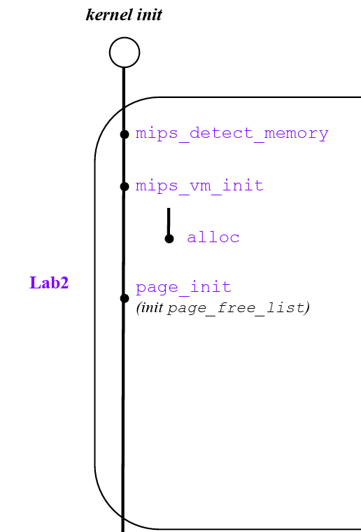

# OS:lab2实验报告

## Thinking 2.1

* **在编写的C程序中，指针变量中存储的地址被视为虚拟地址，还是物理地址？MIPS汇编程序中lw和sw指令使用的地址被视为虚拟 地址，还是物理地址？ **
  * 在编写的C程序中，指针变量中存储的地址为虚拟地址
  * 汇编程序中```lw```，```sw```发送的也是虚拟地址

## Thinking 2.2

* **请从可重用性的角度，阐述用宏来实现链表的好处**
  * 使用宏定义对链表操作进行封装，可以实现代码的复用，即减少了工作量，也提高了程序的可读性
*  **请你查看实验环境中的 /usr/include/sys/queue.h，了解其中单向链表与循环链表的实现，比较它们与本实验中使用的双向链表，分析三者在插入与删除操作上的性能差异**
  * **对于单向链表**，由于它只能获得每一项的后面一项，因此在删除时需要遍历整个链表；同样，如果是在某一项的前面插入，也需要从`head`开始遍历这个链表。但是如果是“在某一项之后插入”，单项链表可以直接进行该操作。
  * **对于循环链表**，因为它仍然是单向的，所以在“删除”、“某一项之前插入”、“某一项之后插入”三个操作的性能和单项链表相同。但是，由于循环链表首尾相连，同时维护了一个指向尾项的指针，因此它可以直接在尾部插入。
  * **对于双向链表**，因为它可以直接获得某一项的前后两项，所以无论是“删除”还是“在某一项前或后插入”都可以以O(1)的开销实现。但是，双向链表没有维护指向尾部的指针，因此无法直接将某一项插入链表尾部，如要实现该操作还需要遍历整个链表。

## Thinking 2.3

* **选择`Page_list`正确的展开结构**

  **C**

  ```
  struct Page_list{
  	struct {
  		struct {
  			struct Page *le_next;
  			struct Page **le_prev;
  		} pp_link;
  		u_short pp_ref;
  	}* lh_first;
  }
  ```

## Thinking 2.4

* **请阅读上面有关TLB的描述，从虚拟内存和多进程操作系统的实现角度，阐述ASID的必要性。**
  * 操作系统会给每一个进程分配一个页表，每个页表都有自己的虚拟地址空间，而同一虚拟地址在不同地址空间中通常映射到不同的物理地址。如果没有`ASID`来区分**当前虚拟地址是在哪个进程中使用**，则可能会将该虚拟地址映射到错误的物理地址。(**每一个进程都有自己的虚拟地址空间4G，ASID可以区分不同进程同一虚拟地址转换成物理地址的方法**)
* **请阅读 MIPS 4Kc 文档《MIPS32® 4K™ Processor Core Family Software User’s Manual》的 Section 3.3.1 与 Section 3.4，结合 ASID 段的位数，说明 4Kc中可容纳不同的地址空间的最大数量**
  * ```ASID```有8位，即最多可以有$2^8$个地址空间（进程数量）

## Thinking 2.5

* **`tlb_invalidate` 和 `tlb_out` 的调用关系是怎样的？**

  * ```tlb_invalidate```中调用了```tlb_out```

* **请用一句话概括 `tlb_invalidate` 的作用**

  * 删除特定虚拟地址在 TLB 中的旧表项

* **逐行解释 `tlb_out` 中的汇编代码**

  ```
  LEAF(tlb_out)
  .set noreorder
  	mfc0    t0, CP0_ENTRYHI #维护EntryHi寄存器 将EntryHi寄存器中原本的值存入t0
  	mtc0    a0, CP0_ENTRYHI #将需要寻找的Key(VPN,ASID)存入EntryHi
  	nop
  	/* Step 1: Use 'tlbp' to probe TLB entry */
  	/* Exercise 2.8: Your code here. (1/2) */
  	tlbp	#寻找EntryHi中Key在TLB中对应的表项，并将索引号存入Index寄存器，若不存在则Index最高位置1(index为负数)
  	nop
  	/* Step 2: Fetch the probe result from CP0.Index */
  	mfc0    t1, CP0_INDEX #将Index寄存器中的值存入t1寄存器
  .set reorder 
  	bltz    t1, NO_SUCH_ENTRY #判断index值大小，若小于0则说明没找到
  .set noreorder
  	mtc0    zero, CP0_ENTRYHI #将EntryHi清0
  	mtc0    zero, CP0_ENTRYLO0 #将EntryLo0清0
  	mtc0    zero, CP0_ENTRYLO1 #将EntryLo1清0
  	nop
  	/* Step 3: Use 'tlbwi' to write CP0.EntryHi/Lo into TLB at CP0.Index  */
  	/* Exercise 2.8: Your code here. (2/2) */
  	tlbwi	#向找到的index表项中写入Key,Data(全为0)
  .set reorder
  
  NO_SUCH_ENTRY:
  	mtc0    t0, CP0_ENTRYHI #恢复调用前EntryHi的值
  	j       ra #跳转回调用者
  END(tlb_out)
  ```
  

## Thinking 2.6

* **简单了解并叙述 X86 体系结构中的内存管理机制，比较 X86 和 MIPS 在内存管理上的区别**
  * 首先是内存管理机制，MIPS主要采用的是页式管理系统，X86主要采用的是段页式
  * 在对TLB不命中的处理上，MIPS会触发```TLB Refill```异常，内核的```tlb_refill_handler```会以```pgd_current```为当前进程的```PGD```基址，索引获得转换失败的虚址对应的```PTE```，并将其填入TLB，然后CPU再用刚刚转换失败的虚拟地址重新访问TLB；X86在TLB不命中时，由硬件MMU以CR3为当前进程的PGD基址，索引获得PFN后直接输出PA，同时MMU会填充TLB以加快下次转换的速度
  * 转换失败的虚址，MIPS使用BadVAddr寄存器存放，X86使用CR2存放

## Thinking A.1

* **在现代的 64 位系统中，提供了 64 位的字长，但实际上不是64位页式存 储系统。假设在64位系统中采用三级页表机制，页面大小4KB。由于64位系统中字长为 8B，且页目录也占用一页，因此页目录中有512 个页目录项，因此每级页表都需要9位。因此在64位系统下，总共需要3×9+12=39位就可以实现三级页表机制,并不需要64 位。现考虑上述39位的三级页式存储系统，虚拟地址空间为512GB，若三级页表的基地址为PTbase，请计算： **

  * **三级页表页目录的基地址。** 
    $PT_{base} + PT_{base} << 9 + PT_{base} << 18$

  * **映射到页目录自身的页目录项（自映射）。**

    $PT_{base} + PT_{base} << 9 + PT_{base} << 18 + PT_{base} << 27$​

### 对于Thinking A.1 的解释

#### 1. MOS中的页目录自映射

​	在lab2中我们实现了虚拟内存管理机制——两级页表。提出问题：如何在虚拟地址空间中维护页表和页目录？我们知道，在MOS操作系统中，操作系统会为每一个进程分配4GB的虚拟地址空间。**在两级页表机制中，将4GB虚拟地址空间映射到物理内存，则需要1024个页表(页目录有1024项)，每个页表中1024项**

* 虚拟地址格式

  ```
  |PDX(page dictionary offset : 10 bits)|PTX(page table offset : 10 bits) | page_offset : 12 bits
  ```

  **共有1M个页表项**

​	我们知道页表和页目录实际上也保存在虚拟地址空间中，而对于4GB的虚拟地址空间只需要1024个页表就可以管理（每个页表管理4MB大小的空间），1024个页表的占用空间大小为4MB，且页表在虚拟内存中连续对齐排布，就一定有一个页表所对应的4MB地址空间为这1024个页表的4MB空间，这个页表就是就是页目录，故4MB就可以容纳下页表和页目录。**总的来说，这1024个页表中有一个特殊的页表为页目录**，在MOS中，将页表和页目录映射到了虚拟地址空间中的```0x7fc0_0000-0x8000_0000```(4MB)。


> 从上图中可以清晰的看出，1024个页表中有一个特殊的页表为页目录，页目录中的1024个表项又指向包括他自己在内的1024个页表

​	在连续排布的1M个页表项中，每一个页表项对应着虚拟内存中从低到高的4KB大小的虚拟地址空间，例如第一个页表项(地址为PTbase)对应着虚拟内存中第一个虚拟页面


​	**这样以此类推，在内存中第n个页表项管理着第n个虚拟页面**

#### 2.对问题的计算解答

##### 2.1 首先以二级页表为例

> 页表基地址为PTbase
>
> 页目录项所在地址：基地址PTbase+偏移量(4*page_number)

​	页表的基地址或者说就是第一个页表项的地址，他所在的页面页号为$PT_{base} >> 12$，而该页是由第$PT_{base} >> 12$个页表项映射到。这个页表项也就是页目录中的第一个页表项。即页目录中第一个页表项的虚拟地址为$PT_{base} + 4*(PT_{base} << 12)$,即页目录的基地址为$PT_{base} + PT_{base} << 10$，页目录项所在的页面号：$(PT_{base} + PT_{base} << 10) << 12 $，故该页目录项的地址为$PT_{base} + PT_{base} << 10 + PT_{base} << 20$

##### 2.2 三级页表计算

> 页表基地址为PTbase

* 三级页表基地址即为PTbase，所在页面号为$PT_{base} << 12$
* 二级页表基地址即为二级页表第一项的地址$PT_{baze} + PT_{base} << 9$，所在页面号为$PT_{base} << 12 + PT_{base} <<21$​
* 页目录（一级页表）的基地址即为一级页表第一项的地址$PT_{base} + PT_{base} << 9 + PT_{base} << 18$​

##### 2.3 思路总结

> 页表项地址 -> 在哪一页？第n页虚拟页面由第n个页表项控制 -> 该页表项地址？起始地址+偏移量 ->递推
>
> 多级页表的映射是按照顺序进行的，即内存中划分的第一个页块由上一级页表的第一个页表项映射，而这个页表项所在的页面是由上一级页表的第一个页表项映射，依次类推。

## 实验难点

### 1. 总结建立物理内存管理的过程

```
void mips_init(u_int argc, char **argv, char **penv, u_int ram_low_size) {
	printk("init.c:\tmips_init() is called\n");

	// lab2:
	mips_detect_memory(ram_low_size);
	mips_vm_init();
	page_init();
}
```

​	在跳转到mips_init函数后

* mips_detect_memory：检查可用的物理内存大小，初始化物理页面数量npage

* mips_vm_init：初始化页面控制块数组pages管理所有物理页面的页面控制块（**通过alloc为pages分配内存**）

* page_init：将初始化过程中已经使用的物理页面ref标记为1（这里freemem以下的空间为已经使用的空间），其余的空闲页面的页面控制块加入空闲链表```page_free_list```（**空闲链表的插入和删除都是从头部进行**）。

* 总体来说实现了指导书中图左半部分

  


### 2.总结实验中建立虚拟内存管理的过程

​	我们从用户进程的视角来分析虚拟内存管理，我们实现的实际上是发生TLB Miss时进行的异常处理，即对TLB表项进行重填。

* 当发生TLB Miss，调用do_tlb_refill进行重填
* do_tlb_refill会首先在页表中查找该虚拟地址对应的二级页表项(page_lookup)
  * 如果有则进行重填
  * 如果没有则进行分配(passive_alloc)
    * 首先分配物理页面(page_alloc)
    * 然后建立起va和刚分配的物理页面之间的映射(page_insert)
    * 对原表项进行无效化(page_invalidate)


## 实验体会

​	lab2主要实现了MOS操作系统中的内存管理机制，实验内容主要分为三部分：物理内存管理(链表法)，虚拟内存管理(二级页表)，TLB重填机制。通过对lab2中代码的编写，对于C语言中宏定义函数，二级指针等更深层次的内容有了一定认识。同时建立物理内存管理和虚拟内存管理的过程也让我体会到理论课中的知识在实践中的应用。
