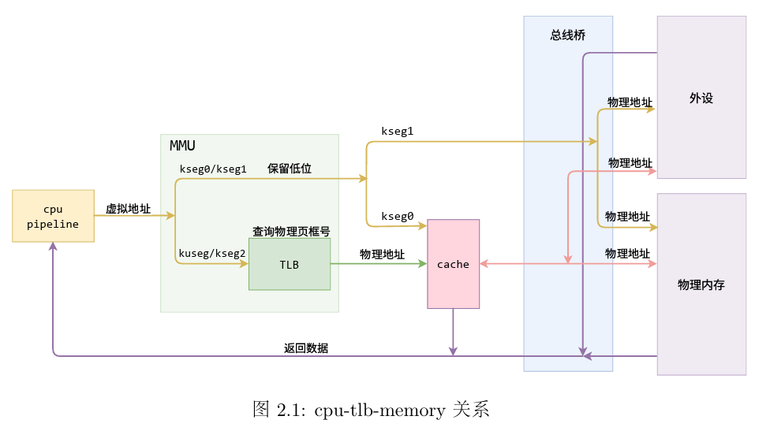
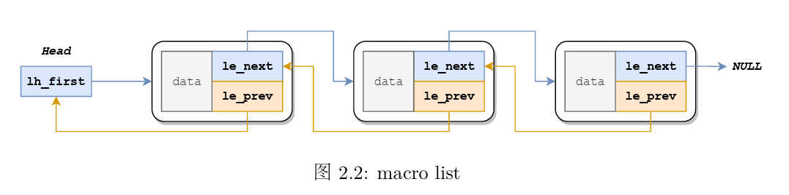
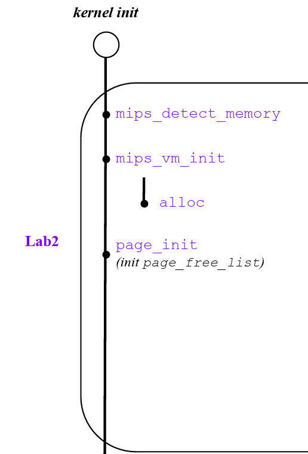
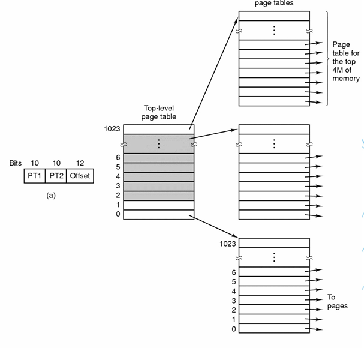
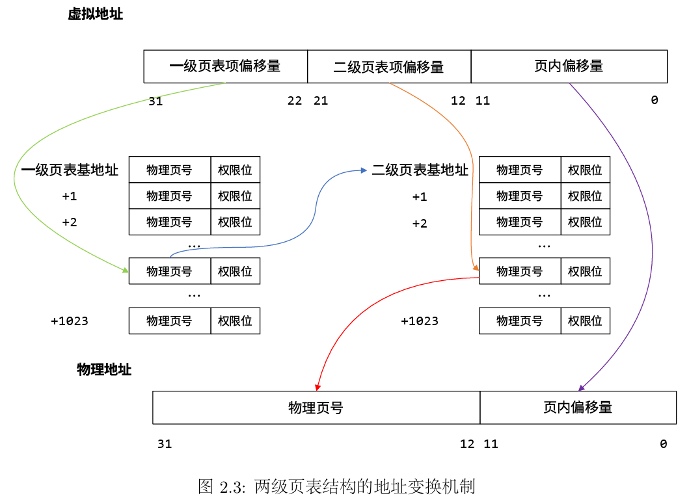
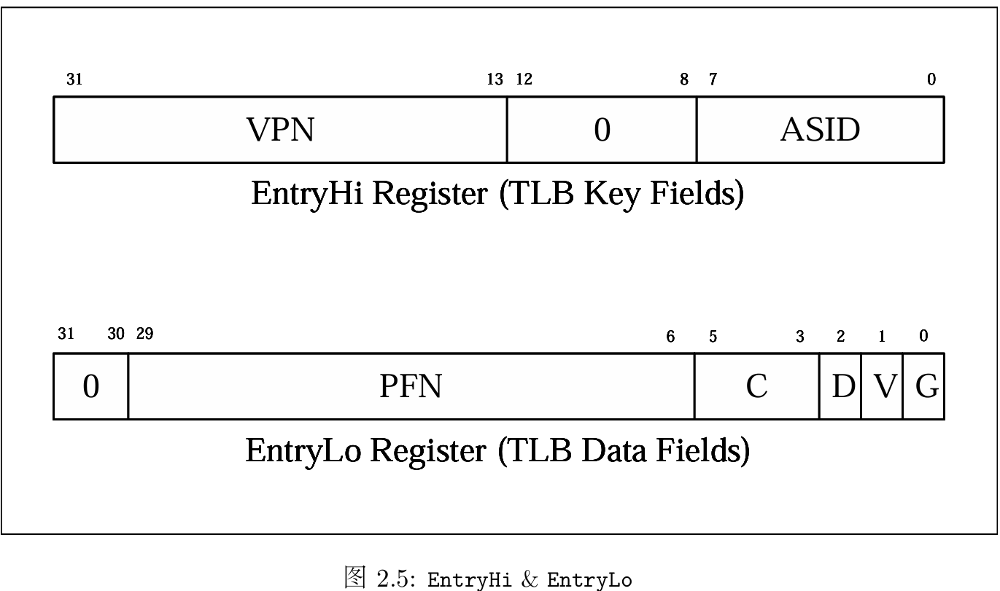
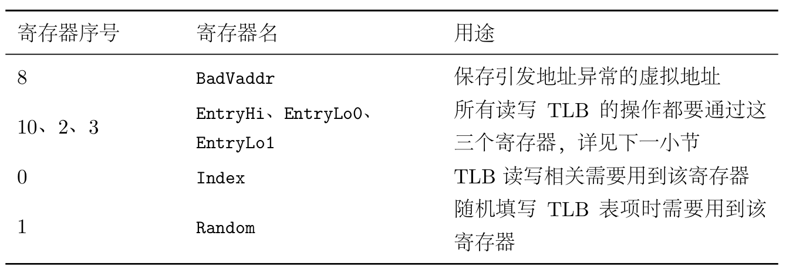
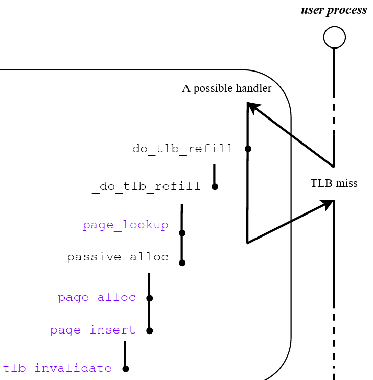

# OS:lab2课下基础

## 一.物理内存管理

### 1.虚拟地址映射到物理地址

> 在MIPS-4Kc上，软件访存虚拟地址会先被MMU(Memory Management Unit) 映射到物理地址，随后使用物理地址来访问内存或其他外设

​	虚拟地址空间中的四个部分

* ```kseg0```：**存放内核代码与数据**
  * 将虚拟地址的最高位清0得到物理地址
  * 通过Cache访存
  * ```0x8000_0000 - 0x9fff_ffff```
* ```kseg1```：**访问外设**
  * 将虚拟地址的最高三位清0得到物理地址
  * 不通过Cache访存
  * ```0xa000_0000 - 0xbfff_ffff```
* ```kuseg```：**用户程序代码与数据**
  * **通过TLB转换成物理地址**
  * 通过Cache访存
  * ```0x0000_0000 - 0x7fff_ffff```



### 2.内核程序启动

> lab1中内核启动后跳转到mips_init函数，lab2中在mips_init中增加三个函数
>
> 在建立内核管理机制时，实验中都通过kseg0访问内存

#### 2.1 mips_detect_memory

> 探测硬件可用内存，并对一些和内存管理相关的变量进行初始化

```
void mips_detect_memory(u_int _memsize) {
	/* Step 1: Initialize memsize. */
	memsize = _memsize;
	/* Step 2: Calculate the corresponding 'npage' value. */
	/* Exercise 2.1: Your code here. */
	npage = memsize / PAGE_SIZE;
	printk("Memory size: %lu KiB, number of pages: %lu\n", memsize / 1024, npage);
}
```

* ```memsize```对应总物理内存对应的字节数
* ```npage```对应总物理页数
* ```PAGE_SIZE```是```mmu.h```中定义的宏，大小是4096，即每个物理页面的大小为4096字节

#### 2.2 mips_vm_init

##### alloc

> 在建立起页式内存管理机制之前，使用alloc进行内存空间的分配

* 这段代码的作用是分配n字节的空间并返回初始的虚拟地址，同时将地址按 align字节对齐（保证align 可以整除初始虚拟地址），若clear为真，则将对应内存空间的值清零，否则不清零

```
void *alloc(u_int n, u_int align, int clear) {
	extern char end[];
	u_long alloced_mem;

	/* Initialize `freemem` if this is the first time. The first virtual address that the
	 * linker did *not* assign to any kernel code or global variables. */
	if (freemem == 0) {
		freemem = (u_long)end; // end
	}

	/* Step 1: Round up `freemem` up to be aligned properly */
	freemem = ROUND(freemem, align);

	/* Step 2: Save current value of `freemem` as allocated chunk. */
	alloced_mem = freemem;

	/* Step 3: Increase `freemem` to record allocation. */
	freemem = freemem + n;

	// Panic if we're out of memory.
	panic_on(PADDR(freemem) >= memsize);

	/* Step 4: Clear allocated chunk if parameter `clear` is set. */
	if (clear) {
		memset((void *)alloced_mem, 0, n);
	}

	/* Step 5: return allocated chunk. */
	return (void *)alloced_mem;
}
```

* 这里```freemem```是一个全局变量，初始值为0，我们将它初始化为end(```0x8040_0000```)，这个变量代表地址小于freemem的空间都被分配完了

* **地址关于align对齐：**使用ROUND()函数实现，其计算如下
  $$
  ROUND(freemem,align) = \lceil \frac {freemem} {align} \rceil *align
  $$
  **向上取整即找到了freemem之上最小的，按align对齐的地址，中间未用到的地址空间全部舍弃**

* **分配内存空间**

  ```
  alloced_mem = freemem;
  freemem = freemem + n;
  ```

  分配的空闲内存空间即为```[alloced_mem,freemem]```这n个字节大小的空间，这里注意freemem进行了更新，仍然保持着freemem地址空间之下都被分配完的性质。

* ```PADDR:Physical ADDRess```

  > kva : kernel virtual address 

  * 建立内存管理机制时都是通过kseg0的地址转换方式进行转换，即对最高位清0(```ULIM=0x8000_0000```)

  ```
  #define PADDR(kva)                                                                                 \
  	({                                                                                         \
  		u_long _a = (u_long)(kva);                                                         \
  		if (_a < ULIM)                                                                     \
  			panic("PADDR called with invalid kva %08lx", _a);                          \
  		_a - ULIM;  /*高位清0*/                                                                       \
  	})
  ```

  * 这里将虚拟地址转化为物理地址，检查是否超出物理地址范围
  * **C语言标准中，多行宏定义要用\隔开，在预处理时会将这些行拼接为一行**

* **关于int转换到void***

  可以注意到```(void*)alloced_mem```，```alloced_mem```是一个无符号整型，涉及到整型向void*类型的转换，效果为指针指向的地址值为int值，例如这个例子代表指向地址```alloced_mem(作为地址值)```。

##### mips_vm_init

```
void mips_vm_init() {
	/* Allocate proper size of physical memory for global array `pages`,
	 * for physical memory management. Then, map virtual address `UPAGES` to
	 * physical address `pages` allocated before. For consideration of alignment,
	 * you should round up the memory size before map. */
	pages = (struct Page *)alloc(npage * sizeof(struct Page), PAGE_SIZE, 1);
	printk("to memory %x for struct Pages.\n", freemem);
	printk("pmap.c:\t mips vm init success\n");
}
```

* ```pages```是一个结构体类型的全局数组，里边的每一个元素都是结构体```Page```类型

* 每一个```Page```结构体是对应的物理页面的页面控制块，其中包含一个指针域(pp_link)(主要用于空闲链表```page_free_list```)，以及一个数据域(pp_ref)，记录了有多少虚拟页面映射到该物理页面(**pp_ref==0即为空闲页面**)

  ```Page```结构体展开为

  ```
  struct Page{
  	struct {
  		struct Page* le_next;
  		struct Page** le_prev;
  	} pp_link;
  	u_short pp_ref;
  }
  ```

#### 2.3 page_init

```
void page_init(void) {
	/* Step 1: Initialize page_free_list. */
	/* Hint: Use macro `LIST_INIT` defined in include/queue.h. */
	LIST_INIT(&page_free_list);
	/* Step 2: Align `freemem` up to multiple of PAGE_SIZE. */
	freemem = ROUND(freemem,PAGE_SIZE);
	/* Step 3: Mark all memory below `freemem` as used (set `pp_ref` to 1) */
	u_long used_page_num = PPN(PADDR(freemem));
	u_long i;
	/*注：pages是Page结构体数组头指针 *(pages+i)与pages[i]等同于访问pages中第i个page*/
	for (i = 0;i < used_page_num;i++) {
		pages[i].pp_ref = 1;
	}
	/* Step 4: Mark the other memory as free. */
	for (i = used_page_num;i < npage;i++) {
		pages[i].pp_ref = 0;
		LIST_INSERT_HEAD(&page_free_list,&pages[i],pp_link);
	}
}
```

* ```page_init```主要的功能是将已经使用的物理页面引用次数标记为1，并将空闲的物理页面的页面控制块(```Page```结构体)加入空闲链表中，这里注意加入空闲链表的位置为头部
* freemem虚拟地址，freemem以下的地址空间全都被使用了，比如我们刚才为```pages```数组分配空间，将freemem以```struct Page```大小进行对齐，划分物理页面时以```PAGE_SIZE```将freemem对齐，当前物理页面编号```PPN(PADDR(freemem))```。
* **关于空闲链表**：当一个进程需要分配内存时，就需要将空闲链表**头部**的页控制块对应的那一页物理内存分配出去，同时将该页控制块从空闲链表中删去。 当一页物理内存被使用完毕（准确来说，引用次数为0）时，将其对应的页控制块重新插入到空闲链表的**头部**。

#### 2.4 链表宏 LIST_INSERT_AFTER

> 在节点之后进行插入

```
#define LIST_INSERT_AFTER(listelm, elm, field)                                                      \
	/* Exercise 2.2: Your code here. */  															\
	do {																						    \
		LIST_NEXT((elm), field) = LIST_NEXT((listelm), field);    									\
		if (LIST_NEXT((listelm), field) != NULL)                        							\
			LIST_NEXT((listelm), field)->field.le_prev = &LIST_NEXT((elm), field); 					\
		LIST_NEXT((listelm), field) = (elm);   														\
		(elm)->field.le_prev = &LIST_NEXT((listelm), field); 										\
	} while (0)
```

* 实验中使用链表宏主要是对空闲页面的页面控制块（Page结构体）进行管理，每一个页面控制块可以分为链接域(pp_link)和数据域(pp_ref)(**即代码中的field为pp_link**)。链接域pp_link是一个结构体，其中包含两个指针，```struct Page *le_next```，```struct Page **le_prev```。

  

* ```struct Page* le_next```是指向下一个节点的指针

* ```struct Page **le_prev```是指向前一个元素的```le_next```指针的二级指针，主要用途是改变前一个元素```le_next```的指向，例如在```listelm```之前插入节点```elm```，```*(listelm)->field.le_prev = (elm)```

#### 2.5 page_alloc

> 将空闲链表头部页控制块对应的物理页面分配出去，并将其从空闲链表中删除

```
int page_alloc(struct Page **new) {
	/* Step 1: Get a page from free memory. If fails, return the error code.*/
	struct Page *pp;
	if (LIST_EMPTY(&page_free_list)) {
		return -E_NO_MEM;
	}
	pp = LIST_FIRST(&page_free_list);
	LIST_REMOVE(pp, pp_link);

	/* Step 2: Initialize this page with zero.
	memset((void*)page2kva(pp),0,PAGE_SIZE);
	*new = pp;
	return 0;
}
```

* 如果空闲链表为空，返回```error code```，其中错误码都定义在头文件```error.h```中，其中关于内存分配的错误码为```E_NO_MEM```

* ```page2kva```：将页面控制块地址转换为对应的内核虚拟地址，这里```memset```实际上是对物理地址空间的写行为，**我们在代码中读写虚拟地址时，虚拟地址经过CPU发送给MMU，转换为相应的物理地址，再对物理地址空间进行读写，实际上确实是对物理页面进行了清空**

#### 2.6 page_free

> page_free与page_decref配合使用，page_decref的功能是将页面控制块的使用次数pp_ref-1，当pp_ref=0时调用page_free，将页面控制块重新插入空闲链表头部

```
void page_free(struct Page *pp) {
	assert(pp->pp_ref == 0);
	/* Just insert it into 'page_free_list'. */
	LIST_INSERT_HEAD(&page_free_list,pp,pp_link);
}
```

### 3.总结建立物理内存管理的过程

```
void mips_init(u_int argc, char **argv, char **penv, u_int ram_low_size) {
	printk("init.c:\tmips_init() is called\n");

	// lab2:
	mips_detect_memory(ram_low_size);
	mips_vm_init();
	page_init();
}
```

​	在跳转到mips_init函数后

* mips_detect_memory：检查可用的物理内存大小，初始化物理页面数量npage

* mips_vm_init：初始化页面控制块数组pages管理所有物理页面的页面控制块（**通过alloc为pages分配内存**）

* page_init：将初始化过程中已经使用的物理页面ref标记为1（这里freemem以下的空间为已经使用的空间），其余的空闲页面的页面控制块加入空闲链表```page_free_list```（**空闲链表的插入和删除都是从头部进行**）。

* 总体来说实现了指导书中图左半部分

  

## 二.虚拟内存管理

> 位于kuseg的虚拟地址，需要使用两级页表结构对其进行地址转换，即用户编写的代码和数据需要使用两级页表来访问相应的物理地址空间

### 1.两级页表结构

* 两级页表解决了一级页表当页数过多时占用内存空间过大的问题，解决方法是将一级页表再分页，建立起页目录，每次只将原页表中的一部分拿到内存中

  

* **一级页表:Page Dictionary**

  * 一级页表表项定义为```Pde(u_long)```类型，实际上是一个32位整型

* **二级页表:Page Table**

  * 二级页表表项定义为```Pte(u_long)```类型，实际上是一个32位整型

* **或者认为一级页表项是个中间量，二级页表项对应的物理地址才是我们需求的物理地址**

* 每个页表项由32位组成，**包括20位物理页号和12位标志位，12位标志位包含高6位硬件标志位和低6位软件标志位**

* 对于一个32位的虚拟地址，31-22位代表一级页表表项的偏移量(1024项)，21-12位代表二级页表表项的偏移量(1024项)，11-0位代表页内偏移(```PAGE_SIZE=4096```)，与物理页面大小相同

* **宏函数PDX(va)**：一级页表表项偏移量(先移位再用与运算高位清0)

* **宏函数PTX(va)**：二级页表表项偏移量

* 通过TLB访存过程如下图

  

### 2.页表相关函数

#### 2.1 二级页表检索函数 pgdir_walk

> 将一级页表基地址pgdir对应的两级页表结构中va虚拟地址所在的二级页表项的指针存储在ppte指向的空间上，如果对应的二级页表不存在且creat=1则使用page_alloc函数分配一页物理内存存放二级页表

* **关于page_alloc**：在一般操作系统中，当物理页全部被映射（所有内存空间均被占用），此时还需要申请新的物理页，那么就需要将一些在内存中的物理页置换到硬盘中，选择哪个物理页的算法就称为页面置换算法，例如FIFO算法和LRU算法。 **然而在MOS中，这一过程的实现被简化，一旦物理页全部被分配(page_free_list isEmpty)，进行新的物理页分配时并不会进行任何的页面置换，而是直接返回错误，即在对应page_alloc函数中返回-E_NO_MEM。**

* 代码

  ```
  static int pgdir_walk(Pde *pgdir, u_long va, int create, Pte **ppte) {
  	Pde *pgdir_entryp;
  	struct Page *pp;
  
  	/* Step 1: Get the corresponding page directory entry. */
  	pgdir_entryp = pgdir + PDX(va);
  	/* Step 2: If the corresponding page table is not existent (valid) then:
  	 *   * If parameter `create` is set, create one. Set the permission bits 'PTE_C_CACHEABLE |
  	 *     PTE_V' for this new page in the page directory. If failed to allocate a new page (out
  	 *     of memory), return the error.
  	 *   * Otherwise, assign NULL to '*ppte' and return 0.
  	 */
  	if (!(*pgdir_entryp & PTE_V)) { // 该页目录项中的有效位为0
  		if (create) {
  			int ret = page_alloc(&pp); // 创建新物理页，即该一级页表表项对应的二级页表页面 
  			if (ret != 0) { // 观察创建返回值
  				return ret; // -E_NO_MEM 分配失败返回错误码
  			} else {
  				pp->pp_ref = 1; // 为0时为空闲页面 
  				// pp是分配出的空闲物理页的页控制块，是原来空闲页面链表(page_free_list)的第一个元素 
  				*pgdir_entryp = page2pa(pp) | PTE_V | PTE_C_CACHEABLE;
  			}
  		} else {
  			*ppte = NULL;
  			return 0;
  		}
  	}
  	/* Step 3: Assign the kernel virtual address of the page table entry to '*ppte'. */
  	// ppte对应的为虚拟地址，这里做了二级页表基地址物理地址到虚拟地址的映射
  	*ppte = (Pte*)(KADDR(PTE_ADDR(*pgdir_entryp))) + PTX(va); // 页表偏移量 PTX 
  	return 0;
  }
  ```

  * ```page2pa```：将物理页号左移12位得到物理地址，符合页表项的结构20位物理页号+12位权限位
  * ```PTE_ADDR```：将一级页表项```pgdir_entryp```的低12位权限位清0，即得到原本的物理地址，即他所对应的二级页表的物理地址
  * 注：我们使用的都是虚拟地址，例如一级页表的基地址，二级页表的基地址等

* **思路梳理**

  * 先根据一级页表基地址和偏移量找到一级页表的表项，再根据一级页表中物理页号部分得到二级页表的物理基地址，转换为虚拟地址(TLB映射过程中处于内核态，使用kseg0的地址映射策略KADDR)，再根据二级页表偏移量找到对应的二级页表项
  * 代码的前半段功能为给无效的一级页表项分配二级页表，并更新一级页表项中的物理页号部分（物理页号左移12位就是物理地址），最后补充权限位(或运算)

#### 2.2 增加地址映射函数 page_insert

> 将一级页表地址pgdir对应的两级页表结构中虚拟地址va映射到页控制块pp对应的物理页面，并设置页表项权限

```
nt page_insert(Pde *pgdir, u_int asid, struct Page *pp, u_long va, u_int perm) {
	Pte *pte;

	/* Step 1: Get corresponding page table entry. */
	//要将pp映射到va，首先检查va是否已经存在了映射
	pgdir_walk(pgdir, va, 0, &pte);

	if (pte && (*pte & PTE_V)) {
		// 如果存在映射且有效 
		if (pa2page(*pte) != pp) {
			//如果当前的映射不是映射到pp，先移除当前映射，后续再映射到pp
			page_remove(pgdir, asid, va);
		} else {
			// 如果当前已经映射到pp，则只需要更新权限位
			//这里对虚存对应的页表项进行更新，要对TLB中对应表项无效化，下次访问触发重填异常
			tlb_invalidate(asid, va);
			*pte = page2pa(pp) | perm | PTE_C_CACHEABLE | PTE_V;
			return 0;
		}
	}

	/* Step 2: Flush TLB with 'tlb_invalidate'. */
	tlb_invalidate(asid,va);
	/* Step 3: Re-get or create the page table entry. */
	/* If failed to create, return the error. */
	int ret = pgdir_walk(pgdir,va,1,&pte);
	if (ret != 0) {
		return -E_NO_MEM;
	} 
	/* Step 4: Insert the page to the page table entry with 'perm | PTE_C_CACHEABLE | PTE_V'
	 * and increase its 'pp_ref'. */
	pp->pp_ref++;
	*pte = page2pa(pp) | perm | PTE_C_CACHEABLE | PTE_V;
	return 0;
}
```

* **思路梳理：**要把虚拟地址映射到物理页面上，首先要检查该虚拟地址是否已经存在有效的映射
  * 存在有效的映射且没有映射到我们目标的物理页面：取消已有的映射
  * 已经映射到我们目标的物理页面：更新权限位
  * 不存在已有的有效的映射：则找到虚拟地址va对应的二级页表项(这里设置creat=1，如果不存在就创建，创建不成功返回错误码)，修改二级页表项中的内容（物理地址）以及更新权限位
* **所谓增加地址映射实际上就是要更新二级页表项的值，将其中的值更新为需要映射到的物理页面的页号**

#### 2.3 寻找映射的物理地址函数 page_lookup

> 找到二级页表结构中虚拟地址所对应的二级页表项所对应的物理页面

```
struct Page *page_lookup(Pde *pgdir, u_long va, Pte **ppte) {
	struct Page *pp;
	Pte *pte;

	/* Step 1: Get the page table entry. */
	pgdir_walk(pgdir, va, 0, &pte);

	/* Hint: Check if the page table entry doesn't exist or is not valid. */
	if (pte == NULL || (*pte & PTE_V) == 0) {
		return NULL;
	}

	/* Step 2: Get the corresponding Page struct. */
	/* Hint: Use function `pa2page`, defined in include/pmap.h . */
	pp = pa2page(*pte);
	if (ppte) {
		*ppte = pte;
	}

	return pp;
}
```

* **思路梳理：**先找到对应的二级页表项，二级页表项中保存的是物理地址的高20位（或者说物理页号）以及低12位的权限位，这里可以将```*pte```作为物理地址使用，函数```pa2page```的执行流程为先将物理地址右移12位（```*pte```丢弃权限位）得到物理页号PPN，再通过PPN找到物理页面的页控制块指针```&pages[PPN]```

#### 2.4 取消地址映射函数 page_remove

```
void page_remove(Pde *pgdir, u_int asid, u_long va) {
	Pte *pte;

	/* Step 1: Get the page table entry, and check if the page table entry is valid. */
	struct Page *pp = page_lookup(pgdir, va, &pte);
	if (pp == NULL) {
		return;
	}

	/* Step 2: Decrease reference count on 'pp'. */
	page_decref(pp);

	/* Step 3: Flush TLB. */
	*pte = 0;
	tlb_invalidate(asid, va);
	return;
}
```

* **思路梳理**：首先找到二级页表项映射到的物理地址的页控制块。```page_decref```函数会将该页面控制块中使用次数```pp_ref-1```并在```pp_ref==0```时进行```page_free```，同时需要刷新TLB，将va对应的表项删除。

## 三.TLB重填

### 1. MIPS-4Kc中的奇偶页TLB设计

​	在MIPS-4Kc中，每一个TLB表项都包含一组Key以及两组Data，其中，一组Key由EntryHi保存，两组Data分别由EntryLo0，EntryLo1保存。回想起上学期计组课程，我们的TLB表项中似乎只是一组Key对应一组Data?为什么在MIPS-4Kc中会存在一组Key对应两组Data呢？观察他们的存储方式



​	我们知道，**VPN有20位，然而在Key中只有高19位**，这样自然对应着两个物理页，在EntryLo0中保存偶数页的页号，在EntryLo1中保存奇数页的页号，并根据VPN最低位判断奇偶页。（CPU发送虚拟地址时，先访问TLB，一下拿到两个数据）

* 内存管理寄存器

  

* **Key:EntryHi**
  * **VPN**：Virtual Page Number，当TLB缺失时，VPN自动由硬件填充为对应虚拟地址的虚页号
  * **ASID**：**用于区分不同进程的地址空间应当映射到不同的物理地址**。我们知道，系统会为每一个进程分配一个单独的虚拟地址空间，在进行虚实地址转换来访问物理内存时，不同进程相同虚拟地址不会映射到同一物理地址，这就需要ASID来进行区分

* **Data:EntryLo**
  * **PFN**：Physical Frame Number,软件填写PFN，接着使用TLB的写指令，才可以将Key和Data写入TLB表项
  * **C**：Cache访问属性
  * **D：**可写位
  * **V**：有效位
  * **G**：全局位，该位如果为1，则CPU发出的虚拟地址只需要与VPN匹配，忽略ASID

### 2.TLB指令

* tlbr：**以 Index 寄存器中的值为索引**，读出TLB中对应的表项到EntryHi与EntryLo0、 EntryLo1
* tlbwi：**以 Index 寄存器中的值为索引**，将此时EntryHi与EntryLo0、EntryLo1 的值写 到索引指定的TLB表项中。 
* tlbwr：将 EntryHi 与 EntryLo0、EntryLo1 的数据随机写到一个 TLB 表项中（此处使 用Random 寄存器来“随机”指定表项，Random寄存器本质上是一个不停运行的循环计数 器）。 
* tlbp：**根据EntryHi 中的 Key**（包含 VPN 与 ASID），查找 TLB 中与之对应的表项，并将 表项的索引存入Index 寄存器（若未找到匹配项，则Index最高位被置1(**为负数**)）

​	**则软件操作TLB的流程为：填写CP0中寄存器+TLB指令**

### 3.TLB维护流程

​	在用户地址空间访存时，虚拟地址到物理地址的转换均通过TLB进行。访问需要转换的虚拟内存地址时

* 首先要使用虚拟页号（VPN）和当前进程的ASID在TLB中查询该地址对应的物理页号
  * 若VPN和ASID组成的Key在TLB中有对应的表项，则可取得物理地址
  * 若不能查询到则产生TLB Miss异常，系统跳转到异常处理程序，在两级页表结构中找到对应的物理地址对TLB进行重填
* 若对虚拟地址对应的页表项进行更新，要对TLB中对应的表项进行无效化(invalidate)，下次再访问该虚拟地址时，硬件触发TLB重填异常，对TLB进行重填

#### 3.1 TLB无效化

* 通过```tlb_invalidate```函数删除特定虚拟地址在TLB中的旧表项，具体是通过调用```tlb_out```函数完成

* tlb_out

  **思路梳理：** **先将要查找的虚拟地址存入`EntryHi`寄存器，然后调用`tlbp`指令在TLB中查找**（此时Index寄存器中保存了找到的对应表项的索引）。如果没有找到（索引小于0），则直接跳到最后；**如果找到了，将索引对应的tlb项清空**（需要将`EntryHi`和`EntryLo`寄存器清零后使用`tlbwi`指令）。注意在函数最后需要将调用该函数前`EntryHi`寄存器中的值恢复

  ```
  LEAF(tlb_out)
  .set noreorder
  	mfc0    t0, CP0_ENTRYHI #维护EntryHi寄存器 将EntryHi寄存器中原本的值存入t0
  	mtc0    a0, CP0_ENTRYHI #将需要寻找的Key(VPN,ASID)存入EntryHi
  	nop
  	/* Step 1: Use 'tlbp' to probe TLB entry */
  	/* Exercise 2.8: Your code here. (1/2) */
  	tlbp	#寻找EntryHi中Key在TLB中对应的表项，并将索引号存入Index寄存器，若不存在则Index最高位置1(index为负数)
  	nop
  	/* Step 2: Fetch the probe result from CP0.Index */
  	mfc0    t1, CP0_INDEX #将Index寄存器中的值存入t1寄存器
  .set reorder 
  	bltz    t1, NO_SUCH_ENTRY #判断index值大小，若小于0则说明没找到
  .set noreorder
  	mtc0    zero, CP0_ENTRYHI #将EntryHi清0
  	mtc0    zero, CP0_ENTRYLO0 #将EntryLo0清0
  	mtc0    zero, CP0_ENTRYLO1 #将EntryLo1清0
  	nop
  	/* Step 3: Use 'tlbwi' to write CP0.EntryHi/Lo into TLB at CP0.Index  */
  	/* Exercise 2.8: Your code here. (2/2) */
  	tlbwi	#向找到的index表项中写入Key,Data(全为0)
  .set reorder
  
  NO_SUCH_ENTRY:
  	mtc0    t0, CP0_ENTRYHI #恢复调用前EntryHi的值
  	j       ra #跳转回调用者
  END(tlb_out)
  ```

#### 3.2 TLB重填

​	TLB重填过程由kern/tlb_asm.S中的do_tlb_refill函数完成。在发生TLB Miss异常时，对应的虚拟地址被存放在BadVAddr中，同时在EntryHi寄存器中保存该页面的Key。调用_do_tlb_refill进行TLB重填后将奇偶页表项存入EntryLo，再随机写入到TLB的一个表项中(tlbwr)

* do_tlb_refill

  ```
  NESTED(do_tlb_refill, 24, zero)
  	mfc0    a1, CP0_BADVADDR
  	mfc0    a2, CP0_ENTRYHI
  	andi    a2, a2, 0xff /* ASID is stored in the lower 8 bits of CP0_ENTRYHI */
  .globl do_tlb_refill_call;
  do_tlb_refill_call:
  	addi    sp, sp, -24 /* Allocate stack for arguments(3), return value(2), and return address(1) */
  	sw      ra, 20(sp) /* [sp + 20] - [sp + 23] store the return address */
  	addi    a0, sp, 12 /* [sp + 12] - [sp + 19] store the return value */
  	jal     _do_tlb_refill /* (Pte *, u_int, u_int) [sp + 0] - [sp + 11] reserved for 3 args */
  	lw      a0, 12(sp) /* Return value 0 - Even page table entry */
  	lw      a1, 16(sp) /* Return value 1 - Odd page table entry */
  	lw      ra, 20(sp) /* Return address */
  	addi    sp, sp, 24 /* Deallocate stack */
  	mtc0    a0, CP0_ENTRYLO0 /* Even page table entry */
  	mtc0    a1, CP0_ENTRYLO1 /* Odd page table entry */
  	nop
  	/* Hint: use 'tlbwr' to write CP0.EntryHi/Lo into a random tlb entry. */
  	/* Exercise 2.10: Your code here. */
  	tlbwr
  	jr      ra
  END(do_tlb_refill)
  ```

* _do_tlb_refill

  ```
  void _do_tlb_refill(u_long *pentrylo, u_int va, u_int asid) {
  	tlb_invalidate(asid, va);
  	Pte *ppte;
  	/* Hints:
  	 *  Invoke 'page_lookup' repeatedly in a loop to find the page table entry '*ppte'
  	 * associated with the virtual address 'va' in the current address space 'cur_pgdir'.
  	 *
  	 *  **While** 'page_lookup' returns 'NULL', indicating that the '*ppte' could not be found,
  	 *  allocate a new page using 'passive_alloc' until 'page_lookup' succeeds.
  	 */
  
  	/* Exercise 2.9: Your code here. */
  	while(page_lookup(cur_pgdir,va,&ppte) == NULL) {
  		passive_alloc(va,cur_pgdir,asid);
  	}
  	ppte = (Pte *)((u_long)ppte & ~0x7);
  	pentrylo[0] = ppte[0] >> 6;
  	pentrylo[1] = ppte[1] >> 6;
  }
  ```

  * **思路梳理：**不断寻找va对应的二级页表项，如果一直为空则不断尝试为该二级页表项分配物理页面，直到不为空为止

* passive_alloc

  ```
  static void passive_alloc(u_int va, Pde *pgdir, u_int asid) {
  	struct Page *p = NULL;
  
  	if (va < UTEMP) {
  		panic("address too low");
  	}
  
  	if (va >= USTACKTOP && va < USTACKTOP + PAGE_SIZE) {
  		panic("invalid memory");
  	}
  
  	if (va >= UENVS && va < UPAGES) {
  		panic("envs zone");
  	}
  
  	if (va >= UPAGES && va < UVPT) {
  		panic("pages zone");
  	}
  
  	if (va >= ULIM) {
  		panic("kernel address");
  	}
  
  	panic_on(page_alloc(&p));
  	panic_on(page_insert(pgdir, asid, p, PTE_ADDR(va), (va >= UVPT && va < ULIM) ? 0 : PTE_D));
  }
  ```

  * **思路梳理：**先分配出一个物理页面，再将虚拟地址va对应的二级页表项映射到物理页面上

### 4.总结虚拟内存管理的过程

我们从用户进程的视角来分析虚拟内存管理，我们实现的实际上是发生TLB Miss时进行的异常处理，即对TLB表项进行重填。

* 当发生TLB Miss，调用do_tlb_refill进行重填
* do_tlb_refill会首先在页表中查找该虚拟地址对应的二级页表项(page_lookup)
  * 如果有则进行重填
  * 如果没有则进行分配(passive_alloc)
    * 首先分配物理页面(page_alloc)
    * 然后建立起va和刚分配的物理页面之间的映射(page_insert)
    * 对原表项进行无效化(page_invalidate)



## 四.上机前复习

### 1.已知二级页表基地址pgdir，两级页表均有1024项，遍历虚拟地址空间

```c
//已知Pde* pgdir
for (u_long i = 0; i < 1024; i++) { //遍历页目录的1024项
    Pde *pde = pgdir + i; //第i个页目录项对应的虚拟地址
    if ((*pde) & PTE_v) { //第i个页表有效
        for (u_long j = 0; j < 1024; j++) {//遍历第i个页表的1024项
            Pte *pte = (Pte*)KADDR(PTE_ADDR(*pde)) + j;
            if ((*pte) & PTE_V) { //第j个页有效
                //some code 
                /*例如*/
                //1.将(*pte)页表项映射到某物理地址，且保留后边的所有12位offset
                (*pte) = PTE_ADDR(物理地址) | ((*pte) & 0xfff);
                //或(*pte) = (((某物理地址)/PAGESIZE) << 12) | ((*pte) & 0xfff);
                //2.定向设置(*pte)页表项的权限位
                (*pte) = ((*pte) | PTE_SWP) & (~PTE_V);
                //3.改变TLB中的(*pte)页表项(实际上是使他无效)
                //tlb_invalidate(asid,va);
                tlb_invalidate(asid,(i << 22) | (j << 12));
            }
            
        }
    }
}
```

### 2.几个量

```c
// 已知Pde *pgdir
Pde *pde = pgdir + i;
1.pde : 第i个页目录项对应的虚拟地址
2.(*pde) : 第i个页目录项的内容
3.PTE_ADDR(*pde) : 第i个页目录项内容中的物理地址 = 第i个页表的物理基地址
4.KADDR(PTE_ADDR(*pde)) : 第i个页表的虚拟基地址
Pte *pte = (*Pte)KADDR(PTE_ADDR(*pde)) + j;
1.pte : 第j个页表项对应的虚拟地址
2.(*pte) : 第j个页表项内容
//虚拟地址 va
u_long i = PDX(va);
u_long j = PTX(va);
u_long va = (i << 22) | (j << 12) | offset;
```

### 3.2021级上机题目

#### 3.1exam

统计二级页表中满足以下条件的页表项

* 页表项有效

  ```c
  if ((*pte) & PTE_V)
  ```

* 页表项映射的物理地址为给定的```Page *pp```物理地址

  ```c
  PTE_ADDR(*pte) == page2pa(pp)
  ```

* 页表项的权限包含给定的权限perm_mask(赋予该权限之后和原页表项内容相同)

  ```c
  (*pte) == ((*pte) | perm_mask)
  ```

* 思路：遍历二级页表

  ```c
  for (u_long i = 0;i < 1024;i++) {
      int cnt = 0;
  	Pde *pde = pgdir + i;
  	if (!(*pde & PTE_V)) {
          continue;
      }
      for (u_long j = 0;j < 1024;j++) {
          Pte *pte = (Pte*)KADDR(PTE_ADDR(*pde)) + j;
          if (!(*pte & PTE_V)) {
              continue;
  		}
          if (((*pte) == ((*pte | perm_mask))) && (PTE_ADDR(*pte) == page2pa(pp))){
              cnt++;
          }
      }
      return cnt;
  }
  ```

#### 3.2 extra

* 实现一个简单的交换机制

### 4. 2022级上级题目

#### 4.1 exam

* 挺简单的，遍历指定范围的虚拟地址空间，找到引用次数大于阈值的物理页面数量，主要是寻找到虚拟页面对应的物理页面的页控制块，题目中提示了要使用```page_lookup```函数，这里需要判断如果返回的页面控制块为空(无映射或无效)就跳过

#### 4.2 extra

* 总体实现难度也不高，题意为实现一个简化版的伙伴交换系统，完成分配和回收函数，题目中给出了很多限制，例如只能申请4KB,8KB的空闲块，分配机制按照题目提示就能完成，这里需要注意8KB对应的页面控制块是他的低4KB的页面控制块，要想拿到高4KB的页面控制块只需要对地址增加之后转换(```pa2page(page2pa(pp) + PAGE_SIZE)```)

* 回收函数中我认为有一个思考点是如何将4KB的空间和他的空闲的伙伴地址空间一同回收(这里题目中限制了只有4KB才会出现伙伴，因为最多分配8KB)

  * 第一点是如何确定谁是他的伙伴，或者说怎样找到他的伙伴的页面控制块，再进一步的说，如何找到他的伙伴空间的地址。我们在把8KB的地址空间拆分为伙伴时(初始时将全部4MB地址空间划分为8KB插入空闲链表)，可以理解为一个4KB在低地址，一个4KB在高地址。这样我们只需要判断出我们拿到的这个4KB位于高地址还是低地址位置，在加或减页面大小就能得到他的伙伴的物理地址。如何判断呢？我们可以清楚地知道，如果将全部8KB都划分为4KB序列，**对这些4KB块编号(从0开始)，那么处于低地址的编号为偶数，处于高地址的编号为奇数。这样只需要计算出相对的页面编号就行了。**假设我们拿到的页面控制块为```struct Page *pp```，这样可以由他对应的物理地址相对于首地址的偏移量再除以页面大小得到编号。

    * 伪代码表示

      ```
      offset = page2pa(pp) - start;
      number = offset / PAGE_SIZE;
      if (number % 2 == 0) {
       	// 低地址 伙伴位于高地址
       	struct Page*higher_buddy = pa2page(page2pa(pp) + PAGE_SIZE);
      } else {
      	struct Page*lower_buddy = pa2page(page2pa(pp) - PAGE_SIZE);
      }
      ```

  * 接下来一点是判断这个伙伴是否空闲，即是否在4KB的空闲链表中，只需要遍历4KB的空闲链表看看能不能找到即可，这里使用宏```LIST_FOREACH```可以完成for遍历头书写

#### 4.3总结

​	从lab2以后对于操作系统的理解难度变得更高，更加印证了陈奕帅学长的话：“学好OS就要理解好OS的代码”，诚哉斯言！
