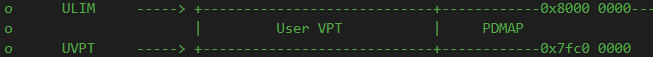
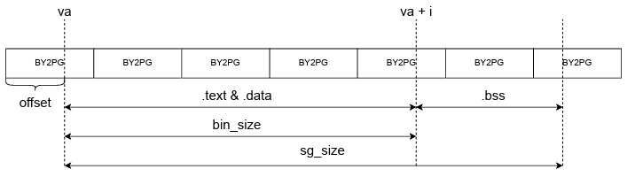
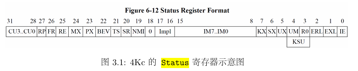
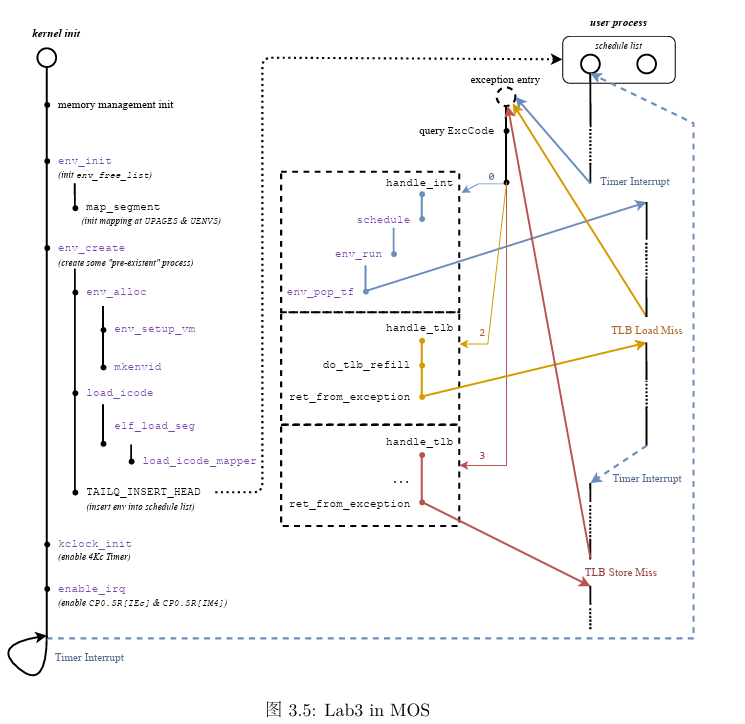

# OS:lab3实验报告

## Thinking 3.1

* **请结合 MOS 中的页目录自映射应用解释代码中 e->env_pgdir[PDX(UVPT)] = PADDR(e->env_pgdir) | PTE_V 的含义。**

* UVPT是用户地址空间中页表项的起始地址

  

* 结合页目录自映射我们知道，只要给定了二级页表项的起始地址，我们就能通过自映射机制计算出页目录的起始虚拟地址

  * UVPT为二级页表基地址
  * 则页目录基地址为$UVPT + (UVPT>>12)*4 = UVPT+UVPT>>10$
  * 映射到页目录的页表项的地址为$UVPT + ((UVPT+UVPT>>10)>>12)*4 = UVPT + UVPT>>10 + UVPT>>20$
  * 该项相对于页目录的index：或者说该项相对于页目录的地址偏移为$UVPT>>20$，对应的偏移量为UVPT>>22，即为PDX(UVPT)

* ```PDX(UVPT)```可以得到二级页表起始虚拟地址UVPT的页目录号

* ```e->env_pgdir[PDX(UVPT)]```即为指向页目录中指向页目录自身的页目录项

* ```PADDR(e->env_pgdir)```得到页目录的物理地址并赋予有效位```PTE_V```

## Thinking 3.2

* **elf_load_seg 以函数指针的形式，接受外部自定义的回调函数 map_page。请你找到与之相关的 data 这一参数在此处的来源，并思考它的作用。没有这个参数可不可以？为什么？**

* ```data```是传入的进程控制块指针
* 作用：在增加虚拟地址到物理地址的映射时提供当前进程地址空间的页目录基地址pg_dir和asid(load_icode_mapper)，所有这个参数是必要的

## Thinking 3.3

* **结合 elf_load_seg 的参数和实现，考虑该函数需要处理哪些页面加载的情况**

* ```elf_load_seg```函数的实现(```elfloader.c```)

  ```c
  int elf_load_seg(Elf32_Phdr *ph, const void *bin, elf_mapper_t map_page, void *data) {
  	u_long va = ph->p_vaddr;
  	size_t bin_size = ph->p_filesz;
  	size_t sgsize = ph->p_memsz;
  	u_int perm = PTE_V;
  	if (ph->p_flags & PF_W) {
  		perm |= PTE_D;
  	}
  
  	int r;
  	size_t i;
  	u_long offset = va - ROUNDDOWN(va, PAGE_SIZE);
  	if (offset != 0) {
  		if ((r = map_page(data, va, offset, perm, bin,
  				  MIN(bin_size, PAGE_SIZE - offset))) != 0) {
  			return r;
  		}
  	}
  
  	/* Step 1: load all content of bin into memory. */
  	for (i = offset ? MIN(bin_size, PAGE_SIZE - offset) : 0; i < bin_size; i += PAGE_SIZE) {
  		if ((r = map_page(data, va + i, 0, perm, bin + i, MIN(bin_size - i, PAGE_SIZE))) !=
  		    0) {
  			return r;
  		}
  	}
  
  	/* Step 2: alloc pages to reach `sgsize` when `bin_size` < `sgsize`. */
  	while (i < sgsize) {
  		if ((r = map_page(data, va + i, 0, perm, NULL, MIN(sgsize - i, PAGE_SIZE))) != 0) {
  			return r;
  		}
  		i += PAGE_SIZE;
  	}
  	return 0;
  }
  ```

  

  * 首先判断虚拟地址va是否页对齐，如果不对齐就将多余的地址标记为offset，然后将offset所在的BY2PG剩下的那部分大小(```PAGE_SIZE-offset```)写入对应页的物理地址
  * 然后依次将段内的页映射到物理空间
  * 最后若发现在内存中的大小大于在文件中的大小，需要把多余的空间用0填满

## Thinking 3.4

* **思考上面这一段话，并根据自己在 Lab2 中的理解，回答：**
  * **你认为这里的 env_tf.cp0_epc 存储的是物理地址还是虚拟地址?**
* 存储的是虚拟地址，EPC存储的是**宏观PC**或者说是发生错误时CPU运行到的指令地址。
* 对于CPU来说可见的都是虚拟地址，我们编程时使用的也是虚拟地址，经过MMU进行地址转换为物理地址

## Thinking 3.5

* **试找出0、1、2、3号异常处理函数的具体实现位置**

* 0号对应的异常处理：处理中断```handle_int```，在```genex.S```中给出定义

  ```assembly
  NESTED(handle_int, TF_SIZE, zero)
  	mfc0    t0, CP0_CAUSE
  	mfc0    t2, CP0_STATUS
  	and     t0, t2
  	andi    t1, t0, STATUS_IM7 #第7位为时钟中断，判断是不是时钟
  	bnez    t1, timer_irq
  timer_irq:
  	li      a0, 0
  	j       schedule
  END(handle_int)
  ```

  * 在中断处理程序中需要判断CAUSE寄存器中是由第几号中断位引发的中断（时钟中断为第七位），然后进入对应的中断服务函数
  * 如果t1不等于0跳转到时钟中断处理函数schedule（实际上是进行抢占式调度）

* 1,2,3号对应的异常处理函数```handle_mod```以及```handle_tlb```使用```genex.S```中定义的宏```BUILD_HANDLER```实现，下面进行简要分析

  * ```BUILD_HANDLER```宏定义

    ```assembly
    .macro BUILD_HANDLER exception handler
    NESTED(handle_\exception, TF_SIZE + 8, zero)
    	move    a0, sp
    	addiu   sp, sp, -8
    	jal     \handler
    	addiu   sp, sp, 8
    	j       ret_from_exception
    END(handle_\exception)
    .endm
    ```

  * 宏定义中需要传入两个参数

    * ```BUILD_HANDLER tlb do_tlb_refill```

    * 异常名(exception)，用于构建函数名(```handle_\exception```)
    * 异常处理函数(handler)，用于进行对应的异常处理(```jal \handler```)，例如经典的do_tlb_refill(同样为汇编代码)

  * 这里的```ret_from_exception```即为指导书中给出的

    ```assembly
    FEXPORT(ret_from_exception)
    	RESTORE_ALL
    	eret
    ```

## Thinking 3.6

* **阅读 entry.S、genex.S 和 env_asm.S 这几个文件，并尝试说出时钟中断 在哪些时候开启，在哪些时候关闭**
* 时钟中断是否开启由CP0_STATUS寄存器决定，CP0_STATUS寄存器中关于中断的使能位分为两部分，IE——全局中断使能位，IM0-IM7，硬件以及软件中断使能位，其中IM7对应着时钟中断使能位。当IE和IM7同时开启时，时钟中断开启，否则时钟中断关闭。
* 

## Thinking 3.7

* **阅读相关代码，思考操作系统是怎么根据时钟中断切换进程的**
* 首先通过RESET_KCLOCK宏完成对时钟中断计时器Timer的初始化，包括初始化Count寄存器和Compare寄存器，然后调用enable_irq开启中断
* 在进程运行过程中，若产生时钟中断，则进行异常处理(中断是异步异常)，系统将PC指向0x8000_0180，跳转到.text.exc_grn_entry代码段进行异常分发
* 中断的处理在异常处理向量exception_handlers中对应的处理函数为handle_int(0号异常)
* 进一步判断是否为时钟中断，即CAUSE寄存器第七位是否置高
* 如果是时钟中断，跳转到中断服务函数timer_irq，进一步跳转到schedule进行进程调度
* 在schedule中采用时间片轮转算法进行进程调度
  * 切换进程：时间片用完，将原来的进程插入到调度队列的尾端，从首端选择一个进程PCB运行(env_run(e))

## 实验难点梳理

​	我们在lab3中学习了进程管理的相关内容，本实验中完成的功能可以由下图概括



* ```exception_handlers```数组为**异常向量组**，负责分发异常。我们主要涉及到的是0号异常处理函数(中断处理函数)```handle_int```，1号异常处理函数```handle_mod```，2号/3号处理函数```handle_tlb```。初始化结束后，若有异常产生，则其对应的异常处理函数执行

* ```env_create```

  * 分配进程控制块

    env_alloc从空闲链表中分配一个空闲控制块，并进行相应的初始化工作，初始化过程中调用env_setup_vm函数对虚拟地址空间进行初始化，这里包括**复制模版页表base_pgdir**。模版页表中包含了虚拟地址空间到物理地址空间pages/envs数组的映射，复制到新页表使得用户进程的地址空间中可以访问pages/envs数组

  * 调用load_icode函数将程序加载到新创建的地址空间中

* ```handle_int```

  根据CP0_CAUSE寄存器判断是否为时钟中断(7号中断)，并根据Status寄存器判断7号中断是否开启(全局中断使能&&时钟中断使能IM7)。如果是，则调用schedule函数，schedule函数进行进程调度，调用env_run来运行进程

* ```env_run```

  * 将正在执行的进程(curenv)的现场保存在对应的进程控制块中
  * 选择一个可以运行的进程，恢复该进程上次被挂起时候的现场，即恢复env_tf，调用env_pop_tf完成

* 发生TLB Miss时的异常处理

  ​	硬件在取数据或取指令的时候，CPU发射虚拟地址给MMU进行地址转换。对于用户段虚拟地址的转换通过TLB完成，若TLB在转换的过程中发现TLB中还没有对应于该虚拟地址的映射(```key--VPN/ASID```)，则会产生TLB Miss异常。

  ​	硬件会**打断访存过程**并陷入内核态跳转到对应的异常处理程序(```tlb_miss_entry : pc : 0x8000_0000```)，由操作系统查找页表进行TLB重填(```do_tlb_refill```)，**之后再从异常返回，继续访存**.

  * 从软硬件的角度来看
    * 硬件：在发生TLBMiss 异常的时候，4Kc CPU 会把引发 TLB Miss 的虚拟地址填 入到BadVAddr 寄存器中、虚页号填入到 EntryHi 寄存器的 VPN 域中，将 Cause 寄存 器中的ExcCode 域填写为 TLBL（读请求TLBMiss）或 TLBS（写请求 TLB Miss）。 
    * 软件：从BadVAddr 寄存器中获取引发 TLB Miss 的虚拟地址，接着在 cur_pgdir 中查找该虚拟地址对应的物理地址与权限位，然后将物理页面号和权限位填入到EntryLo 寄存器的PFN域和权限位中，再使用tlbwr（TLBWriteentry selected by Random）将 EntryHi 和 EntryLo 寄存器中的 VPN、PFN、ASID、权限位等随机地写入到TLB中，最 后调用ret_from_exception 从异常返回。

## 实验心得体会

​	在lab3中，我们学习了有关进程的内容：OS感知进程的唯一标识：PCB、进程结构体env中相关字段的含义，如何将程序加载到进程内存空间、如何新建一个进程以及如何利用以时钟中断为基础的时间片轮转算法来进行进程调度。将在OS理论课程中我们学习到的知识运用到实践当中来，在一行行编写和理解OS代码中对操作系统的进程管理有了更加深刻的认识。


