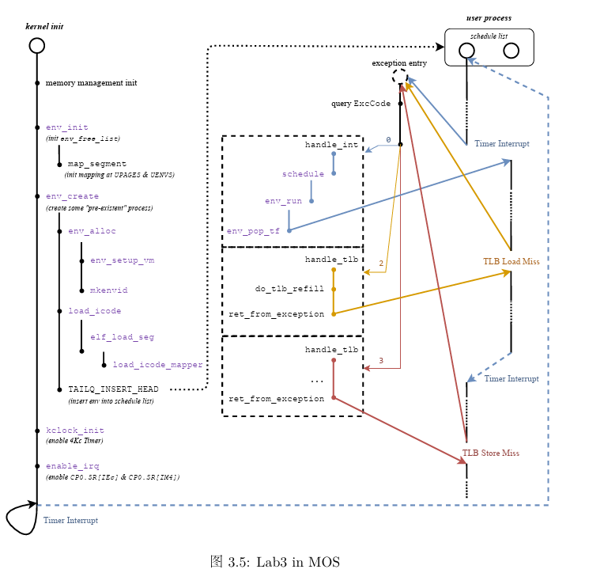

# OS:lab3课下基础

## 1.进程

> 由于没有实现线程，本实验中进程既是基本的分配单元，也是基本的执行单元

### 1.1 进程控制块

​	进程控制块(```Process Control Block```)是用来管理进程的数据结构，可以记录进程的变化过程，记录进程的外部特征。**PCB是系统感知进程存在的唯一标志，进程与PCB是一一对应的**。在MOS中，PCB定义为一个Env结构体

```c
struct Env {
	struct Trapframe env_tf;	 // saved context (registers) before switching
	LIST_ENTRY(Env) env_link;	 // intrusive entry in 'env_free_list'
	u_int env_id;			 // unique environment identifier
	u_int env_asid;			 // ASID of this env
	u_int env_parent_id;		 // env_id of this env's parent
	u_int env_status;		 // status of this env
	Pde *env_pgdir;			 // page directory
	TAILQ_ENTRY(Env) env_sched_link; // intrusive entry in 'env_sched_list'
	u_int env_pri;			 // schedule priority
};
```

* ```env_tf ```: 在发生进程调度，或当陷入内核时，会将当时的进程上下文环境保存在env_tf变量中

  ```trap.h```中对于```Trapframe```结构体的定义如下

  ```c
  struct Trapframe {
  	/* Saved main processor registers. */
  	unsigned long regs[32];
  
  	/* Saved special registers. */
  	unsigned long cp0_status;
  	unsigned long hi;
  	unsigned long lo;
  	unsigned long cp0_badvaddr;
  	unsigned long cp0_cause;
  	unsigned long cp0_epc;
  };
  ```

  可以知道，**当发生进程调度时，对于上下文的保存主要是保存了32个通用寄存器以及协处理器寄存器中的内容，值得注意的是，cp0_epc相当于记录了当前执行到的指令位置**

* ```env_link```：用来构建空闲进程链表```env_free_list```的链接域

* ```env_id```：每个进程的id都不一样，是进程独一无二的标识符

* ```env_parent_id```：本进程的父进程id

* ```env_status```：该进程的状态，只有如下列举三种情况

  * ```ENV_FREE```：表示该进程控制块没有被任何进程使用，**即该进程控制块处于空闲链表中**
  * ```ENV_NOT_RUNNABLE```：表示该进程处于**阻塞状态**
  * ```ENV_RUNNABLE```：表示该进程处于**执行状态或就绪状态**

* ```env_pgdir```：保存了该进程**页目录的内核虚拟地址**

* ```env_sched_link```：用来构造调度队列```env_sched_list```的链接域

* ```env_pri```：进程的优先级

### 1.2 系统启动 env_init

​	在实验中，存放进程控制块的物理内存在系统启动后就已经分配好，就是envs数组。一开始所有的进程控制块都是**空闲**的，因此要把他们都串联到```env_free_list```上。

* 进程控制块空闲队列```env_free_list```使用了LIST结构
* 进程控制块调度队列```env_sched_list```使用了TAILQ结构，实现了**双端队列**，可以在头部或尾部插入和取出

> Exercise 3.1 env_init
>
> * 将所有进程控制块逆序插入空闲链表，编号更小的进程控制块优先被分配

```c
void env_init(void) {
	int i;
	/* Step 1: Initialize 'env_free_list' with 'LIST_INIT' and 'env_sched_list' with
	 * 'TAILQ_INIT'. */
	/* Exercise 3.1: Your code here. (1/2) */
	LIST_INIT(&env_free_list);
	TAILQ_INIT(&env_sched_list);
	/* Step 2: Traverse the elements of 'envs' array, set their status to 'ENV_FREE' and insert
	 * them into the 'env_free_list'. Make sure, after the insertion, the order of envs in the
	 * list should be the same as they are in the 'envs' array. */

	/* Exercise 3.1: Your code here. (2/2) */
	for (i = NENV - 1; i >= 0;i--) {
		envs[i].env_status = ENV_FREE;
		LIST_INSERT_HEAD(&env_free_list,&envs[i],env_link);
	}
	/*
	 * We want to map 'UPAGES' and 'UENVS' to *every* user space with PTE_G permission (without
	 * PTE_D), then user programs can read (but cannot write) kernel data structures 'pages' and
	 * 'envs'.
	 *
	 * Here we first map them into the *template* page directory 'base_pgdir'.
	 * Later in 'env_setup_vm', we will copy them into each 'env_pgdir'.
	 */
	struct Page *p;
	panic_on(page_alloc(&p));
	p->pp_ref++;

	base_pgdir = (Pde *)page2kva(p);
	map_segment(base_pgdir, 0, PADDR(pages), UPAGES,
		    ROUND(npage * sizeof(struct Page), PAGE_SIZE), PTE_G);
	map_segment(base_pgdir, 0, PADDR(envs), UENVS, ROUND(NENV * sizeof(struct Env), PAGE_SIZE),
		    PTE_G);
}
```

### 1.3 段地址映射 map_segment

​	```base_pgdir```为模版页表，**所谓模版页表就是相当于为之后创建的进程的页表写了个板子，创建页表时先将这个模版复制过去**。在```env_init```函数的最后，使用```page_alloc```函数为模版页表```base_pgdir```分配了一页物理内存，将其转换为内核虚拟地址后，**使用```map_segment```函数将内核数组pages和envs映射到用户空间的UPAGES和UENVS处，以供用户程序读取**

* 关于```map_segment```：在一级页表基地址```pgdir```对应的两级页表结构中**按页**做段地址映射，将虚拟地址段```va~va+size```映射到物理地址段```pa~pa+size```

  > Exercise 3.2 map_segment

  ```c
  static void map_segment(Pde *pgdir, u_int asid, u_long pa, u_long va, u_int size, u_int perm) {
  
  	assert(pa % PAGE_SIZE == 0);
  	assert(va % PAGE_SIZE == 0);
  	assert(size % PAGE_SIZE == 0);
  
  	/* Step 1: Map virtual address space to physical address space. */
  	for (int i = 0; i < size; i += PAGE_SIZE) {
  		/*
  		 * Hint:
  		 *  Map the virtual page 'va + i' to the physical page 'pa + i' using 'page_insert'.
  		 *  Use 'pa2page' to get the 'struct Page *' of the physical address.
  		 */
  		/* Exercise 3.2: Your code here. */
  		page_insert(pgdir,asid,pa2page(pa + i),va + i,perm | PTE_V);
  	}
  }
  ```

### 1.4 进程的标识ASID

​	实验中对于不同进程的识别是通过进程标识符```env_id```实现的，每个进程的id是独一无二的，在进程创建时就被赋予。

> 创建新env_id是通过mkenvid实现的
>
> ```c
> u_int mkenvid(struct Env *e) {
> 	static u_int i = 0;
> 	return ((++i) << (1 + LOG2NENV)) | (e - envs);
> }
> ```

​	```env_id```已经可以唯一表示进程，包括进程虚拟地址空间，为什么还需要额外的域来作为虚拟地址空间的标识？

​	系统中并发执行多个拥有不同虚拟地址空间的进程，具有不同的页表。CPU的MMU使用TLB缓存虚拟地址映射关系，不同页表拥有不同虚拟地址映射。**当CPU切换页表，TLB中仍可能缓存有之前页表的虚拟地址映射关系，这些映射关系可能与当前页表所描述的不一致，即为无效映射关系**。

​	**为了避免TLB缓存的无效映射关系在页表切换后导致错误的地址翻译发生，早期操作系统实现在CPU每次切换页表时无效化所有TLB项，但效率较低，会造成很多TLB Miss**

​	现代的CPU及操作系统，**采用ASID解决上述问题**。**ASID用于标识虚拟地址空间，同时并发执行的多个进程具有不同ASID以便TLB标识其虚拟地址空间**

​	在lab2中提到，TLB实质上构建了一个映射
$$
<VPN,ASID>-><PFN,N,D,V,G>
$$
​	TLB存储进程的ASID，作为key的一部分，用于区别不同地址空间中的映射，相当于每个进程都有自己虚拟地址空间（使用ASID标识）下的一套TLB缓存，每次切换页表不必再清空所有TLB表项。

> 经过以上分析，我们知道对于在TLB中进行虚拟地址转换需要进行两步
>
> * 首先寻找虚拟地址对应的虚页号(>>12)
> * 如果有再检查ASID域，检查是不是一个进程，是否能使用相应的映射关系

​	同样ASID也具有唯一标识性，直到进程被销毁或TLB清空时，其ASID才可以被分配给其他进程，```MIPS-4Kc```中的ASID只有8个bit，即实验中可用的ASID只有256个，我们使用```asid_alloc```为进程分配ASID码，如果ASID已经耗尽还需要创建进程，内核会发生崩溃(panic)

```c
static int asid_alloc(u_int *asid) {
	for (u_int i = 0; i < NASID; ++i) {
		int index = i >> 5;
		int inner = i & 31;
		if ((asid_bitmap[index] & (1 << inner)) == 0) {
			asid_bitmap[index] |= 1 << inner;
			*asid = i;
			return 0;
		}
	}
	return -E_NO_FREE_ENV;
}
```

### 1.5 设置进程控制块

创建进程的流程如下

* 申请一个空闲的PCB：从```env_free_list```中索取一个空闲PCB块
* 手工初始化进程控制块
* 为新进程初始化页目录(```env_setup_vm```)
* 将PCB从共享页表摘除

​	首先介绍初始化新进程地址空间的函数```env_setup_vm```

> Exercise 3.3 env_setup_vm 
>
> * 首先为新进程分配一页物理页
>
> * 将模版页表base_pgdir的内容(pages/envs数组)复制到新进程对应的地址空间
>
>   * 复制到对应的地址空间memcpy，这里在虚拟地址空间中pages和envs存储位置在mmu.h中定义，如下图所示
>
>     
>
>   * 故只需要从UTOP复制到UVPT
>
>   * ULIM是kseg0和kuseg的分界线，是系统给用户进程分配的最高地址，**kseg0和kseg1的访问不经过TLB，这部分内存由内核管理，所有进程共享**，MOS操作系统特意将一些内核的数据暴露到用户空间，使得进程不需要切换到内核态就能访问
>
>   * 这里我们要暴露的是UTOP往上到UVPT之间所有进程共享的只读空间
>
>   * UVPT往上到ULIM之间是进程自己的页表
>
>     
>
> * 将UVPT处的页表项设置为只读权限，故用户进程可以通过UVPT读自己的页表

```c
static int env_setup_vm(struct Env *e) {
	/* Step 1:
	 *   Allocate a page for the page directory with 'page_alloc'.
	 *   Increase its 'pp_ref' and assign its kernel address to 'e->env_pgdir'.
	 *
	 * Hint:
	 *   You can get the kernel address of a specified physical page using 'page2kva'.
	 */
	struct Page *p;
	try(page_alloc(&p));
	/* Exercise 3.3: Your code here. */
	p->pp_ref++;
	e->env_pgdir = (Pde*)page2kva(p);
	/* Step 2: Copy the template page directory 'base_pgdir' to 'e->env_pgdir'. */
	/* Hint:
	 *   As a result, the address space of all envs is identical in [UTOP, UVPT).
	 *   See include/mmu.h for layout.
	 */
	memcpy(e->env_pgdir + PDX(UTOP), base_pgdir + PDX(UTOP),
	       sizeof(Pde) * (PDX(UVPT) - PDX(UTOP)));

	/* Step 3: Map its own page table at 'UVPT' with readonly permission.
	 * As a result, user programs can read its page table through 'UVPT' */
	e->env_pgdir[PDX(UVPT)] = PADDR(e->env_pgdir) | PTE_V;
	return 0;
}
```

> Exercise 3.4 env_alloc
>
> * 拿到一个空闲的进程控制块PCB
> * 为新进程初始化地址空间
> * 初始化env_id/parent_id/分配env_asid
> * 初始化env_tp中的栈指针寄存器sp(通用寄存器第29个)和cp0_status寄存器，对于cp0寄存器中的设置后续说明
> * 从空闲链表中移除PCB

```c
int env_alloc(struct Env **new, u_int parent_id) {
	int r;
	struct Env *e;

	/* Step 1: Get a free Env from 'env_free_list' */
	/* Exercise 3.4: Your code here. (1/4) */
	if (LIST_EMPTY(&env_free_list)) {
		return -E_NO_FREE_ENV;
	}
	e = LIST_FIRST(&env_free_list);
	/* Step 2: Call a 'env_setup_vm' to initialize the user address space for this new Env. */
	/* Exercise 3.4: Your code here. (2/4) */
	try(env_setup_vm(e));
	/* Step 3: Initialize these fields for the new Env with appropriate values:
	 *   'env_user_tlb_mod_entry' (lab4), 'env_runs' (lab6), 'env_id' (lab3), 'env_asid' (lab3),
	 *   'env_parent_id' (lab3)
	 *
	 * Hint:
	 *   Use 'asid_alloc' to allocate a free asid.
	 *   Use 'mkenvid' to allocate a free envid.
	 */
	e->env_user_tlb_mod_entry = 0; // for lab4
	e->env_runs = 0;	       // for lab6
	/* Exercise 3.4: Your code here. (3/4) */
	r = asid_alloc(&(e->env_asid));
	if (r != 0) {
		return r;
	}
	e->env_id = mkenvid(e);
	e->env_parent_id = parent_id;
	/* Step 4: Initialize the sp and 'cp0_status' in 'e->env_tf'.
	 *   Set the EXL bit to ensure that the processor remains in kernel mode during context
	 * recovery. Additionally, set UM to 1 so that when ERET unsets EXL, the processor
	 * transitions to user mode.
	 */
	e->env_tf.cp0_status = STATUS_IM7 | STATUS_IE | STATUS_EXL | STATUS_UM;
	// Reserve space for 'argc' and 'argv'.
	e->env_tf.regs[29] = USTACKTOP - sizeof(int) - sizeof(char **);

	/* Step 5: Remove the new Env from env_free_list. */
	/* Exercise 3.4: Your code here. (4/4) */
	LIST_REMOVE(e,env_link);
	*new = e;
	return 0;
}
```

​	关于寄存器的设置：

* cp0_status：

  

  * IE位表示中断是否开启

  * IM7位表示是否响应时钟中断

  * EXL以及UM位表示处理器当前的运行状态(```当且仅当EXL=0且UM=1是为用户模式，其余均为内核模式```)，每当异常发生，EXL被置1，执行eret时EXL被置0。我们知道，每个进程在每一次被调度时，都会执行

    ```
    RESTORE_ALL(registers)
    eret
    ```

    首先要恢复env_tf中保存的所有寄存器的值，如果不设置EXL位，那么恢复完status寄存器的值后(此时EXL=0,UM=1)即进入用户模式，此时再访问内核地址段（例如恢复其他寄存器的值），执行特权指令，处理器就会立刻陷入异常。如果我们设置了EXL=1，则恢复完status寄存器的值后(EXL=1,UM=1)仍然处于内核态，不会发生错误。而在运行进程前，运行到eret时，就会将EXL设置为0，此时UM=IE=1表示在用户模式下且开启中断，之后进程成功以用户模式运行且操作系统正常响应中断。（**实际上设置EXL位的目的就是避免在没有恢复完进程现场前就进入用户模式发生错误，控制住在eret时再回到用户模式**）

* sp：设置栈指针，对应第29个通用寄存器，为argc和argv分配空间

### 1.6 加载二进制镜像

​	ELF文件的类型有三种，可重定位文件、可执行文件和可被共享的对象文件。本节中需要将程序(可执行文件)加载到新进程的地址空间中。

​	要想正确加载一个ELF文件到内存，只需将ELF文件中所有需要加载的程序段加载到对应的虚拟地址上。

> lab3中还没实现文件系统，无法直接操作磁盘中的ELF文件，这里将ELF文件内容转化为C数组形式，通过编译到内核中完成加载

* ```load_icode```函数负责加载可执行文件binary到进程e的内存中
* ```elf_from```函数完成了解析ELF文件头的部分
* ```elf_load_seg```函数负责将ELF文件的一个segment加载到内存，它的最后两个参数用于接受一个自定义的回调函数```map_page```以及以及需要转递给回调函数的额外参数```data```，并由回调函数(这里为```load_icode_mapper```)完成单个页面的加载过程。

​	```load_icode```函数会从ELF文件中解析出每个segment的段头ph，以及其在内存中的起始位置bin，再由elf_load_seg函数将参数指定的程序段加载到进程的地址空间中。

> Exercise 3.5 load_icode_mapper 回调函数将一页加载到用户内存空间中
>
> * 分配一个物理页面p
> * 如果src非空，加载len字节到分配的物理页面p偏移量offset位置
> * 将物理页面p插入到页表中

```c
static int load_icode_mapper(void *data, u_long va, size_t offset, u_int perm, const void *src,
			     size_t len) {
	struct Env *env = (struct Env *)data;
	struct Page *p;
	int r;

	/* Step 1: Allocate a page with 'page_alloc'. */
	/* Exercise 3.5: Your code here. (1/2) */
	r = page_alloc(&p);
	if (r != 0) {
		return r;
	}
	/* Step 2: If 'src' is not NULL, copy the 'len' bytes started at 'src' into 'offset' at this
	 * page. */
	// Hint: You may want to use 'memcpy'.
	if (src != NULL) {
		/* Exercise 3.5: Your code here. (2/2) */
		memcpy(page2kva(p) + offset,src,len);
	}

	/* Step 3: Insert 'p' into 'env->env_pgdir' at 'va' with 'perm'. */
	return page_insert(env->env_pgdir, env->env_asid, p, va, perm);
}
```

> Exercise 3.6 load_icode 加载ELF到进程
>
> * 首先使用elf_form将binary转换为ELF头的形式用于解析
> * 将ELF中的每一段(loadable)加载到内存中，调用elf_load_seg
> * env_tf.cp0_epc字段指示了进程恢复运行时PC应当恢复到的位置，程序入口为e_entry

```c
static void load_icode(struct Env *e, const void *binary, size_t size) {
	/* Step 1: Use 'elf_from' to parse an ELF header from 'binary'. */
	const Elf32_Ehdr *ehdr = elf_from(binary, size);
	if (!ehdr) {
		panic("bad elf at %x", binary);
	}

	/* Step 2: Load the segments using 'ELF_FOREACH_PHDR_OFF' and 'elf_load_seg'.
	 * As a loader, we just care about loadable segments, so parse only program headers here.
	 */
	size_t ph_off;
	ELF_FOREACH_PHDR_OFF (ph_off, ehdr) {
		Elf32_Phdr *ph = (Elf32_Phdr *)(binary + ph_off);
		if (ph->p_type == PT_LOAD) {
			// 'elf_load_seg' is defined in lib/elfloader.c
			// 'load_icode_mapper' defines the way in which a page in this segment
			// should be mapped.
			panic_on(elf_load_seg(ph, binary + ph->p_offset, load_icode_mapper, e));
		}
	}

	/* Step 3: Set 'e->env_tf.cp0_epc' to 'ehdr->e_entry'. */
	/* Exercise 3.6: Your code here. */
	e->env_tf.cp0_epc = ehdr->e_entry;
}
```

### 1.7 创建进程

> 这里的创建进程指在操作系统内核初始化时直接创建进程，例如在init.c中
>
> ```c
> 	// lab3:
> 	ENV_CREATE_PRIORITY(user_bare_loop, 1);
> 	ENV_CREATE_PRIORITY(user_bare_loop, 2);
> ```

​	创建新进程由env_create完成

> Exercise 3.7 env_create
>
> * 分配一个新的Env结构体
> * 设置进程控制块
> * 并将程序载入到该进程的地址空间

```c
struct Env *env_create(const void *binary, size_t size, int priority) {
	struct Env *e;
	/* Step 1: Use 'env_alloc' to alloc a new env, with 0 as 'parent_id'. */
	/* Exercise 3.7: Your code here. (1/3) */
	env_alloc(&e,0);
	/* Step 2: Assign the 'priority' to 'e' and mark its 'env_status' as runnable. */
	/* Exercise 3.7: Your code here. (2/3) */
	e->env_pri = priority;
	e->env_status = ENV_RUNNABLE;
	/* Step 3: Use 'load_icode' to load the image from 'binary', and insert 'e' into
	 * 'env_sched_list' using 'TAILQ_INSERT_HEAD'. */
	/* Exercise 3.7: Your code here. (3/3) */
	load_icode(e,binary,size);
	TAILQ_INSERT_HEAD(&env_sched_list,e,env_sched_link);
	return e;
}
```

### 1.8 进程运行与切换

​	```env_run```是进程运行使用的基本函数，它包括两个功能

* 保存当前进程上下文（**若当前没有运行进程则跳过**）
* 恢复要启动的进程的上下文，然后运行该进程
* **这里的上下文指寄存器**

​	我们要运行一个新进程往往意味着**进程切换**，进程切换需要对上下文（各种寄存器）进行保存，本实验中寄存器状态保存的地方是KSTACKTOP以下的一个sizeof(TrapFrame)的小的区域中

> Exercise 3.8 env_run
>
> * 保存当前进程的上下文信息
> * 切换curenv为即将运行的进程
> * 设置全局变量cur_pgdir为当前进程页目录地址
> * 调用env_pop)tf ：恢复现场，异常返回

```c
void env_run(struct Env *e) {
	assert(e->env_status == ENV_RUNNABLE);
	// WARNING BEGIN: DO NOT MODIFY FOLLOWING LINES!
#ifdef MOS_PRE_ENV_RUN
	MOS_PRE_ENV_RUN_STMT
#endif
	// WARNING END

	/* Step 1:
	 *   If 'curenv' is NULL, this is the first time through.
	 *   If not, we may be switching from a previous env, so save its context into
	 *   'curenv->env_tf' first.
	 */
	if (curenv) {
		curenv->env_tf = *((struct Trapframe *)KSTACKTOP - 1);
	}

	/* Step 2: Change 'curenv' to 'e'. */
	curenv = e;
	curenv->env_runs++; // lab6

	/* Step 3: Change 'cur_pgdir' to 'curenv->env_pgdir', switching to its address space. */
	/* Exercise 3.8: Your code here. (1/2) */
	cur_pgdir = curenv->env_pgdir;
	/* Step 4: Use 'env_pop_tf' to restore the curenv's saved context (registers) and return/go
	 * to user mode.
	 *
	 * Hint:
	 *  - You should use 'curenv->env_asid' here.
	 *  - 'env_pop_tf' is a 'noreturn' function: it restores PC from 'cp0_epc' thus not
	 *    returning to the kernel caller, making 'env_run' a 'noreturn' function as well.
	 */
	/* Exercise 3.8: Your code here. (2/2) */
	env_pop_tf(&(curenv->env_tf),curenv->env_asid);
}
```

## 2.中断与异常

> 回想上学期计组P7内容


### 2.1 异常的分发

​	当发生异常时，处理器会进入一个用于分发异常的程序，这个程序的作用是检测发生了哪种异常并调用相应的异常处理程序。

> Exercise 3.9 补全异常分发代码 entry.S
>
> 异常分发的步骤如下：
>
> * 使用SAVE_ALL将上下文保存到内核的异常栈中
> * 消除Status寄存器中的UM,EXL,IE位，保持内核态，关闭中断，允许嵌套异常（读、改、存）
> * 取得Cause寄存器中2-6位，即对应的异常码部分，用来区别不同的异常
> * **用取得的异常码作为索引在exception_handlers数组中找到对应的中断处理函数，跳转到对应的中断处理函数，这就是分发！**

```assembly
.section .text.exc_gen_entry
exc_gen_entry:
	SAVE_ALL
	/*
	* Note: When EXL is set or UM is unset, the processor is in kernel mode.
	* When EXL is set, the value of EPC is not updated when a new exception occurs.
	* To keep the processor in kernel mode and enable exception reentrancy,
	* we unset UM and EXL, and unset IE to globally disable interrupts.
	*/
	mfc0    t0, CP0_STATUS
	and     t0, t0, ~(STATUS_UM | STATUS_EXL | STATUS_IE)
	mtc0    t0, CP0_STATUS
/* Exercise 3.9: Your code here. */
	mfc0	t0, CP0_CAUSE
	andi	t0, 0x7c /*2-6位异常码*/
	lw		t0, exception_handlers(t0)
	jr		t0
```

​	SAVE_ALL是用于将当前CPU上下文保存到内核的异常栈的宏，简单分析一下（和他相似定义的还有RESTORE_ALL，都定义在stackframe.h中）

```assembly
.macro SAVE_ALL
.set noat
.set noreorder
	mfc0    k0, CP0_STATUS
	andi    k0, STATUS_UM
	beqz    k0, 1f
	move    k0, sp
	/*
	* If STATUS_UM is not set, the exception was triggered in kernel mode.
	* $sp is already a kernel stack pointer, we don't need to set it again.
	*/
	li      sp, KSTACKTOP
1:
	subu    sp, sp, TF_SIZE
	sw      k0, TF_REG29(sp)
	mfc0    k0, CP0_STATUS
	sw      k0, TF_STATUS(sp)
	mfc0    k0, CP0_CAUSE
	sw      k0, TF_CAUSE(sp)
	mfc0    k0, CP0_EPC
	sw      k0, TF_EPC(sp)
	mfc0    k0, CP0_BADVADDR
	sw      k0, TF_BADVADDR(sp)
	mfhi    k0
	sw      k0, TF_HI(sp)
	mflo    k0
	sw      k0, TF_LO(sp)
	sw      $0, TF_REG0(sp)
	sw      $1, TF_REG1(sp)
	sw      $2, TF_REG2(sp)
	sw      $3, TF_REG3(sp)
	sw      $4, TF_REG4(sp)
	sw      $5, TF_REG5(sp)
	sw      $6, TF_REG6(sp)
	sw      $7, TF_REG7(sp)
	sw      $8, TF_REG8(sp)
	sw      $9, TF_REG9(sp)
	sw      $10, TF_REG10(sp)
	sw      $11, TF_REG11(sp)
	sw      $12, TF_REG12(sp)
	sw      $13, TF_REG13(sp)
	sw      $14, TF_REG14(sp)
	sw      $15, TF_REG15(sp)
	sw      $16, TF_REG16(sp)
	sw      $17, TF_REG17(sp)
	sw      $18, TF_REG18(sp)
	sw      $19, TF_REG19(sp)
	sw      $20, TF_REG20(sp)
	sw      $21, TF_REG21(sp)
	sw      $22, TF_REG22(sp)
	sw      $23, TF_REG23(sp)
	sw      $24, TF_REG24(sp)
	sw      $25, TF_REG25(sp)
	sw      $26, TF_REG26(sp)
	sw      $27, TF_REG27(sp)
	sw      $28, TF_REG28(sp)
	sw      $30, TF_REG30(sp)
	sw      $31, TF_REG31(sp)
.set at
.set reorder
.endm
```

* 首先检查我们需要处理的异常是否是在内核态被触发的（或者说是否是**异常重入**，异常重入正如它的字面意思：是不是在处理异常过程中(内核态)又发生了异常需要处理）

* 我们通过检查Status寄存器的UM位实现检查是不是异常重入

  * 如果为0，说明该异常是在**内核态**被触发的，是**异常重入**
  * 如果为1，说明该异常是在**用户态**被触发的，不是异常重入

* 如果是**异常重入**，则栈指针sp已经指向内核异常栈

* 如果不是异常重入，则需要先将sp指向内核异常栈(借助MIPS中的延迟槽保存原来的sp值)

  ```assembly
  	beqz    k0, 1f
  	move    k0, sp /*保存原来的sp*/
  	li      sp, KSTACKTOP /*指向异常处理栈*/
  ```

​	在我们的系统中，**CPU发生异常后就会自动跳转到地址0x80000180处，发生用户态地址的TLB Miss异常时，会自动跳转到地址0x80000000**，故我们需要将处理异常的代码```.text.exc_gen_entry```放到0x80000180处，将```.text.tlb_miss_entry```放到0x80000000处。**这可以通过链接器实现，在kernel.lds中指定两个代码段的加载位置**

> Exercise 3.10 kernel.lds 指定两个异常处理代码的存放位置，用于CPU处理异常时跳转到对应位置，这里就相当于完成了包含两种异常的异常分发

```c
	/* Exercise 3.10: Your code here. */
	. = 0x80000000;
	.tlb_miss_entry : {
		*(.text.tlb_miss_entry)
	}

	. = 0x80000180;
	.exc_gen_entry : {
		*(.text.exc_gen_entry)
	}
```

### 2.2 异常向量组

​	异常分发程序通过```exception_handlers```数组定位中断处理程序(Cause)，而```exception_handlers```就称作异常向量组。

```c
extern void handle_int(void);
extern void handle_tlb(void);
extern void handle_sys(void);
extern void handle_mod(void);
extern void handle_reserved(void);

void (*exception_handlers[32])(void) = {
    [0 ... 31] = handle_reserved,
    [0] = handle_int,
    [2 ... 3] = handle_tlb,
#if !defined(LAB) || LAB >= 4
    [1] = handle_mod,
    [8] = handle_sys,
#endif
};
```

* GNU扩展语法：```[first...last] = value```对数组某个区间上的元素赋成同一个值
* **0号异常**处理函数为```handle_int```：表示中断，由时钟中断、控制台中断等中断造成
* **1号异常**处理函数为```handle_mod```：表示存储异常，进行存储操作时该页被标记为已读
* **2号异常**处理函数为```handle_tlb```：表示TLB load异常
* **3号异常**处理函数为```handle_tlb```：表示TLB store异常
* **8号异常**处理函数为```handle_sys```：表示系统调用，syscall指令陷入内核

​	有异常产生，则其对应的处理函数就会执行，在lab3中**主要使用0号对应的时钟异常**，我们需要产生并处理时钟中断，并利用时钟中断**进行抢占式进程调度**（解析见实验报告）

### 2.3 时钟中断

​	MOS系统中使用时间片轮转调度算法进行进程调度，每个进程运行一个时间片。**MOS通过硬件计时器产生的时钟中断知晓一个进程的时间片结束，比如设定某个进程的时间片长度为200倍的时钟中断间隔(TIMER_INTERVAL)，那么当MOS记录发生了200次时钟中断后就知道该进程的时间片结束了**，当前运行的进程被挂起(如果还没结束)，在调度队列中选取一个合适的进程运行。

​	MIPS-4Kc中的CP0内置了可产生中断的Timer，利用Timer产生时钟中断。CP0中存在两个用于控制Timer的寄存器，Count寄存器和Compare寄存器，**Count寄存器按照与处理器频率相关的频率不断自增，Compare寄存器维持不变**。**当Count寄存器的值与Compare寄存器的值相等且非0时，时钟中断会被立即触发。**

​	在```include/kclock.h```中实现了对Timer的初始化：

* Count寄存器清0
* Compare寄存器配置为我们所期望的寄存器周期数

​	时钟中断的处理流程：

* 系统将PC指向0x8000_0180，跳转到.text.exc_gen_entry代码段执行
* 通过.text_gen_entry对异常进行分发(**我们实现的中断为异步异常**)，最终调用中断处理handle_int函数进行中断处理
* handle_int函数根据CAUSE寄存器的值判断是否为Timer对应的7号中断位引发的时钟中断，如果是，跳转到中断服务函数timer_irq，跳转到sechdule中执行

> Exercise 3.11 RESET_KCLOCK宏

```c
.macro RESET_KCLOCK
	li 	t0, TIMER_INTERVAL
	/*
	 * Hint:
	 *   Use 'mtc0' to write an appropriate value into the CP0_COUNT and CP0_COMPARE registers.
	 *   Writing to the CP0_COMPARE register will clear the timer interrupt.
	 *   The CP0_COUNT register increments at a fixed frequency. When the values of CP0_COUNT and
	 *   CP0_COMPARE registers are equal, the timer interrupt will be triggered.
	 *
	 */
	/* Exercise 3.11: Your code here. */
	mtc0	zero, CP0_COUNT
	mtc0	t0, CP0_COMPARE
.endm
```

### 2.4 进程调度

​	我们使用的进程调度算法即为时间片轮转算法。时间片轮转算法中，时间片长度被量化为$time = N*TimerInterval$，**这里的N为进程的优先级**。

​	使用**调度链表**存储所有就绪的进程，即一个进程在调度链表中当且仅当它的状态为RUNNABLE。内核创建新进程时，将其插入调度链表的头部，当期阻塞或退出时，从调度链表中移除。

​	调度函数schedule被调用时，**当前运行的进程被存储在全局变量curenv中，其剩余的时间片长度被存储在静态变量count中**，需要进行进程切换的情况包括

* 尚未调度过任何进程(```curenv==NULL```)
* 当前进程用完了时间片(```count==0```)
* 当前进程不再就绪(```status!=RUNNABLE```)
* yield参数指定必须发生切换

​	当无需进行切换时，我们只需要将剩余时间片count-1，然后调用env_run函数继续运行当前进程curenv。

​	在发生进程切换时，还需要判断当前进程是否仍然就绪(RUNNABLE)，如果是则将其移动到调度链表的尾部。之后我们选择调度链表首部的进程来调度运行，**将剩余时间片长度设置为它的优先级**。

> Exercise 3.12 schedule 切换进程

```c
void schedule(int yield) {
	static int count = 0; // remaining time slices of current env
	struct Env *e = curenv;

	/* We always decrease the 'count' by 1.
	 *
	 * If 'yield' is set, or 'count' has been decreased to 0, or 'e' (previous 'curenv') is
	 * 'NULL', or 'e' is not runnable, then we pick up a new env from 'env_sched_list' (list of
	 * all runnable envs), set 'count' to its priority, and schedule it with 'env_run'. **Panic
	 * if that list is empty**.
	 *
	 * (Note that if 'e' is still a runnable env, we should move it to the tail of
	 * 'env_sched_list' before picking up another env from its head, or we will schedule the
	 * head env repeatedly.)
	 *
	 * Otherwise, we simply schedule 'e' again.
	 *
	 * You may want to use macros below:
	 *   'TAILQ_FIRST', 'TAILQ_REMOVE', 'TAILQ_INSERT_TAIL'
	 */
	/* Exercise 3.12: Your code here. */
	if (yield|| count == 0 || e == NULL || e->env_status != ENV_RUNNABLE) {
		if (e && e->env_status == ENV_RUNNABLE) {
			TAILQ_REMOVE(&env_sched_list,e,env_sched_link);
			TAILQ_INSERT_TAIL(&env_sched_list,e,env_sched_link);
		}
		if (TAILQ_EMPTY(&env_sched_list)) {
			panic("no runnable envs");
		}
		e = TAILQ_FIRST(&env_sched_list);
		count = e->env_pri;
	}
	count--;
	env_run(e);
}
```

## 3. 总结

​	我们在lab3中学习了进程管理的相关内容，本实验中完成的功能可以由下图概括



* ```exception_handlers```数组为**异常向量组**，负责分发异常。我们主要涉及到的是0号异常处理函数(中断处理函数)```handle_int```，1号异常处理函数```handle_mod```，2号/3号处理函数```handle_tlb```。初始化结束后，若有异常产生，则其对应的异常处理函数执行

* ```env_create```

  * 分配进程控制块

    env_alloc从空闲链表中分配一个空闲控制块，并进行相应的初始化工作，初始化过程中调用env_setup_vm函数对虚拟地址空间进行初始化，这里包括**复制模版页表base_pgdir**。模版页表中包含了虚拟地址空间到物理地址空间pages/envs数组的映射，复制到新页表使得用户进程的地址空间中可以访问pages/envs数组

  * 调用load_icode函数将程序加载到新创建的地址空间中

* ```handle_int```

  根据CP0_CAUSE寄存器判断是否为时钟中断(7号中断)，并根据Status寄存器判断7号中断是否开启(全局中断使能&&时钟中断使能IM7)。如果是，则调用schedule函数，schedule函数进行进程调度，调用env_run来运行进程

* ```env_run```

  * 将正在执行的进程(curenv)的现场保存在对应的进程控制块中
  * 选择一个可以运行的进程，恢复该进程上次被挂起时候的现场，即恢复env_tf，调用env_pop_tf完成

* 发生TLB Miss时的异常处理

  ​	硬件在取数据或取指令的时候，CPU发射虚拟地址给MMU进行地址转换。对于用户段虚拟地址的转换通过TLB完成，若TLB在转换的过程中发现TLB中还没有对应于该虚拟地址的映射(```key--VPN/ASID```)，则会产生TLB Miss异常。

  ​	硬件会**打断访存过程**并陷入内核态跳转到对应的异常处理程序(```tlb_miss_entry : pc : 0x8000_0000```)，由操作系统查找页表进行TLB重填(```do_tlb_refill```)，**之后再从异常返回，继续访存**.

  * 从软硬件的角度来看
    * 硬件：在发生TLBMiss 异常的时候，4Kc CPU 会把引发 TLB Miss 的虚拟地址填 入到BadVAddr 寄存器中、虚页号填入到 EntryHi 寄存器的 VPN 域中，将 Cause 寄存 器中的ExcCode 域填写为 TLBL（读请求TLBMiss）或 TLBS（写请求 TLB Miss）。 
    * 软件：从BadVAddr 寄存器中获取引发 TLB Miss 的虚拟地址，接着在 cur_pgdir 中查找该虚拟地址对应的物理地址与权限位，然后将物理页面号和权限位填入到EntryLo 寄存器的PFN域和权限位中，再使用tlbwr（TLBWriteentry selected by Random）将 EntryHi 和 EntryLo 寄存器中的 VPN、PFN、ASID、权限位等随机地写入到TLB中，最 后调用ret_from_exception 从异常返回。

  

  ​	

