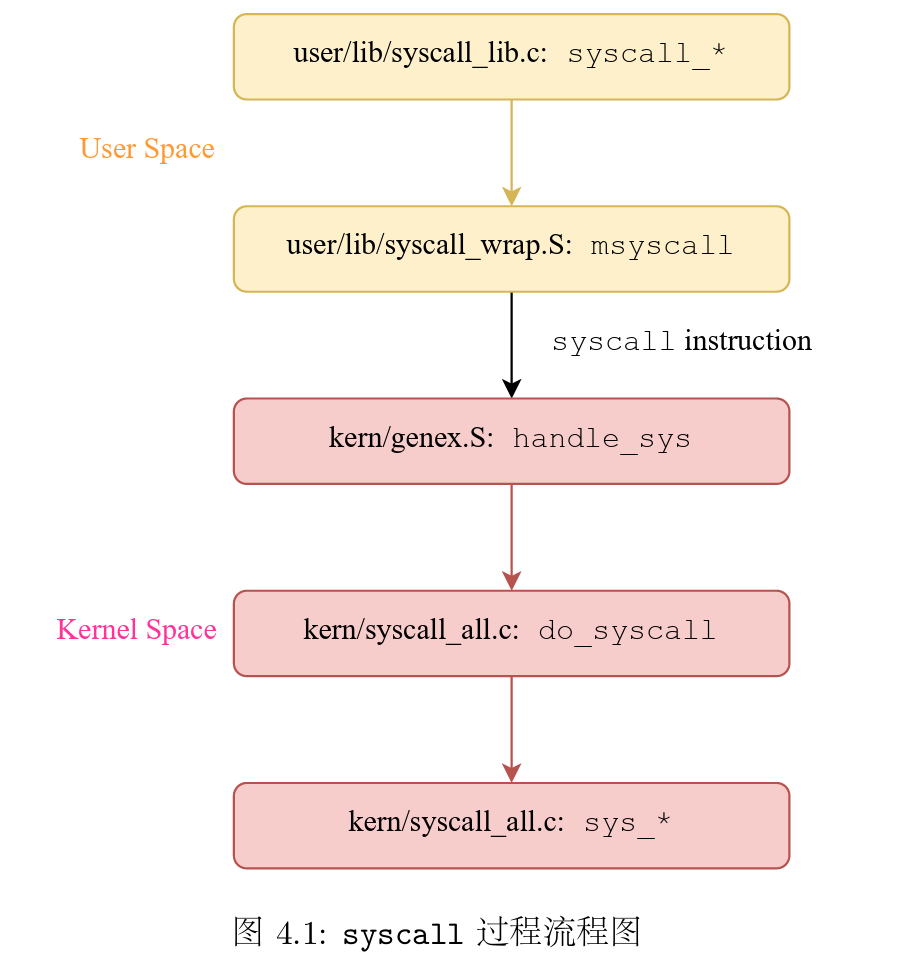
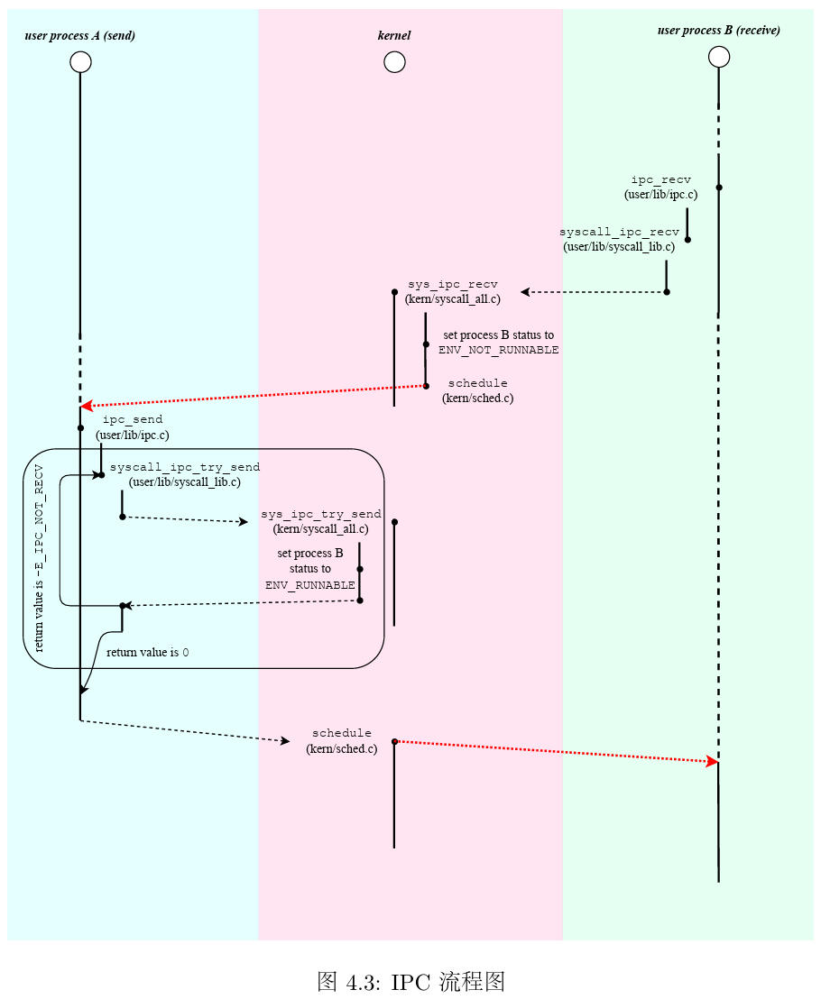
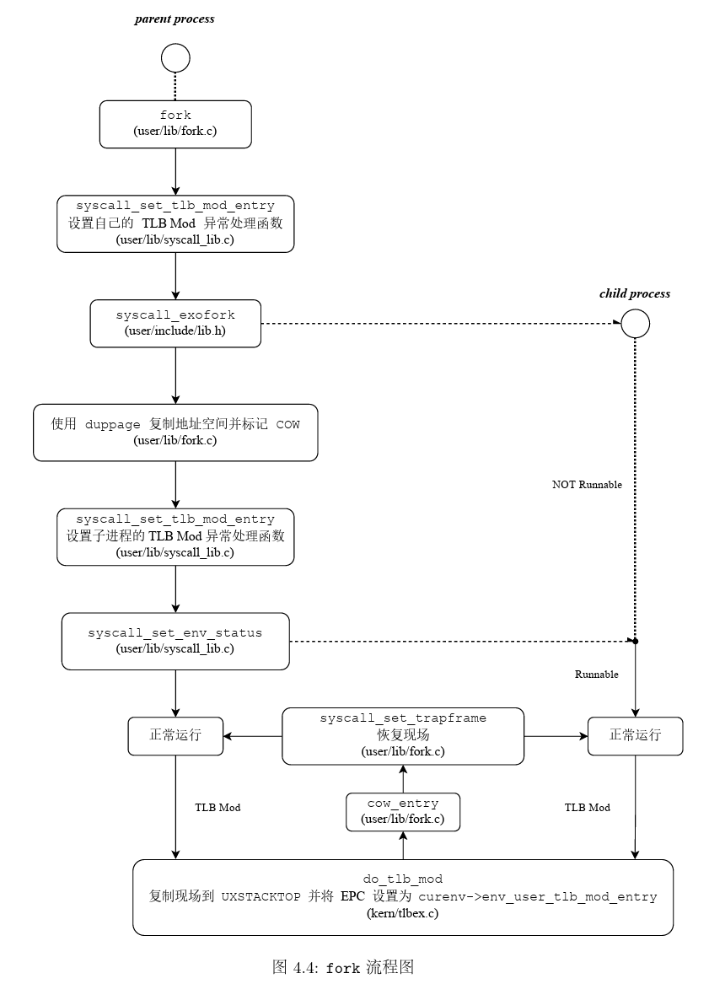
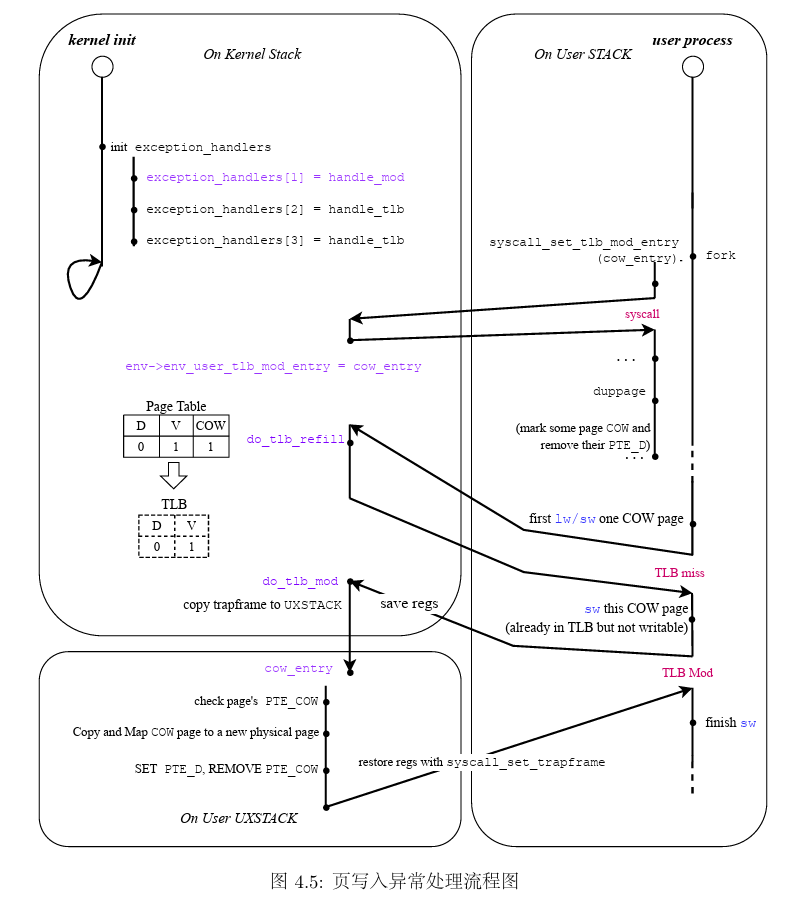

# OS:lab4实验报告

## Thinking 4.1

* **内核在保存现场的时候是如何避免破坏通用寄存器的？**
* 通过执行SAVE_ALL对现场中的所有寄存器进行保存
* **系统陷入内核调用后可以直接从当时的$a0-$a3参数寄存器中得到用户调用msyscall 留下的信息吗？**
* 不可以，a0-a3寄存器中的参数可能会发生改变，在陷入内核时将需要传递的参数保存进了一个Trapframe中，可以从传递的trapframe指针中获取需要的参数
* **我们是怎么做到让sys开头的函数“认为”我们提供了和用户调用msyscall时同样 的参数的？**
* 用户调用时的参数保存进了一个Trapframe中，在do_syscall函数中从传入的trapframe指针中取出传递的参数再传入对应的系统调用处理函数```sys_*```中
* **内核处理系统调用的过程对Trapframe做了哪些更改？这种修改对应的用户态的变化是什么？**
* 在处理系统调用过程中改变了trapframe指针中v0寄存器(返回值寄存器)的值，这个返回值可以标志系统调用是否成功，如果失败则返回对应的错误码

## Thinking 4.2

* **思考 envid2env函数: 为什么 envid2env中需要判断 e->env_id != envid 的情况？如果没有这步判断会发生什么情况？**

* 相关判断代码

  ```c
  	if (e->env_status == ENV_FREE || e->env_id != envid) {
  		return -E_BAD_ENV;
  	}
  ```

  在mkenvid中，envid的生成是通过asid与在envs中的偏移地址得到的，所以可能有envid越界的情况，所以需要判断申请到的env的id是不是等于请求的envid

## Thinking 4.3

* **思考下面的问题，并对这个问题谈谈你的理解：请回顾 kern/env.c 文件 中 mkenvid() 函数的实现，该函数不会返回 0，请结合系统调用和 IPC 部分的实现与 envid2env() 函数的行为进行解释。**

* mkenvid函数不会返回0，故不会有进程的envid为0，而IPC中其他函数有时候需要获取当前进程的PCB，故可以用0作为比较快速的索引

## Thinking 4.4

* **关于 fork 函数的两个返回值，下面说法正确的是**：**C**

   A、fork 在父进程中被调用两次，产生两个返回值

   B、fork 在两个进程中分别被调用一次，产生两个不同的返回值 

   C、fork 只在父进程中被调用了一次，在两个进程中各产生一个返回值

   D、fork 只在子进程中被调用了一次，在两个进程中各产生一个返回值

## Thinking 4.5

* **我们并不应该对所有的用户空间页都使用 duppage 进行映射。那么究竟哪 些用户空间页应该映射，哪些不应该呢？请结合 kern/env.c 中 env_init 函数进行的页 面映射、include/mmu.h 里的内存布局图以及本章的后续描述进行思考。**
* 首先内核部分的页不需要映射，所有进程共享
* 从```UTOP```到```ULIM```之间存储的是内核相关的页表和进程信息，在env_alloc时会使用模版页表boot_pgdir拷贝到进程页表，不需要进行映射
* 从```UTOP```到```USTACKTOP```之间是异常处理栈和无效内存，父子进程不需要共享，不映射
* 只需要映射```USTACKTOP```之下的部分

## Thinking 4.6

* **在遍历地址空间存取页表项时你需要使用到 vpd和 vpt这两个指针，请参 考user/include/lib.h 中的相关定义，思考并回答这几个问题:**

* **vpt 和 vpd 的作用是什么？怎样使用它们？**

  *  vpt和vpd分别为指向用户页表与用户页目录的指针，可以视作数组首地址使用

* 从实现的角度谈一下为什么进程能够通过这种方式来存取自身的页表？ 

  ```c
  #define vpt ((const volatile Pte *)UVPT)
  #define vpd ((const volatile Pde *)(UVPT + (PDX(UVPT) << PGSHIFT)))
  ```

  vpt和vpd分别指向了用户地址空间中页表的首地址和页目录的首地址

* 它们是如何体现自映射设计的？ 

  * vpd的值中对于页目录首地址的计算用到了自映射设计

* 进程能够通过这种方式来修改自己的页表项吗?

  * 不能，用户进程只能对页表项进行访问，而不能对其进行修改

## Thinking 4.7 

* **在 do_tlb_mod 函数中，你可能注意到了一个向异常处理栈复制 Trapframe 运行现场的过程，请思考并回答这几个问题：**
* 这里实现了一个支持类似于“异常重入”的机制,而在什么时候会出现这种“异常重入”？ 
  * 当用户程序试图写入一个COW页，会触发TLB Mod异常，进入相应的异常处理程序，然后调用用户空间的cow_entry函数，若在处理过程中又尝试写入COW页，则再次触发TLB Mod，产生异常重入。
* 内核为什么需要将异常的现场 Trapframe复制到用户空间？
  * MOS内核中，异常处理是在用户态进行的，用户态只能访问kuseg区域内的数据，故需要将异常现场复制到用户空间。

## Thinking 4.8

* **在用户态处理页写入异常，相比于在内核态处理有什么优势？**
* 尽量减少内核出现错误的可能，即使程序崩溃，也不会影响系统的稳定。同时微内核的模式下，用户态进行新页面的分配映射也更加灵活方便。

## Thinking 4.9

* **请思考并回答以下几个问题**
*  为什么需要将 syscall_set_tlb_mod_entry的调用放置在 syscall_exofork之前？
  * 因为这个写时复制的异常处理函数在父进程和子进程中都需要设置，先设置再执行syscall_exofork函数，这样父子进程中的异常处理出口都被设置好。
* 如果放置在写时复制保护机制完成之后会有怎样的效果？
  * 父进程在执行完syscall_exofork之后就返回了，等到写时复制机制完成后再设置的话，父进程的异常处理就不是写时复制了。

## 实验难点分析

> 结合指导书中的流程图进行分析

### 1. 系统调用



* 系统调用是一个从用户态向内核态一层一层传递的过程

* 用户态的调用函数在```user/lib/syscall_lib.c```中，以```syscall_*```命名

* ```syscall_*```函数调用```msyscall```函数(传递需要的参数)进入内核态，其实只有两行代码

  ```assembly
  syscall
  jr $ra
  ```

* 进入内核态后，通过异常分发向量组（8号异常），找到对应的异常处理函数```handle_sys```(```kern/genex.S```)

* 进入内核态后，执行```do_syscall```，根据**系统调用号**找到对应的系统调用```sys_*```进行系统调用

* 换句话说，用户空间中的```syscall_*```与内核空间的```sys_*```是一一对应的

### 2. 进程通信IPC



* 我们实现的IPC机制为比较简单的IPC，**是基于系统调用实现的**
* 在```user/lib/syscall_lib.c```中定义了用户空间进行发送/接受信息的接口
  * 发送信息```syscall_ipc_try_send```
  * 接受信息```syscall_ipc_recv```
* 在内核态```kern/syscall_all.c```中定义了对应的内核调用
  * 发送信息```sys_ipc_try_find```
  * 接受信息```sys_ipc_recv```
* 这里需要注意的是，要进行一次完整成功的信息发送过程，**我们先需要对接受进程进行设置(```sys_ipc_recv```)，然后发送进程再进行发送(```sys_ipc_try_send```)，**进行设置比较重要的几个点
  * ```env_ipc_recving```接受进程是否处于可接受信息状态
  * ```env_ipc_dstva```接受进程如果接收到发送进程发送的页面，应当将该页面映射到的虚拟地址
    * 注：在接受者这里只负责提供地址，在发送过程中进行地址映射(```page_insert```)

### 3.进程创建fork



* **fork只在父进程中被调用一次，父进程和子进程分别返回两个返回值**
  * 子进程返回0
  * 父进程返回子进程的envid
* 首先设置好父进程处理TLB Mod异常的异常处理函数
* 然后调用```syscall_exofork```进行新进程的创建
  * 父进程中```syscall_exofork```返回子进程envid
  * 子进程中返回值保存在trapframe中的返回值寄存器v0
  * **这时子进程的地址空间和异常处理函数等还没被设置好，还不能进行调度，NOT_RUNNABLE**
* 代码难度上最大的一步即为遍历父进程```USTACKTOP```以下的地址空间并将他们映射到子进程
  * 通过```duppage```函数实现
  * 这里的思路是找到映射```USTACKTOP```的页目录项，再去遍历这些页目录项对应的二级页表，这里需要**注意检查页表项对应的页面号是否超过范围**，因为找页目录项时向上取整
* 设置子进程的TLB Mod异常处理函数
* 这时子进程的一切都被设置好，可以进行调度，设置子进程的状态为```RUNNABLE```
* 子进程返回到exofork，返回值为0(保存在trapframe中v0寄存器)，退出fork函数，返回值为0

### 4.COW机制与TLB Mod异常的处理



> 在fork机制中，我们知道，子进程中的环境几乎与父进程相同，如果我们要将父进程中的数据全部复制到子进程并新分配物理页面，会造成很大的开销，父进程中只读的数据例如代码段，父子进程都只会进行读，不必要进行复制，进一步的，对于可写的页面，我们一开始也不进行复制，等到真对它进行写操作了，我们先把他复制一份到子进程中，再进行写，这就是写时复制(Copy-On-Write)机制，可以极大的减少开销

* 为了实现COW机制，我们在TLB中引入一个新的软件中断位COW，对于写时复制机制，我们将他的权限位标记为

  ```c
  PTE_D = 0 && PTE_COW = 1
  ```

* 这样在对该页进行写操作时，会触发TLB Mod异常，此时再检查PTE_COW是否有效，决定是否进行写时复制(```cow_entry```)

* 我们在UCOW处分配一个物理页空间，并将父进程中触发TLB Mod对应的虚拟地址(```cp0->badvaddr```)对应的页复制(memcpy)到该物理页

* 然后将该页与子进程进行映射(```syscall_mem_map```)，父进程解除映射(```syscall_mem_unmap```)

## 实验心得与体会

​	lab4的内容是比较庞杂的，其中需要对用户态和内核态有更深刻的理解。我们的MOS操作系统是基于微内核设计的，我们尽可能地将功能放到用户空间进行处理以保证内核的稳定性，例如对于COW写入异常的处理。在这一次实验中，我们完成了系统调用，进程通信的IPC机制，进程创建的fork机制，在代码编写过程中感到较高的理解难度，梳理尤其是fork阶段的父子进程之间的协作，需要仔细理解。
