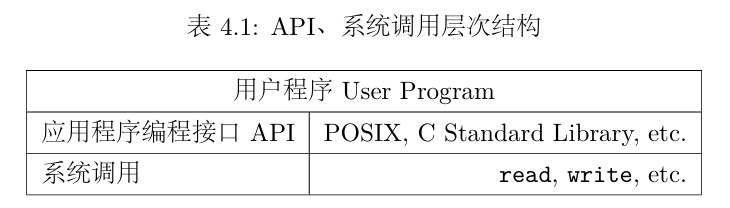
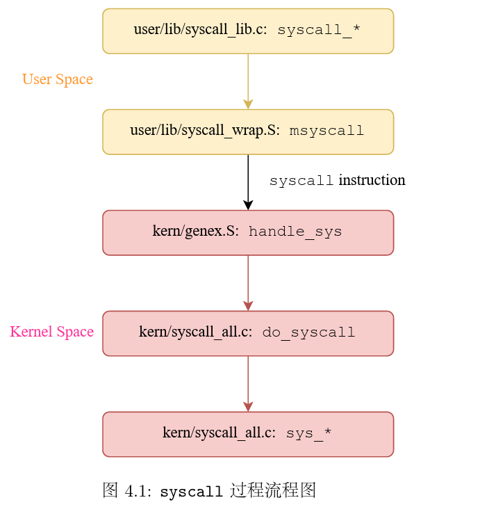
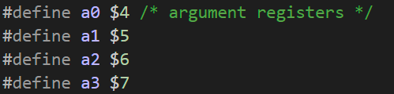
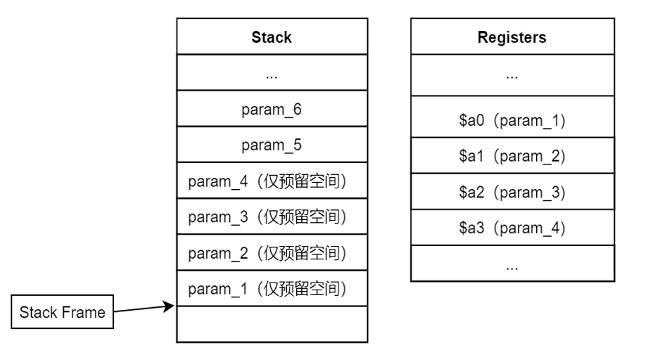
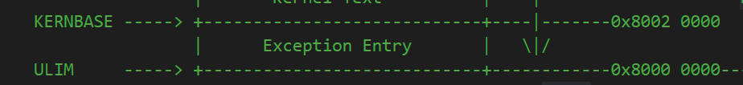
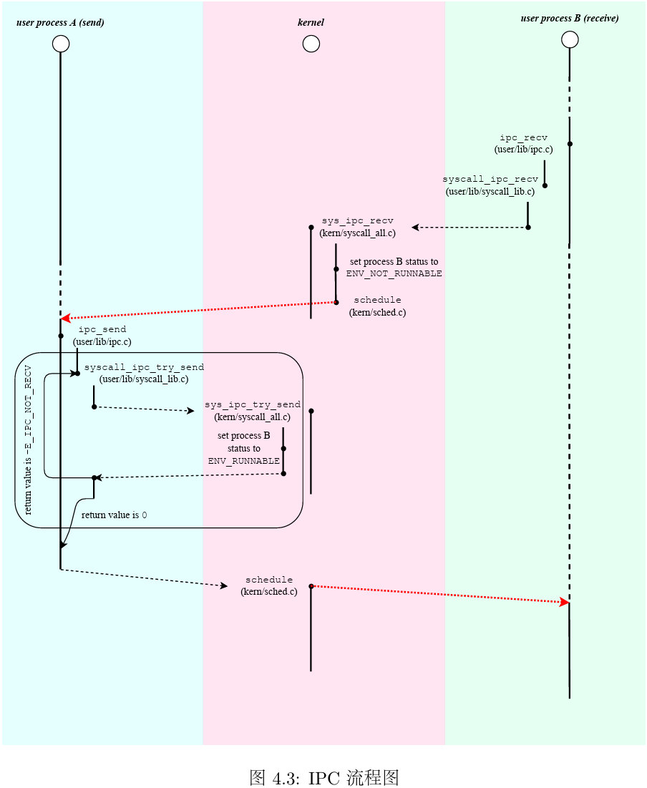
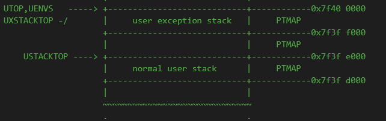
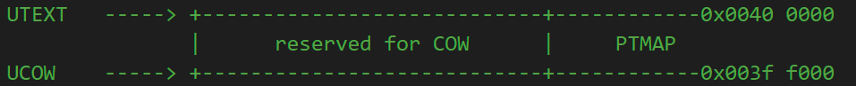

# OS:lab4课下基础

## 1.系统调用

### 1.1 系统调用相关概念

​	在MIPS中，syscall是用于执行系统调用的自陷指令，它使得进程陷入到内核的异常处理程序中，由内核根据系统调用时的上下文执行相应的内核函数，完成相应的功能，并**最终返回到syscall的后一条指令**。

* 存在只能由内核来完成的操作(**读写设备、创建进程、IO**等)
* C标准库中的一些函数的实现依赖于操作系统
* 通过执行syscall指令，用户进程可以陷入到内核态，请求内核提供的服务
* 通过系统调用陷入到内核态时，**需要在用户态与内核态之间进行数据传递与保护**

​	**系统调用保证了系统的安全性**：内核将自己能够提供的服务以系统调用的方式提供给用户空间，用户程序只能将服务相关的参数交予操作系统执行

> API : Application Programming Interface，程序之间的接口
>
> ​	直接使用系统调用较为麻烦，于是产生了一系列用户空间的API定义，他们在系统的调用的基础上，实现了更多更高级的常用功能。用户在编写程序时可以直接调用高层次的API来实现各种功能。
>
> ​	通过层级划分使得程序具有更好的可移植性，只要程序以来的API不变，无论底层的系统调用如何变化，都不会影响
>
> 

### 1.2 系统调用机制的实现

​	异常分发向量组(```exception_handlers```)中的8号异常，即为操作系统处理系统调用时的异常。

> MOS实验代码中，kern目录下即为内核态代码，user目录下即为用户态代码

​	以```user/lib/debugf.c```中的debugf函数来学习处理系统调用的流程(debugf函数是一个debug信息输出函数，进行了**IO方面的系统调用**)

​	debugf函数的调用链为(系统调用请求从用户态向内核态传递)

* debugf调用字符串输出函数debug_output
* debug_output调用了用户空间的```syscall_*```函数(这里的```*```为通配符，代表着用户空间进行系统调用的一组操作，都定义在用户态代码```syscall_lab.c```中，这里调用的是```syscall_print_cons```)
* syscall_```*```函数调用msyscall函数，系统陷入内核态(msyscall是汇编代码，直接调用syscall)。
* 内核态中将异常分发到handle_sys函数，将系统所需信息传递进内核(输出字符串s)

* 内核取得信息，执行对应的内核空间的系统调用函数```sys_*```(```kern/syscall_all.c```)
* 系统调用完成，返回值传递回用户态
* 从系统调用函数返回，回到debugf调用处



> 通过上述描述，对于系统调用的处理实际上是从用户空间向系统空间进行传递的，用户空间中的```syscall_*```函数与内核中的```sys_*```是一一对应的，```syscall_*```函数是用户空间中最接近内核的函数，他调用msyscall中的汇编代码syscall直接陷入内核态，```sys_*```函数是内核中系统调用的具体实现。

​	直接调用syscall陷入内核的msyscall函数具有六个参数，**其中第一个参数是与调用名相似的宏，例如SYS_print_cons，被称为系统调用号(include/syscall.h)，用来区分不同的系统调用**，其余还有五个参数，即为系统调用时需要传递给内核的参数。

> 回忆MIPS函数调用规范中的参数传递，前四个参数保存在寄存器中
>
> 
>
> 

> Exercise 4.1 msyscall
>
> 进行系统调用(syscall)，并返回到msyscall的调用者处(jr)，syscall_*

```assembly
#include <asm/asm.h>

LEAF(msyscall)
	// Just use 'syscall' instruction and return.

	/* Exercise 4.1: Your code here. */
	syscall #陷入内核
	jr ra #返回调用者 syscall_*
END(msyscall)
```

​	通过汇编指令syscall陷入内核态后，处理器将PC寄存器指向一个内核中固定的异常处理入口(见lab3中不同异常处理跳转到的地址)



​	在异常向量表中，系统调用这一异常类型的处理入口为handle_sys函数(kern/genex.S)，实际调用do_syscall(kern/syscall_all.c)函数进行系统调用。

​	**陷入内核态的操作并不是从一个函数跳转到了另一个函数**，代码使用的栈指针$sp是内核空间中的栈指针。系统从用户态切换到内核态后，**首先需要将原用户进程的运行现场保存到内核空间(SAVE_ALL)**，随后的栈指针则指向保存的Trapframe。**我们正是借助这个保存的结构体来获取用户态中传递过来的值，例如```$a0($4)```寄存器保存在内核栈的TF_REG4(sp)处**。当内核在handle_开头的函数(处理对应异常的函数)中**调用实际进行异常处理的C函数时，将这个栈指针作为参数传递给这个C函数，用来获取用户态中的参数**

> Exercise 4.2 do_syscall
>
> Hint：用户态的运行现场保存在一个Trapframe中，这个trapframe的指针传递给内核态中处理异常的函数用来获取用户态进行系统调用所传递的参数

```c
void do_syscall(struct Trapframe *tf) {
	int (*func)(u_int, u_int, u_int, u_int, u_int);
	int sysno = tf->regs[4]; // 系统调用号 
	if (sysno < 0 || sysno >= MAX_SYSNO) {
		tf->regs[2] = -E_NO_SYS;
		return;
	}

	/* Step 1: Add the EPC in 'tf' by a word (size of an instruction). */
	/* Exercise 4.2: Your code here. (1/4) */
	tf->cp0_epc += 4;
	/* Step 2: Use 'sysno' to get 'func' from 'syscall_table'. */
	/* Exercise 4.2: Your code here. (2/4) */
	func = syscall_table[sysno];
	/* Step 3: First 3 args are stored in $a1, $a2, $a3. */
	u_int arg1 = tf->regs[5];
	u_int arg2 = tf->regs[6];
	u_int arg3 = tf->regs[7];

	/* Step 4: Last 2 args are stored in stack at [$sp + 16 bytes], [$sp + 20 bytes]. */
	u_int arg4, arg5;
	/* Exercise 4.2: Your code here. (3/4) */
	arg4 = *(u_long*)(tf->regs[29] + 16);
	arg5 = *(u_long*)(tf->regs[29] + 20);
	/* Step 5: Invoke 'func' with retrieved arguments and store its return value to $v0 in 'tf'.
	 */
	/* Exercise 4.2: Your code here. (4/4) */
	tf->regs[2] = func(arg1,arg2,arg3,arg4,arg5);
}
```

* ```TIPS```

  * tf结构体的结构

    ```c
    struct Trapframe {
    	/* Saved main processor registers. */
    	unsigned long regs[32];
    
    	/* Saved special registers. */
    	unsigned long cp0_status;
    	unsigned long hi;
    	unsigned long lo;
    	unsigned long cp0_badvaddr;
    	unsigned long cp0_cause;
    	unsigned long cp0_epc;
    };
    ```

  * **前四个参数保存在a0(4)-a3(7)寄存器中，后两个参数保存在栈帧中**

  * **sp指针保存在29号通用寄存器中**

  * 返回值保存在v0(2)寄存器

  * 指针转换：

    ```c
    	arg4 = *(u_long*)(tf->regs[29] + 16);
    	arg5 = *(u_long*)(tf->regs[29] + 20);
    ```

    * ```tf->regs + 16```得到一个地址，转换为(u_long*)类型的指针再解引用，取出对应地址的数据

  * **依据系统调用号(保存在a0寄存器中)在系统调用表中找到相应的系统调用处理函数**

    ```c
    void *syscall_table[MAX_SYSNO] = {
        [SYS_putchar] = sys_putchar,
        [SYS_print_cons] = sys_print_cons,
        [SYS_getenvid] = sys_getenvid,
        [SYS_yield] = sys_yield,
        [SYS_env_destroy] = sys_env_destroy,
        [SYS_set_tlb_mod_entry] = sys_set_tlb_mod_entry,
        [SYS_mem_alloc] = sys_mem_alloc,
        [SYS_mem_map] = sys_mem_map,
        [SYS_mem_unmap] = sys_mem_unmap,
        [SYS_exofork] = sys_exofork,
        [SYS_set_env_status] = sys_set_env_status,
        [SYS_set_trapframe] = sys_set_trapframe,
        [SYS_panic] = sys_panic,
        [SYS_ipc_try_send] = sys_ipc_try_send,
        [SYS_ipc_recv] = sys_ipc_recv,
        [SYS_cgetc] = sys_cgetc,
        [SYS_write_dev] = sys_write_dev,
        [SYS_read_dev] = sys_read_dev,
    };
    ```

### 1.3 基础系统调用函数

​	在```kern/syscall_all.c```中定义了一系列基础系统调用，**后续的IPC与fork机制以这些系统调用作为支撑**

#### 1.3.1 sys_mem_alloc

​	```sys_mem_alloc```的主要功能是分配内存，用户程序可以通过这个系统调用给改程序所允许的虚拟内存空间**显式地**分配实际的物理内存，或者说我们编写的程序在内存中申请了一片空间。**对操作系统来说，是一个进程请求将其运行空间中的某段地址与实际物理内存进行映射，从而可以通过该虚拟页面来对物理内存进行存取访问**。

* **内核通过传入的进程标识符envid来确定发出请求的进程**

> Exercise 4.3 envid2env
>
> 通过一个进程的envid获取该进程控制块
>
> Hint：使用宏ENVX()

```c
int envid2env(u_int envid, struct Env **penv, int checkperm) {
	struct Env *e;

	/* Step 1: Assign value to 'e' using 'envid'. */
	/* Hint:
	 *   If envid is zero, set 'penv' to 'curenv' and return 0.
	 *   You may want to use 'ENVX'.
	 */
	/* Exercise 4.3: Your code here. (1/2) */
	if (envid == 0) {
		*penv = curenv;
		return 0;
	}
	e = &envs[ENVX(envid)];
	if (e->env_status == ENV_FREE || e->env_id != envid) {
		return -E_BAD_ENV;
	}

	/* Step 2: Check when 'checkperm' is non-zero. */
	/* Hints:
	 *   Check whether the calling env has sufficient permissions to manipulate the
	 *   specified env, 
	 *   i.e. 'e' is either 'curenv' or its immediate child. i.e.means in other words
	 *   If violated, return '-E_BAD_ENV'.
	 */
	/* Exercise 4.3: Your code here. (2/2) */
	if (checkperm && (e->env_id != curenv->env_id) && (e->env_parent_id != curenv->env_id)) {
		return -E_BAD_ENV;
	}
	/* Step 3: Assign 'e' to '*penv'. */
	*penv = e;
	return 0;
}
```

* 当envid==0，说明是在fork的情景下调用envid2env，父进程fork的返回值为0，则进程即为当前进程或者说父进程
* ```ENVX```是根据进程id获取其在进程数组envs中偏移量的宏
* 关于checkperm检查权限位
  * 当有效时，检查获取的进程控制块是否为当前进程或是当前进程的子进程(fork)

> Exercise 4.4 sys_mem_alloc
>
> 进程请求将其运行空间中的某段地址与实际物理内存进行映射

```c
int sys_mem_alloc(u_int envid, u_int va, u_int perm) {
	struct Env *env;
	struct Page *pp;

	/* Step 1: Check if 'va' is a legal user virtual address using 'is_illegal_va'. */
	/* Exercise 4.4: Your code here. (1/3) */
	if (is_illegal_va(va)) {
		return -E_INVAL;
	}
	/* Step 2: Convert the envid to its corresponding 'struct Env *' using 'envid2env'. */
	/* Hint: **Always** validate the permission in syscalls! */
	/* Exercise 4.4: Your code here. (2/3) */
	try(envid2env(envid,&env,1));
	/* Step 3: Allocate a physical page using 'page_alloc'. */
	/* Exercise 4.4: Your code here. (3/3) */
	try(page_alloc(&pp));
	/* Step 4: Map the allocated page at 'va' with permission 'perm' using 'page_insert'. */
	return page_insert(env->env_pgdir, env->env_asid, pp, va, perm);
}
```

* 检查进程提供的虚拟地址是否合法```is_illegal_va```
* 将进程id转换为进程控制块```envid2env```，这里需要设置checkperm为1，检查取到的进程控制块是否为当前进程的进程控制块
* 分配物理内存```page_alloc```
* 建立虚拟地址与物理地址之间的映射```page_insert```

#### 1.3.2 sys_mem_map

​	**将源进程地址空间中的相应内存映射到目标进程的相应虚拟内存中去，或者说此时两个进程共享同一页物理内存**

> Exercise 4.5 sys_mem_map
>
> Hint：srcenv->dstenv

```c
int sys_mem_map(u_int srcid, u_int srcva, u_int dstid, u_int dstva, u_int perm) {
	struct Env *srcenv;
	struct Env *dstenv;
	struct Page *pp;

	/* Step 1: Check if 'srcva' and 'dstva' are legal user virtual addresses using
	 * 'is_illegal_va'. */
	/* Exercise 4.5: Your code here. (1/4) */
	if (is_illegal_va(srcva) || is_illegal_va(dstva)) {
		return -E_INVAL;
	}
	/* Step 2: Convert the 'srcid' to its corresponding 'struct Env *' using 'envid2env'. */
	/* Exercise 4.5: Your code here. (2/4) */
	try(envid2env(srcid,&srcenv,1));
	/* Step 3: Convert the 'dstid' to its corresponding 'struct Env *' using 'envid2env'. */
	/* Exercise 4.5: Your code here. (3/4) */
	try(envid2env(dstid,&dstenv,1));
	/* Step 4: Find the physical page mapped at 'srcva' in the address space of 'srcid'. */
	/* Return -E_INVAL if 'srcva' is not mapped. */
	/* Exercise 4.5: Your code here. (4/4) */
	pp = page_lookup(srcenv->env_pgdir,srcva,NULL);
	if (!pp) {
		return -E_INVAL;
	}
	/* Step 5: Map the physical page at 'dstva' in the address space of 'dstid'. */
	return page_insert(dstenv->env_pgdir, dstenv->env_asid, pp, dstva, perm);
}
```

* 检查源进程或目标进程的虚拟地址是否合法```is_illegal_va```
* 找到源进程和目标进程的进程控制块```envid```
  * 关于checkperm：需要设置，检查是否为当前进程或当前进程的子进程
* 找到源进程中虚拟地址对应的物理页面的页控制块```page_lookup```
* 将该物理页面建立起与目标进程虚拟地址的映射```page_insert```

#### 1.3.3 sys_mem_unmap

​	**解除某个进程地址空间虚拟内存和物理内存之间的映射关系**

> Exercise 4.6 sys_mem_unmap
>
> Hint：page_remove

```c
int sys_mem_unmap(u_int envid, u_int va) {
	struct Env *e;

	/* Step 1: Check if 'va' is a legal user virtual address using 'is_illegal_va'. */
	/* Exercise 4.6: Your code here. (1/2) */
	if (is_illegal_va(va)) {
		return -E_INVAL;
	}
	/* Step 2: Convert the envid to its corresponding 'struct Env *' using 'envid2env'. */
	/* Exercise 4.6: Your code here. (2/2) */
	try(envid2env(envid,&e,1));
	/* Step 3: Unmap the physical page at 'va' in the address space of 'envid'. */
	page_remove(e->env_pgdir, e->env_asid, va);
	return 0;
}
```

#### 1.3.4 sys_yield

​	**用户进程放弃CPU，调度其他进程**

> Exercise 4.7 sys_yield
>
> Hint：schedule

```c
void __attribute__((noreturn)) sys_yield(void) {
	// Hint: Just use 'schedule' with 'yield' set.
	/* Exercise 4.7: Your code here. */
	schedule(1);
}
```

#### 1.3.5 总结

​	**处理系统调用时，并没有切换地址空间，也不需要将进程上下文保存到进程控制块中，只是切换到内核态下执行一些代码，处理系统调用时内核仍然处于当前进程**

* sys_mem_alloc：为当前进程中的虚拟地址va分配一块物理内存
* sys_mem_map：将源进程地址空间中的地址映射到目标进程地址空间中的地址，或者说两个进程共享同一个物理页
* sys_mem_unmap：解除进程中虚拟地址va与物理内存之间的映射关系
* sys_yield：当前进程放弃CPU，进行进程调度

## 2.进程间通信IPC

> IPC : Inter-Process Communication

​	IPC机制的实现使得系统中的进程之间有了相互传递消息的能力。

​	**所谓通信，最直观的理解就是交换数据**，假如我们能够让一个进程有能力将数据传递给另一个进程，那么进程之间自然具有了相互通信的能力。

​	**由于进程的地址空间之间是相互独立的，要想传递数据，就要想办法把一个地址空间中的东西传给另一个地址空间**

​	**所有的进程都共享同一个内核空间(kseg0)，故要想在不同进程的地址空间之间交换数据，就可以通过内核空间来实现！**

​	发送方进程可以将**数据**以系统调用的形式**存放在进程控制块中**，接收方进程同样以系统调用的方式在进程控制块中找到对应的数据，读取并返回

```c
struct Env {
	// Lab 4 IPC
	u_int env_ipc_value;   // the value sent to us
	u_int env_ipc_from;    // envid of the sender
	u_int env_ipc_recving; // whether this env is blocked receiving
	u_int env_ipc_dstva;   // va at which the received page should be mapped 
	u_int env_ipc_perm;    // perm in which the received page should be mapped
};
```

* ```env_ipc_dstva```接受到的页面需要与自身的哪个虚拟页面完成映射
* ```env_ipc_perm```传递的页面的权限位设置

> Exercise 4.8 sys_ipc_recv
>
> 用于接收消息dst

```c
int sys_ipc_recv(u_int dstva) {
	/* Step 1: Check if 'dstva' is either zero or a legal address. */
	if (dstva != 0 && is_illegal_va(dstva)) {
		return -E_INVAL;
	}

	/* Step 2: Set 'curenv->env_ipc_recving' to 1. */
	/* Exercise 4.8: Your code here. (1/8) */
	curenv->env_ipc_recving = 1;
	/* Step 3: Set the value of 'curenv->env_ipc_dstva'. */
	/* Exercise 4.8: Your code here. (2/8) */
	curenv->env_ipc_dstva = dstva;
	/* Step 4: Set the status of 'curenv' to 'ENV_NOT_RUNNABLE' and remove it from
	 * 'env_sched_list'. */
	/* Exercise 4.8: Your code here. (3/8) */
	curenv->env_status = ENV_NOT_RUNNABLE;
	TAILQ_REMOVE(&env_sched_list,curenv,env_sched_link);
	/* Step 5: Give up the CPU and block until a message is received. */
	((struct Trapframe *)KSTACKTOP - 1)->regs[2] = 0;
	schedule(1);
}
```

* ```env_ipc_recving = 1```允许接收消息
* ```env_ipc_dstva = dstva```：自己要将接受到的页面与dstva进行映射（映射过程在sys_ipc_send中实现，从srcva映射到dstva，故需要先设置好sys_ipc_recving然后再sys_ipc_send）
* 当前进程挂起，从调度队列中移除，放弃CPU进行进程调度，等待消息到来

> Exercise 4.7 sys_ipc_try_send
>
> 用于发送消息src

```c
int sys_ipc_try_send(u_int envid, u_int value, u_int srcva, u_int perm) {
	struct Env *e;
	struct Page *p;

	/* Step 1: Check if 'srcva' is either zero or a legal address. */
	/* Exercise 4.8: Your code here. (4/8) */
	if (srcva != 0 && is_illegal_va(srcva)) {
		return -E_INVAL;
	}
	/* Step 2: Convert 'envid' to 'struct Env *e'. */
	/* This is the only syscall where the 'envid2env' should be used with 'checkperm' UNSET,
	 * because the target env is not restricted to 'curenv''s children. */
	/* Exercise 4.8: Your code here. (5/8) */
	try(envid2env(envid,&e,0));
	/* Step 3: Check if the target is waiting for a message. */
	/* Exercise 4.8: Your code here. (6/8) */
	if (e->env_ipc_recving != 1) {
		return -E_IPC_NOT_RECV;
	}
	/* Step 4: Set the target's ipc fields. */
	e->env_ipc_value = value;
	e->env_ipc_from = curenv->env_id;
	e->env_ipc_perm = PTE_V | perm;
	e->env_ipc_recving = 0;

	/* Step 5: Set the target's status to 'ENV_RUNNABLE' again and insert it to the tail of
	 * 'env_sched_list'. */
	/* Exercise 4.8: Your code here. (7/8) */
	e->env_status = ENV_RUNNABLE;
	TAILQ_INSERT_TAIL(&env_sched_list,e,env_sched_link);
	/* Step 6: If 'srcva' is not zero, map the page at 'srcva' in 'curenv' to 'e->env_ipc_dstva'
	 * in 'e'. */
	/* Return -E_INVAL if 'srcva' is not zero and not mapped in 'curenv'. */
	if (srcva != 0) {
		/* Exercise 4.8: Your code here. (8/8) */
		p = page_lookup(curenv->env_pgdir,srcva,NULL);
		if (!p) {
			return -E_INVAL;
		}
		try(page_insert(e->env_pgdir,e->env_asid,p,e->env_ipc_dstva,perm));
	}
	return 0;
}
```

* 当前进程向envid进程发送消息
  * 由于发送消息并不一定要给自己的子进程，所以**这里是唯一使用envid2env时checkperm=0的情况**
* 检查目标进程是否可以接收消息(env_ipc_recving)
* 清除接收进程的接收状态，将相应数据填入进程控制块
* 传递物理页面的映射关系
  * 找到srcva在当前进程中对应的物理页面pp(每一个进程一个页表)
  * 如果srcva在当前进程地址空间中存在映射，则将该页面插入到接受进程对应虚拟地址dstva处

* 修改接收进程的运行状态为RUNNABLE,插入调度队列重新调度

> src为0，只传value，不传物理页面，只有当src不为0，才建立两个进程的页面映射关系，将发送进程srvac处的页面映射到接收进程dstva处



* 从图中可以看出**IPC机制中的信息发送和接收都是通过系统调用实现**，从用户态代码向内核态代码进行传递(```syscall_*->sys_*```)

## 3.进程创建fork

> lab3中实现了内核通过env_create创建一个进程，实现fork机制可以使一个进程创建一个进程（父进程和子进程）

### 3.1 fork机制

​	在操作系统中，一个进程调用```fork()```函数后，将从此分叉成为两个进程运行，其中新产生的进程称为原进程的**子进程**，原进程称为**父进程**。

​	**在子进程中，fork()调用的返回值为0，父进程中，fork()调用的返回值是子进程的envid**

​	对于操作系统，子进程开始运行时的大部分上下文状态与原进程相同，包括程序和fork前的现场，相比独立的两个进程，父子进程间的通信要方便得多，子进程能够读取原属于父进程的部分数据，父进程可以通过fork返回的子进程id调用其他系统接口控制子进程行为。

* fork之前只有父进程
* fork之后父进程和子进程同时开始执行fork之后的代码段
* fork在不同进程中的返回值不同
* 父进程和子进程很多信息相同但进程控制块不同

### 3.2 写时复制机制COW

​	在调用了fork后，子进程会继承父进程地址空间中的代码段和数据段等内容，但是子进程和父进程为相互独立的两个进程，两个进程对于其内存的修改应该是互不影响的。

​	如果在fork时将父进程地址空间中的内容全部复制到新的物理页，将会消耗大量的物理内存。**在这些物理内存中，如代码段部分，父子进程通常不会其进行写入，对于这样的只读页面我们希望避免对其进行复制，节省物理内存。**

​	引入写时复制机制(```Copy-On-Write```)，**在fork时，将地址空间中所有可写页标记为写时复制页，使得在父进程或子进程对写时复制页面进行写入时，能够产生一种异常，操作系统在处理异常时，为当前试图写入的虚拟地址分配新的物理页面，并赋值原页面的内容，最后返回用户程序。**

​	借助硬件异常来实现写时复制机制，在MIPS中，当程序尝试写入的虚拟页对应的TLB表项没有PTE_D标记时，会触发TLB_Mod异常，陷入内核态。**我们可以将写时复制页面的PTE_D位设为0，当进程尝试写这个页面时，会触发TLB Mod异常**，此时，就可在异常处理函数中，**将虚拟页映射到一个新的物理页，然后将旧的物理页的内容复制到新的物理页，然后再对这个虚拟页进行修改。**

​	引入TLB中新的的软件标记位``PTE_COW``(**即写时复制页面标记为```PTE_D=0 & PTE_COW =1```**)，当触发TLB Mod时，若PTE_COW为1，则进行复制处理。**在进行fork时，需要将所有可以写入的内存页面设置PTE_D = 0 & PTE_COW = 1**。

### 3.3 fork返回值

> fork是一个用户态函数

​	fork函数需要若干个原子的系统调用来完成所期望的功能，其中由syscall_exofork实现新进程的创建，在fork的实现中，我们通过判断syscall_exofork的返回值来决定fork返回值以及后续动作。

* 在返回用户态时，父子进程经历了相同的恢复运行现场的过程
  * 父进程从系统调用中返回时恢复现场
  * 子进程在进程被调度时恢复现场
* 在现场恢复后，父子进程都会从内核返回到msyscall 函数中，而它们的现场中存储的返回值（即$v0寄存器的值）是不同的，这一返回值随后返回到syscall_exofork和fork函数，使得fork函数也可以区别两者。

> Exercise 4.9 sys_exofork

```c
int sys_exofork(void) {
	struct Env *e;

	/* Step 1: Allocate a new env using 'env_alloc'. */
	/* Exercise 4.9: Your code here. (1/4) */
	try(env_alloc(&e,curenv->env_id));
	/* Step 2: Copy the current Trapframe below 'KSTACKTOP' to the new env's 'env_tf'. */
	/* Exercise 4.9: Your code here. (2/4) */
	e->env_tf = *((struct Trapframe*)KSTACKTOP - 1);
	/* Step 3: Set the new env's 'env_tf.regs[2]' to 0 to indicate the return value in child. */
	/* Exercise 4.9: Your code here. (3/4) */
	e->env_tf.regs[2] = 0;
	/* Step 4: Set up the new env's 'env_status' and 'env_pri'.  */
	/* Exercise 4.9: Your code here. (4/4) */
	e->env_status = ENV_NOT_RUNNABLE;
	e->env_pri = curenv->env_pri;
	return e->env_id;
}
```

* 创建一个新进程(分配一个新的进程控制块)
* 复制一份当前进程的运行现场trapframe到子进程的进程控制块
* **系统调用在内核态返回的envid只传递给父进程，对于子进程，则需要将其现场中的v0寄存器(返回值寄存器)修改为0作为子进程的返回值**
* 初始化其他字段

### 3.4 地址空间的准备

​	用户程序在运行时入口会将一个用户空间中的指针变量```struct Env* env```指向当前进程的控制块。**对于fork的子进程，它具有与父进程不同的进程控制块，因此在子进程第一次被调度的时候(此时还是在fork函数中)需要对env指针进行更新，使其仍指向当前进程的控制块。**

* 通过一个系统调用取得自己的envid
* 根据获得的envid，计算对应的进程控制块下标，将对应进程控制块赋给env

​	**父进程需要将地址空间中与子进程共享的页面映射给子进程**，这需要遍历父进程的大部分用户空间页，使用duppage函数完成。

> Exercise 4.10 duppage
>
> 将虚拟页号为vpn的虚拟页映射到子进程(可以快速地用0作为id获取当前进程、父进程)
>
> Hint：对于不同权限位的页使用不同方式进行处理，源进程到目标进程复制:syscall_mem_map

```c
static void duppage(u_int envid, u_int vpn) {
	int r;
	u_int addr;
	u_int perm;

	/* Step 1: Get the permission of the page. */
	/* Hint: Use 'vpt' to find the page table entry. */
	/* Exercise 4.10: Your code here. (1/2) */
	perm = vpt[vpn] & 0xfff; //virtual page table[virtual page number]
	/* Step 2: If the page is writable, and not shared with children, and not marked as COW yet,
	 * then map it as copy-on-write, both in the parent (0) and the child (envid). */
	/* Hint: The page should be first mapped to the child before remapped in the parent. (Why?)
	 */
	/* Exercise 4.10: Your code here. (2/2) */
	addr = vpn * PAGE_SIZE;
	if (!(perm & PTE_D) || (perm & PTE_LIBRARY)) { //实际上包含了 perm & PTE_COW的情况 因为若该页面为写时复制权限，说明已经被fork过一次，即PTE_D=0 & PTE_COW = 1
		syscall_mem_map(0,(void*)addr,envid,(void*)addr,perm);//源进程 源地址 新进程 新地址 
	} else {
		perm = (perm & ! PTE_D) | PTE_COW;
		syscall_mem_map(0,(void*)addr,envid,(void*)addr,perm); // first mapped to the child
		syscall_mem_map(0,(void*)addr,0,(void*)addr,perm);
	}
}
```

* vpn对应的页表项：vpt[vpn]，权限位：低12位
* 修改权限: & + |

### 3.5 页写入异常

​	当用户程序写入在TLB中标记为**不可写入(无TLB_D标记)**的页面时，会发生TLB Mod异常。发生TLB Mod异常后，会跳转到异常向量组中的```handle_mod```函数，之后跳转到```kern/tlbex.c```中的```do_tlb_mod```函数中，这个函数正是处理页写入异常的内核函数，**对于COW页面，我们只需要取消其PTE_D标记即可在他们被写入时触发do_tlb_mod中的处理逻辑。**

​	MOS中对于页写入异常的处理实现在用户空间中。如果需要在用户态下完成页写入异常的处理，**是不能直接使用正常情况下的用户栈的**(发生异常的也可能是正常栈的页面(映射USTACKTOP以下))，需要使用**异常处理栈**来运行处理程序。



​	另外，内核还需要知道进程自身的处理函数所在地址，地址存在env_user_tlb_mod_entry中，需要由父进程通过系统调用设置。

> Exercise 4.11 do_tlb_mod
>
> do_tlb_mod函数负责将当前现场保存到异常处理栈中，并设置a0和EPC寄存器的值，使得从异常恢复后能够以异常处理栈中保存的现场(trapframe)为参数，跳转到env_user_tlb_mod_entry储存的异常处理函数

```c
void do_tlb_mod(struct Trapframe *tf) {
	struct Trapframe tmp_tf = *tf;

	if (tf->regs[29] < USTACKTOP || tf->regs[29] >= UXSTACKTOP) { // 调整栈指针到异常处理栈
		tf->regs[29] = UXSTACKTOP;
	}
	tf->regs[29] -= sizeof(struct Trapframe);
	*(struct Trapframe *)tf->regs[29] = tmp_tf;
	Pte *pte;
	page_lookup(cur_pgdir, tf->cp0_badvaddr, &pte);
	if (curenv->env_user_tlb_mod_entry) {
		tf->regs[4] = tf->regs[29];
		tf->regs[29] -= sizeof(tf->regs[4]);
		// Hint: Set 'cp0_epc' in the context 'tf' to 'curenv->env_user_tlb_mod_entry'.
		/* Exercise 4.11: Your code here. */
		tf->cp0_epc = curenv->env_user_tlb_mod_entry;
	} else {
		panic("TLB Mod but no user handler registered");
	}
}
```

* 首先检查栈指针的位置，**如果不在异常处理栈范围内**，就调整到异常处理栈的栈顶（异常重入）
* 保存当前现场
  * 先向下移动栈指针一个trapframe大小
  * 保存当前现场（指针转换）
* 把当前的trapframe进行复制，进行保存，而后继续使用当前trapframe

> Exercise 4.12 sys_set_tlb_mod_entry
>
> 注册进程自身的页写入异常处理函数

```c
int sys_set_tlb_mod_entry(u_int envid, u_int func) {
	struct Env *env;

	/* Step 1: Convert the envid to its corresponding 'struct Env *' using 'envid2env'. */
	/* Exercise 4.12: Your code here. (1/2) */
	try(envid2env(envid,&env,1));
	/* Step 2: Set its 'env_user_tlb_mod_entry' to 'func'. */
	/* Exercise 4.12: Your code here. (2/2) */
	env->env_user_tlb_mod_entry = func;
	return 0;
}
```

​	页写入异常处理时会返回到用户空间的cow_entry函数

> Exercise 4.13 cow_entry
>
> 处理写时复制异常的异常处理函数 

```c
static void __attribute__((noreturn)) cow_entry(struct Trapframe *tf) {
	u_int va = tf->cp0_badvaddr; // 发生异常的地址
	u_int perm;

	/* Step 1: Find the 'perm' in which the faulting address 'va' is mapped. */
	/* Hint: Use 'vpt' and 'VPN' to find the page table entry. If the 'perm' doesn't have
	 * 'PTE_COW', launch a 'user_panic'. */
	/* Exercise 4.13: Your code here. (1/6) */
	perm = vpt[VPN(va)] & 0xfff;
	if (!(perm & PTE_COW)) { // 检查权限位 ：检查是不是COW页
		user_panic("The permission of the page of va 0x%x doesn't has PTE_COW!",va);
	}
	/* Step 2: Remove 'PTE_COW' from the 'perm', and add 'PTE_D' to it. */
	/* Exercise 4.13: Your code here. (2/6) */
	perm = (perm & !PTE_COW) | PTE_D;
	/* Step 3: Allocate a new page at 'UCOW'. */
	/* Exercise 4.13: Your code here. (3/6) */
	syscall_mem_alloc(0,(void*)UCOW,PTE_D);
	/* Step 4: Copy the content of the faulting page at 'va' to 'UCOW'. */
	/* Hint: 'va' may not be aligned to a page! */
	/* Exercise 4.13: Your code here. (4/6) */
	va = ROUNDDOWN(va,PAGE_SIZE);
	memcpy((void*)UCOW,(const void*)va,PAGE_SIZE);
	// Step 5: Map the page at 'UCOW' to 'va' with the new 'perm'.
	/* Exercise 4.13: Your code here. (5/6) */
	syscall_mem_map(0,(void*)UCOW,0,(void*)va,perm);
	// Step 6: Unmap the page at 'UCOW'.
	/* Exercise 4.13: Your code here. (6/6) */
	syscall_mem_unmap(0,(void*)UCOW);
	// Step 7: Return to the faulting routine.
	int r = syscall_set_trapframe(0, tf);
	user_panic("syscall_set_trapframe returned %d", r);
}
```

* 从内核态中```do_tlb_mod```函数返回时，传递的第一个参数（保存在a0(4号)寄存器中）

  ```c
  // do_tlb_mod
  tf->regs[29] -= sizeof(struct Trapframe);
  *(struct Trapframe *)tf->regs[29] = tmp_tf;
  tf->regs[4] = tf->regs[29];
  ```

  * sp寄存器的位置实际上保存了一个trapframe
  * 1号寄存器中保存了一个trapframe
  * 用户态处理COW异常函数cow_entry接收到第一个参数为这个trapframe

* 传递的trapframe中badvaddr域即为发生COW异常的虚拟地址，可以通过这个地址得到相应的页面并检查权限位

* 在UCOW地址处分配一个新的可写页(PTE_D)，等待复制，注意权限位可写TE_D

  

* ```ROUNDDOWN(va)```实际上是对地址的低12位清0，或者说得到了所在页的首地址

  ```c
  	va = ROUNDDOWN(va,PAGE_SIZE);
  	memcpy((void*)UCOW,(const void*)va,PAGE_SIZE);
  ```

  * 将发生错误的页复制到UCOW新页

* 将虚拟地址映射到UCOW新页，当前进程解除映射

  ```c
  syscall_mem_map(0,(void*)UCOW,0,(void*)va,perm);
  syscall_mem_unmap(0,(void*)UCOW);
  ```

* 当前进程的trapframe设为tf

  ```c
  int r = syscall_set_trapframe(0, tf);
  ```

> Exercise 4.14 sys_set_env_status
>
> 父进程将子进程的状态设置为status

```c
int sys_set_env_status(u_int envid, u_int status) {
	struct Env *env;

	/* Step 1: Check if 'status' is valid. */
	/* Exercise 4.14: Your code here. (1/3) */
	if (status != ENV_RUNNABLE && status != ENV_NOT_RUNNABLE) {
		return -E_INVAL;
	}
	/* Step 2: Convert the envid to its corresponding 'struct Env *' using 'envid2env'. */
	/* Exercise 4.14: Your code here. (2/3) */
	try(envid2env(envid,&env,1));
	/* Step 3: Update 'env_sched_list' if the 'env_status' of 'env' is being changed. */
	/* Exercise 4.14: Your code here. (3/3) */
	if (env->env_status != status) {
		if (status == ENV_RUNNABLE) { //加入调度队列
			TAILQ_INSERT_TAIL(&env_sched_list,env,env_sched_link);
		} else { // 从调度队列取出
			TAILQ_REMOVE(&env_sched_list,env,env_sched_link);
		}
	}
	/* Step 4: Set the 'env_status' of 'env'. */
	env->env_status = status;
	return 0;
}
```

> Exercise 4.15 fork : final!

```c
int fork(void) {
	u_int child;
	u_int i;

	/* Step 1: Set our TLB Mod user exception entry to 'cow_entry' if not done yet. */
	if (env->env_user_tlb_mod_entry != (u_int)cow_entry) {
		try(syscall_set_tlb_mod_entry(0, cow_entry));
	}

	/* Step 2: Create a child env that's not ready to be scheduled. */
	// Hint: 'env' should always point to the current env itself, so we should fix it to the
	// correct value.
	child = syscall_exofork();
	if (child == 0) {
		env = envs + ENVX(syscall_getenvid());
		return 0; // 子进程在此返回 
	}

	/* Step 3: Map all mapped pages below 'USTACKTOP' into the child's address space. */
	// Hint: You should use 'duppage'.
	/* Exercise 4.15: Your code here. (1/2) */
	for (i = 0;i < PDX(ROUND(USTACKTOP,PDMAP));i++) {
		if (vpd[i] & PTE_V) {
			for (u_int j = 0;j < 1024;j++) {
				u_int vpn = (i << 10) | j;
				if ((vpn < VPN(USTACKTOP) && (vpt[vpn] & PTE_V))) {
					duppage(child,vpn);
				}
			}
		}
	}
	/* Step 4: Set up the child's tlb mod handler and set child's 'env_status' to
	 * 'ENV_RUNNABLE'. */
	/* Hint:
	 *   You may use 'syscall_set_tlb_mod_entry' and 'syscall_set_env_status'
	 *   Child's TLB Mod user exception entry should handle COW, so set it to 'cow_entry'
	 */
	/* Exercise 4.15: Your code here. (2/2) */
	syscall_set_tlb_mod_entry(child,cow_entry);
	syscall_set_env_status(child,ENV_RUNNABLE);
	return child;
}
```

* 首先设置好处理COW异常的异常处理函数

  ```c
  e-env_user_tlb_mod_entry = cow_entry
  ```

* 创建新进程，这里通过syscall_exofork实现

  ```
  child = syscall_exofork();
  ```

  * 即从这一行往后会有两个进程执行以下代码段

  * 父进程的返回值在```syscall_exofork```中显示地指出来，为子进程的envid

  * 子进程由于处于NOT_RUNNABLE状态，他的返回值被保存到trapframe中的返回值寄存器v0(2号)中，等到被调度时（父进程把他设置为RUNNABLE后），返回0，进入下方判断返回

    ```c
    	if (child == 0) {
    		env = envs + ENVX(syscall_getenvid());
    		return 0; // 子进程在此返回 
    	}
    ```

* 最重要的一步就是遍历USTACKTOP以下的页面并从父进程地址空间映射到子进程地址空间，下面进行仔细分析

  ```c
  	for (i = 0;i < PDX(ROUND(USTACKTOP,PDMAP));i++) {
  		if (vpd[i] & PTE_V) {
  			for (u_int j = 0;j < 1024;j++) {
  				u_int vpn = (i << 10) | j;
  				if ((vpn < VPN(USTACKTOP) && (vpt[vpn] & PTE_V))) {
  					duppage(child,vpn);
  				}
  			}
  		}
  	}
  ```

  * 已知只需要对USTACKTOP以下的地址空间进行映射，已经有页映射工具duppage，duppage函数会区分页权限进行操作

  * 宏```PDMAP```一个页目录项映射到的地址空间大小(4MB)

  * 宏```ROUND```相当于向上取整，

    ```c
    ROUND(USTACKTOP,PDMAP)
    ```

    * 即USTACKTOP以下的地址空间至少需要多少个页目录项才能映射完整

  * 宏```PDX```找到虚拟地址对应的页目录偏移量

  * 宏vpd是当前进程页目录数组的指针，即为首地址

  * 然后在每个页目录项对应的二级页表中进行遍历

    ```c
    for (u_int j = 0;j < 1024;j++) {
    	u_int vpn = (i << 10) | j;
    	if ((vpn < VPN(USTACKTOP) && (vpt[vpn] & PTE_V))) {
    		duppage(child,vpn);
    	}
    }
    ```

    * 回顾二级页表地址结构```PDX(10bits) + PTX(10bits) + OFFSET(12bits)```
    * 这里需要对得到的虚拟页号**进行检查，因为我们在取页表项时，为了保证所取到的页表项完整的映射了USTACKTOP以下的地址范围，进行了向上取整，有可能最后一个页目录项(4MB)对应的二级页表中有页表项对应的页面超过了USTACKTOP**
    * 对于符合地址范围且有效的页面映射到子进程中

* 设置子进程的异常处理函数，状态，子进程可以被进行调度

* 父进程返回子进程的envid


