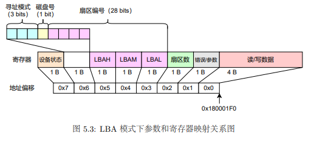

# OS:lab5实验报告

## Thinking 5.1

* **如果通过 kseg0 读写设备，那么对于设备的写入会缓存到 Cache 中。这是 一种错误的行为，在实际编写代码的时候这么做会引发不可预知的问题。请思考：这么做 这会引发什么问题？对于不同种类的设备（如我们提到的串口设备和IDE磁盘）的操作会 有差异吗？可以从缓存的性质和缓存更新的策略来考虑**
* 当外部设备自身更新数据时，如果此时CPU写入外设的数据仍然保留在Cache中，而没有被及时写入到设备，则缓存的数据会在外设自身更新后再写入外设，发生错误
* 串口设备读写频繁，而IDE磁盘读写频率相对较小，因此串口设备发生错误的概率要远大于IDE磁盘

## Thinking 5.2 

* **查找代码中的相关定义，试回答一个磁盘块中最多能存储多少个文件控制 块？一个目录下最多能有多少个文件？我们的文件系统支持的单个文件最大为多大？**

* 一个磁盘块的大小为4KB，一个文件控制块的大小为256B，故能存储16个
* 一个目录文件最多可以使用1024个磁盘块存储文件控制块，故最多有16384个文件
* 一个文件最多使用1024个磁盘块存储数据，1024*4KB=4MB

## Thinking 5.3

* **请思考，在满足磁盘块缓存的设计的前提下，我们实验使用的内核支持的最大磁盘大小是多少？**

* 块缓存的地址空间大小为```DISKMAX```即```0x4000_0000```页即为1GB大小
* 故实验支持的的最大磁盘大小为1GB

## Thinking 5.4

* **在本实验中，fs/serv.h、user/include/fs.h 等文件中出现了许多宏定义， 试列举你认为较为重要的宏定义，同时进行解释，并描述其主要应用之处**

* 比较重要的一个宏定义是FILE_STRUCT_SIZE

  ```c
  #define FILE_STRUCT_SIZE 256
  ```

* 这个宏定义指出了file结构体的大小

* 在f_pad域对file结构体空闲空间进行补全时用到，让整数个结构体占用一个磁盘块

## Thinking 5.5

* **在Lab4“系统调用与fork”的实验中我们实现了极为重要的fork函数。那 么fork前后的父子进程是否会共享文件描述符和定位指针呢？请在完成上述练习的基础上 编写一个程序进行验证。**

* 一个进程所有的文件描述符都存储在`[FDTABLE, FILEBASE)`这一地址空间中。在`fork`函数执行时，会将KSTACKTOP以下的地址空间复制到子进程地址空间中，因此`fork`前后的父子进程会共享文件描述符和定位指针。

## Thinking 5.6

* **请解释File,Fd,Filefd结构体及其各个域的作用。比如各个结构体会在哪些过程中被使用，是否对应磁盘上的物理实体还是单纯的内存数据等。说明形式自定，要 求简洁明了，可大致勾勒出文件系统数据结构与物理实体的对应关系与设计框架**
* 给出以上三种结构体的定义以及解释

  ```c
  struct File {
  	char f_name[MAXNAMELEN]; // 文件名
  	uint32_t f_size;	 // 文件的大小
  	uint32_t f_type;	 // 文件类型
  	uint32_t f_direct[NDIRECT]; // 存储的直接磁盘块号
  	uint32_t f_indirect; // 存储的间接磁盘块号，其中保存间接指向的磁盘块号
  
  	struct File *f_dir; // 文件的目录，只有在内存中有效
  	char f_pad[FILE_STRUCT_SIZE - MAXNAMELEN - (3 + NDIRECT) * 4 - sizeof(void *)];
  } __attribute__((aligned(4), packed));  // 填充剩余空间，只保存整数个文件结构体
  
  // file descriptor
  struct Fd {
  	u_int fd_dev_id; // 文件对应的设备id
  	u_int fd_offset; // 文件指针指向的位置(在设备中的偏移量)
  	u_int fd_omode; // 文件打开模式(open mode)
  };
  
  // file descriptor + file
  struct Filefd {
  	struct Fd f_fd; // 文件描述符结构体
  	u_int f_fileid; // 文件id,表示文件在opentab中的位置
  	struct File f_file; //文件控制块
  };
  ```

* Fd结构体主要用于记录已经打开的文件的状态，便于用户直接使用文件描述符对文件进行操作和申请服务。由于文件描述符主要是为用户所用，因此它对应的是磁盘映射到内存中的数据。

* Filefd结构体：文件描述符中存储的数据毕竟是有限的，有时候我们需要将```Fd*```强制转换为```Filefd*```来获取文件控制块(File结构体)，从而获取文件更多信息

* File结构体中主要是记录了文件的各种信息，例如名字/类型/大小/数据存储的直接磁盘块和间接磁盘块等

## Thinking 5.7

* **图 5.9 中有多种不同形式的箭头，请解释这些不同箭头的差别，并思考我们 的操作系统是如何实现对应类型的进程间通信的**

  

* ```ENV_CREATE(user_env)```和```ENV_CREATE(fs_serv)```都是异步消息，由```init()```发出创建消息后，```init()```函数即可返回执行后续步骤，由```fs```和```user```进程执行自己的初始化工作

* ```fs```初始化```serv_init()```和```fs_init()```完成后，进入```serv()```函数，被```ipc_receive()```函数阻塞为```ENV_NOT_RUNNABLE```，知道收到```user```进程的```ipc_send(fsreq)```被唤醒

* ```user```进程向```fs```进程```ipc_send(fsreq)```发送请求为同步消息，发送后自身进入阻塞```ENV_NOT_RUNNABLE```，等待被唤醒的fs进程服务结束时```ipc_send(dst_va)```，用户进程接收到数据后继续运行，```fs```进程再次进入阻塞，等待下次被用户唤醒

## 实验难点总结

​	lab5中涉及到的内容主要涉及以下三个部分

* 外部存储设备驱动
* 文件系统结构
* 文件系统的用户接口

​	可以用一张图来概括


### 1.外部存储设备驱动

#### 1.1 内存映射MMIO

​	外设通过读写设备上的寄存器来进行数据通信，**外设寄存器也称为I/O端口**，主要用来访问I/O设备。**外设寄存器通常包括控制寄存器、状态寄存器和数据寄存器。**这些寄存器被映射到指定的**物理地址空间**。

​	实验中统一使用内存映射I/O模型，**在MIPS的内核地址空间中kseg0和kseg1段实现了硬件级别的物理地址和内核虚拟地址的转换。**

​	对kseg1段地址的读写不经过MMU映射，且不使用Cache,故在实验中在编写设备驱动时，将物理地址转换为kseg1段的虚拟地址(加上kseg1偏移量)

​	对设备的读写操作：```syscall_write_dev```和```syscall_read_dev```

​	在代码编写的过程中调用了```ioread/write8()/ioread/write16()/ioread/write32()```等函数进行指定大小的读写。

​	代码编写过程中需要注意的是对地址范围的检查以及使用**先将地址转换为对应类型的指针再解引用取出对应类型的数据**的取数据方法。

#### 1.2 IDE磁盘结构和操作

​	实验中我们使用一块磁盘，LBA模式进行扇区寻址，扇区编号有28位，最多可以寻址$2^{28}$个扇区。



#### 1.3 编写磁盘驱动程序

* **将外设寄存器物理地址加上kseg1偏移量映射到kseg1段内核虚拟地址**

​	设备驱动主要需要编写```ide_read```和```ide_write```函数，其中通过系统调用完成了读取/写入外设，即调用了帮手函数```syscall_read_dev```和```syscall_write_dev```。读写磁盘的过程如图所示


### 2. 文件系统结构

#### 2.1 磁盘文件系统布局


* 第一个磁盘块为引导扇区和分区表
* 第二个磁盘块为超级块，描述文件系统的基本信息：魔数、磁盘大小、根目录位置

​	**在文件系统中，我们使用位图法来管理空闲的磁盘资源，用一个二进制位表示磁盘中一个磁盘块的使用情况。**

​	在fs.c中实现free_block函数，即把位图中该磁盘对应的标志位置为1，同时需要检查磁盘号是否符合范围。

#### 2.2 文件系统详细结构

​	在这一节中，需要重点理解文件控制块(FCB)，```user/include/fs.h```

```c
struct File {
	char f_name[MAXNAMELEN]; // filename
	uint32_t f_size;	 // file size in bytes
	uint32_t f_type;	 // file type
	uint32_t f_direct[NDIRECT];
	uint32_t f_indirect;

	struct File *f_dir; // the pointer to the dir where this file is in, valid only in memory.
	char f_pad[FILE_STRUCT_SIZE - MAXNAMELEN - (3 + NDIRECT) * 4 - sizeof(void *)];
} __attribute__((aligned(4), packed));
```

* ```f_direct[NDIRECT]```是文件的直接指针，每个文件控制块有10个直接指针，指向10块磁盘，40KB
* ```f_indirect```是文件的间接指针，指向一个磁盘，该磁盘中存储间接指向的磁盘号(实验中只有一级间接)
* ```f_dir```指向文件所在的目录


​	对于文件内容上

* 普通文件的文件内容是他所对应的数据块
* 目录文件的文件内容是目录下各个文件的文件控制块FCB

​	```tools/fsformat.c```中实现了将文件和目录按照文件系统格式写入磁盘的功能，要求自行实现```create_file```

为目录下的文件分配一个文件控制块，这段代码和理论结合的很紧密，**我们知道，文件目录中的内容是目录下文件的文件控制块**，这段代码的主要思路是遍历文件目录对应的所有磁盘块(**注意区分磁盘号来判断是直接磁盘块还是间接磁盘块**)，在每个磁盘块中遍历File结构体，这里又是一个巧妙的指针转换```struct File *```，如果下属的结构体有空闲的(名字为空)，则分配该文件控制块；如果没有新分配一块并与目录建立链接(```make_link_block```)。

```c
struct File *create_file(struct File *dirf) {
	int nblk = dirf->f_size / BLOCK_SIZE;
	for (int i = 0; i < nblk; ++i) {
		int bno; 
		if (i < NDIRECT) {
			bno = dirf->f_direct[i];
		} else {
			bno = ((uint32_t *)disk[dirf->f_indirect].data)[i];
		}
		struct File *blk = (struct File *)(disk[bno].data);
		for (struct File *f = blk; f < blk + FILE2BLK; ++f) {
			if (f->f_name[0] == '\0') {
				return f;
			}
		}
	}
	return (struct File *)disk[make_link_block(dirf, nblk)].data;
}
```

#### 2.3 块缓存

> MOS中文件系统是一个用户进程，有4GB地址空间

​	将文件进程地址空间中DISKMAP到DISKMAP+DISKMAX一段的地址空间作为缓存区。


* fs.c中disk_addr函数计算指定磁盘块对应的虚拟地址(DISKMAP + SIZE * blocknumber)
* **磁盘块中内容载入到内存时，需要为之分配对应的物理内存；结束使用这一磁盘块时，需要释放对应的物理内存以回收资源**，通过map/unmap_block实现。
  * syscall_mem_alloc
  * syscall_mem_unmap

* ```file_get_block```函数用于将某个指定的文件指向的磁盘块读入内存
* ```dir_lookup```函数查找某个目录下是否存在指定的文件


### 3. 文件系统的用户接口

> 个人认为这一部分理解难度最高

#### 3.1 文件描述符

​	文件描述符(```File Discripter```)是系统给用户提供的整数，用于其在描述符表(```Discriptor Table```)中进行索引。我们在作为操作系统的使用者进行文件I/O编程时，**使用open在描述符表的指定位置存放被打开文件的信息；使用close将描述符表中指定位置的文件信息释放；在write和read时修改文件描述符表中对应表项的文件信息**

​	在用户进程试图打开一个文件时，文件系统服务进程需要一个文件描述符来存储文件的基本信息和用户进程中关于文件的状态。**同时，文件描述符也起到描述用户对于文件操作的作用，当用户进程向文件系统进程发送打开文件的请求时，文件系统进程会将这些基本信息记录在内存中，然后由操作系统将用户进程请求的地址映射到同一个存储了文件描述符的物理页上。**当用户进程获取了文件大小等基本信息后，再次向文件系统发送请求将文件内容映射到指定内存空间中。

​	以user/lib/file.c中的open函数为例，体会打开文件的过程。

* open函数中传入了一个绝对路径，表示要打开的文件
* 首先为要打开的文件分配一个文件描述符(```fd_alloc```)
* 然后使用IPC机制打开文件```fsipc_open```，获取该文件(路径)对应的文件描述符
  * fsipc_open对应着枚举类型```FSREQ_OPEN```的文件系统进程请求
  * 调用fs_ipc进行请求的发送
    * ipc_send
    * ipc_recv

* 利用返回的fd，提取出基本信息，size等
* 利用```fsipc_map```将需要的文件内容从文件进程的地址空间映射到用户进程地址空间

​	当需要读取大文件中间的一小部分内容时，希望从前一次读写完毕的位置开始，因此需要维护一个文件中的定位指针。在文件中进行read,write,seek操作时，维护指针```fd_offset```。

```c
int read(int fdnum, void *buf, u_int n) {
	int r;
	struct Dev *dev;
	struct Fd *fd;
	if ((r = fd_lookup(fdnum, &fd)) < 0 || (r = dev_lookup(fd->fd_dev_id, &dev)) < 0 ) {
		return r;
	}

	if ((fd->fd_omode & O_ACCMODE) == O_WRONLY) {
		return -E_INVAL;
	}
	r = dev->dev_read(fd, buf, n, fd->fd_offset);
	if (r > 0) {
		fd->fd_offset += r;
	}
	return r;
}
```

#### 5.2 文件系统服务

​	文件系统进程中的服务通过IPC的形式供其他进程调用，进行文件读写操作。

* ipc_send
* ipc_recv


> 上图可以展示出前一小节中的调用层次关系

* 文件系统的请求如下

  ```c
  enum {
  	FSREQ_OPEN,
  	FSREQ_MAP,
  	FSREQ_SET_SIZE,
  	FSREQ_CLOSE,
  	FSREQ_DIRTY,
  	FSREQ_REMOVE,
  	FSREQ_SYNC,
  	MAX_FSREQNO,
  };
  ```

* file.c是用户操作文件的接口
  * open
    * fsipc_open
* fsipc.c中定义了请求文件系统服务的IPC操作
  * fsipc_action
    * fsipc
      * ipc_send
      * ipc_recv
* fs/serv.c中定义了文件系统进程响应IPC的函数
  * serve_action
    * file_action：定义在fs/fs.c中


## 实验心得与体会

​	在lab5中，我们实现了一个简单的文件系统。我们首先实现了IDE磁盘驱动，我们使用MMIO内存映射机制将各种外设例如console，IDE磁盘等外设寄存器映射到kseg1段，另外复习了磁盘的物理结构，在此基础上选择LBA机制进行了磁盘驱动程序的编写。在文件系统结构方面，我们首先学习了磁盘文件系统布局，而后学习了块缓存等机制。在本次实验中，在文件系统的用户接口内容后代码理解难度上升，需要细致理解。

