# OS:lab5课下基础

## 1. 文件系统概述

​	**计算机文件系统是一种存储和组织数据的方法，便于访问和查找数据。**文件系统使用**文件**和**树形目录**的逻辑抽象屏蔽了底层硬盘和光盘等**物理设备基于数据块**进行存储和访问的复杂性。

* **即用户不必关心数据实际保存在硬盘/光盘的哪个数据块上，而只需要记住这个文件所属的目录和文件名。**

* **在写入新数据之前，用户不必关心硬盘上哪个块是空闲的，硬盘上的存储空间管理(分配/释放)由文件系统自动完成，用户只需记住数据写入到了哪个文件**

​	常见的文件系统通常基于硬盘和光盘等块存储设备，并维护文件在设备中的物理位置。

​	广义上，**一切带标识的、在逻辑上有完整意义的字节序列都可以称为文件**，文件系统将外部设备中的资源抽象为文件，从而可以统一管理外部设备，实现对数据的存储、组织、访问和修改。

## 2. 文件系统的设计与实现

> MOS是一种微内核设计
>
> * 将传统操作系统的文件系统移出内核
> * 将一些内核数据暴露到用户空间
> * 将传统操作系统的设备驱动移出内核

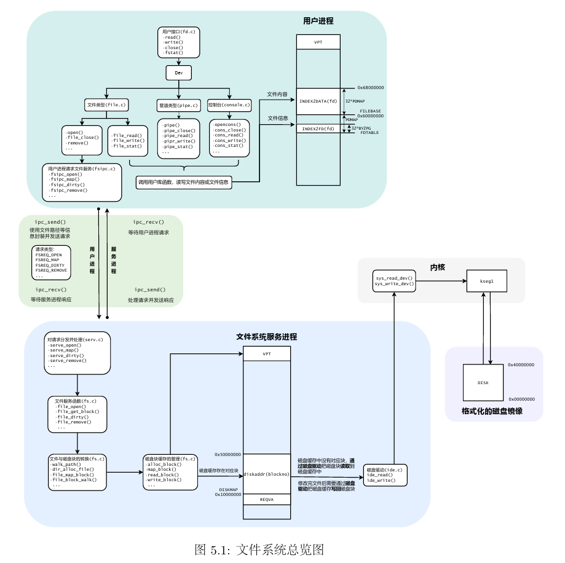

## 3. IDE磁盘驱动

​	为了在磁盘等外部设备上实现文件系统，我们必须为这些外部设备编写驱动程序。(MOS已经在```kern/mechine.c```中实现了一个简单的控制台驱动程序)

​	本次要实现的硬盘驱动程序与已经实现的串口驱动都采用MMIO内存映射技术，并且本次编写的**硬盘驱动程序完全运行在用户空间(微内核)**。

### 3.1 内存映射I/O(MMIO)

​	几乎每一种外设都是通过读写设备上的寄存器来进行数据通信，外设寄存器也称为**I/O接口**，主要用来访问I/O设备。

* 外设寄存器主要包括控制寄存器、状态寄存器、数据寄存器，这些寄存器被**映射到指定的物理地址空间**

​	在MIPS的内核地址空间中(kseg0/kseg1)实现了**硬件级别(高位清0)的物理地址和内核虚拟地址的转换机制**，其中，对于kseg1段地址的读写不经过MMU映射，且不使用高速缓存，这正是外部设备驱动所需要的。**我们可以通过简单地读写某些固定的内核虚拟地址来实现驱动程序的功能。**

> 在之前的实验中，我们曾经使用KADDR宏将一个物理地址转换为kseg0段的虚拟地址，即加上kseg0段的偏移量(0x8000_0000)

​	**在编写设备驱动时，我们需要将物理地址转换为kseg1段的内核虚拟地址，即给物理地址加上kseg1的偏移值0xA000_0000**

​	以已经编写完成的串口设备驱动为例，MALTA提供的console设备基地址为0x1800_03F8，设备寄存器映射如表所示

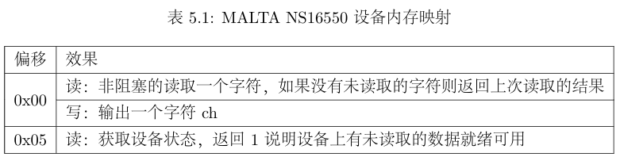

​	例如写操作：通过向kseg1段的地址写入字符，就能在shell中看到对应的输出。

> kseg0_offset + device_op_addr_base = KSEG1 + MALTA_SERIAL_DATA

```c
//写
void printcharc(char ch) {
    //...
	*((volatile uint8_t *)(KSEG1 + MALTA_SERIAL_DATA)) = ch;
}
```

​	在本次实验中，我们需要编写的IDE磁盘驱动位于用户空间，**用户态进程若是直接读写内核虚拟地址会引发一个地址错误ADEL/S，故对于设备的读写必须通过系统调用实现**

* ```sys_write_dev```：写设备系统调用
* ```sys_read_dev```：读设备系统调用

> Exercise 5.1 kern/syscall.c中的sys_write_dev以及sys_read_dev

```c
int sys_write_dev(u_int va, u_int pa, u_int len) {
	/* Exercise 5.1: Your code here. (1/2) */
	if (is_illegal_va_range(va, len)) {
		return -E_INVAL;
	} 
	if (!((pa >= MALTA_IDE_BASE && pa + len < MALTA_IDE_BASE + 0x8) || (pa >= MALTA_SERIAL_BASE && pa + len < MALTA_SERIAL_BASE + 0x20))) {
		return -E_INVAL;
	}
	if (len == 1) {
		iowrite8(*(uint8_t *)va,(u_long)pa);
	} else if (len == 2) {
		iowrite16(*(uint16_t *)va,(u_long)pa);
	} else if (len == 4) {
		iowrite32(*(uint32_t *)va,(u_long)pa);
	} else {
		return -E_INVAL;
	}
	return 0;
}

int sys_read_dev(u_int va, u_int pa, u_int len) {
	/* Exercise 5.1: Your code here. (2/2) */
		if (is_illegal_va_range(va, len)) {
		return -E_INVAL;
	} 
	if (!((pa >= MALTA_IDE_BASE && pa + len < MALTA_IDE_BASE + 0x8) || (pa >= MALTA_SERIAL_BASE && pa + len < MALTA_SERIAL_BASE + 0x20))) {
		return -E_INVAL;
	}
	if (len == 1) {
		*(uint8_t *) va = ioread8((u_long)pa);
	} else if (len == 2) {
		*(uint16_t *) va = ioread16((u_long)pa);
	} else if (len == 4) {
		*(uint32_t *) va = ioread32((u_long)pa);
	} else {
		return -E_INVAL;
	}
	return 0;
}
```

* 这里在读写虚拟地址对应的数据时涉及到对虚拟地址对应数据的读写（先转换为指针类型再解引用）

> Exercise 5.2 user/lib/syscall_lib.c中完成用户态的相应系统调用的接口
>
>  （msyscall中直接调用syscall陷入内核）

```c
int syscall_write_dev(void *va, u_int dev, u_int size) {
	/* Exercise 5.2: Your code here. (1/2) */
	return msyscall(SYS_write,va,dev,size);
}

int syscall_read_dev(void *va, u_int dev, u_int size) {
	/* Exercise 5.2: Your code here. (2/2) */
	return msyscall(SYS_read,va,dev,size);
}
```

### 3.2 IDE磁盘

#### 3.2.1 磁盘物理结构

* 磁盘的物理结构

  * 扇区(sector)：磁盘盘片被划分为很多扇形的区域，这些区域叫做扇区。**扇区是磁盘执行读写操作的单位，一般是512字节**
  * 磁道(track)：盘片上以盘片中心为圆心，**不同大小的同心圆**
  * 柱面(cylinder)：硬盘中，**不同盘面相同半径的磁道组成的圆柱面**
  * 磁头(head)：每个磁盘有两个面，**每个面都有一个磁头**，当对磁盘进行读写操作时，磁头在盘面上快速移动

  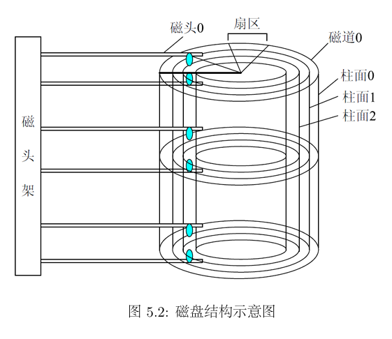

#### 3.2.2 IDE 磁盘操作

​	**扇区(sector)是磁盘读写的基本单位**，通过读写MALTA上PIIX4的特定寄存器，我们可以实现以扇区为最小单元的读写。MALTA平台上PIIX4磁盘控制器的基地址为0x1800_01f0，**其I/O相关寄存器相对于该地址的偏移和对应的功能如下表**

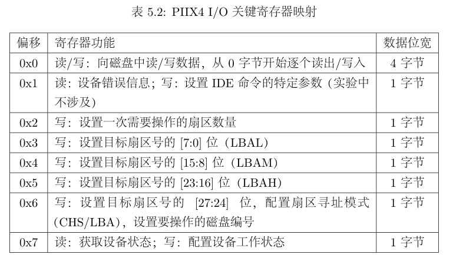

> 在include/malta.h中定义了关于这些偏移量的宏定义
>
> ```c
> #define MALTA_IDE_BASE (MALTA_PCIIO_BASE + 0x01f0)
> #define MALTA_IDE_DATA (MALTA_IDE_BASE + 0x00)
> #define MALTA_IDE_ERR (MALTA_IDE_BASE + 0x01)
> #define MALTA_IDE_NSECT (MALTA_IDE_BASE + 0x02)
> #define MALTA_IDE_LBAL (MALTA_IDE_BASE + 0x03)
> #define MALTA_IDE_LBAM (MALTA_IDE_BASE + 0x04)
> #define MALTA_IDE_LBAH (MALTA_IDE_BASE + 0x05)
> #define MALTA_IDE_DEVICE (MALTA_IDE_BASE + 0x06)
> #define MALTA_IDE_STATUS (MALTA_IDE_BASE + 0x07)
> #define MALTA_IDE_LBA 0xE0
> #define MALTA_IDE_BUSY 0x80
> #define MALTA_IDE_CMD_PIO_READ 0x20  /* Read sectors with retry */
> #define MALTA_IDE_CMD_PIO_WRITE 0x30 /* write sectors with retry */
> ```

​	在MOS中我们可以挂载编号为0/1的两块IDE磁盘，但实际上我们只使用到编号为0的一块磁盘。

​	对于磁盘寻址，我们可以按照柱面-磁头-扇区(```Cylinder-Head-Sector, CHS```)的方式来定位一个扇区。这种寻址方式符合磁盘的物理结构。

​	由于CHS模式下不方便进行寻址，**因此在实验中我们使用逻辑块寻址（Logical Block Addressing, LBA）的方式来进行扇区寻址。**在LBA模式下，IDE设备将磁盘看做一个线性的字节序列，每个扇区都有一个唯一的编号，只需要设置目标扇区编号，就可以完成磁盘的寻址。

​	**在我们的实验中，扇区编号有28位，因此最多可以寻址$2^{28}$个扇区，即128GB磁盘空间。**

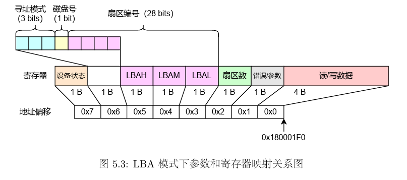

#### 3.2.3 驱动程序编写

​	当我们在磁盘的指定位置读取或写入一个扇区时，需要调用read_sector函数**将磁盘中对应的扇区的数据读到设备缓冲区**中，或write_sector函数**将缓冲区中的数据写入磁盘**。

​	**磁盘操作中，所有的地址操作都需要将物理地址转换为虚拟地址**，磁盘设备的基地址对应在kseg1的内核虚拟地址为0xb80_01f0。读取流程如下图

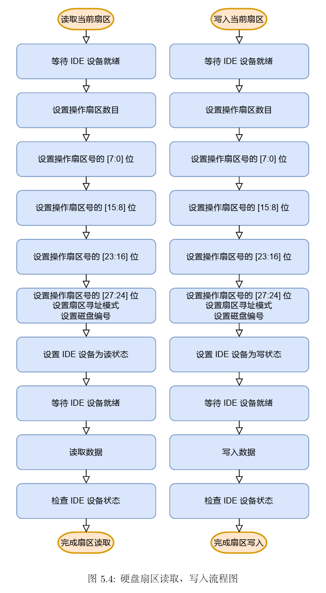

​	由上图，在磁盘读写的过程中，我们需要反复检查IDE设备是否已经就绪。因此我们构建了一个检查IDE状态的帮手函数```wait_ide_ready```（用户态函数），用于等待IDE上的操作就绪。

```c
static uint8_t wait_ide_ready() {
	uint8_t flag;
	while (1) {
		panic_on(syscall_read_dev(&flag, MALTA_IDE_STATUS, 1));
		if ((flag & MALTA_IDE_BUSY) == 0) {
			break;
		}
		syscall_yield();
	}
	return flag;
}
```

​	当IDE就绪后，就可以对他进行读写操作了。

* 首先设置操作扇区的数目，我们只操作一个扇区，因此设置为1
* 接下来一次设置操作扇区号，**本实验中的IDE设备无法一次性写入28位扇区号，因此需要单独设置扇区号的各位**，在设置[27:24]位时，还需要同时设置扇区寻址模式和磁盘编号。

* 再次等待IDE设备就绪
* **通过系统调用读取或写入扇区**：本实验中IDE设备每次仅能读取或写入4字节，因此需要通过一个循环完成整个扇区的读取或写入，即连续相相同的地址读取或写入4字节

​	读取扇区：```read_sector```，读取diskno号磁盘上的secno号扇区到dst指向的地址。

​	写入扇区：```write_sector```，将src指向的一个扇区的数据写入到diskno号磁盘的secno号扇区。

> Exercise 5.3 fs/ide.c ide_read ide_write 实现用户态下对磁盘的读写操作

```c
void ide_read(u_int diskno, u_int secno, void *dst, u_int nsecs) {
	uint8_t temp;
	u_int offset = 0, max = nsecs + secno;
	panic_on(diskno >= 2);

	// Read the sector in turn
	while (secno < max) {
		temp = wait_ide_ready();
		// Step 1: Write the number of operating sectors to NSECT register
		temp = 1;
		panic_on(syscall_write_dev(&temp, MALTA_IDE_NSECT, 1));

		// Step 2: Write the 7:0 bits of sector number to LBAL register
		temp = secno & 0xff;
		panic_on(syscall_write_dev(&temp, MALTA_IDE_LBAL, 1));

		// Step 3: Write the 15:8 bits of sector number to LBAM register
		/* Exercise 5.3: Your code here. (1/9) */
		temp = (secno >> 8) & 0xff;
		panic_on(syscall_write_dev(&temp, MALTA_IDE_LBAM, 1));
		// Step 4: Write the 23:16 bits of sector number to LBAH register
		/* Exercise 5.3: Your code here. (2/9) */
		temp = (secno >> 16) & 0xff;
		panic_on(syscall_write_dev(&temp, MALTA_IDE_LBAH, 1));
		// Step 5: Write the 27:24 bits of sector number, addressing mode
		// and diskno to DEVICE register
		temp = ((secno >> 24) & 0x0f) | MALTA_IDE_LBA | (diskno << 4);
		panic_on(syscall_write_dev(&temp, MALTA_IDE_DEVICE, 1));

		// Step 6: Write the working mode to STATUS register
		temp = MALTA_IDE_CMD_PIO_READ;
		panic_on(syscall_write_dev(&temp, MALTA_IDE_STATUS, 1));

		// Step 7: Wait until the IDE is ready
		temp = wait_ide_ready();

		// Step 8: Read the data from device
		for (int i = 0; i < SECT_SIZE / 4; i++) {
			panic_on(syscall_read_dev(dst + offset + i * 4, MALTA_IDE_DATA, 4));
		}

		// Step 9: Check IDE status
		panic_on(syscall_read_dev(&temp, MALTA_IDE_STATUS, 1));

		offset += SECT_SIZE;
		secno += 1;
	}
}

void ide_write(u_int diskno, u_int secno, void *src, u_int nsecs) {
	uint8_t temp;
	u_int offset = 0, max = nsecs + secno;
	panic_on(diskno >= 2);

	// Write the sector in turn
	while (secno < max) {
		temp = wait_ide_ready();
		// Step 1: Write the number of operating sectors to NSECT register
		/* Exercise 5.3: Your code here. (3/9) */
		temp = 1;
		panic_on(syscall_write_dev(&temp, MALTA_IDE_NSECT, 1));

		// Step 2: Write the 7:0 bits of sector number to LBAL register
		/* Exercise 5.3: Your code here. (4/9) */
		temp = secno & 0xff;
		panic_on(syscall_write_dev(&temp, MALTA_IDE_LBAL, 1));

		// Step 3: Write the 15:8 bits of sector number to LBAM register
		/* Exercise 5.3: Your code here. (5/9) */
		temp = (secno >> 8) & 0xff;
		panic_on(syscall_write_dev(&temp, MALTA_IDE_LBAM, 1));

		// Step 4: Write the 23:16 bits of sector number to LBAH register
		/* Exercise 5.3: Your code here. (6/9) */
		temp = (secno >> 16) & 0xff;
		panic_on(syscall_write_dev(&temp, MALTA_IDE_LBAH, 1));

		// Step 5: Write the 27:24 bits of sector number, addressing mode
		// and diskno to DEVICE register
		/* Exercise 5.3: Your code here. (7/9) */
		temp = ((secno >> 24) & 0x0f) | MALTA_IDE_LBA | (diskno << 4);
		panic_on(syscall_write_dev(&temp, MALTA_IDE_DEVICE, 1));

		// Step 6: Write the working mode to STATUS register
		/* Exercise 5.3: Your code here. (8/9) */
		temp = MALTA_IDE_CMD_PIO_WRITE;
		panic_on(syscall_write_dev(&temp, MALTA_IDE_STATUS, 1));

		// Step 7: Wait until the IDE is ready
		temp = wait_ide_ready();

		// Step 8: Write the data to device
		for (int i = 0; i < SECT_SIZE / 4; i++) {
			/* Exercise 5.3: Your code here. (9/9) */
			panic_on(syscall_write_dev(src + offset + i * 4, MALTA_IDE_DATA, 4));
		}

		// Step 9: Check IDE status
		panic_on(syscall_read_dev(&temp, MALTA_IDE_STATUS, 1));

		offset += SECT_SIZE;
		secno += 1;
	}
}
```

## 4. 文件系统结构

### 4.1 磁盘文件系统布局

​	如下图

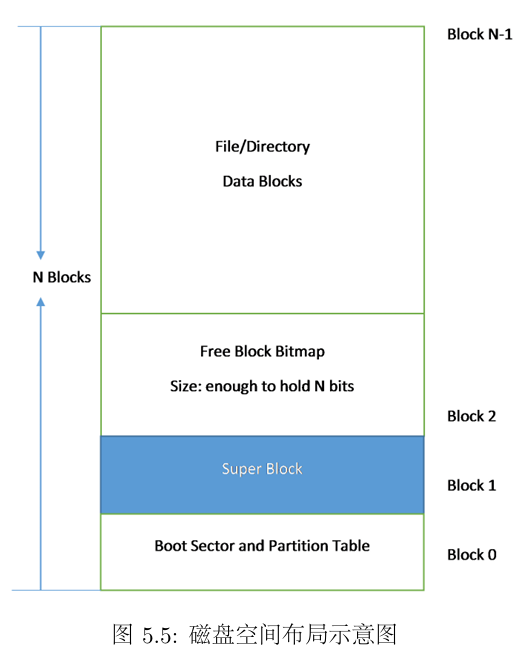

​	图中出现的Block是磁盘块。**不同于扇区，磁盘块是一个虚拟概念，是操作系统与磁盘交互的最小单位，操作系统将相邻的扇区组合在一起，形成磁盘块进行整体操作**，减小了扇区过多带来的寻址困难，**磁盘块的大小由操作系统决定**，一般由2的幂次个扇区构成；而扇区是真实存在的，是磁盘读写的基本单位，**与操作系统无关**。

​	MOS操作系统把磁盘**最开始的一个磁盘块(4096字节)当做引导扇区和分区表**使用，接下来的一个磁盘块为超级块(```Super Block```)，用来表述**文件系统的基本信息**，如Magic Number、磁盘大小以及根目录的位置。

​	MOS中超级块以结构体的方式进行定义

```c
struct Super {
    u_int s_magic; // magic number : FS_MAGIC
    u_int s_nblocks; // total number of blocks on disk (1024)
    struct File s_root; // root dictionary node
}
```

> 不同于lab2/lab3中使用**空闲链表法**管理空闲内存资源和进程控制块，在文件系统中我们使用**位图**来管理空闲的磁盘资源

​	在文件系统中，我们使用位图法来管理空闲的磁盘资源，用一个二进制位bit标识磁盘中的一个磁盘块的使用情况(**1表示空闲，0表示占用**)。

​	```tools/fsformat.c```中定义了创建文件系统镜像的工具，其中init_disk函数将所有的磁盘块都标记为空闲块（**tools文件夹下的程序都是运行在linux环境中，而不是MOS**）

```c
void init_disk() {
	int i, diff;

	// Step 1: Mark boot sector block.
	disk[0].type = BLOCK_BOOT;

	// Step 2: Initialize boundary.
	nbitblock = (NBLOCK + BLOCK_SIZE_BIT - 1) / BLOCK_SIZE_BIT;
	nextbno = 2 + nbitblock;

	// Step 2: Initialize bitmap blocks.
	for (i = 0; i < nbitblock; ++i) {
		disk[2 + i].type = BLOCK_BMAP;
	}
	for (i = 0; i < nbitblock; ++i) {
		memset(disk[2 + i].data, 0xff, BLOCK_SIZE);
	}
	if (NBLOCK != nbitblock * BLOCK_SIZE_BIT) {
		diff = NBLOCK % BLOCK_SIZE_BIT / 8;
		memset(disk[2 + (nbitblock - 1)].data + diff, 0x00, BLOCK_SIZE - diff);
	}

	// Step 3: Initialize super block.
	disk[1].type = BLOCK_SUPER;
	super.s_magic = FS_MAGIC;
	super.s_nblocks = NBLOCK;
	super.s_root.f_type = FTYPE_DIR;
	strcpy(super.s_root.f_name, "/");
}
```

* nbitblock表示为了用位图标识整个磁盘上所有块的使用情况所需要的**磁盘块的(bitblock)的数量**

  ```c
  nbitblock = (NBLOCK + BLOCK_SIZE_BIT - 1) / BLOCK_SIZE_BIT;
  ```

  * 这个表达式实际上具有一个整数除法向上取整的效果
  * NBLOCK：磁盘块的数量：1024
  * BLOCK_SIZE_BIT：每个磁盘块的bit大小：4096 * 8

* disk[0]与disk[1]我们有特殊作用，不进行Bitmap初始化故遍历从disk[i+2]开始

* 将所有位图块的每一位都设为1，表示处于空闲状态

  ```c
  	for (i = 0; i < nbitblock; ++i) {
  		memset(disk[2 + i].data, 0xff, BLOCK_SIZE);
  	}
  ```

* 如果位图还有剩余，**不能将最后一个位图块中的靠后一部分内容标记为空闲，因为这些磁盘块实际上并不存在**，是不可使用的。因此还要将这些剩下的部分设为0

  ```c
  	if (NBLOCK != nbitblock * BLOCK_SIZE_BIT) {
  		diff = NBLOCK % BLOCK_SIZE_BIT / 8;
  		memset(disk[2 + (nbitblock - 1)].data + diff, 0x00, BLOCK_SIZE - diff);
  	}
  ```

​	相应的，在MOS操作系统中，文件系统也需要根据位图来判断和标记磁盘的使用情况。fs/fs.c中的block_is_free函数就用来通过位图中的特定位来判断指定的磁盘块是否被占用。

```c
int block_is_free(u_int blockno) {
	if (super == 0 || blockno >= super->s_nblocks) {
		return 0;
	}

	if (bitmap[blockno / 32] & (1 << (blockno % 32))) {
		return 1;
	}

	return 0;
}
```

* 这里的super是指向磁盘中```Super Block```的指针，指针值为0，**即为零指针，没有存储任何内存地址的指针**

* **这里简单对bitmap涉及到的数据结构进行解释**

  * bitmap定义为

    ```c
    uint32_t *bitmap;
    ```

    我们可以把他看做一个32位int类型的数组看待

  * 这样我们的**位图实际上是一个二维的结构**，每一个数组元素相当于一行，一行中有32个元素

  * 行号：```blockno / 32``` | 列号 : ```blockno % 32```

  * 检查二维结构中对应的位置是否为1

> Exercise 5.4 free_block
>
> 回收一个磁盘块，更改bitmap图中的标志位为1

```c
void free_block(u_int blockno) {
	// You can refer to the function 'block_is_free' above.
	// Step 1: If 'blockno' is invalid (0 or >= the number of blocks in 'super'), return.
	/* Exercise 5.4: Your code here. (1/2) */
	if (blockno == 0 || blockno >= super->s_nblocks) {
		return;
	}
	// Step 2: Set the flag bit of 'blockno' in 'bitmap'.
	// Hint: Use bit operations to update the bitmap, such as b[n / W] |= 1 << (n % W).
	/* Exercise 5.4: Your code here. (2/2) */
	bitmap[blockno / 32] |= 1 << (blockno % 32);
}
```

### 4.2 文件系统详细结构

​	MOS操作系统中使用文件控制块(File结构体)管理文件。

```c
struct File {
	char f_name[MAXNAMELEN]; // filename; max length is 128
	uint32_t f_size;	 // file size in bytes
	uint32_t f_type;	 // file type
	uint32_t f_direct[NDIRECT];
	uint32_t f_indirect;

	struct File *f_dir; // the pointer to the dir where this file is in, valid only in memory.
	char f_pad[FILE_STRUCT_SIZE - MAXNAMELEN - (3 + NDIRECT) * 4 - sizeof(void *)];
} __attribute__((aligned(4), packed));
```

* ```f_type```：普通文件/目录

* ```f_direct[NDIRECT]```：文件的直接指针，每个文件控制块设有10个直接指针，**用来记录文件的数据块在磁盘上的位置**，每个磁盘块的大小为4KB，**也就是说这10个直接指针能表示最大为40KB的文件**

* ```f_indirect```：文件的间接指针，当文件的大小超过40KB时，**f_indirect指向一个间接磁盘块，用来存储指向文件内容的磁盘块的指针**(为了简化计算，我们不使用间接磁盘块的前10个指针)

  > MOS 中只有一级间接指针域，实际的操作系统中往往是多级的，这是一种简化

*  ```f_dir```指向文件所属的文件目录
* ```f_pad```为了让整数个文件结构体占用一个磁盘块，填充结构体(256字节)中剩下的字节

​	**对普通的文件来说，其指向的磁盘块存储着文件内容，而对于目录文件来说，其指向的磁盘块存储着各个文件对应的文件控制块。**

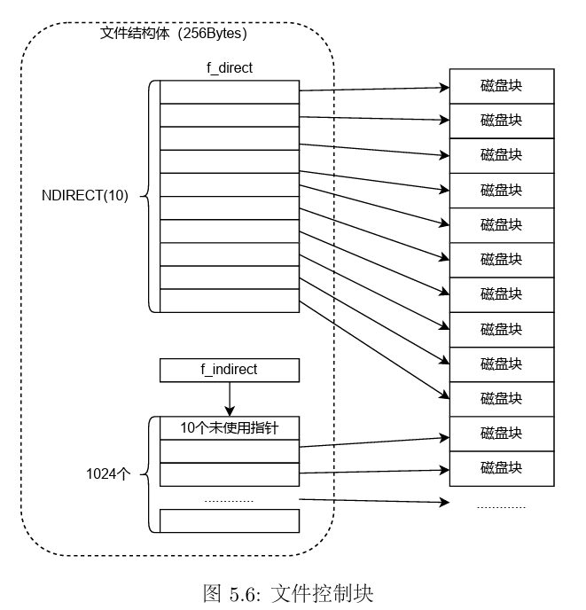

* 当我们要查找某个文件时
  * 首先从超级块中读取根目录的文件控制块
  * 然后沿着目标路径，挨个查看当前目录所包含的文件是否与下一级目标文件同名
  * 找到最终文件

> ps : 有关镜像文件
>
> * 所谓镜像文件其实就是将特定的一系列文件按照一定的格式制作成单一的文件(类似于压缩包)
> * 例如操作系统、游戏等，最大的特点是可以被特定的软件识别并直接刻录到光盘上

​	我们通过fsformat(tools/fsformat.c编译而来)程序来创建一个磁盘镜像文件``target/fs.img``。通过观察头文件和tools/Makefile，我们发现fsformat.c的编译过程与其他文件有所不同，**其使用的是Linux下的gcc编译器，而非交叉编译器**，编译生成的fsformat运行于Linux宿主机上，专门用于创建磁盘镜像文件。**生成的镜像文件fs.img可以模拟与真实的磁盘文件设备的交互。**

> Exercise 5.5 file_create
>
> 为目录中增加一个文件(文件控制块)

```c
struct File *create_file(struct File *dirf) {
	int nblk = dirf->f_size / BLOCK_SIZE;

	// Step 1: Iterate through all existing blocks in the directory.
	for (int i = 0; i < nblk; ++i) {
		int bno; // the block number
		// If the block number is in the range of direct pointers (NDIRECT), get the 'bno'
		// directly from 'f_direct'. Otherwise, access the indirect block on 'disk' and get
		// the 'bno' at the index.
		/* Exercise 5.5: Your code here. (1/3) */
		if (i < NDIRECT) {
			bno = dirf->f_direct[i];
		} else {
			bno = ((uint32_t *)disk[dirf->f_indirect].data)[i];
		}
		// Get the directory block using the block number.
		struct File *blk = (struct File *)(disk[bno].data);

		// Iterate through all 'File's in the directory block.
		for (struct File *f = blk; f < blk + FILE2BLK; ++f) {
			// If the first byte of the file name is null, the 'File' is unused.
			// Return a pointer to the unused 'File'.
			/* Exercise 5.5: Your code here. (2/3) */
			if (f->f_name[0] == '\0') {
				return f;
			}
		}
	}

	// Step 2: If no unused file is found, allocate a new block using 'make_link_block' function
	// and return a pointer to the new block on 'disk'.
	/* Exercise 5.5: Your code here. (3/3) */
	return (struct File *)(disk[make_link_block(dirf, nblk)].data);
}
```

* 如果当前目录下有空闲的文件控制块就使用空闲的，没有就新分配一个
* 首先计算当前目录下有多少个磁盘块，对应的块号通过区分NDIRECT查找
  * **在查询块号时需要注意一个小点：在块号大于10时，我们需要到间接磁盘中查询，我们的块号是32位的，而磁盘中数据的存储格式(disk[].data是一个4096B大小的每个元素为1字节大小的数组)，因此我们不能直接用i做索引，这样只能取出一个一字节大小的数据，我们需要把数组类型转换为32位，((uint32_t *)disk[].data)[i]**
* 然后通过块号拿到对应的磁盘块，遍历磁盘块中存储的所有文件控制块，如果文件名为空，即为空闲，返回该文件控制块
* 如果没有就新分配一个磁盘块并返回(``make_link_block``)

> 请阅读tools/fsformat.c 和fs/Makefile，掌握如何将文件和目录按照文件系统的格式写入磁盘，了解文件系统结构的 具体细节，学会添加自定义文件进入磁盘镜像。

​	fsformat.c中将文件系统写入磁盘的主函数如下，该函数对文件类型做了区分，是目录或是普通文件。

```c
int main(int argc, char **argv) {
	static_assert(sizeof(struct File) == FILE_STRUCT_SIZE);
	init_disk();

	if (argc < 3) {
		fprintf(stderr, "Usage: fsformat  [files or directories]...\n");
		exit(1);
	}

	for (int i = 2; i < argc; i++) {
		char *name = argv[i];
		struct stat stat_buf;
		int r = stat(name, &stat_buf);
		assert(r == 0);
		if (S_ISDIR(stat_buf.st_mode)) {
			printf("writing directory '%s' recursively into disk\n", name);
			write_directory(&super.s_root, name);
		} else if (S_ISREG(stat_buf.st_mode)) {
			printf("writing regular file '%s' into disk\n", name);
			write_file(&super.s_root, name);
		} else {
			fprintf(stderr, "'%s' has illegal file mode %o\n", name, stat_buf.st_mode);
			exit(2);
		}
	}

	flush_bitmap();
	finish_fs(argv[1]);

	return 0;
}
```

>  需要注意的是，在以下两个功能函数中，我们使用到了用户编程的POSIX接口	

​	在以上代码中，将目录写入磁盘镜像的功能函数为```write_directory```

```c
void write_directory(struct File *dirf, char *path) {
	DIR *dir = opendir(path);
	if (dir == NULL) {
		perror("opendir");
		return;
	}
	struct File *pdir = create_file(dirf);
	strncpy(pdir->f_name, basename(path), MAXNAMELEN - 1);
	if (pdir->f_name[MAXNAMELEN - 1] != 0) {
		fprintf(stderr, "file name is too long: %s\n", path);
		// File already created, no way back from here.
		exit(1);
	}
	pdir->f_type = FTYPE_DIR;
	for (struct dirent *e; (e = readdir(dir)) != NULL;) {
		if (strcmp(e->d_name, ".") != 0 && strcmp(e->d_name, "..") != 0) {
			char *buf = malloc(strlen(path) + strlen(e->d_name) + 2);
			sprintf(buf, "%s/%s", path, e->d_name);
			if (e->d_type == DT_DIR) {
				write_directory(pdir, buf);
			} else {
				write_file(pdir, buf);
			}
			free(buf);
		}
	}
	closedir(dir);
}
```

​	在以上代码中，将普通文件写入磁盘镜像的功能函数为```write_file```

```c
// Write file to disk under specified dir.
void write_file(struct File *dirf, const char *path) {
	int iblk = 0, r = 0, n = sizeof(disk[0].data);
	struct File *target = create_file(dirf);

	/* in case `create_file` is't filled */
	if (target == NULL) {
		return;
	}

	int fd = open(path, O_RDONLY);

	// Get file name with no path prefix.
	const char *fname = strrchr(path, '/');
	if (fname) {
		fname++;
	} else {
		fname = path;
	}
	strcpy(target->f_name, fname);

	target->f_size = lseek(fd, 0, SEEK_END);
	target->f_type = FTYPE_REG;

	// Start reading file.
	lseek(fd, 0, SEEK_SET);
	while ((r = read(fd, disk[nextbno].data, n)) > 0) {
		save_block_link(target, iblk++, next_block(BLOCK_DATA));
	}
	close(fd); // Close file descriptor.
}
```

​	下面分析fs中Makefile制作磁盘镜像的命令

```makefile
image: $(tools_dir)/fsformat
	dd if=/dev/zero of=../target/fs.img bs=4096 count=1024 2>/dev/null
	dd if=/dev/zero of=../target/empty.img bs=4096 count=1024 2>/dev/null
	# using awk to remove paths with identical basename from FSIMGFILES
	$(tools_dir)/fsformat ../target/fs.img \
		$$(printf '%s\n' $(FSIMGFILES) | awk -F/ '{ ns[$$NF]=$$0 } END { for (n in ns) { print ns[n] } }')
```

* 可以看出制作磁盘镜像fs.img是在Makefile中通过image这个target完成的，使用已经编译好的fsformat程序，传入参数还不清楚...

### 4.3 块缓存

​	**块缓存是指借助虚拟内存来实现磁盘块缓存的设计**，MOS操作系统中，文件系统服务是一个**用户进程**，一个进程可以拥有4GB的虚拟内存空间，将```DISKMAP```到```DISKMAP+DISKMAX```这一段虚拟地址空间作为缓冲区，当磁盘读入内存时，用来映射相关的页。

​	为了建立起磁盘地址空间和进程虚拟地址空间之间的缓存映射，我们采用的设计如图所示

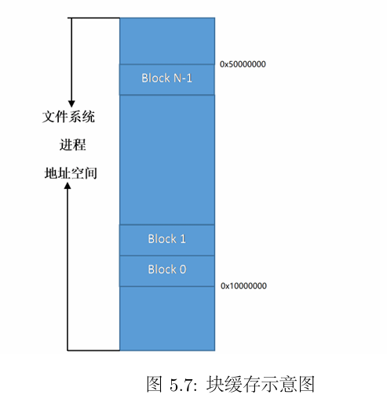

> Exercise 5.6 disk_addr函数计算指定磁盘块对应的虚存地址
>
> 即根据一个块的序号，计算这一磁盘块对应的虚存的起始地址
>
> Hint:我们已经知道，第一块磁盘被映射到DISKMAP，即起始虚拟地址为DISKMAP

```c
void *disk_addr(u_int blockno) {
	/* Exercise 5.6: Your code here. */
	return (void*)(DISKMAP + blockno * BLOCK_SIZE);
}
```

> Exercise 5.7 map_block | unmap_block
>
> map_block：当一个磁盘块的内容载入到内存时，需要为之分配对应的物理内存，map_block完成了这一功能：检查指定的磁盘块是否已经映射到内存，如果没有， 分配一页内存来保存磁盘上的数据；相应地，完成unmap_block函数，用于解除磁盘块和 物理内存之间的映射关系，回收内存。

```c
// Overview:
//  Allocate a page to cache the disk block.
int map_block(u_int blockno) {
	// Step 1: If the block is already mapped in cache, return 0.
	// Hint: Use 'block_is_mapped'.
	/* Exercise 5.7: Your code here. (1/5) */
	if (block_is_mapped(blockno)) {
		return 0;
	}
	// Step 2: Alloc a page in permission 'PTE_D' via syscall.
	// Hint: Use 'disk_addr' for the virtual address.
	/* Exercise 5.7: Your code here. (2/5) */
	return syscall_mem_alloc(0,disk_addr(blockno),PTE_D);
}

// Overview:
//  Unmap a disk block in cache.
void unmap_block(u_int blockno) {
	// Step 1: Get the mapped address of the cache page of this block using 'block_is_mapped'.
	void *va;
	/* Exercise 5.7: Your code here. (3/5) */
	va = block_is_mapped(blockno);
	// Step 2: If this block is used (not free) and dirty in cache, write it back to the disk
	// first.
	// Hint: Use 'block_is_free', 'block_is_dirty' to check, and 'write_block' to sync.
	/* Exercise 5.7: Your code here. (4/5) */
	if (!block_is_free(blockno) && block_is_dirty(blockno)) {
		write_block(blockno);
	}
	// Step 3: Unmap the virtual address via syscall.
	/* Exercise 5.7: Your code here. (5/5) */
	syscall_mem_unmap(0,va);
	user_assert(!block_is_mapped(blockno));
}
```

* 需要使用用户态的系统调用函数syscall_*进行内存的映射和解除映射

​	```read_block```和```write_block```函数用于读写磁盘块，```read_block```函数将制定编号的磁盘块读入到内存中，首先检查这块磁盘块是否已经在内存中，如果不在，先分配一页物理内存，然后调用ide_read函数来读取磁盘上的数据到对应的虚拟地址。

​	```file_get_block```函数用于将某个指定的文件指向的磁盘块读入内存

* 首先为即将读入内存的磁盘块分配物理内存
* 然后使用```read_block```函数将磁盘内容以块为单位读入内存中的相应位置

> Exercise 5.8 dir_lookup 查找某个目录下是否存在指定的文件

```c
int dir_lookup(struct File *dir, char *name, struct File **file) {
	// Step 1: Calculate the number of blocks in 'dir' via its size.
	u_int nblock;
	/* Exercise 5.8: Your code here. (1/3) */
	nblock = dir->f_size / BLOCK_SIZE;
	// Step 2: Iterate through all blocks in the directory.
	for (int i = 0; i < nblock; i++) {
		// Read the i'th block of 'dir' and get its address in 'blk' using 'file_get_block'.
		void *blk;
		/* Exercise 5.8: Your code here. (2/3) */
		try(file_get_block(dir, i, &blk));
		struct File *files = (struct File *)blk;

		// Find the target among all 'File's in this block.
		for (struct File *f = files; f < files + FILE2BLK; ++f) {
			// Compare the file name against 'name' using 'strcmp'.
			// If we find the target file, set '*file' to it and set up its 'f_dir'
			// field.
			/* Exercise 5.8: Your code here. (3/3) */
			if (strcmp(name, f->f_name) == 0) {
				*file = f;
				f->f_dir = dir;
				return 0;
			}
		}
	}

	return -E_NOT_FOUND;
}
```

* 通过strcmp比对文件名 

> 文件系统结构部分的函数调用参考
>
> 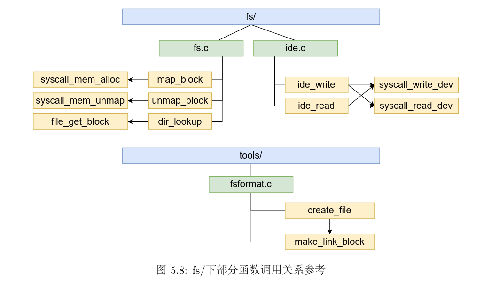

## 5.文件系统的用户接口

> 在文件系统建立之后，还需要向用户提供相关的使用接口，MOS操作系统内核是微内核设计，文件系统属于用户态进程，在其他进程与文件系统交互的过程中，涉及到进程通信问题

### 5.1 文件描述符

> fd : File Descripter
>
> 文件描述符是系统给用户提供的整数，用于其在描述符表(Descripter Table)中进行索引，我们在作为操作系统的使用者进行文件IO编程时
>
> * 使用open在描述符表(FDTABLE)的指定位置存放被打开的文件的信息
> * 使用close将描述符表中制定位置的文件信息释放
> * 在write和read时修改描述符表指定位置的文件信息
> * **指定位置即为文件描述符fd**

​	当用户进程试图打开一个文件时，文件系统服务进程需要一个文件描述符来存储文件的基本信息和用户进程中关于文件的状态，同时，文件描述符也起到描述用户对于文件操作的作用。

​	当用户进程向文件系统发送打开文件的请求时，文件系统进程会将这些基本信息记录在内存中，然后由操作系统将用户进程请求的地址映射到同一个存储了文件描述符的物理页上。**因此一个文件描述符至少需要独占一页的空间**。当用户进程获取了文件大小等基本信息后，再次向文件系统发送请求将文件内容映射到指定空间中。

> 关于两个结构体之间的指针类型转换
>
> 在file.c中，我们发现很多函数中都会将一个struct Fd*类型的指针转换为struct Filefd *类型的指针，这是C语言中的强制类型转换。
>
> **强制类型转换不改变指针的值，只是改变程序对地址处数据的解释方式(指向的数据类型)**
>
> 两个结构体的定义如下
>
> ```c
> struct Fd {
> 	u_int fd_dev_id;
> 	u_int fd_offset;
> 	u_int fd_omode;
> };
> struct Filefd {
> 	struct Fd f_fd;
> 	u_int f_fileid;
> 	struct File f_file;
> };
> 
> ```
>
> Filefd结构体中第一个成员就是fd，因此指向Filefd的指针同样指向这个Fd的起始位置，可以进行转换

> Exercise 5.9 open 打开文件或目录

```c
int open(const char *path, int mode) {
	int r;

	// Step 1: Alloc a new 'Fd' using 'fd_alloc' in fd.c.
	// Hint: return the error code if failed.
	struct Fd *fd;
	/* Exercise 5.9: Your code here. (1/5) */
	try(fd_alloc(&fd));
	// Step 2: Prepare the 'fd' using 'fsipc_open' in fsipc.c.
	/* Exercise 5.9: Your code here. (2/5) */
	try(fsipc_open(path, mode, fd));
	// Step 3: Set 'va' to the address of the page where the 'fd''s data is cached, using
	// 'fd2data'. Set 'size' and 'fileid' correctly with the value in 'fd' as a 'Filefd'.
	char *va;
	struct Filefd *ffd;
	u_int size, fileid;
	/* Exercise 5.9: Your code here. (3/5) */
	va = fd2data(fd);
	ffd = (struct Filefd *)fd;
	size = ffd->f_file.f_size;
	fileid = ffd->f_fileid;
	// Step 4: Map the file content using 'fsipc_map'.
	for (int i = 0; i < size; i += PTMAP) {
		/* Exercise 5.9: Your code here. (4/5) */
		try(fsipc_map(fileid, i, va + i));
	}

	// Step 5: Return the number of file descriptor using 'fd2num'.
	/* Exercise 5.9: Your code here. (5/5) */
	return fd2num(fd);
}
```

对关键函数进行解读：该函数的作用是打开一个文件或目录

* 首先为要打开的文件或目录(本质上都是文件)分配一个文件描述符，观察```fd_alloc```的逻辑

  ```c
  int fd_alloc(struct Fd **fd) {
  	u_int va;
  	u_int fdno;
  
  	for (fdno = 0; fdno < MAXFD - 1; fdno++) {
  		va = INDEX2FD(fdno);
  
  		if ((vpd[va / PDMAP] & PTE_V) == 0) {
  			*fd = (struct Fd *)va;
  			return 0;
  		}
  
  		if ((vpt[va / PTMAP] & PTE_V) == 0) { // the fd is not used
  			*fd = (struct Fd *)va;
  			return 0;
  		}
  	}
  
  	return -E_MAX_OPEN;
  }
  ```

  本质上是找到最小的没有被分配的文件描述符所对应的页，而一页对应一个文件描述符

* fsipc_open

  ```c
  int fsipc_open(const char *path, u_int omode, struct Fd *fd) {
  	u_int perm;
  	struct Fsreq_open *req;
  
  	req = (struct Fsreq_open *)fsipcbuf;
  
  	// The path is too long.
  	if (strlen(path) >= MAXPATHLEN) {
  		return -E_BAD_PATH;
  	}
  
  	strcpy((char *)req->req_path, path);
  	req->req_omode = omode;
  	return fsipc(FSREQ_OPEN, req, fd, &perm);
  }
  ```

  本质上是向文件系统发送打开文件的请求

* fsipc_map

  ```c
  int fsipc_map(u_int fileid, u_int offset, void *dstva) {
  	int r;
  	u_int perm;
  	struct Fsreq_map *req;
  
  	req = (struct Fsreq_map *)fsipcbuf;
  	req->req_fileid = fileid;
  	req->req_offset = offset;
  
  	if ((r = fsipc(FSREQ_MAP, req, dstva, &perm)) < 0) {
  		return r;
  	}
  
  	if ((perm & ~(PTE_D | PTE_LIBRARY)) != (PTE_V)) {
  		user_panic("fsipc_map: unexpected permissions %08x for dstva %08x", perm, dstva);
  	}
  
  	return 0;
  }
  ```

  向文件系统进程发出映射内存块的请求。

​	当要读取一个大文件中间的一小部分内容时，一个简单的做法是从头开始查找，但是开销较大；此外，在多次读写同一文件描述符期间，我们也希望能够从文件中前一次读写完毕的位置开始继续读写数据。**因此，文件描述符中需要维护一个指针，帮助我们在文件中定位，在read/write/seek操作时，也需要更新该指针的值**

> Exercise 5.10 read函数

```c
int read(int fdnum, void *buf, u_int n) {
	int r;

	// Similar to the 'write' function below.
	// Step 1: Get 'fd' and 'dev' using 'fd_lookup' and 'dev_lookup'.
	struct Dev *dev;
	struct Fd *fd;
	/* Exercise 5.10: Your code here. (1/4) */
	if ((r = fd_lookup(fdnum, &fd)) < 0 || (r = dev_lookup(fd->fd_dev_id, &dev)) < 0 ) {
		return r;
	}

	// Step 2: Check the open mode in 'fd'.
	// Return -E_INVAL if the file is opened for writing only (O_WRONLY).
	/* Exercise 5.10: Your code here. (2/4) */
	if ((fd->fd_omode & O_ACCMODE) == O_WRONLY) {
		return -E_INVAL;
	}
	// Step 3: Read from 'dev' into 'buf' at the seek position (offset in 'fd').
	/* Exercise 5.10: Your code here. (3/4) */
	r = dev->dev_read(fd, buf, n, fd->fd_offset);
	// Step 4: Update the offset in 'fd' if the read is successful.
	/* Hint: DO NOT add a null terminator to the end of the buffer!
	 *  A character buffer is not a C string. Only the memory within [buf, buf+n) is safe to
	 *  use. */
	/* Exercise 5.10: Your code here. (4/4) */
	if (r > 0) {
		fd->fd_offset += r;
	}

	return r;
}
```

* 主要逻辑为**调用设备的读取函数```dev_read```函数从文件当前的偏移位置读取数据到缓冲区中**
* 注意**(fd->fd_omode & O_ACCMODE) == O_WRONLY**一定要加括号，否则运算优先级会有问题

* 观察dev_read等设备函数

  ```c
  struct Dev {
  	int dev_id;
  	char *dev_name;
  	int (*dev_read)(struct Fd *, void *, u_int, u_int);
  	int (*dev_write)(struct Fd *, const void *, u_int, u_int);
  	int (*dev_close)(struct Fd *);
  	int (*dev_stat)(struct Fd *, struct Stat *);
  	int (*dev_seek)(struct Fd *, u_int);
  };
  ```

  在设备结构体中定义了一系列关于设备操作的函数，关于他们的具体实现可以在```file.c```中找到例子(不同设备的定义可能不同)

  ```c
  struct Dev devfile = {
      .dev_id = 'f',
      .dev_name = "file",
      .dev_read = file_read,
      .dev_write = file_write,
      .dev_close = file_close,
      .dev_stat = file_stat,
  };
  ```

  下面以```file_read```为例，即设备最终调用了这个函数，函数主体功能为```memcpy```，返回值为读取的长度。

  ```c
  static int file_read(struct Fd *fd, void *buf, u_int n, u_int offset) {
  	u_int size;
  	struct Filefd *f;
  	f = (struct Filefd *)fd;
  
  	// Avoid reading past the end of file.
  	size = f->f_file.f_size;
  
  	if (offset > size) {
  		return 0;
  	}
  
  	if (offset + n > size) {
  		n = size - offset;
  	}
  
  	memcpy(buf, (char *)fd2data(fd) + offset, n);
  	return n;
  }
  ```

### 5.2 文件系统服务

​	MOS操作系统中的文件服务**通过IPC的方式**供其他进程调用，进行文件读写操作。

* 在内核启动时，启动了文件系统服务进程```ENV_CREATE(fs_serv)```
* 用户进程需要进行文件操作时，使用```ipc_send,ipc_recv```与```fs_serv```进行交互

​	在流程上，fs/serv.c中服务进程的主函数首先调用了serve_init函数准备好**全局的文件打开记录表opentab**，然后调用```fs_init```函数来初始化文件系统：

* 首先通过**读取超级块的内容**获知磁盘的基本信息
* 然后检查磁盘是否能正常读写
* 最后调用```read_bitmap```函数检查磁盘块上的位图是否正确

​	执行完文件系统的初始化后，调用serve函数，文件系统服务开始运行，等待其他进程交互。

```c
int main() {
	user_assert(sizeof(struct File) == FILE_STRUCT_SIZE);

	debugf("FS is running\n");

	serve_init();
	fs_init();

	serve();
	return 0;
}
```

UML时序图如下(分析见实验报告)

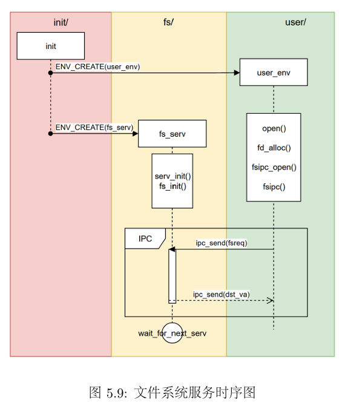

​	用户进程向文件进程发送的请求如下

```c
enum {
	FSREQ_OPEN,
	FSREQ_MAP,
	FSREQ_SET_SIZE,
	FSREQ_CLOSE,
	FSREQ_DIRTY,
	FSREQ_REMOVE,
	FSREQ_SYNC,
	MAX_FSREQNO,
};

```

* 当用户程序发送文件系统操作请求时，将请求的内容放在对应的结构体中进行消息的传递。

* ```fs_serv```进程收到其他进程的IPC操作后，IPC传递的消息包含了请求的类型和其他必要的参数，根据请求的类型(增/删/查/改)执行相应的文件操作
* 结果重新通过IPC反馈给用户程序

> user/lib/fsipc.c中定义了请求文件系统时用到的IPC操作
>
> user/lib/file.c文件中定义了用户程序读写、创建、删除、修改文件的接口

​	下面三个练习实现删除指定路径文件的功能。

> Exercise 5.11 fs/serv.c serve_remove

```c
void serve_remove(u_int envid, struct Fsreq_remove *rq) {
	// Step 1: Remove the file specified in 'rq' using 'file_remove' and store its return value.
	int r;
	/* Exercise 5.11: Your code here. (1/2) */
	r = file_remove(rq->req_path);
	// Step 2: Respond the return value to the caller 'envid' using 'ipc_send'.
	/* Exercise 5.11: Your code here. (2/2) */
	ipc_send(envid, r, 0, 0);
}
```

> Exercise 5.12  user/lib/fsipc.c fsipc_remove

```c
int fsipc_remove(const char *path) {
	// Step 1: Check the length of 'path' using 'strlen'.
	// If the length of path is 0 or larger than 'MAXPATHLEN', return -E_BAD_PATH.
	/* Exercise 5.12: Your code here. (1/3) */
	if (strlen(path) == 0 || strlen(path) > MAXPATHLEN) {
		return -E_BAD_PATH;
	}
	// Step 2: Use 'fsipcbuf' as a 'struct Fsreq_remove'.
	struct Fsreq_remove *req = (struct Fsreq_remove *)fsipcbuf;

	// Step 3: Copy 'path' into the path in 'req' using 'strcpy'.
	/* Exercise 5.12: Your code here. (2/3) */
	strcpy(req->req_path, path);
	// Step 4: Send request to the server using 'fsipc'.
	/* Exercise 5.12: Your code here. (3/3) */
	return fsipc(FSREQ_REMOVE, req, 0, 0);
}
```

> Exercise 5.13 user/lib/file.c remove

```c
int remove(const char *path) {
	// Call fsipc_remove.

	/* Exercise 5.13: Your code here. */
	return fsipc_remove(path);
}
```

