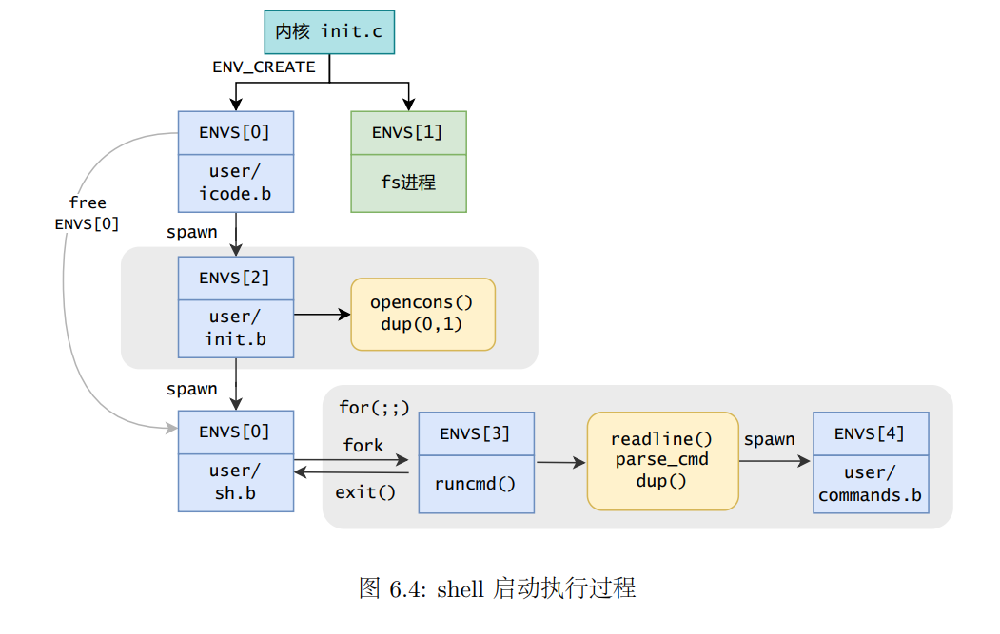

# OS:lab6实验报告

## Thinking 6.1 

* **示例代码中，父进程操作管道的写端，子进程操作管道的读端。如果现在想 让父进程作为“读者”，代码应当如何修改？**

* 父进程关掉写端```fildes[1]```，打开读端```fildes[0]```
* 子进程关掉读端```fildes[0]```，打开写端```fildes[1]```

## Thinking 6.2 

* **上面这种不同步修改 pp_ref 而导致的进程竞争问题在 user/lib/fd.c 中 的 dup 函数中也存在。请结合代码模仿上述情景，分析一下我们的 dup 函数中为什么会出 现预想之外的情况？**
* 原理同```pipe_close```一致，都是在一个函数两个相关的页面map或者unmap的之间发生了时钟中断，所以会导致不一致的现象。
* ```dup```函数中有两次```map```，将newfd所在的虚拟页映射到oldfd所在的物理页，将newfd的数据所在的虚拟页映射到oldfd的数据所在的物理页

## Thinking 6.3 

* **阅读上述材料并思考：为什么系统调用一定是原子操作呢？如果你觉得不是 所有的系统调用都是原子操作，请给出反例。希望能结合相关代码进行分析说明。**

* 系统调用一定是原子操作，进程切换是通过定时器产生时钟中断，触发时钟中断切换进程。但是syscall跳转到内核态时，CPU将SR寄存其的IE位置0，关闭了时钟中断。

## Thinking 6.4

* **按照上述说法控制 pipe_close 中 fd 和 pipe unmap 的顺序，是否可以解决上述场景的进程竞争问题？给出你的分析过程**
* 在两个```unmap```之间发生时钟中断时，若先解除```pipe```再解除```fd```，会导致```pageref(pipe)==pageref(fd)```，写端关闭的错误判断。不会若调换顺序，可以总保证```pageref(pipe) > pageref(fd)```发生错判。
* **我们只分析了 close 时的情形，在 fd.c 中有一个 dup 函数，用于复制文件描述符。 试想，如果要复制的文件描述符指向一个管道，那么是否会出现与 close 类似的问题？请模仿上述材料写写你的理解。**
* 原来```dup```的```map```顺序为首先映射```fd```再映射```pipe```即```fd```的映射次数先+1，此时若在两个```map```之间发生时钟中断，会导致```pageref(pipe)==pageref(fd)```的错判，因此需要调整顺序，首先映射```pipe```再映射```fd```。

## Thinking 6.5

* **认真回看 Lab5 文件系统相关代码，弄清打开文件的过程**
*  spawn 函数是通过和文件系统交互，取得文件描述块，进而找到 ELF 在“硬盘”中的位置，进而读取。
* **回顾 Lab1 与 Lab3，思考如何读取并加载 ELF 文件**
* 在 Lab3 中填写了 load_icode 函数，实现了 ELF 可执行文件中读取数据并加载到内存空间，其中通过调用 elf_load_seg 函数来加载各个程序段。在 Lab3 中我们要填写 load_icode_mapper 回调函数，在内核态下加载 ELF 数据到内存空间；相应地，在 Lab6 中 spawn 函数也需要在用户态下使用系统调用为 ELF 数据分配空间。
* **在 Lab1 中我们介绍了 data text bss 段及它们的含义，data 段存放初始化过的全局变量，bss 段存放未初始化的全局变量。关于 memsize 和filesize ，我们在 Note1.3.4中也解释了它们的含义与特点。关于 Note 1.3.4，注意其中关于“bss 段并不在文件中占数据”表述的含义。回顾 Lab3 并思考：elf_load_seg() 和 load_icode_mapper()函数是如何确保加载 ELF 文件时，bss 段数据被正确加载进虚拟内存空间。bss 段在 ELF 中并不占空间，但 ELF 加载进内存后，bss 段的数据占据了空间，并且初始值都是 0。请回顾 elf_load_seg() 和 load_icode_mapper() 的实现，思考这一点是如何实现的？**
* bss段应该与text段data段连续的放在一起，但是ELF中没有空间，在分配映射页面时，text段与data段没有占满的空间置为0给了bss段，然后再给他另外分配的时候，只使用syscall_mem_alloc而不映射。

## Thinking 6.6

* **通过阅读代码空白段的注释我们知道，将标准输入或输出定向到文件，需要 我们将其 dup 到 0 或 1 号文件描述符（fd）。那么问题来了：在哪步，0 和 1 被“安排”为 标准输入和标准输出？请分析代码执行流程，给出答案。**

* ```user/init.c```

  ```c
  // stdin should be 0, because no file descriptors are open yet
  if ((r = opencons()) != 0) {
    user_panic("opencons: %d", r);
  }
  // stdout
  if ((r = dup(0, 1)) < 0) {
    user_panic("dup: %d", r);
  }
  ```

## Thinking 6.7

* **在 shell 中执行的命令分为内置命令和外部命令。在执行内置命令时 shell 不 需要 fork 一个子 shell，如 Linux 系统中的 cd 命令。在执行外部命令时 shell 需要 fork 一个子 shell，然后子 shell 去执行这条命令。 据此判断，在 MOS 中我们用到的 shell 命令是内置命令还是外部命令？请思考为什么 Linux 的 cd 命令是内部命令而不是外部命令？ **

* 在MOS中，执行命令前都会fork一下，通过子进程完成命令，所以是外部命令
* cd命令需要改变父进程的状态，即所在的路径，通过fork之后只能够改变子进程，所以需要是内部命令

## Thinking 6.8

* **在你的 shell 中输入命令 ls.b | cat.b > motd**
* **请问你可以在你的 shell 中观察到几次 spawn ？分别对应哪个进程？**
* 两次，分别打开了ls.b和cat.b

* **请问你可以在你的 shell 中观察到几次进程销毁？分别对应哪个进程？**

* 四个，左指令的执行进程，右指令的执行进程，spawn打开的两个执行进程

## 实验难点分析

​	本次实验主要实现了进程间通信的匿名管道机制和```shell```命令行解释程序。主要的难点在于理解管道的机制和命令行解释程序的编写。



* 内核启动的进程```user/icode.b```调用了```spawn```，创建了```init.b```进程```init.b```进程首先打开控制台(console)作为0号和1号文件描述符，即进程的标准输入和输出。然后```spawn```创建了```sh.b```进程，**也就是我们的shell**，通过共享页面机制，fork和spawn创建的子进程继承了父进程持有的fd。
* ```shell```进程负责解析命令行程序，通过```spawn```生成可执行程序进程(```*.b```)，在解析命令行命令时，子shell会将重定向文件及管道等dup到子shell的标准输入或输出。然后spawn时将标准输入和输出通过共享内存映射给可执行程序。

## 实验心得体会

​	通过本次实验，我学习了通信的管道机制和shell的编写，更好地将理论课中学到的理论知识与实验代码进行融合理解。lab6是OS实验的最后一部分，通过lab6我们建立了一个简易的shell程序，后续计划做Shell挑战性任务来加深自己对于lab6的理解。
