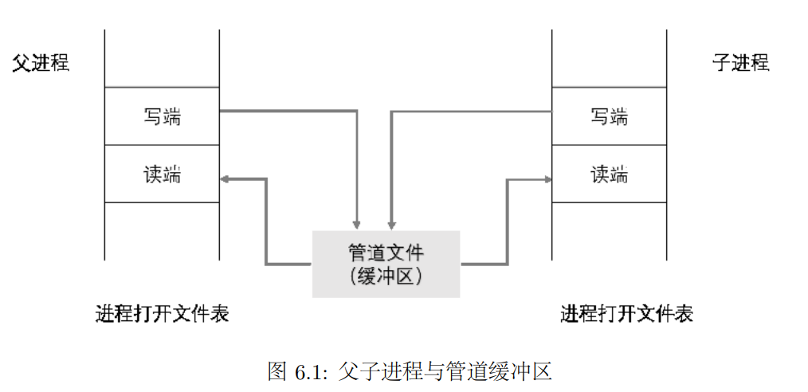
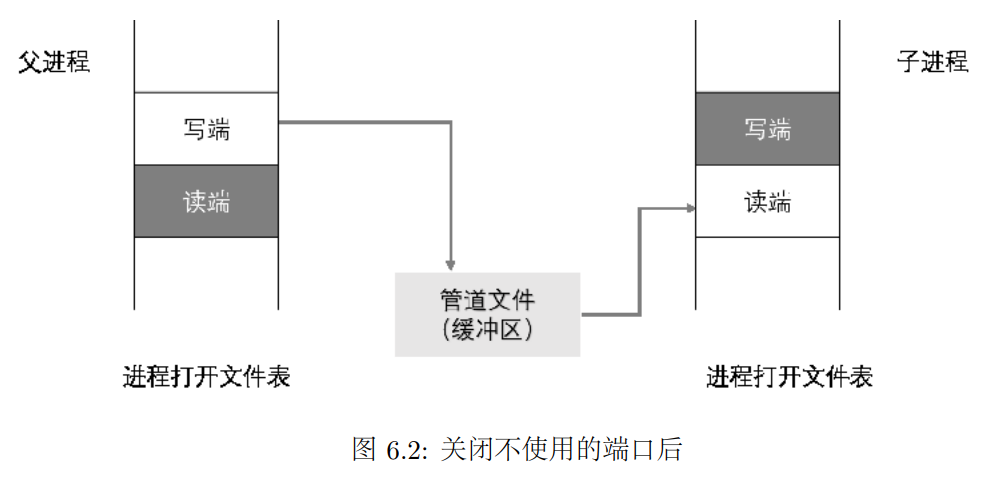

# OS:lab6课下基础

## 1. 管道

### 1.1 初窥管道

​	管道是一种典型的进程间单向通信的方式，分为有名管道和匿名管道两种，**匿名管道只能在有公共祖先的进程间使用**，在MOS中，我们要实现匿名管道。

​	**管道是一种只存在于内存中的文件**，在MOS中，父进程调用```pipe```函数时会**打开两个新的文件描述符：一个表示只读端，一个表示只写端**，两个描述符都映射到同一片内存区域。	

​	在```fork```的配合下，子进程会复制父进程的两个文件描述符，从而在==**父子进程间形成了四个(父子各有一读一写)的指向同一片内存区域的文件描述符，父子进程可根据需要关掉自己不用的一个，从而实现单向管道通信。**==

### 1.2 MOS中pipe的使用与实现

​	MOS中```pipe```的实现

```c
int pipe(int pfd[2]) {
	int r;
	void *va;
	struct Fd *fd0, *fd1;

	/* Step 1: Allocate the file descriptors. */
	if ((r = fd_alloc(&fd0)) < 0 || (r = syscall_mem_alloc(0, fd0, PTE_D | PTE_LIBRARY)) < 0) {
		goto err;
	}

	if ((r = fd_alloc(&fd1)) < 0 || (r = syscall_mem_alloc(0, fd1, PTE_D | PTE_LIBRARY)) < 0) {
		goto err1;
	}

	/* Step 2: Allocate and map the page for the 'Pipe' structure. */
	va = fd2data(fd0);
	if ((r = syscall_mem_alloc(0, (void *)va, PTE_D | PTE_LIBRARY)) < 0) {
		goto err2;
	}
	if ((r = syscall_mem_map(0, (void *)va, 0, (void *)fd2data(fd1), PTE_D | PTE_LIBRARY)) <
	    0) {
		goto err3;
	}

	/* Step 3: Set up 'Fd' structures. */
	fd0->fd_dev_id = devpipe.dev_id;
	fd0->fd_omode = O_RDONLY;

	fd1->fd_dev_id = devpipe.dev_id;
	fd1->fd_omode = O_WRONLY;

	debugf("[%08x] pipecreate \n", env->env_id, vpt[VPN(va)]);

	/* Step 4: Save the result. */
	pfd[0] = fd2num(fd0);
	pfd[1] = fd2num(fd1);
	return 0;

err3:
	syscall_mem_unmap(0, (void *)va);
err2:
	syscall_mem_unmap(0, fd1);
err1:
	syscall_mem_unmap(0, fd0);
err:
	return r;
}
```

* 首先为```fd0```和```fd1```两个文件描述符分配空间(物理页)
* 然后给```fd0```对应的虚拟地址分配一页物理内存并将```fd1```对应的虚拟地址映射到这一页物理内存

* **通过管道pipe进行共享的实际上是共享页面机制PTE_LIBRARY**





### 1.3 管道的读写

​	关于管道结构体```Pipe```的定义如下

```c
struct Pipe {
	u_int p_rpos;		 // read position
	u_int p_wpos;		 // write position
	u_char p_buf[PIPE_SIZE]; // data buffer
};
```

* ```p_rpos```：下一个要从管道读的数据的位置，读者更新
* ```p_wpos```：下一个要向管道写的数据的位置，写者更新

* ```p_buf```：缓冲区，类似于环形缓冲区，读写的位置```i```实际上是```i%PAGE_SIZE```

​	当读者从管道读取数据时，要将```p_buf[p_rpos%PIPE_SIZE]```拷贝走，然后读自增一。==**需要注意的是，管道的缓冲区此时可能还没有被写入数据，所以如果管道数据为空，即当``p_rpos>=p_wpos``时，进程切换到写者运行。**==

​	当写者相管道中写入数据时，将数据存入```p_buf[p_wpos%PIPE_SIZE]```，然后写自增一。**==需要注意缓冲区可能存在满溢的情况，所以需要在```p_wpos-p_rpos<PIPE_SIZE```时方可运行。==**

​	当**缓冲区出现空或满的情况时，我们还需要根据另一端是否关闭来判断是否要返回**，另一端已经关闭则返回0即可，否则切换进程运行。

​	判断管道另一端是否关闭```_pipe_is_closed```：对于一个匿名管道，我们分配了三页空间：读数据的文件描述符```rfd```一页，写数据的文件描述符```wfd```一页，剩下一页是被两个文件描述符共享的管道数据缓冲区```pipe```.

​	则有```pageref(rfd)+pageref(wfd)=pageref(pipe)```，若另一端关闭则有```pageref(rfd)=pageref(pipe)```或```pageref(wfd)==pageref(pipe)```

> Exercise 6.1 pipe_read, pipe_write, _pipe_is_closed

```c
static int _pipe_is_closed(struct Fd *fd, struct Pipe *p) {
	int fd_ref, pipe_ref, runs;
	/* Exercise 6.1: Your code here. (1/3) */
	do {
		runs = env->env_runs;
		fd_ref = pageref(fd);
		pipe_ref = pageref(p);
	} while (runs != env->env_runs);

	return fd_ref == pipe_ref;
}

static int pipe_read(struct Fd *fd, void *vbuf, u_int n, u_int offset) {
	int i;
	struct Pipe *p;
	char *rbuf;
	/* Exercise 6.1: Your code here. (2/3) */
	p = (struct Pipe *)fd2data(fd);
	rbuf = (char *)vbuf;
	for (i = 0; i < n; i++) {
		while (p->p_rpos >= p->p_wpos) {
			if (i >= 1 || _pipe_is_closed(fd, p)) {
				return i;
			} else {
				syscall_yield();
			}
		}
		rbuf[i] = p->p_buf[(p->p_rpos++) % PIPE_SIZE];
	}

	return n;
}

static int pipe_write(struct Fd *fd, const void *vbuf, u_int n, u_int offset) {
	int i;
	struct Pipe *p;
	char *wbuf;
	/* Exercise 6.1: Your code here. (3/3) */
	p = (struct Pipe *)fd2data(fd);
	wbuf = (char *)vbuf;
	for (i = 0; i < n; i++) {
		while (p->p_wpos - p->p_rpos >= PIPE_SIZE) {
			if (_pipe_is_closed(fd, p)) {
				return i;
			} else {
				syscall_yield();
			}
		}
		p->p_buf[(p->p_wpos++) % PIPE_SIZE] = wbuf[i];
	}
	
	return n;
}
```

### 1.4 管道关闭的正确判断

​	**MOS采用时间片轮转的进程调度算法**，抢占式的进程管理意味着用户进程随时可能会被打断。

​	由于管道的共享性质，无法保证```_pipe_is_closed```用于管道另一端的判断一定返回正确的结果。

​	进程使用```pipe_close```来关闭管道的端口，该函数的实质是通过两次系统调用```unmap```来解除文件描述符```fd```和数据缓存区```pipe```的映射。**由于进程切换的存在，并不能保证两次系统调用可以在==同一进程时间片内被执行==，两次系统调用之间可能因为进程切换而被打断，故fd和对pipe的pp_ref也不能保证同步被写入，影响了管道是否关闭的正确性。**

> 在MOS中只有syscall_*开头的系统调用函数是原子操作

​	```_pipe_is_closed```函数返回正确结果的条件为

* 写端关闭```pageref(p[0]) == pageref(pipe)```
* 读端关闭```pageref(p[1]) == pageref(pipe)```

​	对于更一般的情况，```pageref(p[0]) +pageref(p[1]) = pageref(pipe)```，**也就是说pipe的引用次数总比pipe要高。**在```close```函数中

```c
static int pipe_close(struct Fd *fd) {
	// Unmap 'fd' and the referred Pipe.
    syscall_mem_unmap(0, (void *)fd2data(fd));
	syscall_mem_unmap(0, fd);
	return 0;
}

```

​	先解除```pipe```映射再解除```fd```映射，会使pipe引用次数-1先于fd，**在两个```unmap```间隙导致```pageref(pipe)=pageref(fd)```**，这一点可以通过控制```fd```与```pipe```的```map/unmap```顺序解决进程竞争导致的非同步写入问题：使fd的引用次数-1先于pipe，这样即使在两个```unmap```的间隙，也有```pageref(pipe) > pageref(fd)```成立。

​	==或者说改变```map/unmap```顺序使得```pageref(pipe) > pageref(fd)```在非管道关闭时恒成立==

>Exercise 6.2 调整pipe_close中的umap顺序
>
>* 先解除fd
>* 再解除pipe

```c
static int pipe_close(struct Fd *fd) {
	// Unmap 'fd' and the referred Pipe.
	syscall_mem_unmap(0, fd);
	syscall_mem_unmap(0, (void *)fd2data(fd));
	return 0;
}
```

>Exercise 6.3 调整dup函数中的map顺序
>
>* 先映射pipe
>* 后映射fd

```c
int dup(int oldfdnum, int newfdnum) {
	int i, r;
	void *ova, *nva;
	u_int pte;
	struct Fd *oldfd, *newfd;

	/* Step 1: Check if 'oldnum' is valid. if not, return an error code, or get 'fd'. */
	if ((r = fd_lookup(oldfdnum, &oldfd)) < 0) {
		return r;
	}

	/* Step 2: Close 'newfdnum' to reset content. */
	close(newfdnum);
	/* Step 3: Get 'newfd' reffered by 'newfdnum'. */
	newfd = (struct Fd *)INDEX2FD(newfdnum);
	/* Step 4: Get data address. */
	ova = fd2data(oldfd);
	nva = fd2data(newfd);
	/* Step 5: Dunplicate the data and 'fd' self from old to new. */
	if (vpd[PDX(ova)]) {
		for (i = 0; i < PDMAP; i += PTMAP) {
			pte = vpt[VPN(ova + i)];

			if (pte & PTE_V) {
				// should be no error here -- pd is already allocated
				if ((r = syscall_mem_map(0, (void *)(ova + i), 0, (void *)(nva + i),
							 pte & (PTE_D | PTE_LIBRARY))) < 0) {
					goto err;
				}
			}
		}
	}

	if ((r = syscall_mem_map(0, oldfd, 0, newfd, vpt[VPN(oldfd)] & (PTE_D | PTE_LIBRARY))) <0) {
		goto err;
	}

	return newfdnum;

err:
	/* If error occurs, cancel all map operations. */
	panic_on(syscall_mem_unmap(0, newfd));

	for (i = 0; i < PDMAP; i += PTMAP) {		panic_on(syscall_mem_unmap(0, (void *)(nva + i)));
	}

	return r;
}
```

## 2. Shell

> shell指“为使用者提供操作界面”的软件，他接受用户的命令然后调用相关的应用程序，MOS实现了```CLI shell```

### 2.1 完善spawn函数

​	```spawn```函数的作用是帮助我们调用文件系统中的可执行文件并执行(初步观察我们的命令就是通过```spawn```函数运行的，例如输入```ls.b```，调用可执行文件```ls.b```)。

> Exercise 6.5 spawn
>
> * 文件系统打开对应的文件(二进制ELF，*.b)
> * 申请新的进程控制块
> * 将目标程序加载到子进程的地址空间中并为他们分配物理页面
> * 为子进程初始化地址空间
> * 设置子进程的寄存器
> * 将父进程的共享页面映射到子进程的地址空间
> * 设置子进程可执行

```c
int spawn(char *prog, char **argv) {
	// Step 1: Open the file 'prog' (the path of the program).
	// Return the error if 'open' fails.
	int fd;
	if ((fd = open(prog, O_RDONLY)) < 0) {
		return fd;
	}

	// Step 2: Read the ELF header (of type 'Elf32_Ehdr') from the file into 'elfbuf' using
	// 'readn()'.
	// If that fails (where 'readn' returns a different size than expected),
	// set 'r' and 'goto err' to close the file and return the error.
	int r;
	u_char elfbuf[512];
	/* Exercise 6.4: Your code here. (1/6) */
	if ((r = readn(fd, elfbuf, sizeof(Elf32_Ehdr))) != sizeof(Elf32_Ehdr)) {
		if (r >= 0) {
			r = -E_NOT_EXEC;
		}
		goto err;
	}
	const Elf32_Ehdr *ehdr = elf_from(elfbuf, sizeof(Elf32_Ehdr));
	if (!ehdr) {
		r = -E_NOT_EXEC;
		goto err;
	}
	u_long entrypoint = ehdr->e_entry;

	// Step 3: Create a child using 'syscall_exofork()' and store its envid in 'child'.
	// If the syscall fails, set 'r' and 'goto err'.
	u_int child;
	/* Exercise 6.4: Your code here. (2/6) */
	if ((child = syscall_exofork()) < 0) {
		r = child;
		goto err;
	}
	// Step 4: Use 'init_stack(child, argv, &sp)' to initialize the stack of the child.
	// 'goto err1' if that fails.
	u_int sp;
	/* Exercise 6.4: Your code here. (3/6) */
	if ((r = init_stack(child, argv, &sp)) < 0) {
		goto err1;
	}
	// Step 5: Load the ELF segments in the file into the child's memory.
	// This is similar to 'load_icode()' in the kernel.
	size_t ph_off;
	ELF_FOREACH_PHDR_OFF (ph_off, ehdr) {
		// Read the program header in the file with offset 'ph_off' and length
		// 'ehdr->e_phentsize' into 'elfbuf'.
		// 'goto err1' on failure.
		// You may want to use 'seek' and 'readn'.
		/* Exercise 6.4: Your code here. (4/6) */
		if ((r = seek(fd, ph_off)) < 0) {
			goto err1;
		} 
		if ((r = read(fd, elfbuf, ehdr->e_phentsize)) != ehdr->e_phentsize) {
			if (r >= 0) {
				r = -E_NOT_EXEC;
				goto err1;
			}
		}
		Elf32_Phdr *ph = (Elf32_Phdr *)elfbuf;
		if (ph->p_type == PT_LOAD) {
			void *bin;
			// Read and map the ELF data in the file at 'ph->p_offset' into our memory
			// using 'read_map()'.
			// 'goto err1' if that fails.
			/* Exercise 6.4: Your code here. (5/6) */
			if ((r = read_map(fd, ph->p_offset, &bin)) < 0) {
				goto err1;
			}
			// Load the segment 'ph' into the child's memory using 'elf_load_seg()'.
			// Use 'spawn_mapper' as the callback, and '&child' as its data.
			// 'goto err1' if that fails.
			/* Exercise 6.4: Your code here. (6/6) */
			if ((r = elf_load_seg(ph, bin, spawn_mapper, &child)) != 0) {
				goto err1;
			}
		}
	}
	close(fd);

	struct Trapframe tf = envs[ENVX(child)].env_tf;
	tf.cp0_epc = entrypoint;
	tf.regs[29] = sp;
	if ((r = syscall_set_trapframe(child, &tf)) != 0) {
		goto err2;
	}

	// Pages with 'PTE_LIBRARY' set are shared between the parent and the child.
	for (u_int pdeno = 0; pdeno <= PDX(USTACKTOP); pdeno++) {
		if (!(vpd[pdeno] & PTE_V)) {
			continue;
		}
		for (u_int pteno = 0; pteno <= PTX(~0); pteno++) {
			u_int pn = (pdeno << 10) + pteno;
			u_int perm = vpt[pn] & ((1 << PGSHIFT) - 1);
			if ((perm & PTE_V) && (perm & PTE_LIBRARY)) {
				void *va = (void *)(pn << PGSHIFT);

				if ((r = syscall_mem_map(0, va, child, va, perm)) < 0) {
					debugf("spawn: syscall_mem_map %x %x: %d\n", va, child, r);
					goto err2;
				}
			}
		}
	}

	if ((r = syscall_set_env_status(child, ENV_RUNNABLE)) < 0) {
		debugf("spawn: syscall_set_env_status %x: %d\n", child, r);
		goto err2;
	}
	return child;

err2:
	syscall_env_destroy(child);
	return r;
err1:
	syscall_env_destroy(child);
err:
	close(fd);
	return r;
}
```

### 2.2 解释shell命令

​	我们在```user```目录下提供了```ls.c , cat.c , echo.c```等几个用户程序模拟```Linux```下同名命令(后续Shell挑战性任务可以参考MIT-xv6中其他命令的实现)，当我们输入命令时，```Shell```程序```sh.c```调用了```spawn```函数，使其能够读取相应的可执行文件，并加载到新进程中运行。

​	解释shell命令通过```parsecmd```完成，或者说就是解析输入的字符串。

* 如果碰到重定向符号 ```< | >```
  * 读下一个单词，打开这个单词代表的文件，然后将文件内容复制给标准输入或标准输出
* 如果碰到管道符号```|```
  * 首先建立管道```pipe```，然后```fork```
  * 对于父进程，将管道的写者复制给标准输出
  * 对于子进程，将管道的读者复制给标准输入

> Exercise 6.5 parsecmd

```c
int parsecmd(char **argv, int *rightpipe) {
	int argc = 0;
	while (1) {
		char *t;
		int fd, r;
		int c = gettoken(0, &t);
		switch (c) {
		case 0:
			return argc;
		case 'w':
			if (argc >= MAXARGS) {
				debugf("too many arguments\n");
				exit();
			}
			argv[argc++] = t;
			break;
		case '<':
			if (gettoken(0, &t) != 'w') {
				debugf("syntax error: < not followed by word\n");
				exit();
			}
			// Open 't' for reading, dup it onto fd 0, and then close the original fd.
			// If the 'open' function encounters an error,
			// utilize 'debugf' to print relevant messages,
			// and subsequently terminate the process using 'exit'.
			/* Exercise 6.5: Your code here. (1/3) */
			if ((fd = open(t, O_RDONLY)) < 0) {
				debugf("failed to open %s\n");
				exit();
			}
			if ((r = dup(fd, 0)) < 0) {
				debugf("failed to duplicate file to <stdin>\n");
				exit();
			}
			close(fd);
			break;
		case '>':
			if (gettoken(0, &t) != 'w') {
				debugf("syntax error: > not followed by word\n");
				exit();
			}
			// Open 't' for writing, create it if not exist and trunc it if exist, dup
			// it onto fd 1, and then close the original fd.
			// If the 'open' function encounters an error,
			// utilize 'debugf' to print relevant messages,
			// and subsequently terminate the process using 'exit'.
			/* Exercise 6.5: Your code here. (2/3) */
			if ((fd = open(t, O_WRONLY)) < 0) {
				debugf("failed to open %s\n");
				exit();
			}
			if ((r = dup(fd, 1)) < 0) {
				debugf("failed to duplicate file to <stdout>\n");
				exit();
			}
			close(fd);
			break;
		case '|':;
			/*
			 * First, allocate a pipe.
			 * Then fork, set '*rightpipe' to the returned child envid or zero.
			 * The child runs the right side of the pipe:
			 * - dup the read end of the pipe onto 0
			 * - close the read end of the pipe
			 * - close the write end of the pipe
			 * - and 'return parsecmd(argv, rightpipe)' again, to parse the rest of the
			 *   command line.
			 * The parent runs the left side of the pipe:
			 * - dup the write end of the pipe onto 1
			 * - close the write end of the pipe
			 * - close the read end of the pipe
			 * - and 'return argc', to execute the left of the pipeline.
			 */
			int p[2];
			/* Exercise 6.5: Your code here. (3/3) */
			if ((r = pipe(p)) < 0) {
				debugf("failed to create pipe\n");
				exit();
			}
			if ((*rightpipe = fork()) == 0) {
				dup(p[0], 0);
				close(p[0]);
				close(p[1]);
				return parsecmd(argv, rightpipe);
			} else {
				dup(p[1], 1);
				close(p[1]);
				close(p[0]);
				return argc;
			}
			break;
		}
	}

	return argc;
}
```

