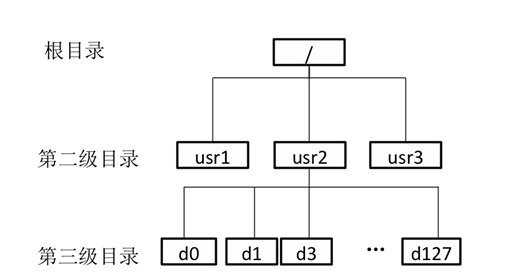
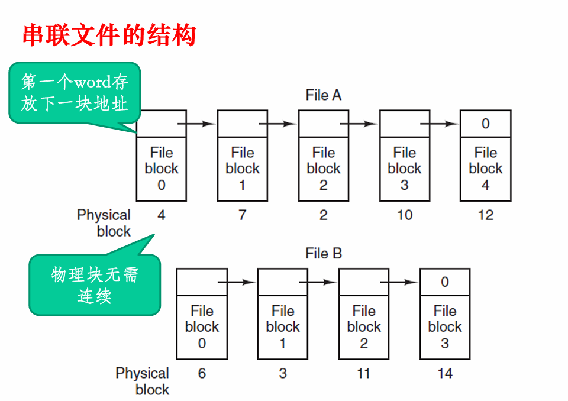

# OS第六次理论作业

1. 分析磁盘访问数据的时间。假设磁盘请求以柱面10、35、20、70、2、 3 和 38 的次序进入磁盘驱动器。寻道时磁头每移动一个柱面需要 5ms，以下各算法所需的寻道时间是多少： 
   * （1） 先来先服务  
   * （2） 最短寻道时间优先  
   * （3） SCAN算法  
   * （4） LOOK算法  
   * 说明：假设以上三种情况磁头初始位置为15。对于（3）和（4）， 磁头 当前向大柱面号方向运行，磁盘最大柱面号为85。 

> 寻道时间：是把磁头从当前位置移动到指定磁道上所经历的时间
>
> 该时间是启动磁盘的时间s与磁头移动n条磁道所花费的时间之和
>
> Ts = m * n + s

* 先来先服务：

  * $5*(5+25+15+50+68+1+35)=995ms$

* 最短寻道时间优先：

  * 这里起始位置是15，距离10和20距离相等
  * 若首先访问10，序列为：$15,10,3,2,20,35,38,70$

  * $5*(5+7+1+18+15+3+32)=405ms$​
  * 若首先访问20，序列为：$15,20,10,3,2,35,38,70$
  * $5*(5+10+7+1+33+3+32)=455ms$

* SCAN电梯算法
  * 序列为：$15,20,35,38,70,85,10,3,2$
  * $5*(5+15+3+32+15+75+7+1)=765ms$

* LOOK算法
  * 序列为：$15,20,35,38,70,10,3,2$
  * $5*(5+15+3+32+60+7+1)=615ms$

2.  在I/O系统中引入缓冲区的主要目标是什么？某文件占8个磁盘块， 现要把该文件的磁盘块**逐个读入**主存缓冲区，并送用户区进行分析。**一个缓冲区与磁盘块大小相等**。把一个磁盘块读入缓冲区的时间为 100μs，缓冲区数据传送到用户区的时间是50μs，CPU对一块数据 进行分析的时间为50μs。分别计算在单缓冲区和双缓冲区结构下， 分析完该文件的时间是多少？ 

* 在I/O系统中，CPU计算速度较快，而外设I/O速度较慢，为了解决CPU与外设速度不匹配的问题，提高CPU的利用率，减少CPU的忙等状态，设计了缓冲区
* 使用单缓冲区：第一块磁盘读入缓冲区的时间为100us，而后的磁盘读入和CPU进行分析的50us可以并行执行，对过程进行简单分析，第一块磁盘读入到传送到用户区：150us，此时CPU对第一块数据进行计算，并行地，第二块磁盘开始读入，需要50+50+50完成对第二块磁盘的计算，后边的磁盘同理。**即第一块磁盘从读入到完成分析需要200us,后边每一块需要150us**，总体$150*7+200=1250us$

* 使用双缓冲区：CPU和I/O设备分别使用一块缓冲区，一块缓冲区由I/O设备进行磁盘块读入后将数据传送到CPU并由CPU进行分析，并行地，另一个缓冲区进行磁盘块读取，**即第一块磁盘需要200us，后边每块磁盘需要100us**，总体$200+100*7=900us$

3.  请结合操作系统课所学习的内容总结从哪些方面可以提高文件系统 的性能。 

* 可以采用目录项分解、当前目录、磁盘碎片整理、块高速缓存、磁盘调度、提前读取、合理分配磁盘空间、信息的优化分布、RAID等技术

4. 简述文件控制块（FCB-File Control Block）中所管理的主要信息

* 基本信息：文件名、物理位置、文件逻辑结构、文件物理结构
* 访问控制信息：文件所有者、访问权限
* 使用信息：创建时间、上一次修改时间、当前使用信息

5. 在文件系统中，访问一个文件f时首先需要从目录中找到与f对应 的目录项。假设磁盘物理块的大小为1KB，一个目录项的大小为128 字节，文件的平均大小为100KB。该 文 件 系 统 的 目 录 结 构 如 下图所示。 假定不考虑磁盘块的提前读和缓存等加速磁盘访问技术。
   * 请回答以下问题：  
   * （1） 按照当前的目录结构，且**采用串联文件方式对数据块进行组织**，**并且根目录的目录项已读入内存中**。如果目标文件f 在第三级目录下， 且其对应的第三级目录的目录项可以一次从磁盘读出，访问文件f中的 一个块平均需要访问几次磁盘？  
   * （2） 如果采用i节点的方法来构建文件目录，假定文件名占14个字 节，i节点的指针占2个字节。如果**仅采用直接索引**，每个第三级目录 下的文件数不超过50个，且根目录的i节点已读入内存，访问第三级 目录下的一个文件的一个块平均需要访问几次磁盘？  
   * （3） 假设该文件系统的**空间最大容量为16ZB(1ZB=$2^{70}$B)**。如 果 文 件 的 FCB 中包括512字节的索引区，且允许采用一级索引进行组织，那么该 文件系统支持的最大文件是多少字节？

* 第三级目录在usr2下，根目录的目录项已在内存，因此可以直接读取到对应usr2的根目录项，进而需要访问磁盘读取usr2目录的内容(d0-d127的目录项)，每个目录项的大小为$2^7B$，每个磁盘可以放8个目录项，故要读取128个目录项需要访问16次磁盘，平均需要访问$(1+16)/2=8.5$次磁盘。若要读取第三级目录的内容(对应目标文件f的目录项)，可以一次从磁盘中读出。文件占用的磁盘块数为100块，**按照串联方式进行访问**，访问一个块平均需要访问磁盘$(1+100)/2=50.5$次。故总共需要$8.5+1+50.5=60$​次

  

* 一个目录项占16个字节，因此一个磁盘块可以放64个目录项。

  * 读取根目录的内容需要读取一次磁盘：根目录i节点已经读入磁盘，根目录下只有三个目录项，可以一次读取
  * 读取usr2的inode需要读取一次磁盘：从对应usr2的目录项中可获得usr2的inode号，进而通过读取磁盘可获得usr2的inode
  * 读取usr2目录的内容(d0-d127的目录项)需要读取1.5次磁盘：读取整个第三级目录所对应的目录项需要访问磁盘$128/64=2$次，因此平均需要$(1+2)/2=1.5$次
  * 读取第三级目录的inode需要读取一次磁盘
  * 读取第三级目录的内容需要读取一次磁盘：由于第三级目录下的文件不超过50个，可以读取一次磁盘将全部文件目录项取出
  * 读取文件的inode需读取一次磁盘
  * 读取文件的一个块需要读取一次磁盘：采用直接索引，根据inode可以直接读取磁盘块
  * $1+1+1.5+1+1+1+1=7.5$次

* 文件系统可以存储的数据块数为$\frac {16*2^{70}} {2^{10}}=2^{64}$块，表示这些磁盘块需要8字节(64位)，故索引区可存放512/8=64个磁盘块号，在一级索引方式下，最大文件即为这直接存储的64个磁盘块全部存储磁盘号，$64*2^{10}/8*2^{10=8MB}$
