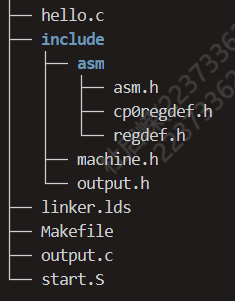
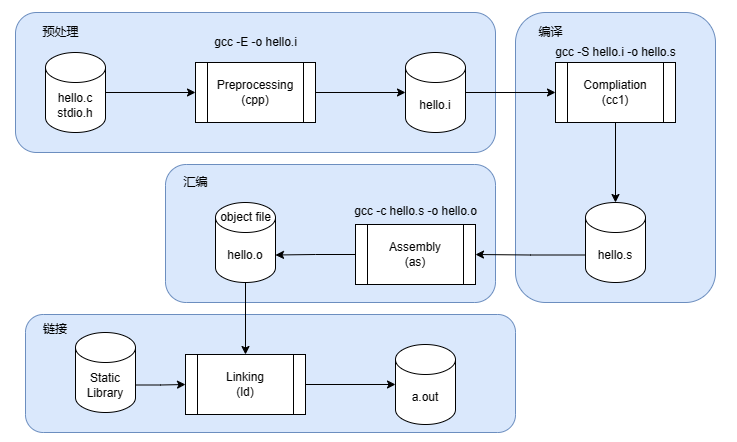

# <center>OS预习题三：MIPS</center>

## 一.思路分析

​	刚开始拿到课程组给出的源文件感觉有点发蒙，我们要补全的代码为```start.S```，文件结构如下



​	和题目有关联的主要文件为需要补全的汇编代码```start.S```，```start.S```中调用```hello.c```以及```output.c```中的函数。这里我们回忆一下编译的过程，如下图



​	这时我刚刚回想起汇编文件是```.c```文件通过编译得到（这里助教推荐汇编文件的后缀名写为```.S```而不是```.s```）。题目的要求是补全汇编代码，具体来说就是为函数分配栈帧。

* **问题1分析**

  首先分析为```print_str```创建栈帧，该函数只传递一个参数。

  ```
   void print_str(const char *buf) {
        for (int i = 0; buf[i]; i++) {
            printcharc(buf[i]);
        }
    }
  ```

​	我在做题目时的疑问是：用不用为函数的返回地址```$ra```创建栈空间呢？这个问题实际上就是要分析```$ra```寄存器的值在函数调用过程中会不会被覆写掉(```jr $ra```返回)。我们现在分析这个代码的调用过程，~~有了上学期的MIPS汇编编写经验，相信会比较轻松~~.```print_str```内部调用```printcharc```，这个调用会改变```$ra```的值，但是我们并不需要考虑维护，**因为这个维护是由编译器进行的**，**不要忘记该段代码为C语言，还在汇编语言的上层，我们如果想要建立起“平等”的视角，需要把该段代码转换为汇编代码，这就是编译器的工作。**故我们经过分析可以知道，在```printstr```每次调用子进程时，编译器都为我们做好了各个寄存器的维护，即最后返回时```$ra```即为初始值，故该段代码我们只需要为其参数分配空间，结束调用后再返还空间（也可以试着脑补把C代码翻译为MIPS，这样就会发现其实翻译过程中会涉及到对```$ra```等寄存器的维护，这其实就是模拟了编译器为其分配栈帧的过程，可能这样会理解的更深入一些？）

```
addiu sp,sp,-4
```

* 问题二分析

  问题二实际上就是考察了如果传递六个参数应当怎样分配栈空间，

  * 前四个参数由寄存器```a0-a3```传递，栈帧中只需要为其分配栈空间，不需要进行存值
  * 后两个参数需要在分配的空间中保存值

  这样六个参数需要24字节

```
addiu sp,sp,-24
lw $<>, 16(sp)
lw $<>, 20(sp)
```

**注：栈是向下生长的，分配栈空间需要将栈指针sp向下移动，填充参数不断向上移动sp**

## 二.补全后代码

```
#include <asm/asm.h>
.data
str:
.asciiz "Hello World\n"  # Null-terminated string "Hello World" stored at label 'str'
.align 2 # align to 4-byte boundary (2^2)
var:
.byte 3 # correctly aligned byte: 3
/* '<x>' in the comments is the part to be replaced. */
/* use '.align <x>' to align the following words to 1-byte boundary (disabling word-alignment) */
/* so that the byte 3 and word 7 is "connected" */
/* Your code here. (1/6) */
.align 0
.word 7, 8, 9

.text
/* We define '_start_mips' here as the entry of our program. */
EXPORT(_start_mips)
.set at
.set reorder
	mtc0    zero, CP0_STATUS
	li      sp, 0x84000000
	/* Load the address of the string 'str' into the first parameter register. */
	la      a0, str
	/* use 'addiu  sp, sp, <x>' to push a proper-sized frame onto the stack for Nonleaf function 'print_str'. */
	/* Your code here. (2/6) */
        addiu   sp, sp,-4 
	jal     print_str
	/* use 'addiu  sp, sp, <x>' to restore stack pointer. */
	/* Your code here. (3/6) */
        addiu   sp, sp,4
	/* Set the first four parameters. */
	li      a0, 0
	li      a1, 1
	li      a2, 2
	li      a3, 3
	/* use 'addiu  sp, sp, <x>' to push a proper-sized frame onto the stack for Nonleaf function 'hello'. */
	/* Your code here. (4/6) */
        addiu   sp, sp, -24
	lw      t1, var	
	li      t2, 5
	/* use 'sw  t1, <x>(sp)' to store t1 at the proper place of the stack */
	/* so that t1 is 5th argument of function hello. */
	/* Your code here. (5/6) */
        sw      t1, 16(sp)
	/* use 'sw  t2, <x>(sp)' to store t2 at the proper place of the stack */
	/* so that t2 is 6th argument of function hello. */
	/* Your code here. (6/6) */
        sw      t2, 20(sp)
	/* use 'j' to call the function 'hello', we use 'j' instead of 'jal' because 'hello' is 'noreturn' */
	j       hello

```

