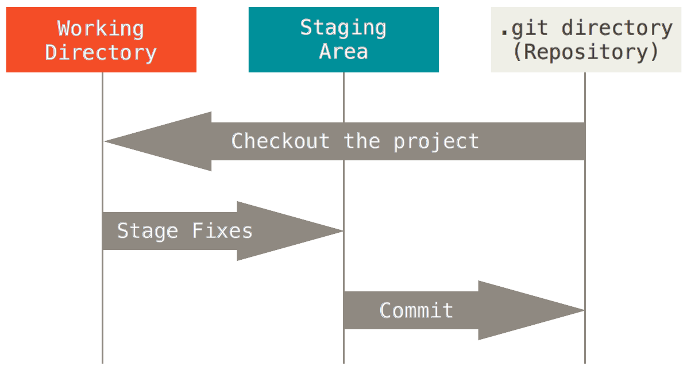
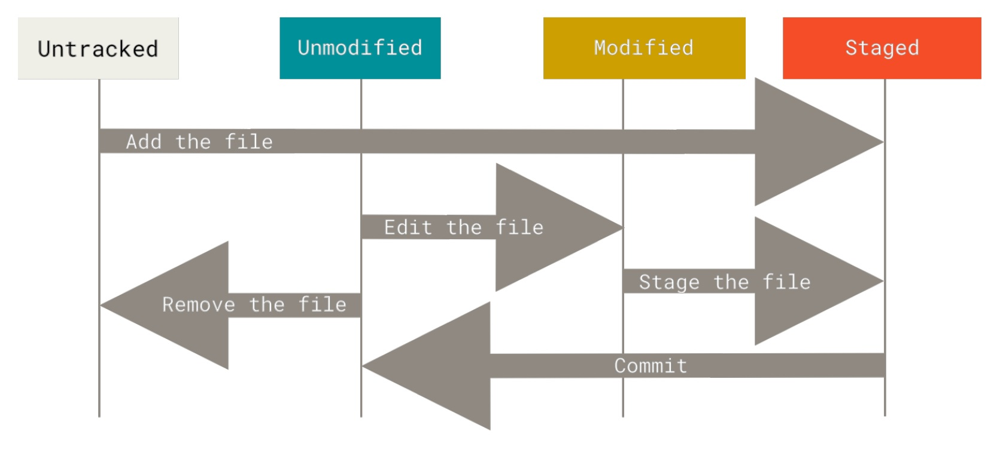

# <center>OSpre——工具介绍</center>

## 1.vim

​	vim为CLI的文本编辑工具，一些常用的操作如下

* **vim有Normal模式和Insert模式**

* 启动vim后默认在Normal模式

  * ```i```进入Insert模式
  * ```esc```进入Normal模式

* 在```Insert```模式下的一些操作

  * ```ctrl + p or ctrl + n```自动补全

* 在```Normal```模式下的一些操作

  * ```x```删除当前光标所在的一个字符

  * ```:wq```存盘+退出

    * ```:w```存盘

    * ```:q```退出

  * 拷贝\粘贴

    * ```v```可视化的选择部分文本

    * ```dd```删除当前行，并把删除的行存在剪贴板里
    * ```p```粘贴剪贴板
    * ```yy```拷贝当前行(ddp)

  * 各种插入模式

    * ```a```在光标后插入（会进入Insert模式）
    * ```o```（小写O）在当前行后插入一个新行

  * 移动光标

    * 方向键移动光标

    * ```0```移动到行头
    * ```$```移动到行尾
    * ```^```移动到本行第一个不是blank字符的位置
    * ```g_```移动到本行最后一个不是blank字符的位置
    * N```G```移动到第N行
    * ```gg```到第一行
    * ```G```到最后一行

  * **搜索**

    * ```/pattern```搜索```pattern```的字符串，```n```切换到下一个
    * ```*```匹配光标所在单词，移动光标到下一个匹配单词
    * ```#```匹配光标所在单词，移动光标到上一个匹配单词

  * 重复命令

    * ```.```重复上一次的命令
    * ```N<command>```重复某个命令N次

  * Undo/Redo

    * ```u``` Undo
    * ```ctrl + r``` Redo

## 2.GCC

​	使用gcc作为C语言编译器

* **用法：gcc [选项] 源代码文件**

* 作用：编译源代码文件

* 默认编译生成文件名为```a.out```

* 运行c语言代码

  ```CLI
  gcc demo.c
  ./a.out
  ```

* 更改代码内容后需要重新编译

## 3.make & Makefile

* make即为“制作”，他是依赖```Makefile```文件进行构建的指令

### Makefile文件的格式

```
<target> : <dependencies>
[tab] <command_1>
[tab] <command_2>
...
[tab] <command_n>
##意为###
如果要构建target首先要准备好dependencies，接着执行command中的命令
```

* target：构建目标，目标文件、可执行文件

  编写完```Makefile```后```make target```即可进行构建

* dependencies：构建目标依赖的其他文件或目标

* command：构建目标的一系列指令

* all：一种约定，同时生成多个目标

  例如使用```make all```同时生成多个可执行文件

  ```
  all: hello bye
  
  hello: hello.c
          gcc -o hello.dqr hello.c
  
  bye: bye.c
          gcc -o bye.dqr bye.c
  ```

  * 注：这里的-o选项意为指定生成文件名称

## 4.ctags

​	提供代码跳转功能，首先修改```~/.vimrc```

```
set tags=tags
set autochdir
```

* 执行```ctags -R *```，产生新文件tags（符号名索引文件）

* 将光标移动到变量上

  * ```ctrl + ]```可以实现跳转
  
  * ```ctrl + o```返回跳转前的位置

## 5.tmux

* 基本概念

  * 会话：打开一个终端窗口输入命令，用户与计算机的临时交互称为“会话”
  * 窗口：会话中打开的终端窗口
  * 窗格：一个窗口可以利用tmux划分为多个窗格

* tmux：会话的重要特点是，窗口与其中启动的进程是连在一起的，打开窗口会话开始，关闭窗口，会话结束。**tmux可以实现会话与窗口的分离，窗口关闭时，会话并不终止，而是继续运行，等到以后需要的时候，再让会话“绑定”其他窗口**

* tmux基本操作

  * ```tmux```

    直接启动tmux窗口，对应会话编号从0开始

  * ```tmux new -s <name>```

    新建指定名称的会话

  * ```tmux detach```

    当前会话与窗口分离，**会话和其中的进程在后台运行**

    或快捷键```ctrl + B``` + ```D```，tmux快捷键操作中```ctrl + B```为默认前缀键

  * ```tmux ls```

    列出所有tmux会话

  * ```tmux attach -t <session-id>/<session-name>```

    接入已经存在的会话

  * ```tmux kill-session -t <session-id>/<session-name>```

    杀死某个会话

  * ```tmux rename-session -t <session-id>/<session-name>```

  * ```tmux switch -t <session-id>/<session-name>```

  * ```ctrl + B``` + ```%```，窗口左右划分

  * ```ctrl + B``` + ```"```，窗口上下划分

  * ```ctrl + B``` + ```方向键```根据按键方向切换到窗格

  * ```ctrl + B``` + ```X```关闭正在使用的窗格

  * ```ctrl + B``` + ```space```切换窗格布局

## 6.git

* OOpre中涉猎过，以下内容从OS教程网站上复制下来

#### Git 中的三种储存位置

Git 中的三种储存状态分别是：工作区（Working Directory）、暂存区（Staging Area）和储存库（Repository）。

一般来说，一个项目在 Git 中是以目录的形式存在的，这个目录包含了**工作区**（`.git` 子目录之外的内容）和**储存库**（`.git` 子目录）。工作区可以理解为“目前正在编辑的版本”，储存库储存在一个隐藏目录 `.git` 中（因为它以 `.` 开头，所以是隐藏的），用来存放提交过的所有版本的内容及其联系。**暂存区**存放了已经确定修改但尚未提交的文件。暂存区的信息理论上也储存在 `.git` 目录中，但是在用途上和储存库有区别，因此和储存库的概念区分开来。有关暂存区的详细概念，可以在下一节中了解到。下图是三种储存位置的转移关系，有关图中的操作，在后文中都有介绍。



#### Git 中文件的四种储存状态

一个文件，在 Git 目录中有以下四种状态：

- 未跟踪（Untracked）：一个文件在储存库的版本信息中没有被记录过。比如在储存库中新建了一个文件，这个文件现在就是未跟踪的状态；在一个非空目录下使用 `git init` 来初始化一个空储存库，此时这个目录下的所有文件都处于未跟踪的状态。
- 未修改（Unmodified）：一个文件在跟踪之后一直没有改动过，或者改动已经被提交（即工作区的内容和储存库中的内容相同），则处于未修改状态。当我们修改这个文件时，则会使这个文件变成已修改状态。
- 已修改（Modified）：一个文件已经被修改（即工作区的内容和储存库中的内容不同），但还没有加入（`git add`) 到暂存区中。
- 已暂存（Staged）：一个文件已被加入暂存区。加入暂存区意味着将一个已修改的文件加入下次提交（`git commit`）需要存入储存库的文件清单中。

四种状态的转换关系如下图所示（图片来自 [Pro Git](https://git-scm.com/book/zh/v2)）：



#### Git 常用命令

这一部分将对实验中的常用命令进行简单介绍。

#### `git init`

`git init` 会自动把当前目录变成一个空的 Git 仓库，这样就可以对当前目录下的内容进行版本管理了。

#### `git clone`

`git init` 创建一个新的储存库，而 `git clone <URL>` 则是“克隆”一个已有的储存库到当前目录下。通常我们会从一个互联网地址（即 URL，统一资源定位符）进行克隆，所以一般这种操作可以理解为“下载”。

#### `git status`

这个命令可以查看当前分支的状态，以及当前工作区的变动和暂存区的内容，便于我们对工作区的概况进行掌握。

#### `git add`

使用这个命令，可以把一个新文件或者已经修改过的文件加入暂存区中。在你完成一部分实验内容之后，可以使用 `git add .` 将你的所有修改加入暂存区，也可以使用 `git add <filename>` 来将指定的文件加入暂存区。

#### `git restore`

我们在修改一个文件之后，可能想要放弃这个修改。当这个文件还没有通过 `git add` 加入暂存区时，我们可以使用 `git restore <filename>` 来撤销对这个文件的修改，使其退回到上一个 commit 的状态。如果这个文件已经加入了暂存区，我们可以通过 `git restore --staged <filename>` 来取消暂存。

#### `git checkout`

这个命令涉及到分支的知识，分支的概念在这里不会详细介绍，感兴趣的同学可以参考 [Pro Git](https://git-scm.com/book/zh/v2)。在我们的实验课程中，可能会涉及在各个 Lab 中进行切换。这时，使用 `git checkout lab<x>` 可以切换到相应的分支。

请注意，在切换时，需要保证目前所有文件的状态均为“未修改”（没有修改过，或者已经提交）。

#### `git commit`

使用 `git commit -m <message>` 这个命令将暂存区的修改提交到储存库中。当 message 参数有空格时需要把 message 用引号括起来。在提交时，要求给出一段说明性文字。这段文字可以任意填写，但建议按照提交内容填写，以保证多人协作时的可读性。本实验不会涉及多人协作，所以方便自己开发即可。

#### `git push`

这个命令将本地的 commit 推送到一个远程仓库。在课程实验中，这个命令可以将你的 commit 推送到 GitLab。

#### `git pull`

这个命令将远程新建的分支下载到本地，并且将远端的更改合并到当前的分支。在利用评测机进行实验分支的初始化之后，可以在开发机中使用这个命令来将新的分支下载到本地。

## 7.shell编程

* shell脚本：一条一条命令组合起来，放到一个文件中，并且可以直接运行这个文件

* **Linux中没有扩展名的概念**，约定脚本文件的文件名都以```.sh```结尾(加不加对运行无影响)

* 运行脚本

  ```./文件名```

* 为脚本添加执行权限

  ```chmod +x 文件名```

#### shell语法基础

##### 1.变量

* shell是弱类型语言，定义变量时无需指定类型

```
var_name=value(不能用空格间隔)
```

* 例如

  ```
  #!/bin/bash
  # my first shell script
  str="Hello, world!"
  echo ${str}
  ```

* ```#!```为shebang,shebang后边的内容为脚本文件的解释器
* ```#```注释开头
* ```echo```输出命令
* ```$var_name```为获取变量的值，更规范的写为```${var_name}```

##### 2.脚本参数

* 执行语句中，参数以空格分隔，每一个参数在脚本中都是一个字符串变量。**第一个参数映射到变量名 `1`，第二个参数映射到变量名 `2`，以此类推**（**参数变量名只能为顺序的1234，不能随便起**）

* 上例中的脚本增加参数

  ```
  #!/bin/bash
  str="Hello, $1 and $2!"
  echo $str
  ```

  **需要注意的是向字符串变量中传递参数字符串变量需为双引号**

* 其他特殊变量

  * ```$#```传递的参数个数
  * ```$*```一个字符串，内容是传递的全部参数

##### 3.条件与循环

###### if

* **条件语句结尾fi表示if语句块结束**
* 需要注意的是除了else分支外其他分支需要加```then```

```
if condition1
then
    command11
    command12
    ......
elif condition2
then
    command21
    command22
    ......
else
    command31
    command32
    ......
fi
```

###### while

* ```done```表示语句块结束

```
while condition
do
    command1
    command2
    ...
done
```

* 对于循环变量的更新
  * ```i=1```初始化循环变量
  * ```let i=i+1```或```i=$((i+1))```更新循环变量

##### 4.函数

* 定义方式

  ```
  function fun_name() {
      body...
      return int_value;
  }
  ```

  * 返回语句可选，返回值范围[0-255]整数
  * 函数体内第N个参数通过```$N```获取，当N>=10使用```${N}```
  * 若函数有返回值，在函数调用后使用```$?```获取返回值

* 调用方法

  ```
  fun_name param1 param2 ... paramN
  ```

#### sed命令编辑和输出文本

* **用法：sed [选项] ‘命令’ 文本**

* 选项

  * ```-n```安静模式，只显示经过sed处理的内容，否则显示文本的全部内容
  * ```-i```直接**修改读取的文件内容**，而不是输出到屏幕。否则只输出不编辑

* 命令

  * ```<行号>a<内容>```,在行号下面插入一行文本

    关于行号

    * “数字”：在这一行后新增
    * “起始行，终止行”：在范围内每一行后新增
    * 省略行号：每一行新增
    * "$"：最后一行后新增

  * ```<行号>c<内容>```，用内容取代相应行的文本

  * ```<行号>i<内容>```，在当前行的上面插入一行文本

  * ```<行号>d```，删除该行内容

  * ```<行号>p```,输出该行内容

  * ```s/<re>/<string>/```将对应行中正则表达式```<re>```匹配的内容替换为```<string>```

    * 此项为针对整个文本进行替换
    * 形如```'s/str1/str2/g'```则对文本中整行范围内的str1替换为str2
    * 形如```'s/str1/str2/'```则对文本中每行中第一个匹配的str1替换为str2

#### 重定向

* 重定向：命令输出结果输出到文件中```N>```

* Linux中定义的三种流

  * stdin:用0表示
  * stdout:用1表示
  * stderr:用2表示

* 将标准输出保存到文件中，使用```1>```例如

  ```ls > lsoutput.txt```或```ls 1> lsoutput.txt```

* 将标准错误输出保存到文件中，使用```2>```例如

  ```gcc 2> gccerr.txt```

* 问题：尝试自己写一个接受标准输入的 C 语言程序

  解决：将输入文件喂给编译好的可执行程序```<```

  ```
  ./scanf.out < input.txt
  ```

#### 管道

* 对命令进行连接，上一个命令的输出为下一个命令的输入
* ```command1|command2|command3```

