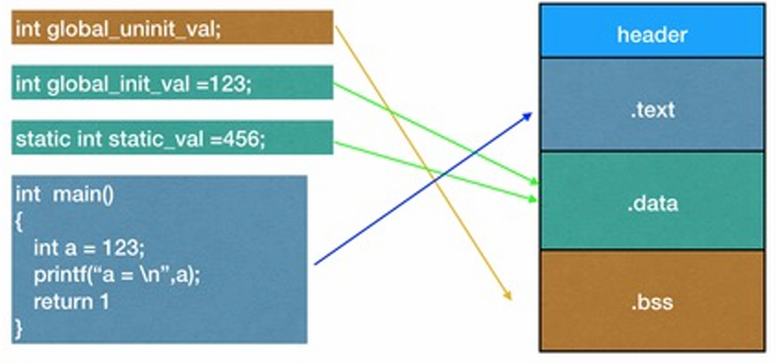

# OS理论期中考试复习

## 一.引论

### 1. 操作系统定义

* 操作系统是一组**管理计算机硬件资源的软件集合**，他向计算机程序提供共性的服务

### 2. 操作系统发展史

* 电子管时期：软件：手工修改硬件逻辑单元连接
* 解决人和CPU的矛盾：软件和硬件分离

#### 2.1 批处理系统

* 加载在计算机上的一个系统软件，在他的控制下，计算机能够自动地、成批地处理一个或多个用户的作业
* 用户将一批作业提交给操作系统后就不再干预

##### 2.1.1 联机批处理系统


* 在主机和输入机之间增加一个存储设备——磁带，在运行于主机的**监督程序(OS)的自动控制**下，计算机可自动完成：成批地把输入机上的用户作业读入磁带，依次把磁带上的用户作业读入主机内存并执行，然后把计算结果向输出机输出。完成了上一批作业后，监督程序又从输入机上输入另一批作业，保存在磁带上，重复处理
* 优点：监督程序不停地处理各个作业，实现了作业到作业的自动转接，减少了作业建立时间和手工操作时间，克服了人机矛盾。
* 缺点：**CPU与慢速的外设之间的矛盾：在作业输入和结果输出时，主机的高速CPU需要等待慢速的输入输出设备完成工作，主机处于“忙等”状态**

##### 2.1.2 脱机批处理系统


* 增加一台不与初级直接相连而是与输入输出设备打交道的卫星机
* 优点：主机不直接与慢速的输入输出设备打交道，而是与速度相对较快的磁带机发生关系，**主机与卫星机并行工作**，发挥主机的高速计算能力
* 缺点：主机内存中仅存放一道作业，每当该作业运行期间发生输入输出请求后，高速的CPU便处于等待低速的IO完成状态，COU空闲

#### 2.2 多道程序系统

> 多道程序设计技术，**指允许多个程序同时进入内存并运行**。即同时把多个程序放入内存中，并允许他们交替在CPU中运行，共享系统中的各种硬软件资源

* **当一道程序因为IO请求而暂停运行时，CPU便立即转去运行另一道程序，不同程序间的切换运行**
* 使CPU得到充分利用,同时改善IO设备和内存的利用率，提高整个系统的资源利用率和系统吞吐量


* **宏观上并行**：进入系统的几道程序都处于运行过程中，都开始了各自的运行，但都未运行完毕
* **微观上串行**：各道程序轮流地使用CPU，并交替运行

#### 2.3 单道程序系统

> 内存中只有一道程序，存在计算时IO设备空闲或进行IO操作时CPU空闲


#### 2.4 多道批处理系统

* 多道：系统内可同时容纳多个作业
* 成批：在系统运行过程中，不允许用户与其作业发生交互

* 优点：系统吞吐量大，资源利用率高
* 缺点：平均周转时间长，**单个用户不能交互，多用户使用和单独控制的矛盾**

#### 2.5 分时系统


* 分时技术：把处理机的运行时间分成很短的时间片，按时间片轮流把CPU分配给各联机作业/程序使用，**给不同的用户提供程序的使用**
* 一台计算机同时连接多个用户终端

* 特点
  * 多路性：宏观上看多个用户并行工作，微观上看是各用户轮流使用计算机
  * 交互性：用户可以根据系统对请求的响应结果，进一步向系统提出新的请求(交互式系统)
  * 独立性：用户之间相互独立，互不干扰
  * 及时性：系统对用户的输入及时作出响应

#### 2.6 网络操作系统

* 传统单机OS上加单独软件层，提供联网功能和资源的远程访问，多机互联

#### 2.7 分布式操作系统

* 多台机器统一管理形成单一系统

#### 2.8 实时系统

* 在某个时间限制内及时完成某些及时任务不需要时间片排队

### 3. 操作系统的基本实现机制

* 用户态和内核态

  

* 用户态和内核态所在的**内存空间**不一样

* CPU的**运行状态**不一样

* 指令的**执行权限**不一样

* **从用户态转入内核态**

  * 中断(```Interrupt```)：来自外部设备的中断请求，**当中断请求到来时，CPU自动进入系统态，并从系统空间某个预定地址开始执行指令(中断处理程序)**，中断发生在两条指令之间
  * 错误(```Fault```)：**执行指令失败时引起Fault，CPU进入内核态**，在系统空间中对错误进行处理，错误发生在执行一条指令的过程中
  * 自陷(```Trap```)：中断和错误都是CPU被动地进入内核态，**自陷是CPU通过自陷指令主动进入内核态，系统调用函数一般是靠自陷指令实现的**

## 二.启动

> boot : 
>
> 硬件启动依赖软件：通过程序控制使得计算机硬件进入特定工作状态
>
> 软件运行依赖硬件：程序必须运行在设置好工作模式的硬件环境上
>
> 通过软件逐步设置硬件
>
> 

* 加载BIOS(```basic input/output system```)

  * 设备启动顺序信息，硬盘信息，硬件自检等

* 读取MBR(```master boot record```)

  * 主引导记录MBR：第0磁头第0磁道第一个扇区，包含```bootloader```

* 运行```bootloader```

  * 初始化硬件设备，建立内存空间映射图

* 加载内核

  * 读取内核镜像，解压缩

    

* 用户层init依据inittab文件设定运行等级

* init进程执行rc.sysinit

* 启动内核模块

* 执行不同运行级别的脚本程序

* 执行/etc/rc.d/rc.local

* 执行/bin/login程序，进入登录状态

## 三.内存管理

### 1. 存储管理的数据结构

#### 1.1 位图表示法

* 给每个分配单元对应一位，用来记录该分配单元是否闲置
* 位取值为0表示单元闲置，取值为1表示已被占用


#### 1.2 链表表示法

* 将分配单元按照是否闲置链接起来（空闲链表）


### 2. 连续分配存储管理方式

#### 2.1 单一连续分配方式

* **只用于单用户单任务的OS**
* 内存分为两个区域：系统区、用户区
* **应用程序装入到用户区，可使用用户区全部空间**
* 缺点：对内存空间少的程序，造成内存浪费；程序全部装入，很少使用的程序部分也占用内存

#### 2.2 分区式分配

> 把内存分为一些大小相等或不等的分区，**每个应用程序占用一个或几个分区**，操作系统占用其中一个分区，**支持多个程序并发执行**

##### 2.2.1 固定式分区

* 当系统初始化时，把存储空间划分成若干个任意大小的固定区域；然后把这些区域分配给每个用户作业
* 把内存划分为**若干个固定大小的连续分区**
  * **分区大小相等**：只适合于多个相似程序的并发执行
  * **分区大小不等**：多个小分区，适量中等分区，少量大分区，根据程序大小分配
* 缺点：
  * 产生**内碎片**：**分区内部难以利用的空间(这部分空间已经被分配出去只是没被利用)**
  * 分区总数固定，并发限制执行的程序数目
* 数据结构：分区表——记录分区的大小和使用情况

##### 2.2.2 可变式分区

* 分区的边界可以移动，即分区的大小可变
* 分区的大小**在程序装入时动态确定**
* 缺点：
  * 不会产生内碎片，但产生外碎片(**分区之间难以利用的空间，还没被分配**)
* 数据结构：内存分配表
  * 已分配区表
  * 空闲区表

##### 2.2.3 可变式分区的内存分配策略

* **最佳适应算法(Best Fit)**：为一个作业选择分区时，选择**大小最接近**于作业所要求的存储区域
* **最坏适应算法(Worst Fit)**：为作业选择存储区域时，总是寻找**最大**的空白区
* **首次适应算法(First Fit)**：每个空白区按其在存储空间中地址递增的顺序连在一起，在为作业分配存储区域时，**从这个空白区域链的始端开始查找，选择第一个足以满足请求的空白块**
* **下次适应算法(Next Fit)**：存储空间中空白区构成一个**循环链**，每次为存储请求查找合适的分区时，**总是从上次查找结束的地方开始**，只要找到一个足够大的空白区，就将他划分后分配出去

##### 2.2.4 可变式分区的内存回收

> 若回收区上下的地址空间是空闲区则进行合并

* 回收空闲区域时，空闲表项区数减一的情况：上下都是空闲

  

##### 2.2.5 基于索引搜索的分配算法

* 基于顺序搜索的动态分区分配算法一般只是适合于较小的系统，如果系统的分区很多，空闲链表很长，检索速度会比较慢

##### 2.2.6 快速适应算法

* 把空闲分区按照容量大小进行分类，经常用到长度的空闲区设立单独的空闲区链表
* 优点：查找效率高，依据程序的长度，寻找到能容纳他的最小空闲区链表，取下第一块进行分配即可
* 缺点：分区归还主存时算法复杂

##### 2.2.7 伙伴系统（Linux系统采用，较为重要）

* 伙伴系统是介于固定分区与可变分区之间的动态分区技术，**动态划分和合并2的幂大小的分区**
* 在分配存储块时，将一个大的存储块分裂成两个大小相等的小块，即为伙伴
* 已分配分区或空闲分区的大小均为2的幂次（向上取整）
* **内存管理模块保持有多个空闲块链表**
* 回收内存时首先考虑将**被释放块与其伙伴合并成一个大的空闲块**，然后继续合并下去，直到不能合并为止（不能与除了伙伴之外其他合并）

##### 2.2.8 动态分区管理内存回收——紧凑技术

* 通过移动作业(一个方向)把多个分散的小分区拼接成一个大分区来消除外部碎片


### 3. 扩充内存容量 

#### 3.1 覆盖技术

* 一个程序的代码段和数据段**按照时间先后占用内存空间**
* 必要的部分占据内存，可选的部分放外存
* 缺点：增加编程复杂度，必须了解程序模块之间的覆盖关系，调用次序

#### 3.2 交换技术

* 交换就是把暂时不用的某些程序及其数据的部分或全部从主存移到辅存中去，接着把指定程序或数据从辅存读到相应的主存中
* 换入换出


### 4. 重定位

#### 4.1 重定位

> 确定可执行文件中代码和数据的运行时地址,地址空间的程序和数据经过地址重定位处理后，就变成了可由CPU直接执行的绝对地址程序

* 在编译、链接和装载的过程中，对程序指令和数据的修改或映射

* 编译时重定位（**静态重定位**）

  * 如果在编译时就知道给程序分配的物理地址，直接生成包含物理地址的代码，**装入其他地址需要重新编译**

* 装载时重定位（**静态重定位**）

  * 装载程序时，将指令和数据的地址转换为物理地址，但降低了装载速度

    

* 执行时重定位（**动态重定位**）

  * 在每次访问内存单元前进行地址变换
  * 程序执行时，基址寄存器存放程序的首地址，界限寄存器存放程序的长度
  * 程序执行时，不论是取指令还是数据，硬件自动将逻辑地址加上基址

#### 4.2 pa && va

> 逻辑地址空间是一个进程用来访问内存的一组地址，是对内存的抽象，
>
> 不同进程的地址空间相互独立
>
> **程序中使用的地址是逻辑地址空间中的地址，但在访问内存前必须映射为物理地址，这个转换由MMU完成**

### 5. 代码段

> 一个程序都是由bss段，data段，text段三个节(section)组成的
>
> .bss : 保存未初始化的**全局变量和静态变量**static
>
> .data : 保存已初始化的全局变量和静态变量
>
> .text : 保存可执行文件的操作指令
>
> 

#### 堆和栈

> 堆向上生长，栈向下生长


* 栈(stack)：存放、交换临时数据的内存区
  * 用户存放程序**局部变量**的内存区域，**但不包括static声明的静态变量**
  * 保存/恢复调用现场（函数调用参数压栈）
* 堆(heap)：存放进程运行中动态分配的内存段
  * 进程调用malloc等函数分配内存时，新分配的内存被动态见加到堆上
  * 利用free等函数释放内存时，被释放的内存从堆中被剔除

#### 总结代码中各数据存储位置（考过）

* ```.bss```段：未初始化的全局变量或静态变量
* ```.data```段：已初始化的全局变量或静态变量
* ```.text```段：保存可执行文件的操作指令
* 栈：局部变量
* 堆：动态分配内存，如```malloc```

#### 链接过程的本质

> 链接过程的本质是合并各个代码中的同类section,并将这些section合并为segment


### 6.程序的装入和链接

* 编译
* 链接
  * 静态链接：在编译阶段直接把静态库加入到可执行文件中，可执行文件比较大
  * 动态链接：链接阶段只加入描述信息，程序执行时再从系统中把相应动态库加载到内存中
* 装入

### 7. 页式内存管理

#### 7.1 基本概念

* 页：把每个作业的地址空间分为**大小相等的片**，称之为页

* 页框：把**主存的存储空间**也分成**与页面相同大小的片**

* 页表：逻辑地址空间中的每一页在页表中都对应有一个**页表项**，

  实现**页面到页框的映射**

* **需要注意页大小与块大小相等！即虚拟页面大小与物理页面大小相等（考过）**

* 地址结构

  ```
  页号/块号 + 块内位移
  ```

* 页表查找

  

  * **页表定位（考过）**：页表始址+页号*页表项长度

#### 7.2 两级页表

* 一级页表（页目录）

* 二级页表（页表）

* **必须调入页目录，动态调入二级页表，节省内存空间**

* 地址结构

  

* 地址变换

  

  

#### 7.3 TLB 快表

> 快表是页表的Cache，首先检索TLB，若不命中再查询页表
>
> 设计根本目的是减少一次内存访问时间，换为更快的Cache
>
> 命中率计算访存平均时间问题
>
> * TLB命中t1
> * TLB缺失t2
> * TLB命中率 p
> * average = p * t1 + (1-p) * t2


#### 7.4 反置页表

* 每个页框一个页表项，而不是每个页一个页表项
* 依据物理页面号来组织，表项内容为逻辑页号P和隶属进程标志符pid
* 
* 反置页表的大小**只与物理内存的大小**有关
* 缺点：不能依据虚拟地址查找，而需遍历整个表来寻找匹配

#### 7.5 哈希页表

> 用链表法处理计算虚拟页号哈希值的哈希冲突

* 对虚拟页号做哈希值，为了处理哈希冲突，哈希页表的每一条目都包含一个链表，链表中的每一个元素有三个域
  * 虚拟页号
  * 所映射的页框号
  * 指向下一个元素的指针
* 首先计算CPU发射的虚拟地址中虚拟页号的哈希值，定位到哈希表项
  * 遍历链表查找，用虚拟页号与链表中每一个元素的第一个域比较


* 链表平均长度：物理页框数/哈希表大小
  * 搜索速度加倍：链表平均长度 0.5

### 8. 段式内存管理(略)

### 9. 局部性原理

* 时间局部性：一条指令的一次执行和下次执行，一个数据的一次访问和下次访问都集中在一个较短时期内
* 空间局部性：当前执行指令和临近的几条指令，当前访问的数据和临近的数据常会被集中访问

### 10.虚拟存储器

> 指具有请求调入功能和置换功能，能从逻辑上对内存容量加以扩充的一种存储器系统

* 物理内存和外存相结合，提供大范围虚拟地址空间
* 程序当前需要执行的部分页或段读入到内存
* 需要执行的指令或数据尚未在内存，将对应的页或段调入到内存后继续执行
* 将暂时不使用的页或段调出保存在外存上

### 11.请求分页（段）系统

> 请求调页功能 页面置换功能

#### 11.1 缺页中断

> 要访问的物理页不在页表中(不在主存中)，需要从外存中调入


#### 11.2 页面调入策略

*  请求调页：只调入发生缺页时的页面，但是根据局部性原理，很可能会访问缺页附近的页，容易产生较多的缺页中断

* 预调页：在发生缺页需要调入某页时，**一次调入该页以及相邻的几个页**

#### 11.3 页面置换算法

> 需要调入页面时，内存中哪个物理页面被置换

* 最佳算法(```OPT```)：选择未来不再使用的或离当前最远位置上出现的页面被置换

  * 每次需要替换时替换**最长时间内不再被访问**的页面 (往后边的页面序列读，最后读到哪个已经在分配页框中的页面就替换哪个) 

  * 是一种理想情况，用于性能评价的依据

* 最近未使用页面置换算法(```NRU:not recently used```)：

  * 使用：读(```R```)/写(```M```)
  * 淘汰最近一个时钟周期没有被访问的已修改页面比淘汰一个频繁使用的干净页面要好
  * **硬件记录引用位R和修改位M**
  * 时钟每个周期清除R
  * class 0 : R = 0 , M = 0
  * class 1 : R = 0 , M = 1
  * class 2 : R = 1, M = 0
  * class 3 : R = 1, M = 1
  * 从编号最小的类中挑选一个淘汰
  * **注：RM构成的二进制即为编号**

* 先进先出算法(```FIFO:first in first out```)：总是把最先装入内存的一页调出（循环链表、指向最早页面指针）

* 二次机会页面置换算法（改进FIFO）

  > 对FIFO的改进：检查最老页面的R位，给最老页面一个“二次机会”
  >
  > 则第一个R位为0页面会被替换

  * R=0，最近没用，淘汰
  * R=1，把R清0后，更新装入时间，放在链表最后（或循环链表）

* 时钟算法```Clock```

  * 检查当前指向节点R位
    * 为1：清0，向前移动
    * 为0：置换出去，新置换页面R位置1，指针移动到新置换页面下一个节点

  

* 最近最久不用页面置换算法(```LRU:least recently used```)：

  * 选择最近一段时间内最久不用的页面予以淘汰
  * **性能接近最佳算法**
  * 页面使用时间先后关系：**全局计数器，每个指令自增**
  * **每个页面对应页表项保存一个相应的计数器，每当一个页面被访问时，全局硬件计数器赋值相应的计数器，替换计数器值最小的页面**

* 最不常用算法(```NFU:not frequently used```)：选择到当前时间为止被访问次数最少的页面被置换

  * 每页设置计数器记录被访问次数，淘汰计数值最小的页面

* ```Aging```算法

  * 计数器每次右移一位，R位(0/1)添加到最左边，即新的访问具有更高的权值
  * 计数器值最小的页面被替换

  

* 页面缓冲算法(```page buffering```)

  * 对被置换页面的缓冲，有机会找回刚被置换的页面

* 工作集策略(```working set```)

  * 进程在任一个时间t，都存在一个集合，包含最近k次内存访问过的页面，这个集合W(k,t)即称为工作集

  * 依据工作集，预测使用页面提前调入内存，降低缺失率

  

  * **当发生缺页时，淘汰一个不在工作集的页面**

### 12. 页目录自映射


## 四.进程与线程

### 1. 进程管理

#### 1.1 并发与并行

> 并发：程序的并发执行是指若干个程序**同时在系统中**运行，这些程序的执行在时间上是重叠的
>
> 并行：两个程序在同一时间度量下同时**运行在不同的处理机上**，则称这两个程序是并行执行的
>
> 

* 数据竞争：多个进程在没有同步保护的情况下**访问同一个共享变量，而且至少有一个是写**
* **并行性的确定——Bernstein条件**
  * $R(Si):Si的读子集$​
  * $W(Si):Si的写子集$
  * 两个进程S1和S2可并发当且仅当只有两进程的读子集可重合，进程之间读写集，写写集交均为空

#### 1.2 进程

* 进程是程序在一个数据集合上独立运行的过程，**是系统进行资源分配和调度的一个独立单位**
* **动态性**：**生命周期**：产生、执行、消亡
* 并发性：多个进程同时存在于内存中，能在一段时间内同时运行
* 独立性：进程是独立运行的基本单位
* 制约性：进程之间相互制约
* 结构特征：程序段、数据段、进程控制块PCB
* 一个进程包括
  * 程序的代码
  * 程序的数据
  * PC中的值
  * 通用寄存器的值，堆、栈
  * 一组系统资源

#### 1.3 进程控制

* **由操作系统内核来实现**：创建和撤销进程以及实现进程的状态转换


* 进程创建
  * 系统初始化
  * 通过已存在的进程创建
  * 用户创建一个作业
  * 提交一个批处理作业
* 进程撤销
  * 进程正常结束
  * 给定时限到
  * 出错或失败
  * 进程执行中止服务请求
  * 用户退出登录
* **原语**：由若干条指令所组成的指令序列，来实现某个特定的操作功能
  * **指令序列是连续的，不可分割**
  * **必须在内核态（管态）下执行**，且常驻内存
  * **不可中断**
  * **执行时关闭中断实现**
  * 创建原语```fork,exec```
  * 撤销原语```kill```

* 创建子进程:```Fork```

  * fork函数执行完毕后，如果创建新进程成功，则出现两个进程，一个是子进程，一个是父进程（**调用一次返回两次**）
  * 在子进程中,fork函数返回0
  * 在父进程中,fork函数返回新创建子进程的进程ID
  * 出现错误，返回负值

* 进程运行状态

  * 就绪状态：进程已获得除处理机外的所需资源，等待分配处理机资源；只要分配CPU就可执行

  * 执行状态：占用处理机资源

  * 阻塞状态：正在执行的进程由于发生某种事件而暂时无法执行

  * **从运行状态到阻塞状态的转换是由进程自身决定的（考过）**

    

    **就绪态不会转换到阻塞态，只有运行态才能进入阻塞态**

  * **进程被唤醒：就绪态**

  * 若内存中有N个进程

    * 运行状态最多1个，最少0个
    * 就绪状态最多N-1个，最少0个
    * 等待状态最多N个，最少N-1个

* **进程控制块PCB**

  * **进程标识符（进程id/父进程id）**
  * 程序和数据地址
  * **当前状态：就绪 运行 阻塞**
  * **现场保护区**
  * 同步与同步机制
  * 优先级
  * **资源清单（IO设备，打开的文件列表）**

### 2. 线程

> 多进程场景下通信和共享数据的困难

* 进程包含了两个概念：资源拥有者和可执行单元
* 资源拥有者称为进程
* 可执行单元称为线程，只包含必不可少的少量资源
* **与同进程的其他线程共享进程拥有的所有资源**
* **一个进程可以拥有多个线程，一个线程只能属于一个进程**
* **进程是资源分配的基本单位，线程是处理机(CPU)调度的基本单位(考过)**
* **线程除了共享进程的数据，还有自己的堆栈**
* **线程不能单独执行，必须组成进程才能被执行**

#### 线程的实现方式

##### 1. 用户级线程

* **线程在用户空间**，通过library模拟实现的thread，不需要或仅需要极少的kernel支持
* **用户级的线程库**
  * 创建和销毁线程
  * 线程之间传递消息和数据
  * 调度线程执行
  * 保存和恢复线程上下文
* 只需要线程库支持，与内核无关
* 很多系统调用会引起阻塞，内核会因此阻塞所有相关的线程，**即用户级线程可以进行系统调用(考过)**
* 内核只能将处理器分配给进程，即使有多个处理器也无法实现一个进程中多个线程的并行执行


##### 2.内核级线程

* kernel有好几个分身，每一个分身可以处理一件事情
* kernel对每一个异步时间产生一个线程来处理
* 内核可以在多个处理器上调度一个进程的多个线程实现同步并行执行
* 阻塞发生在线程级别


##### 3.混合实现

* 系统实现内核级线程
* 用户使用用户级线程
* 实现从用户空间的线程到内核空间线程的多路


##### 用户级和内核级的比较

* 在只有用户级线程的系统内，CPU调度还是以进程为单位
* 在有内核支持线程的系统内，CPU调度以线程为单位
* 内核级线程是OS内核可感知的，用户级线程是OS内核不可感知的
* 用户级线程的创建、撤销和调度**不需要OS内核的支持**，在语言或用户库这一级处理
* 内核线程的创建、撤销和调度都需要OS内核提供支持
* **用户**级线程执行**系统调用**指令时将导致所属**进程被中断**
* **内核**级线程执行**系统调用**指令只导致该**线程被中断**
* **内核线程切换需要进入到内核态，比用户级线程切换效率低(考过)**

### 3. 进程调度

#### 度量指标的定义

* 吞吐量：作业数/总执行时间
* 周转时间：完成时间-提交时间
* 带权周转时间：周转时间/执行时间
* 平均周转时间：一组作业周转时间之和/作业数
* 平均带权周转时间：一组作业带权周转时间之和/作业数

#### 1. 批处理系统中常用的调度算法

* 先来先服务(```FCFS:first come first serve```)：
  * 按照作业提交或进程变为就绪状态的先后次序进入就绪队列排队，按队列次序分派CPU
  * 当前作业或进程占用CPU，直到执行完或阻塞才让出CPU(**非抢占)**
  * 作业或进程被唤醒后放到就绪队列尾部
  * 有利于计算密集作业和长作业，不利于IO密集作业
* 最短作业优先(```SJF:shortest job first```)：对**预期执行时间短**的作业优先分派处理机(**非抢占：在每个作业执行完之后选择最短的作业**)
  * 减少平均周转时间，提高吞吐量
  * 对长作业不利
  * 周转时间最优

* 最短剩余时间优先(```SRTN:shortest remaining time next```)：

  * **抢占式：在新作业到来时选择最短的作业**：当一个新进程到达时，如果他比当前运行进程具有更短的完成时间，系统抢占当前进程，选择新就绪的进程执行

  * 长任务长时间不能运行，饥饿现象

  

* 最高响应比优先(```HRRN:highest response ratio next```)：
  * 既考虑作业的运行时间又考虑作业的等待时间（**非抢占式**）
  * 每次进行调度时，计算作业队列中每个作业的优先级，选择优先级最大的运行
  * 优先级 $response-priority: RP = 1 + waittime/needtime $

####  2.交互式系统的调度算法

* 时间片轮转算法(```Round Robin```)

  * 将就绪进程按照FCFS原则排成一个队列
  * 每次调度时将CPU分派给队首进程，让其执行一个时间片
  * 在一个时间片结束时，发生时钟中断（**抢占式**）
  * 时钟中断发生时进程还在运行，就送到就绪队列的末尾

* 优先级调度(```priority scheduling```)

  * 赋予每个进程不同优先级，高优先级先运行
  * 静态优先级
    * 进程创建时指定，运行过程中不再改变
  * 动态优先级
    * 运行过程中动态改变优先级

* 多级队列算法(```MQ```)

  * 分类为多个就绪队列

* 多级反馈队列算法(```FMQ```)

* **优先级倒置(考过)：优先级抢占式调度算法+临界资源导致**

  > 当高优先级进程Task A 要进入临界区使用临界资 源X时，如果已经有一个低优先级进程Task C 正 在使用该资源
  >
  > 这种情况是怎么形成的呢，假如有三个完全独立的进程P1,P2,P3。P1的优先级最高依次减小，P3优先级最低。P1和P3两者共用一个临界资源。当P3先执行的时候只是进行了P操作未进行V操作将临界资源释放但是P2这时候把P3的处理机抢占了这时P3无法执行。当P1要执行的时候虽然可以将P2占有的处理机抢占但是无法把P3占用的临界资源进行得到。所以需要等待P2执行结束再P3执行结束释放临界资源这时候P1才可以进行执行。
  >

  * 高优先级进程(线程)被低优先级进程(线程)延迟或阻塞
  * **临界资源：一次仅允许一个进程访问的资源(考过)**
  * **解决方法1：优先级置顶**
    * 低优先级进程进入临界区后，所占用的处理机就不允许被抢占
    * **给低优先级进程设置最高优先级**
  * **解决方法2：优先级继承**
    * **低优先级进程继承高优先级进程的优先级**
    * 以便低优先级进程尽快推进

#### 3. 实时系统调度算法

### 4. 进程同步

> 多个相关进程在执行次序上的协调，保证这种关系的机制为同步机制

* 数据竞争：多个进程对共享变量的无保护的同时访问，至少有一个是写
* 原子性违反：**原子性：一组操作要么都做，要么都不做**
* 死锁

#### 4.1 临界区

* **临界资源：一次只允许一个进程使用的资源称为临界资源**
* **临界区：对临界资源进行访问的程序片段**
* 两个进程不同时处于临界区：互斥

#### 4.2 基于忙等待的互斥方法

> 忙等待 ： 一个进程进入临界区之后，其他进程因无法满足竞争条件而循环探测竞争条件，浪费CPU，轮询

* **严格轮换法**

  * 设立一个公用整型变量turn

  * 进入临界区循环检查是否允许进入

    * turn为0时，进程0可进入，退出时改turn为1
    * turn为1时，进程1可进入，退出时改turn为0

  * 忙等：反复测试变量，浪费CPU

    

  * 严格要求两个进程交替运行，不必要

* **Peterson算法**


#### 4.3 信号量Semaphore

* S>=0表示当前可用的资源的数目
* 对信号量操作**原语**：原子操作不会被打断
  * P(S):down/wait 获取资源
  * V(S):up/signal 释放资源 
* 信号量必须置一次且只能置一次初值（代表资源的个数）
* S的初值
  * S = 1实现互斥：二元信号量（等于mutex）
  * S > 1实现同步：通用信号量 

* P操作分配资源：检查信号量初值是否大于0，如果大于0，减一，继续执行；**如果等于0，进程被直接阻塞，将当前进程从运行队列移动到信号量的队列**，减1的操作暂时不做。**进程P被阻塞到某个信号量，进程不在运行态，所以在唤醒前都不会占用CPU资源**

* V操作释放资源：首先将信号量S增加1(原子操作)，如果有一个或多个进程在信号量的队列睡眠，就会随机唤醒一个进程(**将进程从信号量的队列移动到就绪队列**)，并使得其运行后能完成P操作的减1操作，所有S还是0

* 信号量机制数据结构：一个整数(S)+一个队列(信号量等待队列)

* 信号量的取值能小于0吗？和不同的系统实现有关

* **信号量用于互斥**

  ```
  P(S)
  临界区
  V(S)
  ```

  * 初值 S=1，等价于锁

* **使用信号量实现会和**

  

* **使用信号量实现多路复用**

  > n个线程同时运行在临界区——限流阀

  * 信号量初值设为n

  

  

* **多进程同步原语：屏障Barriers**

  > 计数器记录到达汇合点的线程数

  

* **互斥：多个进程操作同一个临界资源就是互斥**

* **同步：多个进程要按一定的顺序执行就是同步**

* 信号量集

  * 同时需要多种资源、每种占用的数目不同且可分配的资源还存在一个临界值

  * 
  * **P.V操作可以解决任何同步互斥问题**

#### 4.4 互斥量 Mutex

* 用于实现对共享资源和代码的互斥访问
* 0解锁，1加锁
* mutex已经加锁，调用mutex_lock会阻塞
* 信号量值设为1就是互斥量
* mutex_lock / mutex_unlock

#### 4.5 条件变量

* 当某个条件未被满足，阻塞当前线程

#### 4.6 管程 Monitor

* 把分散的临界区集中起来，为**每个可共享资源设计一个**专门机构来统一管理各进程对该资源的访问，这个专门机构为管程
* 对于共享资源，管程需要提供互斥和同步
* **管程的机制保证只有一个进程在管程内执行**
* **一个管程定义了一个数据结构和能为并发进程所执行的一组操作，这组操作能同步进程和改变管程中的数据**

#### 4.7 进程间通信

* 低级通信：只能传递状态和整数值
  * 信号量机制
  * 管程机制
* 高级通信：能够传送任意数量的数据
  * 管道
  * 共享内存
  * 消息系统

##### 管道

* 管道是用于连接读进程和写进程以实现两个进程通信的共享文件

  ```
  cat file1 | grep sth_to_search
  ```

* 无名管道

  * 管道是半双工的，数据只能向一个方向流动，需要双方通信时修妖建立起两个管道

  * **只能用于父子进程或兄弟进程**

  * **单独构成一种独立的文件系统，管道对于两端的进程而言就是一个文件，但不属于某种文件系统，它单独构成一种文件系统，只存在在内存中**

  * 写入内容在管道缓冲区末尾，从缓冲区头部读出数据

    

* 有名管道(FIFO)

  > 无名管道只能在具有亲缘关系的进程间通信，有名管道克服了这一限制

  * FIFO提供一个路径名与之关联，即使与FIFO的创建进程不存在亲缘关系的进程，只要可以访问该路径，就能彼此通过FIFO相互通信

##### 消息传递


两个通信原语

* ```
  send(destination,&message)
  ```

* ```
  receive(source,&message)
  ```

调用方式：阻塞/非阻塞

##### 共享内存

* **最有用的进程间通信方式，最快的IPC形式，避免了其他形式的IPC必须执行的缓冲复制**
* 进程直接读写共享内存，效率高
* 两个不同进程A,B共享内存的意义是，同一块物理内存被映射到A,B各自的进程地址空间

