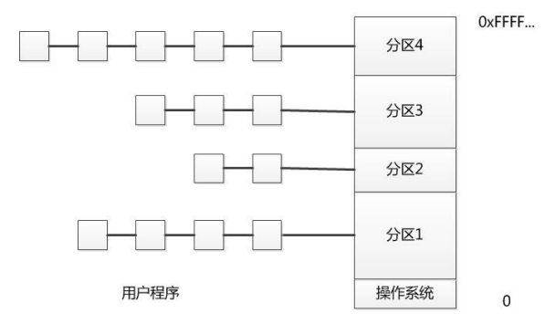
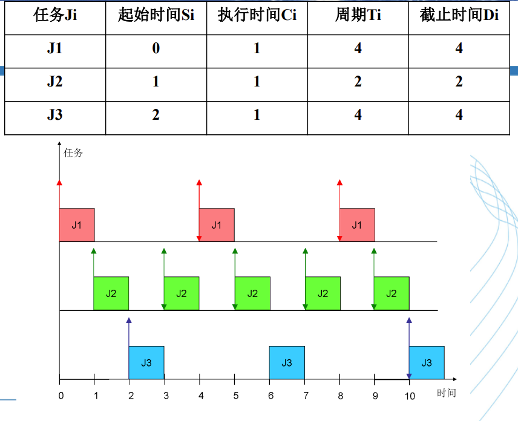

# OS理论期末复习

## 一. 引论

### ==1. 批处理系统==

* 把用户提交的作业**成批**送入计算机
* 由作业调度程序自动选择作业运行
* **目的**
  * 缩短作业之间的交接时间
  * 减少处理机的空闲等待，提高系统效率

#### 1.1 联机批处理系统

* 作业的输入输出由CPU处理
* 
* **优点：**监督程序不停地处理各个作业，实现了作业到作业的自动转接，减少了作业建立时间和手工操作时间
* **不足**：在作业输入和结果输出时，主机的高速CPU仍然处于空闲状态，等待慢速的输入输出设备完成工作

#### 1.2 脱机批处理系统

* 作业的输入输出脱离CPU处理

* 

  

* **优点：**主机不与慢速的输入输出设备打交道，而是与速度相对较快的磁带机发生关系，缓解了主机与设备的矛盾

* **缺点：**每次主机内存中仅存放一道作业，每当它运行期间发出I/O请求后，高速的CPU处于等待低速的I/O完成状态，CPU空闲

### 2. 多道程序系统

* **多道程序设计技术：**允许多个程序同时进入内存并运行
* 当一道程序因I/O请求暂停时，CPU便立即转去运行另一道程序
* **宏观上并行，微观上串行**

* **优点：**使CPU得到充分利用，同时也改善I/O设备和内存的利用率，**提高了整个系统的资源利用率和系统吞吐量**

* 单道程序系统：I/O时CPU空闲

  

* 多道程序系统：交替使用CPU

  

### 3. 多道批处理系统

* **优点：**
  * 系统吞吐量大
  * 资源利用率高
* **缺点：**
  * 平均周转时间长
  * ==**不能提供交互能力**==

### 4. 分时系统

* 多个用户分享使用同一台计算机，多个程序分时共享硬件和软件资源

  

* **多路性：多路连接，宏观上用户共享，微观上分时**

* **独立性：用户相互不干扰**

* **及时性：响应时间**

* **交互性：人机对话**

* 分时技术：处理机的运行时间分成很短的时间片，轮流分配给各联机作业使用

### 5. 实时系统

* 及时响应
* 高可靠性和安全性

* 实时信息处理、实时控制

### 6. 异常、陷阱和中断


* **同步异常：执行指令的过程中发生**

* **系统调用为一种同步异常:自陷指令(trap)**

## 二.引导

* 加载BIOS
* 读取MBR
* BootLoader
* 加载内核
* ...

## 三. 内存管理

> 地址空间：逻辑地址空间
>
> 存储空间：物理地址空间

### 1.单道程序的内存管理

* **静态地址翻译：在程序运行之前就计算出所有物理地址**

* **优点：**
  * 最简单，单用户、单任务的OS
  * 执行过程中无需进行地址翻译，**程序运行速度快**
* **缺点：**
  * 比物理内存大的程序无法加载
  * 资源浪费

### 2.多道程序的存储管理

> 分区式分配：把内存分为一些大小相等或不等的分区，每个应用程序占用一个或几个分区

#### 2.1 固定式分区

* 当系统初始化时，把存储空间划分为若干个任意大小的区域，然后把这些区域分配给每个用户作业

* **优点：**易于实现，开销小

* **缺点：** 

  * **内碎片**造成浪费
  * **分区总数固定**，限制了并发执行的程序数目

* 数据结构：分区表

* 分配方式

  * 单一队列：大分区小程序
    

  * 多队列：按程序大小对应分区块排队

    

#### 2.2 可变式分区

* 分区的边界可以移动，**分区的大小可变**

* **优点：没有内碎片**
* **缺点：产生外碎片**
* ==外部碎片是造成内存系统性能下降的主要原因==
* 消除外碎片：**紧凑技术**
* 内碎片已经被分配给程序，外碎片是没被分配给程序的碎片

#### 2.3 闲置空间的管理

* 跟踪内存的使用：位图表示法/链表表示法

##### 2.3.1 位图表示法

* 为每个**分配单元**赋予一个字位，用来记录单元是否闲置

  

* **优点**

  * 空间成本固定：不依赖于内存中程序数量
  * 时间成本低

* **缺点**

  * 没有容错能力

##### 2.3.2 链表表示法

* 空闲链表

* **优点**
  * 有一定容错能力
* **缺点**
  * 时间成本：链表扫描较慢
  * 空间成本：取决于程序的数量

#### 2.4 回收内存

* 尽可能合并回收分区上下的空闲分区


#### 2.5 基于顺序搜索的内存分配

* 首次适应(```Fisrt Fit```)：从空闲链表的始端开始查找，选择第一个满足请求的空白块
* 下次适应(``Next Fit``)：总是从上次查找结束的地方开始，只要找到一个足够大的空白区，就将它划分后分配出去
* 最佳适应(```Best Fit```)：找到大小最接近于作业要求的分区
* 最坏适应(```Worst Fit```)：为作业选择存储区域时，总是寻找最大的空白区

#### 2.6 基于索引搜索的内存分配

> 较大系统遍历空闲链表比较慢

* 快速适应算法(分类搜索法)：**把空闲分区按照容量大小进行分类**，经常用到长度的空闲区设立单独的空闲区链表，系统为多个空闲链表设立一张管理索引表。
  * **优点**
    * 查找效率高，依据长度寻找能容纳他的最小空闲区链表取下第一块进行分配
  * **缺点**
    * 分区归还主存时算法复杂，系统开销大
* **伙伴系统(二进制伙伴系统)**：在分配存储块时将一个大的存储块分裂成两个**大小相等**的小块
  * 大小为$2^k$
  * 分配给进程大于或等于所申请尺寸的**最小的**2的幂次的空闲块
  * 内存释放时，**首先考虑将被释放块与其伙伴合并成一个大的空闲块，然后继续合并下去，直到不能合并为止**
  * 

#### ==2.7 程序编译和程序段==

* 编译(```compile```)：由编译程序将用户源程序编译为若干个目标模块
* 链接(```linking```)：由链接程序将目标模块和对应的库函数连接成可装载模块
* 装入(```loading```)：由装载程序将可装载模块装入内存

* ==**程序段**==
  * ```bss```段：存放程序中**未初始化的全局变量或静态变量**
  * ```data```段：存放程序中**已初始化的全局变量静态变量**
  * ```text```段：存放**程序执行代码**

* ==栈(stack)==
  * **存放程序局部变量**
  * 保存/恢复调用现场
  * **向下生长**
* ==堆(heap)==
  * **malloc/free**
  * **向下生长**

#### 2.8 ELF可执行文件


#### 2.9 链接


#### 2.10 装载

* 对于每一个段，根据其在内存中的大小，分配足够的物理页并映射到指定的虚地址上
* **若ELF中记录的段在内存中大小大于在文件中大小，多出来部分用0填充**
  * 未初始化全局变量为0

#### 2.11 页式内存管理

> 程序：**程序是静止的**，是存放在磁盘上的可执行文件
>
> 进程：**进程是动态的**，进程包括程序和程序处理对象，是一个程序对某个数据集的执行过程
>
> 作业：作业是用户需要计算机完成的某项任务

* 分页地址结构：**页号P+位移量W**

* 逻辑地址：**虚拟页号+页内偏移量**

* 物理地址：**物理页号+页内偏移量**

* **虚拟页面大小与物理页面大小相等**

* 地址转换机构：MMU

* 一级页表

  > 逻辑地址空间大，划分的页面多，页表占用的存储空间大

  

  * 虚拟页号转换到对应的物理页号
  * 需要访存两次(页表一次，访问数据一次)

* 两级页表
  + 给一级页表设置页表
  + 一级页表(页目录)
  + 地址结构：```p1 | p2 | offset```
  + 
  + **二级页表访存次数：三次**

#### 2.12 快表TLB

> 解决页表的访存性能下降问题，建立快表(页表的**Cache**)

* MMU首先在TLB中查找，若没有则到外部页表查询，然后置换进TLB

  

* **访存：TLB命中情况下：一次Cache+一次内存**

* 多个进程的标识符：```ASID```

#### 2.13 改进页表

##### 2.13.1 哈希页表

* 建立虚拟页号与物理页号的哈希表，提高查找速度


##### 2.13.2 反置页表

* **反置页表不是根据进程的逻辑页号来组织，而是依据该进程在内存中的物理页号来组织**

* 按照进程在内存中的物理页面号来组织，表项的内容是逻辑页号P及隶属进程标志符```pid```

  

* 反置页表的大小只与**物理内存**的大小有关

* 

* 可以使用哈希表进行优化

#### 2.14 页共享与保护

* 页共享：**物理页面出现在A和B两个进程的地址空间**

* 页保护：地址越界保护，在页表中设置保护位

#### 2.15 分段存储管理

* 一个段可以定义为一组**逻辑信息**，每个作业的地址空间是由一些分段构成的，例如代码段、数据段等。

* 优点：

  * 方便编程
  * 信息共享
  * 信息保护
  * **动态增长**
  * **动态链接**

* **地址结构**：段号+位移量

  

* ==分页的地址空间为一维的，分段的地址空间为二维的==

* 对比
  * 页是信息的**物理单位**，大小固定
  * 段是信息的**逻辑单位**，长度不固定
  * 分页活动用户看不见，分段是用户可见的
* 段页式：先分段，再分页

#### 2.16 虚拟存储管理

##### 2.16.1 覆盖

> 节约，时间上扩展

* 把一个大的程序划分为一系列的覆盖，每个覆盖是一个独立的程序单位，程序执行时并不要求同时装入主存的覆盖组成一组
* **缺点**：编程时必须划分程序模块和确定程序模块之间的覆盖关系，增加编程复杂度。

##### 2.16.2 交换

> 借用，空间上扩展

* 把暂时不用的某个程序及其数据的部分或全部**从主存移到辅存中去**，腾出必要的存储空间，接着把指定程序或数据**从辅存读到相应的主存**中。

##### 2.16.3 ==局部性原理==

* 程序在执行过程中的一个较短时期，所执行的指令地址和指令的操作数地址局限于一定区域
* ==时间局部性==：一条指令的一次执行和下次执行，一个数据的一次访问和下次访问都集中在一个较短时期内
* ==空间局部性==：当前指令和临近的几条指令，当前访问的数据和临近的数据都集中在一个较小区域内

##### 2.16.4 虚拟存储

* 所有进程一致的地址空间，每个进程都认为自己在独占使用单机系统的存储资源
* 隔离进程地址访问
* **缺页中断**：**进程执行过程中需访问的页面不在物理存储器中，发生缺页中断**
  * ==页面置换算法==
* 

##### ==2.16.5 页面置换策略==

* 最佳策略(OPT)：从主存中移出永远不再需要的页面，如无这样的页面存在，应选择最长时间不需要访问的页面(理论参考，==无法被实现==)
* 先进先出(FIFO)：总选择作业在主存中驻留时间最长的一页淘汰

* 最近最久不用的页面置换算法(LRUR)：选择在最近一段时间内最久不用的页面予以淘汰

* 改进的FIFO算法：二次机会算法(```Second Chance```)：如果被淘汰的数据之前被访问过，则给其第二次机会

  * 每个页面增加一个访问标志位，标识此数据放入缓存队列后是否再次被访问过

    

  * 对于队列中最旧的页面

    * 若其放入队列后没有被再次访问，则立即被淘汰
    * 如果放入队列后被访问过，则移动到FIFO队列头，并清除访问标志位
    * 若所有页面都被访问过，按照FIFO淘汰

* 改进的FIFO算法：```Clock```(最近未使用算法NRU，```Not Recently Used```)，环形队列

  

* ==FIFO类算法命中率比其他算法要低，实际中很少使用==

* ==最近最少使用(```LRU:Least Recently Used```)：局部性原理的合理近似，性能接近最优算法==

  * 硬件开销比较大
  * 近似实现：设置栈保存当前使用的各个页面的页面号，当进程访问某页面时压入栈顶

* 老化算法(```Aging```)：LRU的简化

  * 为每个页面设置一个移位寄存器，并设置一位访问位R，每隔一段时间，所有寄存器右移1位，并将R值从左移入

  * 选择寄存器值小的移出

    

##### 2.16.6 Belady现象(期中考过)

> 在使用**FIFO算法**作为缺页置换算法时，分配的页面增多，缺页率反而提高

* 理想的情况：缺页率随页框数增加而下降

  

* Belady现象

  

##### 2.16.7 工作集与驻留集

* 进程的==工作集(```Working Set```)==：当前正在使用的页面的集合
* 进程的==驻留集==：每个进程驻留在内存的页面集合(分配的物理页)
* 工作集策略：依据进程在过去的一段时间内访问的页面来调整常驻集大小
  * 工作集可以用一个二元函数$WS(k,t)$表示
    * $k$表示窗口尺寸
    * $t$表示执行时刻
  * 工作集为$[t-k,t]$时间段内访问的页面的集合

* 驻留集的管理：系统应当为每个活跃进程分配多少个页框
  * 分配给每个活跃进程的页框数越少，同时驻留内存的活跃进程数就越多，进程调度就绪进程的概率就越大，但是将**导致缺页中断率增大**
* **全局置换算法：程序无法控制自己的缺页率，在内存中的页面不仅取决于该进程的页面走向，也取决于其他进程**

* 可变分配策略+局部置换：可增加或减少分配给每个活跃进程的页框数，当进程的页框全部用完，而需要装入一个新的页面，==**系统在该进程的当前驻留集中选择一个页面换出内存**==

* ==**抖动问题(期中考过)**==

  * 随着驻留内存的进程数目增加，处理器利用率先是上升，然后下降
  * **原因是：每个进程的常驻集不断减小，缺页率不断上升，频繁发生缺页中断**
  * 选择适当的进程数目，平衡并发水平和缺页率

  

  * ==消除抖动==：
    * 局部置换策略
    * 工作集算法
    * 预留部分页面
    * 挂起若干进程

##### 2.16.8 写时复制技术

* 实验中的理解已经足够

#### ==2.17 页目录自映射==

* 一个进程的4GB地址空间被划分为4GB/4KB=1M页，即需要1M个页表项来记录逻辑-物理关系

* 每个页表项需要4B，1M个页表项需要4MB，**即整个页表占用的地址空间大小为4MB**

* 4MB页表需要1024个页面存储，每一页中存储1024个页表项

* 一个页表项对应4KB内存，则个页表页对应4MB内存

* 页目录占一页空间，有1024项，每一项指向一个页表页，==则必有一项指向自己，即页目录也是上述4MB页表中的一页==

  

  

* 一个页目录项指向一个页表页，映射到4MB物理内存

* 假设进程页表的基地址为$PT_{base}$，几个经典计算

  * ==页目录基地址$PD_{base}$​：页目录中第一项映射第一个页表页==

    $PD_{n} : 10bits | PT_n : 10bits | offset:12bits$

    $PD_{base}=PT_{base}+(PT_{base} >> 12)*4=PT_{base}+PT_{base}>>10$

    *解释：映射第一个页表页的页表项编号为PT_base >> 12，也就是页目录项的编号，每个PDE大小为4B，基地址+偏移量*

  * ==映射页目录自身的页目录项==

    $页目录基地址PD_{base}=PT_{base}+PT_{base}>>10$

    $PDE_{self-mapping}=PT_{base}+(PD_{base}>>12)*4=PT_{base}|PT_{base}>>10|PT_{base}>>20$

* ==根本思想：计算出映射到该页表页的是第几个页表项==

## 四.进程管理

### 1. 进程与线程

* 并发：有两个活动a1,a2，如果在某一指定的时间t，无论a1和a2是在同一处理机上还是在不同的处理机上执行，只要a1和a2都处在各自的起点和终点之间的某一处，即称为并发的
* 并行：两个程序在同一时间度量下**运行在不同的处理机上**

* 竞争：多个进程在读写一个共享数据时，结果依赖于他们执行的相对时间，这种情形叫竞争

#### ==1.1 Bernstein条件==

* $R(S_{i})$：Si的读子集
* $W(S_i)$：Si的写子集
* 两个进程可并发的条件为
  * R(S1)^W(S2)=null
  * W(S1)^R(S2)=null
  * W(S1)^W(S2)=null
* ==或者说可并发条件为除了读读之外交集都为空==

#### 1.2 进程

* 进程是一个程序及其数据在处理机上顺序执行所发生的活动
* ==进程是系统进行资源分配和调度的一个基本单位==
* 动态性：==程序是静态实体，进程具有生命周期==
* 并发性：多个进程在内存中同时运行
* 独立性：==传统OS中==，进程是独立运行的基本单位
* 异步性

* 进程的结构
  * 程序段、数据段、进程控制块PCB

#### 1.3 进程控制

* ==由内核来实现==
* 进程控制的实现——**原语：由若干条指令所组成的指令序列，来实现某个特定的操作功能，连续不可被分割，必须在内核态执行**

* ```fork()```执行一次，父子进程两个返回值
* ==进程的状态(期中考过)==
  * **就绪状态**：已经获得所需资源，分配CPU就可运行
  * **执行状态**：占用CPU运行，进程数小于等于CPU数目
  * **阻塞状态**：正在执行的进程，由于发生某种事件而无法执行，放弃CPU处于暂停状态


* ==状态转换==
  * 就绪->运行：调度程序选择进程运行
  * 运行->就绪：运行进程用完了时间片，或因为高优先级进程处于就绪状态而中断
  * 运行->阻塞：当进程需要的资源必须等待
  * 阻塞->就绪：所等待的事件发生

* 进程控制块PCB

  * **进程标识符**：每个进程唯一的标识符
  * 程序和数据地址
  * 现行状态
  * 现场保留区：```trapframe```寄存器等等
  * 优先级
  * 父进程
  * 同步互斥机制
  * ...

* ==进程上下文切换vs陷入内核：陷入内核开销更小==

  * 进程上下文切换：
    * **调度器执行**
    * 保存进程执行断点
    * 保存执行现场
    * 切换内存映射
  * 陷入内核
    * 中断/异常/trap
    * 保存执行现场

  * ==用户态到内核态的切换(```mode switch```)消耗要比进程上下文切换(```Process Context Switch```)消耗小得多==

#### 1.4 线程

* 进程：资源拥有者+可执行单元

* 线程：可执行单元

* **优点**

  * 减小进程切换开销
  * 提高进程内的并发程度
  * 共享资源

* ==基本上不拥有资源，和同进程的线程共享进程拥有的所有资源==

* ==进程是资源分配的基本单位，线程是处理机调度的基本单位==

* **用户级线程**：线程在用户空间，通过用户库模拟thread

  

  * **优点**
    * 上下文切换快
    * ==线程切换与内核无关==
    * ==线程调度由应用决定，容易进行优化==
  * **缺点**：
    * 系统调用会引起阻塞，**因为内核只能看到一个进程，所以会阻塞所有相关的线程**
    * **内核只能将处理器分配给进程，即使有多个处理器也无法实现多线程并行执行**

* **内核级线程**：kernel有好几个分身，一个分身处理一件事

  

  * **优点**
    * 阻塞发生在线程级别
    * 内核可以在多个处理器上调度一个进程的多个线程
  * **缺点**
    * 线程切换需要内核参与
    * ==切换效率较低==

* 线程安全：对象

  * 多个线程访问同一个**对象**时，如果不用考虑线程的调度和交替执行，也不需要进行额外的同步，或者调用方进行任何操作，行为都可以获得正确的结果

* 可重入：代码

  * 即当该副程序正在运作时，执行线程可以再次进入并执行它，仍然可得到符合设计时所预期的结果

* ==可重入不一定线程安全，线程安全不一定可重入==

#### 1.5 同步与互斥

* wty课件例题

  

* **临界资源：**我们将一次仅允许一个进程访问的资源称为临界资源

* **临界区：**访问临界资源的代码

* 互斥：某一资源同时只允许一个访问者对其进行访问，无法限制访问顺序，**无序访问**

* 同步：在互斥的基础上通过其他机制实现对资源的**有序访问**

* ==基于忙等待的互斥方法（暂时跳过，期中考过）==
  * 浪费CPU时间

#### 1.6 信号量机制

* 必须置一次且只能置一次初值

* 只能由P、V操作改变

* P操作分配资源

  * 无法分配则**阻塞(wait)**：避免忙等

* V操作释放资源

  * 有等待进程则**唤醒(signal)**

* ```S.value```为正表示资源个数

* ```S.value```为负表示等待进程个数

* 信号量实现互斥：S=1

  ```c
  P(S)
  // 临界区
  V(S)    
  ```

* 信号量实现同步：S=0

  ```c
  process1(){
  	P(s)
  	// code
  }
  
  process2(){
      //code
      V(s)
  }
  ```

* 前驱关系

  

* 有限并发：S=n

* **多进程同步**原语(```Barriers```)

  * ```count```到达汇合点的线程数

* 信号量集：同时需要多个资源时的信号量操作
  * AND型信号量集：将进程需要的所有共享资源一次分配给他，使用完后一起释放(每种资源分配一个)
    * SP(S1,S2,...,Sn)
  * 一般信号量集：Si的测试值为ti，低于ti不进行分配，占用值为di
    * SP(S1,t1,d1,...,Sn,tn,dn)

#### 1.7 基于管程的同步互斥

* 把分散的临界区集中起来，为每个可共享资源设计一个专门机构来统一管理各进程对该资源的访问

* ==管程是高级同步原语==

* **互斥：任意时刻，管程中只能有一个活跃进程**

* 管程中的特殊类型变量：**条件变量**

  * 每个条件变量表示一种等待原因，==并不取具体数值==

* 条件变量与信号量的区别

  * 条件变量的值不可增减，信号量可增减
  * ```wait```操作一定会阻塞当前进程，P操作只有当信号量值小于0才会阻塞

  * 没有```wait```线程则```signal```会丢失，V操作不会丢失

* 当一个进入管程的进程执行等待操作时，应当释放管程的互斥权，后面进入的进程执行唤醒，则管程中有两个同时处于活动状态的进程

  * signal(x)时如何避免管程中有两个活跃进程
    * ```Hoare```：*执行signal的进程*等待，直到*被释放进程*退出管程
    * ```Mesa```：*被释放进程*等待，直到*执行signal的进程*退出管程
    * ```Hansen```：执行signal的进程立即退出管程

#### 1.8 进程间通信 IPC

> 低级通信：传递状态和整数值
>
> ==高级通信：管道，共享内存，消息系统==

##### 1.8.1 无名管道

* 半双工：==数据只能向一个方向流动==，双方通信建立两个管道

* ==只能用于父子进程或兄弟进程之间==

* 单独构成独立的文件系统，管道对于管道两端的进程而言是一个文件

* 数据读出和写入：从末尾写入，从头部读出(数据单向流动的原因)

  

##### 1.8.2 有名管道(FIFO)

* ==名字打破了无名管道只能在有亲缘关系的进程间通信的限制，不相关进程可以交换数据==
* FIFO提供了路径名与之关联，访问路径通过FIFO通信
* 以FIFO文件的形式存在于文件系统中
* 从末尾写入，从开始读出

##### 1.8.3 消息传递

* 系统调用send/receive
* 阻塞调用/非阻塞调用
* ==内核消息缓冲区==


##### 1.8.4 共享内存

* ==最有效的进程间通信机制，最快==
* 同一块物理内存被映射到A,B各自的进程地址空间


### 2.经典同步互斥问题

* 课件&作业

### 3. 进程调度

> 高级调度：**作业调度**，从工作流程角度对每个作业进行调度
>
> 中级调度：从**存储器资源的角度**将进程的部分或全部换出到外存上
>
> ==低级调度：从**CPU资源的角度**对进程/线程进行调度==
>
> * 抢占式
> * 非抢占式

* 何时进行切换
  * 用户调用
  * 陷阱
  * 中断
* ==进程切换的步骤==
  * 保存处理器上下文，程序计数器和其他寄存器
  * 用新状态和其他相关信息更新正在运行进程的PCB
  * 把进程移到合适的队列：就绪/阻塞
  * 选择另一个要执行的进程
  * 更新被选中进程的PCB
  * 从被选中进程中重装入CPU上下文

#### ==3.1 调度性能准则==

* ==**周转时间**：作业从提交到完成所经历的时间==
* **响应时间**：用户输入一个请求到系统给出首次响应的时间(分时系统)
* **截止时间**：开始截止时间和完成截止时间(实时系统)
* 优先级
* 公平性
* ==**吞吐量**：单位时间内完成的作业数(批处理系统)==
  * **作业/小时**
  * ==平均周转时间不是吞吐量的倒数，并发执行的作业在时间上可以重叠==
* **处理机利用率**：忙碌时间/总时间
* **各种资源的均衡利用**

#### ==3.2 批处理系统中常用的调度算法==

有关指标

> ==$吞吐量=\frac {作业数} {总执行时间}$ 即单位CPU时间完成的作业量==
>
> ==$周转时间=完成时刻-提交时刻(小时为单位)$==
>
> $平均周转时间=\frac {作业周转时间之和} {作业数}$
>
> ==$带权周转时间=\frac {周转时间} {执行时间}$==
>
> $平均带权周转时间=\frac {作业带权周转时间之和} {作业数}$

有关调度方式

> 抢占式：就绪队列中有优先级高于当前运行进程优先级的进程，立即进行进程调度
>
> 非抢占式：一个进程一直占用处理器知道时间片用完或I/O等原因进入阻塞状态才让出处理器

##### 3.2.1 FCFS 先来先服务

* 按照作业提交或进程变为就绪状态的先后次序分派CPU
* ==**非抢占式**==
* 有利于长作业，不利于短作业
* 有利于CPU繁忙的作业，不利于I/O繁忙的作业

##### 3.2.2 SJF 短作业优先

* 对预计执行时间短的作业优先分派处理机
* 通常后来的短作业==不抢占==正在执行的作业
* **优点**
  * ==改善平均周转时间和平均带权周转时间==，缩短作业等待时间
  * 提高系统吞吐量
* **缺点**
  * 对长作业不友好，饥饿现象
  * 没有优先级划分

##### 3.2.3 SRTF 最短剩余时间优先

* ==抢占式==
* **一个新就绪的进程如果比当前运行进程具有更短的完成时间**，则系统抢占当前进程，选择新就绪的进程运行
* 长任务饥饿现象

##### 3.2.4 HRRF 最高响应比优先

* ==非抢占式==

* 每次选择作业投入运行时，先计算后备作业队列中每个作业的响应比RP，然后选择最大的投入运行

  $RP=\frac {已等待时间+要求运行时间} {要求运行时间}$

#### ==3.3 交互式系统调度算法==

##### 3.3.1 RR 时间片轮转算法

* ==抢占式==

* 所有进程按照FCFS原则排成队列，**每次调度将CPU分派给队首进程**，**让其执行一个时间片**，一个时间片执行完后，发生时钟中断，**将当前进程送到就绪队列末尾**

* 系统的响应时间

  $T=N(进程数目)*q(时间片)$

* 数目越多时间片越小

##### 3.3.2 PS 优先级算法

* 平衡进程对响应时间的要求

  

* **静态优先级**：创建进程时就确定，直到进程终止前都不改变

* **动态优先级**：创建进程时赋予的优先级，**在进程运行过程中可以自动改变**，获得更好的调度性能

##### 3.3.3 MLQ 多级队列算法

* 引入多个就绪队列，通过对各队列的区别对待，到达综合的调度目标
* 不同队列有不同的优先级，时间片长度，调度策略
* **优先执行高优先级，高优先级队列为空再执行低优先级**


##### 3.3.4 RRMF 多级反馈队列算法

* 设置多个就绪队列，分别赋予不同的优先级，**每个队列执行时间片的长度也不同，优先级越低时间片越长**

* 新进程进入内存后，先投入队列1的末尾，**按时间片轮转算法调度**，若按队列1的一个时间片未能执行完，则降低优先级投入到队列2的末尾，同样按时间片轮转算法调度...降低到最后的队列，则**按照FCFS算法调度直到完成**。

* **当较高优先级的队列为空，才调度较低优先级队列中的进程执行，若进程执行时有新进程进入较高优先级的队列，则==抢先==执行新进程，并把被抢先的进程投入到原队列末尾**

  

##### 3.3.5 优先级倒置

> 问题背景：有三个进程 ```taskA taskB taskC``` 优先级依次降低
>
> ```taskA```和```taskC```共享临界资源，但是由于```taskB```优先级比```taskC```高，```taskB```抢占处理机，这样C得不到处理，优先级最高的A也被阻塞
>
> ==解决关键：提高C优先级，不允许B抢占CPU==

* 优先级置顶：给C最高的优先级，A也抢不过来
  * 缺点：如果临界区较长，则A仍会等待很长的时间
* 优先级继承：C继承A的优先级

#### 3.4 实时系统调度算法

* 实时系统是一种**时间起主导作用**的系统，计算机必须在**一个确定的时间范围内**做出反应
* ==抢先式调度==
* 快速中断响应：中断处理时间尽量短

>实时系统问题描述：
>
>假设一任务集S={t1,t2,...tn}，周期分别为T1,T2,...,Tn，执行时间分别为C1,C2,..Cn
>
>截止周期为D1,D2,...,Dn通常Di=Ti
>
>所有的任务都是周期性的(Ti)，必须在时限Di内完成
>
>==$CPU利用率 U= \Sigma {\frac {C_i} {T_i}}$​==

##### 3.4.1 静态表调度算法

* 对所有周期性任务进行分析预测，==事先确定一个固定的调度方案==
* 无任何计算，无灵活性



##### 3.4.2 RMS 单调速率调度 (2106被拷打过)

* **优先级静态固定分配**：优先级与周期成反比，周期越短优先级越高，优先级越高的任务先被调度，优先级相同随机调度

* ==抢占式，静态优先级：最优静态优先级调度算法==

  

##### 3.4.3 EDF 最早截止期优先

* 任务的绝对截止时间越早优先级越高，优先级越高先被调度(动态优先级)

  

#### 3.5 多处理机调度(略)

### 4. 死锁

* 一组进程中，每个进程都无限等待被该组进程中其他进程所占有的资源

#### ==4.1 死锁发生的四个必要条件==

* **互斥条件**：进程对分配到的资源进排他性使用

* **请求且占有条件**：进程已经占有至少一个资源，但又提出新的请求，但该资源已经被其他进程占有，此时进程阻塞，且对已获得的资源保持不放

* **不可剥夺条件**：进程已经获得的资源在使用完之前不能被剥夺

* ==**环路等待条件**==：发生死锁时，必定存在一个“进程-资源”的环形链，或者说循环等待条件

  ```{P0,P1,..Pn}```中P0等待P1的资源，P1等待P2...

#### 4.2 死锁预防

> ==排除死锁的静态策略==

* 打破互斥条件：有些资源不允许被同时访问
* 打破申请且占有条件：实行资源预先分配策略，**只有系统能够满足当前全部资源请求时，才一次性将所申请的资源分配给该进程，否则不分配**

* 打破不可剥夺条件：允许进程从占有者处强行夺取

* 打破循环等待条件：实行资源有序分配策略，资源事先分类编号，按号分配，**进程占用了小号资源才申请大号资源**，例如多层锁的顺序性

  ```c
  P(mutex1);
  P(mutex2);
  //...
  ```

#### 4.3 死锁避免

> ==排除死锁的动态策略==

* 安全序列：一个进程序列```<P1,P2,...,Pn>```是安全的，是指对于每一个进程```Pi```，他需要的**附加资源**可以被系统中当前可用资源加上所有进程```Pj(j<i)```当前占有的资源之和满足，则进程序列是一个安全序列

* 安全状态：系统存在一个安全序列(则所有进程均可顺利完成)

* ==系统进入不安全状态也不一定会死锁，死锁一定处于不安全状态==

  

##### ==4.3.1 银行家算法==

> n为进程数量，m为资源类型数量

* 可利用资源向量```Available```：m维向量
* 最大需求矩阵```Max```：n*m矩阵
* 分配矩阵```Allocation```：n*m矩阵
* 需求矩阵```Need```：n*m矩阵

* 进程的请求向量```Request```

* 系统试探部分分配

  ```c
  Available = Available - Requesti;
  Allocation = Allocation + Requesti;
  Needi = Needi - Requesti;
  ```

* 每次分配需要检查安全状态(请求向量不一定等于Need，**部分分配**)，利用安全性算法(核心)，能否找到安全序列

##### ==4.3.2 安全性算法==

* ==保证分配的资源数=Need==
* 工作向量```Work```：系统可提供给各进程运行继续使用资源数目，初始为```Available```
* 完成向量``Finish``：表示系统是否有足够的资源分配给进程，**使之运行完成**
  * 初始时``Finish[i]=false``
  * 有足够的资源分配给进程使之运行完成后``Finish[i]=true``
* 进程获得资源并运行完成后，释放出分配给他的资源
  * ```Work += Allocation```
  * ```Finish[i] = true```
* 再不断寻找下一个能完成分配的进程，**最后如果有所进程的```Finish[i]=true```则系统处于安全状态，否则处于不安全状态**

* 表格模版

  | Work | Need | Allocation | Finish |
  | ---- | ---- | ---------- | ------ |
  |      |      |            |        |

#### 4.4 死锁检测

##### ==4.4.1 资源分配图==

* 圆圈表示进程，矩形表示一类资源，资源中的小圈代表每个资源
* 请求边：从进程指向资源
* 分配边：从资源指向进程


##### 4.4.2 检测死锁

* 资源分配图中有环路不一定存在死锁
* 封锁进程：某个进程由于**请求了超过了系统中现有的未分配资源数目的资源**，而被系统封锁的进程
* 资源分配图的化简方法：假设图中存在一个进程Pi，Pi为非封锁进程
  * Pi有请求边时，将请求边变为分配边
  * 一旦所有资源都得到满足，Pi释放所有资源(Pi此时只有分配边)，删去这些分配边
  * Pi此时为孤立点
  * 反复进行
* ==死锁定理==：资源分配图不可完全化简：不能使所有进程都成为孤立节点

#### 4.5 死锁解除

* 撤销进程
* 剥夺资源

## 五.输入输出系统

### 1. I/O设备分类

* 低速、中速、高速
* ==块设备、字符设备==
* 独占设备、共享设备、虚拟设备

### 2 .I/O控制方式

#### 2.1 轮询方式

* 应用程序提出读数据请求
* 驱动程序检查设备状态
* 状态正常则发出相应的控制命令
* **不断测试设备是否完成了这次执行过程，轮询**
* 完成操作
* **缺点：CPU不断查询设备状态来检查是否完成，浪费CPU时间**

#### 2.2 中断驱动方式


* **优点**
  * 在外设进行数据处理时，CPU不必等待，继续执行其他程序，提高了CPU利用率
  * 外设准备好数据给CPU发中断，可以将外设和CPU视作并行执行
  * ==具有异常事件处理能力==
* **缺点**
  * 每次输入/输出一个数据都要中断CPU，多次中断浪费CPU时间，==**只适合数据传输率较低的设备**==
  * ==每个数据传送完成后中断CPU==
  * 中断处理陷入内核

#### 2.3 直接存储访问方式(DMA)


* 程序设置DMA控制器中的若干寄存器值：内存始址、传送字节数
* DMA控制器完成内存与外设的**成批**数据交换
* 操作完成后，DMA控制器向CPU发出中断
* **优点**
  * CPU只干预I/O开始与结束，进行成批数据读写
  * ==适合传输数据块==
  * ==适合高速设备==
* **缺点**
  * 数据传输方向、地址、长度等由CPU设置占用CPU时间
  * **每个设备占用一个DMA控制器**，设备增加时新增DMA控制器

#### 2.4 I/O通道控制方式

* **I/O通道是专门负责输入输出的处理器，独立于CPU**
* 执行由通道指令组成的通道程序，进行复杂I/O控制
* 优点：
  * 执行一个通道程序可以完成几组I/O操作，与DMA相比，减少CPU干预
  * 同时控制多种设备

### 3. 缓冲技术

> 匹配CPU与外设的不同处理速度，减少CPU中断次数，提高CPU与I/O设备之间的并行性

#### 3.1 单缓冲

* 一个缓冲区，CPU与外设轮流使用


#### 3.2 双缓冲

* 两个缓冲区，CPU和外设都可以连续处理而无需等待对方
* CPU和外设速度相近


#### 3.4 环形缓冲

* CPU和外设的处理速度可以相差较大


#### 3.5 缓冲池

* 空闲缓冲区、输入缓冲区、输出缓冲区


> 关于缓冲区计算：采用画条形图的方式解决
>
> * 完整画出一个执行流程，观察可以并行的部分并在图中进行“遮盖“
>
> * 去除可并行阶段之后的图即为“优化时间”，或者说近似的平均时间
> * 可认为每次都按照优化时间运行，最后加上没办法优化的尾巴(最后一次并行部分不能得到优化)
> * **关于单缓冲并行部分**
>   * 磁盘放到缓冲区，缓冲区放到内存，必须顺序执行
>   * ==CPU计算可以和磁盘放到缓冲区并行，不能和缓冲区放到内存并行(会改变计算数据)==
> * **关于双缓冲区并行部分**
>   * CPU计算+内存读入与磁盘读入并行
> * ==单缓冲每块数据时间：max(T,C)+M C为并行段==
> * ==双缓冲每块数据时间：max(T,C+M) M+C为并行段==
> * ==或者说并行部分的最大值+非并行部分==
> * ==总时间=n*每块时间+并行部分时间==

## 六.磁盘存储管理

### 1.磁盘结构

* 扇区
* 磁道
* 柱面
* 每个磁盘有两个面，每个面都有一个磁盘

### ==2.磁盘访问时间==

#### 2.1 寻道时间

* 把磁头从当前位置移动到指定磁道上所经历的时间
* 启动磁盘的时间S与磁头移动n条磁道所花费的时间之和
* $T_s=m*n+s$

#### 2.2 旋转延迟时间

* **平均旋转延迟时间为旋转一圈周期的一半**
* 设转速为r(单位为```Rounds Per Second```)
* 平均旋转延迟时间为$T_r=\frac 1 {2r}$

#### 2.3 传输时间

* 传输时间是指把数据从磁盘读出或者向磁盘写入数据所经历的时间
* 与每次读写的字节数b，旋转速度r，以及磁道上的字节数N有关
* 计算方法为：转的圈数*每圈周期
* $T_t = \frac b n * \frac 1 r = \frac b {rn}$​

#### 2.4 总访问时间

* 寻道时间+旋转延迟时间+传输时间

### ==3. 磁盘调度算法==

#### 3.1 FCFS

* 请求到达先后次序服务

#### 3.2 SSTF 最短寻道时间优先

* 优先选择距当前磁头最近的访问请求进行服务

#### 3.3 SCAN扫描算法 

* 按照一个方向移动，移动过程中对遇到的访问请求进行服务
* 判断该方向上是否还有访问请求，如果有则继续扫描，否则改变移动方向
* 这是课件上的表述，但这实际上是LOOK算法，正常的SCAN是要扫描到头的。。。

#### 3.4 C-SCAN 循环扫描算法

* 移动到最后一个柱面后，立即带动读写磁头返回0号柱面

### 4. RAID


## 七.文件系统

* 略 重在计算
* 文件大小：直接索引+简介索引
* 访问磁盘次数：具体问题具体分析 ：文件组织方式有关

