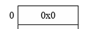
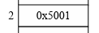
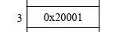
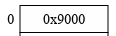
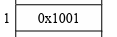
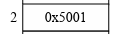
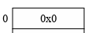

# OS第三次理论作业

## 一.第一题

### (1) 答

* 32位虚拟地址空间，故整个的地址空间大小为4GB；页内偏移量为12位，故一页有4096字节

### (2) 答

* 考察了二级页表的自映射机制，第一级页表所在的逻辑地址即为第一级页表中第一个页表项的逻辑地址，第一个页表项映射到第一个二级页表，第一个二级页表对应的虚拟页号为$0x80000000 >> 12 = 0x00080000$，故该页表项为第$0x0008000$个页表项，相对于页表项起始地址的偏移量为$0x00080000 * 4$，故对应的逻辑地址为$PT_{base} + (PT_{base} <<12) *4 = 0x80200000$ 

### (3) 答

* **逻辑地址0x0**：访问逻辑地址0x0时，对应的页目录偏移量为0，对应的有效位为0，引发了缺页中断，需要进行重填

  

* **逻辑地址0x00803004**：访问逻辑地址0x00803004时，对应的页目录偏移量为2，有效位为1，对应的物理地址为0x5000，逻辑地址对应的二级页表偏移量为3，对应的页表项有效位为1，对应的物理地址为0x20000，页内偏移量为4字节，

  

  

  

  * 若系统为小端存储(数据的低**字节**放在低地址空间，**大小端的顺序是以字节为单位的，而不是bit**)，则数据排布为0000_9000,0032_6001,则访问到的数据为0x1
  * 若系统为大端存储(数据的高**字节**放在低地址空间)，则数据排布为0090_0000,0160_3200,则访问到的数据为0x0

* **逻辑地址0x00402001**：访问逻辑地址0x00402001时，对应的页目录偏移量为1，有效位为1，对应的物理地址为0x1000，逻辑地址对应的二级页表偏移量为2，对应的页表项有效位为1，对应的物理地址为0x5000，页内偏移量为1字节，访问到的数据为0x0

  

  

  

### (4) 答

​	要想访问物理地址0x326028，先看他的物理页号，物理页号为$0x326028 >> 12 = 0x326000$则对应起始物理地址为0x20000页表中偏移量为1的项，对应页目录中偏移量为3的页表项的映射，页内偏移量为$0x28$，故逻辑地址为$0x00c01028$

## 二.第二题

> 前提：LOAD STORE操作的均为虚拟地址 大尾端为将数据的高位存在低地址端
>
> 0000430: e684 6c4e 0100 1800 53ef 0100 0100 0000
>
> 0000440: b484 6c4e 004e ed00 0000 0000 0100 0000
>
> 在大端模式下，前32位应该这样读: e6 84 6c 4e 
>
> 在小端模式下，前32位应该这样读: 4e 6c 84 e6

| 指令               | 结果   | 寻址过程                                                     |
| ------------------ | ------ | ------------------------------------------------------------ |
| Load[0x0000_1022]  | $0x20$ | 逻辑地址对应的页目录偏移量为0，对应的页目录项$0x00100007$，有效位有效，对应页表的物理基地址为$0x00100000$，逻辑地址对应的页表偏移量为1，对应的页表项为$0x00004067$，有效位有效（对于读操作不需要考虑读写位），并且可以读写，对应物理地址加上页内偏移量为$0x00004022$，读取的数据为$0x20$ |
| Store[0x00c0_7222] | Error  | 逻辑地址对应的页目录偏移量为3，对应的页目录项为$0x00103007$，有效位有效，对应页表的物理基地址为$0x00103000$，逻辑地址对应的页表偏移量为7，对应的页表项为$0xEEFF0001$,有效位为1，但是读写位为0，即只可读，不可写，故无法进行Store |
| Store[0x00c0_05bf] | OK     | 逻辑地址对应的页目录偏移量为3，对应的页目录项为$0x00103007$，有效位有效，对应页表的物理基地址为$0x00103000$，逻辑地址对应的页表偏移量为0，对应的页表项为$0x11220067$，对应的有效位为1，读写位为1，可以进行写操作 |
| Load[0x0000_3013]  | $0x19$ | 逻辑地址对应的页目录偏移量为0，对应的页目录项$0x00100007$，有效位有效，对应页表的物理基地址为$0x00100000$，逻辑地址对应的页表偏移量为3，对应的页表项为$0x00004007$，对应的有效位为1，并且可以读写，对应物理地址加上页内偏移量为$0x00004013$，读取的数据为$0x19$ |
| Load[0xff80_078f]  | Error  | 逻辑地址对应的页目录偏移量为$0x3FE$，它对应的物理地址为$PD_{base} + PDX(x) <<2=0x00200FF8$,对应的页目录项为$0x001FE007$，对应的有效位和读写位均为1，对应页表的物理基地址为$0x001FE000$，逻辑地址对应的页表偏移量为3，对应的页表项为$0xD0E1F203$，有效位有效且可读可写，对应页表物理基地址为$0xD0E1F000$，不存在相应的物理地址 |
| Load[0xffff_f005]  | $0x66$ | 逻辑地址对应的页目录偏移量为$0x3FF$，它对应的物理地址为$PD_{base} + PDX(va) << 2 = 0x00200FFC$对用的页目录项为$001FF007$，对应的有效位和读写位均为1，对应页表的基地址为$0x001FF000$，逻辑地址对应的页表偏移量为$0x3FF$，对应页表项的物理基地址为$0x001FFFFC$，对应的页表项为$0x00103067$，有效位和读写位均为1，对应物理地址加上页内偏移量为$0x00103005$，读取的数据为$0x66$ |

* 经过李国庆先生的指正，这里需要注意的是，从虚拟地址```va```中得到了对应的页目录偏移量(```PDX(va)```)以及页表偏移量(```PTX(va)```)，这里并不能直接访问到对应的项，需要先计算出它所在的物理地址再访问对应的页表项内容，

  * 页目录项的物理地址(一项为4字节，左移2位)
    ```
    pa = PDbase + PDX(va) << 2
    ```

  * 页表项的物理地址(题目中第一个页目录项即为第一个页表项，相当于第一个二级页表就是页目录，即```PTbase=PDbase```)

    ```
    pa = PDbase + PTX(va) << 2
    ```

    

