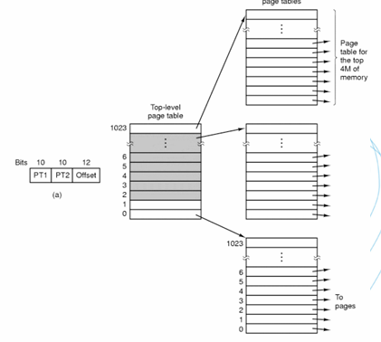

# OS第二次理论作业

## 1.多道程序的存储管理

* 空间的分配：分区式分配，将内存分为一些大小相等或不等的分区，每个应用程序占用一个或几个分区，操作系统占用其中一个分区

### 1.1 固定（静态）式分区分配

> 当系统初始化时，把存储空间划分为若干个任意大小的区域，然后将这些区域分配给每个用户作业

* 将内存划分为若干个固定大小的连续分区
  * 分区大小相等：多个相同程序的并发执行
  * 分区大小不等：多个小分区，适量的中等分区，少量的大分区
* 优点：易于实现，开销小
* 缺点：内碎片造成浪费，分区总数固定，限制了并发执行的程序数目
* **采用的数据结构：分区表——记录分区的大小和使用情况**

#### 1.1.1 单一队列分配方式

​	需要加载程序时，选择一个当前闲置且容量足够大的分区进行加载，即多个用户程序排在一个共同的队列中等待分区

#### 1.1.2 多队列分配方式

​	防止单一队列造成的小程序占用大分区的情况，采用多个队列，每个分区一个队列，程序按照大小排在相应的队列中，即小分区排队的都是小程序，大分区排队的都是大程序

### 1.2 可变（动态）式分区分配

> 可变式分区：分区的边界可以移动，即分区的大小可变

* 优点：没有内碎片
* 缺点：有外碎片

#### 1.2.0 内碎片与外碎片

* 内碎片：分配给作业的存储空间中未被利用的部分，如固定分区中存在的碎片
  * 内碎片其实已经被分配出去了，只是没有被利用，在作业完成后会得到释放
* 外碎片：系统中无法利用的小的空闲分区，如分区与分区之间存在的碎片，动态分区管理会产生外部碎片
  * 消除外部碎片的方法：紧凑技术

#### 1.2.1 位图表示法

* 给每个分配单元赋予一个字位，用来记录该分配单元是否闲置。字位取值为0表示单元闲置，取值为1表示已被占用

* 空间成本固定，不依赖于程序中的程序数量
* 时间成本低，操作简单，直接修改位图值
* 没有容错能力：无法确定是为1还是因错误变为1

#### 1.2.2 链表表示法

* 将分配单元按照是否闲置链接起来

* 空间成本取决于程序的数量
  * **例如空闲链表，将内存中空闲的区域以链表的形式穿起来**
* 时间成本：链表扫描速度较慢，还要进行链表项的插入删除和修改
* 有一定容错能力，链表有被占空间和闲置空间的表项，可相互验证

### 1.3 基于顺序搜索的分配算法

* **First Fit**：每个空白区按其在存储空间中地址递增的顺序连载一起，**在为作业分配存储区域时，从这个空白区域链的始端开始查找，选择第一个足以满足请求（够大）的空白块**
* **Next Fit**：把存储空间中的空白区构成一个**循环链**，每次为存储请求查找合适的分区时，**总是从上次查找结束的地方开始，只要找到一个足够大的空白区，就将他划分后分配出去**
* **Best Fit**：为一个作业选择分区时，**总是寻找其大小最接近于作业所要求的存储区域**
* **Worst Fit**：为作业选择存储区域时，**总是寻找最大的空白区**

## 2.页式内存管理

> 从方便管理物理内存的角度考虑

### 2.1 程序、进程和作业

* **程序**：程序是**静止**的，是存放在磁盘上的可执行文件
* **进程**：进程是动态的，进程包括程序的程序处理对象（数据），是系统分配资源的基本单位，分为系统进程和用户进程，**进程有生命周期**
* **作业**：作业是用户需要计算机完成的某项任务，是要求计算机所做工作的集合，**一个作业可以有多个进程**

### 2.2 分页式存储管理

> 把一个逻辑地址连续的程序分散存放到若干不连续的内存区域内，充分利用内存空间，逻辑上相邻的页，物理上不一定相邻

* **页**：在页式存储管理系统中，**把每个作业的地址空间分成一些大小相等的片**，称之为页
* **存储块（页框）**：**把主存的存储空间也分成与页面大小相同的片，这些片称为存储块或页框**
* **地址结构：页号+页内位移**

* 给定逻辑地址空间中的地址为A，页面的大小为L，则
  * 页号P=int(A/L)
  * 页内地址偏移D=A mod L

### 2.3 一级页表

### 2.4 两级页表

* 一级页表的问题：若逻辑地址空间很大，则划分的页比较多，页表很大，占用的存储空间很大且要求连续，较难实现

* **将页表再进行分页**，离散地将各个页表页面存放在不同的物理块中，**同时再建立一张外部页表用以记录页表页面对应的物理块号**
* 在运行过程中，**必须把外部页表（页表的页表）调入内存，而动态调入内部页表，只将当前所需的一些内部页表装入内存，其余部分根据需要再陆续调入**

* 地址：**页表页面号+页号+页内地址**
* 

### 2.5 多级页表

* 多级页表结构中，指令所给出的地址除偏移地址之外的 各部分全是各级页表的页表号或页号，而各级页表中记录的全是物理页号，指向下级页表或真正的被访问页

### 2.6 TLB

​	**TLB是页表的Cache，用于减少访问内存的次数，缩短时间**

### 2.7 MMU

​	CPU中用于进行虚拟地址与物理地址转换的单元，MMU中有TLB，得到VA后首先在TLB中进行查找，找不到再去页表中查找

## 3.段式内存管理

> 从方便用户编程的角度考虑

* 一个段可以定义为一组逻辑信息，每个作业的地址空间是由一些分段构成的，每段都有自己的名字，且都是一段连续的地址空间（**长度不定**）
* 

* 地址结构：**段号S+位移量W**

  

* **关于地址维数**

  * 对于页式管理，一个程序的各页是根据程序空间连续编址的，程序地址空间只有一维
  * 对于段式管理，一个程序依据信息特性拆分为多段，各段之间独立编址，故地址空间有两维

* **可以更好地满足程序内存动态增长的情况**

  

* 

## 4.段页式内存管理

* 先将用户程序 分成若干个段（段式），并为每一个段赋一个段名，再把 每个段分成若干个页（页式）

## 5.虚拟存储管理

### 5.1 交换

## 附.第二次理论作业

**1.动态内存分配需要对内存分区进行管理，一般使用位图和空闲链表两种方法。128MB 的内存以n字节为单元分配，对于链表，假设内存中数据段和空闲区交替排列，长度均 为64KB。并假设链表中的每个节点需要记录32位的内存地址信息、16位长度信息和16 位下一节点域信息。这两种方法分别需要多少字节的存储空间？那种方法更好？** 	

* 使用位图：为每个单元分配1bit，128MB内存被划分为$\frac {2^{27}} n$个单元，需要使用$\frac {2^{27}} n$个bit，即$\frac {2^{24}} n$个字节
* 使用空闲链表：每个节点$32+16+16=64bits=8bytes$，内存中有$\frac {2^{27}} {2^{17}} = 2^{10}$个空闲分区，故空闲链表需要$2^{13}$个字节

* 进行比较：当$n>2048$时，使用位图所占用的内存空间更小，位图法更好，当$n<=2048$时使用空闲链表的方法更好

**2.在一个交换系统中，按内存地址排列的空闲区大小是: 10KB、4KB、20KB、18KB、7KB、 9KB、12KB和15KB。对于连续的段请求：12KB、10KB、9KB。使用FirstFit、BestFit、 WorstFit和NextFit将找出哪些空闲区？ **

| 空闲区号   | 1    | 2    | 3    | 4    | 5    | 6    | 7    | 8    |
| ---------- | ---- | ---- | ---- | ---- | ---- | ---- | ---- | ---- |
| 空闲区大小 | 10KB | 4KB  | 20KB | 18KB | 7KB  | 9KB  | 12KB | 15KB |

* **使用First Fit**：
  * 12KB会使用编号为3的大小为20KB的空闲分区
  * 10KB会使用编号为1的大小为10KB的空闲分区
  * 9KB会使用编号为4的大小为18KB的空闲分区

* **使用Best Fit**:
  * 12KB会使用编号为7的大小为12KB的空闲分区
  * 10KB会使用编号为1的大小为10KB的空闲分区
  * 9KB会使用编号为6的大小为9KB的空闲分区
* **使用Worst Fit**:
  * 12KB会使用编号为3的大小为20KB的空闲分区
  * 10KB会使用编号为4的大小为18KB的空闲分区
  * 9KB会使用编号为8的大小为15KB的空闲分区
* **使用Next Fit**:
  * 12KB会使用编号为3的大小为20KB的空闲分区
  * 10KB会使用编号为4的大小为18KB的空闲分区
  * 9KB会使用编号为6的大小为9KB的空闲分区

**3.解释逻辑地址、物理地址、地址映射，并举例说明。**

* 逻辑地址是操作系统的用户编写应用程序时所用的地址，物理地址是内存中实际的地址，地址映射是指逻辑地址向物理地址转换的过程
* 举例来说，对32位的MIPS体系结构而言，每一个进程都拥有独立的4GB逻辑地址空间，每一个区域的地址空间有其特定的用途，kuseg、kseg0、kseg1和kseg2都有各自的地址映射方式。MIPS体系结构广泛应用于不同硬件条件的嵌入式系统，具体机器的物理内存和物理地址不尽相同，但逻辑地址到物理地址的映射按区域基本确定，有通过MMU转换的区域，也有直接高位清零转换的区域。

**4.解释页式（段式）存储管理中为什么要设置页（段）表和快表，简述页式（段式）地 址转换过程。**

* 页式存储管理的目的是高效利用内存，减少内存碎片的产生，并实现大逻辑空间映射小物理空间。使用页式内存管理就需要存储一张页表，用于记录逻辑页向物理页的映射。由于查询页表会增加一次访问内存，影响性能，于是设计了快表(TLB)，即页表的高速缓存(cache)，在查找页面映射时先查找快表，若命中则无需查询页表，若未命中则需要查页表，并将对应的页表项替换到快表中。

* 将逻辑地址划分为页号和页内偏移两个部分，只需要找到对应的物理页号再加上页内偏移即可找到物理地址。首先在TLB中查找页号，若命中则将它对应的物理页号加上页内偏移得到物理地址，若TLB未命中，则在内存中查页表，将对应的页表项替换进TLB，再得到物理内存进行访存

**5.叙述缺页中断的处理流程。**

> 缺页中断：软件试图访问已经映射在虚拟地址空间中，但是还未被加载在内存中的一个分页时发生中断，需要从外存中将该页调入内存

​	若此时内存中还有空闲块，则直接将缺页从外存中调入内存，若内存已满，则需要采用页面置换算法淘汰某页再进行调入。

**6.假设一个机器有38位的虚拟地址和32位的物理地址。  (1) 与一级页表相比，多级页表的主要优点是什么？  (2) 如果使用二级页表，页面大小为16KB，每个页表项有4个字节。应该为虚拟地址中 的第一级和第二级页表域各分配多少位？ **

* 多级页表为页表再设置页表，实行动态页表调入，只需要将当前使用的页表项所在的页调入内存，减少了内存中存储页表的空间

* 页内偏移地址为14位，则全部页表项所占空间：$2^{24}*4=2^{26}bytes$，将一级页表再划分，可分为$2^{12}$页，则二级页表的页表域为12位，一级页表的页表域为12位。

**7.假设页面的访问存在一定的周期性循环，但周期之间会随机出现一些页面的访问。例 如：0,1,2…,511,431,0,1,2…511,332,0,1,2,…,511等。请思考：  (1) LRU、FIFO和Clock算法的效果如何？  (2) 如果有500个页框，能否设计一个优于LRU、FIFO和Clock的算法？**

* 访问的页面符合局部性原理，三种算法产生的缺页中断相同
* 尽量把工作集装入内存，将0-498页面映射到固定的页框，每次只置换第499个页面

**8.一个交换系统通过紧缩技术来清理碎片。如果内存碎片和数据区域是随机分配的。而 且假设读写32位内存字需要10nsec. 那么如果紧缩128MB的内存需要多久？简单起见， 假设第0个字是碎片的一部分而最高位的字包含了有效的数据。**

​	每个字节的读写时间为2.5ns,$128MB=2^{27}B$，对每个字节既要读又要写，需要$2*2.5*2^{27}=671ms$

