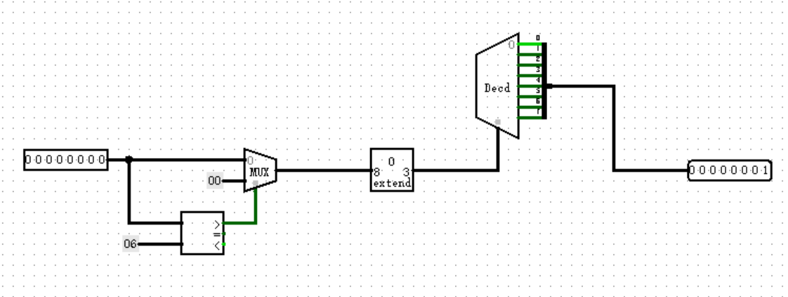
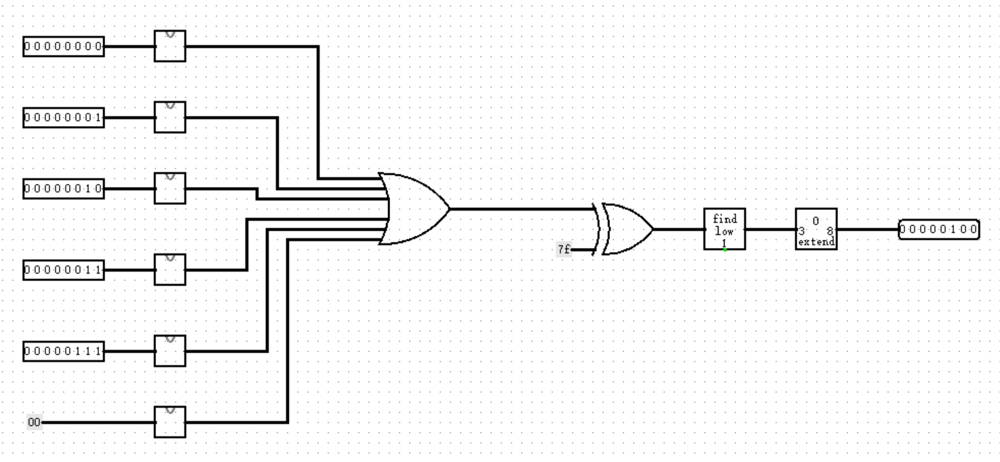
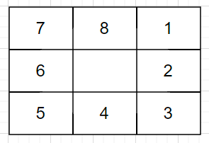
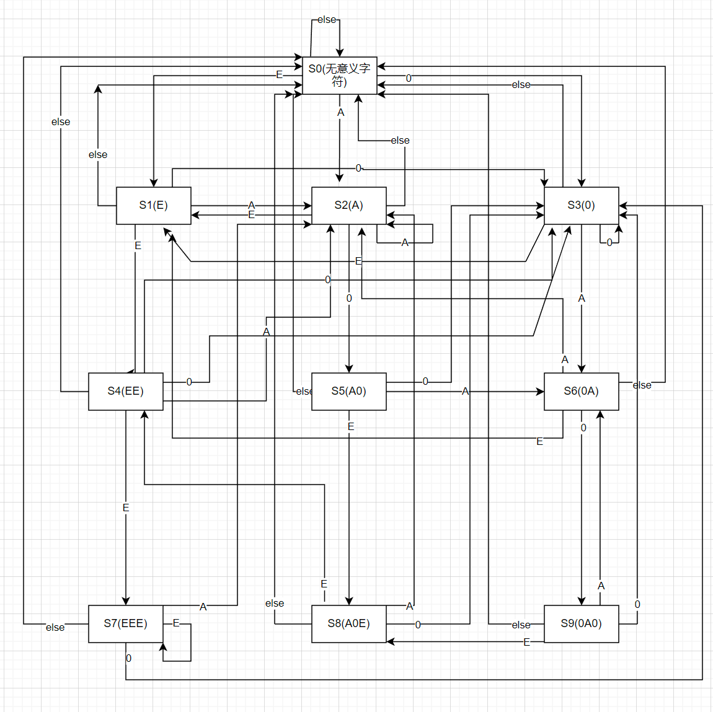
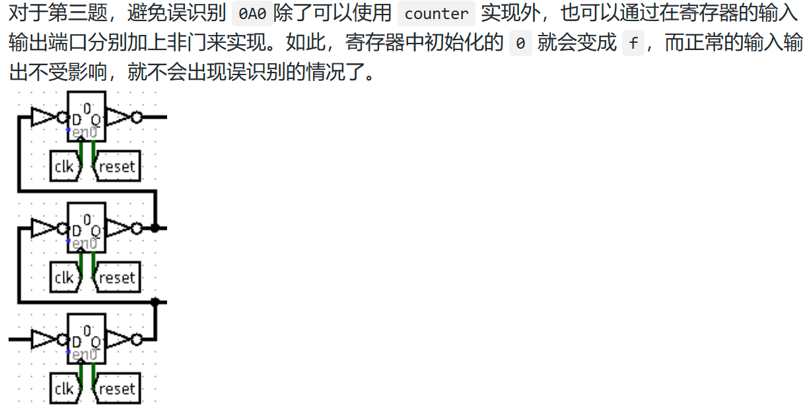

### ```CO-P0-logisim```

​	**写在前面**:10.9晚上机有三道题目，笔者只侥幸通过了其中两道，记录一下思路，分享一下拙见```QAQ```,如有错误还请指正！(```os```:上机还是很辛苦的......)

#### 1.找最小

##### 1.思路探究

​	题目的大意为，输入五个八位二进制数字，完成电路，输出没有出现过的最小正整数，例如，输入为:0,3,2,1,7,那么最小的没有出现过的正整数为4.

​	**题意分析**：如果能够想到将输入转换为独热码就可以比较直观地理解问题！我们考虑：这个所求的最小正整数最大是多少？可以想到，找最小正整数的过程类似于找一个“空隙”，如果我们将五位输入按从小到大顺序排好，记为a[n]，那么最小正整数会出现的条件:

```c
a[n-1] + 1 < a[n]
```

​	我们可以发现：最小正整数最大的时候即为五个输入为1，2，3，4，5；此时最小正整数大小为6.故我们可以知道最小正整数的出现范围为1~6。这一点对我们的解题过程很关键，因为这一认知告诉我们：无论输入如何，我们只需要去找从1~6之间没有出现过的最小数即为我们所求的最小正整数。

​	然后：我们怎么知道数字有没有出现过呢？常规的二进制编码可能较难实现，但是选择独热码是一个比较直观的选择，将每个输入转换为独热码，最后或起来.......到这里思路已经明晰，实现电路吧！

##### 2.电路设计

###### 1.转换为独热码电路 one-hot encoder



​	这里做出判断，大于6就当作0处理，需要注意的是，八位独热码中0也被编码，即为图中所示，因为要求是正整数，所以无论是否输入0，第0位应该被默认占位，这一点在主电路中也有处理。

###### 2.main



​	在主电路的处理中，我们添加一个“输入0”，将第0位占位，保证是正整数。

#### 2.回字迷宫

​	从迷宫中的1位置出发，绕回字迷宫行走，00向北，01向南，10向西，11向东，如果当前输入的方向有位置，就输出进入位置的编号，若没有位置，就输出当前位置编号，使用mealy状态机实现，注意1位置的编号为1。

​	这个题目比较简单，无脑的把状态逻辑和输出逻辑分开列真值表就可以解决......题目里一共八个状态，建议还是使用四位编码吧，从0001开始编码，这样可以在输出逻辑时好看一些，笔者采用三位编码，导致输出时的数字要比状态数字大1，有点费心神。



​	**打表技巧**：将输入利用splitter分解成1位输入到模块中，这样在模块中便于进行analyze功能和debug......毕竟将多位传输进模块，在打完表之后要进行位拼接，这个过程走线比较逆天，另外如果逻辑错了不好进行debug,需要将拼接好的位数再展开.......

#### 3.十六进制匹配

​	此题笔者是通过打真值表实现，比较麻烦，下面附上状态转移图



​		课程组提供的标准解法中利用三个寄存器存储最近输入的状态，这种做法比较巧妙，引用讨论区中助教的回答


