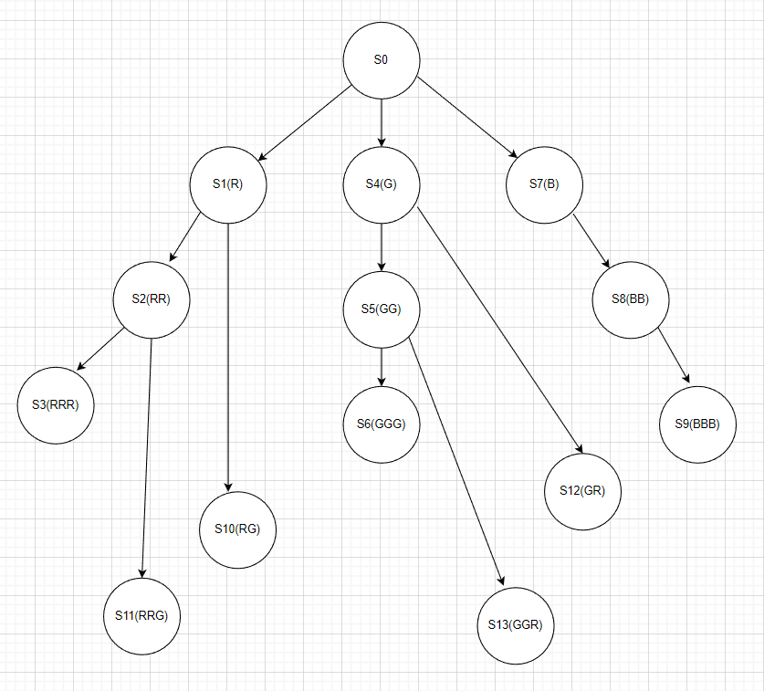

## P1上机——verilog完成部件设计以及状态机

​	**永远在周一晚上上机之前才是我学计组效率最高的时候**

​													——地球人

### 一.三段式状态机的设计

​	在上机之前我心血来潮想要把自己编写状态机的代码风格从一直以来的一段式更新为三段式，在看了网上好多有的没的真真假假对对错错的写法之后，我决定转头求助蒋老师和曾老师，果然得到了靠谱的答案，并成功应用到晚上的上机中```QAQ```。

​	**分段思路：就如同状态机的设计图，有三个模块：状态转移逻辑(组合逻辑)，状态存储（时序逻辑），输出逻辑（组合逻辑）**，在verilog中分段实现即可，逻辑更加清晰。具体来说可以写成```always-always-assign```这种形式，当然最后一段也可以写成always.

​	下面给出示例代码:

​	**Moore型**  输出逻辑中对状态进行判断

```verilog
module moore_example(
    input in;
    input clk;
    input rst_n;
    output check;
);
localparam s0 = 4'b0001;
localparam s1 = 4'b0010;
localparam s2 = 4'b0100;
localparam s3 = 4'b1000;

reg [3:0] state;
reg [3:0] n_state;
    
//状态存储逻辑
    always@(posedge clk or negedge rst_b)begin
        if(!rst_n)begin
            state <= s0;
        end
        else begin
           	state <= n_state; 
        end
    end
//状态转移逻辑  一般来说两层case嵌套逻辑更加清楚
    always@(*)begin
        case(state)begin
            s0:
            begin
                case(in)begin
                    1'b1:n_state = s1;
                    1'b0:n_state = s0;
                end
            end
            //省略其他部分
             default:
                n_state = s0;
        end
    end
                    
//输出逻辑
                    assign check  = (state == s3)?1'b1:1'b0;
```

​	**Mealy型** 输出逻辑中对当前状态和输入进行判断

```verilog
module moore_example(
    input in;
    input clk;
    input rst_n;
    output check;
);
localparam s0 = 4'b0001;
localparam s1 = 4'b0010;
localparam s2 = 4'b0100;
localparam s3 = 4'b1000;

reg [3:0] state;
reg [3:0] n_state;
    
//状态存储逻辑
    always@(posedge clk or negedge rst_b)begin
        if(!rst_n)begin
            state <= s0;
        end
        else begin
           	state <= n_state; 
        end
    end
//状态转移逻辑  一般来说两层case嵌套逻辑更加清楚
    always@(*)begin
        case(state)begin
            s0:
            begin
                case(in)begin
                    1'b1:n_state = s1;
                    1'b0:n_state = s0;
                end
            end
            //省略其他部分
             default:
                n_state = s0;
        end
    end
                    
//输出逻辑
                    assign check  = (state == s2 && in == 1'b0)?1'b1:1'b0;
```

**三段式状态机的逻辑果然清晰好多！**

### 二.上机题目简记

#### 1.32位向量乘法

##### 1.题意复现

​	计算32位向量乘法

##### 2.我的解法

​	这个题目比较签到题，相当于推荐题目中的```Voter_Plus```的简化版，毕竟只用到了组合逻辑中的循环，速速AC！

```verilog
reg [31:0] cnt;//计数器 向量中每一位只会出现0/1
integer i;//计数变量
always@(*)begin
    for(i=0;i<32;i=i+1)begin
        cnt = cnt + vector_a[i]*vector_b[i];
    end
end
assign out = cnt;
```

#### 2.coloring涂色问题

##### 1.题意复现

​	题意为：DQR闲着没事涂色玩，一共有红(```2'b00```)、绿(```2'b01```)、蓝(```2'b10```)三种颜色，涂色的规则如下:

1. 不允许有三个连续的颜色相同的色块
2. 不允许红色与绿色相邻

​	如果出现非法的情况，将输出端口check置为1，并将最近涂的颜色擦除，进行下一次上色。

##### 2.我的解法

​	这个题目不知道有没有更好的解法，但是我是通过设计14状态的Moore状态机实现的，这里我对于红绿相邻的情况进行了比较细致的分类:

1. 红绿
2. 红红绿
3. 绿红
4. 绿绿红

​	这样做的好处是便于进行“颜色的擦除“，即状态的回退，下面附上状态转移图



​	**进行一下简单的解释**：

1. 状态中表示连续颜色的检测，即遇到与上一次不同的颜色时直接跳转，如

   ```verilog
   state == R ; in == B ; n_state = B;
   ```

2. 在外侧的红绿相邻状态中，状态转移实际上是与他们的上一状态相同的，因为擦除颜色相当于回到上一状态

#### 3.数字匹配numberNest

##### 1.题意复现

​	定义两个相同数字之间的部分为”数字匹配“，要求如下:

1. 一个数字的匹配中的数字必须比这个数大，如123321合理,12322321不合理
2. 一个数字匹配的下一个数字只能比这个数字大1，如12344321合理，1331不合理

​	输入的序列合理时输出0，不合理输出1，题目保证输入的序列从1开始并且输入的数字在1-5之间。

##### 2.讨论区的解法（这题我当时挂了）

###### 1.状态机

​	按照当前输入数字进行设计状态，6个就够了。

###### 2.两个if法(lrgg起的名字 我也不知道为什么```QAQ```)

​	在任何状态下，合理的输入只有两种：

1. in = state + 1;这代表进行下一个数字的匹配 state = state + 1;
2. in = state;序列结束了当前匹配，state = state - 1;

```verilog
module numberNest(
    input [2:0] in;
    input rst_n;
    input clk;
    output check;
);
    reg [2:0] state;//表示当前状态，同时也是上一个输入的数字
always@(posedge clk or negedge rst_n)begin
    if(!rst_n)begin
        check <= 0;
        state <= 0;
    end
    else begin  //开始下一数字匹配
        if(in == state + 1)begin
            check <= 0;
            state <= state + 1;
        end
        else if(in == state) begin    //结束当前数字匹配
            check <= 0;
            state <= state - 1;
        end
        else begin  //输入数字不合法
            check <= 1;
            state <= 0;
        end
    end
end
```

**代码好短，lrgg好强！**

### 三.后记

#### 1.检测特定序列的另一种解法:序列缓存法

​	在```verilog```状态机中，我们经常遇到设计状态机来匹配特定后缀的字符串的问题，以往我们会设计出一个状态机，但是事实上我们可以缓存一个需要匹配的字符串长度的数组来存下已经输入的字符，输入新字符时将最早进来的字符顶出，相当于移位寄存器或者说是一个队列。

​	下面以匹配字符串1101为例，代码分成两个部分，一部分更新缓存序列，一部分根据序列内容输出。

```verilog
module sequence_detect(
	input clk,
	input rst_n,
	input a,
	output reg match
	);

    reg [3:0] str;
  always@(posedge clk or negedge rst_n)
  begin
	  if(rst_n ==1'b0)
	  begin
	  	str <=4'b0000;
	  end
	  else
	  begin
          str <= {str[2:0],a}; //最左侧出队
	  end	
  end

  always@(posedge clk or negedge rst_n)
  begin
	  if(rst_n ==1'b0)
	  		match <='d0;
      else if(a_reg == 4'b1101)
	  	match <='d1;
	  else
	  	match <='d0;
  end
endmodule

```

#### 2.以饮料售货机为例说明Mealy状态机比Moore状态机少状态

​	假设我们有这样的一个饮料售货机，每次只能投入0.5元或1元，饮料的售价为两元，当购买成功时```sell = 1```,并输出找零```change```。

我们知道对于一个相同的情景可以设计出两种状态机，这里我们先考虑Moore状态机。

##### 1.Moore状态机

​	对于Moore状态机我们应当列出全部的状态，即投入货币的金额，我们可以以一种**售价附近最小粒度**的思想来解决状态个数问题，

0,0.5,1,1.5,2,2.5共6个状态，在2,2.5状态时输出1.

##### 2.Mealy状态机

​	对于Mealy状态机，当当前状态(已经投放金额)+当前投币大于两元时就应该输出```sell==1```并输出找零，无需2,2.5这两个状态。

​	这样我们就可以理解**Moore型比Mealy型状态多，Mealy型比Moore型输出早**
