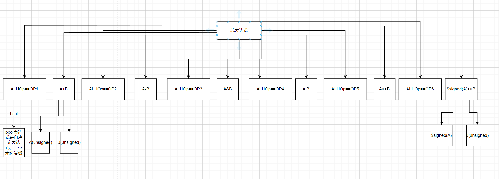

### P1_L3_ALU && Verilog中的符号处理

#### 1.问题引入 AC? WA?

​	在做P1课下提交中的6处理ALU时，我发现了一件怪事，两个看似只是添加了变量差别的程序居然跑起来一个能够通过测试，一个不能，下面附上AC代码和WA代码。

**AC代码**

```verilog
module alu (
    input [31:0] A,
    input [31:0] B,
    input [2:0] ALUOp,
    output [31:0] C
);

wire [31:0] add = A + B;
wire [31:0] sub = A - B;
wire [31:0] with = A & B;
wire [31:0] huo = A | B;
wire [31:0] logic_shift = A >> B;
wire [31:0] math_shift = $signed(A) >>> B;

    assign C = (ALUOp == 3'b000) ? add:
               (ALUOp == 3'b001) ? sub:
               (ALUOp == 3'b010) ? with:
               (ALUOp == 3'b011) ? huo:
               (ALUOp == 3'b100) ? logic_shift:
               (ALUOp == 3'b101) ? math_shift:
                32'b000;
endmodule
```

**WA代码**

```verilog
module alu (
    input [31:0] A,
    input [31:0] B,
    input [2:0] ALUOp,
    output [31:0] C
);

    assign C = (ALUOp == 3'b000) ? A + B:
               (ALUOp == 3'b001) ? A - B:
               (ALUOp == 3'b010) ? A & B:
               (ALUOp == 3'b011) ? A | B:
               (ALUOp == 3'b100) ? A >> B:
               (ALUOp == 3'b101) ? $signed(A) >>> B:
                32'b000;
endmodule

```

​	这两份代码的区别表面上看似乎只是AC版本使用变量存储了运算结果，实际上是```verilog```处理有符号表达式的问题

#### 2.回顾```verilog```对于符号表达式的处理规则

​	**```verilog```对于符号处理分为两个过程：**

1. 最外层表达式的确定
2. 向内传播

##### 1.最外层表达式的符号确定

​	对于上下文决定的表达式，其符号与位宽和运算符无关，由其子表达式决定，可以简单概括为：**其子表达式中有一个为无符号则最外层表达式就是无符号的。**如果用树状图来判断，我们需要递归的判断到表达式树的叶子节点。以我们程序中出现bug的表达式为例。



​	可以发现，当我们不用变量来存储表达式的时候，这个大表达式分解到叶子节点(原子公式)，可以发现，大部分叶子节点都是无符号的，这样一层层向上递推，得到最外层的表达式同样为无符号的。

##### 2.向内传播

​	所谓向内传播，当我们确定好最外层为无符号后，无符号的属性就会沿着“树枝”传到每一个子表达式，最后影响到底层叶子节点的符号性。bug实例就是这样，当我们将无符号传递到叶子节点时，```$signed(A)```会被强制转换为```unsigned```,这样就会出现符号右移失败的问题.

#### 3.总结

​	在AC代码中我们通过提前使用变量计算出表达式的方法防止了表达式符号传播的问题，将问题转化为仅仅是“选择输出”，可以记住这种经验，对于复杂的表达式避免使用```$signed```,如果需要使用可以将这一部分单独抽离出来作为一个变量。

​	**详见verilog教程部分**
