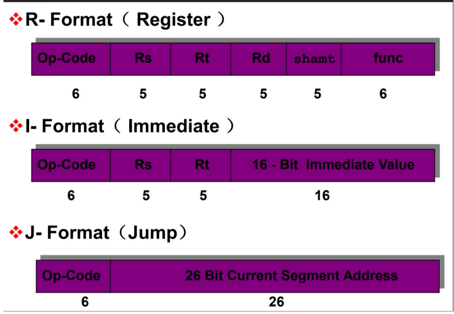
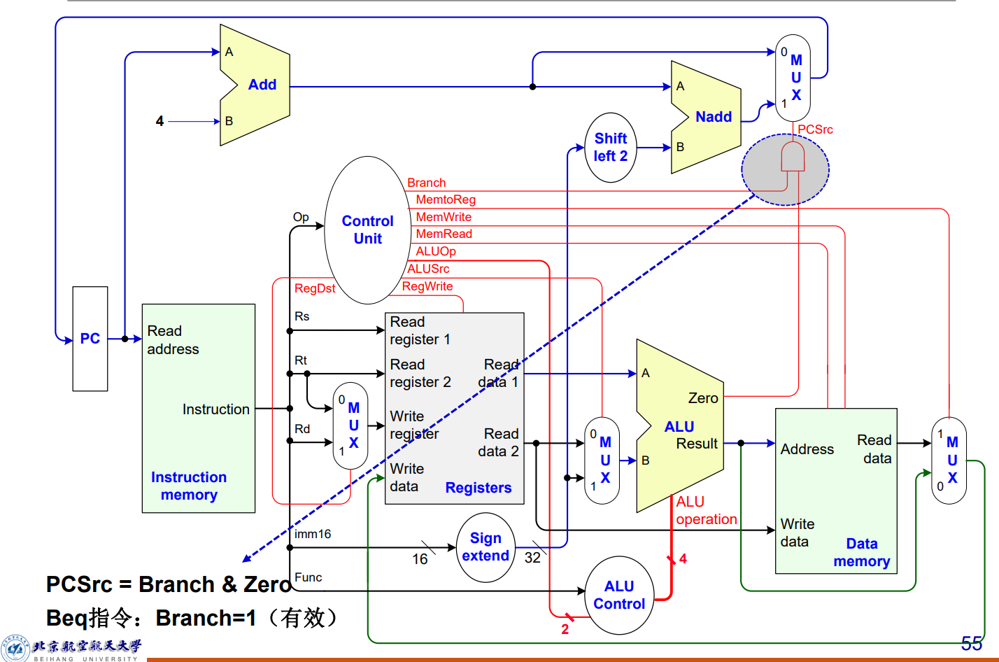
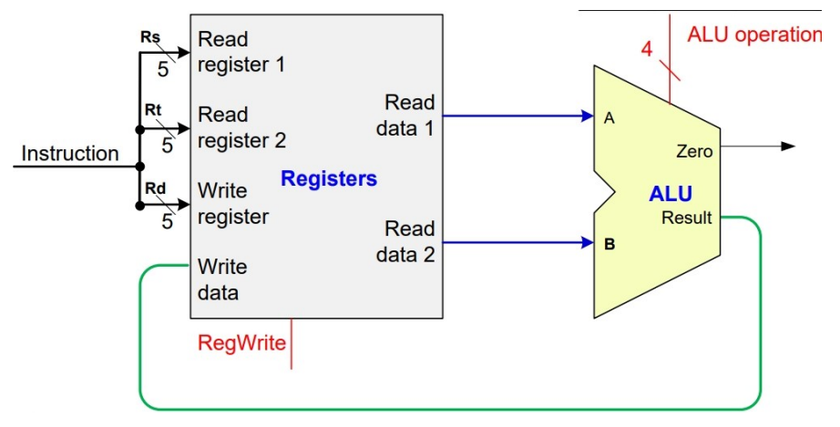
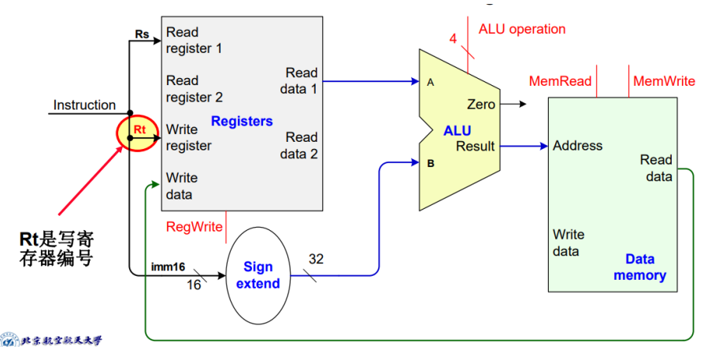
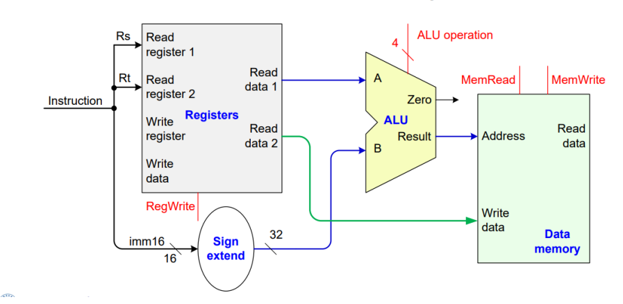
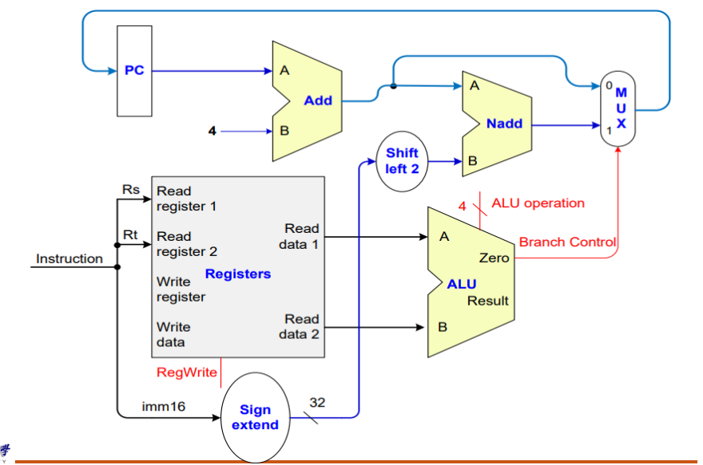
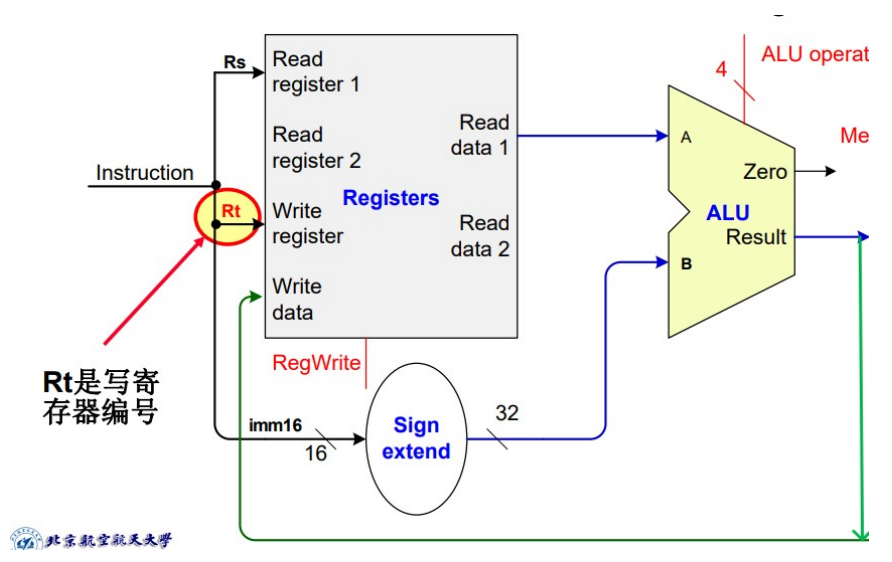
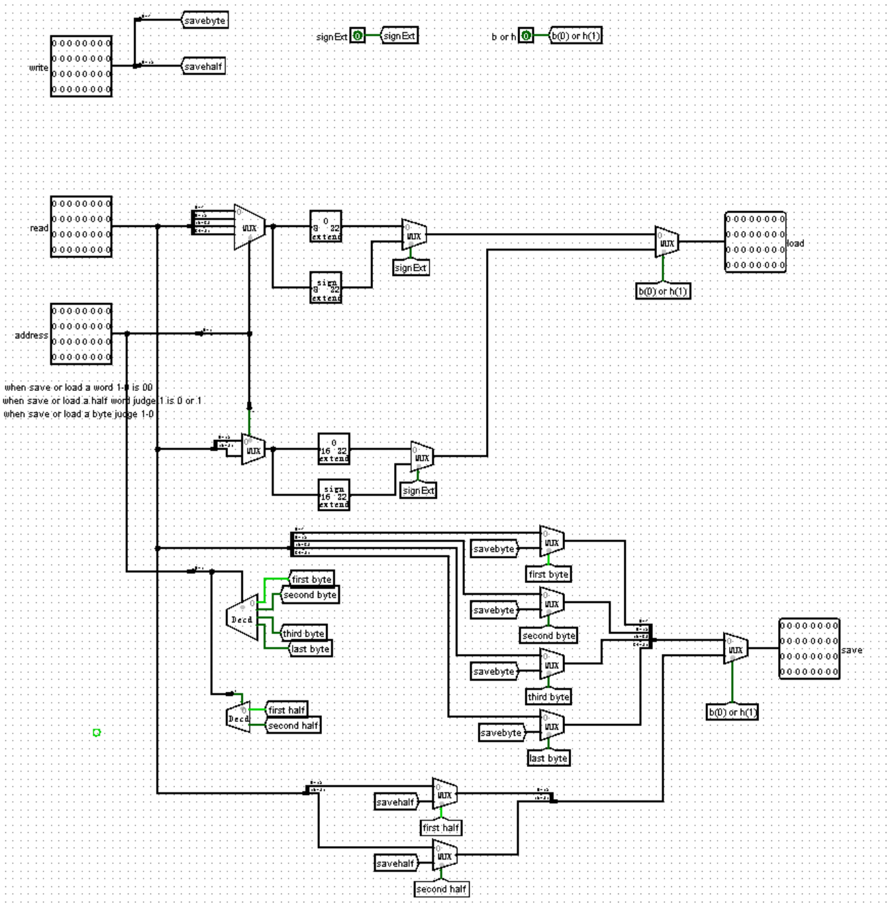
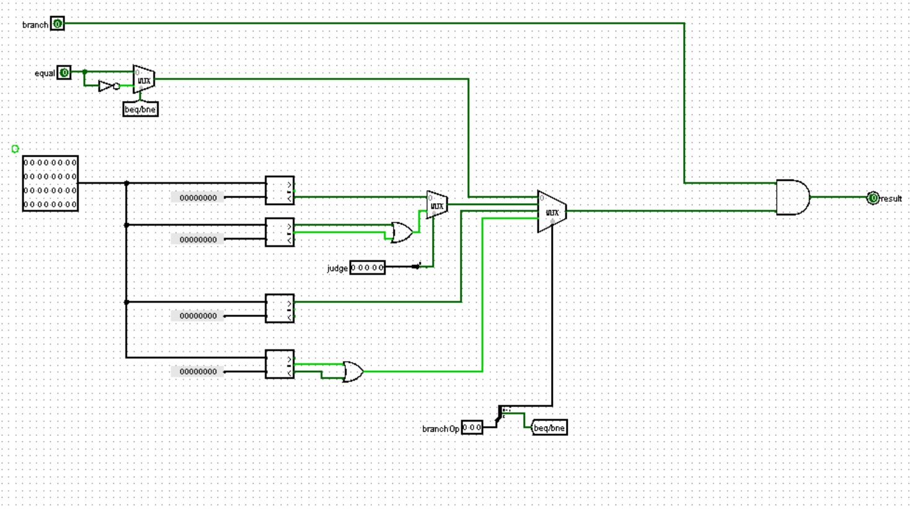

## 					<center>CPU Design Document</center>


### 1. CPU Design

#### 1.总体设计

​	通过对于《计算机组成与设计》一书的阅读，对于```P3```的CPU设计我有如下思考，设计MIPS架构的CPU的本质在于从指令存储器中读出32位MIPS指令，并对MIPS指令进行解析进而完成指令中要求的操作。在本次实验中，要求实现的指令有```add```,```sub```,```ori```,```lw```,```sw```,```beq```,```lui```,```nop```其中，R型指令有```add,sub```,I型指令有```ori,lw,sw,beq,lui```，特殊的有```nop```指令，32位全为0。

RIJ类型指令图:



此次实验中要求实现的基本指令：

1. R型

| Operation | Op-Code |  rs  |  rt  |  rd  | shamt(移位) |  func  |
| :-------: | :-----: | :--: | :--: | :--: | :---------: | :----: |
|    add    | 000000  |      |      |      |    00000    | 100000 |
|    sub    | 000000  |      |      |      |    00000    | 100010 |

2. I型

| Operation | Op-Code |  rs  |  rt  | 16-bit-immediate-value |
| :-------: | :-----: | :--: | :--: | :--------------------: |
|    ori    | 001101  |      |      |                        |
|    lw     | 100011  |      |      |                        |
|    sw     | 101011  |      |      |                        |
|    beq    | 000100  |      |      |                        |
|    lui    | 001111  |      |      |                        |

3. nop

​	32'b0

​	将我们要实现的CPU分为几个模块：IFU（取指令单元），GRF（寄存器堆），ALU（算术逻辑单元），DM（数据存储器），EXT（扩展单元），Controller（控制器）。

下面给出设计电路模块图：



#### 1. IFU取指令单元

​	由于题目中要求寄存器的``0x00003000``对应ROM的0地址，即第一条指令的地址，且寄存器异步复位到初值```0x00003000```，这里涉及到类似于为寄存器赋初值的操作，可以对寄存器进行地址映射，利用寄存器当前值完成“赋初值”，当寄存器值为0时加上0x00003000进行下一个地址NPC的计算，而在计算取ROM中指令地址时再减去0x00003000。注意寄存器中保存的为以字节为单位的偏移量，ROM中一条指令为4个字节，需要将pc寄存器中的值右移两位后才对应到ROM中对应的行地址。

#### 2.NPC计算下一条指令地址

​	利用PCSrc信号选择取出PC+4地址的指令还是进行beq跳转得到的地址，应当注意的是beq中跳转为以字为单位，要先对移位量shift左移两位得到对应的字节偏移量。

#### 3.ALU计算单元

| ALUOp | 运算             | 是否判断溢出                                              |
| ----- | ---------------- | --------------------------------------------------------- |
| 0000  | and              | no                                                        |
| 0001  | or               | no                                                        |
| 0010  | addu             | no                                                        |
| 0011  | subu             | no                                                        |
| 0010  | add              | yes（结合控制信号judge-overflow选择是否进行判断溢出问题） |
| 0011  | sub              | yes                                                       |
| 0100  | lui              | no                                                        |
| 0101  | xor              | no                                                        |
| 0110  | nor              | no                                                        |
| 0111  | logical-left     | no                                                        |
| 1000  | logical-right    | no                                                        |
| 1001  | Arth-right       | no                                                        |
| 1010  | sign-compare     | no                                                        |
| 1011  | unsigned-compare | no                                                        |

**注：由于教程中要求对于add sub不实现溢出判断 即把add sub当作addu subu用，而在指令中不具体实现addu subu**

#### 4. GRF寄存器堆

​	寄存器中有32个通用寄存器，

* 注意0号寄存器的值只能为0，故将使能端WE设置为常量0
* 在写入端的解复用器DMX需要设置为三态，否则在写入一个值的时候其他值会被清零

#### 5.Controller总控制器

​	Controller的输入为读取出指令的Op-Code,即[31:26]位，输出为八个控制信号，其中输送给ALU Controller的控制信号ALUOp为2位，下面对不同指令需要哪些控制信号进行分析，对不同指令按照其```Op-Code```进行分类.

##### 1. R型指令

###### 1. 数据通路



###### 2.输出信号

Op-Code:000000，对R型指令对应的Controller输出情况列表

| 信号名称 | 取值情况 |
| -------- | -------- |
| RegDst   | 1        |
| ALUSrc   | 0        |
| MemtoReg | 0        |
| RegWrite | 1        |
| MemRead  | 0        |
| MemWrite | 0        |
| Branch   | 0        |
| EXTOp    | 0        |

##### 2.lw指令

###### 1.数据通路



###### 2.输出信号

Op-Code:100011，对应的输出情况列表

| 信号名称 | 取值情况 |
| -------- | -------- |
| RegDst   | 0        |
| ALUSrc   | 1        |
| MemtoReg | 1        |
| RegWrite | 1        |
| MemRead  | 1        |
| MemWrite | 0        |
| Branch   | 0        |
| EXTOp    | 1        |

##### 3.sw指令

###### 1.数据通路



###### 2.输出信号

Op-Code:101011

| 信号名称 | 取值情况 |
| -------- | -------- |
| RegDst   | x        |
| ALUSrc   | 1        |
| MemtoReg | x        |
| RegWrite | 0        |
| MemRead  | 0        |
| MemWrite | 1        |
| Branch   | 0        |
| EXTOp    | 1        |

##### 4.beq指令

###### 1.数据通路



###### 2.输出信号

Op-Code: 000100

| 信号名称 | 取值情况 |
| -------- | -------- |
| RegDst   | x        |
| ALUSrc   | 0        |
| MemtoReg | x        |
| RegWrite | 0        |
| MemRead  | 0        |
| MemWrite | 0        |
| Branch   | 1        |
| EXTOp    | 1        |

**注：由于sw与beq指令中都不需要向寄存器中存储数字，即RegWrite=0,此时RegDst与MemtoReg可以为不定值x因为无论为多少都不会写入**

##### 5.lui指令

###### 1.数据通路

​	将原16位imm后拼接16位0，存入目标寄存器，位拼接操作在ALU中实现，对应操作编码为1000。此处rs寄存器为$0。



###### 2.输出信号

Op-Code:001111，对应的输出情况列表

| 信号名称 | 取值情况 |
| -------- | -------- |
| RegDst   | 0        |
| ALUSrc   | 1        |
| MemtoReg | 0        |
| RegWrite | 1        |
| MemRead  | 0        |
| MemWrite | 0        |
| Branch   | 0        |
| EXTOp    | 0        |

##### 6.ori指令

###### 1.数据通路


###### 2.输出信号

Op-Code:001101

**需要注意的是ori指令中16位立即数的范围是:0~65535,如果位数超出16位则会发生截断保留低位**

| 信号名称 | 取值情况 |
| -------- | -------- |
| RegDst   | 0        |
| ALUSrc   | 1        |
| MemtoReg | 0        |
| RegWrite | 1        |
| MemRead  | 0        |
| MemWrite | 0        |
| Branch   | 0        |
| EXTOp    | 0        |

**注：不需要向DM中进行读或写操作，MemRead=MemWrite=0**

| 指令操作码 | 操作     | func   | ALU动作   | ALU控制信号 |
| ---------- | -------- | ------ | --------- | ----------- |
| lw         | 取字     | xxxxxx | 加        | 0010        |
| sw         | 存字     | xxxxxx | 加        | 0010        |
| beq        | 相等跳转 | xxxxxx | 减        | 0110        |
| add        | 加       | 100000 | 加        | 0010        |
| sub        | 减       | 100010 | 减        | 0110        |
| and        | 与       | 100100 | 与        | 0000        |
| or         | 或       | 100101 | 或        | 0001        |
| ori        | 或立即数 | xxxxxx | 或        | 0001        |
| lui        | 存半字   | xxxxxx | 低位拼接0 | 1000        |

##### 7.利用与或门阵列实现对指令的识别和产生相应的控制信号

###### 1.指令识别

​	对于指令的识别主要用到32位指令中的opcode字段([31-26]位)与funct字段([5:0]位)，只有R型指令会利用funct字段进行指令的识别，其他类型指令只需要opcode字段即可。思路是，先利用opcode进行识别，识别出除R型指令之外的其他类型具体指令后，再利用funct字段对R型指令进行识别。

###### 2.产生控制信号

​	我将理论课中介绍的Controller与ALU Controller合并为一个整体，Controller产生的控制信号直接控制ALU进行运算，运用或阵列进行操作，只将输出信号表中为1的接到对应的信号或门上，对于0或x值均无连接，**连接时有一个小技巧为将opcode与funct点为该指令的码，之后只需要将亮色的线连接到与门上。**

##### 8.对补充的指令的实现思路进行总结

###### 1.补充的R型指令

1. 运算指令

   通过在ALU中传递不同的ALUOp实现，如add,sub,and,or,nor,xor

2. 移位指令

   如sll,srl,sllv,srlv,sra,srav,在ALU中通过Shifter实现逻辑左移，逻辑右移，算术右移。其中sll,srl,sra是将rt中的数值移动s([4:0]位立即数)位存储到rd中，在ALU的传入移位量端口控制信号```shiftvar=0```，sllv,srlv,srav将rt中的值移动rs位后存储入rd，需要注意的是rs只取低五位，相当于```s<——GPR[rs]4...0```，控制信号```shiftvar=1```。

3. 置位指令

   slt,sltu(set if less than)，同样在在ALU中实现，slt对两个操作数进行符号比较，sltu对两个操作数进行无符号比较，比较结果进行0扩展至32位赋值到rd

4. 跳转指令

   jr,jalr.跳转指令需要着重进行分析，

   1. jr :跳转到寄存器rs中存储的地址，在电路中对应GRF中读取的数据RD1，在NPC模块中实现跳转。
   2. jalr: PC跳转到GPR[rs]中保存的地址，并将当前PC+4保存在GPR[rd]中，相比jr多了将PC+4存入GPR[RD]的功能。在NPC模块中输出PC+4，在寄存器堆写入数据端口，控制信号```PC+4=1```，(**控制信号PC+4只有jal和halr指令会涉及到将当前PC+4存入寄存器**)选择写入寄存器信号```RegDst=1```，```ralink=0```（**控制信号ralink=1时写入31号寄存器,jal指令专属**）

###### 2.补充的J型指令

​	跳转指令在NPC中实现。

1. j ，j跳转指令默认的地址为26位，需要在NPC模块中进行补全，形式为```(PC+4)31...28 | j-address |00```
2. jal指令与j指令计算地址的方式相同，同时将PC+4存入31号寄存器即ra寄存器，给出重要的控制信号:```ralink=1```,```pc+4=1```,```jump=1```

###### 3.补充的I型指令

1. 运算指令

   凡是带立即数运算的如addi,subi,ori,andi等都需要在ALU控制信号```ALUSrc=1```，选择符号扩展后的32位立即数，运算控制信号ALUOp与R类运算相同

2. B类跳转指令

   **注意：B类跳转指令对16位地址偏移量都是进行符号扩展**，Control Unit输出branch，branchOp,完成对具体指令的识别，对于是否满足条件进行跳转的判断则在sel-B模块中实现，尤其要注意在sel-B模块中由于是要进行大于0小于0的判断，比较器应该选择为有符号的。其中beq和bne指令由ALU中输出信号equal判定。

3. 置位指令

   slti,sltiu，比较时对第二个操作数```ALUSrc=1```

4. 访存指令

   sw,sh,sb,lw,lh,lb,lbu,lhu等指令的具体实现已经在HorB模块中有了比较详细的叙述，利用address[1:0]进行判断并进行"插入"操作

#### 6.DM数据存储

​	一定要注意DM需要时钟信号控制！DM在时钟上升沿写入数据，一开始没有给DM加时钟信号导致数据没有及时存入```QAQ```。

​	**补充指令sb,lb,sh,lh,lbu,lhu，在DM模块中增加新模块HorB，根据控制信号b or h选择按照byte进行操作还是按照half word进行操作。**首先分析传入地址，传入地址是以字节为单位的，我们可以在已知对字/半字/字节操作的的情况下，分析出具体的半字/字节。记传入地址最后两位```address[1:0]```

| 操作单位  | address[1:0] | 操作对象     |
| --------- | ------------ | ------------ |
| word      | 00           | 字           |
| half word | 00           | 第一个半字节 |
| half word | 10           | 第二个半字节 |
| byte      | 00           | 第一个字节   |
| byte      | 01           | 第二个字节   |
| byte      | 10           | 第三个字节   |
| byte      | 11           | 第四个字节   |

​	**思路：当操作类型为load(读取)：先读取出来一个字，再从中选择部分进行load，当操作类型为save(存入)：先读取出来对应地址上的一个字，再在相应位置上插入想要存入的内容，这就要求sb,lb,sh,lh,lbu,lhu进行操作前需要先从对应地址上读取，即MemRead = 1**.

电路图如下：



#### 7.EXT位扩展

​	位扩展单元由EXTOp信号控制，选择进行符号扩展还是0扩展，其中sw,lw,beq均为符号扩展，ori为0扩展。

#### 8.sel-B具体判断B指令

​	实现的B类型跳转指令有,beq,bne,bgez,bgtz,blez,bltz。可以大致分为两类。第一类为beq,bne，这两个指令是对于两个操作数进行比较然后进行跳转（比较在ALU中完成），第二类中都是进行与0的比较（在sel-B中完成）。branchOp列表如下:

| branchOp | 指令 |
| -------- | ---- |
| 000      | beq  |
| 001      | bltz |
| 001      | bgez |
| 010      | bgtz |
| 011      | blez |
| 100      | bne  |

​	其中beq指令与bne指令都由equal信号判断，故对于beq\bne的选择通过最高位选择。在001编码中，对bltz和bgez进行了合并，因为这两种指令的opcode一致为000001，故在control unit中无法实现对这两种指令的识别，**需要利用这两种指令的[20:16]进行分辨，即judge信号，bltz:00000,bgez:00001**，这样实际上需要选择的只有四个信号，利用branchOp的低两位进行判断，电路图如下：



**尤其需要注意的是：在sel-B模块中比较器应当选择有符号的而不是unsigned，因为他们都是与0进行比较，而在ALU模块中slt指令需要进行符号比较，sltu指令需要进行无符号比较.**

### 2. test scheme

​	课下测试利用课程组提供的jar包进行测试，从MARS中导出16进制文件load到我的单周期CPU中，运行CPU，将存储在寄存器中的数据与MARS运行结果进行比对。

##### 1.基本指令测试

###### 1. ori-test

​	**ori指令中的立即数为无符号扩展，不存在复数的情况**，测试指令

```MIPS
ori $a0,$0,123
ori $a1,$a0,456
```

###### 2. lui-test

```MIPS
lui $a2,123 #符号位为0
lui $a3,0xffff #符号位为1
```

###### 3. add-test

```MIPS
lui $a2, 123            # 符号位为 0
lui $a3, 0xffff         # 符号位为 1
ori $a3, $a3, 0xffff    # $a3 = -1
add $s0, $a0, $a2      # 正正
add $s1, $a0, $a3      # 正负
add $s2, $a3, $a3      # 负负
```

###### 4.sw-test

```MIPS
ori $a0,$0,1
ori $a1,$0,2
ori $a2,$0,3
ori $t0, $0, 0x0000
sw $a0, 0($t0)
sw $a1, 4($t0)
sw $a2, 8($t0)
```

###### 5.lw-test

```MIPS
ori $a0,$0,1
ori $a1,$0,2
ori $a2,$0,3
ori $t0, $0, 0x0000
sw $a0, 0($t0)
sw $a1, 4($t0)
sw $a2, 8($t0)
lw $a0, 0($t0)
lw $a1, 12($t0)
sw $a0, 28($t0)
sw $a1, 32($t0)
```

###### 6.beq-test

```MIPS
ori $a0, $0, 1
ori $a1, $0, 2
ori $a2, $0, 1
beq $a0, $a1, loop1     # 不相等
beq $a0, $a2, loop2     # 相等
loop1:sw $a0, 36($t0)
loop2:sw $a1, 40($t0)
```

###### 7.将以上指令综合测试

```MIPS
ori $a0, $0, 123
ori $a1, $a0, 456
lui $a2, 123            # 符号位为 0
lui $a3, 0xffff         # 符号位为 1
ori $a3, $a3, 0xffff    # $a3 = -1
add $s0, $a0, $a2      # 正正
add $s1, $a0, $a3      # 正负
add $s2, $a3, $a3      # 负负
ori $t0, $0, 0x0000
sw $a0, 0($t0)
sw $a1, 4($t0)
sw $a2, 8($t0)
sw $a3, 12($t0)
sw $s0, 16($t0)
sw $s1, 20($t0)
sw $s2, 24($t0)
lw $a0, 0($t0)
lw $a1, 12($t0)
sw $a0, 28($t0)
sw $a1, 32($t0)
ori $a0, $0, 1
ori $a1, $0, 2
ori $a2, $0, 1
beq $a0, $a1, loop1     # 不相等
beq $a0, $a2, loop2     # 相等
loop1:sw $a0, 36($t0)
loop2:sw $a1, 40($t0)
```

​	**需要注意的是MARS设置中不应当开启delayed branching，否则会运行跳转指令如beq的下一条指令，与本地CPU不符**

##### 2.补充指令后计算指令综合测试

```MIPS

```

##### 3.补充指令后访存指令综合测试

```MIPS
.text

li	$s0, 0xABCF1234
li	$s1, 0x1234ABCD
li	$s2, 0xa1b2c3d4
li	$s3, 0x7fff0000

sb	$s1, 100($0)
sb	$s2, 103($0)
sb	$s3, 105($0)
sb	$s4, 107($0)
sh	$s4, 108($0)
sh	$s3, 110($0)
sh	$s2, 112($0)
sh	$s1, 114($0)
sw	$s0, 0($0)
sw	$s1, 4($0)
sw	$s2, 8($0)
sw	$s3, 12($0)
lw	$t0, 0($0)
lw	$t1, 4($0)
lw	$t2, 8($0)
lw	$t3, 12($0)
sw	$t0, 16($0)
sw	$t1, 20($0)
sw	$t2, 24($0)
sw	$t3, 28($0)
lb	$t0, 3($0)
lb	$t1, 7($0)
lb	$t2, 11($0)
lb	$t3, 13($0)
sw	$t0, 32($0)
sw	$t1, 36($0)
sw	$t2, 40($0)
sw	$t3, 44($0)
lbu	$t0, 3($0)
lbu	$t1, 7($0)
lbu	$t2, 11($0)
lbu	$t3, 13($0)
sw	$t0, 48($0)
sw	$t1, 52($0)
sw	$t2, 56($0)
sw	$t3, 60($0)
lh	$t0, 2($0)
lh	$t0, 4($0)
lh	$t0, 8($0)
lh	$t0, 12($0)
sw	$t0, 64($0)
sw	$t1, 68($0)
sw	$t2, 72($0)
sw	$t3, 76($0)
lhu	$t0, 2($0)
lhu	$t0, 6($0)
lhu	$t0, 8($0)
lhu	$t0, 12($0)
sw	$t0, 80($0)
sw	$t1, 84($0)
sw	$t2, 88($0)
sw	$t3, 92($0)
li	$v0, 10
syscall
```

##### 4.补充指令后跳转指令综合测试

```MIPS
.text
main:	
li	$s0, 0
li	$s1, -1000
li	$s2, 1000
lui	$s3, 0x8000	#s3 is  -2147483648
lui	$s4, 0x8000
ori	$s4, 0x0001	#s4 is  -2147483647
lui	$s5, 0x7fff
ori	$s5, 0xffff	#s5 is  2147483647
lui	$s6, 0x7fff
ori	$s6, 0xfffe	#s6 is 2147483646


beq_1:	beq	$s0, $s0, beq_1_test
beq_10:  beq	$s5, $s6, beq_10_test
beq_end:

bne_1:	bne	$s0, $s1, bne_1_test
bne_10:	bne	$s3, $s3, bne_10_test
bne_end:

blez_1: blez	$s0, blez_1_test
blez_10: blez	$s6, blez_10_test
blez_end:

bgtz_1:	 bgtz	$s2,bgtz_1_test
bgtz_10: bgtz	$s1,bgtz_10_test
bgtz_end:

jal_1:	jal	jal_1_test
jal_5:	jal	jal_5_test
jal_end:

jalr_1:	or	$v0, $0, 12916
	jalr	$v1, $v0
jalr_5:	or	$v0, $0, 12948
	jalr	$v1, $v0

sw	$t0, 0($s0)
sw	$t1, 0($s0)
sw	$t2, 0($s0)
sw	$t3, 0($s0)
sw	$t4, 0($s0)
sw	$t5, 0($s0)
li	$v0, 10
syscall
	
beq_1_test: addi	$t0,$t0, 1
	   j	beq_10
beq_10_test: addi	$t0,$t0, 1
	   j	beq_end

bne_1_test: addi	$t1,$t1, 1
	   j	bne_10
bne_10_test:addi	$t1,$t1, 1
	   j	bne_end  	      	      	   

blez_1_test:	addi	$t2,$t2, 1
		j	blez_10
blez_10_test:	addi	$t2,$t2, 1
		j	blez_end

bgtz_1_test:	addi	$t3,$t3 1
		j	bgtz_10
bgtz_10_test:	addi	$t3,$t3 1
		j	bgtz_end
		
jal_1_test:	addi	$t4, $4, 1
		jr	$ra
jal_5_test:	addi	$t4, $4, 1
		jr	$ra

jalr_1_test:	addi	$t5, $t5, 1
		jr	$v1
jalr_5_test:	addi	$t5, $t5, 1
		jr	$v1
```

#### 2.编写python脚本完成自动化测试

​	利用正则表达式替换，对ROM中内容进行改写，并生成新的电路。

```python
import os
import re
#generate ROM-File
command="java -jar MARS_mod.jar CPUtest.asm nc mc CompactTextAtZero a dump .text HexText rom.txt"
os.system(command)
content = open("rom.txt").read()

#write ROM-File to Circle—File
cur = open("CPU.circ", encoding="utf-8").read()
cur = re.sub(r'addr/data: 12 32([\s\S]*)</a>',"addr/data: 12 32\n" + content + "</a>", cur)
with open("cpu_remake.circ","w", encoding="utf-8") as file:
 file.write(cur)
```

​	**注意：cpu_remake是根据原CPU新生成的文件，若有改动应该在原CPU中完成，若在cpu_remake中进行改动，改动会发生“丢失”，因为cpu_remake的每一次生成都是根据CPU生成**

### 3.思考题

#### 1.单周期CPU的模块中哪些发挥状态存储功能，哪些发挥状态转移功能？

​	答：在单周期CPU中，我们以```splitter```为界可以将CPU分为一个Moore机与一个Mealy机，两个状态机各有一个状态存储模块与一个状态转移模块。状态存储：IM,GRF,DM，状态转移：NPC,ALU

#### 2.IM使用ROM，DM使用RAM，GRF使用Register合理吗

​	合理，Information Memory用来存储运行的程序指令，要保证程序不会被更改，使用ROM（Read Only Memory）， Data Memory是数据存储区，需要进行写入和读取，使用RAM。

#### 3.额外实现的单元

​	我将IFU中的取指令功能与计算下一指令地址的逻辑分开，计算下一指令地址的功能单独由NPC模块实现，包括对B型和J型指令的跳转。具体细分判断B类型跳转指令的sel-B模块，HorB，存储或读取时对字节和半字进行操作的模块。

#### 4.nop空指令不需要加入信号真值表

​	实际上nop指令会被识别为sll指令，具体形式为```sll $0,$0,0```，即将0号寄存器左移0位，确实不会发生影响。

#### 5.评价MIPS指令及汇编语言一节中测试样例的强度

​	测试样例的覆盖是不全面的，有些寄存器没有用到，有些负数的特殊情况没有涉及，跳转的指令没有涉及等。
