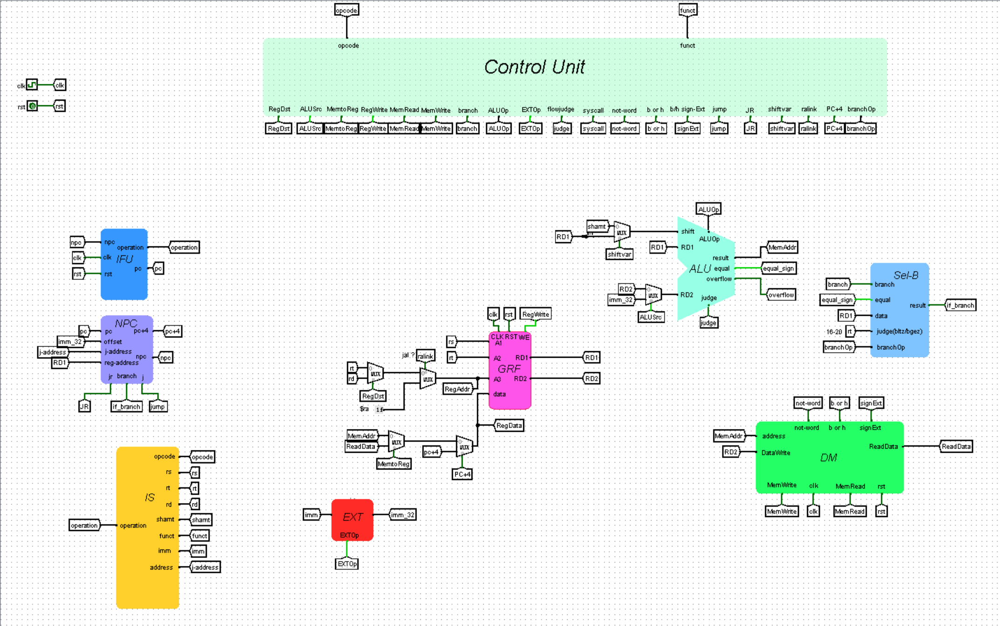
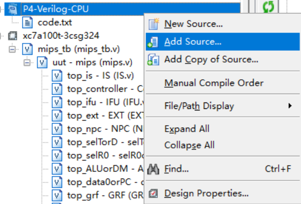

# <center>P4-Verilog-CPU-Design-Document</center>


## 零.数据通路描述(P4设计文档中最好加上P3图)



​	本次设计文档基于P3-logisim-CPU的设计文档完成，P4的主要任务即为将logisim电路映射到verilog代码(看图写话？)，对上次P3中实现的每个模块单独建立```module.v```，利用verilog语言对其行为进行建模，注意本次CPU设计中，不同于P3的异步复位，P4在各模块中使用```同步复位!!!```，verilog语言表示同步复位与异步复位如下代码:

```verilog
//同步复位表示方法
always@(posedge clk) begin
    if(reset) begin
        PC <= 32'h0000_3000;
    end
    else begin
        PC <= npc; 
    end
end

//异步复位表示方法   将复位信号加入敏感信号列表
always@(posedge clk or posedge reset) begin
    if(reset) begin
        PC <= 32'h0000_3000;
    end
    else begin
        PC <= npc;
    end
end
```

## 一.模块设计

### 1.IFU取指令单元

​	IFU中存储单元有PC寄存器和存储指令的ROM。IFU中存储指令要求的ROM大小为16KiB，即4096*32bit。在verilog语言中使用寄存器数组实现对ROM的模拟，即4096个32位的寄存器。使用系统命令```$readmemh("code.txt,ROM")```将code.txt中的16进制代码读入名为ROM的数组中，由于PC同步复位到32'h0000_3000，而ROM中对应存储第一条指令的地址为0，即PC寄存器中存储的地址与真实ROM地址存在0x0000_3000差量，故设计```reg [31:0] tmp```存储实际的地址，即```pc-0x0000_3000```，进而读出指令的地址为```tmp[13:2]```。

#### 1.端口定义列表:

| 名称  | 方向 | 位宽   | 功能         |
| ----- | ---- | ------ | ------------ |
| clk   | I    | 1      | 时钟信号     |
| reset | I    | 1      | 同步复位信号 |
| npc   | I    | [31:0] | 下一指令地址 |
| pc    | O    | [31:0] | 当前指令地址 |
| instr | O    | [31:0] | 当前执行指令 |

#### 2.设计代码:

**需要注意的是利用系统任务$readmemh向ROM中读入数据需要单独在initial块中进行**，

```verilog
//初始化ROM中内容
initial begin
	$readmemh("code.txt",ROM);
end
```

#### 3.small tip : add source的用法

​	对于code.txt的导入和上机时对于下载代码的导入，使用**add source**功能方便快捷，之前一直不知道这个功能，麻烦了好多``QAQ``

之前使用新建文件之后移动到该文件夹下的方法，在很多环境下无法成功读取入IM(例如机房电脑和虚拟机)，**add source 插图如下**



**注：使用add source对代码进行改动是可以同步到原文件的!**

### 2. IS指令分线器

​	此模块的功能比较简单，由组合逻辑完成，传入当前运行的指令将其分割。

#### 端口定义列表:

| 名称    | 方向 | 位宽   | 功能            |
| ------- | ---- | ------ | --------------- |
| instr   | I    | [31:0] | 输入执行指令码  |
| opcode  | O    | [5:0]  | 操作码          |
| rs      | O    | [4:0]  | rs              |
| rt      | O    | [4:0]  | rt              |
| rd      | O    | [4:0]  | rd              |
| shamt   | O    | [4:0]  | 移位            |
| funct   | O    | [5:0]  | 功能码          |
| imm     | O    | [15:0] | 立即数          |
| address | O    | [25:0] | J类指令跳转地址 |

### 3. NPC地址计算单元

#### 端口定义列表:

| 名称        | 方向 | 位宽   | 功能        |
| ----------- | ---- | ------ | ----------- |
| pc          | I    | [31:0] | 当前地址    |
| offset      | I    | [31:0] | B类跳转地址 |
| j_address   | I    | [25:0] | J类跳转地址 |
| reg_address | I    | [31:0] |             |

### 4. GRF寄存器堆

#### 端口定义列表

| 名称      | 方向 | 位宽   | 功能                |
| --------- | ---- | ------ | ------------------- |
| clk       | I    | 1      | 时钟信号            |
| reset     | I    | 1      | 同步复位信号        |
| rs        | I    | [4:0]  | 读寄存器1           |
| rt        | I    | [4:0]  | 读寄存器2           |
| rd        | I    | 5      | 写寄存器            |
| RegWrite  | I    | 1      | 写入使能            |
| pc        | I    | [31:0] | 当前指令地址        |
| writedata | I    | [31:0] | 写入                |
| readdata1 | O    | [31:0] | 寄存器1中存储的数值 |
| readdata2 | O    | [31:0] | 寄存器2中存储的数值 |

### 5. ALU计算单元

#### 端口定义列表

| 名称      | 方向 | 位宽   | 功能                           |
| --------- | ---- | ------ | ------------------------------ |
| src_A     | I    | [31:0] | 操作数1                        |
| src_B     | I    | [31:0] | 操作数2                        |
| ALUOp     | I    | [3:0]  | ALU操作类型                    |
| shamt     | I    | [4:0]  | 移位量                         |
| flowjudge | I    | 1      | 是否进行溢出判断(目前只有addi) |
| equal     | O    | 1      | 判断两个操作数是否相等         |
| overflow  | O    | 1      | 溢出信号                       |
| result    | O    | [31:0] | 计算结果                       |

### 6. Controller控制器

​	采用与或门的思路对指令进行识别并产生相应的控制信号

#### 1.端口定义列表:

| 名称      | 方向 | 位宽  | 功能                                       |
| --------- | ---- | ----- | ------------------------------------------ |
| opcode    | I    | [5:0] | 操作码                                     |
| funct     | I    | [5:0] | 功能码                                     |
| MemtoReg  | O    | 1     | 选择将DM中的数据存储到GRF                  |
| RegDst    | O    | 1     | 选择写入寄存器地址(只有R型指令有效)        |
| ALUSrc    | O    | 1     | 选择ALU第二个操作数(RD2/imm_32)            |
| RegWrite  | O    | 1     | 寄存器堆写入使能信号                       |
| MemWrite  | O    | 1     | DM中RAM写入使能信号                        |
| flowjudge | O    | 1     | 进行运算溢出判断(当前指令集中只有addi有效) |
| shiftvar  | O    | 1     | 选择以寄存器的[4:0]位进行移位              |
| ralink    | O    | 1     | 定向向31号寄存器中写入(jal指令)            |
| PCtoReg   | O    | 1     | 将PC+4值作为写入数据存入寄存器堆(jal/jalr) |
| EXTOp     | O    | 1     | 对立即数进行符号/0扩展                     |
| branch    | O    | 1     | 是否为B类跳转指令                          |
| branchOp  | O    | [2:0] | 对B类跳转指令进行编码                      |
| ALUOp     | O    | [3:0] | ALU操作控制信号                            |
| LSOp      | O    | [2:0] | DM操作控制信号                             |
| NPCOp     | O    | [1:0] | NPC地址选择信号                            |

**注：控制信号在对应使用模块中进行说明，P4的控制信号中取消了P3中的MemRead信号，感觉上要简洁一些**

#### 2.设计代码示例——我的控制器风格

​	设计代码比较长，只举例说明，**好传统是利用localparam定义opcode和funct，用case语句进行分支选择而不是if-else**

**注意：每次信号传入时的寄存器集体清零操作**

```verilog
module Controller(
input [5:0] opcode,
input [5:0] funct,
output reg MemtoReg,
output reg MemWrite,
output reg ALUSrc,
output reg RegWrite,
output reg EXTOp,
output reg RegDst,
output reg PCtoReg,
output reg ralink,
output reg shiftvar,
output reg flowjudge,   //由于要求实现的add sub不进行溢出判断 应该当前实现的指令中需要判断的只有addi
output reg Branch,
output wire [2:0] branchOp,
output wire [1:0] NPCOp,
output wire [3:0] ALUOp,
output wire [2:0] LSOp
);
//有寄存器赋初值问题
//R型指令
//(运算)
reg op_add;
...
localparam R = 6'b000000;
localparam _add = 6'b100000;
...
    
//识别指令
always@(*) begin
//控制信号清0
op_add = 1'b0;

case(opcode)

R :
begin
case(funct)
_add : op_add = 1'b1;
...
endcase
end
  
...
    
endcase

//连接输出 
RegWrite =  op_add | ... ;
endmodule
```

#### 3.指令与控制信号汇总表

| 控制信号    | 有效指令                                                     |
| ----------- | ------------------------------------------------------------ |
| MemtoReg    | lw,lh,lb,lhu,lbu                                             |
| RegDst      | add,sub,and,or,xor,nor,sll,srl,sra,sllv,srlv,srav,slt,sltu,jr,jalr(R型指令) |
| ALUSrc      | sw,lw,sh,sb,lh,lhu,lb,lhu,lui,addi,addiu,andi,ori,xori,slti,sltiu |
| RegWrite    | slt,sltu,xor,nor,or,and,add,sub,lui,ori,andi,xori,addi,addiu,lw,lh,lb,lhu,lbu,jal,jalr,sll,srl,sra,sllv,srlv,srav,slti,sltiu |
| MemWrite    | sw,sb,sh                                                     |
| flowjudge   | addi                                                         |
| shiftvar    | sllv,srlv,srav                                               |
| ralink      | jal                                                          |
| PCtoReg     | jal,jalr                                                     |
| EXTOp       | addi,addiu,slti,sltiu,sw,sh,sb,lw,lh,lb,lhu,lbu,beq,bne,bgtz,bgez,bltz,blez |
| Branch      | beq,bne,bgtz,bgez,bltz,blez                                  |
| branchOp[2] | bne                                                          |
| branchOp[1] | bgtz,blez                                                    |
| branchOp[0] | bgez,blez,bltz                                               |
| ALUOp[3]    | srl,srlv,sra,srav,slt,sltu,slti,sltiu                        |
| ALUOp[2]    | sll,sllv,xori,nor,lui,xor                                    |
| ALUOp[1]    | add,addi,addiu,sub,nor,sll,sllv,slt,slti,sltiu,sw,sh,sb,lw,lh,lhu,lb,lbu |
| ALUOp[0]    | or,ori,sub,xor,xori,sll,sllv,sra,srav,sltu,sltiu             |
| NPCOp[1]    | jalr,jr,j,jal                                                |
| NPCOp[0]    | jalr,jr,beq,bne,bgtz,bgez,bltz,blez                          |
| LSOp[2]     | lh,lhu,lb,lbu                                                |
| LSOp[1]     | lb,lbu,lw,sb                                                 |
| LSOp[0]     | sh,lw,lhu,lbu                                                |

### 7. EXT符号扩展单元

#### 端口定义列表

| 名称   | 方向 | 位宽   | 功能                    |
| ------ | ---- | ------ | ----------------------- |
| imm    | I    | [15:0] | 进行扩展的16位立即数    |
| EXTOp  | I    | 1      | 选择进行符号扩展或0扩展 |
| imm_31 | O    | [31:0] | 进行扩展后的结果        |

### 8. DM数据存储

#### 1.端口定义列表

| 名称      | 方向 | 位宽   | 功能                |
| --------- | ---- | ------ | ------------------- |
| address   | I    | [31:0] | 写入/读取地址       |
| datawrite | I    | [31:0] | 写入数据            |
| MemWrite  | I    | 1      | RAM写入使能信号     |
| clk       | I    | 1      | 时钟信号            |
| reset     | I    | 1      | 同步复位信号        |
| LSOp      | I    | [2:0]  | 对/字/半字/字节操作 |
| readata   | O    | [31:0] | 读出数据            |

##### LSOp编码与对应指令

| LSOp编码 | 对应的存/取指令 |
| -------- | --------------- |
| 000      | sw              |
| 001      | sh              |
| 010      | sb              |
| 011      | lw              |
| 100      | lh              |
| 101      | lhu             |
| 110      | lb              |
| 111      | lbu             |

#### 2.设计代码:

​	依旧是延续P3中先将对应地址处数据读出再插入的思想，其中存储为时序逻辑，读取为组合逻辑。(但是写起来要比logisim简单太多),使用3072个32位寄存器数组模拟RAM。

```verilog
//要求的容量为12KB 3072*32bit
module DM(
input clk,
input reset,
input MemWrite,
input [2:0] LSOp,  //w h b
input [31:0] address,
input [31:0] datawrite,
output [31:0] dataread
);
reg [31:0] RAM[3071:0];

localparam sw = 3'b000;
localparam sh = 3'b001;
localparam sb = 3'b010;
localparam lw = 3'b011;
localparam lh = 3'b100;
localparam lhu = 3'b101;
localparam lb = 3'b110;
localparam lbu = 3'b111;
//读出该地址处存储的数据
reg tmp = RAM[address[13:2]];
// write to RAM
integer i = 0;
always@(posedge clk) begin
    if(reset) begin
        for(i = 0 ; i < 3072 ; i = i + 1) begin
            RAM[i] <= 32'b0;
        end
    end
    else if (MemWrite) begin //对LSOp进行分类
    if(LSOp == sw) begin
        RAM[address[13:2]] <= datawrite;
    end
    else if (LSOp == sh) begin
        if(address[1] == 1'b1) begin
            RAM[address[13:2]] <= {datawrite[15:0],tmp[15:0]};
        end
        else begin
            RAM[address[13:2]] <= {tmp[31:16],datawrite[15:0]};
        end
    end
    else if (LSOp == sb) begin
        if(address[1:0] == 2'b00) begin
            RAM[address[13:2]] <= {tmp[31:8],datawrite[7:0]};
        end
        else if (address[1:0] == 2'b01) begin
            RAM[address[13:2]] <= {tmp[31:16],datawrite[7:0],tmp[7:0]};
        end
        else if (address[1:0] == 2'b10) begin
            RAM[address[13:2]] <= {tmp[31:24],datawrite[7:0],tmp[15:0]};
        end
        else begin
            RAM[address[13:2]] <= {datawrite[7:0],tmp[23:0]};
        end
    end
    end  
end

//read from RAM
always@(*)begin
    if(LSOp == lw) begin
        dataread = tmp;
    end
    else if (LSOp == lh) begin  // sign-extend
        if(address[1] == 1'b0) begin
            dataread = {{16{tmp[15]}},tmp[15:0]};
        end
        else begin
            dataread = {{16{tmp[31]}},tmp[31:16]};
        end
    end
    else if (LSOp == lhu) begin
        if(address[1] == 1'b0) begin
            dataread = {16'b0,tmp[15:0]};
        end
        else begin
            dataread = {16'b0,tmp[31:16]};
        end
    end
    else if (LSOp == lb) begin
        if(address[1:0] == 2'b00) begin
            dataread = {{24{tmp[7]}},tmp[7:0]};
        end
        else if (address[1:0] == 2'b01) begin
            dataread = {{24{tmp[15]}},tmp[15:8]};
        end
        else if (address[1:0] == 2'b10) begin
            dataread = {{24{tmp[23]}},tmp[23:16]};
        end
        else begin
            dataread = {{24{tmp[31]}},tmp[31:24]};
        end
    end
    else begin
        if(address[1:0] == 2'b00) begin
            dataread = {24'b0,tmp[7:0]};
        end
        else if (address[1:0] == 2'b01) begin
            dataread = {24'b0,tmp[15:8]};
        end
        else if (address[1:0] == 2'b10) begin
            dataread = {24'b0,tmp[23:16]};
        end
        else begin
            dataread = {24'b0,tmp[31:24]};
        end
    end
end
endmodule
```

### 9.Sel-B B类指令判断单元

#### 1.端口定义列表

| 名称     | 方向 | 位宽   | 功能            |
| -------- | ---- | ------ | --------------- |
| data     | I    | [31:0] | rs寄存器中的值  |
| judge    | I    | [4:0]  | 区分bltz/bgez   |
| branchOp | I    | [2:0]  | 指令编码        |
| equal    | I    | 1      | beq判断相等     |
| branch   | I    | 1      | 是否为B类指令   |
| result   | O    | 1      | 执行B类跳转指令 |

##### branchOp编码与对应指令

| branchOp编码 | 对应指令 |
| ------------ | -------- |
| 000          | beq      |
| 001          | bltz     |
| 001          | bgez     |
| 010          | bgtz     |
| 011          | blez     |
| 100          | bne      |

#### 2.设计代码

```verilog
module SelectB(
input [31:0] data,
input [4:0] judge, //实际上只用最后一位
input equal,
input Branch,
input [2:0] branchOp,
output reg result
);
localparam beq = 3'b000;
localparam bgez_bltz = 3'b001;
localparam bgtz = 3'b010;
localparam blez = 3'b011;
localparam bne = 3'b100;
always@(*)begin
    case(branchOp)
    beq : result = equal & Branch;
    bne : result = (~equal) & Branch;
    bgez_bltz :
    begin
        if(judge[0] == 1'b1) begin
            result = ($signed(data) >= 32'b0) & Branch;
        end
        else begin
            result = ($signed(data) < 32'b0) & Branch;
        end
    end
    bgtz : result = ($signed(data) > 32'b0) & Branch; 
    blez : result = ($signed(data) <= 32'b0) & Branch;
    endcase
end
endmodule
```

### 10.MUX多路选择器集成文件

​	将电路中用到的四个多路选择器在MUX.v中保存为四个模块，在mips.v中进行调用.

```verilog
//寄存器写入地址选择 rt / rd / ra
module selTorD (
input [4:0] rt,
input [4:0] rd,
input wire RegDst,
output [4:0] r0
);
assign r0 = (RegDst == 1'b1) ? rd : rt;
endmodule

// rtd / ra?
module selR0orRA(
input [4:0] r0,
input ralink,
output [4:0] RegAddr
);
assign RegAddr = (ralink == 1'b1) ? 5'b11111 : r0;
endmodule

//寄存器写入数据选择
module ALUorDM(
input [31:0] ALUresult,
input [31:0] DMdata,
input MemtoReg,
output [31:0] data0
);
assign data0 = (MemtoReg == 1'b1) ? DMdata : ALUresult;
endmodule

module data0orPC(
input [31:0] data0,
input [31:0] pc,
input PCtoReg,
output [31:0] RegData
);
assign RegData = (PCtoReg == 1'b1) ? pc : data0;
endmodule

//ALU移位选择
module RegorShamt(
input [4:0] shamt,
input [31:0] readdata1,
input shiftvar,
output [4:0] shift
);
assign shift = (shiftvar == 1'b1) ? readdata1[4:0] : shamt;
endmodule

//ALU src_B选择
module ALUsrc_B(
input [31:0] readdata2,
input[31:0] offset, //imm_32
input ALUSrc,
output [31:0] DatatoSrcB
);
assign DatatoSrcB = (ALUSrc == 1'b1) ? offset : readdata2;
endmodule
```

### 11.顶层电路连接

​	顶层电路连接主要是利用与端口位宽配对的wire类型变量连接起实例化的各个模块。模块实例化使用指定端口的模式例如

```verilog
IS top_is(
    .instr(instr),
    .opcode(opcode),
    .rs(rs),
    .rt(rt),
    .rd(rd),
    .shamt(shamt),
    .funct(funct),
    .imm(imm),
    .address(j_address)
);
```

**注意：确保在顶层电路中的所有连线(wire型变量)都要提前声明好位宽，我出的大部分bug都是因为这个原因，用到一个新的连线时立马声明该变量，否则ISE运行并不会报错，而是将该变量作为位宽为1处理，导致数据丢失，体现在在仿真时出现红线或蓝线，但是这种情况下ISE会给WARNING**

**WARNING:**

```verilog
WARNING: File "C:/Users/123/Desktop/P4-CPU/mips.v" Line 92.  For instance uut/top_ALUorDM/, width 32 of formal port ALUresult is not equal to width 1 of actual signal ALUresult.
```

## 二.test scheme

​	编写测试数据如下，对顶层模块建立testbench进行仿真模拟即可而不需要对各个模块分别模拟。

```MIPS
lui $0, 19569
lui $1, 39483
lui $2, 18131
lui $3, 22132
lui $4, 24751
lui $5, 54167
lui $6, 26566
lui $7, 45168
lui $8, 33552
lui $9, 8645
lui $10, 60414
lui $11, 33459
lui $12, 53176
lui $13, 47958
lui $14, 2778
lui $15, 60761
lui $16, 2966
lui $17, 51490
lui $18, 46369
lui $19, 35006
lui $20, 64454
lui $21, 52806
lui $22, 21466
lui $23, 39517
lui $24, 11681
lui $25, 46088
lui $26, 61510
lui $27, 30570
lui $28, 37526
lui $29, 15029
lui $30, 40281
lui $31, 43390
ori $0 $17, 19261
ori $1 $19, 12907
ori $2 $20, 48520
ori $3 $23, 60075
ori $4 $13, 57134
ori $5 $19, 17016
ori $6 $3, 58700
ori $7 $3, 22848
ori $8 $20, 15970
ori $9 $13, 34258
ori $10 $18, 49197
ori $11 $4, 11904
ori $12 $7, 54536
ori $13 $3, 6104
ori $14 $23, 16686
ori $15 $2, 41533
ori $16 $16, 59774
ori $17 $25, 45854
ori $18 $3, 64205
ori $19 $30, 56319
ori $20 $13, 26681
ori $21 $28, 32553
ori $22 $17, 3876
ori $23 $16, 54173
ori $24 $11, 45867
ori $25 $24, 43728
ori $26 $24, 33566
ori $27 $5, 43487
ori $28 $24, 31006
ori $29 $4, 8142
ori $30 $10, 38515
ori $31 $16, 40043
ori $t0, $zero, 0
ori $t1, $zero, 12288
ori $t2, $zero, 4
lui $at, 0xffff
ori $at, $at, 0xdf92
label_2bc0125f7fa011ee863a00007f000001:
beq $t0, $t1, label_2bc012607fa011ee8f8e00007f000001
nop

sw $v0, 8302($at)
add $v0, $v0, $v1

add $t0, $t0, $t2
add $at, $at, $t2
beq $0, $0, label_2bc0125f7fa011ee863a00007f000001
nop
label_2bc012607fa011ee8f8e00007f000001:
ori $s4, $v1, 34376
lui $a1, 32325
add $a1, $v0, $v0
add $t6, $s5, $a1
lui $s3, 54505
sub $v0, $t6, $t9
sub $s3, $t6, $a3
add $s7, $s1, $t9
lui $t8, 35300
ori $t1, $s7, 45350
sub $a0, $s0, $s0
sub $t1, $s6, $s1
ori $t6, $t8, 412
sub $a2, $t0, $t2
lui $s4, 32853
add $s5, $s0, $a0
ori $t9, $s2, 11912
ori $t5, $t6, 11999
lui $t5, 56242
sub $t9, $a2, $a2
sub $t0, $t4, $a2
sub $t3, $t9, $s1
ori $s5, $s6, 58937
sub $t5, $a2, $s3
ori $t7, $a1, 18664
sub $s3, $t8, $t0
lui $a0, 12092
lui $t3, 64848
lui $a0, 9488
sub $t9, $s1, $t8
lui $s7, 16221
add $v1, $t4, $t7
ori $a0, $t7, 60726
lui $s2, 10927
ori $v0, $a3, 13512
ori $a1, $s0, 15142
sub $t5, $t3, $t1
lui $s5, 2741
sub $s4, $t8, $t3
add $v0, $t3, $a0
add $s5, $s7, $a0
ori $t5, $a1, 24324
ori $t3, $s4, 35988
sub $t8, $s4, $s1
sub $s6, $s7, $t5
add $s7, $t3, $t2
add $s3, $v0, $t9
sub $t1, $s3, $a3
sub $t8, $t4, $s6
ori $s5, $t2, 23014
ori $s6, $s3, 63729
ori $t9, $s2, 121
ori $s4, $v1, 34411
lui $t1, 37485
sub $s3, $a2, $a0
sub $t6, $t0, $s1
add $s2, $s2, $s1
add $s5, $s3, $a1
sub $s3, $s3, $s1
sub $t3, $t7, $t4
ori $t6, $s6, 24400
ori $s5, $a1, 52111
add $t5, $t9, $s5
lui $s1, 64114
add $s6, $t5, $v1
lui $s2, 50457
lui $v0, 16829
sub $s2, $t3, $t7
ori $a3, $t9, 49220
sub $a3, $t0, $s4
sub $a3, $s7, $s4
add $s5, $s4, $a2
lui $s0, 55025
add $s1, $s1, $t0
add $a0, $t4, $t9
add $t0, $s4, $v0
ori $a3, $t3, 28342
add $v1, $a1, $a0
sub $t0, $t2, $s7
lui $v1, 40464
lui $a2, 50250
lui $t1, 57460
add $v1, $a2, $v0
sub $s5, $t8, $t1
add $s7, $v1, $s6
ori $t5, $t3, 32301
ori $s5, $t7, 40728
sub $s0, $a0, $t9
sub $t3, $t2, $t9
lui $s7, 6500
add $a2, $t7, $t2
add $s3, $s0, $s4
sub $v0, $t8, $a3
lui $t2, 33066
add $s7, $v1, $a0
ori $s0, $t2, 62213
sub $s7, $s4, $v0
lui $s1, 65402
lui $a2, 47639
lui $s5, 26593
ori $t0, $zero, 0
ori $t1, $zero, 12288
ori $t2, $zero, 4
lui $at, 0xffff
ori $at, $at, 0xd918
label_2bc0628f7fa011ee9e7700007f000001:
beq $t0, $t1, label_2bc094567fa011ee879600007f000001
nop

lw $v0, 9960($at)
add $v0, $v0, $v1

add $t0, $t0, $t2
add $at, $at, $t2
beq $0, $0, label_2bc0628f7fa011ee9e7700007f000001
nop
label_2bc094567fa011ee879600007f000001:
```

## 三.思考题

#### 1.addr信号从哪里来？addr位数为什么是[13:2]?

​	addr信号来自ALU的计算结果，DM中RAM是按照字寻址，而传入的地址为字节，故左移两位，按字取地址

#### 2.比较两种控制器示例

​	第二种依靠信号进行输出更好，符合电路的或逻辑，便于进行后续开发，只需要在后边补充或运算元素，举例如下

```verilog
assign RegWrite = op_add | op_sbu | op_and ...
```

#### 3.比较同步复位与异步复位中reset与clk信号优先级

1. 异步复位：reset优先级高于clk，无论何时都会复位
2. 同步复位：reset优先级低于clk，只有在时钟上升沿才会进行复位

#### 4.请说明为什么在忽略溢出的前提下，addi 与 addiu 是等价的，add 与 addu 是等价的

​	addi相比addiu加入了溢出检测,add相比addu加入溢出检测

​	以add和addu为例，有符号运算中最高位为符号位，关于add指令的RTL语言描述如下:

```verilog
temp <- (GPR[rs]31 || GPR[rs]) + (GPR[rt]31 || GPR[rt])
if temp32 != temp31 (32位的temp != 31位的temp)
    SignalException(IntegerOverflow)
else 
    GPR[rd] <- temp
```

​	当GPR[rs]和[rt]的第30位都为1且符号位相同时，就分别对应着正数和负数的溢出情况，则```temp32 != temp31```判断溢出，抛出异常，如不检测溢出，则不会抛出异常，正常计算，故是等价的。

