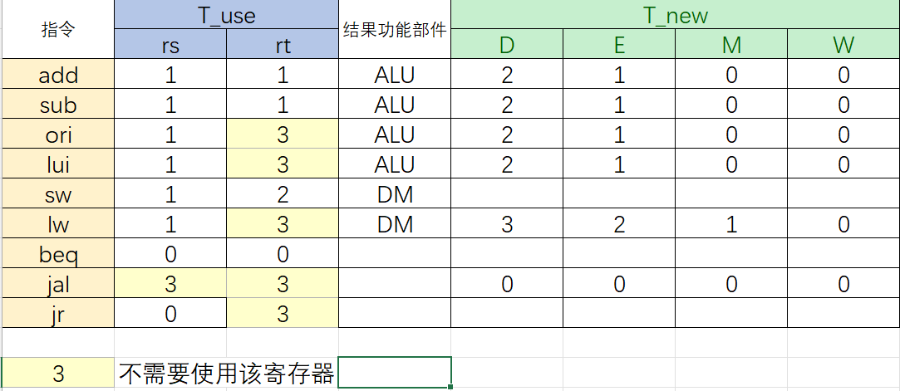
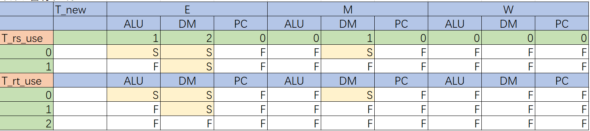
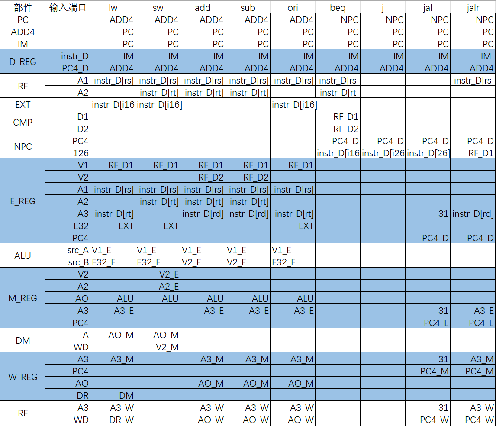
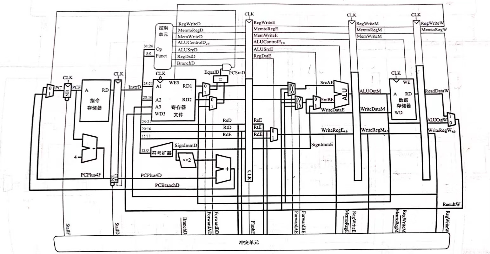

# <center>P5-pipeline-CPU-Design-Document</center>


## 零.数据通路描述

​	MIPS架构的五级流水线CPU数据通路有以下五个阶段：

1. 取指阶段F(Fetch):从指令存储器中读取指令
2. 译码阶段D(Decode):从寄存器文件中读取源操作数并对指令译码得到控制信号
3. 执行阶段E(Execute):使用ALU执行计算
   
4. 存储阶段M(Memory):读或写数据存储
   
5. 写回阶段(Writeback):将结果写回到寄存器文件

​	通过在五个阶段之间加入寄存器来保存前面周期产生的数据(最后一个阶段的寄存器即为GRF),形成五级流水线CPU，数据通路如下图表示：


## 一.数据命名规范(checkstyle)

1. 在控制信号连线名末尾加上“_阶段字母”，如NPCOp_D,用于区分所属的阶段
2. 在流水线寄存器输出信号前加上“阶段字母_"，如：D_A1,用以区分所属阶段
3. 功能部件输出信号前加上功能部件名称
4. 常规MUX命名采用"MUX-部件名-端口名”的命名方式，选择信号命名为"Sel+部件名+端口名"
5. 转发MUX命名采用"HMUX-部件名-端口名"的命名方式，选择信号命名为"Fwd+部件名+端口名"

## 二.部件设计

### 1.MCU(main control unit)

#### 1.端口定义列表

​	主控制单元模块负责对指令进行译码以及产生控制信号，本CPU的设计采用集中式译码，在P5中需要完成的指令及其需要的控制信号列表如下，其中有些控制信号对应多路选择器的选择。

| 名称       | 方向 | 位宽 | 描述                                                |
| ---------- | ---- | ---- | --------------------------------------------------- |
| D_opcode   | I    | 6    | D级输出opcode                                       |
| D_funct    | I    | 6    | D级输出funct                                        |
| SelA3_D    | I    | 2    | 选择当前指令要写入的寄存器，写入E级流水线寄存器     |
| RegWrite_D | O    | 1    | GRF写入使能                                         |
| MemWrite_D | O    | 1    | DM写入使能                                          |
| EXTOp_D    | O    | 1    | 对立即数进行符号扩展还是0扩展                       |
| SelEMout_D | O    | 1    | 选择E，M级转发数据信号                              |
| SelWout_D  | O    | 2    | 选择W级转发数据信号                                 |
| SelALUB_D  | O    | 1    | ALU的B端口rt数据与32位立即数的选择                  |
| CMPOp_D    | O    | 3    | D级B类指令比较选择                                  |
| NPCOp_D    | O    | 3    | 写入NPC选择                                         |
| ALUOp_D    | O    | 3    | ALU操作信号                                         |
| DMOp_D     | O    | 3    | DM操作信号                                          |
| T_rs_use_D | O    | 2    | 指令处在D级时还有多少个周期需要使用rs寄存器的值     |
| T_rt_use_D | O    | 2    | 指令处在D级时还有多少个周期需要使用rt寄存器的值     |
| T_new_D    | O    | 2    | 指令处在D级时还有多少个周期可以产生写入寄存器的新值 |

#### 2.分指令梳理控制信号

| 指令 | 取高电平的控制信号和ALUOp                                    |
| ---- | ------------------------------------------------------------ |
| add  | SelA3_D = 2'b01, RegWrite, ALUOp = 3'b000, NPCOp = 3'b000;   |
| sub  | SelA3_D = 2'b01, RegWrite, ALUOp = 3'b001, NPCOp = 3'b000;   |
| ori  | RegWrite,ALUSrc, SelALUB, ALUOp=3'b010, NPCOp = 3'b000;      |
| lui  | RegWrite,ALUSrc, SelALUB, ALUOp=3'b011, NPCOp = 3'b000;      |
| lw   | RegWrite, SelWout = 2'b01, SelALUB, EXTOp, ALUOp=3'b000, NPCOp = 3'b000; |
| sw   | MemWrite, SelALUB, EXTOp, ALUOp=3'b000, NPCOp = 3'b000;      |
| beq  | CMPOp = 3'b000,EXTOp, NPCOp = 3'b001, CMPOp = 3'b000;        |
| jal  | RegWrite, SelA3_D = 2'b10, NPCOp = 3'b010;                   |
| jr   | NPCOp = 3'b11;                                               |
| nop  | 相当于sll $0,$0,0，不需要进行特殊处理                        |

#### 3.译码方式的改动

​	在P4中，我才用使用reg类型变量记录指令识别的形式，在always块中每次都为代表所有信号的寄存器赋初值0，这样会导致pc一直自增下去，程序不断向后跑(虽然在上机时无影响)，在蒋老师的测评机上会出现多输出的情况。在P5中，使用wire类型进行指令的识别，当识别的指令为x时，所有指令对应的wire都是不定值x，导致MCU中输出的控制信号为x，使得pc停下来，可以正常在蒋老师的测评机上跑结果。

```verilog
wire op_add = (D_opcode == R && D_funct == add);
```

### 2.HCU(hazard control unit)

#### 1.数据冒险中的供给需求模型

##### 1.供给者与需求者分析

* 需求者： 引用某个reg值的component
* 供给者：保存有reg新结果的流水线寄存器

​	我们假设指令前进到必须使用某一寄存器的值的流水阶段时，这个寄存器的值一定已经产生，并存储于后续某个流水线寄存器中，不管需要的值有没有计算出，都要进行转发，即暴力转发。

* 供给者及其产生的数据

| 流水级 | 产生数据        | MUX&选择信号       | MUX输出名 |
| ------ | --------------- | ------------------ | --------- |
| E      | E_E32,E_pc8     | MUX_E_out&SelEMOut | E_out     |
| M      | M_AO,M_pc8      | MUX_M_out&SelEMout | M_out     |
| W      | W_AO,W_RD,W_pc8 | MUX_W_out&SelWOut  | W_out     |

* 需求者及其产生的数据

​	**注：表格中选择数据表示是哪一个流水段产生的结果，实际数据来自流水段寄存器的转发而不是流水段中的部件**

| 接收端口 | 选择数据         | HMUX&选择信号        | MUX输出名      |
| -------- | ---------------- | -------------------- | -------------- |
| CMP_D1   | D_V1,E_out,M_out | HMUX_CMP_D1&FwdCPMD1 | D_V1_f(orward) |
| CMP_D2   | D_V2,E_out,M_out | HMUX_CMP_D2&FwdCPMD2 | D_V2_f         |
| ALU_A    | D_V1,E_out,M_out | HMUX_ALU_A&FwdALUA   | E_V1_f         |
| ALU_B    | D_V2,E_out,M_out | HMUX_ALU_B&FwdALUB   | E_V2_f         |
| DM_WD    | M_V2,W_out       | HMUX_DM&FwdDM        | M_V1_f         |
| NPC_ra   | D_V1,E_out,M_out | HMUX_CMP_D1&FwdCPMD1 | D_V1_f         |

****

​	**注：对于jr跳转指令，跳转到rs寄存器的值，故可以与CMP_D1共用同一个转发多路选择器产生的结果，但是我选择单独实现**	

##### 2.T<sub>use</sub> /T<sub>new</sub> 

数据冒险可以转化为需求与供给的匹配问题：

T<sub>use</sub>：数据到了D级后还需要多少个周期要使用寄存器的值

T<sub>new</sub>: 位于E级及其后各流水线的指令，再经过多少个时钟周期能够产生要写入寄存器的结果。

* T<sub>use</sub> < T<sub>new</sub> : 暂停install
*  T<sub>use</sub> >=T<sub>new</sub>: 转发forward，**注意：我们进行转发从来都是从流水线寄存器进行转发而不是从部件产生结果进行转发，故从部件产生结果到存储到流水线寄存器可以进行转发还需要一个时钟周期**

* T<sub>use</sub>固定不变，可以从MCU译码后直接传入HCU
* 采取的集中式译码中，T<sub>new</sub>随流水递减，在每一级流水段中传给HCU
  * T<sub>new-E</sub> = max (T<sub>new-D</sub> - 1 , 0)
  * T<sub>new-M</sub> = max (T<sub>new-E</sub> - 1 , 0)
  * 在当前指令集下 T<sub>new-W</sub> = 0

#### 2.冒险分析

##### 1.对指令构建T<sub>use</sub>-T<sub>new</sub>表



* add/sub/ori/lui : 在D阶段译码之后在E级ALU使用寄存器rs和(rt)的值，还需一个时钟周期存入E级流水线寄存器
* lw : 只用到rs寄存器中的值用来计算取数地址，经过两个周期在DM处取出结果存入W级寄存器
* sw : 只涉及到存入DM，不产生新的数据
* beq : 在D级进行操作数相等比较
* jal : 将PC+8存入ra寄存器
* jr : 在D级使用rs寄存器中的值作为跳转pc

**注意：！！！对于不需要使用到该寄存器的指令，T_rs_use / T_rt_use需要置为3，最初我的错误是不进行处理，即T_rs_use = T_rt_use = 0，这样会导致很多不必要的暂停的发生，具体在测评中会表现为TLE！因为T_rs_use和T_rt_use的范围为0-2，将T_rs_use,T_rt_use标记为3可以规避掉所有的暂停情况！**

##### 2.stall/forward控制列表



​	用当前指令用到的寄存器的对应的T<sub>use</sub>与该寄存器新值当前所在流水段对应部件的T<sub>new</sub>进行比对，如果

* T<sub>use</sub> >= T<sub>new</sub>，则通过转发解决
* T<sub>use</sub> < T<sub>new</sub> ，则只能进行暂停 

**从上表可以归结出需要进行暂停的四种情况**

* E_T<sub>new</sub> = 2,T<sub>use</sub>=0
* E_T<sub>new</sub> = 2,T<sub>use</sub> = 1
* E_T<sub>new</sub> = 1,T<sub>use</sub> = 0
* M_T<sub>new</sub> = 1,T<sub>use</sub> = 0

**暂停：冻结PC计数器，冻结D级寄存器，清空E级寄存器**

##### 3.基础指令的数据通路/各个流水段需要传递的信号

**列表如下所示：**



##### 4.HCU设计

###### 1.端口定义列表

| 输入信号     | 方向     | 位宽       | 描述                         |
| ------------ | -------- | ---------- | ---------------------------- |
| D_A1         | I        | 5          | D级A1输入                    |
| D_A2         | I        | 5          | D级A2输入                    |
| E_A1         | I        | 5          | E级A1输入                    |
| E_A2         | I        | 5          | E级A2输入                    |
| E_A3         | I        | 5          | E级A3输入                    |
| M_A2         | I        | 5          | M级A2输入                    |
| M_A3         | I        | 5          | M级A3输入                    |
| W_A3         | I        | 5          | W级A3输入                    |
| RegWrite_E   | I        | 1          | E级保存的GRF写入使能信号     |
| RegWrite_M   | I        | 1          | M级保存的GRF写入使能信号     |
| RegWrite_W   | I        | 1          | W级保存的GRF写入使能信号     |
| T_rs_use     | I        | 2          | D级中MCU输出的T_rs_use_D信号 |
| T_rt_use     | I        | 2          | D级中MCU输出的T_rt_use_D信号 |
| T_new_E      | I        | 2          | E级中T_new_E输入             |
| T_new_M      | I        | 2          | M级中T_new_M输入             |
| T_new_W      | I        | 2          | W级中T_new_W输入             |
| **输出信号** | **位宽** | **作用级** | **描述**                     |
| FwdCMPD1     | 2        | D          | 对HMUX_CMP_D1输出进行选择    |
| FwdCMPD2     | 2        | D          | 对HMUX_CMP_D2输出进行选择    |
| FwdALUA      | 2        | E          | 对HMUX_ALU_A输出进行选择     |
| FwdALUB      | 2        | E          | 对HMUX_ALU_B输出进行选择     |
| FwdDM        | 1        | M          | 对HMUX_DM的输出进行选择      |
| stall        | 1        | D,F,M      | 暂停信号                     |

**注：暂停机制：冻结PC,冻结D级，清空E级，即stall信号作用于IFU,D_REG,E_REG**

###### 2.控制转发/暂停的内部逻辑

1. 暂停的内部逻辑

​	经过前面的分析，可知暂停信号stall的产生一共有八种情况，rs,rt各四种，最后或在一起即可。记号stall_rs0_e1表示暂停中T_rs_use=0&&T_new_E = 1的情况，对应的表达式为:

```verilog
stall_rs0_e1 = (T_rs_use == 2'b00)&&(T_new_E = 2'b01)&&(D_A1 == E_A3)&&(D_A1 != 5'b0)&&(RegWrite_E)
```

​	与逻辑表达式中前两项为对时间状态的判断，后三项为对寄存器状态的判断，即判断此时E级能写入且写入的寄存器为D级的rs且不是0寄存器。

2. 转发的内部逻辑

​	**注：在流水段中，较先进入流水的指令在流水段较深的位置，我们进行转发只会对前序指令的运算结果进行转发，故会出现靠后流水段的转发选择信号较少，例如在M级对DM部件的转发 只会涉及到一个流水线寄存器输出的信号W_out，而在E级对ALU_A的转发信号有两个信号来自流水线寄存器，M_out,W_out.**

​	转发逻辑涉及到优先级的判断，即对最新产生的结果进行转发，可以通过三目运算符实现，将优先级更高的结果(值更新的结果)放在三目运算符判断的前面并为选择信号编码，我采用的编码方式为优先级从低到高编码增加。**判断能进行转发的关键条件为T_new=0**

例如：

```verilog
assign FwdCMPD1 = (T_new_E == 2'b00)&&(E_A3 == D_A1)&&(D_A1 != 5'b0)&&(RegWrite_E) ? 2'b10 :
						(T_new_M == 2'b00)&&(M_A3 == D_A1)&&(D_A1 != 5'b0)&&(RegWrite_M) ? 2'b01 :
						2'b00;
```

### 3.ALU

#### 1.端口定义列表

| 名称  | 方向 | 位宽 | 描述     |
| ----- | ---- | ---- | -------- |
| src_A | I    | 32   | 操作数1  |
| src_B | I    | 32   | 操作数2  |
| ALUOp | I    | 3    | 运算类型 |
| AO    | O    | 32   | 运算结果 |

#### 2.ALUOp编码与运算选择

| ALU运算                  | ALUOp编码 |
| ------------------------ | --------- |
| +                        | 0000      |
| -                        | 0001      |
| \|                       | 0010      |
| load to higher half(lui) | 0011      |
| <<                       | 0100      |
| signed compare (slt)     | 0101      |
| unsigned compare(sltu)   | 0110      |

​	将beq指令在ALU中判断两个操作数是否相等的操作移动到D级模块CMP中，使得跳转指令在D级就可以完成判断，流水线只会顺序多执行一条指令。

### 4.EXT

#### 端口定义列表

| 名称   | 方向 | 位宽 | 描述                    |
| ------ | ---- | ---- | ----------------------- |
| imm    | I    | 16   | D级16位立即数           |
| EXTOp  | I    | 1    | 选择进行符号扩展/零扩展 |
| imm_32 | I    | 32   | 位扩展结果              |

### 5.GRF

#### 1.端口定义列表

| 名称      | 方向 | 位宽 | 描述         |
| --------- | ---- | ---- | ------------ |
| clk       | I    | 1    | 时钟信号     |
| reset     | I    | 1    | 同步复位信号 |
| rs        | I    | 5    | rs寄存器     |
| rt        | I    | 5    | rt寄存器     |
| rd        | I    | 5    | rd寄存器     |
| pc        | I    | 32   | 指令执行地址 |
| datawrite | I    | 32   | 写入数据选择 |
| RegWrite  | I    | 1    | 写入使能     |
| dataread1 | O    | 32   | 读rs寄存器   |
| dataread2 | O    | 32   | 读rt寄存器   |

**注意：这里的RegWrite,datawirte,A3(rd),pc信号均来自W级**

#### 2.GRF内部转发

​	设计GRF内部转发逻辑：GRF既是D级的一个部件又是W级之后的流水线寄存器。当W级写GRF，D级读GRF时，如果读取寄存器与写入寄存器为同一寄存器时不进行转发，新值虽然被写入GRF但流入E级的值依然为旧值。

**判断条件：当写入信号RegWrite有效且A1==A3或A2==A3时，将写入值作为对应输出值**

判断逻辑如下:

```verilog
//forward
assign dataread1 = (RegWrite && rs == rd && rd != 0) ? datawrite : grf[rs];
```

### 6.IFU

#### 端口定义列表

| 名称  | 方向 | 位宽 | 描述                                  |
| ----- | ---- | ---- | ------------------------------------- |
| clk   | I    | 1    | 时钟信号                              |
| reset | I    | 1    | 同步复位信号                          |
| en    | I    | 1    | 使能信号(~stall)                      |
| npc   | I    | 32   | 下一指令地址                          |
| pc    | O    | 32   | F级当前地址                           |
| pc8   | O    | 32   | 输出PC+8，随流水段传递(jal考虑延迟槽) |
| instr | O    | 32   | 取出的指令                            |

### 7.NPC

#### 1.端口定义列表

| 名称        | 方向 | 位宽 | 描述                     |
| ----------- | ---- | ---- | ------------------------ |
| D_pc        | I    | 32   | D级PC                    |
| F_pc        | I    | 32   | F级PC                    |
| b_result    | I    | 1    | D级CMP模块判断结果       |
| b_offset    | I    | 32   | B类指令的跳转地址        |
| j_address   | I    | 26   | J类指令跳转地址          |
| reg_address | I    | 32   | 跳转到寄存器中的地址(jr) |
| NPCOp       | I    | 3    | 地址选择信号             |
| npc         | O    | 32   | 程序下一条指令地址       |

#### 2.NPCOp编码与地址选择

| NPCOp编码          | 选择跳转地址                        |
| ------------------ | ----------------------------------- |
| 000                | F_pc + 4                            |
| 001(B) && b_result | D_pc + 4 + (b_offset << 2'b10)      |
| 010(jal)           | {(D_pc + 4)[31:28],j_address,2'b00} |
| 011(jr)            | reg_address                         |

**注：NPC是横跨D级和E级的模块，如果是beq或jal等指令，则需要在D_pc基础上进行操作，否则为F_pc+4**

### 8.CMP

#### 1.端口定义列表

| 名称     | 方向 | 位宽 | 描述                          |
| -------- | ---- | ---- | ----------------------------- |
| D_V1     | I    | 32   | GRF中读出的rs寄存器的值       |
| D_V2     | I    | 32   | GRF中读出的rt寄存器的值       |
| CMPOp    | I    | 3    | 选择比较类型                  |
| b_result | O    | 1    | 是否满足B类跳转指令的跳转条件 |

#### 2.CMPOp编码与对应指令

当前只实现beq，该信号的设置更大的意义在于其可扩展性，便于课上添加指令

| CMPOp编码 | 对应指令 |
| --------- | -------- |
| 000       | beq      |
| ...       | ...      |

### 9.DM

#### 1.端口定义列表

| 名称     | 方向 | 位宽 | 描述                |
| -------- | ---- | ---- | ------------------- |
| clk      | I    | 1    | 时钟信号            |
| reset    | I    | 1    | 同步复位信号        |
| MemWrite | I    | 1    | 写入使能            |
| address  | I    | 32   | 写入/读取数据的地址 |
| pc       | I    | 32   | 当前指令地址        |
| DMOp     | I    | 3    | 执行操作            |

#### 2.DMOp编码与对应指令

​	该信号的设置更大的意义在于其可扩展性，便于课上添加指令

| DMOp编码 | 对应指令 |
| -------- | -------- |
| 000      | sw       |
| 100      | lw       |
| ...      | ...      |

### 10.MUX

#### 1.功能多路选择器

##### 1.MUX_A3 D级写入寄存器选择

###### 端口定义列表

| 名称       | 方向 | 位宽 | 描述         |
| ---------- | ---- | ---- | ------------ |
| D_instr_rs | I    | 5    | instr中rs段  |
| D_instr_rt | I    | 5    | instr中rt段  |
| SelA3_D    | I    | 2    | rd选择信号   |
| D_A3       | O    | 5    | 写入寄存器A3 |

###### 选择信号与结果

| SelA3_D | D_A3 |
| ------- | ---- |
| 2'b10   | 31   |
| 2'b01   | rd   |
| 2'b00   | rt   |

##### 2.MUX_ALU_B ALUB端口选择

###### 端口定义列表

| 名称      | 方向 | 位宽 | 描述                 |
| --------- | ---- | ---- | -------------------- |
| E_V2_f    | I    | 32   | 转发后的V2           |
| E_E32     | I    | 32   | 32位立即数           |
| SelALUB_E | I    | 1    | 选择信号             |
| E_ALU_B   | O    | 32   | 输出到ALUB端口的结果 |

###### 选择信号与结果

| SelALUB_E | E_ALU_B |
| --------- | ------- |
| 1'b1      | E_E32   |
| 1'b0      | E_V2_f  |

##### 3.MUX_E_out  选择E级转发数据

###### 端口定义列表 

| 名称       | 方向 | 位宽 | 描述         |
| ---------- | ---- | ---- | ------------ |
| E_E32      | I    | 32   | 32位立即数   |
| E_pc8      | I    | 32   | 流水PC8(jal) |
| SelEMout_E | I    | 1    | 选择信号     |
| E_out      | O    | 32   | E级转发数据  |

###### 选择信号与结果

| SelEMout_E | E_out |
| ---------- | ----- |
| 1'b1       | E_pc8 |
| 1'b0       | E_E32 |

##### 4.MUX_M_out 选择M级转发数据

###### 端口定义列表 

| 名称       | 方向 | 位宽 | 描述           |
| ---------- | ---- | ---- | -------------- |
| M_AO       | I    | 32   | M级ALU计算结果 |
| M_pc8      | I    | 32   | 流水PC8(jal)   |
| SelEMout_M | I    | 1    | 选择信号       |
| M_out      | O    | 32   | M级转发数据    |

###### 选择信号与结果

| SelEMout_M | M_out |
| ---------- | ----- |
| 1'b1       | M_pc8 |
| 1'b0       | M_AO  |

##### 5.MUX_W_out 选择W级转发数据

###### 端口定义列表 

| 名称      | 方向 | 位宽 | 描述                    |
| --------- | ---- | ---- | ----------------------- |
| W_AO      | I    | 32   | W级ALU计算结果          |
| W_DR      | I    | 32   | W级DM中读取出的数据     |
| W_pc8     | I    | 32   | W级流水PC8(jal)         |
| SelWout_W | I    | 2    | 选择信号                |
| W_out     | O    | 32   | W级转发数据/GRF写入数据 |

###### 选择信号与结果

| SelWout_W | W_out |
| --------- | ----- |
| 2'b10     | W_pc8 |
| 2'b01     | W_DR  |
| 2'b00     | W_AO  |

#### 2.转发多路选择器

##### 1.HMUX_CMP_D1 CMP模块rs寄存器值转发

###### 端口定义列表 

| 名称     | 方向 | 位宽 | 描述               |
| -------- | ---- | ---- | ------------------ |
| GRF_RD1  | I    | 32   | GRF中读取出的rs值  |
| M_out    | I    | 32   | M级转发数据        |
| E_out    | I    | 32   | E级转发数据        |
| FwdCMPD1 | I    | 2    | 选择信号           |
| D_V1_f   | O    | 32   | 转发后的rs寄存器值 |

​	**注：转发寄存器中有数据优先级的问题，越新产生的数据优先级越高，考虑到GRF中内部转发的逻辑，事实上GRF_RD1也代表着潜在的W级转发数据，但是仍然不破坏优先级关系E>M>W**

###### 选择信号与结果

| FwdCMPD1 | D_V1_f  |
| -------- | ------- |
| 2'b10    | E_out   |
| 2'b01    | M_out   |
| 2'b00    | GRF_RD1 |

##### 2.HMUX_CMP_D2 CMP模块rt寄存器值转发

###### 端口定义列表 

| 名称     | 方向 | 位宽 | 描述               |
| -------- | ---- | ---- | ------------------ |
| GRF_RD2  | I    | 32   | GRF中读取出的rt值  |
| M_out    | I    | 32   | M级转发数据        |
| E_out    | I    | 32   | E级转发数据        |
| FwdCMPD2 | I    | 2    | 选择信号           |
| D_V2_f   | O    | 32   | 转发后的rt寄存器值 |

###### 选择信号与结果

| FwdCMPD2 | D_V1_f  |
| -------- | ------- |
| 2'b10    | E_out   |
| 2'b01    | M_out   |
| 2'b00    | GRF_RD2 |

##### 3.HMUX_ALU_A ALU模块V1值转发

###### 端口定义列表 

| 名称    | 方向 | 位宽 | 描述              |
| ------- | ---- | ---- | ----------------- |
| E_V1    | I    | 32   | GRF中读取出的rs值 |
| M_out   | I    | 32   | M级转发数据       |
| W_out   | I    | 32   | W级转发数据       |
| FwdALUA | I    | 2    | 选择信号          |
| E_V1_f  | O    | 32   | 转发后的V1值      |

###### 选择信号与结果

| FwdALUA | E_V1_f |
| ------- | ------ |
| 2'b10   | M_out  |
| 2'b01   | W_out  |
| 2'b00   | E_V1   |

##### 4.HMUX_ALU_B ALU模块V2值转发

###### 端口定义列表 

| 名称    | 方向 | 位宽 | 描述              |
| ------- | ---- | ---- | ----------------- |
| E_V2    | I    | 32   | GRF中读取出的rt值 |
| M_out   | I    | 32   | M级转发数据       |
| W_out   | I    | 32   | W级转发数据       |
| FwdALUB | I    | 2    | 选择信号          |
| E_V2_f  | O    | 32   | 转发后的V2值      |

###### 选择信号与结果

| FwdALUB | E_V2_f |
| ------- | ------ |
| 2'b10   | M_out  |
| 2'b01   | W_out  |
| 2'b00   | E_V2   |

##### 5.HMUX_DM DM写入数据转发

###### 端口定义列表 

| 名称   | 方向 | 位宽 | 描述        |
| ------ | ---- | ---- | ----------- |
| M_V2   | I    | 32   | M级V2       |
| W_out  | I    | 32   | W级转发数据 |
| FwdDM  | I    | 1    | 选择信号    |
| M_V1_f | O    | 32   | DM写入数据  |

###### 选择信号与结果 

| FwdDM | M_V1_f |
| ----- | ------ |
| 1'b1  | W_out  |
| 1'b0  | M_V2   |

##### 6.HMUX_NPC NPC模块跳转寄存器值转发

###### 端口定义列表 

| 名称     | 方向 | 位宽 | 描述               |
| -------- | ---- | ---- | ------------------ |
| GRF_RD1  | I    | 32   | GRF中读取出的rs值  |
| M_out    | I    | 32   | M级转发数据        |
| E_out    | I    | 32   | E级转发数据        |
| FwdCMPD1 | I    | 2    | 选择信号           |
| D_RA_f   | O    | 32   | 转发后的rs寄存器值 |

​	**注：其实可以共用CMPD1的转发数据**

###### 选择信号与结果

| FwdCMPD1 | D_RA_f  |
| -------- | ------- |
| 2'b10    | E_out   |
| 2'b01    | M_out   |
| 2'b00    | GRF_RD1 |

### 11.流水线寄存器

#### 1.D_REG

| 名称    | 方向 | 位宽 | 描述              |
| ------- | ---- | ---- | ----------------- |
| clk     | I    | 1    | 时钟信号          |
| reset   | I    | 1    | 同步复位信号      |
| en      | I    | 1    | ~stall（冻结D级） |
| F_instr | I    | 32   | F级取指令         |
| F_pc    | I    | 32   | F级PC             |
| F_pc8   | I    | 32   | F级PC+8(jal)      |
| D_instr | O    | 32   | D级执行指令       |
| D_pc    | O    | 32   | D级PC             |
| D_pc8   | O    | 32   | D级PC+8           |

#### 2.E_REG

| 名称       | 方向 | 位宽 | 描述                     |
| ---------- | ---- | ---- | ------------------------ |
| clk        | I    | 1    | 时钟信号                 |
| reset      | I    | 1    | 同步复位信号             |
| clr        | I    | 1    | stall(清空E级)           |
| D_V1       | I    | 32   | D级GRF中读取rs寄存器的值 |
| D_V2       | I    | 32   | D级GRF中读取rt寄存器的值 |
| D_A1       | I    | 5    | D级A1                    |
| D_A2       | I    | 5    | D级A2                    |
| D_A3       | I    | 5    | D级A3                    |
| D_E32      | I    | 32   | 32位立即数               |
| D_pc       | I    | 32   | D级pc                    |
| D_pc8      | I    | 32   | D级pc+8                  |
| T_new_D    | I    | 2    | D级T_new                 |
| RegWrite_D | I    | 1    | D级GRF写入使能           |
| MemWrite_D | I    | 1    | D级DM写入使能            |
| SelEMout_D | I    | 1    | E、M级转发数据选择信号   |
| SelWout_D  | I    | 1    | W级转发数据选择信号      |
| SelALUB_D  | I    | 1    | ALUB端口数据选择         |
| ALUOp_D    | I    | 3    | ALU操作选择              |
| DMOp_D     | I    | 3    | DM操作选择               |
| E_V1       | O    | 32   |                          |
| E_V2       | O    | 32   |                          |
| E_A1       | O    | 5    |                          |
| E_A2       | O    | 5    |                          |
| E_A3       | O    | 5    |                          |
| E_E32      | O    | 32   |                          |
| E_pc       | O    | 32   |                          |
| E_pc8      | O    | 32   |                          |
| T_new_E    | O    | 2    |                          |
| RegWrite_E | O    | 1    |                          |
| MemWrite_E | O    | 1    |                          |
| SelEMout_E | O    | 1    |                          |
| SelWout_E  | O    | 2    |                          |
| SelALUB_E  | O    | 1    |                          |
| ALUOp_E    | O    | 3    |                          |
| DMOp_E     | O    | 3    |                          |

#### 3.M_REG

| 名称       | 方向 | 位宽 | 描述                                          |
| ---------- | ---- | ---- | --------------------------------------------- |
| clk        | I    | 1    |                                               |
| reset      | I    | 1    |                                               |
| E_AO       | I    | 32   | E级ALU计算结果                                |
| E_V2       | I    | 32   | **注意：E_V2不是D_V2,而是经过转发后的D_V2_f** |
| E_A2       | I    | 5    |                                               |
| E_A3       | I    | 5    |                                               |
| E_pc       | I    | 32   |                                               |
| E_pc8      | I    | 32   |                                               |
| T_new_E    | I    | 2    |                                               |
| RegWrite_E | I    | 1    |                                               |
| MemWrite_E | I    | 1    |                                               |
| SelEMout_E | I    | 1    |                                               |
| SelWout_E  | I    | 1    |                                               |
| DMOp_E     | I    | 3    |                                               |
| M_AO       | O    | 32   |                                               |
| M_V2       | O    | 5    |                                               |
| M_A2       | O    | 5    |                                               |
| M_A3       | O    | 5    |                                               |
| M_pc       | O    | 32   |                                               |
| M_pc8      | O    | 32   |                                               |
| T_new_M    | O    | 2    |                                               |
| RegWrite_M | O    | 1    |                                               |
| MemWrite_M | O    | 1    |                                               |
| SelEMout_M | O    | 1    |                                               |
| SelWout_M  | O    | 2    |                                               |
| DMOp_M     | O    | 3    |                                               |

#### 4.W_REG

| 名称       | 方向 | 位宽 | 描述              |
| ---------- | ---- | ---- | ----------------- |
| clk        | I    | 1    |                   |
| reset      | I    | 1    |                   |
| M_AO       | I    | 32   |                   |
| M_DR       | I    | 32   | M级DM中读出的数据 |
| M_A3       |      |      |                   |
| M_pc       | I    | 32   |                   |
| M_pc8      | I    | 32   |                   |
| SelWout_M  | I    | 2    |                   |
| T_new_M    | I    | 2    |                   |
| RegWrite_M | I    | 1    |                   |
| W_AO       | O    | 32   |                   |
| W_DR       | O    | 32   |                   |
| W_A3       | O    | 5    |                   |
| W_pc       | O    | 32   |                   |
| W_pc8      | O    | 32   |                   |
| SelWout_W  | O    | 2    |                   |
| T_new_W    | O    | 2    |                   |
| RegWrite_W | O    | 1    |                   |

### 12.顶层连接

完整数据通路图```QAQ```



流水级中的主要模块：

* F级 ：IFU
* D级 ：MCU,GRF,EXT,CMP,**NPC(注意！一开始被教程中的图误导，放在了F级)**
* E级 : ALU
* M级 ：DM
* 顶层 ：HCU

## 三. test 

```mips
//祖传强测代码
case0:
ori $t0, $zero, 8
add $t1, $t0, $zero

case1:
ori $t0, $zero, 8
ori $t2, $zero, 12
add $t1, $t0, $zero

case2:
ori $t0, $zero, 8
ori $t2, $zero, 12
ori $t3, $zero, 13
add $t1, $t0, $zero

case3:
ori $t0, $zero, 8
add $t1, $zero, $t0

case4:
ori $t0, $zero, 8
ori $t2, $zero, 12
add $t1, $zero, $t0

case5:
ori $t0, $zero, 8
ori $t2, $zero, 12
ori $t3, $zero, 13
add $t1, $zero, $t0

case6:
lui $t0, 8
add $t1, $t0, $zero

case7:
lui $t0, 8
lui $t2, 12
add $t1, $t0, $zero

case8:
lui $t0, 8
lui $t2, 12
lui $t3, 14
add $t1, $t0, $zero

case9:
lui $t0, 8
add $t1, $zero, $t0

case10:
lui $t0, 8
lui $t2, 12
add $t1, $zero, $t0

case11:
lui $t0, 8
lui $t2, 12
lui $t3, 14
add $t1, $zero, $t0

case12:
lui $t0, 8
add $t1, $zero, $t0
add $t2, $t1, $zero

case13:
lui $t0, 8
add $t1, $zero, $t0
add $t3, $t0, $t0
add $t2, $t1, $zero

case14:
lui $t0, 8
add $t1, $zero, $t0
add $t3, $t0, $t0
add $t4, $t0, $t0
add $t2, $t1, $t1

case15:
ori $t0, $zero, 8
ori $t1, $zero, 12
ori $t2, $zero, 16
ori $t3, $zero, 20
ori $t4, $zero, 24
ori $t5, $zero, 28
sw $t1, 0($t0)
ori $s0, $zero, 4
ori $s1, $zero, 8
ori $s2, $zero, 12
lw $t6, 0($t0)
add $t7, $t6, $t6

case16:
ori $t0, $zero, 8
ori $t1, $zero, 12
ori $t2, $zero, 16
ori $t3, $zero, 20
ori $t4, $zero, 24
sw $t1, 0($t0)
ori $s0, $zero, 4
ori $s1, $zero, 8
ori $s2, $zero, 12
lw $t6, 0($t0)
ori $t5, $zero, 28
add $t7, $t6, $t6

case17:
ori $t0, $zero, 8
ori $t1, $zero, 12
ori $t2, $zero, 16
ori $t3, $zero, 20
ori $t4, $zero, 24
sw $t1, 0($t0)
ori $s0, $zero, 4
ori $s1, $zero, 8
ori $s2, $zero, 12
lw $t6, 0($t0)
ori $t5, $zero, 28
ori $t8, $zero, 32
add $t7, $t6, $t6

case18:
ori $t0, $zero, 8
ori $t1, $zero, 12
ori $t2, $zero, 16
jal change1
add $t3, $ra, $ra
ori $t4, $zero, 20
ori $t5, $zero, 24
change1:
	ori $t6, $zero, 20
	
case19:
ori $t0, $zero, 8
ori $t1, $zero, 12
ori $t2, $zero, 16
jal change2
ori $t4, $zero, 20
ori $t5, $zero, 24
change2:
	add $t3, $ra, $ra
	ori $t6, $zero, 20
	ori $t7, $zero, 24

case20:
ori $t0, $zero, 8
ori $t1, $zero, 12
ori $t2, $zero, 16
jal change3
ori $t4, $zero, 20
ori $t5, $zero, 24
change3:
	ori $t6, $zero, 20
	add $t3, $ra, $ra
	ori $t6, $zero, 20
	ori $t7, $zero, 24

case21:	
ori $t0, $zero, 8
ori $t1, $t0, 12

case22:
ori $t0, $zero, 8
ori $t2, $zero, 20
ori $t1, $t0, 12

case23:
ori $t0, $zero, 8
ori $t2, $zero, 20
ori $t3, $zero, 24
ori $t1, $t0, 12

case24:
ori $t0, $zero, 8
ori $t1, $zero, 20
ori $t2, $zero, 24
ori $t3, $zero, 12
ori $t4, $zero, 16
sub $t5, $t0, $t1
ori $t6, $t5, 13

case25:
ori $t0, $zero, 8
ori $t1, $zero, 20
ori $t2, $zero, 24
ori $t3, $zero, 12
ori $t4, $zero, 16
sub $t5, $t0, $t1
ori $t7, $zero, 20
ori $t6, $t5, 13

case26:
ori $t0, $zero, 8
ori $t1, $zero, 20
ori $t2, $zero, 24
ori $t3, $zero, 12
ori $t4, $zero, 16
sub $t5, $t0, $t1
ori $t7, $zero, 20
ori $t8, $zero, 24
ori $t6, $t5, 13

case27:
ori $t0, $zero, 8
ori $t1, $zero, 20
ori $t2, $zero, 4
ori $t3, $zero, 12
ori $t4, $zero, 16
sw $t0, 0($t1)
lw $t5, 0($t1)
ori $t6, $t5, 13

case28:
ori $t0, $zero, 8
ori $t1, $zero, 20
ori $t2, $zero, 4
ori $t3, $zero, 12
ori $t4, $zero, 16
sw $t0, 0($t1)
lw $t5, 0($t1)
ori $t7, $zero, 20
ori $t6, $t5, 13

case29:
ori $t0, $zero, 8
ori $t1, $zero, 20
ori $t2, $zero, 4
ori $t3, $zero, 12
ori $t4, $zero, 16
sw $t0, 0($t1)
lw $t5, 0($t1)
ori $t7, $zero, 20
ori $t8, $zero, 24
ori $t6, $t5, 13

case30:
ori $t0, $zero, 8
ori $t1, $zero, 20
jal change4
ori $t2, $ra, 8
ori $t3, $zero, 14
change4:
	ori $t4, $zero, 18
ori $t5, $zero, 22
ori $t6, $zero, 26

case31:
ori $t0, $zero, 8
ori $t1, $zero, 20
jal change5
ori $t2, $zero, 4
ori $t3, $zero, 14
change5:
	ori $t4, $ra, 18
ori $t5, $zero, 22
ori $t6, $zero, 26

case32:
ori $t0, $zero, 8
ori $t1, $zero, 20
jal change6
ori $t2, $zero, 4
ori $t3, $zero, 14
change6:
	ori $t7, $zero, 6
	ori $t4, $ra, 18
ori $t5, $zero, 22
ori $t6, $zero, 26

case33:
ori $t0, $zero, 4
ori $t1, $zero, 8
ori $t2, $zero, 9
ori $t3, $zero, 12
sw $t1, 0($t0)
sw $t2, 4($t0)
sw $t3, 8($t0)

occasionl1:	#R_E_RS
	sub $t4, $t1, $t0
	lw $t5, 0($t4)
	
occasionl2:	#R_M_RS
	sub $t5, $t3, $t0
	ori $zero, $zero, 5
	lw $t6, 0($t5)

occasionl3:	#R_W_RS
	add $t6, $t0, $t1
	ori $s0, $zero, 12
	ori $s1, $zero, 16
	lw $t7, 0($t6)
	
case34:
ori $t0, $zero, 4
ori $t1, $zero, 8
ori $t2, $zero, 9
ori $t3, $zero, 12
sw $t1, 0($t0)
sw $t2, 4($t0)
sw $t3, 8($t0)

occasionl4:	#R_E_RS
	ori $t4, $zero, 4
	lw $t5, 0($t4)
	
occasionl5:	#R_M_RS
	ori $t5, $zero, 8
	ori $zero, $zero, 5
	lw $t6, 0($t5)

occasionl6:	#R_W_RS
	ori $t6, $zero, 12
	ori $s0, $zero, 12
	ori $s1, $zero, 16
	lw $t7, 0($t6)
	
case35:
ori $t0, $zero, 4
ori $t1, $zero, 8
ori $t2, $zero, 12
ori $t3, $zero, 16
sw $t0, 0($zero)
sw $t1, 0($t0)
sw $t2, 0($t1)
sw $t3, 4($t1)

 occasionl7:	#ld_E_RS
 	lw $t4, 0($t0)
 	lw $t5, 0($t4)
 	
 occasionl8:	#ld_M_RS
 	lw $t5, -4($t0)
 	add $zero, $zero, $t1
 	lw $t6, 0($t5)
 	
 occasionl9:	#ld_W_RS
 	lw $t6, 4($t0)
 	ori $s0, $zero, 1
 	ori $s1, $zero, 2
 	lw $t7, 0($t6)
 	
case36:
ori $t0, $zero, 4
ori $t1, $zero, 8
ori $t2, $zero, 12
ori $t3, $zero, 16
ori $t4, $zero, 20

occasions1:	#R_E_RS
	add $t5, $t0, $t1
	sw $t2, 0($t5)
	
occasions2:	#R_M_RS
	sub $t6, $t2, $t1
	ori $s0, $zero, 12
	sw $t3, 4($t6)

occasions3:	#R_W_RS
	sub $t7, $t4, $t0
	ori $s1, $zero, 4
	ori $s2, $zero, 8
	sw $t4, 0($t7)

occasions4:	#R_E_RT
	sub $t5, $t1, $t0
	sw $t5, 0($t0)

occasions5:	#R_M_RT
	sub $t5, $t2, $t0
	ori $s0, $zero, 2
	sw $t5, 4($t2)
	
occasions6:	#R_W_RT
	add $t6, $t3, $t4
	ori $s0, $zero, 1
	ori $s1, $zero, 2
	sw $t6, 0($t1)
	
case37:
ori $t0, $zero, 4
ori $t1, $zero, 8
ori $t2, $zero, 12
ori $t3, $zero, 16
ori $t4, $zero, 20

occasions7:	#I_E_RS
	ori $t5, $zero, 12
	sw $t2, 0($t5)
	
occasions8:	#I_M_RS
	ori $t6, $zero, 4
	ori $s0, $zero, 12
	sw $t3, 4($t6)

occasions9:	#I_W_RS
	ori $t7, $zero, 16
	ori $s1, $zero, 4
	ori $s2, $zero, 8
	sw $t4, 0($t7)

occasions10:	#I_E_RT
	lui $t5, 3
	sw $t5, 0($t0)

occasions11:	#I_M_RT
	lui $t5, 1
	ori $s0, $zero, 2
	sw $t5, 4($t2)
	
occasions12:	#I_W_RT
	ori $zero, $zero, 9
	ori $s0, $zero, 1
	ori $s1, $zero, 2
	sw $zero, 0($t1)

case38:
ori $t0, $zero, 4
ori $t1, $zero, 8
ori $t2, $zero, 12
ori $t3, $zero, 16
ori $t4, $zero, 20
sw $t0, 0($zero)
sw $t1, 0($t0)
sw $t2, 4($t0)
sw $t3, 8($t0)
occasions13:	#ld_E_RS
	lw $t5, 0($t0)
	sw $t2, 0($t5)
	
occasions14:	#ld_M_RS
	lw $t6, 0($t0)
	ori $s0, $zero, 12
	sw $t3, 4($t6)

occasions15:	#ld_W_RS
	lw $t7, 4($t0)
	ori $s1, $zero, 4
	ori $s2, $zero, 8
	sw $t4, 0($t7)

occasions16:	#ld_E_RT
	lw $t5, 0($t2)
	sw $t5, 0($t0)

occasions17:	#ld_M_RT
	lw $t5, 4($t2)
	ori $s0, $zero, 2
	sw $t5, 4($t2)
	
occasions18:	#ld_W_RT
	lw $t6, 4($t0)
	ori $s0, $zero, 1
	ori $s1, $zero, 2
	sw $t6, 0($t1)
	
case39:
ori $t0, $zero, 4
ori $t1, $zero, 8
ori $t2, $zero, 12
ori $t3, $zero, 16
sub $t4, $t0, $t1

occasionbr1:	#R_E_RS
	add $t5, $t0, $t1
	beq $t5, $t2, changeb1
	ori $s0, $zero, 1
	ori $s1, $zero, 2
	changeb1:
		ori $s2, $zero, 3
		ori $s3, $zero, 4
		
occasionbr2:	#R_M_RS
	add $t6, $t0, $t1
	ori $s0, $zero, 1
	beq $t6, $t2, changeb2
	ori $s0, $zero, 1
	ori $s1, $zero, 2
	changeb2:
		ori $s2, $zero, 3
		ori $s3, $zero, 4
		
occasionbr3:	#R_W_RS
	add $t7, $t0, $t1
	ori $s0, $zero, 1
	ori $s1, $zero, 2
	beq $t7, $t2, changeb3
	ori $s0, $zero, 1
	ori $s1, $zero, 2
	changeb3:
		ori $s2, $zero, 3
		ori $s3, $zero, 4
		
occasionbr4:	#R_E_RT
	sub $t5, $t1, $t2
	beq $t4, $t5, changeb4
	ori $s0, $zero, 1
	ori $s1, $zero, 2
	changeb4:
		ori $s2, $zero, 3
		ori $s3, $zero, 4
		
occasionbr5:	#R_M_RT
	sub $t6, $t1, $t2
	ori $s0, $zero, 1
	beq $t4, $t6, changeb5
	ori $s0, $zero, 1
	ori $s1, $zero, 2
	changeb5:
		ori $s2, $zero, 3
		ori $s3, $zero, 4
		
occasionbr6:	#R_W_RT
	sub $t7, $t1, $t2
	ori $s0, $zero, 1
	ori $s1, $zero, 2
	beq $t4, $t7, changeb6
	ori $s0, $zero, 1
	ori $s1, $zero, 2
	changeb6:
		ori $s2, $zero, 3
		ori $s3, $zero, 4

case40:
ori $t0, $zero, 4
ori $t1, $zero, 8
ori $t2, $zero, 12
ori $t3, $zero, 16
sub $t4, $t0, $t1

occasionbru1:	#R_E_RS
	add $t5, $t0, $t1
	beq $t5, $t3, changebru1
	ori $s0, $zero, 1
	ori $s1, $zero, 2
	changebru1:
		ori $s2, $zero, 3
		ori $s3, $zero, 4
		
occasionbru2:	#R_M_RS
	add $t6, $t0, $t1
	ori $s0, $zero, 1
	beq $t6, $t3, changebru2
	ori $s0, $zero, 1
	ori $s1, $zero, 2
	changebru2:
		ori $s2, $zero, 3
		ori $s3, $zero, 4
		
occasionbru3:	#R_W_RS
	add $t7, $t0, $t1
	ori $s0, $zero, 1
	ori $s1, $zero, 2
	beq $t7, $t3, changebru3
	ori $s0, $zero, 1
	ori $s1, $zero, 2
	changebru3:
		ori $s2, $zero, 3
		ori $s3, $zero, 4
		
occasionbru4:	#R_E_RT
	sub $t5, $t1, $t2
	beq $t3, $t5, changebru4
	ori $s0, $zero, 1
	ori $s1, $zero, 2
	changebru4:
		ori $s2, $zero, 3
		ori $s3, $zero, 4
		
occasionbru5:	#R_M_RT
	sub $t6, $t1, $t2
	ori $s0, $zero, 1
	beq $t3, $t6, changebru5
	ori $s0, $zero, 1
	ori $s1, $zero, 2
	changebru5:
		ori $s2, $zero, 3
		ori $s3, $zero, 4
		
occasionbru6:	#R_W_RT
	sub $t7, $t1, $t2
	ori $s0, $zero, 1
	ori $s1, $zero, 2
	beq $t3, $t7, changebru6
	ori $s0, $zero, 1
	ori $s1, $zero, 2
	changebru6:
		ori $s2, $zero, 3
		ori $s3, $zero, 4
		
case41:
ori $t0, $zero, 4
ori $t1, $zero, 8
ori $t2, $zero, 12
ori $t3, $zero, 16
sub $t4, $t0, $t1

occasionbi1:	#I_E_RS
	ori $t5, $zero, 16
	beq $t5, $t3, changebi1
	ori $s0, $zero, 1
	ori $s1, $zero, 2
	changebi1:
		ori $s2, $zero, 3
		ori $s3, $zero, 4
		
occasionbi2:	#I_M_RS
	ori $t6, $zero, 16
	ori $s0, $zero, 1
	beq $t6, $t3, changebi2
	ori $s0, $zero, 1
	ori $s1, $zero, 2
	changebi2:
		ori $s2, $zero, 3
		ori $s3, $zero, 4
		
occasionbi3:	#I_W_RS
	ori $t7, $zero, 16
	ori $s0, $zero, 1
	ori $s1, $zero, 2
	beq $t7, $t3, changebi3
	ori $s0, $zero, 1
	ori $s1, $zero, 2
	changebi3:
		ori $s2, $zero, 3
		ori $s3, $zero, 4
		
occasionbi4:	#I_E_RT
	ori $t5, $zero, 8
	beq $t1, $t5, changebi4
	ori $s0, $zero, 1
	ori $s1, $zero, 2
	changebi4:
		ori $s2, $zero, 3
		ori $s3, $zero, 4
		
occasionbi5:	#I_M_RT
	ori $t6, $zero, 8
	ori $s0, $zero, 1
	beq $t1, $t6, changebi5
	ori $s0, $zero, 1
	ori $s1, $zero, 2
	changebi5:
		ori $s2, $zero, 3
		ori $s3, $zero, 4
		
occasionbi6:	#I_W_RT
	ori $t7, $zero, 8
	ori $s0, $zero, 1
	ori $s1, $zero, 2
	beq $t1, $t7, changebi6
	ori $s0, $zero, 1
	ori $s1, $zero, 2
	changebi6:
		ori $s2, $zero, 3
		ori $s3, $zero, 4
		
case42:
ori $t0, $zero, 4
ori $t1, $zero, 8
ori $t2, $zero, 12
ori $t3, $zero, 16
sub $t4, $t0, $t1

occasionbiu1:	#I_E_RS
	ori $t5, $zero, 16
	beq $t5, $t2, changebiu1
	ori $s0, $zero, 1
	ori $s1, $zero, 2
	changebiu1:
		ori $s2, $zero, 3
		ori $s3, $zero, 4
		
occasionbiu2:	#I_M_RS
	ori $t6, $zero, 16
	ori $s0, $zero, 1
	beq $t6, $t2, changebiu2
	ori $s0, $zero, 1
	ori $s1, $zero, 2
	changebiu2:
		ori $s2, $zero, 3
		ori $s3, $zero, 4
		
occasionbiu3:	#I_W_RS
	ori $t7, $zero, 16
	ori $s0, $zero, 1
	ori $s1, $zero, 2
	beq $t7, $t2, changebiu3
	ori $s0, $zero, 1
	ori $s1, $zero, 2
	changebiu3:
		ori $s2, $zero, 3
		ori $s3, $zero, 4
		
occasionbiu4:	#I_E_RT
	ori $t5, $zero, 8
	beq $t2, $t5, changebiu4
	ori $s0, $zero, 1
	ori $s1, $zero, 2
	changebiu4:
		ori $s2, $zero, 3
		ori $s3, $zero, 4
		
occasionbiu5:	#I_M_RT
	ori $t6, $zero, 8
	ori $s0, $zero, 1
	beq $t2, $t6, changebiu5
	ori $s0, $zero, 1
	ori $s1, $zero, 2
	changebiu5:
		ori $s2, $zero, 3
		ori $s3, $zero, 4
		
occasionbiu6:	#I_W_RT
	ori $t7, $zero, 8
	ori $s0, $zero, 1
	ori $s1, $zero, 2
	beq $t2, $t7, changebiu6
	ori $s0, $zero, 1
	ori $s1, $zero, 2
	changebiu6:
		ori $s2, $zero, 3
		ori $s3, $zero, 4
		
case43:
ori $t0, $zero, 4
ori $t1, $zero, 8
ori $t2, $zero, 12
ori $s0, $zero, 1
sw $t0, 0($zero)
sw $t1, 4($zero)
sw $t2, 8($zero)
ori $s0, $zero, 1
ori $s1, $zero, 2

occasionbld1:	#ld_E_RS
	lw $t3, 0($t0)
	beq $t3, $t1, changebld1
	ori $s0, $zero, 1
	ori $s1, $zero, 2
	changebld1:
		ori $s2, $zero, 2
		ori $s3, $zero, 3
		
occasionbld2:	#ld_M_RS
	lw $t4, 0($t0)
	ori $s2, $zero, 2
	beq $t4, $t1, changebld2
	ori $s0, $zero, 1
	ori $s1, $zero, 2
	changebld2:
		ori $s2, $zero, 2
		ori $s3, $zero, 3
		
occasionbld3:	#ld_W_RS
	lw $t5, 0($t0)
	ori $s2, $zero, 2
	ori $s3, $zero, 3
	beq $t5, $t1, changebld3
	ori $s0, $zero, 1
	ori $s1, $zero, 2
	changebld3:
		ori $s2, $zero, 2
		ori $s3, $zero, 3
		
occasionbld4:	#ld_E_RT
	lw $t6, 0($t0)
	beq $t6, $t1, changebld4
	ori $s0, $zero, 1
	ori $s1, $zero, 2
	changebld4:
		ori $s2, $zero, 2
		ori $s3, $zero, 3
		
occasionbld5:	#ld_M_RT
	lw $t7, 0($t0)
	ori $s2, $zero, 2
	beq $t7, $t1, changebld5
	ori $s0, $zero, 1
	ori $s1, $zero, 2
	changebld5:
		ori $s2, $zero, 2
		ori $s3, $zero, 3
		
occasionbld6:	#ld_W_RT
	lw $t8, 0($t0)
	ori $s2, $zero, 2
	ori $s3, $zero, 3
	beq $t8, $t1, changebld6
	ori $s0, $zero, 1
	ori $s1, $zero, 2
	changebld6:
		ori $s2, $zero, 2
		ori $s3, $zero, 3
		
case44:
ori $t0, $zero, 4
ori $t1, $zero, 8
ori $t2, $zero, 12
ori $s0, $zero, 1
sw $t0, 0($zero)
sw $t1, 4($zero)
sw $t2, 8($zero)
ori $s0, $zero, 1
ori $s1, $zero, 2

occasionbldu1:	#ld_E_RS
	lw $t3, 0($t0)
	beq $t3, $t0, changebldu1
	ori $s0, $zero, 1
	ori $s1, $zero, 2
	changebldu1:
		ori $s2, $zero, 2
		ori $s3, $zero, 3
		
occasionbldu2:	#ld_M_RS
	lw $t4, 0($t0)
	ori $s2, $zero, 2
	beq $t4, $t0, changebldu2
	ori $s0, $zero, 1
	ori $s1, $zero, 2
	changebldu2:
		ori $s2, $zero, 2
		ori $s3, $zero, 3
		
occasionbldu3:	#ld_W_RS
	lw $t5, 0($t0)
	ori $s2, $zero, 2
	ori $s3, $zero, 3
	beq $t5, $t0, changebldu3
	ori $s0, $zero, 1
	ori $s1, $zero, 2
	changebldu3:
		ori $s2, $zero, 2
		ori $s3, $zero, 3
		
occasionbldu4:	#ld_E_RT
	lw $t6, 0($t0)
	beq $t0, $t6, changebldu4
	ori $s0, $zero, 1
	ori $s1, $zero, 2
	changebldu4:
		ori $s2, $zero, 2
		ori $s3, $zero, 3
		
occasionbldu5:	#ld_M_RT
	lw $t7, 0($t0)
	ori $s2, $zero, 2
	beq $t0, $t7, changebldu5
	ori $s0, $zero, 1
	ori $s1, $zero, 2
	changebldu5:
		ori $s2, $zero, 2
		ori $s3, $zero, 3
		
occasionbldu6:	#ld_W_RT
	lw $t8, 0($t0)
	ori $s2, $zero, 2
	ori $s3, $zero, 3
	beq $t0, $t8, changebldu6
	ori $s0, $zero, 1
	ori $s1, $zero, 2
	changebldu6:
		ori $s2, $zero, 2
		ori $s3, $zero, 3
		
case45:
ori $t0, $zero, 4
ori $t1, $zero, 0x000039a0
ori $t2, $zero, 0x000039c0
ori $t3, $zero, 0x000039a4
ori $t4, $zero, 0x00003a04
occasionbj1:	#jal_M_RS
	jal changebj1
	ori $s0, $zero, 1
	ori $s1, $zero, 2
	changebj1:
		beq $ra, $t1, changebj11
		ori $s0, $zero, 1
		ori $s1, $zero, 2
		changebj11:
			ori $s2, $zero, 2
			ori $s3, $zero, 3
occasionbj2:	#jal_W_RS
	jal changebj2
	ori $s0, $zero, 1
	ori $s1, $zero, 2
	changebj2:
		ori $s2, $zero, 2
		beq $ra, $t2, changebj21
		ori $s0, $zero, 1
		ori $s1, $zero, 2
		changebj21:
			ori $s2, $zero, 2
			ori $s3, $zero, 3
			
occasionbj3:	#jal_M_RT
	jal changebj3
	ori $s0, $zero, 1
	ori $s1, $zero, 2
	changebj3:
		beq $t3, $ra, changebj31
		ori $s0, $zero, 1
		ori $s1, $zero, 2
		changebj31:
			ori $s2, $zero, 2
			ori $s3, $zero, 3
occasionbj4:	#jal_W_RT
	jal changebj4
	ori $s0, $zero, 1
	ori $s1, $zero, 2
	changebj4:
		ori $s2, $zero, 2
		beq $t4, $ra, changebj41
		ori $s0, $zero, 1
		ori $s1, $zero, 2
		changebj41:
			ori $s2, $zero, 2
			ori $s3, $zero, 3
			
case46:
ori $t0, $zero, 4
ori $t1, $zero, 0x0000399c
ori $t2, $zero, 0x000039bc
ori $t3, $zero, 0x000039e0
ori $t4, $zero, 0x00003a00
occasionbju1:	#jal_M_RS
	jal changebju1
	ori $s0, $zero, 1
	ori $s1, $zero, 2
	changebju1:
		beq $ra, $t1, changebju11
		ori $s0, $zero, 1
		ori $s1, $zero, 2
		changebju11:
			ori $s2, $zero, 2
			ori $s3, $zero, 3
occasionbju2:	#jal_W_RS
	jal changebju2
	ori $s0, $zero, 1
	ori $s1, $zero, 2
	changebju2:
		ori $s2, $zero, 2
		beq $ra, $t2, changebju21
		ori $s0, $zero, 1
		ori $s1, $zero, 2
		changebju21:
			ori $s2, $zero, 2
			ori $s3, $zero, 3
			
occasionbju3:	#jal_M_RT
	jal changebju3
	ori $s0, $zero, 1
	ori $s1, $zero, 2
	changebju3:
		beq $t3, $ra, changebju31
		ori $s0, $zero, 1
		ori $s1, $zero, 2
		changebju31:
			ori $s2, $zero, 2
			ori $s3, $zero, 3
occasionbju4:	#jal_W_RT
	jal changebju4
	ori $s0, $zero, 1
	ori $s1, $zero, 2
	changebju4:
		ori $s2, $zero, 2
		beq $t4, $ra, changebju41
		ori $s0, $zero, 1
		ori $s1, $zero, 2
		changebju41:
			ori $s2, $zero, 2
			ori $s3, $zero, 3
			
case47:
ori $t0, $zero, 4
ori $t1, $zero, 0x00003010
ori $t2, $zero, 0x00003030
ori $t3, $zero, 0x00003050
ori $t4, $zero, 0x00003070
occasionjms1:	#jal_M_RS
	jal changejms1
	ori $s0, $zero, 1
	ori $s1, $zero, 2
	ori $s2, $zero, 2
	ori $s3, $zero, 3
	j case48
	ori $s4, $zero, 4
	changejms1:
		jr $ra
		ori $s0, $zero, 1
		ori $s1, $zero, 2
		
case48:
ori $t0, $zero, 4
ori $t1, $zero, 0x00003010
ori $t2, $zero, 0x00003030
ori $t3, $zero, 0x00003050
ori $t4, $zero, 0x00003070
occasionjws1:	#jal_W_RS
	jal changejws1
	ori $s0, $zero, 1
	ori $s1, $zero, 2
	ori $s2, $zero, 2
	ori $s3, $zero, 3
	j case49
	ori $s4, $zero, 4
	changejws1:
		ori $s3, $zero, 3
		jr $ra
		ori $s0, $zero, 1
		ori $s1, $zero, 2
		
case49:
ori $t0, $zero, 4
ori $t1, $zero, 8
ori $t2, $zero, 0x00003b58
ori $s0, $zero, 1
ori $s1, $zero, 2
ori $s2, $zero, 3
occasionres1:	#R_E_RS
	add $t3, $t0, $t2
	jr $t3
	ori $s0, $zero, 1
	ori $s1, $zero, 2
	ori $s2, $zero, 3

case50:
ori $t0, $zero, 4
ori $t1, $zero, 8
ori $t2, $zero, 0x00003b88
ori $s0, $zero, 1
ori $s1, $zero, 2
ori $s2, $zero, 3
occasionrms1:	#R_M_RS
	add $t3, $t0, $t2
	ori $s0, $zero, 1
	jr $t3
	ori $s0, $zero, 1
	ori $s1, $zero, 2
	ori $s2, $zero, 3
	
case51:
ori $t0, $zero, 4
ori $t1, $zero, 8
ori $t2, $zero, 0x00003bbc
ori $s0, $zero, 1
ori $s1, $zero, 2
ori $s2, $zero, 3
occasionrws1:	#R_W_RS
	add $t3, $t0, $t2
	ori $s0, $zero, 1
	ori $s1, $zero, 2
	jr $t3
	ori $s0, $zero, 1
	ori $s1, $zero, 2
	ori $s2, $zero, 3
	
case52:
ori $t0, $zero, 4
ori $t1, $zero, 8
ori $t2, $zero, 0x00003bec
ori $s0, $zero, 1
ori $s1, $zero, 2
ori $s2, $zero, 3
occasionies1:	#I_E_RS
	ori $t3, $t2, 0
	jr $t3
	ori $s0, $zero, 1
	ori $s1, $zero, 2
	ori $s2, $zero, 3
	
case53:
ori $t0, $zero, 4
ori $t1, $zero, 8
ori $t2, $zero, 0x00003c1c
ori $s0, $zero, 1
ori $s1, $zero, 2
ori $s2, $zero, 3
occasionims1:	#I_M_RS
	ori $t3, $t2, 0
	ori $s0, $zero, 1
	jr $t3
	ori $s0, $zero, 1
	ori $s1, $zero, 2
	ori $s2, $zero, 3
	
case54:
ori $t0, $zero, 4
ori $t1, $zero, 8
ori $t2, $zero, 0x00003c50
ori $s0, $zero, 1
ori $s1, $zero, 2
ori $s2, $zero, 3
occasioniws1:	#I_W_RS
	ori $t3, $t2, 0
	ori $s0, $zero, 1
	ori $s1, $zero, 2
	jr $t3
	ori $s0, $zero, 1
	ori $s1, $zero, 2
	ori $s2, $zero, 3
	
case55:
ori $t0, $zero, 0X00003c84
ori $t1, $zero, 0X00003008
ori $s0, $zero, 0
ori $s0, $zero, 0
sw $t0, 0($zero)
sw $t1, 4($zero)
ori $s0, $zero, 0
ori $s0, $zero, 0
occasionldes1:	#ld_E_RS
	lw $t2, 0($zero)
	jr $t2
	ori $s0, $zero, 0
	ori $s0, $zero, 0
	ori $s0, $zero, 0
	
case56:
ori $t0, $zero, 0X00003cbc
ori $t1, $zero, 0X00003008
ori $s0, $zero, 0
ori $s0, $zero, 0
sw $t0, 0($zero)
sw $t1, 4($zero)
ori $s0, $zero, 0
ori $s0, $zero, 0
occasionldms1:	#ld_M_RS
	lw $t2, 0($zero)
	ori $s0, $zero, 0
	jr $t2
	ori $s0, $zero, 0
	ori $s0, $zero, 0
	ori $s0, $zero, 0
	
case57:
ori $t0, $zero, 0X00003cf8
ori $t1, $zero, 0X00003008
ori $s0, $zero, 0
ori $s0, $zero, 0
sw $t0, 0($zero)
sw $t1, 4($zero)
ori $s0, $zero, 0
ori $s0, $zero, 0
occasionldws1:	#ld_W_RS
	lw $t2, 0($zero)
	ori $s0, $zero, 0
	ori $s0, $zero, 0
	jr $t2
	ori $s0, $zero, 0
	ori $s0, $zero, 0
	ori $s0, $zero, 0
```

## 四.思考题

#### 1.我们使用提前分支判断的方法尽早产生结果来减少因不确定而带来的开销，但实际上这种方法并非总能提高效率，请从流水线冒险的角度思考其原因并给出一个指令序列的例子

- 我们使用两个寄存器值的时间最早来到了D级，所以很可能会引发暂停.

- 如下面这种情况，若beq的结果在E级产生，则不需要暂停，可以转发，但是现在beq在D级的时候lw还在M级，没有产生结果，需要暂停。

- ```verilog
  lw    $t0, 0($0)
  nop
  beq   $t0, $t0, label
  ```

#### 2.因为延迟槽的存在，对于 jal 等需要将指令地址写入寄存器的指令，要写回 PC + 8，请思考为什么这样设计？

- 因为延迟槽的存在，跳转指令的后一条必然会执行，所以需要把PC+8写入寄存器，不然jr时延迟槽内的指令会再执行一次

#### 3.我们要求大家所有转发数据都来源于流水寄存器而不能是功能部件（如 DM 、 ALU ），请思考为什么？

* 会导致时钟周期变长、时钟频率降低，整体花费时间变长

#### 4.我们为什么要使用 GPR 内部转发？该如何实现？

* 为了保持W级的写入和此时D级的读出是同一个值，规避数据冒险。实现方法就是在RF模块里加上一个MUX，判断当冲突条件满足时，转发。

#### 5.我们转发时数据的需求者和供给者可能来源于哪些位置？共有哪些转发数据通路？

* 见第二部分HCU的分析

#### 6.在课上测试时，我们需要你现场实现新的指令，对于这些新的指令，你可能需要在原有的数据通路上做哪些扩展或修改？提示：你可以对指令进行分类，思考每一类指令可能修改或扩展哪些位置

- 对于计算类：首先改变MCU，注意每个指令的控制信号的对应，再改ALU的结构，增加输出选择
- 对于访存类：改变MCU+修改DM增加相应的功能
- 对于跳转类：修改MCU+NPC相应功能修改
- 小技巧：寻找已有的指令中与新增的指令相似的指令（可能不止一条），然后顺着这几条指令改。

#### 7.简要描述你的译码器架构，并思考该架构的优势以及不足

​	我采用了集中式译码，优势是不需要编写多个译码器，缺点是流水线寄存器比较难以维护。
