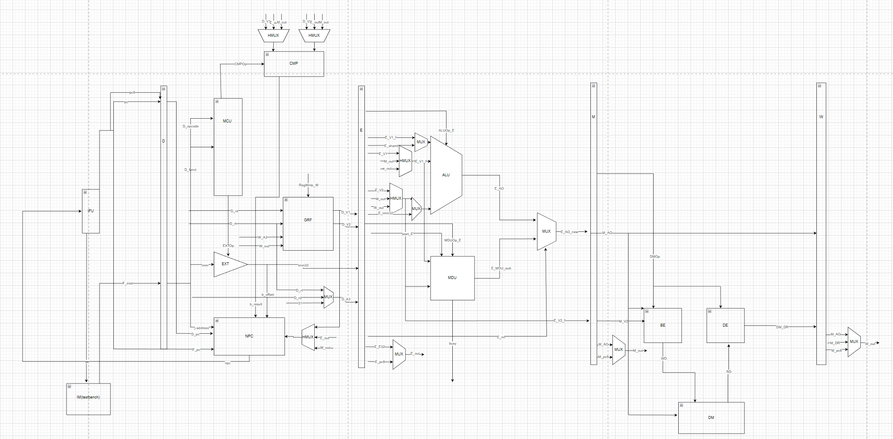

# <center>P6-Design-Document</center>


## 一.数据通路图示

​	P6在P5的基础上新增乘除槽单元、字节使能单元、数据扩展单元，在顶层模块中增加与testbench的接口，将IM与DM外移到testbench中。



## 二.功能模块定义

### 1. MCU

#### 1.端口定义列表

| 名称       | 方向 | 位宽 | 描述                                   |
| ---------- | ---- | ---- | -------------------------------------- |
| D_opcode   | I    | 6    | 操作码                                 |
| D_funct    | I    | 6    | 功能码                                 |
| SelA3_D    | O    | 2    | 选择写入寄存器地址                     |
| RegWrite_D | O    | 1    | 寄存器堆写入地址                       |
| EXTOp_D    | O    | 1    | 立即数扩展信号                         |
| SelEMout_D | O    | 1    | 选择E、M级转发数据                     |
| SelWout_D  | O    | 2    | 选择W级转发数据/写入GRF数据            |
| SeLALUB_D  | O    | 1    | 选择ALU_B端口输入数据                  |
| SelALUS_D  | O    | 1    | 选择ALU_S端口移位数据                  |
| check_D    | O    | 1    | 判定是否为新信号(课上扩展使用)         |
| mf_D       | O    | 1    | mfhi/mflo指令，选择E级输出数据         |
| start_D    | O    | 1    | 乘除类导致延迟的指令信号，只有md类需要 |
| CMPOp_D    | O    | 3    | B类跳转指令操作码                      |
| NPCOp_D    | O    | 3    | 跳转地址选择                           |
| ALUOp_D    | O    | 4    | ALU计算操作                            |
| MDUOp_D    | O    | 4    | 乘除类计算操作                         |
| DMOp_D     | O    | 4    | 存取指令操作                           |
| T_rs_use_D | O    | 2    | 位于D级用到rs寄存器中值的周期数        |
| T_rt_use_D | O    | 2    | 位于D级用到rt寄存器中值的周期数        |
| T_new_D    | O    | 2    | 位于D级产生新信号的周期数              |

**注：由于BE模块产生字节使能信号，将原内存写入使能信号MemWrite省去**

#### 2.指令分类与T_use/T_new处理

**指令分类如下**

| 类别             | 包含的指令              |
| ---------------- | ----------------------- |
| cal_R            | add,sub,and,or,slt,sltu |
| cal_I            | andi,ori,addi,lui       |
| shift            | sll                     |
| shiftv           | sllv                    |
| branch           | beq,bne                 |
| store            | sw,sh,sb                |
| load             | lw,lh,lb                |
| md（有运算延迟） | mult,multu,div,divu     |
| mf（读取）       | mfhi,mflo               |
| mt（写入）       | mthi,mtlo               |

​	**对指令进行分类的好处是使得控制信号的产生更加简洁，增加指令时可以先考虑它属于哪一类**

```verilog
assign T_rs_use_D = (branch | op_jr | op_jalr) ? 2'b00 :
						  (cal_R | cal_I | load | store | shiftv | md | mt) ? 2'b01 :
						  2'b11;//用不到置为3
assign T_rt_use_D = (branch) ? 2'b00 :
						  (cal_R | shift | shiftv | md) ? 2'b01 :
						  2'b11;
assign T_new_D = (load) ? 2'b11 :
					  (cal_R | cal_I | shift | shiftv | mf) ? 2'b10 :
					  2'b00;
```


### 3.HCU

#### 1.端口定义列表

| 输入信号     | 方向     | 位宽       | 描述                         |
| ------------ | -------- | ---------- | ---------------------------- |
| MDUOp_D      | I        | 4          | D级当前指令是否为乘除指令    |
| D_A1         | I        | 5          | D级A1输入                    |
| D_A2         | I        | 5          | D级A2输入                    |
| E_A1         | I        | 5          | E级A1输入                    |
| E_A2         | I        | 5          | E级A2输入                    |
| E_A3         | I        | 5          | E级A3输入                    |
| check_E      | I        | 1          | 课上扩展                     |
| start        | I        | 1          | E级乘除运算启动信号          |
| busy         | I        | 1          | E级乘除运算进行符号          |
| M_A2         | I        | 5          | M级A2输入                    |
| M_A3         | I        | 5          | M级A3输入                    |
| check_M      | I        | 1          | 课上扩展                     |
| W_A3         | I        | 5          | W级A3输入                    |
| RegWrite_E   | I        | 1          | E级保存的GRF写入使能信号     |
| RegWrite_M   | I        | 1          | M级保存的GRF写入使能信号     |
| RegWrite_W   | I        | 1          | W级保存的GRF写入使能信号     |
| T_rs_use     | I        | 2          | D级中MCU输出的T_rs_use_D信号 |
| T_rt_use     | I        | 2          | D级中MCU输出的T_rt_use_D信号 |
| T_new_E      | I        | 2          | E级中T_new_E输入             |
| T_new_M      | I        | 2          | M级中T_new_M输入             |
| T_new_W      | I        | 2          | W级中T_new_W输入             |
| **输出信号** | **位宽** | **作用级** | **描述**                     |
| FwdCMPD1     | 2        | D          | 对HMUX_CMP_D1输出进行选择    |
| FwdCMPD2     | 2        | D          | 对HMUX_CMP_D2输出进行选择    |
| FwdALUA      | 2        | E          | 对HMUX_ALU_A输出进行选择     |
| FwdALUB      | 2        | E          | 对HMUX_ALU_B输出进行选择     |
| FwdDM        | 1        | M          | 对HMUX_DM的输出进行选择      |
| stall        | 1        | D,F,M      | 暂停信号                     |

#### 2.暂停与转发

* 将P5中列举出的8种暂停情况合并为4种，更加简洁且易于扩展

* 针对乘除槽增加暂停信号

* 当 busy 信号或 start 信号为 1 时，`mult, multu, div, divu, mfhi, mflo, mthi, mtlo` 等乘除法相关的指令均被阻塞在 D 流水级

* 转发与P5相比未作改动

```verilog
wire stall_rs_e = (T_rs_use < T_new_E)&&(D_A1 == E_A3)&&(D_A1 != 5'b0)&&(RegWrite_E);
wire stall_rs_m = (T_rs_use < T_new_M)&&(D_A1 == M_A3)&&(D_A1 != 5'b0)&&(RegWrite_M);
wire stall_rs = stall_rs_e | stall_rs_m ;
wire stall_rt_e = (T_rt_use < T_new_E)&&(D_A2 == E_A3)&&(D_A2 != 5'b0)&&(RegWrite_E);
wire stall_rt_m = (T_rt_use < T_new_M)&&(D_A2 == M_A3)&&(D_A2 != 5'b0)&&(RegWrite_M);
wire stall_rt = stall_rt_e | stall_rt_m ;
wire stall_mdu = (MDUOp_D != 4'b0000)&&(busy | start);
assign stall = stall_rs | stall_rt | stall_mdu;
```

### 3.ALU

#### 1.端口定义列表

| 名称    | 方向 | 位宽 | 描述     |
| ------- | ---- | ---- | -------- |
| src_A   | I    | 32   | 操作数1  |
| src_B   | I    | 32   | 操作数2  |
| shamt_f | I    | 5    | 移位数据 |
| ALUOp   | I    | 3    | 运算类型 |
| AO      | O    | 32   | 运算结果 |

#### 2.ALUOp编码与运算选择

| ALU运算                   | ALUOp编码 |
| ------------------------- | --------- |
| +                         | 0000      |
| -                         | 0001      |
| \|                        | 0010      |
| &                         | 0011      |
| load to higher half (lui) | 0100      |
| signed compare (slt)      | 0101      |
| unsigned compare(sltu)    | 0110      |
| <<                        | 0111      |

### 4.EXT

#### 端口定义列表

| 名称   | 方向 | 位宽 | 描述                    |
| ------ | ---- | ---- | ----------------------- |
| imm    | I    | 16   | D级16位立即数           |
| EXTOp  | I    | 1    | 选择进行符号扩展/零扩展 |
| imm_32 | I    | 32   | 位扩展结果              |

### 5.GRF

#### 1.端口定义列表

| 名称      | 方向 | 位宽 | 描述         |
| --------- | ---- | ---- | ------------ |
| clk       | I    | 1    | 时钟信号     |
| reset     | I    | 1    | 同步复位信号 |
| rs        | I    | 5    | rs寄存器     |
| rt        | I    | 5    | rt寄存器     |
| rd        | I    | 5    | rd寄存器     |
| pc        | I    | 32   | 指令执行地址 |
| datawrite | I    | 32   | 写入数据选择 |
| RegWrite  | I    | 1    | 写入使能     |
| dataread1 | O    | 32   | 读rs寄存器   |
| dataread2 | O    | 32   | 读rt寄存器   |

**注意：这里的RegWrite,datawirte,A3(rd),pc信号均来自W级**

#### 2.GRF内部转发

​	设计GRF内部转发逻辑：GRF既是D级的一个部件又是W级之后的流水线寄存器。当W级写GRF，D级读GRF时，如果读取寄存器与写入寄存器为同一寄存器时不进行转发，新值虽然被写入GRF但流入E级的值依然为旧值。

**判断条件：当写入信号RegWrite有效且A1==A3或A2==A3时，将写入值作为对应输出值**

判断逻辑如下:

```verilog
//forward
assign dataread1 = (RegWrite && rs == rd && rd != 0) ? datawrite : grf[rs];
```

### 6.IFU

#### 端口定义列表

| 名称  | 方向 | 位宽 | 描述                                  |
| ----- | ---- | ---- | ------------------------------------- |
| clk   | I    | 1    | 时钟信号                              |
| reset | I    | 1    | 同步复位信号                          |
| en    | I    | 1    | 使能信号(~stall)                      |
| npc   | I    | 32   | 下一指令地址                          |
| pc    | O    | 32   | F级当前地址                           |
| pc8   | O    | 32   | 输出PC+8，随流水段传递(jal考虑延迟槽) |
| instr | O    | 32   | 取出的指令                            |

### 7.NPC

#### 1.端口定义列表

| 名称        | 方向 | 位宽 | 描述                     |
| ----------- | ---- | ---- | ------------------------ |
| D_pc        | I    | 32   | D级PC                    |
| F_pc        | I    | 32   | F级PC                    |
| b_result    | I    | 1    | D级CMP模块判断结果       |
| b_offset    | I    | 32   | B类指令的跳转地址        |
| j_address   | I    | 26   | J类指令跳转地址          |
| reg_address | I    | 32   | 跳转到寄存器中的地址(jr) |
| NPCOp       | I    | 3    | 地址选择信号             |
| npc         | O    | 32   | 程序下一条指令地址       |

#### 2.NPCOp编码与地址选择

| NPCOp编码          | 选择跳转地址                        |
| ------------------ | ----------------------------------- |
| 000                | F_pc + 4                            |
| 001(B) && b_result | D_pc + 4 + (b_offset << 2'b10)      |
| 010(jal)           | {(D_pc + 4)[31:28],j_address,2'b00} |
| 011(jr)            | reg_address                         |

**注：NPC是横跨D级和E级的模块，如果是beq或jal等指令，则需要在D_pc基础上进行操作，否则为F_pc+4**

### 8.CMP

#### 1.端口定义列表

| 名称     | 方向 | 位宽 | 描述                          |
| -------- | ---- | ---- | ----------------------------- |
| D_V1     | I    | 32   | GRF中读出的rs寄存器的值       |
| D_V2     | I    | 32   | GRF中读出的rt寄存器的值       |
| CMPOp    | I    | 3    | 选择比较类型                  |
| b_result | O    | 1    | 是否满足B类跳转指令的跳转条件 |

#### 2.CMPOp编码与对应指令

当前只实现beq，该信号的设置更大的意义在于其可扩展性，便于课上添加指令

| CMPOp编码 | 对应指令 |
| --------- | -------- |
| 000       | beq      |
| 001       | bne      |
| ...       | ...      |

### 9.MDU

#### 1.端口定义列表

| 名称  | 方向 | 位宽 | 描述                     |
| ----- | ---- | ---- | ------------------------ |
| clk   | I    | 1    | 时钟信号                 |
| reset | I    | 1    | 同步复位信号             |
| start | I    | 1    | 开始乘除运算信号         |
| MDUOp | I    | 4    | 乘除操作                 |
| A     | I    | 32   | 操作数A                  |
| B     | I    | 32   | 操作数B                  |
| out   | I    | 32   | mfhi/mflo输出结果        |
| busy  | I    | 1    | 正在执行乘除运算指示信号 |

#### 2.MDUOp编码与对应指令

| DMOp编码 | 对应指令            |
| -------- | ------------------- |
| 0000     | 非乘除指令，记为nop |
| 0001     | mult                |
| 0010     | multu               |
| 0011     | div                 |
| 0100     | divu                |
| 0101     | mfhi                |
| 0110     | mflo                |
| 0111     | mthi                |
| 1000     | mtlo                |

#### 3.代码实现逻辑

* 乘法mult/multu延迟5周期，除法div/divu延迟10周期，在计算出结果后存储在tmpHI,tmpLO中，等到耗满延迟再转存入HI,LO.mfhi/mflo从HI,LO中读取。
* 设置计数器 判断是否达到该种运算的延迟(delay)，若达到，则将数值从tmp转存入HI/LO，同时将busy信号置0
* 实际上得到的结果为64位的结果，使用{tmpHI,tmpLO}位拼接写法进行拆分。

```verilog
// counter 
always@(posedge clk)begin
	if(reset)begin
		cnt <= 32'b0;
		busy <= 1'b0;
	end
	else if(start)begin   //start claculate
		busy <= 1'b1;
	end
	else if(busy) begin
		if(cnt == delay - 1)begin  //next T : busy = 0
			cnt <= 32'b0;
			busy <= 1'b0;
		end
		else begin
			cnt <= cnt + 1'b1;
		end
	end
end

always@(posedge clk)begin
	if(reset)begin
		tmpHI <= 32'b0;
		tmpLO <= 32'b0;
		HI <= 32'b0;
		LO <= 32'b0;
	end
	else  begin
        if (!busy) begin  //进行新运算
		case(MDUOp)
		mult :
		begin
			delay <= 4'b0101; //5
			{tmpHI,tmpLO} <= $signed(A) * $signed(B); 
		end
		multu :
		begin
			delay <= 4'b0101;
			{tmpHI,tmpLO} <= $unsigned(A) * $unsigned(B);
		end
		div :
		begin
			delay <= 4'b1010; //10
			tmpLO <= $signed(A) / $signed(B);
			tmpHI <= $signed(A) % $signed(B);
		end
		divu :
		begin
			delay <= 4'b1010;
			tmpLO <= $unsigned(A) / $unsigned(B);
			tmpHI <= $unsigned(A) % $unsigned(B);
		end
		mthi : HI <= A;
		mtlo : LO <= A;
		endcase
	end
	else begin      //保持老运算
		if(cnt == delay - 1'b1)begin  // next T : busy = 0;
			HI <= tmpHI;
			LO <= tmpLO;
		end
		else begin
			HI <= HI;
			LO <= LO;
		end
	end
	end
end
// mfhi/mflo为组合逻辑
assign out = (MDUOp == mfhi)? HI :
				 (MDUOp == mflo)? LO :
				 32'b0;
endmodule
```

### 10.BE

#### 1.端口定义列表

| 名称    | 方向 | 位宽 | 描述                           |
| ------- | ---- | ---- | ------------------------------ |
| address | I    | 32   | 存数据地址                     |
| DMOp    | I    | 4    | 存数操作                       |
| WD_in   | I    | 32   | 未经处理的存入数据             |
| byteen  | O    | 4    | 字节使能信号                   |
| WD_out  | O    | 32   | 处理后的存入数据(字/半字/字节) |

* **注：byteen为存入字节使能信号、对应位置的值为1表示允许存入，如sw->byteen = 1111**

#### 2.DMOp编码与存数操作

| DMOp | 对应指令 |
| ---- | -------- |
| 0001 | sw       |
| 0010 | sh       |
| 0011 | sb       |

### 11.DE

#### 1.端口定义列表

| 名称    | 方向 | 位宽 | 描述               |
| ------- | ---- | ---- | ------------------ |
| address | I    | 32   | 取数地址           |
| DMOp    | I    | 4    | 取数操作           |
| RD_in   | I    | 32   | 未经处理的取出数据 |
| RD_out  | O    | 32   | 处理后的取出数据   |

#### 2.DMOp编码与取数操作

| DMOp | 对应指令 |
| ---- | -------- |
| 1000 | lw       |
| 1001 | lh       |
| 1010 | lb       |

### 12.MUX

#### 1.功能多路选择器

##### 1.MUX_A3 D级写入寄存器选择

###### 端口定义列表

| 名称       | 方向 | 位宽 | 描述         |
| ---------- | ---- | ---- | ------------ |
| D_instr_rs | I    | 5    | instr中rs段  |
| D_instr_rt | I    | 5    | instr中rt段  |
| SelA3_D    | I    | 2    | rd选择信号   |
| D_A3       | O    | 5    | 写入寄存器A3 |

###### 选择信号与结果

| SelA3_D | D_A3 |
| ------- | ---- |
| 2'b10   | 31   |
| 2'b01   | rd   |
| 2'b00   | rt   |

##### 2.MUX_ALU_B ALUB端口选择

###### 端口定义列表

| 名称      | 方向 | 位宽 | 描述                 |
| --------- | ---- | ---- | -------------------- |
| E_V2_f    | I    | 32   | 转发后的V2           |
| E_E32     | I    | 32   | 32位立即数           |
| SelALUB_E | I    | 1    | 选择信号             |
| E_ALU_B   | O    | 32   | 输出到ALUB端口的结果 |

###### 选择信号与结果

| SelALUB_E | E_ALU_B |
| --------- | ------- |
| 1'b1      | E_E32   |
| 1'b0      | E_V2_f  |

##### 3.MUX_E_out  选择E级转发数据

###### 端口定义列表 

| 名称       | 方向 | 位宽 | 描述         |
| ---------- | ---- | ---- | ------------ |
| E_E32      | I    | 32   | 32位立即数   |
| E_pc8      | I    | 32   | 流水PC8(jal) |
| SelEMout_E | I    | 1    | 选择信号     |
| E_out      | O    | 32   | E级转发数据  |

###### 选择信号与结果

| SelEMout_E | E_out |
| ---------- | ----- |
| 1'b1       | E_pc8 |
| 1'b0       | E_E32 |

##### 4.MUX_M_out 选择M级转发数据

###### 端口定义列表 

| 名称       | 方向 | 位宽 | 描述           |
| ---------- | ---- | ---- | -------------- |
| M_AO       | I    | 32   | M级ALU计算结果 |
| M_pc8      | I    | 32   | 流水PC8(jal)   |
| SelEMout_M | I    | 1    | 选择信号       |
| M_out      | O    | 32   | M级转发数据    |

###### 选择信号与结果

| SelEMout_M | M_out |
| ---------- | ----- |
| 1'b1       | M_pc8 |
| 1'b0       | M_AO  |

##### 5.MUX_W_out 选择W级转发数据

###### 端口定义列表 

| 名称      | 方向 | 位宽 | 描述                    |
| --------- | ---- | ---- | ----------------------- |
| W_AO      | I    | 32   | W级ALU计算结果          |
| W_DR      | I    | 32   | W级DM中读取出的数据     |
| W_pc8     | I    | 32   | W级流水PC8(jal)         |
| SelWout_W | I    | 2    | 选择信号                |
| W_out     | O    | 32   | W级转发数据/GRF写入数据 |

###### 选择信号与结果

| SelWout_W | W_out |
| --------- | ----- |
| 2'b10     | W_pc8 |
| 2'b01     | W_DR  |
| 2'b00     | W_AO  |

##### 6.MUX_MDU_ALU选择E级输出数据

###### 端口定义列表

| 名称      | 方向 | 位宽 | 描述           |
| --------- | ---- | ---- | -------------- |
| E_AO      | I    | 32   | ALU输出        |
| E_MDU_out | I    | 32   | MDU输出        |
| E_mf      | I    | 1    | 是否为mf类指令 |
| E_AO_new  | O    | 32   | E级输出值      |

###### 选择信号与结果

| E_mf | E_AO_new  |
| ---- | --------- |
| 1    | E_MDU_out |
| 0    | E_AO      |

#### 2.转发多路选择器

##### 1.HMUX_CMP_D1 CMP模块rs寄存器值转发

###### 端口定义列表 

| 名称     | 方向 | 位宽 | 描述               |
| -------- | ---- | ---- | ------------------ |
| GRF_RD1  | I    | 32   | GRF中读取出的rs值  |
| M_out    | I    | 32   | M级转发数据        |
| E_out    | I    | 32   | E级转发数据        |
| FwdCMPD1 | I    | 2    | 选择信号           |
| D_V1_f   | O    | 32   | 转发后的rs寄存器值 |

​	**注：转发寄存器中有数据优先级的问题，越新产生的数据优先级越高，考虑到GRF中内部转发的逻辑，事实上GRF_RD1也代表着潜在的W级转发数据，但是仍然不破坏优先级关系E>M>W**

###### 选择信号与结果

| FwdCMPD1 | D_V1_f  |
| -------- | ------- |
| 2'b10    | E_out   |
| 2'b01    | M_out   |
| 2'b00    | GRF_RD1 |

##### 2.HMUX_CMP_D2 CMP模块rt寄存器值转发

###### 端口定义列表 

| 名称     | 方向 | 位宽 | 描述               |
| -------- | ---- | ---- | ------------------ |
| GRF_RD2  | I    | 32   | GRF中读取出的rt值  |
| M_out    | I    | 32   | M级转发数据        |
| E_out    | I    | 32   | E级转发数据        |
| FwdCMPD2 | I    | 2    | 选择信号           |
| D_V2_f   | O    | 32   | 转发后的rt寄存器值 |

###### 选择信号与结果

| FwdCMPD2 | D_V1_f  |
| -------- | ------- |
| 2'b10    | E_out   |
| 2'b01    | M_out   |
| 2'b00    | GRF_RD2 |

##### 3.HMUX_ALU_A ALU模块V1值转发/MDU输入V1

###### 端口定义列表 

| 名称    | 方向 | 位宽 | 描述              |
| ------- | ---- | ---- | ----------------- |
| E_V1    | I    | 32   | GRF中读取出的rs值 |
| M_out   | I    | 32   | M级转发数据       |
| W_out   | I    | 32   | W级转发数据       |
| FwdALUA | I    | 2    | 选择信号          |
| E_V1_f  | O    | 32   | 转发后的V1值      |

###### 选择信号与结果

| FwdALUA | E_V1_f |
| ------- | ------ |
| 2'b10   | M_out  |
| 2'b01   | W_out  |
| 2'b00   | E_V1   |

##### 4.HMUX_ALU_B ALU模块V2值转发/MDU输入V2

###### 端口定义列表 

| 名称    | 方向 | 位宽 | 描述              |
| ------- | ---- | ---- | ----------------- |
| E_V2    | I    | 32   | GRF中读取出的rt值 |
| M_out   | I    | 32   | M级转发数据       |
| W_out   | I    | 32   | W级转发数据       |
| FwdALUB | I    | 2    | 选择信号          |
| E_V2_f  | O    | 32   | 转发后的V2值      |

###### 选择信号与结果

| FwdALUB | E_V2_f |
| ------- | ------ |
| 2'b10   | M_out  |
| 2'b01   | W_out  |
| 2'b00   | E_V2   |

##### 5.HMUX_DM DM写入数据转发

###### 端口定义列表 

| 名称   | 方向 | 位宽 | 描述        |
| ------ | ---- | ---- | ----------- |
| M_V2   | I    | 32   | M级V2       |
| W_out  | I    | 32   | W级转发数据 |
| FwdDM  | I    | 1    | 选择信号    |
| M_V1_f | O    | 32   | DM写入数据  |

###### 选择信号与结果 

| FwdDM | M_V1_f |
| ----- | ------ |
| 1'b1  | W_out  |
| 1'b0  | M_V2   |

##### 6.HMUX_NPC NPC模块跳转寄存器值转发

###### 端口定义列表 

| 名称     | 方向 | 位宽 | 描述               |
| -------- | ---- | ---- | ------------------ |
| GRF_RD1  | I    | 32   | GRF中读取出的rs值  |
| M_out    | I    | 32   | M级转发数据        |
| E_out    | I    | 32   | E级转发数据        |
| FwdCMPD1 | I    | 2    | 选择信号           |
| D_RA_f   | O    | 32   | 转发后的rs寄存器值 |

​	**注：其实可以共用CMPD1的转发数据**

###### 选择信号与结果

| FwdCMPD1 | D_RA_f  |
| -------- | ------- |
| 2'b10    | E_out   |
| 2'b01    | M_out   |
| 2'b00    | GRF_RD1 |

### 13.流水线寄存器

#### 1.D_REG

| 名称    | 方向 | 位宽 | 描述              |
| ------- | ---- | ---- | ----------------- |
| clk     | I    | 1    | 时钟信号          |
| reset   | I    | 1    | 同步复位信号      |
| en      | I    | 1    | ~stall（冻结D级） |
| F_instr | I    | 32   | F级取指令         |
| F_pc    | I    | 32   | F级PC             |
| F_pc8   | I    | 32   | F级PC+8(jal)      |
| D_instr | O    | 32   | D级执行指令       |
| D_pc    | O    | 32   | D级PC             |
| D_pc8   | O    | 32   | D级PC+8           |

#### 2.E_REG

| 名称       | 方向 | 位宽 | 描述                     |
| ---------- | ---- | ---- | ------------------------ |
| clk        | I    | 1    | 时钟信号                 |
| reset      | I    | 1    | 同步复位信号             |
| clr        | I    | 1    | stall(清空E级)           |
| D_V1       | I    | 32   | D级GRF中读取rs寄存器的值 |
| D_V2       | I    | 32   | D级GRF中读取rt寄存器的值 |
| D_A1       | I    | 5    | D级A1                    |
| D_A2       | I    | 5    | D级A2                    |
| D_A3       | I    | 5    | D级A3                    |
| D_E32      | I    | 32   | 32位立即数               |
| D_pc       | I    | 32   | D级pc                    |
| D_pc8      | I    | 32   | D级pc+8                  |
| T_new_D    | I    | 2    | D级T_new                 |
| RegWrite_D | I    | 1    | D级GRF写入使能           |
| start_D    | I    | 1    | D级乘除指令开始信号      |
| SelEMout_D | I    | 1    | E、M级转发数据选择信号   |
| SelWout_D  | I    | 1    | W级转发数据选择信号      |
| SelALUB_D  | I    | 1    | ALUB端口数据选择         |
| ALUOp_D    | I    | 4    | ALU操作选择              |
| DMOp_D     | I    | 4    | DM操作选择               |
| MDUOp_D    | I    | 4    | 乘除指令操作             |
| E_V1       | O    | 32   |                          |
| E_V2       | O    | 32   |                          |
| E_A1       | O    | 5    |                          |
| E_A2       | O    | 5    |                          |
| E_A3       | O    | 5    |                          |
| E_E32      | O    | 32   |                          |
| E_pc       | O    | 32   |                          |
| E_pc8      | O    | 32   |                          |
| T_new_E    | O    | 2    |                          |
| RegWrite_E | O    | 1    |                          |
| SelEMout_E | O    | 1    |                          |
| SelWout_E  | O    | 2    |                          |
| SelALUB_E  | O    | 1    |                          |
| ALUOp_E    | O    | 3    |                          |
| DMOp_E     | O    | 3    |                          |

#### 3.M_REG

| 名称       | 方向 | 位宽 | 描述                                          |
| ---------- | ---- | ---- | --------------------------------------------- |
| clk        | I    | 1    |                                               |
| reset      | I    | 1    |                                               |
| E_AO       | I    | 32   | E级ALU/MDU输出                                |
| E_V2       | I    | 32   | **注意：E_V2不是D_V2,而是经过转发后的D_V2_f** |
| E_A2       | I    | 5    |                                               |
| E_A3       | I    | 5    |                                               |
| E_pc       | I    | 32   |                                               |
| E_pc8      | I    | 32   |                                               |
| T_new_E    | I    | 2    |                                               |
| RegWrite_E | I    | 1    |                                               |
| start_E    | I    | 1    |                                               |
| SelEMout_E | I    | 1    |                                               |
| SelWout_E  | I    | 1    |                                               |
| DMOp_E     | I    | 4    |                                               |
| M_AO       | O    | 32   |                                               |
| M_V2       | O    | 5    |                                               |
| M_A2       | O    | 5    |                                               |
| M_A3       | O    | 5    |                                               |
| M_pc       | O    | 32   |                                               |
| M_pc8      | O    | 32   |                                               |
| T_new_M    | O    | 2    |                                               |
| RegWrite_M | O    | 1    |                                               |
| SelEMout_M | O    | 1    |                                               |
| SelWout_M  | O    | 2    |                                               |
| DMOp_M     | O    | 3    |                                               |

#### 4.W_REG

| 名称       | 方向 | 位宽 | 描述              |
| ---------- | ---- | ---- | ----------------- |
| clk        | I    | 1    |                   |
| reset      | I    | 1    |                   |
| M_AO       | I    | 32   |                   |
| M_DR       | I    | 32   | M级DM中读出的数据 |
| M_A3       |      |      |                   |
| M_pc       | I    | 32   |                   |
| M_pc8      | I    | 32   |                   |
| SelWout_M  | I    | 2    |                   |
| T_new_M    | I    | 2    |                   |
| RegWrite_M | I    | 1    |                   |
| W_AO       | O    | 32   |                   |
| W_DR       | O    | 32   |                   |
| W_A3       | O    | 5    |                   |
| W_pc       | O    | 32   |                   |
| W_pc8      | O    | 32   |                   |
| SelWout_W  | O    | 2    |                   |
| T_new_W    | O    | 2    |                   |
| RegWrite_W | O    | 1    |                   |

## 三.测试

```verilog
li $0 -1590414783
li $1 -1387657999
li $2 97336612
li $3 -1971889419
li $4 1148790734
li $5 -289210629
li $6 1026640559
li $7 1852052372
li $8, 7860

sltu $4, $0, $1
srav $4, $1, $6
or $6, $0, $4
xor $0, $6, $6

nor $3, $5, $2
slt $0, $5, $3
ori $5, $1, -31050
or $5, $2, $6

subu $1, $2, $6
sltu $4, $4, $3
lbu $0, 878($0)
slt $2, $2, $2

or $6, $2, $4
srav $1, $7, $0
sll $0, $7, 7
srlv $6, $3, $6

nor $3, $3, $7
or $5, $7, $2
div $4, $8
sltu $7, $3, $2

sllv $6, $2, $0
srlv $5, $5, $5
mtlo $0
addu $0, $5, $4

slt $6, $7, $6
addu $5, $1, $1
mfhi $1
nor $4, $5, $5

srav $3, $5, $4
sltiu $3, $4, 7080
and $3, $0, $4
or $7, $5, $5

xor $5, $3, $3
andi $2, $6, 25900
xori $1, $5, 18289
srlv $0, $6, $5

slt $4, $6, $2
ori $7, $3, -32729
lh $7, 1250($0)
sllv $7, $4, $4

addu $4, $1, $2
xori $7, $0, 11378
srl $4, $4, 5
addu $6, $5, $6

srav $7, $3, $4
slti $1, $5, -24158
multu $6, $8
sltu $6, $0, $1
```

## 四.思考题

1、为什么需要有单独的乘除法部件而不是整合进 ALU？为何需要有独立的 HI、LO 寄存器？

- 乘除法都有较高的延迟，若整合进ALU，则进行乘除法的时候，所有的运算类指令都只能阻塞在D级，造成了极大的性能损失。单独设置MDU的话，无关的指令还能正常的在ALU运行，效率较高。
- HI，LO寄存器并不是通用寄存器，和其他通用寄存器的用法不一致，不能通过非乘除法指令修改和访问，因此不需要置于GRF中，内置在MDU中即可。

2、真实的流水线 CPU 是如何使用实现乘除法的？请查阅相关资料进行简单说明。

- 真实的流水线CPU采用的乘法是有加法器和移位器循环，具体实现过程为：

  > 首先CPU会初始化三个通用寄存器用来存放被乘数，乘数，部分积。
  > 部分积寄存器初始化为0。
  > 判断乘数寄存器的低位是0|1，如果为0则将乘数寄存器右移一位，同时将部分积寄存器也右移一位。
  > 在位移时遵循计算机位移规则，乘数寄存器低位溢出的一位丢弃，部分积寄存器低位溢出的一位填充到乘数寄存器的高位。
  > 同时部分积寄存器高位补0。如果为1则将部分积寄存器加上被乘数寄存器，再进行移位操作。
  > 当所有乘数位处理完成后部分积寄存器做高位，乘数寄存器做低位就是最终乘法结果。

- 还有另一种乘法的方式：

  > 只需两个寄存器，A[31:0],B[63:0]，A初始化为被乘数，B初始化为乘数。
  > 每一次取B的最低位，为1则将A[31:0]+B[63:32] -> B[63:32]，为0则不操作。
  > 每次将B >> 1，然后高位补0。

- 除法实现：

  > 与乘法的操作基本相反，首先CPU会初始化三个寄存器,用来存放被除数，除数，部分商。余数(被除数与除数比较的结果)放到被除数的有效高位上。CPU做除法时和做除法时是相反的，乘法是右移，除法是左移，乘法做的是加法，除法做的是减法。首先CPU会把被除数bit位与除数bit位对齐，然后再让对齐的被除数与除数比较(双符号位判断)。比如01-10=11(前面的1是符号位) 1-2=-1 计算机通过符号位和后一位的bit位来判断大于和小于，那么01-10=11 就说明01小于10，如果得数为01就代表大于，如果得数为00代表等于。如果得数大于或等于则将比较的结果放到被除数的有效高位上然后再商寄存器上商：1 并向后多看一位(上商就是将商的最低位左移1位腾出商寄存器最低位上新的商)如果得数小于则上商：0 并向后多看一位然后循环做以上操作当所有的被除数都处理完后，商做结果被除数里面的值就是余数。

3、请结合自己的实现分析，你是如何处理 Busy 信号带来的周期阻塞的？

- 除cnt和busy置位以外全是组合逻辑的操作（不然可能会多出来一个空周期）
- 对于乘除指令：
  - 将busy_E，start_E，MDUOp_D传入HCU
  - 然后md暂停信号为`(busy_E | start_E) & (MDUOp_D != 4'b0000)`

4、请问采用字节使能信号的方式处理写指令有什么好处？（提示：从清晰性、统一性等角度考虑）

- 对于需要写入的位置更加的直观，相当于将DMWE、DMOP写入的A[1:0]用四位字节使能信号表示，十分的统一。

5、请思考，我们在按字节读和按字节写时，实际从 DM 获得的数据和向 DM 写入的数据是否是一字节？在什么情况下我们按字节读和按字节写的效率会高于按字读和按字写呢？

- 按字节读写的时候，我们获得的是一字节，但是我们如果要lw或lh的话我们就需要拼接。如果是sw或sh的话我们需要多次存入。
- 若用lb，sb，lh，sh这种非取字的读写时，按字节读可以省去，取位，拼接的步骤，效率要优于按字读写。

6、为了对抗复杂性你采取了哪些抽象和规范手段？这些手段在译码和处理数据冲突的时候有什么样的特点与帮助？

- NPC统一，NPC统一为一个模块
- 指令分类，cal_R,cal_I,shift,shiftv,branch,load,store等
- 每一级设置outMUX，只需在MCU中控制outSel即可决定转发值及写入寄存器的值

7、在本实验中你遇到了哪些不同指令类型组合产生的冲突？你又是如何解决的？相应的测试样例是什么样的？

- 在常规测试通过后，我们可以将T_rsUse和T_rtUse相同的指令归类为同一需求指令，把T_new相同的指令归类为同一供给指令。
  - 所以可以在new方面有下列指令：add，lw，jal，mfhi
  - 在rsUse方面有下面情况：add，sll，lw，beq，jr，mult，mthi
- 然后对着转发的时间表，设计测试数据：

```
复制# rs0_E1
add   $t0, $t1, $t2
beq   $t0, $t3, label1
nop

# rs0_E2
lw    $t0, 0($t1)
beq   $t0, $t3, label1
nop

#rs0_E0
jal   label1
nop
ori   $t0, $0, 0x1234
label1: jr $ra
nop
....
```

8、如果你是手动构造的样例，请说明构造策略，说明你的测试程序如何保证覆盖了所有需要测试的情况；如果你是完全随机生成的测试样例，请思考完全随机的测试程序有何不足之处；如果你在生成测试样例时采用了特殊的策略，比如构造连续数据冒险序列，请你描述一下你使用的策略如何结合了随机性达到强测的效果。

- 手动构造策略见上
- 完全随机生成有几大不足之处，如无法保证内存对齐，无法保证延迟槽中没有跳转分支，无法避免一定几率的死循环等等
- 但可以加入策略：
  - 比如只用t0-t6寄存器以保证产生足够多的冲突
  - 在检测到生成跳转后禁用跳转指令
  - 检测到内存不对齐可以不生成等等
