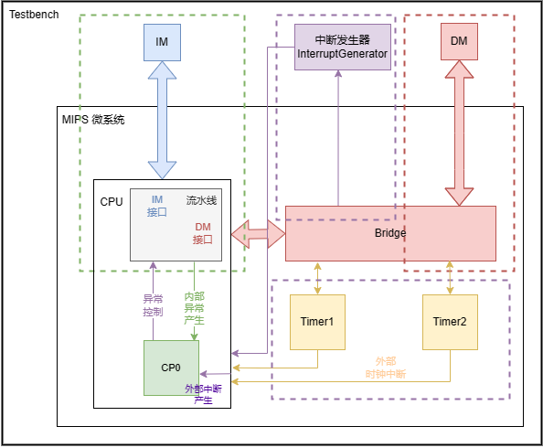
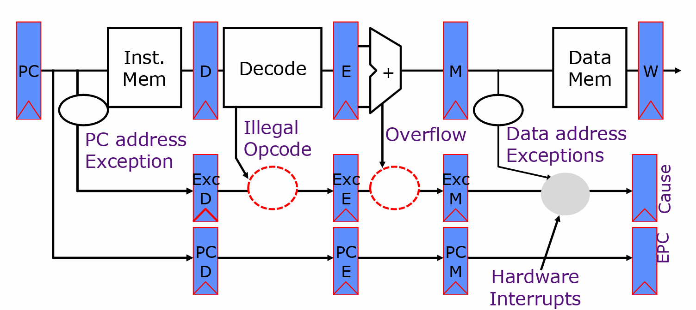
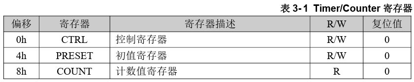
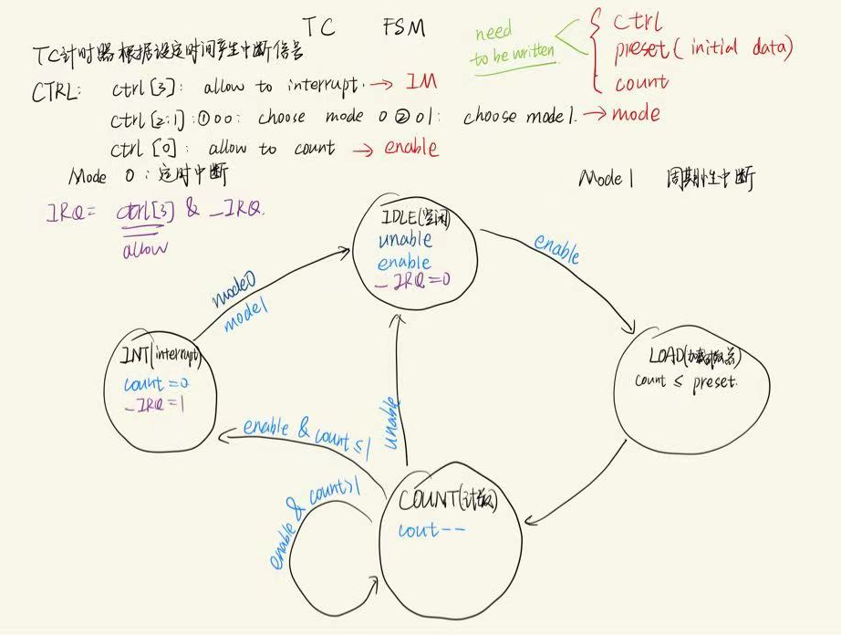
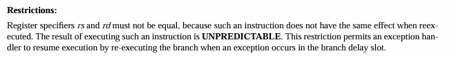

# <center>P7-Design-Document</center>


## 0.顶层设计概述

​	P7要求为实现MIPS微系统，需要为P6实现的流水线CPU添加异常中断功能，并封装为CPU模块、实现系统桥Bridge、计时器Timer1,Timer2等模块，最终形成MIPS微系统，如下图所示。

* 绿色虚线表示已经实现
* 紫色虚线表示新增部分
* 红色虚线为改变后的DM接口



**P7需要实现的任务如下列表**

| 任务               | 解释                                               |
| ------------------ | -------------------------------------------------- |
| 计时器             | 课程组提供代码                                     |
| 系统桥             | 为CPU提供统一的访问外设的接口，自行实现            |
| 协处理器CP0        | 设置CPU的异常处理功能，反馈CPU的异常信息，自行实现 |
| 内部检测异常与流水 | CPU检测内部指令执行错误                            |
| 外部中断响应       | CPU需要具有响应外部中断信号的能力                  |
| 异常处理指令       | 异常处理程序中，会有一些特殊的指令需要实现         |
| 单周期CPU的封装    | 让CPU从外部看上去是单周期CPU                       |
| 异常处理程序       | 利用MARS编写简单的异常处理程序进行测试             |

**施工步骤**：

1. 更改流水线各级使之可以产生异常

2. 添加CP0处理异常

3. 添加Bridge与两个外设

**异常与中断**

* 异常：内部异常 如F级取指异常、D级计算溢出等
* 中断：来自外部设备，Timer0,Timer1,Interrupt
* 来自外部设备的中断比内部异常优先级更高

## 一.功能部件设计

### 0.新增指令的实现思路

#### **P7中增加四条指令**

* mtc0
* mfc0
* eret
* syscall

#### mtc0 ：写入CP0中寄存器(12/14) 

* **对于mtc0和mfc0指令 ： 读取的CP0寄存器地址均为rd域，由于本实现中采用了集中式译码，故增加数据通路，将原指令的rd域流水下去，作为CP0寄存器地址, CP0_addr**

* 指令格式 ：

  010000 || 00100 || rt || rd || 00000000000

  mtc0 rt,rd

* MCU ：

  * CP0_WE_D
  * T_rs_use = T_rt_use = 3（这里rt的真实使用时间是3，但是并不会对暂停/转发造成影响，T<sub>use</sub> >= T<sub>new</sub>成立，可以通过转发解决）
  * T_new = 0
  
* 写入时应当注意 ：Cause寄存器(13)不允许写入，EPC允许写入，**SR寄存器部分字段允许写入，其他不允许写入的字段要保持为0**

  ```verilog
  if(A2 == 12) 
  begin
  	`IM <= D_in[15:10];
  	`EXL <= D_in[1];
  	`IE <= D_in[0];
  end
  else if (A2 == 14) EPC <= D_in;
  ```

#### mfc0 : 读取CP0中寄存器的值(12/13/14)

​	**在M级CP0输出结果与DE输出结果之间加MUX**

* 指令格式 ：
  010000 || 00000 || rt || rd || 00000000000

  mfc0 rt,rd

* MCU : 

  * RegWrite
  * T_rs_use = T_rt_use = 3
  * T_new = 3

#### eret : 从中断/异常处理中返回

* MCU中判断后进行流水，D_eret，在M级进行使用跳出异常处理

  **eret是错误最易发生的一个指令，对于eret的要求有:**

  * 跳转到CP0中EPC寄存器存储的受害PC

  * 不执行eret后延迟槽中的指令

    不执行延迟槽中的指令我的实现方式(比较优雅 较为推荐)为 ：在D级识别到eret指令后，在F级直接插入nop，同时npc中选择EPC端口

    ```verilog
    \\ D_MCU_eret : D_eret
    assign D_eret  = op_eret;
    \\ F-D reg 当F级出现取指异常或D级识别到eret指令时 传递指令nop
    assign F_instr_new = (F_AdEL) ? 32'b0 : (D_eret) : F_instr;
    \\ D_npc 
    assign npc = (D_eret) ? EPC : ...
    ```

    同时还有两种可能的实现方式 ：

    1. 在D级识别到eret指令后，清D级延迟槽，但是此时应当注意清空延迟槽的条件为(clr && !stall)，即判断当前非暂停，举一个简单的例子就可以知道，例如D:eret E:mtc0 

       **一定要注意信号之间的优先级！**下面给出D级流水线寄存器的代码(我采用集中式译码，好臃肿，更加推荐分布式译码(bushi))

       ```verilog
       always@(posedge clk)begin
       	if(reset )begin 
       	instr <= 32'b0;
       	pc <= 32'b0;
       	pc8 <= 32'b0;
       	ExcCode <= 5'b0;
       	BD <= 1'b0;
       	end
       	else if  (req) begin
       	instr <= 32'b0;
       	pc <= 32'h0000_4180;
       	pc8 <= 32'h0000_4188;
       	ExcCode <= 5'b0;
       	BD <= 1'b0;
       	end
           else if (clr && en) begin
           instr <= 32'b0;
       	pc <= 32'b0;
       	pc8 <= 32'b0;
       	ExcCode <= 5'b0;
       	BD <= 1'b0;
           end
       	else if (en) begin
       	instr <= F_instr;
       	pc <= F_pc;
       	pc8 <= F_pc8;
       	ExcCode <= F_ExcCode;
       	BD <= F_BD;
       	end
       	else begin   //stall
       	instr <= instr;
       	pc <= pc;
       	pc8 <= pc8;
       	ExcCode <= ExcCode;
       	BD <= BD;
       	end
       end
       ```

    2. 在F级输入pc取指时进行特判(这种写法我没有通过，报错处理延迟槽中断后没有跳回跳转指令)，不过多叙述

#### syscall : 系统调用异常

* 在D级MCU中识别出来并判断为异常即可

### 0.5关于流水线寄存器/PC选择中的信号优先级问题

* **2023秋计算机组成教程中课程组对于信号的优先级规定如下**

* **reset > req > stall**

​	在流水线寄存器和IFU中pc选择时需要对信号优先级进行判断，**推荐使用if_else_if_else语句实现对优先级的判断**，非常重要！

**流水线寄存器，以信号最复杂的E级为例**

```verilog
lways@(posedge clk) begin
	if(reset) begin
	...
	end
	else if(req) begin
	...
	end
	else if(clr)begin
	pc <=  D_pc ;   // 注意E级暂停时也要对pc,BD信号进行流水
	pc8 <=  D_pc8 ;
	BD <=  D_BD;
    ...
	end
	else begin
	...
	end
end
```

**IFU中PC的选择**

```verilog
always@(posedge clk)begin
if(reset)begin
	PC <= 32'h0000_3000;
	PC8 <= 32'h0000_3008;
	tmp <= 32'b0;
end
else if (req) begin
	PC <= npc;
	PC8 <= npc + 4'b1000;
	tmp <= npc - 32'h0000_3000;
end
else if (en)begin
	PC <= npc;
	PC8 <= npc + 4'b1000;
	tmp <= npc - 32'h0000_3000;
end
else begin
	PC <= PC;
	PC8 <=PC8;
	tmp <= tmp;
end
```

###  1.CP0

#### 0.数据通路

* **宏观PC：**为了将我们的流水线CPU封装为单周期CPU（至少在外界看来是这个样子），提出宏观PC的概念，**在宏观PC之前的地址对应的指令均已经完成，在宏观PC之后的地址对应的指令还未完成**，依据这一特点我们知道应当将CP0(Coprocessor0)放置在M级流水线。



#### 1.需要处理的异常

##### 0.异常优先级

* 一条指令发生多个异常，考虑最先发生的异常(F>D>E>M)
* 多条指令发生异常，也有限考虑最先发生的异常(M>E>D>F)，即将M级异常传入CP0

##### 1.F级异常：

- PC地址没有字对齐（AdEL）
- PC地址超过0x3000 ~ 0x6ffc（AdEL）
- 还需要判断D级不是eret指令，因为eret后“延迟槽”中指令不被执行，即使在F级发生异常也不应被处理/进入异常处理程序。

```verilog
assign F_ExcCode = (!D_eret) && (F_pc[1:0] != 2'b00) || (F_pc < 32'h0000_3000) || (F_pc > 32'h0000_3fffc) ? ADEL : NONE;
```

**注意F级发生取指错误后要流水空指令nop递交到CP0**

```verilog
F_instr_new = (F_AdEL) ? 32'b0 : (D_eret) ? 32'b0 : F_instr;
```

##### 1.D级异常：

- 未知的指令码（RI）

  从MCU中添加输出信号```invalid_D```，标记当前指令是否为无效指令，**注意在MCU中识别nop指令**
  
  ```verilog
  assign invalid_D = !(cal_R | cal_I | store | load | branch | md | mt | mf | op_jal | op_jr | op_mfc0 | op_mtc0 | op_syscall | op_eret | op_nop | op_syscall);
  ```

* syccall 系统调用异常

  ```verilog
  assign D_ExcCode_fixed = (D_ExcCode) ? D_ExcCode : 
  								 (invalid_D) ? RI :
  								 (D_syscall) ? SYSCALL :
  								 NONE;
  ```

##### 2.E级异常：

- addi、add、sub计算溢出（Ov）: 在MCU中添加输出信号```isAriOv_D```表示是不是需要判断溢出的运算指令

  ```verilog
  assign isAriOv_D = op_add | op_addi | op_sub;
  ```

- load类指令计算地址时加法溢出（AdEL）

- store类指令计算地址时加法溢出（AdES）

```verilog
assign E_ExcCode_fixed = (E_ExcCode) ? E_ExcCode : 
								 (overflow_E && (DMOp_E == sw || DMOp_E == sh || DMOp_E == sb)) ? ADES :
								 (overflow_E && (DMOp_E == lw || DMOp_E == lh || DMOp_E == lb)) ? ADEL :
								 (overflow_E && isAriOv_E) ? OV : NONE;
```

###### 补位法溢出判断

​	依据add,addi,sub原始的指令RTL中对溢出的判断编写.

```RTL
temp = (GPR[rs]31 || GPR[rs]) + (GPR[rt]31 || GPR[rt]) 
if temp32 ≠ temp31 then 
	SignalException(IntegerOverflow) 
else 
	GPR[rd] ← temp31..0 
endif 
```

​	以add为例翻译为对应的verilog代码如下

```verilog
	ext_A = {src_A[31],src_A};
	ext_B = {src_B[31],src_B};
	ext_AO = ext_A + ext_B;
	if(ext_AO[32] != ext_AO[31]) begin
		overflow = 1'b1;
	end
	else begin
		E_AO = ext_AO[31:0];
	end
```

##### 3.M级异常：

- lw取数地址未 4 字节对齐（AdEL）

- lh取数地址未与 2 字节对齐（AdEL）

- lh、lb取 Timer 寄存器的值（AdEL）

- load型指令取数地址超出 DM、Timer0、Timer1、中断发生器的范围（AdEL）

- sw存数地址未 4 字节对齐（AdES）

- sh存数地址未 2 字节对齐（AdES）

- sh、sb存 Timer 寄存器的值（AdES）

- store型指令向计时器的 Count 寄存器存值（AdES）

  

- store型指令存数地址超出 DM、Timer0、Timer1、中断发生器的范围（AdES）

```verilog
wire lhlb_tag = (DMOp_M == lh || DMOp_M == lb);
wire load_tag = (DMOp_M == lw || DMOp_M == lh || DMOp_M == lb);
wire shsb_tag = (DMOp_M == sh || DMOp_M == sb);
wire store_tag = (DMOp_M == sw || DMOp_M == sh || DMOp_M == sb);
wire timer_addr = (M_AO >= 32'h7f00 && M_AO <= 32'h7f0b) || (M_AO >= 32'h7f10 && M_AO <= 32'h7f1b);
wire dm_addr = (M_AO >= 32'h0000 && M_AO <= 32'h2fff);
wire interrupt_addr = (M_AO >= 32'h7f20 && M_AO <= 32'h7f23);

assign M_ExcCode_fixed = (M_ExcCode) ? M_ExcCode :
								 (DMOp_M == lw && (M_AO[1:0] != 2'b00)) ? ADEL :
								 (DMOp_M == lh && (M_AO[0] != 1'b0)) ? ADEL :
								 (lhlb_tag && timer_addr) ? ADEL :
								 (load_tag && !dm_addr && !timer_addr && !interrupt_addr) ? ADEL :
								 (DMOp_M == sw && (M_AO[1:0] != 2'b00)) ? ADES :
								 (DMOp_M == sh && (M_AO[0] != 1'b0)) ? ADES :
								 (shsb_tag && timer_addr) ? ADES :
								 (store_tag && timer_addr && M_AO[3:0] == 4'h8) ? ADES : 
								 (store_tag && !dm_addr && !timer_addr && !interrupt_addr) ? ADES : NONE;
```

#### 2.端口定义列表

| 名称      | 方向 | 位宽 | 描述                      | 产生来源和机制           |
| --------- | ---- | ---- | ------------------------- | ------------------------ |
| clk       | I    | 1    | 时钟信号                  |                          |
| reset     | I    | 1    | 同步复位信号              |                          |
| A1        | I    | 5    | 读CP0寄存器编号           | 指令mfc0                 |
| A2        | I    | 5    | 写CP0寄存器编号           | 指令mtc0                 |
| D_in      | I    | 32   | 写入CP0寄存器的数据       | 指令mtc0                 |
| M_pc      | I    | 32   | M级PC:发生中断/异常时的PC |                          |
| M_ExcCode | I    | 5    | 中断/异常的类型           | 异常功能部件             |
| BD_in     | I    | 1    | 分支延迟槽指令标志        |                          |
| HWInt     | I    | 6    | 6个外部设备的中断         | 外部设备                 |
| WE        | I    | 1    | CP0寄存器写使能           | 指令mtc0                 |
| EXTClr    | I    | 1    | SR的EXL位置零             | eret_M控制信号输入       |
| req       | O    | 1    | 异常/中断请求             | CP0模块确认响应异常/中断 |
| EPC_out   | O    | 32   | EPC寄存器输出             |                          |
| D_out     | O    | 32   | CP0寄存器输出数据         | 指令mfc0                 |

#### 3.内部寄存器列表

​	**将SR,Cause,EPC都实现为32位！**

| 寄存器 | 编号 | 功能                              |
| :----- | :--- | :-------------------------------- |
| SR     | 12   | 配置异常的功能。                  |
| Cause  | 13   | 记录异常发生的原因和情况。        |
| EPC    | 14   | 记录异常处理结束后需要返回的 PC。 |

| 寄存器               | 功能域                  | 位域  | 解释                                                         |
| :------------------- | :---------------------- | :---- | :----------------------------------------------------------- |
| SR（State Register） | IM（Interrupt Mask）    | 15:10 | 分别对应六个外部中断，相应位置 1 表示允许中断，置 0 表示禁止中断。这是一个被动的功能，只能通过 `mtc0` 这个指令修改，通过修改这个功能域，我们可以屏蔽一些中断。 |
| SR（State Register） | EXL（Exception Level）  | 1     | 任何异常发生时置位，这会强制进入核心态（也就是进入异常处理程序）并禁止中断。 |
| SR（State Register） | IE（Interrupt Enable）  | 0     | 全局中断使能，该位置 1 表示允许中断，置 0 表示禁止中断。     |
| Cause                | BD（Branch Delay）      | 31    | 当该位置 1 的时候，EPC 指向当前指令的前一条指令（一定为跳转），否则指向当前指令。 |
| Cause                | IP（Interrupt Pending） | 15:10 | 为 6 位待决的中断位，分别对应 6 个外部中断，相应位置 1 表示有中断，置 0 表示无中断，将会每个周期被修改一次，修改的内容来自计时器和外部中断。 |
| Cause                | ExcCode                 | 6:2   | 异常编码，记录当前发生的是什么异常。                         |
| EPC                  | -                       | -     | 记录异常处理结束后需要返回的 PC。                            |

#### 4.设计思路

​	在CP0中进行处理的指令有mfc0,mtc0

* mfc0 (读)
  * SR
  * Cause
  * EPC
* mtc0 (写/Cause only read)
  * SR
  * EPC

​	在CP0中定义三个32位寄存器，并使用宏定义定义寄存器的功能字段

##### 1.产生异常/中断请求

**使用位缩减运算符 |  : result = a[0] | a[1] | ....**

**注：外部中断比内部异常优先级更高，即有有中断先处理中断，后处理异常**

```verilog
wire int_req = (|(HWInt & `IM)) & (!`EXL) & (`IE);  // (某一个外设上有中断且允许中断) & (当前不在中断处理中) & (允许中断)
wire exc_req = (| M_ExcCode) & (!`EXL); // （有异常）& （当前不在中断处理中）
assign req = int_req | exc_req; // request
```

##### 2.EPC处理

​	对于EPC要考虑延迟槽的问题

* 若产生异常的为延迟槽中的指令，则跳回到跳转指令，即M_pc - 4

  ```verilog]
  wire [31:2] tmpEPC = (req) ? ((M_BD) ? M_pc[31:2] -1 : M_pc[31:2]) : EPC;
  assign EPC_out = {tmpEPC,2'b00}; // 4 byte align
  ```

  **注：对PC进行字对齐处理，后补2'b00**
  
* 需要注意的是EPC保存当前指令PC的条件是req，即发生了异常时才会对EPC进行更新，这样就保证了EPC中的值在进入异常处理程序之后不会发生改变，识别到eret指令之后跳回到异常指令。

##### 3.对于延迟槽指令的判断

​	延迟槽即跳转指令的下一条指令，所以标记延迟槽指令只需要识别出他的上一条指令是跳转指令(NPCOp_D != 3'b000)，并在F级跟随该指令进行流水到M级进行判断即可(无论跳转指令是否跳转)。

```verilog
F_BD = (NPCOp_D != 3'b000)
```

### 2.nop和req在流水线寄存器中的问题

##### nop

​	如果沿用P6/P5中暂停时在E级插入nop的写法，这个nop指令的pc和bd信号都为0。此时M级宏观PC会显示错误的值，并且如果此时发生了中断，CP0中存入错误的EPC值。**正确的做法是在暂停时让pc和bd继续流水**

##### req

​	发生异常时，需要跳转到异常响应代码并清空流水线内还没有执行完的指令。直接将pc清为0会导致第一条处理异常的代码到达M级之前，宏观PC都是0，故req信号来时需要将pc置为异常代码地址```32'h0000_4180```

```verilog
//以E级为例
always@(posedge clk) begin
    if(reset | stall | req) begin
        pc <= (stall) ? D_pc : (req ? 32'h0000_4180 : 32'h0);
        pc8 <= (stall) ? D_pc8 : (req ? 32'h0000_4188 : 32'h0);
        BD <= (stall) ? D_BD : 1'b0;
    ...
	end
	else begin
	...
	end
end
```

### 3.NPC

#### 1.端口定义列表

| 名称        | 方向 | 位宽 | 描述                        |
| ----------- | ---- | ---- | --------------------------- |
| req         | I    | 1    | 中断请求                    |
| D_eret      | I    | 1    | D级是否为eret指令           |
| b_result    | I    | 1    | B类跳转指令是否满足跳转条件 |
| NPCOp       | I    | 3    | 地址选择                    |
| F_pc        | I    | 32   | F级PC输入                   |
| D_pc        | I    | 32   | D级PC输入                   |
| b_offset    | I    | 32   | B类跳转指令偏移             |
| j_address   | I    | 26   | J类跳转指令偏移             |
| reg_address | I    | 32   | 寄存器中保存的地址          |
| npc         | O    | 32   | 输出下一PC                  |

#### 2.PC选择逻辑	

* 若发生req中断，跳转到异常处理程序地址 : 32'h0000_4180
* 若执行eret指令，eret将保存在CP0的地址写入PC，从而实现从处理异常程序中跳回到主程序  (同时保证了不会指令eret延迟槽中的指令)
*  在D级识别到eret，NPC选择EPC输入到F级

```verilog
//NPC
assign npc = (req) ? 32'h0000_4180 : 
    			 (D_eret) ? EPC:
				 (NPCOp == 3'b000) ? F_pc + 4'd4 :
				 (NPCOp == 3'b001 && b_result) ? D_pc + 4'd4 + (b_offset << 2'b10) : 
				 (NPCOp == 3'b010) ? {ADD4[31:28],j_address,2'b00} :
				 (NPCOp == 3'b011) ? reg_address :
				 (F_pc + 4'd4); 
```

### 4.Bridge

#### 1.端口定义列表

| 名称     | 方向 | 位宽 | 描述                 |
| -------- | ---- | ---- | -------------------- |
| Addr_in  | I    | 32   | 写入/读取外设的地址  |
| WD_in    | I    | 32   | 写入外设单元的数据   |
| byteen   | I    | 4    | 写入外设单元的使能   |
| DM_RD    | I    | 32   | DM读取值的输入       |
| T1_RD    | I    | 32   | Timer1读取值的输入   |
| T0_RD    | I    | 32   | Timer0读取值的输入   |
| Addr_out | O    | 32   | 写入/读取外设的地址  |
| WD_out   | O    | 32   | 写入外设单元的数据   |
| RD_out   | O    | 32   | 外设单元的读取值输出 |
| DM_WE    | O    | 4    | DM写入使能           |
| T1_WE    | O    | 1    | Timer1写入使能       |
| T0_WE    | O    | 1    | Timer0写入使能       |

#### 2.实现代码（对地址的判断）

​	需要注意的是我们写入的外设中，DM支持按字节访问，即byteen写入使能信号4位表示，写入Timer是按字写入的，一位写入使能信号。

观察官方Timer端口定义：

* input [31:2] Addr
* input [31:0] Din

说明Timer中寄存器为按字写入

**Timer按字写入：byteen = 4'b1111(sw指令) 使用位缩减运算符变为一位 : &byteen = 1'b1 **

```verilog
assign Addr_out = Addr_in;
assign WD_out = WD_in;

wire DM_addr = (Addr_in >= 32'h0000 && Addr_in <= 32'h2fff);
wire T0_addr = (Addr_in >= 32'h7f00 && Addr_in <= 32'h7f0b);
wire T1_addr = (Addr_in >= 32'h7f10 && Addr_in <= 32'h7f1b); 

assign DM_WE = (DM_addr) ? byteen : 4'b0;
assign T0_WE = (T0_addr) ? &byteen : 1'b0;
assign T1_WE = (T1_addr) ? &byteen : 1'b0;

assign RD_out = (DM_addr) ? DM_RD :
					 (T0_addr) ? T0_RD :
					 (T1_addr) ? T1_RD :
					 32'b0;
```

### 5.Timer

​	课程组已经提供实现好的代码，两种模式的有限状态机，具体分析见思考题

#### 端口定义列表

| 名称  | 方向 | 位宽 | 描述                      |
| ----- | ---- | ---- | ------------------------- |
| clk   | I    | 1    | 时钟信号                  |
| reset | I    | 1    | 同步复位信号              |
| Addr  | I    | 30   | 写入寄存器地址            |
| Din   | I    | 32   | 写入数据                  |
| Dout  | O    | 32   | 读取数据                  |
| IRQ   | O    | 1    | 定时/定周期产生的中断信号 |

### 6.乘除槽处理

* **2023秋季计算机组成课程对于乘除槽的规定：**

- `mult` 在 E 级启动了乘法运算，流水到 M 级时产生了中断，此时无需停止乘法计算，其它乘除法指令同理。
- `mthi` 在 E 级修改了 HI 寄存器，流水到 M 级时产生了中断，此时无需恢复 HI 寄存器的值，`mtlo` 同理。
- `mult` 在 E 级，受害指令在 M 级，此时还未改变 MDU 状态，不应开始乘法计算，其它乘除法指令同理。
- `mthi` 在 E 级，受害指令在 M 级，此时还未改变 MDU 状态，不应修改 HI 寄存器的值，`mtlo` 同理。

​	**即发生异常时若已经启动了乘除槽就不管他，如果还没启动，就不允许启动，只需要在启动乘除槽的条件中加入!req**

```verilog
always@(posedge clk)begin
	if(reset)begin
		cnt <= 32'b0;
		busy <= 1'b0;
	end
	else if(start && !req)begin   //start claculate
		busy <= 1'b1;
	end
	else if(busy) begin // continue to calculate is not influnced by req
		if(cnt == delay - 1)begin  //next T : busy = 0
			cnt <= 32'b0;
			busy <= 1'b0;
		end
		else begin
			cnt <= cnt + 1'b1;
		end
	end
end


always@(posedge clk)begin
	if(reset)begin
		tmpHI <= 32'b0;
		tmpLO <= 32'b0;
		HI <= 32'b0;
		LO <= 32'b0;
	end
	else  begin
	if (!busy && !req) begin //start calcualte 
		case(MDUOp)
		mult :
		begin
			delay <= 4'b0101; //5
			{tmpHI,tmpLO} <= $signed(A) * $signed(B); 
		end
		multu :
		begin
			delay <= 4'b0101;
			{tmpHI,tmpLO} <= $unsigned(A) * $unsigned(B);
		end
		div :
		begin
			delay <= 4'b1010; //10
			tmpLO <= $signed(A) / $signed(B);
			tmpHI <= $signed(A) % $signed(B);
		end
		divu :
		begin
			delay <= 4'b1010;
			tmpLO <= $unsigned(A) / $unsigned(B);
			tmpHI <= $unsigned(A) % $unsigned(B);
		end
		mthi : HI <= A;
		mtlo : LO <= A;
		endcase
	end
	else begin  // // continue to calculate is not influnced by req
		if(cnt == delay - 1'b1)begin  // next T : busy = 0;
			HI <= tmpHI;
			LO <= tmpLO;
		end
		else begin
			HI <= HI;
			LO <= LO;
		end
	end
	end
end
```

## 二.测试方案

```verilog
text
la	$ra, pos_1
addi	$ra, $ra, 1
jr	$ra
ori	$s0, $0, 100
ori	$s0, $0, 200 #invalid
pos_1: 
addi	$s1, $s0, 20 #invalid
addi	$s1, $s0, 50 
     	             #F_exc_AdEL

nop                  #you can change it 0xf000000f
li	$t0, 13
mfc0	$t0, $t1     #D_exc_RI

lui	$s2, 0x7fff
lui	$s3, 0x7fff
add	$s4, $s2, $s3
    #E_exc_Ov_add
and	$5, $s2, $s3


lui	$s2, 0x7fff
addi	$s3, $s2, 0x7fffffff  
    #E_exc_Ov_addi
and	$5, $s2, $s3

lui	$s2, 0x7fff
lui	$s3, 0x8fff
sub	$s4, $s3, $s2
    #E_exc_Ov_sub
and	$5, $s2, $s3

li	$s0, 0x12345678
sw	$s0, 0($0)
lw	$s1, 3($0)
lw	$s2, 0($0)
    #D_exc_AdEL
and	$5, $s2, $s3

li	$s0, 0x8fffffff
sw	$s0, 0($0)
lh	$s1, 1($0)
lh	$s2, 2($0)
    #D_exc_AdEL
and	$5, $s2, $s3

li	$s0, 0x80000000
sw	$s0, 0($0)
lhu	$s1, 1($0)
lhu	$s2, 2($0)
    #D_exc_AdEL
and	$5, $s1, $s2

li	$s0, 0x7f00
li	$s1, 10
sw	$s1, 0($s0)
lh	$s2, 0($s0)
lw	$s3, 0($s0)
    #D_exc_AdEL
and	$5, $s1, $s2

li	$s0, 0x7010
li	$s1, 10
sw	$s1, 0($s0)
li	$s0, 0x2800
sw	$s1, 0($s0)
    #D_exc_AdEL
and	$5, $s1, $s2

li	$s0, 0x12ab34cd
sw	$s0, 3($0)
sw	$s0, 4($0)
    #D_exc_AdEL
and	$5, $s1, $s2

li	$s0, 0xabcd
sh	$s0, 1($0)
sh	$s0, 2($0)
    #D_exc_AdEL
and	$5, $s1, $s2

li	$s0, 0x7f10
li	$s1, 10
sh	$s1, 0($s0)
sw	$s1, 0($s0)
    #D_exc_AdEL
and	$5, $s1, $s2

li	$s0, 0x7f10
li	$s1, 10
sw	$s1, 8($s0)
    #D_exc_AdEL
and	$5, $s1, $s2


li	$s0, 0x8ff0
li	$s1, 100
sh	$s1, 0($s0)
sh	$s1, 0($s0)
   #D_exc_AdEL
and	$5, $s1, $s2
```

## 三.思考题

1. 请查阅相关资料，说明鼠标和键盘的输入信号是如何被 CPU 知晓的？

* 鼠标和键盘产生中断信号，进入中断处理程序，在中断处理程序中，鼠标和键盘输入信号

2. 请思考为什么我们的 CPU 处理中断异常必须是已经指定好的地址？如果你的 CPU 支持用户自定义入口地址，即处理中断异常的程序由用户提供，其还能提供我们所希望的功能吗？如果可以，请说明这样可能会出现什么问题？否则举例说明。（假设用户提供的中断处理程序合法）

* 若自定义入口地址，则很多软件将会不兼容，在程序员视角设计软件的时候，中断处理的入口地址是不重要的，也就是说这是软件和硬件之间的协议。

3. 为何与外设通信需要 Bridge？

* 外设的种类繁多，我们通过bridge并且约定某段内存地址对应于某个外设，这样我们就只需要通过访存去实现与外设的联系，指令集会比较的简洁。添加外设时，外设也只需要体现在入口地址的不同而不需要改变CPU的内部结构，让CPU访问外设只需通过地址，这样体现了”高内聚，低耦合”的原则

4. 请阅读官方提供的定时器源代码，阐述两种中断模式的异同，并分别针对每一种模式绘制状态移图

* 模式0 ： 定时中断 
* 模式1 ： 周期性中断

* 画图如下

  

5. 倘若中断信号流入的时候，在检测宏观 PC 的一级如果是一条空泡（你的 CPU 该级所有信息均为空）指令，此时会发生什么问题？在此例基础上请思考：在 P7 中，清空流水线产生的空泡指令应该保留原指令的哪些信息？

* 写入EPC会出错，延迟槽标记信号BD也会出错。
* 如果是中断或者异常而清空流水线，应该保持原有的PC值，以保证宏观PC的正确。
* 如果是阻塞而清空流水线，应该要保持原有的PC并且保持原有的BD标志信号。

6. 为什么 jalr 指令为什么不能写成 jalr $31, $31？

* 这种操作具有二义性，不知道先跳转还是先链接

* 指令集要求 rs 和 rd 不得相等，因为此类指令在重新执行时不具有相同的效果。执行此类指令的结果是不可预测的。此限制允许异常处理程序在分支延迟槽中发生异常时通过重新执行分支来恢复执行。

  
