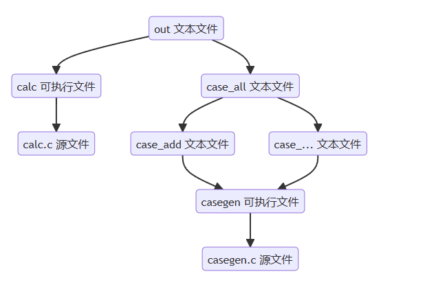

# <center>OS预习题2：Makefile</center>

​	此题只要观察题目中给出的依赖关系树形图即可解决，**我的思路是自底向上逐层构建依赖**



​	源代码为

```
.PHONY: clean
 
out: calc case_all
	./calc < case_all > out

case_all: case_add case_sub case_mul case_div
	cat case_add case_sub case_mul case_div > case_all

case_add: casegen
	./casegen "add" 100 > case_add

case_sub: casegen
	./casegen "sub" 100 > case_sub

case_mul: casegen	
	./casegen "mul" 100 > case_mul

case_div: casegen
	./casegen "div" 100 > case_div

calc: calc.c
	gcc -o calc calc.c

casegen: casegen.c
	gcc -o casegen casegen.c
   
clean:
    rm -f out calc casegen case_* *.o
```

* TIPS

  * 直接执行```make```相当于构建文件中第一个目标，在这里相当于```make out```

  * 关于```gcc -o```,```-o```选项为编译结果指定名称，我更喜欢下面写法

    ```
    gcc cal.c -o cal
    ```

  * 关于```Makefile```的模版

    ```
    <target>: <dependencies>
    <tab> <command1>
    ...
    <tab> <commandb>
    ```

  * 关于重定向输入与输出

    我们要为一个程序传递参数，这时可以使用重定向输入```<```，可以在后面直接给出，或者从文件中给出，例如上面代码中

    ```
    ./casegen "add" 100 > case_add
    ```

    若保存在文件中
    ```
    ./casegen < input.txt > case_add
    ```

    
