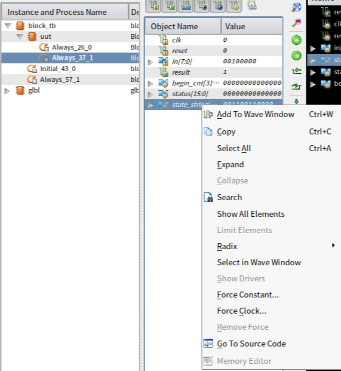
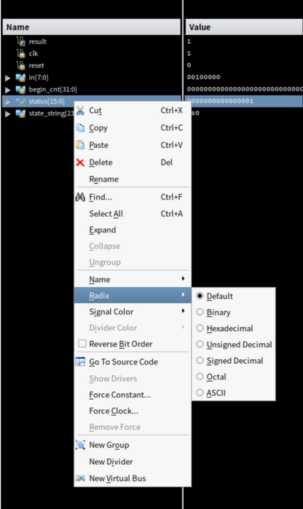

### verilog(P1课前复习)

**长文，做好战斗准备！**

#### 1.同步复位与异步复位

##### 1.同步复位

```verilog
//复位信号高电平有效
always@(posedge clk)
    begin
        if(clr)
            begin
               status <= 4'b0000; 
            end
        else 
            begin
                //statement
            end
    end
//复位信号低电平有效
always@(posedge clk)
    begin
        if(!clr)
            begin
               status <= 4'b0000; 
            end
        else 
            begin
                //statement
            end
    end
```

##### 2.异步复位

```verilog
//复位信号高电平有效
always@(posedge clk or posedge clr)
    begin
        if(clr)
            begin
                status <= 4'b0000;
            end
        else
            begin
                //statement
            end
    end
//复位信号低电平有效
always@(posedge clk or negedge clr)
    begin
        if(!clr)
            begin
                status <= 4'b0000;
            end
        else
            begin
                //statement
            end
    end
```

​	**异步复位将clr加入敏感符号列表**

#### 2.为状态机编写可显示状态名称的testbench

​	**编写testbench是我们在本地进行模块动态语法检查和功能检查的重要手段：一定要在本地编写testbench!不编写testbench的语法检查不完全！**编写testbench的一个重要目的是进行```debug```,但是```Isim```默认的仿真波形图只有输入变量和输出变量，引出第一步：在波形图中添加模块中变量进行查看。

##### 1.如何在波形图中添加其他变量

1. 如果在左侧页面没有```Instance and Process```窗口，左上方菜单栏:```View```->```panel```,添加想要查看的窗口
2. 在```Instance and Process```窗口中展开tb模块，展开uut实例，点击下面的选项，在右侧```Objects```窗口中就会出现此模块中包含的变量，右键变量名，选择```Add to wave window```即可加入到波形图中进行查看。实操如下图所示。



##### 2.如何显示出表示状态的字符串

​	我们知道，在编写```testbench```时我们不会额外引入变量，而只是对输入端口进行模拟，故如果想要在波形图中查看状态名称，就要在```verilog module```中添加用于存储与状态对应的字符串变量的寄存器变量，之后将这个变量添加到查看波形图中。添加变量并建立起与状态之间的对应关系如下例。

```verilog
`ifndef SYSTHESIS
reg [23:0] state_string;
always@(*)begin
    case(status):
         s0:state_string = "s0";
         s1:state_string = "s1";
        default:state_string = "s99";
        endcase
end
`endif
```

​	在波形图中显示的数值默认都是多位二进制，可以点击变量```右键->Radix```，将字符串更改为ASCII表示。



**注意：**

1. state_string的位宽由最大显示字符个数决定```1word = 8bits```,即```位宽 = 字符数*8```

2. 提交文件中编写此宏定义语句块并不会影响正常测评

##### 3.在testbench模块中模拟输入

​	这里直接给出例子，模拟比较简单，注意延迟时间的设置。

```verilog
module block_tb;
	// Inputs
	reg clk;
	reg reset;
	reg [7:0] in;
	// Outputs
	wire result;

	// Instantiate the Unit Under Test (UUT)
	BlockChecker uut (
		.clk(clk), 
		.reset(reset), 
		.in(in), 
		.result(result)
	);

	initial begin
		// Initialize Inputs
		clk = 0;
		reset = 1;
		in = 0;

		// Wait 10 ns for global reset to finish
		#10;
        
		// Add stimulus here
		#10 reset = 0;
		in = "a";
		#10 in = " ";
	end
      always #5 clk = ~clk;
endmodule
```

注意：

1. 时序逻辑中有reset信号的一定要初始化为1再修改为0
2. 在初始化模块外编写时钟信号```always #5 clk = ~clk```,这里表示时钟周期为5ns

#### 3.verilog代码规范

##### 1.变量命名

###### 1.信号名称采用全小写，单词之间下划线分隔，```snake_case```

###### 2.信号低电平有效时用_n后缀表示，```rst_n```

##### 2.组合逻辑

###### 1.采用```always```描述组合逻辑时，列表内用*而不是列举敏感信号

```verilog
//right
always@(*) begin
    if(rst_n)begin
        c = a + b;
    end
    else
        begin
            c = 1'b0;
        end
end

//worse
always@(a,b) begin
    if(rst_n)begin
        c = a + b;
    end
    else
        begin
            c = 1'b0;
        end
end
```

###### 2.always块中如果使用if,则每个分支下都需要进行赋值

###### 3.组合逻辑中只使用阻塞赋值=

###### 4.可以使用assign表示组合逻辑

###### 5.对于复杂表达式涉及到符号性，确定最外层表达式符号+向内传播，或者直接将有符号运算抽离出来设置变量（更加建议）

##### 3.时序逻辑

###### 1.一般情况下使用上升沿```posedge```进行触发

###### 2.只使用非阻塞赋值 <=

###### 3.使用localparam命名状态机各个状态

```verilog
// GOOD
localparam sInit = 2'd0;
localparam sIdle = 2'd1;
localparam sWork = 2'd2;
localparam sDone = 2'd3;
reg [1:0] state;
```

###### 4.不要在敏感列表以外的地方使用时钟信号

##### 5.不要在多个always块内为同一变量赋值

#### 4.数制与位拼接

​	在P1_Q3_ext一题中，我遇到了位拼接相关的问题，总结如下：

1. 在verilog语法中，当常量不说明位数时默认为32位，进制为十进制，故在位拼接中应尤其注意指明常量的位数
2. 截取某一信号的某几位``in[n:m]`` 表示,如果表示全部保留这个信号，直接用变量名表达```in```
3. 表示重复的位数，16{imm[15]}外也应有大括号，表达为``{16{imm[15]}}``

#### 5.关于assign与always@(*)——组合逻辑的转写

​	在P1课下提交的六指令ALU构造中，遇到了有关符号数处理的相关问题，在初始状态下的```assign+三目运算符+子表达式```的情况下很容易就将子表达式的符号性自顶向下传播没了```QWQ```导致运算结果错误，我的初版代码中，将表达式状态拆分为```assign+三目运算符+变量```的形式，即将运算提前存储在wire变量中,三目运算符实际上是对值进行选择，这样也就无所谓符号问题。

​	在复习过程中，我突然想到这种复杂的由多个三目运算符构成的表达式完全可以由分支结构代替，在编写的过程中我发现：

1. 在always块中进行赋值的只能为reg类型的变量，故需要设置新的变量来存储值，或者改变输出端口的数据类型(这两种方法都可以AC)
2. assign不能在always块或initial块中使用

```verilog
//将输出端口改为reg类型，直接在always块中进行赋值
module alu (
    input [31:0] A,
    input [31:0] B,
    input [2:0] ALUOp,
    output reg [31:0] C
);
always @(*) begin
    if(ALUOp == 3'b000)
     C = A + B;
    else if(ALUOp == 3'b001)
     C = A - B;
    else if(ALUOp == 3'b010)
     C = A & B;
    else if(ALUOp == 3'b011)
     C = A | B;
    else if(ALUOp == 3'b100)
     C = A >> B;
    else
     C = $signed(A)>>>B; 
end
endmodule

//设置中间变量寄存器，最后 assign C = tmp;
module alu (
    input [31:0] A,
    input [31:0] B,
    input [2:0] ALUOp,
    output [31:0] C
);
reg [31:0] tmp;
always @(*) begin
    if(ALUOp == 3'b000)
     tmp = A + B;
    else if(ALUOp == 3'b001)
     tmp = A - B;
    else if(ALUOp == 3'b010)
     tmp = A & B;
    else if(ALUOp == 3'b011)
     tmp = A | B;
    else if(ALUOp == 3'b100)
     tmp = A >> B;
    else
     tmp = $signed(A)>>>B; 
end
assign C = tmp;
endmodule
```

#### 6.组合逻辑语法和时序逻辑语法

**注意：verilog中无自增自减运算符**

##### 1.initial

​	initial后紧跟的语句或顺序语句块在硬件仿真开始时就会进行，且只会运行一次，可以用于为寄存器赋初值，initial块是不可综合的！因此，考虑到综合性，我们一般使用reset信号进行赋初值操作。

```verilog
reg a;
initial begin
    a = 1'b0;
end
```

##### 2.always

​	always块在时序逻辑和组合逻辑中都有应用，需要注意的是always块中不能使用assign语句。不能在多个always块中对一个变量进行赋值且always块中只能对reg型变量进行赋值。

```verilog
//组合逻辑  reg型数据与阻塞赋值配合
always@(*)
    begin
        a = A + B;
    end
//时序逻辑 非阻塞赋值
always@(posedge clk)
    begin
        a <= A + B;
    end
```

##### 3.if

​	```if-else if -else```模块只能出现在顺序块中，顺序块(以begin开始，以end表示结束),所有的else语句都应写出。

```verilog
//组合逻辑
always@(*)begin
    if(a>b)begin
        out = a;
    end
    else begin
        out = b;
    end
end
```

##### 5.case

​	case语句只能出现在顺序块中，分支也只能是语句或顺序块，case语句一定要注意编写default,不要忘记**endcase**!

```verilog
always@(posedge clk)
    begin
        case(data)
            0: out <= 4;
            1: out <= 5;
            2: out <= 2;
            3: out <= 1
            default : out <= 0;
        endcase
    end
```

##### 6.for

​	循环变量可以为integer或reg类型，使用reg类型作为循环变量时要合理设置位宽。

```verilog
module test(
    input [1:0] x,
    output reg [3:0] ans //将输出变量定义为reg类型可以直接在always中进行赋值
);
    integer i;//循环变量定义在always语句块之外
    always @(*) begin
        ans = 0;
        for(i=0;i<3;i=i+1)
            begin
                ans = ans + x;
            end
    end
endmodule
```

```verilog
//七人投票表决器
module vote7 (
    input [6:0] vote,
    output reg pass
);
    reg [2:0] sum;
    integet i;
    always@(vote)begin
        sum = 3'b000;
        for(i = 0; i < 7 ; i = i + 1)
            begin
                if(vote[i])
                    sum = sum + 1;
            end
        if(sum >= 3'd4) pass = 1'b1;
        else pass = 1'b0;
    end
endmodule
```

##### 7.while

```verilog
//统计八位二进制数中1的位数
module counts1_while(
    input clk,
    input [7:0] rega,
    output reg [3:0] count
);
    
    always@(posedge clk)begin:count1
        reg[7:0] tempreg;
        count = 0;
        tempreg = rega;
        while(tempreg)begin
            if(tempreg[0])
                count = count + 1;
            tempreg = tempreg >> 1'
        end
        end
endmodule
```

