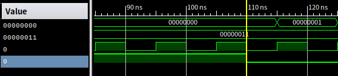
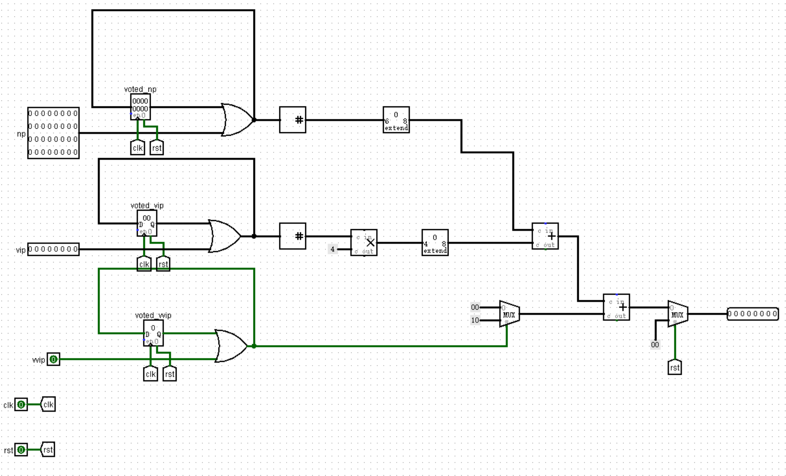

## P1_L1_voter_plus时序逻辑与组合逻辑的分模块编写&&阻塞赋值、非阻塞赋值

### 一.问题提出

​	在完成P1_L1_voter_plus一题时，由于需要对输入中1的位数进行统计，我第一次使用到for循环语句来统计输入中1的个数，原码类似于下例。

```verilog
module test_for (
  input [7:0] in,
  input clk,
  input rst,
  output reg [7:0] out
);
integer i;
  always @(posedge clk or posedge rst) begin : test
	if(rst)
	begin
	out <= 8'b0;
	end
	else
	begin
	for(i=0;i<8;i=i+1)
	begin
	if(in[i])
	out <= out + 1'b1;
	end
	 end
  end
endmodule
```

​	此段代码并不能成功实现在一个时钟周期内实现统计个数的功能。仿真如下:



​	**我们发现事实上一个周期过后只是将out+1;并没有实现累加功能，这就涉及到阻塞赋值与非阻塞赋值的问题**

### 二.阻塞赋值与非阻塞赋值

​	在代码规范中，我们知道应该在时序逻辑中使用非阻塞赋值，在组合逻辑中使用阻塞赋值。我们知道阻塞赋值是**实时更新**的，即等号右边的操作数会立即赋值给等号左边，而非阻塞赋值是并行的，在代码块中会保存所有的“右值”，在语句块结束后进行统一赋值。非阻塞赋值的赋值形式类似于寄存器，在下一周期进行值的更新。我们知道for循环相当于一种简写，如果将上述的for循环展开:

```verilog
out <= out + (in[0]==1'b1)?1'b1:1'b0;
out <= out + (in[1]==1'b1)?1'b1:1'b0;
out <= out + (in[2]==1'b1)?1'b1:1'b0;
......
```

​	显然在时序逻辑中构成对同一寄存器的多次赋值行为，引起竞争，最终表现为只将out+1。

​	因此我们知道在一个时钟周期内实现累加行为是不能通过时序逻辑实现的，只能通过组合逻辑

```verilog
 always@(*)begin
        cnt1 = 32'b0;
        for(i=0;i<32;i=i+1)
        begin
            if(voted_np[i])begin
                cnt1 = cnt1 + 1'b1;
            end
        end
    end
```

### 三.verilog描述电路的理解

​	我认为可以将非阻塞赋值认为是描述时序电路的方法，而将阻塞赋值理解为描述组合电路的方法。这样我们知道编写代码时如果混用阻塞赋值与非阻塞赋值可以理解为将时序电路与组合电路混用。如果我们能在编写verilog代码之前大致对电路的架构有一个构想，分清楚哪一些是组合逻辑，哪一些是时序逻辑，编写出的代码无疑是更加符合规范的。（从三段状态机中得到启发）



​	这是我根据voter_plus画出的logisim电路，通过电路图我们可以明确的知道涉及到投票状态存储的是时序电路，而对于result的计算则是实实在在的组合逻辑，这样我们就可以将时序逻辑与组合逻辑分开来编写，使得代码结构更加清晰。

```verilog
module VoterPlus (
    input wire clk,
    input wire reset,
    input wire [31:0] np,
    input wire [7:0] vip,
    input wire vvip,
    output [7:0] result
);
    integer i;
    integer j;

    reg [31:0] cnt1;
    reg [31:0] cnt2;
    reg cnt3;
    
    reg [31:0] voted_np;
    reg [7:0] voted_vip;
    reg voted_vvip;

    always @(posedge clk or posedge reset) begin
        if (reset) begin
            cnt1 <= 32'b0;
            cnt2 <= 32'b0;  
            cnt3 <= 1'b0;
            voted_np <= 32'b0;
            voted_vip <= 8'b0;
            voted_vvip <= 1'b0;
        end
        else begin
           voted_np<=voted_np|np;
           voted_vip<=voted_vip|vip;
           voted_vvip<=voted_vvip|vvip;
        end
    end
    always@(*)begin
        cnt1 = 32'b0;
        cnt2 = 8'b0;
        cnt3 = 1'b0;
        for(i=0;i<32;i=i+1)
        begin
            if(voted_np[i])begin
                cnt1 = cnt1 + 1'b1;
            end
        end

        for(j=0;j<8;j=j+1)
        begin
            if(voted_vip[j])begin
                cnt2 = cnt2 + 1'b1;
            end
        end
        if(voted_vvip)
        begin
            cnt3 = 1'b1;
        end
    end
    assign result = (reset)? 0 : cnt1 + cnt2*4 + cnt3*16;
endmodule
```

​	以上代码中，我们在时序逻辑中描述寄存器中状态的变化，计算过程则由组合逻辑完成，其中bit_adder的功能相当于由循环完成，由此我们对于verilog的理解更加加深，作为```HDL:hardware describe language```，编写```verilog```时心中有电路确实会使代码编写更加清晰。以后应当注意将组合逻辑和时序逻辑分开编写的写法！

### 附录：lpf大佬 && xmgg's code

以下为lpf大佬代码,同样是将组合逻辑和时序逻辑分开描述，但是没有使用for循环。

```verilog
module VoterPlus(
		input clk,
		input reset,
		input [31:0] np,
		input [7:0] vip,
		input vvip,
		output [7:0] result
    );
	reg [31:0] ii;
	reg [7:0] jj;
	reg kk;
	reg [7:0] s=0;
	assign result = 
			    	(reset == 1) ? 0 : 
					((ii[0]+ii[1]+ii[2]+ii[3]+ii[4]+ii[5]+ii[6]
					+ii[7]+ii[8]+ii[9]+ii[10]+ii[11]+ii[12]+ii[13]
					+ii[14]+ii[15]+ii[16]+ii[17]+ii[18]+ii[19]+ii[20]
					+ii[21]+ii[22]+ii[23]+ii[24]+ii[25]+ii[26]+ii[27]
					+ii[28]+ii[29]+ii[30]+ii[31])
					+(jj[0]+jj[1]+jj[2]+jj[3]+jj[4]+jj[5]+jj[6]+jj[7])*4
					+kk*16);
	always@(posedge clk or posedge reset) begin
		if(reset == 0)
		begin
		 ii <= ii | np;
		 jj <= jj | vip;
		 kk <= kk | vvip; 
		end
		else
		begin
		 ii <= 0;
		 jj <= 0;
		 kk <= 0; 
		end
	end
endmodule
```

xmgg's code：一段式

```verilog
module VoterPlus(
		input clk,
		input reset,
		input [31:0] np,
		input [7:0] vip,
		input vvip,
		output [7:0] result
    );
    reg [7:0] sum;
    reg [31:0] r_np;
    reg [7:0] r_vip;
    reg r_vvip;
    always@(posedge clk or posedge reset)
        if(reset)begin
            sum <= 8'b0;
            r_np <= 32'b0;
            r_vip <= 8'b0;
            r_vvip <= 1'b0;
        end
    else
        begin
            for(n=0;n<32;i=i+1)
                begin
                    if(np[n]&& !r_np[n])
                        begin
                            sum = sum + 8'd1;
                            r_np[n]=1'b1;
                        end
                end
            for(n=0;n<8;n=n+1)
                begin
                    if(vip[n]1&&!r_vip[n])
                        begin
                            sum = sum + 8'd4;
                            r_vip[n]=1'b1;
                        end
                end
            if(vvip && !r_vvip)
                begin
                    sum = sum + 8'd16;
                    r_vvip = 1'b1;
                end
        end
    assign result = sum;
```

