# 从0开始配龙芯杯vivado+vcs虚拟机环境(Ubuntu22.04)

## 0. mad

​	为了配置龙芯杯需要的vivado+vcs环境，这个繁琐的过程已经困扰了我两天，重新装了三次虚拟机系统，总结之后决定在配置的过程中写一篇笔记来记录过程，如果这次失败了也方便下一次再来。一开始我采用Ubuntu23.10，后来遇到各种不理解的报错，不知道怎么解决，我就都归结到Ubuntu版本过新上（恼），于是换成Ubuntu22.04镜像文件重新配置(QAQ)，（后来发现确实是因Ubuntu版本有一定问题），**所以一定要用Ubuntu22.04啊！！！**

* 环境的软件版本：

  * Vmware Workstation Pro 17

  * Ubuntu 22.04
  * vivado 2019.2
  * vcs 2018.09

## 1.虚拟机初始配置

### 1.配置中文输入法

​	一个新系统自然要先配置好中文输入法，我这里使用ibus框架。

#### 1.安装汉语支持

​	Settings——>Region&Language——>Manage Install Language——>Install/Remove Languages——>Chinese(simplified)——>重启系统

#### 2.安装ibus框架

```
sudo apt-get install ibus
sudo apt-get install ibus-pinyin
sudo ibus-setup#打开ibus设置界面
```

​	在打开的ibus设置界面中在```Input Method```一栏中添加中文输入法```Add——>Chinese——>Intelligent Pinyin```

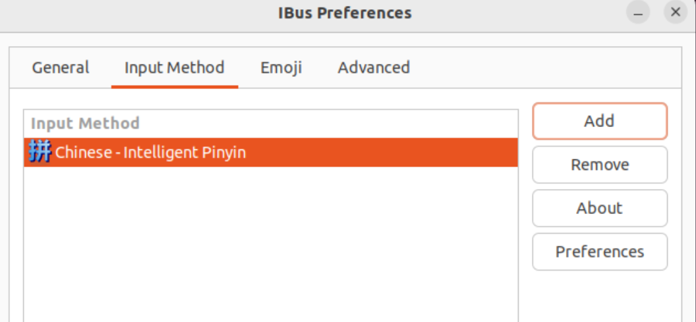

#### 3.设置系统变量

```
vim ~/.bashrc
#添加系统变量
export GTK_TM_MODULE=ibus
export XMODIFIERS=@im=ibus
export QT_IM_MODULE=ibus
############
source .bashrc
```

再次重启使系统变量生效

#### 4. add Input Source

```settings——>Keyboard——>Input Source——>add Chinese(Intelligent Pinyin)```

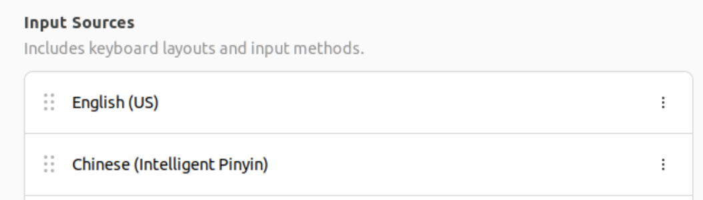

再次重启即可使用中文输入法

### 2.安装vmware-tools

​	vmware-tools是实现主机与虚拟机之间交互的重要软件，网上一些教程通过vmware station上方虚拟机选项卡中的重新安装vmware tools进行。我们可以发现此时该选项为灰色，即使通过网络上的种种办法可以改为黑色可选状态，但在安装过程中会报错Segmentation fault，实际原因是下载的版本过低，与当前系统不适配，我们使用手动命令行下载可以避免

```
sudo apt install open-vm-tools
sudo apt install open-vm-tools-desktop
###我这里运行到这里需要进行重启 否则会报错找不到包
sudo apt install gnome-shell-extension-prefs
sudo apt install nemo
```

* 在extensions应用程序中关掉Desktop icon NG(该程序在安装gnome-shell-extension后产生)

  

* 在startup application preference里增加Nemo Desktop程序(该程序在安装gnome-shell-extension之前就有)

  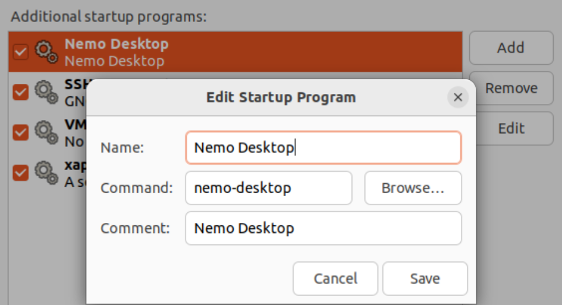

* 再次重启

​	至此我们实现了：

* 在主机与虚拟机之间复制粘贴
* 虚拟机窗口自适应大小
* 通过拖拽文件实现主机与虚拟机之间的复制

* **开启共享文件夹**

  * 在虚拟机设置中打开共享文件夹选项——>总是启用——>设置主机路径

  * 可以通过指令```ls /mnt/hgfs```查看是否设置成功

    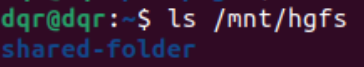

    可以看到我设置的共享文件夹名称为```shared-folder```

## 2. vivado2019.2安装

#### 1.安装设置

​	在龙芯杯北航云盘中提供了vivado2019.2的安装包，实际上对于龙芯杯我们只需要使用免费的wepack版本即可满足需求，安装需求设置如下，安装最终需要25.22G。

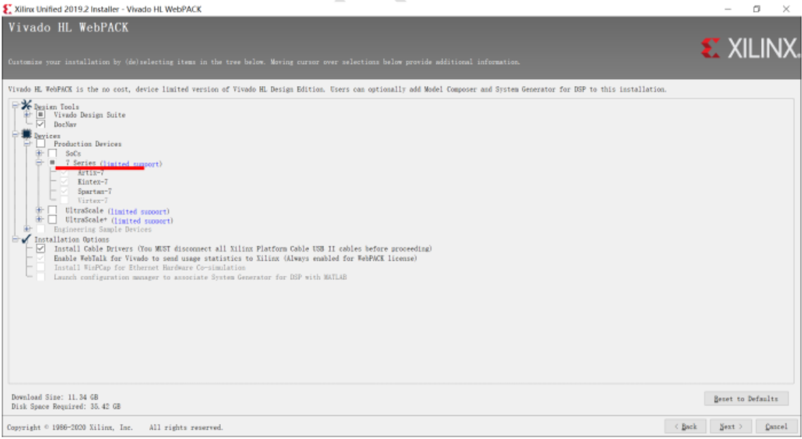

​	在安装路径上可以考虑新建一个edaTools文件夹，下设各子文件夹作为各开发软件安装路径。

* home/dqr/edaTools:
  * vivado
  * synopsys
  * ...

#### 2.安装步骤

* 下载北航云盘中提供的安装包

* 解压安装包（安装包默认下载在Downloads文件夹中）

* 进入解压后的文件夹运行

  ```
  chmod +x xsetup #修改脚本运行权限
  ./xsetup
  ```

​	弹出安装界面

* 按照安装设置安装

#### 3.启动vivado

​	在安装完成之后Ubuntu桌面上会产生vivado的图标，同时可以将vivado加入环境变量，通过在终端中启动vivado。

```
dqr@dqr:~$ vivado
```

​	将vivado加入环境变量

```
vim ~/.bashrc
########content########
# vivado
export PATH=$PATH:~/edaTools/vivado/Vivado/2019.2/bin/
alias vivado2019="~/edaTools/vivado/Vivado/2019.2/bin/vivado"
#####################
source ~/.bashrc #激活环境变量
```

#### 4.解决报错

##### 1.使用终端运行vivado时报错

```
application-specific initialization failed: couldn't load file "librdi_commontasks.so": libtinfo.so.5: cannot open shared object file: No such file or directory
```

* 解决方法

  ```
  sudo apt-get install libtinfo5
  ```

## 3. vcs安装和激活

#### 1.安装

* **需要安装scl和vcs**，安装链接：https://bhpan.buaa.edu.cn/link/AAE0F74DF381804CD0BCB7D7C0B89EC350

* 需要下面四个

  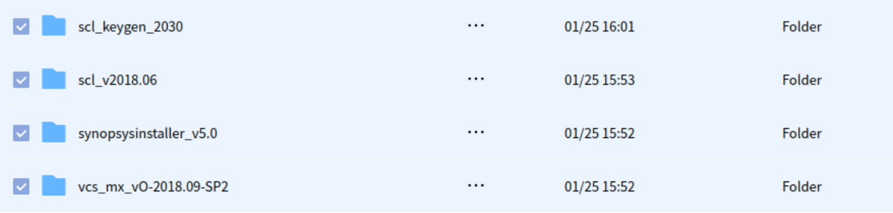

  * scl_keygen_2030是在主机windows上运行的破解软件
  * scl_v2018.06即为scl安装包
  * vcs_mx_vO-2018.09-SP2即为vcs安装包
  * synopsysinstaller_v5.0是scl和vcs的安装程序

* 使用snopsysinstaller安装scl和vcs

  在edaTools下建好synopsysinstaller文件夹和synopsys文件夹，将synopsysinstaller_v5.0解压到synopsysinstaller，运行

  ```
  dqr@dqr:~/edaTools/synopsysinstaller$ chmod +x SynopsysInstaller_v5.0.run 
  dqr@dqr:~/edaTools/synopsysinstaller$ ./SynopsysInstaller_v5.0.run
  ```

  安装路径默认回车，然后

  ```
  dqr@dqr:~/edaTools/synopsysinstaller$ ./setup.sh
  ```

  * 跳出安装界面，第一个配置页面直接next

  * 在此页面选择安装包位置，安装scl和vcs在此处同理，以scl为例

    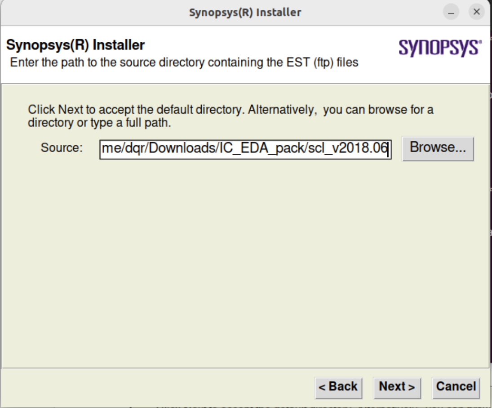

  * 选择安装目录，即我们刚才创建的synopsys文件夹

    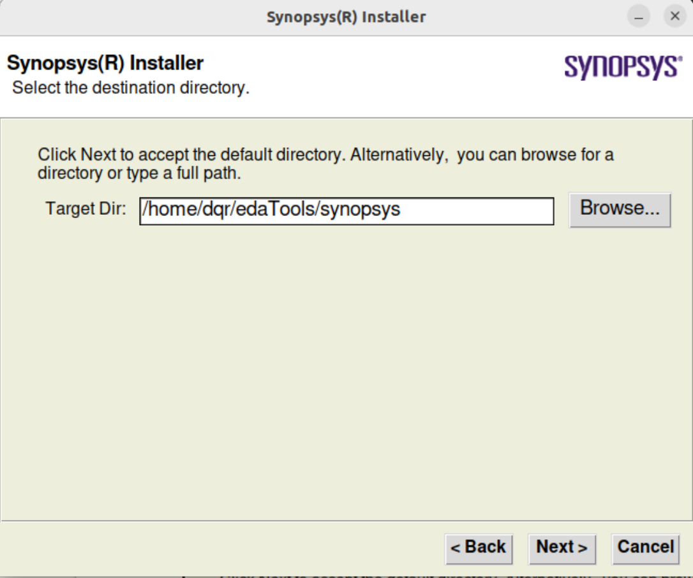

  * 此处打勾

    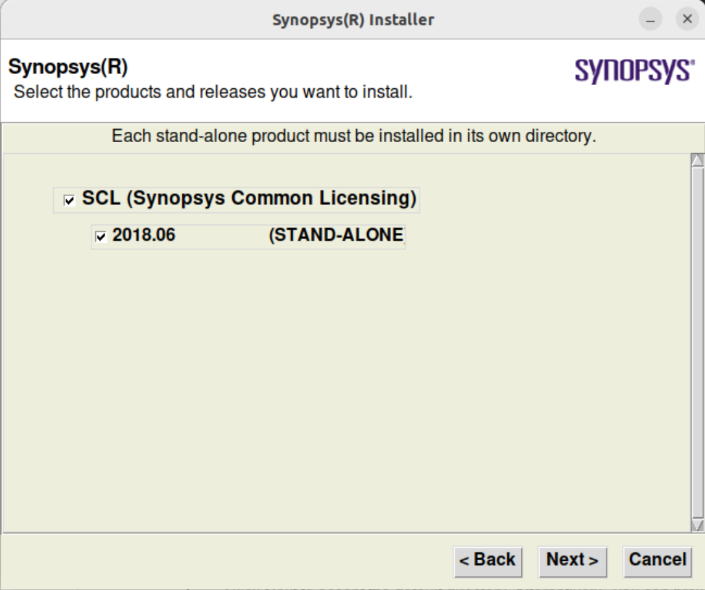

  * 重复一遍安装vcs（不必注意安装结束之后的报错）

#### 2.激活

​	windows下运行破解软件，填写虚拟机的hostname和mac地址

* hostname

  ```
  dqr@dqr:~/edaTools/synopsysinstaller$ hostname
  ```

* mac地址

  ```
  dqr@dqr:~$ sudo apt install net-tools
  dqr@dqr:~$ ifconfig
  ```

  **在显示的详细信息中mac地址为ether后面部分**

  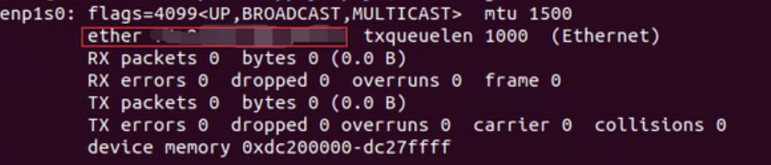

* 在破解软件中填写hostname和mac地址，注意填写mac地址时要去掉冒号，点击generate后copy

  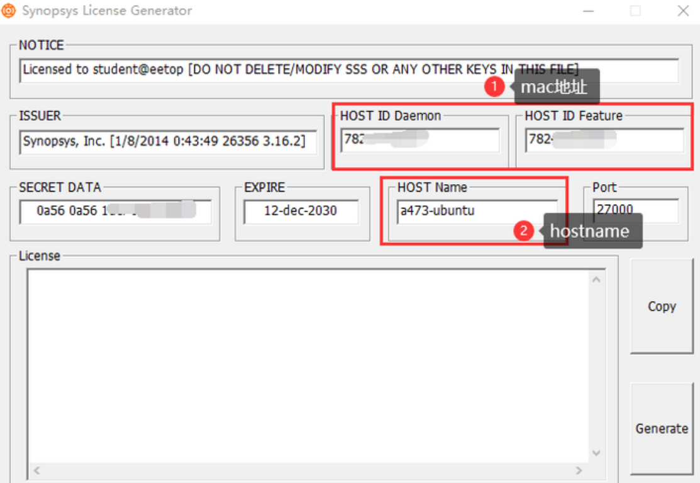

* 在**dqr@dqr:~/edaTools/synopsys/scl/2018.06/admin/license**下新建文件Synopsys.dat并粘贴文件内容，

  * vim创建新文件

    ```
    vim Synopsys.dat
    ```

  * 点击I进入插入模式、粘贴

  * 在文件第二行后添加自己安装的snpslmd软件路径

    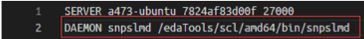

    我这里的路径是**~/edaTools/synopsys/scl/2018.06/linux64/bin/snpslmd**

  * Esc退出插入模式

  * ```:wq```进行保存

* 重启虚拟机，关闭占用27000端口的进程

  ```
  netstat -ap | grep 27000  
  kill -9 XXX(使用27000端口的进程ID)  
  ```

* 安装lsb-core库

  ```
  sudo apt-get install lsb-core
  ```

* 建立路径

  ```
  sudo mkdir /usr/tmp/
  sudo chmod 777 /usr/tmp/
  ```

* 运行进行激活

  ```
  ~/edaTools/synopsys/scl/2018.06/linux64/bin/lmgrd -c ~/edaTools/synopsys/scl/2018.06/admin/license/Synopsys.dat
  ```

  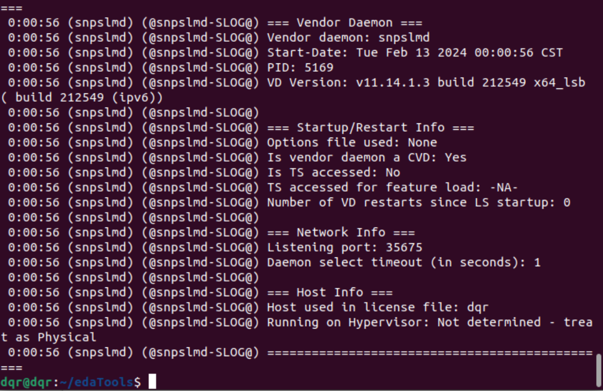

* 添加环境变量(```vim ./bashrc```)**其中hostname和具体路径需要修改**

  ```
  #synosys tolls list
  export VCS_HOME=/home/dqr/edaTools/synopsys/vcs-mx/O-2018.09-SP2
  export SCL_HOME=/home/dqr/edaTools/synopsys/scl/2018.06
  #dev
  export PATH=$PATH:$VCS_HOME/gui/dve/bin
  alias dve="dve"
  #vcs
  export PATH=$PATH:$VCS_HOME/bin
  alias vcs="vcs"
  #scl
  export PATH=$PATH:$SCL_HOME/linux64/bin
  export VCS_ARCH_OVERRIDE=linux
  #LICENCE
  export LM_LICENSE_FILE=27000@dqr
  alias lmg_vcs='lmgrd -c
  /home/dqr/edaTools/synopsys/scl/2018.06/admin/license/Synopsys.dat'
  ```

#### 3.进行测试

​	在cpucode中新建测试代码test.v

```
module test; 
  reg a, b; 
  wire c; 
 
  assign c = a & b; 
 
  initial begin 
    a = 0; 
    b = 0; 
    #10 a = 1; 
    #10 b = 1; 
    #10 $finish; 
  end 
endmodule 
```

* 运行时遇到报错(```vcs -full64 test.v```)：

  ```
  /bin/sh: 0: Illegal option -h
  ```

* 解决

  ```
  sudo rm -f /bin/sh
  sudo ln -s /bin/bash /bin/sh
  ```

* 测试成功（**运行测试代码之前一定要进行激活！**）

  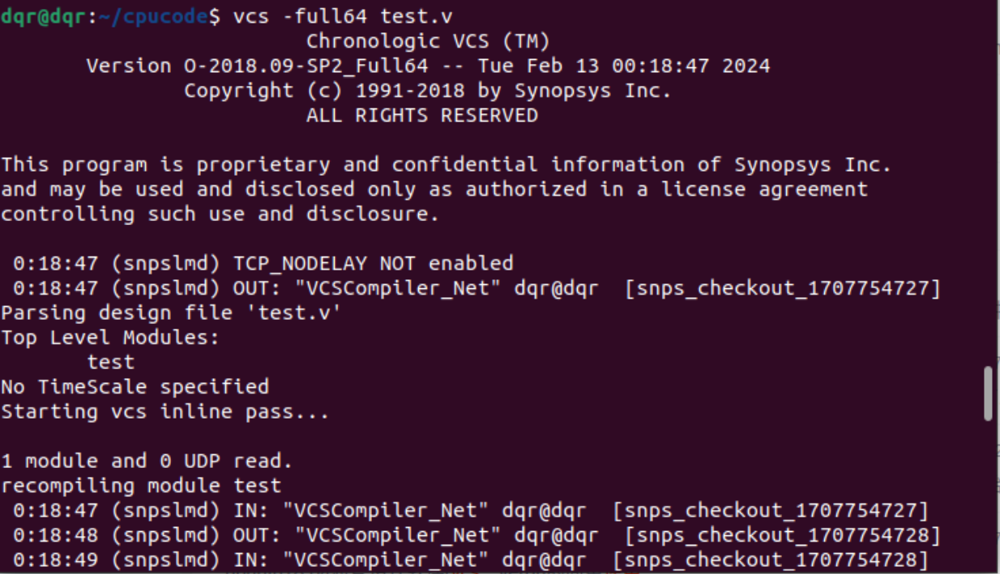

* 出现报错

  ```
  ../../OBJ/lib/saverestoreobj/obj-linux64/kernel.o:(.text+0xc41): undefined
  reference to pthread_yield
  ```

  * 解决

    ```
    dqr@dqr:~/edaTools/synopsys/vcs-mx$ mv O-2018.09-SP2/linux64/lib/vcs_save_restore_new.o O-2018.09-SP2/linux64/lib/vcs_save_restore_new.o.bak
    dqr@dqr:~/edaTools/synopsys/vcs-mx$ objcopy --redefine-sym pthread_yield=sched_yield O-2018.09-SP2/linux64/lib/vcs_save_restore_new.o.bak O-2018.09-SP2/linux64/lib/vcs_save_restore_new.o
    ```

* 出现报错

  ```
  /usr/bin/ld: /home/dqr/edaTools/synopsys/vcs-mx/O-2018.09-SP2/linux64/lib/libvcsnew.so: undefined reference to `vfs_set_dir_map'
  ```

  * 解决：增加编译选项，修改编译指令为

    ```
     vcs -full64 test.v -LDFLAGS -Wl,--no-as-needed
    ```

## 4.vivado+vcs联合仿真

#### 1.设置使用VCS编译

* 新建Compile Simulation Libraries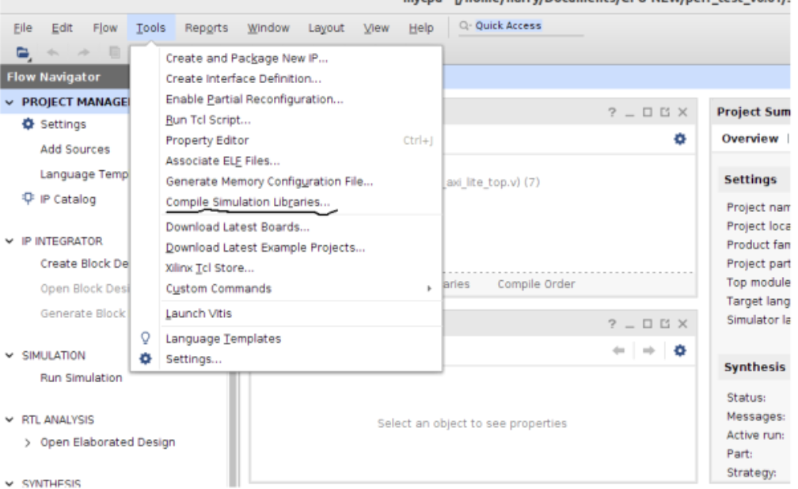

* 下图中进行的设置：

  * Simulation:VCS
  * Compiled library location:编译文件存放目录，我选择在documents下新建
  * Simulator execetable path:vcs的bin目录

  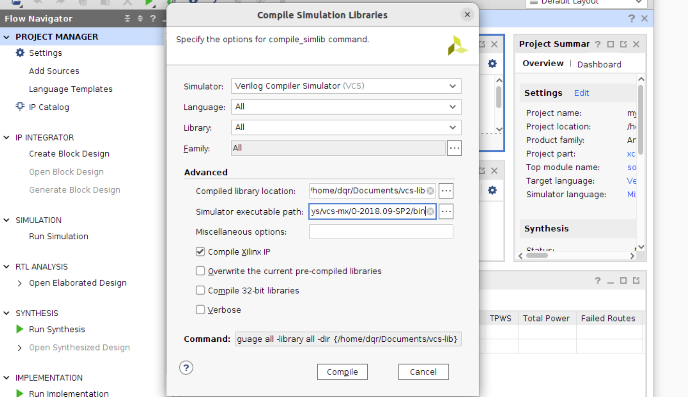

#### 2.设置使用VCS仿真

* settings

  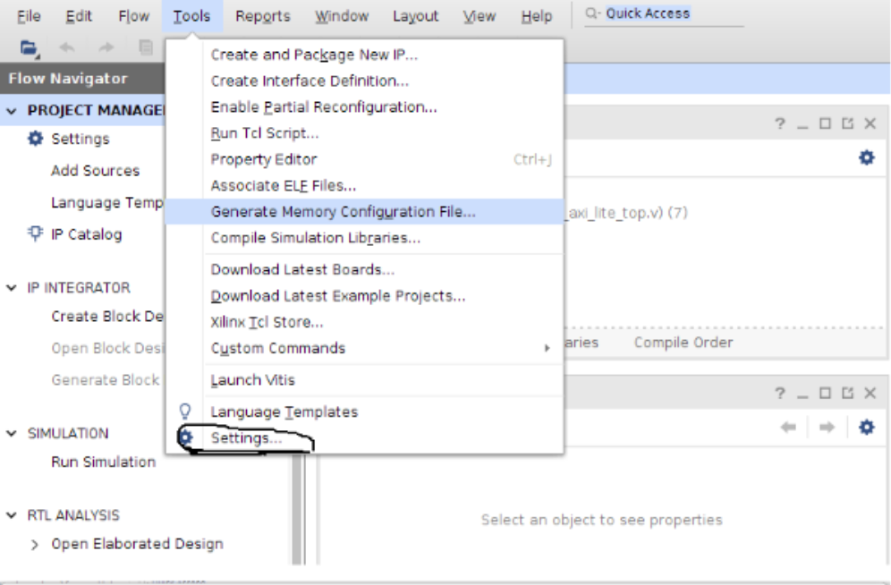

* 设置VCS路径和lib文件路径

  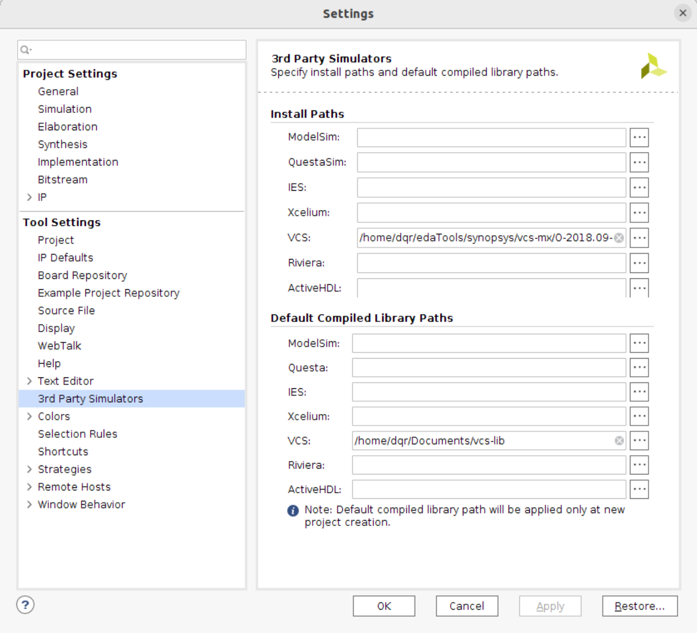

* 修改编译选项，防止报错```Unreferenced to ...```

  在三个箭头指向的选项中都将```more_options```设置为```-LDFLAGS -Wl,--no-as-needed```

  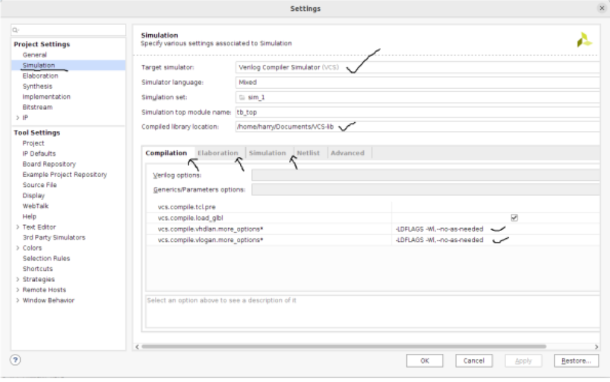

## 5.sublime text配置iverilog进行语法检查

* 安装package control

* 安装system verilog 进行语法高亮

* 安装verilog gadget

* 安装sublimelinter

* 安装sublimelinter-contrib-iverilog

* 运行脚本安装iverilog

  ```
  #!/usr/bin/env bash
  
  # This script compiles and installs the master branch iverilog.
  # Tested on Ubuntu 18.04
  
  SCRIPT_DIR="$( cd "$( dirname "${BASH_SOURCE[0]}" )" && pwd )"
  THREAD_CNT=$(getconf _NPROCESSORS_ONLN)
  
  INSTALL_DIR="/usr/local/iverilog"
  
  sudo apt install -y autoconf gperf
  
  pushd "/tmp" || exit
  
  wget "https://github.com/steveicarus/iverilog/archive/master.zip" -O "iverilog.zip"
  unzip "iverilog.zip"; rm -f "iverilog.zip"
  
  pushd "iverilog-master" || exit
  
  autoconf || exit
  ./configure --prefix="${INSTALL_DIR}" || exit
  make -j"${THREAD_CNT}" || exit
  sudo make install || exit
  
  popd || exit
  
  rm -rf "iverilog-master"
  
  popd || exit
  
  ```

* 插件和 iverilog 都安装完毕后在 Sublime 中点击```Preference -> Package settings -> SublimeLinter -> settings```，在打开页面的{ }中输入以下配置代码：(```/usr/local/iverilog/bin```为iverilog默认bin路径)
  ```
     "paths": {
         "linux": [
         		"/usr/local/iverilog/bin",
         ],
         "osx": [],
         "windows": [],
     },
   
     "linters": {
         "iverilog": {
             "disable": false,
             "args": ["-i"], // add the "-i" flag
             "excludes": [],
         },
     },
  ```

* 重启sublime text即可实现语法检查

  

  

  

  

  

  

  

  


