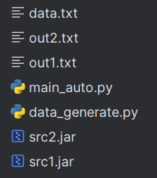

# <center>搭建OO测评机快速入门</center>

* 此篇文章来自宁然学长的b站教程

  https://www.bilibili.com/video/BV1hH4y1a7i6/?spm_id_from=333.999.0.0&amp;vd_source=b860e605d4fbe80fec0c35e8df181b3b

## 1.示例题目

**题目描述**

一开始给出一个长方体的长、宽、高。之后，有七种操作：

* 1.查询长
* 2.查询宽
* 3.查询高
* 4.更改长
* 5.更改宽
* 6.更改高
* 7.询问体积

**输入输出格式**

* 第一行给出length,width,height三个浮点数表示长宽高。
* 第二行一个整数n，表示操作数
* 接下来n行，每行一个操作数，分别代表上述其中操作
* 如果为4，5，6则在操作类型后有一个数，表示对应属性修改成的值
* 对于查询操作，每个查询操作输出一行，输出对应的值

## 2.示例源代码

​	看个乐子就行了...

**Main.java**

```java
import java.util.Scanner;

public class Main {
    public static void main(String [] args) {
        Scanner scanner = new Scanner(System.in);
        Myscanner myscanner = new Myscanner(scanner);
        myscanner.scan();
    }
}
```

**Myscanner.java**

```java
import java.util.Scanner;

public class Myscanner {
    private Scanner scanner;
    //构造方法

    public Myscanner(Scanner scanner) {
        this.scanner = scanner;
    }

    public void scan() {
        String[] a = scanner.nextLine().split(" +");
        double length = Double.parseDouble(a[0]);
        double width = Double.parseDouble(a[1]);
        double height = Double.parseDouble(a[2]);
        int n = Integer.parseInt(scanner.nextLine());
        for (int i = 0; i < n; i++) {
            String[] strings = scanner.nextLine().split(" +");
            int op = Integer.parseInt(strings[0]);
            if (op == 1) {
                System.out.println(length);
            } else if (op == 2) {
                System.out.println(width);
            } else if (op == 3) {
                System.out.println(height);
            } else if (op == 4) {
                length = Double.parseDouble(strings[1]);
            } else if (op == 5) {
                width = Double.parseDouble(strings[1]);
            } else if (op == 6) {
                height = Double.parseDouble(strings[1]);
            } else if (op == 7) {
                System.out.println(length * width * height);
            }
        }
    }
}

```

## 3.示例测评机代码

### 1.导出源代码jar包

* **使用IDEA完成**

* ```File ——> Project Structure ——> Artifacts ——> +JAR ——>from modules with dependencies——>选择默认主类```
* ```Build ——> build artifacts```

* 移动到测评机目录下

### 2.编写测评机代码

#### 1.编写随机数据生成器

​	**使用一个字符串变量存储构造出的数据，每一行用\\n隔开**

```python
import random

# 数据生成
ans = ""
init1 = random.uniform(1, 10)
init2 = random.uniform(1, 10)
init3 = random.uniform(1, 10)
ans += str(init1) + ' ' + str(init2) + ' ' + str(init3) + "\n"
n = random.randint(5, 100)
ans += str(n) + "\n"
# 可以调整各种指令出现的概率得到不同的数据强度
for i in range(n):
    op = random.randint(1, 7)  # 闭区间
    if 4 <= op <= 6:
        update = random.uniform(1, 10)
        ans += str(op) + " " + str(update) + "\n"
    else:
        ans += str(op) + "\n"

print(ans, end='')
```

#### 2.编写对拍程序

**验证程序正确性**

* 对拍
* 编写正确性判定程序

```python
import os

def isEqual() -> bool:
    # 字符串层级的相同
    f1 = open('out1.txt', 'r')
    f2 = open('out2.txt', 'r')
    lines1 = f1.readlines()
    lines2 = f2.readlines()
    if len(lines1) != len(lines2):
        print('lines count is not same!')
        return False
    for i in range(len(lines1)):
        if lines1[i] != lines2[i]:
            print(f'line{i} is not same!')
            return False
    return True


n = 1000
for i in range(n):
    # 将生成数据保存在文件 从文件中读取运行程序
    os.system('python data_generate.py > data.txt')
    os.system('java -jar src1.jar < data.txt > out1.txt')
    os.system('java -jar src2.jar < data.txt > out2.txt')
    if isEqual():
        print(f"data_{i} AC!")
    else:
        print(f"data_{i} error!")
        break
```

#### 3.最终文件结构


